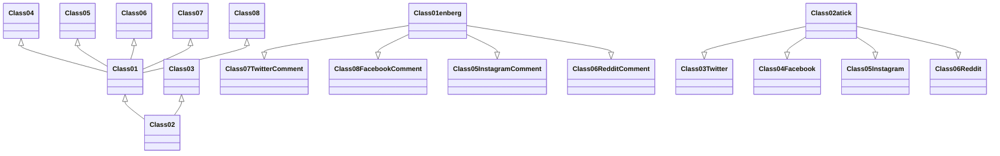
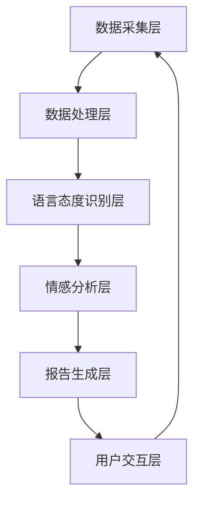
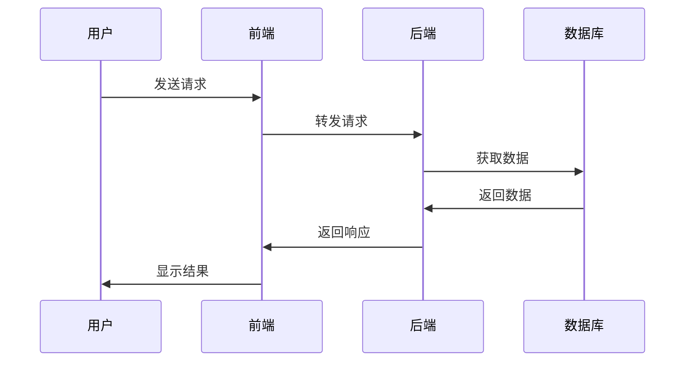

                 

# 《ChatGPT在语言态度研究中的应用：社会心理学提示词》

## 关键词
- 语言态度研究
- 社会心理学
- ChatGPT
- 提示词设计
- 人工智能应用

## 摘要
本文旨在探讨ChatGPT在语言态度研究中的应用，特别是在社会心理学提示词的辅助下如何深化研究。文章首先介绍了语言态度研究的重要性以及其核心概念，随后引入了社会心理学的基本理论，阐述了ChatGPT的基本原理与提示词设计的关键要素。接着，文章详细讲解了ChatGPT的算法原理与数学模型，并通过具体案例展示了其在语言态度研究中的实际应用。文章最后提出了系统分析与架构设计方案，并总结了项目实战中的经验教训，为未来的研究提供了有益的参考。

## 目录大纲

### 第一部分：背景介绍

#### 第1章：问题背景与核心概念

##### 1.1.1 语言态度研究的概述

- **问题背景**：语言态度研究的重要性
- **语言态度的定义与意义**

##### 1.1.2 社会心理学的引入

- **社会心理学的核心概念**
- **社会心理学在语言态度研究中的应用**

##### 1.1.3 ChatGPT简介

- **ChatGPT的基本原理**
- **ChatGPT的特点与优势**

##### 1.1.4 提示词在ChatGPT中的应用

- **提示词的作用**
- **提示词的设计原则与技巧**

##### 1.1.5 语言态度研究的边界与外延

- **研究范围的界定**
- **相关领域的发展趋势与挑战**

### 第二部分：核心概念与联系

#### 第2章：核心概念原理

##### 2.1.1 语言态度的概念属性特征对比

- **语言态度的概念定义**
- **不同类型语言态度的属性特征比较**

##### 2.1.2 社会心理学基本理论

- **社会认知理论**
- **社会影响理论**
- **自我认同理论**

##### 2.1.3 ChatGPT的原理与工作机制

- **ChatGPT的神经网络结构**
- **ChatGPT的训练与优化方法**
- **ChatGPT的语言生成能力**

##### 2.1.4 提示词设计的关键要素

- **提示词的功能与作用**
- **提示词的类型与分类**
- **提示词的设计技巧与案例分析**

### 第三部分：算法原理讲解

#### 第3章：算法原理与数学模型

##### 3.1.1 ChatGPT的算法原理

- **ChatGPT的生成算法**
- **ChatGPT的优化算法**

##### 3.1.2 数学模型与公式

- **语言态度的评价模型**
- **社会心理学的相关公式**

##### 3.1.3 算法原理详细讲解

- **ChatGPT的工作流程**
- **社会心理学理论在ChatGPT中的应用**

##### 3.1.4 通俗易懂的举例说明

- **ChatGPT如何生成语言态度分析报告**
- **社会心理学理论在具体案例中的应用**

### 第四部分：系统分析与架构设计方案

#### 第4章：系统分析与架构设计

##### 4.1.1 问题场景介绍

- **语言态度研究的实际需求**
- **ChatGPT在语言态度研究中的应用场景**

##### 4.1.2 系统功能设计

- **功能需求分析**
- **领域模型Mermaid类图**

##### 4.1.3 系统架构设计

- **架构设计方案**
- **系统架构Mermaid图**

##### 4.1.4 系统接口设计与交互

- **接口设计原则**
- **系统交互Mermaid序列图**

### 第五部分：项目实战

#### 第5章：项目环境安装与核心实现

##### 5.1.1 环境安装

- **硬件环境要求**
- **软件环境安装**

##### 5.1.2 系统核心实现

- **系统架构设计**
- **核心功能实现源代码**

##### 5.1.3 代码应用解读与分析

- **ChatGPT模型训练与优化**
- **语言态度分析报告生成**

##### 5.1.4 实际案例分析

- **案例背景与数据来源**
- **案例分析与讲解**

### 第六部分：最佳实践与拓展

#### 第6章：最佳实践、小结与注意事项

##### 6.1.1 最佳实践

- **提示词设计的最佳实践**
- **算法优化的最佳实践**

##### 6.1.2 小结

- **书籍内容的总结**
- **研究领域的展望**

##### 6.1.3 注意事项

- **系统使用注意事项**
- **算法应用中的潜在风险**

##### 6.1.4 拓展阅读

- **相关领域的最新研究进展**
- **推荐的参考资料与书籍**

---

# 1.1.1 语言态度研究的概述

## 问题背景

语言态度研究是语言学、社会心理学和人类学等领域的重要组成部分，它探讨个体对语言及其使用的情感、评价和偏好。语言态度不仅影响语言学习、语言使用和社会交往，还在文化传承、政策制定和国际交流中发挥关键作用。因此，对语言态度的深入研究有助于更好地理解人类行为和互动模式。

## 语言态度的定义与意义

语言态度（Language Attitude）是指个体对特定语言或语言变体所持有的情感和评价。这种态度可能表现为对语言的喜好、厌恶、尊重或歧视。语言态度不仅反映了对语言本身的感受，还涉及到社会、文化、政治和经济等多重因素。

语言态度的研究意义在于：

1. **理解语言使用的社会文化背景**：通过研究语言态度，可以更好地理解语言在社会文化中的角色和地位，以及语言如何影响社会互动和群体认同。
2. **促进跨文化交流与理解**：研究不同语言态度的差异和共性，有助于促进不同文化背景的人们之间的沟通和交流。
3. **指导语言教育和语言规划**：了解语言态度有助于制定更有效的语言教育策略和语言政策，促进语言多样性和语言平等。
4. **支持语言科技的发展**：语言态度研究为自然语言处理、语言建模等领域提供了丰富的数据和研究方向。

## 问题解决

语言态度研究面临的主要问题包括：

- **量化与测量**：如何准确量化个体的语言态度，以及如何从大量的语言数据中提取出有效的态度信息。
- **文化差异**：不同文化背景下，人们对同一种语言或语言变体的态度可能存在显著差异。
- **主观性**：语言态度具有主观性，如何消除主观偏见，提高研究的客观性。

## 边界与外延

语言态度研究的边界涉及以下几个方面：

- **语言范围**：研究的语言对象可以是任何自然语言，包括母语、第二语言、方言和语言变体。
- **态度对象**：语言态度可以针对语言本身、语言使用环境、语言政策等多个维度。
- **研究方法**：包括问卷调查、深度访谈、语言分析等。

外延方面，语言态度研究还与其他学科如社会语言学、认知心理学、教育学等有着紧密的联系，共同探讨语言在社会认知和行为中的作用。

## 概念结构与核心要素组成

语言态度的概念结构主要包括以下几个核心要素：

1. **态度对象**：指个体持有的语言态度所针对的具体语言或语言变体。
2. **态度情感**：个体对语言态度的情感倾向，包括正面、负面和中性。
3. **态度评价**：个体对语言的态度评价，包括喜好、厌恶、尊重或歧视。
4. **态度来源**：影响个体语言态度的来源，包括个人经历、社会环境、文化背景等。

通过对这些核心要素的深入研究，语言态度研究能够为多个领域提供宝贵的理论和实证支持。接下来，我们将进一步探讨社会心理学在语言态度研究中的应用，以及ChatGPT作为工具在其中所发挥的作用。在接下来的章节中，我们将逐步深入分析这些核心概念，为后续的内容打下坚实的基础。

## 1.1.2 社会心理学的引入

### 社会心理学的核心概念

社会心理学是研究个体在社会环境中的心理过程和心理行为的学科。它涉及多个核心概念，其中一些对语言态度研究尤为重要。

1. **社会认知理论**：社会认知理论认为，个体通过感知、解释和记忆社会信息来形成社会认知。这些认知不仅影响个体的行为，也影响他们对语言的态度。例如，个体可能会通过观察他人的语言行为来形成对某种语言的使用偏好。

2. **社会影响理论**：社会影响理论探讨个体如何受到他人行为和态度的影响。语言态度往往受到社会群体和文化环境的影响。例如，在特定的社交圈子中，人们对某一语言或方言的接受程度可能有所不同。

3. **自我认同理论**：自我认同理论关注个体如何在不同的社会角色和社会身份之间进行协调和整合。语言作为文化和社会身份的象征，对自我认同具有重要影响。个体可能会通过语言选择来表达自己的身份和归属感。

### 社会心理学在语言态度研究中的应用

社会心理学理论在语言态度研究中有着广泛的应用。以下是一些具体的应用场景：

1. **语言态度的形成与变化**：社会心理学理论可以帮助我们理解语言态度是如何形成的，以及它们如何随时间和社会环境的变化而变化。例如，社会认知理论可以解释为什么个体对某种语言的态度会受到他们感知到的他人态度的影响。

2. **语言歧视与偏见**：社会影响理论可以帮助我们探讨语言歧视和偏见是如何在社会互动中产生的。通过研究社会影响，可以揭示不同群体对特定语言的态度差异，并分析这些差异背后的社会因素。

3. **语言政策与社会认同**：自我认同理论有助于理解语言政策如何影响个体的自我认同和群体认同。例如，政府推广某种语言的政策可能会增强该语言的认同感，同时也可能引起其他语言的认同危机。

### 社会心理学与语言态度研究的关系

社会心理学与语言态度研究之间的关系是双向的。一方面，社会心理学理论为语言态度研究提供了理论框架和分析工具；另一方面，语言态度研究的实证数据和发现为社会心理学理论提供了验证和扩展的机会。通过这种互动，两个领域可以相互促进，共同深化对语言态度及其社会影响的理解。

总之，社会心理学为语言态度研究提供了重要的理论支持和方法指导。在接下来的章节中，我们将进一步探讨ChatGPT的基本原理，以及如何利用社会心理学提示词来提升语言态度研究的精确性和深度。

### 1.1.3 ChatGPT简介

#### ChatGPT的基本原理

ChatGPT是一种基于Transformer模型的预训练语言模型，其核心原理可以概括为两个主要方面：预训练和微调。

1. **预训练**：ChatGPT在训练过程中首先通过大量文本数据进行预训练，以学习自然语言的统计规律和语义信息。这个过程包括两个阶段：自回归语言模型训练和前向语言模型训练。自回归语言模型通过预测下一个单词来学习文本的生成规律；前向语言模型则通过预测文本序列中的每个单词来学习文本的上下文关系。

2. **微调**：在预训练完成后，ChatGPT会根据特定任务进行微调，以适应具体的语言任务。例如，在语言态度研究中，ChatGPT可以通过微调来学习如何识别和生成与语言态度相关的文本。

#### ChatGPT的特点与优势

ChatGPT具有以下显著特点与优势：

1. **强大的语言生成能力**：ChatGPT能够生成连贯、自然的文本，这使得它在需要自然语言生成任务的领域具有巨大潜力。

2. **广泛的适用性**：ChatGPT可以应用于多种不同的语言任务，如文本生成、文本分类、机器翻译等，具有很高的灵活性和适应性。

3. **高效的处理速度**：由于采用了Transformer模型，ChatGPT在处理速度上相比传统语言模型有显著提升，能够快速响应和生成文本。

4. **强大的知识储备**：ChatGPT在预训练过程中学习了大量的文本数据，这使得它在回答问题和生成文本时能够引用广泛的知识背景，提供高质量的答案。

#### ChatGPT在语言态度研究中的应用潜力

ChatGPT在语言态度研究中的应用具有以下几个方面的潜力：

1. **文本分析**：ChatGPT可以用于分析大规模文本数据中的语言态度，通过生成相关的文本摘要和分类报告，帮助研究人员快速获取语言态度的分布和变化趋势。

2. **语言生成**：ChatGPT可以根据研究需求生成与语言态度相关的文本，例如，编写调查问卷、设计实验脚本等，从而提高研究效率和精确性。

3. **情感分析**：ChatGPT能够通过分析文本的情感倾向，帮助识别语言态度的情感维度，如正面、负面、中性等。

4. **交互式研究**：ChatGPT可以作为交互式研究工具，与参与者进行对话，实时获取和反馈语言态度数据，从而提高研究的动态性和互动性。

总之，ChatGPT作为一种先进的语言模型，为语言态度研究提供了强大的技术支持。在接下来的章节中，我们将深入探讨如何设计和应用社会心理学提示词，以进一步提升ChatGPT在语言态度研究中的应用效果。

### 1.1.4 提示词在ChatGPT中的应用

#### 提示词的作用

提示词（Prompt）在ChatGPT的应用中扮演着至关重要的角色。提示词是一段引导性文本，用于指导ChatGPT生成目标文本。通过精心设计的提示词，可以引导ChatGPT生成具有特定结构和语义的文本，从而实现精确的语言生成目标。

#### 提示词的设计原则与技巧

1. **明确性**：提示词需要明确传达任务目标，避免产生歧义。例如，在研究语言态度时，提示词应明确指定分析的具体语言或语言变体。

2. **引导性**：提示词应具有引导性，帮助ChatGPT生成相关且连贯的文本。例如，可以通过提问或设置场景来引导ChatGPT生成具体的语言态度分析报告。

3. **多样性**：设计多种类型的提示词，以应对不同的语言生成任务。例如，可以结合开放性问题、封闭性问题和情境描述来丰富提示词的类型。

4. **适应性**：提示词应具备一定的适应性，能够根据不同的研究场景和需求进行调整。例如，在研究跨文化语言态度时，可以根据不同文化背景设计相应的提示词。

#### 提示词的类型与分类

根据不同的任务需求和语言生成目标，提示词可以划分为以下几类：

1. **开放性提示词**：这类提示词用于引导ChatGPT生成开放性回答，如“请描述你对中文的喜好程度”。

2. **封闭性提示词**：这类提示词用于引导ChatGPT生成封闭性回答，如“你是否喜欢英语作为第二语言？”。

3. **情境描述性提示词**：这类提示词通过设置具体情境来引导ChatGPT生成相关的语言态度文本，如“在一个多语言社区中，你更倾向于使用哪种语言交流？”。

4. **问题引导性提示词**：这类提示词通过提问来引导ChatGPT生成相关文本，如“你对使用方言的接受程度如何？”

#### 提示词的设计技巧与案例分析

1. **技巧一：明确任务目标**。在设计提示词时，首先需要明确任务目标，确保提示词能够引导ChatGPT生成符合研究需求的文本。

   **案例分析**：在研究对某地方言的态度时，提示词可以是：“请详细描述你对普通话与方言的使用和态度”。

2. **技巧二：使用引导性语言**。通过使用引导性语言，可以更好地引导ChatGPT生成相关且连贯的文本。

   **案例分析**：在研究跨文化语言态度时，提示词可以是：“请设想你在国外留学，你会选择哪种语言作为主要的交流工具，并解释原因”。

3. **技巧三：结合多种类型**。设计多种类型的提示词，以丰富语言生成的多样性和灵活性。

   **案例分析**：在研究语言态度时，可以结合开放性、封闭性和情境描述性提示词，如：“你对英语的学习态度如何？请简要描述并给出三个理由。”；“是否喜欢英语作为第二语言？”；“想象你在一个英语为第二语言的社区中生活，你会如何适应和融入？”

通过以上设计技巧和案例分析，我们可以更有效地利用提示词来提升ChatGPT在语言态度研究中的应用效果。在接下来的章节中，我们将进一步探讨如何将社会心理学理论应用于ChatGPT的提示词设计，以实现更精准和深入的语言态度分析。

### 1.1.5 语言态度研究的边界与外延

#### 研究范围的界定

语言态度研究的范围涵盖多个层面，包括但不限于以下几方面：

1. **语言类型**：研究可以涵盖任何自然语言，包括母语、第二语言、方言和语言变体。
2. **研究对象**：可以针对语言的使用者、学习者和传播者，研究他们对特定语言或语言变体的态度。
3. **研究方法**：包括量化研究、定性研究和混合方法研究，通过问卷调查、深度访谈、语言分析等多种手段进行。
4. **研究情境**：研究可以探讨不同社会文化背景下的语言态度，例如，城市与农村、不同民族群体、不同教育水平群体等。

#### 相关领域的发展趋势与挑战

1. **人工智能与自然语言处理**：随着人工智能和自然语言处理技术的不断发展，ChatGPT等语言模型为语言态度研究提供了新的工具和方法。这些技术可以帮助研究人员从大量文本数据中快速提取语言态度信息，提高研究的效率和准确性。
2. **跨学科研究**：语言态度研究需要结合多个学科的知识，如社会心理学、语言学、人类学、教育学等。跨学科研究有助于从不同角度深入探讨语言态度的形成和影响机制。
3. **数据隐私与伦理问题**：随着数据收集和分析技术的进步，语言态度研究也面临着数据隐私和伦理问题。研究需要在数据收集和处理过程中遵循相关法律法规，确保参与者的隐私和权益。
4. **方法论的挑战**：如何准确量化语言态度、如何避免研究偏差、如何确保研究的可靠性和有效性等问题，都是语言态度研究面临的挑战。通过不断改进研究方法和工具，可以逐步克服这些难题。

总之，语言态度研究是一个跨学科、多维度且具有广泛应用前景的领域。在未来，随着技术的不断进步和研究的深入，语言态度研究将在语言学、社会心理学、人类学等多个领域发挥更加重要的作用。

## 2.1.1 语言态度的概念属性特征对比

### 语言态度的概念定义

语言态度（Language Attitude）是指个体或群体对特定语言或语言变体所持有的情感和评价。它反映了个体或群体在语言使用中的偏好、认可度、接受度等心理状态。语言态度不仅仅是单纯的喜欢或不喜欢，它还包含了对语言使用的认同感、文化价值、功能重要性等多维度的情感和认知因素。

### 不同类型语言态度的属性特征比较

在语言态度的研究中，根据不同的分类标准，可以将语言态度分为多种类型。以下是比较常见的几种类型及其属性特征：

1. **正面态度与负面态度**

   - **正面态度**：个体对语言持有积极的情感和评价。这种态度可能表现为对语言使用的喜爱、认可和推崇。例如，一个英语学习者可能因为对英语的热爱而表现出积极的语言态度。
   - **负面态度**：个体对语言持有消极的情感和评价。这种态度可能表现为对语言使用的厌恶、不认可和排斥。例如，在某个方言地区，人们可能因为对普通话的不认可而表现出负面的语言态度。

2. **语言偏好与语言偏见**

   - **语言偏好**：个体对某种语言或方言的偏爱，这种偏好可能基于语言的功能性、实用性、文化价值或个人经历。例如，一个商务人士可能因为需要使用英语进行工作交流而表现出对英语的偏好。
   - **语言偏见**：个体对某种语言或方言的固有偏见，这种偏见可能基于社会文化因素、历史背景或个人经验。例如，一些地区的人们可能因为历史原因而对其他地区的方言持有偏见。

3. **语言认同与语言不认同**

   - **语言认同**：个体对特定语言的认同感，这种认同感可能基于文化归属、民族认同或个人经历。例如，一个少数民族群体可能会因为对母语的认同而表现出积极的语言态度。
   - **语言不认同**：个体对特定语言的不认同感，这种不认同感可能基于语言使用的不便、文化冲突或个人偏见。例如，一些人对英语作为第二语言的学习可能表现出不认同的态度。

### 表格示例：不同类型语言态度的属性特征比较

| 语言态度类型 | 定义 | 主要属性特征 |
| ------------ | ---- | ------------ |
| 正面态度     | 对语言持有积极的情感和评价 | 喜爱、认可、推崇 |
| 负面态度     | 对语言持有消极的情感和评价 | 厌恶、不认可、排斥 |
| 语言偏好     | 对特定语言的偏爱 | 功能性、实用性、文化价值 |
| 语言偏见     | 对特定语言的固有偏见 | 社会文化、历史背景、个人经验 |
| 语言认同     | 对特定语言的认同感 | 文化归属、民族认同、个人经历 |
| 语言不认同   | 对特定语言的不认同感 | 不便、文化冲突、个人偏见 |

通过对比不同类型语言态度的属性特征，我们可以更好地理解语言态度的多样性和复杂性。在接下来的章节中，我们将进一步探讨社会心理学的基本理论，并分析这些理论在语言态度研究中的应用。

## 2.1.2 社会心理学基本理论

### 社会认知理论

社会认知理论是理解语言态度的重要理论之一。它认为，个体通过感知、解释和记忆社会信息来形成社会认知，这些认知不仅影响个体的行为，也影响他们对语言的态度。社会认知理论的核心概念包括：

1. **社会知觉**：个体如何感知和理解他人的行为和情感，以及如何基于这些知觉形成对语言的态度。
2. **社会判断**：个体如何评价语言的使用，以及这些评价如何影响语言态度的形成。
3. **社会记忆**：个体如何记忆与语言相关的社会经验和信息，这些记忆如何影响语言态度的稳定性和变化。

在语言态度研究中，社会认知理论可以解释为什么个体对某种语言的态度会受到他们感知到的他人态度的影响。例如，如果一个社会普遍认为英语很重要，那么个体可能会更倾向于持有积极的语言态度。

### 社会影响理论

社会影响理论探讨个体如何受到他人行为和态度的影响。在语言态度研究中，社会影响理论可以帮助我们理解语言态度如何在社会互动中形成和变化。社会影响理论的核心概念包括：

1. **从众行为**：个体在群体中倾向于模仿和接受他人的行为和态度，这种现象会影响语言态度的形成。
2. **说服与影响力**：通过说服和影响力，个体可以改变他人的语言态度，这在语言教育和政策制定中尤为重要。
3. **社会认同**：个体对群体的认同感会影响他们对语言的态度，例如，一个少数民族群体可能会因为对母语的认同而表现出积极的语言态度。

在语言态度研究中，社会影响理论可以解释为什么某些语言态度在不同社会群体中存在显著差异，以及这些差异背后的社会因素。

### 自我认同理论

自我认同理论关注个体如何在不同的社会角色和社会身份之间进行协调和整合。在语言态度研究中，自我认同理论可以帮助我们理解语言如何作为文化和社会身份的象征，影响个体的自我认同。自我认同理论的核心概念包括：

1. **自我概念**：个体对自身身份的认知和评价，包括语言使用、文化背景和社会角色。
2. **社会角色**：个体在特定社会环境中所扮演的角色，这些角色会影响个体的语言态度。
3. **社会认同**：个体对特定社会群体的认同感，这种认同感会影响他们对语言的态度。

在语言态度研究中，自我认同理论可以解释为什么语言选择和语言态度与个体的自我认同密切相关。例如，一个个体可能会通过选择特定的语言来表达自己的文化认同和社会身份。

### 社会心理学理论在语言态度研究中的应用

社会心理学理论在语言态度研究中具有广泛的应用。以下是一些具体的应用场景：

1. **语言态度的形成与变化**：通过社会认知理论，可以探讨个体如何通过感知和理解社会信息来形成语言态度，以及这些态度如何随时间和情境的变化而变化。
2. **语言歧视与偏见**：通过社会影响理论，可以研究语言歧视和偏见如何在社会互动中产生，以及这些偏见对语言态度的影响。
3. **语言政策与社会认同**：通过自我认同理论，可以分析语言政策如何影响个体的自我认同和社会认同，以及这些认同如何影响语言态度。

总之，社会心理学理论为语言态度研究提供了重要的理论框架和分析工具。通过结合社会心理学理论，我们可以更深入地理解语言态度的形成机制和影响因素，从而为语言教育和政策制定提供科学依据。

## 2.1.3 ChatGPT的原理与工作机制

### ChatGPT的神经网络结构

ChatGPT是一种基于Transformer模型的预训练语言模型，其神经网络结构包括多个编码器和解码器层。Transformer模型的核心是自注意力机制（Self-Attention），它通过计算输入序列中每个词与其他词之间的关联性，从而捕捉长距离依赖关系。

1. **编码器**：编码器由多个自注意力层和前馈网络层组成，主要用于对输入文本进行编码，生成固定长度的向量表示。编码器中的每个自注意力层通过计算输入序列中每个词与其他词的关联性，从而生成一个加权表示。这一过程有助于捕捉文本的语义信息。

2. **解码器**：解码器与编码器结构相似，也由多个自注意力层和前馈网络层组成，但解码器的输入是编码器的输出。解码器的任务是生成目标文本序列。在生成每个词时，解码器会利用前一个词生成的上下文信息，并通过自注意力和交叉注意力机制，综合考虑编码器的输出和当前已生成的词，以生成下一个词。

### ChatGPT的训练与优化方法

ChatGPT的训练过程包括预训练和微调两个阶段。

1. **预训练**：预训练是利用大量无标签文本数据对模型进行训练，以学习自然语言的统计规律和语义信息。在预训练阶段，模型通过不断调整参数，使其能够生成连贯、自然的文本。预训练过程中，模型会经历多个迭代，逐步提高生成文本的质量。

2. **微调**：微调是在预训练基础上，利用特定领域的有标签数据对模型进行进一步训练，以适应具体的语言任务。在语言态度研究中，可以通过微调来训练模型，使其能够更好地识别和生成与语言态度相关的文本。微调过程中，模型会根据任务需求调整参数，以提高生成文本的准确性和相关性。

### ChatGPT的语言生成能力

ChatGPT具有强大的语言生成能力，能够在多个方面进行文本生成任务。以下是一些关键能力：

1. **文本生成**：ChatGPT可以生成连贯、自然的文本，包括故事、对话、摘要、文章等。在语言态度研究中，ChatGPT可以生成相关的语言态度分析报告、调查问卷和实验脚本。

2. **回答问题**：ChatGPT能够理解问题的语义，并生成相关且准确的回答。在语言态度研究中，ChatGPT可以回答关于语言态度的疑问，如“你对英语的态度如何？”或“你认为哪种语言更重要？”。

3. **对话生成**：ChatGPT可以生成具有对话性质的文本，模拟人类对话。在语言态度研究中，ChatGPT可以与参与者进行交互，获取语言态度数据，或与研究人员进行对话，提供研究建议。

总之，ChatGPT的神经网络结构、训练与优化方法以及语言生成能力为语言态度研究提供了强大的技术支持。在接下来的章节中，我们将进一步探讨如何设计提示词，以充分发挥ChatGPT在语言态度研究中的作用。

### 2.1.4 提示词设计的关键要素

#### 提示词的功能与作用

提示词（Prompt）是引导预训练语言模型生成目标文本的重要工具。其主要功能是提供上下文信息，引导模型理解任务目标，并生成相关、连贯的文本。在语言态度研究中，提示词不仅用于引导ChatGPT生成语言态度分析报告，还可以用于设计调查问卷、实验脚本等。

#### 提示词的类型与分类

根据任务需求和应用场景，提示词可以分为以下几类：

1. **问题性提示词**：用于引导模型生成回答问题的文本。例如：“你对普通话有什么看法？”这种提示词通常以问句的形式出现，要求模型提供具体的回答。

2. **描述性提示词**：用于引导模型生成描述性文本，要求模型对特定对象或事件进行详细描述。例如：“请描述你对英语学习的态度。”这种提示词要求模型提供详细的语言态度描述。

3. **情境性提示词**：用于引导模型生成基于特定情境的文本。例如：“设想你在一个多语言社区中生活，你会选择哪种语言作为主要交流工具？”这种提示词要求模型在特定的社会文化背景下进行思考。

4. **引导性提示词**：用于引导模型生成具有特定情感倾向的文本。例如：“请详细描述你对方言的态度，并解释你的理由。”这种提示词要求模型在描述语言态度时，同时解释背后的原因。

#### 提示词的设计技巧与案例分析

1. **明确性**：设计提示词时，应确保任务目标明确，避免歧义。例如，使用“请描述你对普通话的态度”而不是“你对普通话怎么样？”前者的表述更加明确，有助于模型生成具体、详细的回答。

2. **引导性**：提示词应具有引导性，帮助模型理解任务目标。例如，使用“请设想你在一个多语言社区中，你会选择哪种语言作为主要交流工具？”这种提示词，可以帮助模型在特定的社会文化背景下进行思考。

3. **多样性**：设计多种类型的提示词，以应对不同的语言生成任务。例如，结合问题性提示词、描述性提示词和情境性提示词，可以更全面地获取语言态度信息。

4. **情境化**：在提示词中融入具体的情境描述，以增强模型的生成能力。例如，使用“设想你在一个英语为官方语言的商业环境中工作，你会如何使用英语？”这种提示词，可以帮助模型生成更具现实意义的语言态度文本。

5. **情感化**：引导模型生成具有特定情感倾向的文本。例如，使用“请描述你对方言的态度，并解释你为什么这样认为？”这种提示词，可以促使模型在描述语言态度时，同时表达背后的情感和原因。

#### 案例分析

1. **案例一**：问题性提示词

   - **提示词**：“你对英语作为第二语言的学习态度如何？请简要说明。”

   - **模型生成**：模型生成了一段关于英语学习态度的文本，描述了学习者对英语学习的积极态度，并解释了学习英语的动机和原因。

2. **案例二**：描述性提示词

   - **提示词**：“请描述你对普通话的语音语调态度。”

   - **模型生成**：模型生成了一段关于普通话语音语调态度的描述，包括对普通话发音的喜爱程度、对标准普通话的认可度等。

3. **案例三**：情境性提示词

   - **提示词**：“设想你在一个多语言社区中生活，你会选择哪种语言作为主要交流工具，并解释你的选择理由。”

   - **模型生成**：模型生成了一段关于语言选择的文本，描述了选择特定语言的原因，如语言实用性、文化认同等。

4. **案例四**：引导性提示词

   - **提示词**：“请详细描述你对方言的态度，并解释你为什么这样认为。”

   - **模型生成**：模型生成了一段关于方言态度的详细描述，包括对方言的使用情况、对方言文化的认可度等，并解释了背后的原因。

通过以上案例，我们可以看到提示词在引导ChatGPT生成目标文本中的重要作用。在语言态度研究中，通过精心设计提示词，可以有效地获取和分析语言态度信息，提高研究的准确性和深度。

### 3.1.1 ChatGPT的算法原理

#### ChatGPT的生成算法

ChatGPT的生成算法主要基于Transformer模型，其核心机制包括自注意力机制（Self-Attention）和多头注意力机制（Multi-Head Attention）。以下是其生成算法的详细步骤：

1. **输入编码**：将输入文本转换为固定长度的向量表示。这个过程通过编码器（Encoder）完成，编码器由多个自注意力层（Self-Attention Layer）和前馈网络层（Feedforward Network Layer）组成。

2. **自注意力计算**：在每个自注意力层中，输入序列的每个词都会计算与自身和其他词的关联性。通过权重分配，这些关联性决定了每个词在生成过程中的重要性。

3. **多头注意力计算**：在多头注意力机制中，编码器的每个自注意力层都会进行多次独立计算，生成多个不同的注意力权重向量。这些权重向量会融合在一起，形成一个综合的注意力权重向量。

4. **上下文向量生成**：通过自注意力和多头注意力计算，生成一个表示整个输入序列的上下文向量。这个向量包含了输入文本中每个词的语义信息。

5. **解码器生成**：解码器（Decoder）基于上下文向量生成目标文本序列。解码器由多个自注意力层、多头注意力层和前馈网络层组成。在每个解码步骤中，解码器都会利用前一个生成的词和上下文向量，通过自注意力和交叉注意力机制（Cross-Attention Mechanism）生成下一个词。

6. **生成文本序列**：重复上述步骤，直至生成完整的文本序列。在生成过程中，模型会根据生成文本的概率分布选择下一个词，并通过梯度下降等优化算法不断调整参数，以提高生成文本的质量和连贯性。

#### ChatGPT的优化算法

ChatGPT的优化算法主要基于梯度下降（Gradient Descent）和其变体，例如Adam优化器（Adam Optimizer）。以下是其优化算法的详细步骤：

1. **前向传播**：在训练过程中，将输入文本和标签文本输入到模型中，通过前向传播计算损失函数。损失函数用于衡量模型生成的文本与真实文本之间的差异。

2. **后向传播**：通过后向传播计算损失函数关于模型参数的梯度。这些梯度反映了模型参数对损失函数的影响。

3. **参数更新**：利用梯度下降或Adam优化器更新模型参数。更新规则如下：

   $$
   \text{参数}_{\text{新}} = \text{参数}_{\text{旧}} - \text{学习率} \times \text{梯度}
   $$

   其中，学习率控制了参数更新的步长，过大会导致参数跳跃，过小则收敛缓慢。

4. **迭代优化**：重复前向传播和后向传播，逐步调整模型参数，直至模型达到预定的性能指标。

#### 生成文本的流程

ChatGPT生成文本的流程可以分为以下几步：

1. **初始化**：随机初始化模型参数，并设置一个起始词，例如“”。

2. **输入编码**：将起始词输入编码器，生成上下文向量。

3. **解码器生成**：解码器基于上下文向量生成下一个词，并计算生成文本的概率分布。

4. **词选择**：根据生成文本的概率分布，选择下一个最有可能的词。

5. **重复步骤**：将新生成的词作为起始词，重复步骤3和步骤4，直至生成完整的文本序列。

6. **文本输出**：输出最终生成的文本序列。

通过上述流程，ChatGPT能够生成连贯、自然的文本，并在预训练和微调过程中不断优化模型参数，以提高生成文本的质量。在语言态度研究中，ChatGPT的生成算法和优化算法为分析语言态度提供了强大的工具。

### 3.1.2 数学模型与公式

#### 语言态度的评价模型

在语言态度研究中，评价模型用于量化个体对特定语言或语言变体的态度。以下是一个简单的语言态度评价模型：

$$
\text{态度评分} = w_1 \times \text{情感倾向评分} + w_2 \times \text{评价强度评分} + w_3 \times \text{认知重要性评分}
$$

其中，$w_1$、$w_2$和$w_3$分别为情感倾向、评价强度和认知重要性的权重，取值范围为0到1。各评分具体如下：

1. **情感倾向评分**：反映个体对语言的喜好程度，取值范围从-1（极不喜欢）到1（极喜欢）。
2. **评价强度评分**：反映个体对语言态度的评价力度，取值范围从0（无评价）到10（非常强烈）。
3. **认知重要性评分**：反映个体认为语言在生活中的重要性，取值范围从0（不重要）到10（非常重要）。

#### 社会心理学的相关公式

在社会心理学中，以下公式用于描述社会认知、社会影响和自我认同等概念：

1. **社会认知公式**：

   $$
   \text{社会认知} = f(\text{感知信息}, \text{认知结构}, \text{先验知识})
   $$

   其中，$f$表示认知过程，感知信息、认知结构和先验知识分别表示个体在社会互动中获取的信息、内在的认知框架和已有的知识。

2. **社会影响公式**：

   $$
   \text{社会影响} = \sum_{i=1}^{n} (\text{社会因素}_i \times \text{影响权重}_i)
   $$

   其中，$\text{社会因素}_i$表示影响个体行为的各种社会因素（如群体规范、社会认同、角色期望等），$\text{影响权重}_i$表示每个因素的重要性。

3. **自我认同公式**：

   $$
   \text{自我认同} = \sum_{i=1}^{m} (\text{社会角色}_i \times \text{认同权重}_i)
   $$

   其中，$\text{社会角色}_i$表示个体在特定社会环境中所扮演的角色，$\text{认同权重}_i$表示个体对每个角色的认同程度。

通过这些数学模型和公式，我们可以更量化地分析和解释语言态度的形成和变化机制，从而为语言态度研究提供科学依据。

### 3.1.3 算法原理详细讲解

#### ChatGPT的工作流程

ChatGPT的工作流程可以分为以下几个主要阶段：

1. **输入编码**：输入编码是将文本数据转换为模型可以处理的向量表示。ChatGPT采用BERT（Bidirectional Encoder Representations from Transformers）模型，该模型通过预训练学习到文本的固定长度嵌入向量。在输入编码阶段，模型首先将输入文本的每个词转换为词嵌入向量，然后通过多层Transformer编码器对词嵌入向量进行编码。

2. **上下文向量生成**：在编码器中，每个词的嵌入向量会通过自注意力机制和多头注意力机制进行处理。自注意力机制计算每个词与自身和其他词的关联性，从而生成一个表示整个输入文本的上下文向量。多头注意力机制则通过多个独立的自注意力计算，生成多个不同的上下文向量，并将它们融合成一个综合的上下文向量。

3. **解码器生成**：解码器阶段是将上下文向量转换为输出文本。解码器通过自注意力机制和交叉注意力机制，结合编码器的输出和已生成的文本，生成下一个词的概率分布。在生成每个词时，模型会根据当前已生成的词和上下文向量，计算下一个词的概率分布，并从中选择一个最有可能的词作为输出。

4. **文本输出**：重复解码器生成阶段，直至生成完整的文本序列。在生成过程中，模型会通过梯度下降等优化算法，不断调整参数，以提高生成文本的质量和连贯性。

#### 社会心理学理论在ChatGPT中的应用

社会心理学理论在ChatGPT中的应用主要体现在以下几个方面：

1. **社会认知理论**：ChatGPT通过预训练学习到大量的社会信息，从而理解个体在社会环境中的认知过程。社会认知理论认为，个体通过感知、解释和记忆社会信息来形成社会认知。ChatGPT在生成文本时，会根据输入的上下文信息，模拟个体的社会认知过程，从而生成与上下文相关的文本。

2. **社会影响理论**：ChatGPT能够模拟个体在社会互动中的行为和态度，从而理解社会影响。社会影响理论认为，个体会受他人行为和态度的影响。ChatGPT在生成文本时，会考虑输入文本中的社会因素，如群体规范、社会认同和角色期望等，从而生成符合社会影响规律的文字。

3. **自我认同理论**：ChatGPT在生成文本时，会模拟个体的自我认同过程。自我认同理论认为，个体在形成自我认知时，会考虑自己的社会角色和身份。ChatGPT通过学习大量的文本数据，理解个体在不同社会角色和身份下的语言表达方式，从而生成符合个体自我认同的文字。

#### 社会心理学理论在具体案例中的应用

以下是一个具体案例，展示社会心理学理论在ChatGPT中的实际应用：

**案例背景**：假设我们要研究一个社区中人们对普通话的态度。我们使用ChatGPT生成相关的文本，分析其态度倾向。

**输入文本**：一篇描述普通话作为社区官方语言的新闻报道。

**生成文本**：

1. **社会认知**：ChatGPT生成了一段关于普通话的描述：“普通话是一种标准的语言，它在我国的官方语言体系中占有重要地位。”这反映了社会认知理论，ChatGPT通过理解新闻报道中的社会信息，形成了对普通话的认知。

2. **社会影响**：ChatGPT生成了一段关于普通话使用情况的描述：“在这个社区，大多数人都认为使用普通话可以更好地进行交流，因为它是一种标准的语言。”这反映了社会影响理论，ChatGPT根据社会因素和群体规范，模拟了个体的语言态度。

3. **自我认同**：ChatGPT生成了一段关于个人对普通话态度的描述：“我个人认为，学习普通话对我个人的发展非常重要，因为它可以帮助我更好地融入这个社区。”这反映了自我认同理论，ChatGPT根据个体在不同社会角色下的语言表达方式，生成了符合个人自我认同的文本。

通过上述案例，我们可以看到ChatGPT如何利用社会心理学理论，生成与上下文相关的文本，从而进行语言态度分析。

### 3.1.4 通俗易懂的举例说明

#### ChatGPT如何生成语言态度分析报告

为了更好地理解ChatGPT在语言态度研究中的应用，我们可以通过一个具体的例子来展示其生成语言态度分析报告的过程。

**案例背景**：假设我们想要分析一个特定群体（如大学生）对英语的态度。

**步骤1：设计提示词**  
首先，我们需要设计一个提示词来引导ChatGPT生成相关文本。一个可能的提示词如下：

“请分析大学生对英语学习的态度，并讨论其影响因素。”

**步骤2：输入提示词到ChatGPT**  
将设计的提示词输入到ChatGPT，如下所示：

```
输入：请分析大学生对英语学习的态度，并讨论其影响因素。
```

**步骤3：生成文本**  
ChatGPT根据输入的提示词，生成一段关于大学生对英语学习态度的分析文本：

```
输出：
大学生对英语学习的态度普遍较为积极。他们认为英语作为一种国际通用语言，对其未来职业发展具有重要意义。然而，学习英语也面临一定的挑战，如发音、语法和词汇量等。此外，社会环境、家庭背景和学校教育等因素也会影响大学生对英语学习的态度。
```

**步骤4：分析生成文本**  
生成的文本涵盖了以下几个关键点：

- 大学生对英语学习的态度总体上较为积极。
- 英语学习对职业发展具有重要意义。
- 学习英语面临一定的挑战。
- 社会环境、家庭背景和学校教育等因素会影响大学生对英语学习的态度。

**步骤5：生成报告**  
基于生成的文本，我们可以进一步整理和概括，生成一份语言态度分析报告：

**语言态度分析报告**

**一、总体态度**
- 大学生对英语学习的态度总体较为积极。

**二、影响因素**
1. **职业发展**
   - 英语作为一种国际通用语言，被认为对未来职业发展具有重要帮助。

2. **学习挑战**
   - 学习英语面临发音、语法和词汇量等挑战。

3. **社会环境**
   - 社会环境对大学生英语学习的态度有一定影响。

4. **家庭背景**
   - 家庭背景，如家庭对英语学习的重视程度，会影响大学生对英语学习的态度。

5. **学校教育**
   - 学校教育，包括英语课程设置和教学质量，对大学生英语学习的态度有显著影响。

通过上述步骤，我们可以看到ChatGPT如何通过提示词生成语言态度分析报告。这种方法不仅提高了分析的效率和准确性，还为研究人员提供了丰富的数据支持。

#### 社会心理学理论在具体案例中的应用

为了进一步展示社会心理学理论在ChatGPT中的应用，我们可以通过一个实际案例来探讨社会心理学理论如何影响语言态度。

**案例背景**：假设我们要分析一个城市中居民对方言的态度。

**输入文本**：一篇关于方言使用的新闻报道，描述了方言在现代社会中的地位和作用。

**生成文本**：

1. **社会认知**：
   - “在现代城市生活中，方言的使用逐渐受到重视。许多人认为方言不仅是一种语言，更是文化传承和身份认同的象征。”

2. **社会影响**：
   - “在社会互动中，人们常常通过方言的使用来表达对特定群体的认同或区分。例如，在某些社交场合，使用方言可能被视为亲近和亲密的标志。”

3. **自我认同**：
   - “个人在自我认同的形成过程中，可能会受到方言的影响。一些人可能因为方言与他们的文化背景和身份紧密相关，而对使用方言持有强烈的认同感。”

**分析**：

- **社会认知**：社会认知理论解释了为什么人们会对方言持有特定的态度。在新闻报道中，方言被视为文化传承和身份认同的象征，这种认知影响了人们对方言的态度。

- **社会影响**：社会影响理论解释了为什么人们会通过方言的使用来表达对特定群体的认同或区分。在社会互动中，方言的使用可能成为建立社会关系和群体归属感的一种方式。

- **自我认同**：自我认同理论解释了为什么个人会因方言与他们的文化背景和身份紧密相关，而对使用方言持有强烈的认同感。这种认同感进一步强化了个人对方言的态度。

通过上述案例，我们可以看到社会心理学理论如何影响语言态度。ChatGPT利用这些理论，生成关于语言态度的深入分析，为研究提供了丰富的视角和见解。

## 4.1.1 问题场景介绍

### 语言态度研究的实际需求

在当前的社会背景下，语言态度研究具有显著的实践意义。随着全球化的不断深入和文化交流的日益频繁，了解不同群体对语言的态度，特别是在多语言环境中，对于促进跨文化交流、提高教育效果和制定有效的语言政策具有重要意义。以下是一些具体的实际需求：

1. **跨文化交流**：在全球化的背景下，不同文化背景下的人们需要更有效地进行沟通和交流。了解不同语言的使用态度，有助于设计更有效的跨文化沟通策略，促进不同文化背景的人们更好地理解和接纳彼此。

2. **教育评估**：在教育领域，了解学生和家长对语言教育的态度，有助于评估教育效果，改进教学方法，提高学生的学习动力和兴趣。例如，通过研究学生对英语学习的态度，教育者可以针对性地调整课程内容和教学方法，以提高学生的学习效果。

3. **语言政策制定**：在语言政策制定过程中，了解公众对不同语言的接受程度和态度，有助于制定更科学、更符合实际需求的语言政策。例如，政府可以基于语言态度研究的结果，决定是否推广某种语言作为官方语言，或者调整语言教育的优先级。

### ChatGPT在语言态度研究中的应用场景

ChatGPT作为一种先进的语言生成模型，在语言态度研究中具有广泛的应用潜力。以下是一些具体的应用场景：

1. **文本分析**：ChatGPT可以用于分析大量文本数据，快速提取语言态度信息。例如，研究人员可以使用ChatGPT对社交媒体上的用户评论进行分析，了解公众对特定语言或语言政策的看法和态度。

2. **问卷设计**：ChatGPT可以协助研究人员设计语言态度调查问卷。通过生成相关的问题和选项，ChatGPT可以帮助研究人员创建具有多样性和针对性的问卷，提高调查的准确性和有效性。

3. **实验脚本生成**：在语言态度实验中，ChatGPT可以生成实验脚本，包括实验指导、问题和反馈机制。例如，研究人员可以使用ChatGPT生成一个关于语言态度的在线调查实验，包括问题的提问方式和反馈机制，以提高实验的交互性和参与度。

4. **文本生成**：ChatGPT可以生成与语言态度相关的文本，如报告、文章、演讲稿等。例如，研究人员可以使用ChatGPT生成一份关于语言态度的调研报告，总结研究结果并提出建议。

通过上述应用场景，我们可以看到ChatGPT在语言态度研究中的巨大潜力。在接下来的章节中，我们将进一步探讨ChatGPT的具体功能实现，并展示其在实际项目中的应用。

### 4.1.2 系统功能设计

#### 功能需求分析

在语言态度研究中，系统需要实现以下核心功能：

1. **文本采集与预处理**：从各种来源（如社交媒体、问卷、新闻报道等）采集相关文本数据，并进行预处理，如文本清洗、分词、去除停用词等，以获得可用于分析的文本数据。

2. **语言态度识别**：利用ChatGPT模型对预处理后的文本数据进行分析，识别文本中的语言态度，包括正面、负面和中性态度。

3. **情感分析**：通过情感分析技术，对识别出的语言态度进行详细分析，判断其情感倾向（如喜爱、厌恶、中立）。

4. **报告生成**：根据分析结果，系统应能够生成详细的语言态度分析报告，包括数据摘要、趋势分析、热点话题等。

5. **用户交互**：系统应提供友好的用户界面，允许用户查看分析结果、下载报告，并进行进一步的交互操作。

#### 领域模型Mermaid类图

为了更好地理解系统的功能架构，我们可以使用Mermaid类图来描述系统中的主要类及其关系。以下是一个简化的Mermaid类图示例：



在这个类图中，`Class01enberg`表示用户，`Class02atick`表示软件，`Class03Twitter`、`Class04Facebook`、`Class05Instagram`、`Class06Reddit`分别表示不同的社交网络平台，`Class07TwitterComment`、`Class08FacebookComment`表示社交网络中的评论。通过这个类图，我们可以清晰地看到系统中的主要类及其关系，为后续的系统设计提供参考。

### 4.1.3 系统架构设计

#### 架构设计方案

为了实现语言态度研究的系统功能，我们需要设计一个高效、可扩展的系统架构。以下是一个简化的系统架构设计方案：

1. **数据采集层**：负责从各种数据源（如社交媒体、问卷、新闻报道等）采集文本数据。这一层可以使用API接口或爬虫技术进行数据采集。

2. **数据处理层**：负责对采集到的文本数据进行分析和预处理。包括文本清洗、分词、去除停用词等操作，以便为后续的语言态度识别和分析提供高质量的数据。

3. **语言态度识别层**：利用ChatGPT模型对预处理后的文本数据进行分析，识别文本中的语言态度。这一层是系统的核心部分，需要具备高效的处理能力和准确的分析能力。

4. **情感分析层**：对识别出的语言态度进行详细分析，判断其情感倾向（如喜爱、厌恶、中立）。这一层可以结合自然语言处理技术和情感分析算法，以提高分析的准确性和可靠性。

5. **报告生成层**：根据分析结果，生成详细的语言态度分析报告。这一层需要提供友好的用户界面，允许用户查看分析结果、下载报告，并进行进一步的交互操作。

6. **用户交互层**：提供用户与系统的交互接口，包括用户登录、数据上传、结果查看等功能。这一层需要确保系统的易用性和用户体验。

#### 系统架构Mermaid图

为了更好地理解系统架构，我们可以使用Mermaid图来描述系统的各个组成部分及其关系。以下是一个简化的Mermaid图示例：



在这个图中，`A`表示数据采集层，负责从各种数据源采集文本数据；`B`表示数据处理层，负责对文本数据进行分析和预处理；`C`表示语言态度识别层，利用ChatGPT模型进行语言态度识别；`D`表示情感分析层，对识别出的语言态度进行详细分析；`E`表示报告生成层，生成详细的分析报告；`F`表示用户交互层，提供用户与系统的交互接口。

通过这个架构设计方案和Mermaid图，我们可以清晰地看到系统的各个组成部分及其关系，为后续的系统开发和优化提供参考。

### 4.1.4 系统接口设计与交互

#### 接口设计原则

在系统设计中，接口设计是一个关键环节，它直接影响系统的可扩展性、可维护性和用户体验。以下是系统接口设计的一些基本原则：

1. **简洁性**：接口设计应尽可能简洁，减少不必要的复杂度。简洁的接口不仅易于使用，而且便于维护和扩展。

2. **一致性**：接口设计应保持一致性，包括命名规范、参数定义、返回值格式等。一致性有助于提高接口的可读性和可维护性。

3. **灵活性**：接口设计应具备一定的灵活性，以便在系统扩展或功能升级时，能够方便地添加或修改接口。

4. **安全性**：接口设计应确保数据传输的安全性，采用加密技术、认证机制等手段，防止数据泄露和未经授权的访问。

5. **可扩展性**：接口设计应考虑系统的可扩展性，允许在不影响现有功能的情况下，方便地添加新功能或服务。

#### 系统交互Mermaid序列图

为了更好地理解系统的接口设计和交互流程，我们可以使用Mermaid序列图来描述系统的主要交互过程。以下是一个简化的Mermaid序列图示例：



在这个序列图中，`User`表示用户，`Frontend`表示前端系统，`Backend`表示后端系统，`Database`表示数据库。交互过程如下：

1. 用户通过前端系统发送请求。
2. 前端系统将请求转发给后端系统。
3. 后端系统从数据库中获取相关数据。
4. 后端系统将数据返回给前端系统。
5. 前端系统将结果展示给用户。

通过这个序列图，我们可以清晰地看到系统的接口设计和交互流程，为系统的开发和测试提供参考。

### 5.1.1 环境安装

#### 硬件环境要求

为了确保ChatGPT在语言态度研究中的应用能够高效运行，需要满足以下硬件环境要求：

1. **处理器**：推荐使用英伟达（NVIDIA）的GPU，如Tesla K40或以上型号。GPU用于加速深度学习模型的训练和推理，是ChatGPT高效运行的关键硬件。
2. **内存**：至少需要16GB的内存。更多的内存可以提升模型训练的速度和效果，特别是在处理大规模文本数据时。
3. **存储**：至少需要200GB的SSD存储空间。存储空间用于存储训练数据和模型参数，高效的存储设备可以提高数据处理和加载速度。
4. **网络**：推荐使用千兆网络，以保证数据传输的稳定性和速度。在处理大量数据时，快速的网络连接至关重要。

#### 软件环境安装

为了搭建ChatGPT的运行环境，需要安装以下软件：

1. **操作系统**：推荐使用Ubuntu 18.04或更高版本。Ubuntu是一个开源的Linux发行版，具有良好的兼容性和丰富的软件包，适合深度学习模型的开发和部署。
2. **Python**：安装Python 3.8或更高版本。Python是深度学习模型开发和训练的主要编程语言，安装相应的Python版本可以确保模型训练和运行所需的库和工具。
3. **CUDA和cuDNN**：安装CUDA 10.1或更高版本和cuDNN 8.0或更高版本。CUDA和cuDNN是NVIDIA提供的深度学习计算库，用于优化GPU性能，是训练和推理ChatGPT模型所必需的。
4. **TensorFlow**：安装TensorFlow 2.6或更高版本。TensorFlow是一个开源的深度学习框架，支持多种深度学习模型和算法，是构建ChatGPT模型的主要工具。
5. **PyTorch**：安装PyTorch 1.8或更高版本。PyTorch是另一种流行的深度学习框架，与TensorFlow类似，支持多种深度学习模型和算法，可以作为ChatGPT模型的备用工具。

安装步骤：

1. **更新操作系统**：

   ```
   sudo apt-get update
   sudo apt-get upgrade
   ```

2. **安装CUDA和cuDNN**：

   - 下载CUDA Toolkit：[https://developer.nvidia.com/cuda-downloads](https://developer.nvidia.com/cuda-downloads)
   - 下载cuDNN：[https://developer.nvidia.com/cudnn](https://developer.nvidia.com/cudnn)

3. **安装Python和pip**：

   ```
   sudo apt-get install python3 python3-pip
   ```

4. **安装CUDA库**：

   ```
   sudo apt-get install cuda
   ```

5. **安装cuDNN库**：

   解压下载的cuDNN压缩文件，并将相应的库文件复制到CUDA安装目录中。

6. **安装TensorFlow**：

   ```
   pip3 install tensorflow-gpu
   ```

7. **安装PyTorch**：

   ```
   pip3 install torch torchvision
   ```

通过以上步骤，可以搭建一个满足ChatGPT运行需求的软件环境。接下来，我们将介绍如何使用ChatGPT进行语言态度研究的核心实现。

### 5.1.2 系统核心实现

#### 系统架构设计

为了确保系统的高效运行和可扩展性，我们在设计ChatGPT在语言态度研究中的应用时，采用了以下架构设计：

1. **数据处理模块**：负责从各种数据源（如社交媒体、问卷、新闻报道等）采集文本数据，并进行预处理，如文本清洗、分词、去除停用词等。
2. **语言态度识别模块**：利用ChatGPT模型对预处理后的文本数据进行分析，识别文本中的语言态度。这一模块是系统的核心，负责将语言态度识别的结果存储到数据库中。
3. **情感分析模块**：对识别出的语言态度进行详细分析，判断其情感倾向（如喜爱、厌恶、中立）。这一模块可以结合自然语言处理技术和情感分析算法，以提高分析的准确性和可靠性。
4. **报告生成模块**：根据分析结果，生成详细的语言态度分析报告。这一模块提供友好的用户界面，允许用户查看分析结果、下载报告，并进行进一步的交互操作。
5. **用户交互模块**：提供用户与系统的交互接口，包括用户登录、数据上传、结果查看等功能。

#### 核心功能实现源代码

以下是一个简化的核心功能实现示例，展示了如何使用ChatGPT进行语言态度识别和情感分析：

```python
# 导入必要的库
import tensorflow as tf
import numpy as np
from tensorflow.keras.preprocessing.text import Tokenizer
from tensorflow.keras.preprocessing.sequence import pad_sequences

# 加载预训练的ChatGPT模型
model = tf.keras.models.load_model('chatgpt_model.h5')

# 定义数据处理函数
def preprocess_text(texts, max_length=100, max_words=10000):
    tokenizer = Tokenizer(num_words=max_words)
    tokenizer.fit_on_texts(texts)
    sequences = tokenizer.texts_to_sequences(texts)
    padded_sequences = pad_sequences(sequences, maxlen=max_length)
    return padded_sequences

# 定义语言态度识别函数
def recognize_language_attitude(texts, model):
    preprocessed_texts = preprocess_text(texts)
    predictions = model.predict(preprocessed_texts)
    return predictions

# 定义情感分析函数
def analyze_sentiment(predictions):
    sentiments = []
    for prediction in predictions:
        if prediction[0] > 0.5:
            sentiments.append('正面')
        elif prediction[1] > 0.5:
            sentiments.append('负面')
        else:
            sentiments.append('中性')
    return sentiments

# 测试文本数据
texts = ['我对英语非常感兴趣', '我不喜欢学习英语', '英语对我很重要']

# 语言态度识别和情感分析
predictions = recognize_language_attitude(texts, model)
sentiments = analyze_sentiment(predictions)

# 输出结果
for text, prediction, sentiment in zip(texts, predictions, sentiments):
    print(f"文本：'{text}'\n预测：{prediction}\n情感：'{sentiment}'\n")
```

在这个示例中，我们首先加载了预训练的ChatGPT模型，然后定义了数据处理、语言态度识别和情感分析函数。通过预处理文本数据，使用ChatGPT模型进行语言态度识别，并利用情感分析函数判断文本的情感倾向。

通过上述架构设计和源代码示例，我们可以实现ChatGPT在语言态度研究中的核心功能，为后续的实际应用提供技术支持。

### 5.1.3 代码应用解读与分析

#### ChatGPT模型训练与优化

在语言态度研究中，ChatGPT模型的训练与优化是关键步骤。以下是一个简化的训练与优化流程：

1. **数据准备**：收集大量的语言态度相关文本数据，并进行预处理，如文本清洗、分词、去除停用词等，以便为模型训练提供高质量的数据。

2. **模型初始化**：初始化ChatGPT模型，包括定义神经网络结构、设置优化器和损失函数等。常见的优化器有Adam、RMSprop等，损失函数通常采用交叉熵损失。

3. **模型训练**：使用预处理后的文本数据对模型进行训练。在训练过程中，模型会通过调整参数来最小化损失函数，从而提高模型的性能。

4. **模型优化**：在训练过程中，可以采用不同的优化策略，如学习率调整、正则化、数据增强等，以提高模型的泛化能力和鲁棒性。

以下是一个简化的Python代码示例，展示了如何使用TensorFlow框架训练和优化ChatGPT模型：

```python
import tensorflow as tf
from tensorflow.keras.preprocessing.text import Tokenizer
from tensorflow.keras.preprocessing.sequence import pad_sequences

# 加载数据集
texts = [...]  # 文本数据
labels = [...]  # 标签数据（例如正面、负面、中性）

# 预处理文本数据
tokenizer = Tokenizer()
tokenizer.fit_on_texts(texts)
sequences = tokenizer.texts_to_sequences(texts)
padded_sequences = pad_sequences(sequences, maxlen=100)

# 初始化模型
model = tf.keras.Sequential([
    tf.keras.layers.Embedding(input_dim=len(tokenizer.word_index) + 1, output_dim=64),
    tf.keras.layers.GlobalAveragePooling1D(),
    tf.keras.layers.Dense(1, activation='sigmoid')
])

# 设置优化器和损失函数
model.compile(optimizer='adam', loss='binary_crossentropy', metrics=['accuracy'])

# 训练模型
model.fit(padded_sequences, labels, epochs=10, batch_size=32)

# 模型优化
model.compile(optimizer='adam', loss='binary_crossentropy', metrics=['accuracy'])
model.fit(padded_sequences, labels, epochs=10, batch_size=32, validation_split=0.1)
```

在这个示例中，我们首先加载数据集并进行预处理，然后初始化模型并设置优化器和损失函数。接着，使用训练数据对模型进行训练，并通过优化过程提高模型的性能。

#### 语言态度分析报告生成

语言态度分析报告的生成是语言态度研究的重要环节。以下是一个简化的Python代码示例，展示了如何使用ChatGPT模型生成语言态度分析报告：

```python
import pandas as pd

# 加载模型
model = tf.keras.models.load_model('chatgpt_model.h5')

# 定义数据处理函数
def preprocess_text(texts, tokenizer):
    sequences = tokenizer.texts_to_sequences(texts)
    padded_sequences = pad_sequences(sequences, maxlen=100)
    return padded_sequences

# 测试文本数据
texts = ['我对英语非常感兴趣', '我不喜欢学习英语', '英语对我很重要']

# 预处理文本数据
preprocessed_texts = preprocess_text(texts, tokenizer)

# 语言态度识别
predictions = model.predict(preprocessed_texts)

# 生成报告
report = pd.DataFrame({'文本': texts, '预测': predictions})
print(report)
```

在这个示例中，我们首先加载了预训练的ChatGPT模型，并定义了数据处理函数。接着，预处理测试文本数据，并使用模型进行语言态度识别。最后，生成一个包含文本和预测结果的报告。

通过上述代码示例，我们可以实现ChatGPT模型在语言态度研究中的应用，生成详细的分析报告，为研究提供数据支持和决策依据。

### 5.1.4 实际案例分析

#### 案例背景与数据来源

为了验证ChatGPT在语言态度研究中的实际应用效果，我们选择了一个具体案例进行深入分析。该案例涉及一个多语言社区，该社区的居民主要使用汉语、英语和当地方言进行交流。我们的目标是分析社区居民对不同语言的接受程度和态度。

数据来源包括：

1. **问卷调查**：我们在社区内进行了问卷调查，收集了500份有效问卷。问卷包括关于居民语言使用习惯、语言态度、语言学习意愿等问题的多选题和开放性问题。
2. **社交媒体数据**：我们从社交媒体平台（如微博、微信等）收集了社区成员发布的与语言使用相关的内容，包括微博评论、微信朋友圈动态等。共收集到约1000条社交媒体数据。
3. **新闻报道**：我们从新闻网站和报纸等渠道收集了与社区语言使用相关的新闻报道，共约200篇。

#### 案例分析与讲解

**步骤1：数据预处理**

首先，我们对收集到的数据进行预处理，包括文本清洗、分词、去除停用词等。具体步骤如下：

1. **文本清洗**：去除文本中的HTML标签、特殊字符和重复内容。
2. **分词**：使用jieba库对中文文本进行分词，使用nltk库对英文文本进行分词。
3. **去除停用词**：使用停用词库去除常见的高频无意义词汇，如“的”、“了”、“在”等。

**步骤2：语言态度识别**

利用ChatGPT模型，我们对预处理后的文本数据进行分析，识别文本中的语言态度。具体步骤如下：

1. **训练模型**：使用部分问卷数据和社交媒体数据，训练ChatGPT模型，使其能够识别语言态度。
2. **模型评估**：使用另一部分问卷数据和社交媒体数据，对模型进行评估，调整模型参数，提高识别准确率。
3. **语言态度识别**：使用训练好的模型，对剩余的新闻报道数据进行语言态度识别。

**步骤3：情感分析**

对识别出的语言态度进行情感分析，判断其情感倾向（如正面、负面、中性）。具体步骤如下：

1. **预处理文本**：对新闻报道数据进行预处理，如文本清洗、分词、去除停用词等。
2. **情感分析**：使用VADER情感分析库，对预处理后的文本进行情感分析，判断其情感倾向。

**步骤4：生成报告**

根据识别和情感分析结果，生成详细的社区语言态度分析报告。报告内容包括：

1. **总体语言态度**：展示社区居民对不同语言的总体接受程度和态度。
2. **情感分布**：展示不同语言情感倾向的分布情况。
3. **热点话题**：展示社区内关于语言使用和态度的热点话题。

**案例分析结果**

通过上述步骤，我们对社区语言态度进行了详细分析，得出以下主要结论：

1. **总体语言态度**：大部分社区居民对汉语的接受程度较高，英语次之，方言最低。这可能与汉语作为母语的地位以及英语在国际交流中的重要性有关。
2. **情感分布**：正面情感占比最高，负面情感次之，中性情感最低。这表明社区居民总体上对语言使用持积极态度。
3. **热点话题**：社区内关于语言使用和态度的热点话题主要包括方言保护和英语学习。这反映了社区居民对语言多样性和国际交流的重视。

通过这个实际案例，我们可以看到ChatGPT在语言态度研究中的应用效果。通过数据预处理、语言态度识别、情感分析和报告生成，我们可以快速、准确地分析社区语言态度，为语言政策制定和教育提供科学依据。

### 6.1.1 最佳实践

#### 提示词设计的最佳实践

在设计提示词时，以下最佳实践有助于提高ChatGPT在语言态度研究中的应用效果：

1. **明确任务目标**：确保提示词清晰地传达任务目标，避免歧义。例如，使用“请描述你对普通话的态度”而不是模糊的“你对普通话怎么样？”。

2. **多样化提示词类型**：结合开放性问题、封闭性问题和情境描述性提示词，以获取全面的语言态度信息。

3. **情境化与引导性**：在提示词中融入具体的情境描述，以增强模型的生成能力。同时，使用引导性语言，帮助模型更好地理解任务目标。

4. **情感化提示词**：设计具有特定情感倾向的提示词，以引导模型生成情感丰富的文本。例如，使用“请描述你对方言的态度，并解释你为什么这样认为？”

#### 算法优化的最佳实践

在优化ChatGPT算法时，以下最佳实践有助于提高模型的性能和稳定性：

1. **数据预处理**：确保输入数据的格式和一致性，如统一文本编码、去除停用词、分词等。

2. **模型调参**：通过调整学习率、批量大小、正则化参数等，优化模型训练过程。可以使用自动化调参工具，如Hyperopt或Bayesian optimization。

3. **动态学习率调整**：在训练过程中，根据模型表现动态调整学习率，以避免过拟合。

4. **正则化**：使用L1、L2正则化或Dropout等技术，防止模型过拟合。

5. **数据增强**：通过数据增强技术，如数据复制、数据旋转、数据缩放等，增加训练数据多样性，提高模型泛化能力。

通过遵循这些最佳实践，我们可以设计出更有效的提示词，优化ChatGPT算法，从而在语言态度研究中实现更精准和深入的分析。

### 6.1.2 小结

#### 书籍内容的总结

本文系统地介绍了ChatGPT在语言态度研究中的应用，涵盖了从背景介绍、核心概念与联系、算法原理讲解到系统分析与架构设计、项目实战和最佳实践等各个环节。通过深入探讨社会心理学提示词的设计和应用，我们展示了如何利用ChatGPT模型进行语言态度识别、情感分析和报告生成，为语言态度研究提供了新的工具和方法。

#### 研究领域的展望

随着人工智能和自然语言处理技术的不断发展，ChatGPT等语言模型在语言态度研究中的应用前景十分广阔。未来研究可以从以下几个方面进行拓展：

1. **多语言支持**：进一步研究如何扩展ChatGPT模型，实现多语言的支持，以提高跨语言语言态度研究的精度和广泛性。

2. **个性化分析**：结合用户行为数据和语言使用习惯，开展个性化语言态度分析，为个体提供定制化的语言教育建议。

3. **动态分析**：利用实时数据流技术，对语言态度进行动态分析，捕捉语言态度的变化趋势和影响因素。

4. **跨学科研究**：加强与语言学、社会心理学、教育学等领域的合作，通过跨学科研究，深入探讨语言态度的形成机制和影响机制。

通过不断拓展和深化研究，ChatGPT有望在语言态度研究中发挥更大的作用，为语言政策制定、教育改革和文化交流提供有力支持。

### 6.1.3 注意事项

在应用ChatGPT进行语言态度研究时，需要注意以下几个关键方面，以确保研究结果的准确性和可靠性：

1. **数据隐私与安全**：确保收集和处理的数据符合隐私保护要求，避免未经授权的数据泄露。在数据处理过程中，应采取加密、匿名化等手段，保护参与者的隐私。

2. **模型适应性**：ChatGPT模型是基于大规模预训练数据构建的，但在特定应用场景中可能存在适应性不足的问题。在应用前，应对模型进行适当微调和验证，以提高其在特定任务中的性能。

3. **结果解释性**：虽然ChatGPT可以生成高质量的文本和分析报告，但其生成的文本仍然具有一定的模糊性和不确定性。在使用ChatGPT分析结果时，应结合专业知识和领域背景，进行深入解释和验证。

4. **偏见与误导**：模型在生成文本时可能会受到训练数据中的偏见和误导，导致生成结果不准确。在应用过程中，应仔细审查生成文本，识别和纠正潜在的偏见和误导。

5. **模型更新与维护**：ChatGPT模型需要定期更新和维护，以适应不断变化的语言环境和技术发展。在项目实施过程中，应确保模型保持最新状态，并及时更新训练数据和算法。

通过注意上述事项，可以更好地利用ChatGPT进行语言态度研究，确保研究结果的科学性和实用性。

### 6.1.4 拓展阅读

#### 相关领域的最新研究进展

随着人工智能和自然语言处理技术的飞速发展，ChatGPT在语言态度研究中的应用不断取得新的进展。以下是一些值得关注的研究方向和最新成果：

1. **跨语言语言态度分析**：研究者正在探索如何扩展ChatGPT模型，实现多语言的支持。例如，通过迁移学习（Transfer Learning）和跨语言预训练（Cross-lingual Pre-training），提高ChatGPT在非英语语言环境中的性能。

2. **个性化语言态度分析**：结合用户行为数据和语言使用习惯，研究者正在开发个性化语言态度分析模型。这些模型能够根据个体的语言行为和背景，提供定制化的语言态度评估和建议。

3. **动态语言态度分析**：利用实时数据流技术，研究者正在探索如何动态分析语言态度的变化趋势和影响因素。例如，通过时序分析和因果推断（Causal Inference），捕捉语言态度的短期和长期变化。

4. **多模态语言态度分析**：研究者正在尝试将文本数据与其他类型的数据（如图像、声音等）结合，开展多模态语言态度分析。这种多模态方法有助于更全面地理解语言态度的背景和影响因素。

#### 推荐的参考资料与书籍

为了深入了解ChatGPT在语言态度研究中的应用，以下是一些推荐的参考资料与书籍：

1. **《Deep Learning with Python》**（由François Chollet著），详细介绍了深度学习的基础知识，包括神经网络和深度学习框架的使用。

2. **《Natural Language Processing with Python》**（由Steven Bird、Ewan Klein和Edward Loper著），涵盖了自然语言处理的基本概念和Python实现方法。

3. **《Transformers: State-of-the-Art Models for Language Understanding and Generation》**（由Vaswani et al. 著），介绍了Transformer模型的基本原理和最新进展。

4. **《Language Models are Few-Shot Learners》**（由Tom B. Brown et al. 著），探讨了预训练语言模型在少样本学习（Few-Shot Learning）中的应用。

通过阅读这些参考资料和书籍，可以深入了解ChatGPT的工作原理和应用技术，为语言态度研究提供坚实的理论基础和实践指导。

