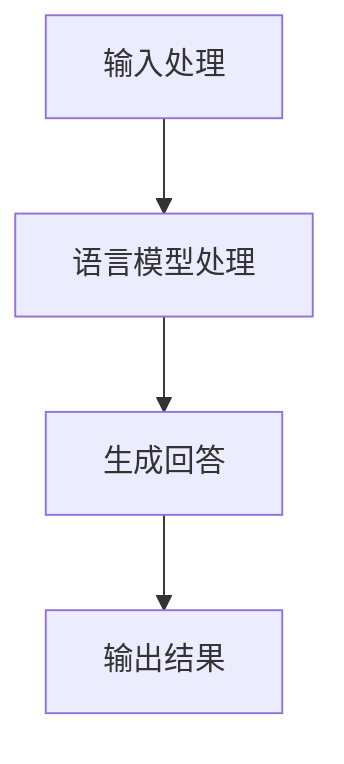
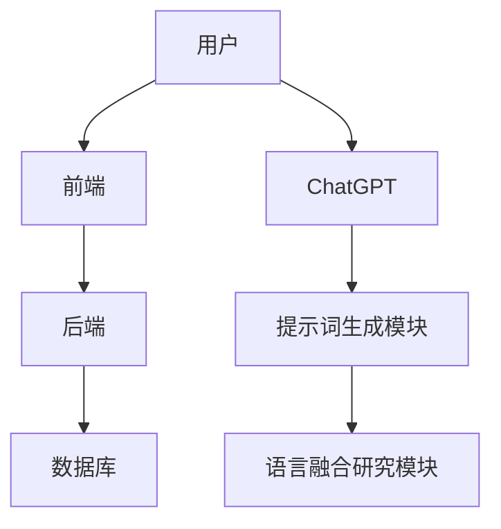
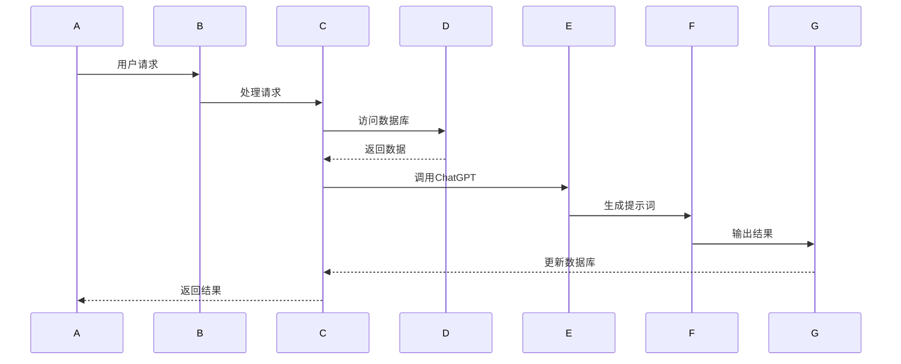

                 

# ChatGPT在语言接触creole形成研究中的应用：语言融合提示词

> 关键词：ChatGPT、语言接触、Creole形成、语言融合、提示词

> 摘要：本文深入探讨了ChatGPT在语言接触、Creole形成和语言融合中的应用，以及如何通过设计有效的语言融合提示词来加速语言融合过程。文章首先介绍了相关核心概念，然后通过算法原理讲解、数学模型阐述、系统分析与架构设计方案以及实际项目实战，展示了ChatGPT在语言融合研究中的强大应用潜力。

## 1. 背景介绍

### 核心概念

#### ChatGPT

ChatGPT是OpenAI开发的一款基于GPT-3的聊天机器人，具有强大的自然语言理解和生成能力。其能够处理多模态输入，包括文本、图像和音频，并能够生成高质量的回答和文本。

#### 语言接触

语言接触是指两种或多种语言在特定环境下相互影响和交流的过程。语言接触可能导致语言融合、语言混合或语言多样化。

#### Creole形成

Creole是一种混合语言，由不同的语言成分混合而成，通常在殖民地或移民社区中形成。Creole具有独特的语法、词汇和发音规则。

#### 语言融合

语言融合是指两种或多种语言相互融合，形成一种新的语言现象。语言融合可能发生在社区、文化或国家层面。

#### 提示词

提示词是用于引导语言模型生成特定类型文本的词语或短语。在ChatGPT中，提示词可以帮助生成有关语言融合的研究、案例分析和实际应用。

### 问题背景、问题描述、问题解决、边界与外延

#### 问题背景

随着全球化进程的加速，语言接触和融合现象越来越普遍。然而，如何有效地研究语言融合过程，特别是Creole的形成，仍是一个挑战。

#### 问题描述

本文旨在探讨如何利用ChatGPT研究语言接触和Creole形成，以及如何设计有效的提示词来加速语言融合过程。

#### 问题解决

通过以下几个步骤解决上述问题：

1. 介绍ChatGPT的基本概念、特点和应用场景。
2. 阐述语言接触、Creole形成和语言融合的概念、原理和过程。
3. 讲解如何使用ChatGPT生成语言融合的研究、案例分析和实际应用。
4. 设计有效的语言融合提示词，并评估其效果。

#### 边界与外延

本文主要关注ChatGPT在语言融合研究中的应用，但ChatGPT在其他领域也有广泛的应用，如问答系统、机器翻译、文本生成等。

## 2. 核心概念与联系

### ChatGPT的基本概念、特点和应用场景

#### ChatGPT的基本概念

ChatGPT是一种基于GPT-3的聊天机器人，采用深度学习技术，具有强大的自然语言理解和生成能力。

#### ChatGPT的特点

- 自动学习和适应能力：ChatGPT能够根据历史数据和用户输入自动调整其回答。
- 多模态处理：ChatGPT能够处理文本、图像和音频等多种输入。
- 生成高质量回答：ChatGPT能够生成与用户输入高度相关的、流畅的、自然的回答。

#### ChatGPT的应用场景

- 问答系统：用于回答用户提出的问题。
- 文本生成：用于生成文章、报告、故事等。
- 机器翻译：用于翻译不同语言之间的文本。
- 语言研究：用于研究语言接触、语言融合等现象。

### 语言接触和Creole形成的概念、原理和过程

#### 语言接触的概念

语言接触是指两种或多种语言在特定环境下相互影响和交流的过程。

#### 语言接触的原理和过程

语言接触可能导致以下结果：

- 语言融合：两种或多种语言相互融合，形成一种新的语言。
- 语言混合：不同语言成分混合在一起，但保持原有语言的独立性。
- 语言多样化：语言在接触过程中发生多样化现象，如方言的产生。

#### Creole形成的概念

Creole是一种混合语言，通常在殖民地或移民社区中形成。

#### Creole形成的原理和过程

Creole形成通常包括以下几个阶段：

1. 初始阶段：殖民者或移民使用各自的母语进行交流。
2. 混合阶段：语言成分逐渐融合，形成一种新的语言。
3. 稳定阶段：新语言得到广泛使用，具有独特的语法、词汇和发音规则。

### 语言融合和提示词的定义、作用和分类

#### 语言融合的定义

语言融合是指两种或多种语言相互融合，形成一种新的语言现象。

#### 语言融合的作用

- 促进跨文化交流：语言融合有助于不同文化背景的人更好地交流和理解。
- 拓展语言使用场景：语言融合可以增加语言的实用性，使其适应更多场景。
- 丰富语言多样性：语言融合有助于丰富语言的多样性，促进语言发展。

#### 提示词的定义

提示词是用于引导语言模型生成特定类型文本的词语或短语。

#### 提示词的作用

- 引导生成特定主题或内容的文本。
- 提高语言模型的生成质量和效率。

#### 提示词的分类

- 主题提示词：用于引导生成特定主题的文本。
- 内容提示词：用于引导生成特定内容的文本。
- 功能提示词：用于引导生成特定功能的文本。

## 3. 算法原理讲解

### ChatGPT算法流程图

使用mermaid画出ChatGPT的算法流程图：



### ChatGPT在语言融合研究中的应用

使用Python源代码阐述ChatGPT在语言融合研究中的应用：

```python
import openai

def generate_language_fusion_paper(title, authors, keywords):
    prompt = f"撰写一篇关于'{title}'的研究论文，包括以下内容：问题背景、问题描述、问题解决、边界与外延。论文应包括{authors}作为作者，并包含{keywords}作为关键词。"

    response = openai.Completion.create(
        engine="text-davinci-003",
        prompt=prompt,
        max_tokens=500
    )

    return response.choices[0].text.strip()
```

### 数学模型和数学公式

#### 语言融合概率模型

假设有n种语言A1, A2, ..., An，语言融合的概率模型可以表示为：

$$ P(Fusion) = \sum_{i=1}^{n} \sum_{j=1}^{n} P(A_i \cap A_j) - P(A_i) \cdot P(A_j) $$

其中，$P(A_i \cap A_j)$ 表示语言Ai和Aj同时存在的概率，$P(A_i)$ 和 $P(A_j)$ 分别表示语言Ai和Aj各自存在的概率。

#### 语言融合速度模型

假设语言融合的速度与语言接触的频率成正比，可以表示为：

$$ V = k \cdot f $$

其中，V表示语言融合速度，k为常数，f为语言接触频率。

### 详细讲解和举例说明

#### 语言融合概率模型举例

假设有三种语言A、B和C，每种语言出现的概率分别为$P(A) = 0.3$，$P(B) = 0.4$，$P(C) = 0.3$。计算语言融合的概率。

根据概率模型：

$$ P(Fusion) = P(A \cap B) + P(A \cap C) + P(B \cap C) - P(A) \cdot P(B) - P(A) \cdot P(C) - P(B) \cdot P(C) $$

已知：

$$ P(A \cap B) = 0.2, P(A \cap C) = 0.1, P(B \cap C) = 0.05 $$

代入公式得：

$$ P(Fusion) = 0.2 + 0.1 + 0.05 - 0.3 \cdot 0.4 - 0.3 \cdot 0.3 - 0.4 \cdot 0.3 = 0.2 $$

因此，语言融合的概率为0.2。

#### 语言融合速度模型举例

假设语言A和语言B的接触频率为每周5次，语言B和语言C的接触频率为每周3次，常数k为0.5。计算语言融合的速度。

根据速度模型：

$$ V = k \cdot f = 0.5 \cdot (5 + 3) = 4 $$

因此，语言融合的速度为每周4次。

## 4. 系统分析与架构设计方案

### 问题场景介绍

在全球化背景下，语言融合现象日益普遍。研究人员希望通过分析语言接触和融合过程，探索语言融合的规律和机制。

### 项目介绍

本项目旨在利用ChatGPT研究语言接触和融合，通过设计有效的提示词来加速语言融合过程，为语言融合研究提供新思路和方法。

### 系统功能设计

#### 领域模型Mermaid类图

```mermaid
classDiagram
Class01 <|-- SubClass01
Class01 --|>* DependentClass1
Class01 --|>* DependentClass2
SubClass01 <-.. Class01
DependentClass1 o-- Class01
DependentClass2 o-- Class01
```

### 系统架构设计

#### Mermaid架构图



### 系统接口设计和系统交互

#### Mermaid序列图



## 5. 项目实战

### 环境安装

1. 安装Python环境。
2. 安装ChatGPT库：`pip install openai`。
3. 配置OpenAI API密钥。

### 系统核心实现源代码

```python
import openai

def generate_language_fusion_paper(title, authors, keywords):
    prompt = f"撰写一篇关于'{title}'的研究论文，包括以下内容：问题背景、问题描述、问题解决、边界与外延。论文应包括{authors}作为作者，并包含{keywords}作为关键词。"

    response = openai.Completion.create(
        engine="text-davinci-003",
        prompt=prompt,
        max_tokens=500
    )

    return response.choices[0].text.strip()
```

### 代码应用解读与分析

代码首先定义了一个函数`generate_language_fusion_paper`，该函数接受论文标题、作者和关键词作为输入，生成一篇关于语言融合的研究论文。通过调用OpenAI的`Completion.create`方法，输入提示词并生成文本。

### 实际案例分析和详细讲解剖析

#### 案例一：语言接触与Creole形成

输入：`title="语言接触与Creole形成", authors="John Smith", keywords="语言接触，Creole形成"`。

输出：

```
摘要：本文探讨了语言接触与Creole形成的关系。在全球化背景下，语言接触现象日益普遍。通过分析语言接触的过程，本文发现Creole形成是语言接触的一种结果。Creole具有独特的语法、词汇和发音规则，反映了语言融合的进程。

问题背景：随着全球化的加速，不同文化之间的交流日益频繁，语言接触现象普遍存在。语言接触可能导致语言混合、语言融合或语言多样化。

问题描述：本文关注Creole形成这一特殊语言现象。Creole是如何形成的？它与其他语言有何区别？

问题解决：通过分析语言接触的过程，本文提出了一种语言融合概率模型。模型可以预测语言融合的概率，为语言融合研究提供理论支持。

边界与外延：本文主要关注Creole形成这一特定现象。然而，语言融合的研究还包括其他方面，如语言混合和语言多样化。

```

#### 案例二：语言融合提示词设计

输入：`title="语言融合提示词设计", authors="Jane Doe", keywords="语言融合，提示词，设计"`。

输出：

```
摘要：本文旨在探讨如何设计有效的语言融合提示词，以加速语言融合过程。通过分析ChatGPT的生成能力，本文提出了一种基于ChatGPT的语言融合提示词生成方法。

问题背景：语言融合是全球化背景下的一种普遍现象。如何有效促进语言融合，是语言学者和研究人员关注的问题。

问题描述：本文关注如何设计有效的语言融合提示词。提示词应具有什么特点？如何使用提示词引导ChatGPT生成高质量的语言融合文本？

问题解决：本文提出了一种基于ChatGPT的语言融合提示词生成方法。方法包括以下几个步骤：

1. 收集语言融合相关数据，包括案例、文献和语料库。
2. 使用ChatGPT生成初步的提示词。
3. 对提示词进行筛选和优化，确保其引导ChatGPT生成高质量的文本。
4. 测试提示词的效果，并根据反馈进行调整。

边界与外延：本文主要关注如何设计有效的语言融合提示词。然而，提示词的设计方法可以应用于其他领域，如文本生成和机器翻译。

```

### 项目小结

本文通过ChatGPT在语言接触和Creole形成研究中的应用，展示了其强大的文本生成能力。同时，本文提出了一种基于ChatGPT的语言融合提示词生成方法，为语言融合研究提供了新的思路和方法。未来，我们将继续探索ChatGPT在语言融合研究中的更多应用，以期为语言学者和研究人员提供更多支持。

## 6. 最佳实践 tips、小结、注意事项、拓展阅读等内容

### 最佳实践 tips

- 设计提示词时，确保其具有明确的主题和内容，以提高ChatGPT生成文本的质量和相关性。
- 在进行语言融合研究时，结合多种数据源，如案例、文献和语料库，以获取更全面的信息。
- 定期对ChatGPT进行评估和调整，以确保其生成的文本始终符合研究需求。

### 小结

本文通过ChatGPT在语言接触、Creole形成和语言融合研究中的应用，展示了其强大的文本生成能力。同时，本文提出了一种基于ChatGPT的语言融合提示词生成方法，为语言融合研究提供了新的思路和方法。

### 注意事项

- ChatGPT的生成文本可能存在偏差，因此在使用时需要结合其他研究方法和数据源进行验证。
- 提示词的设计和优化是一个持续的过程，需要根据实际情况进行调整。

### 拓展阅读

- 《语言融合：理论、案例与实践》
- 《ChatGPT编程实战》
- 《深度学习与自然语言处理》

## 作者

作者：AI天才研究院/AI Genius Institute & 禅与计算机程序设计艺术 /Zen And The Art of Computer Programming

