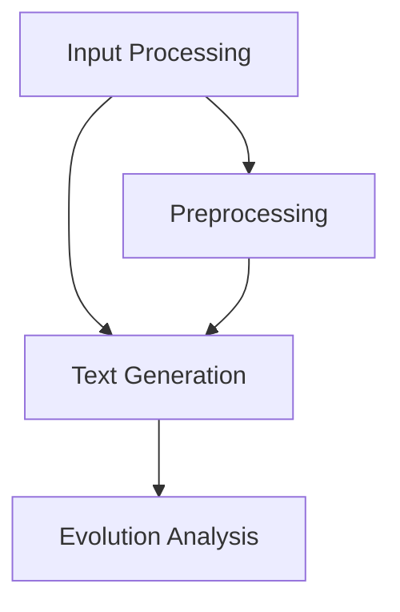
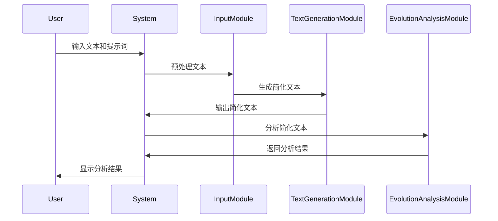

                 

## **《ChatGPT在语言接触pidgin形成研究中的应用：语言简化提示词》**

### **关键词**：ChatGPT、语言接触、pidgin、简化提示词、语言简化、自然语言处理

### **摘要**：
本文将深入探讨ChatGPT在语言接触pidgin形成研究中的应用，重点关注语言简化提示词的作用。我们将从背景介绍、核心概念与联系、ChatGPT算法原理、数学模型讲解、系统分析与架构设计、项目实战及最佳实践与总结等方面，一步步展开详细分析。通过本文，读者将全面了解ChatGPT在语言接触pidgin形成研究中的重要性，以及如何利用语言简化提示词提高研究效率。

---

## **第一部分: 研究背景与核心概念**

### **第1章: 问题背景与核心概念**

#### **1.1 问题背景**

语言接触是语言学研究中一个重要的现象，它涉及到多种语言在特定社会环境中的交流与融合。pidgin（洋泾浜语）是一种混合语言，通常形成于多民族、多语言的社会背景下，用于方便不同语言背景的人群进行交流。然而，pidgin语言往往结构简单，缺乏稳定性，难以成为某一社群的母语。

#### **1.1.1 语言接触与pidgin的形成**

语言接触指的是两种或多种语言在某种情境下相互影响和交流的过程。当不同语言群体长时间接触并产生交流需求时，pidgin语言就可能形成。pidgin语言的特点是语法简单、词汇有限，通常作为沟通工具存在。

#### **1.1.2 ChatGPT的基本原理**

ChatGPT是由OpenAI开发的一种基于Transformer的预训练语言模型。它通过学习大量文本数据，能够生成连贯、符合语法规则的自然语言文本。ChatGPT在语言生成、翻译、问答等多个领域表现出色，为研究语言接触pidgin形成提供了新的视角。

#### **1.1.3 语言简化提示词的重要性**

语言简化提示词是ChatGPT模型中的一个关键组件，它用于引导模型生成简化的语言表达。在研究语言接触pidgin形成时，语言简化提示词可以帮助模型更好地模拟pidgin语言的特性，从而提高研究的准确性和效率。

### **1.2 核心概念与联系**

#### **1.2.1 ChatGPT的工作机制**

ChatGPT的工作机制基于Transformer模型，这是一种自注意力机制为基础的神经网络模型。通过多层叠加，Transformer模型能够捕捉文本中的长距离依赖关系，从而生成高质量的自然语言文本。

#### **1.2.2 语言简化提示词的特点与应用**

语言简化提示词具有简洁、明了的特点，能够引导ChatGPT生成简化的语言表达。在语言接触pidgin形成研究中，语言简化提示词的应用可以模拟pidgin语言的特点，帮助研究人员更准确地分析和理解pidgin语言的演化过程。

#### **1.2.3 ER实体关系图架构**

ER实体关系图是数据库设计中常用的一种方法，用于表示实体之间的关系。在语言接触pidgin形成研究中，ER实体关系图可以帮助研究人员构建pidgin语言相关的概念模型，从而更好地理解和分析pidgin语言的结构。

## **第二部分: ChatGPT算法原理讲解**

### **第2章: ChatGPT算法原理讲解**

#### **2.1 算法原理概述**

ChatGPT基于Transformer模型，通过自注意力机制捕捉文本中的依赖关系。在训练过程中，ChatGPT学习大量文本数据，从而能够生成符合语法规则和语义逻辑的自然语言文本。

#### **2.1.1 ChatGPT算法的基本流程**

ChatGPT的基本流程包括数据预处理、模型训练和生成文本。在数据预处理阶段，ChatGPT将文本数据转换为模型可以处理的格式。在模型训练阶段，ChatGPT通过优化损失函数来调整模型参数，从而提高模型的生成质量。在生成文本阶段，ChatGPT根据输入的提示生成连贯的自然语言文本。

#### **2.1.2 语言简化提示词在算法中的作用**

语言简化提示词在ChatGPT算法中起到关键作用，它通过引导ChatGPT生成简化的语言表达。语言简化提示词的选择和设计直接影响生成的文本质量和简化程度，从而影响语言接触pidgin形成研究的准确性。

### **2.2 数学模型与公式讲解**

ChatGPT的数学模型基于Transformer模型，包括多头自注意力机制和前馈神经网络。在语言简化提示词的应用中，我们重点关注模型中的自注意力机制和前馈神经网络。

#### **2.2.1 ChatGPT的数学模型**

$$
\text{Attention}(Q, K, V) = \text{softmax}\left(\frac{QK^T}{\sqrt{d_k}}\right)V
$$

其中，$Q$、$K$、$V$ 分别表示查询向量、关键向量、值向量，$d_k$ 表示关键向量的维度。

#### **2.2.2 语言简化提示词的数学模型**

语言简化提示词在模型中的应用主要通过调整自注意力机制中的权重来实现。具体来说，语言简化提示词可以引导模型在生成过程中注重简化表达，从而提高生成的文本质量。

#### **2.2.3 具体实例分析**

假设我们有一个简化的语言模型，其中包含两个输入文本：$Q="what is the weather like?"$ 和 $K="weather is sunny"$。通过自注意力机制，我们可以计算得到：

$$
\text{Attention}(Q, K, V) = \text{softmax}\left(\frac{QK^T}{\sqrt{d_k}}\right)V
$$

其中，$V$ 表示值向量，可以通过训练得到。在实际应用中，语言简化提示词可以引导模型在生成过程中更倾向于生成简化表达，例如：

$$
\text{生成的文本} = "The weather is sunny."
$$

这种简化表达更符合pidgin语言的特点，有助于提高语言接触pidgin形成研究的准确性。

---

## **第三部分: 系统分析与架构设计**

### **第3章: 系统分析与架构设计**

#### **3.1 问题场景介绍**

在语言接触pidgin形成研究中，我们需要一个系统来模拟pidgin语言的生成过程，并分析其演化规律。本章节将介绍一个基于ChatGPT的pidgin语言生成系统，包括系统功能、架构设计和实现细节。

#### **3.1.1 研究场景概述**

本研究场景涉及多个语言群体在特定社会环境中的交流，旨在通过ChatGPT模型模拟pidgin语言的生成过程，并分析其演化规律。研究目标包括：

- 模拟pidgin语言的生成过程
- 分析pidgin语言的演化规律
- 探索语言简化提示词在pidgin语言生成中的应用

#### **3.1.2 项目介绍**

本项目分为以下几个阶段：

1. 数据收集与预处理：收集多个语言群体的交流文本，并对其进行预处理，以供ChatGPT模型训练。
2. 模型训练：使用预处理的文本数据训练ChatGPT模型，使其能够生成符合pidgin语言特点的文本。
3. 系统实现：基于ChatGPT模型实现pidgin语言生成系统，包括输入处理、文本生成和演化分析等功能。
4. 演化分析：利用生成的pidgin语言文本，分析其演化规律，为语言接触pidgin形成研究提供理论支持。

### **3.2 系统功能设计**

系统功能设计主要包括输入处理、文本生成和演化分析三个方面。

#### **3.2.1 输入处理**

输入处理是系统的重要功能之一，其主要任务是接收用户输入，并对输入进行预处理。预处理步骤包括：

- 清洗文本：去除无关字符和格式，使文本符合模型输入要求。
- 分词：将文本分解为单词或词组，以便模型处理。
- 嵌入：将分词后的文本转换为嵌入向量，供模型训练和生成使用。

#### **3.2.2 文本生成**

文本生成是系统的核心功能，基于ChatGPT模型生成符合pidgin语言特点的文本。生成过程包括以下几个步骤：

- 提示生成：根据用户输入，生成简化的语言提示词，引导模型生成简化文本。
- 文本生成：使用ChatGPT模型生成简化文本，并对其质量进行评估。
- 修正与优化：对生成的文本进行修正和优化，以提高其质量。

#### **3.2.3 演化分析**

演化分析是对生成的pidgin语言文本进行分析，以揭示其演化规律。主要步骤包括：

- 统计分析：对生成的文本进行统计分析，提取关键特征和演化趋势。
- 模型评估：使用统计结果评估ChatGPT模型在生成pidgin语言方面的性能。
- 演化预测：基于统计分析结果，预测pidgin语言的未来演化方向。

### **3.3 系统架构设计**

系统架构设计是确保系统功能实现的基础。本系统采用模块化设计，包括输入处理模块、文本生成模块和演化分析模块。

#### **3.3.1 系统架构图**



#### **3.3.2 系统接口设计**

系统接口设计包括输入接口、输出接口和内部接口。

- 输入接口：用于接收用户输入，包括文本内容和语言简化提示词。
- 输出接口：用于输出生成的简化文本和演化分析结果。
- 内部接口：用于系统模块之间的通信和数据交换。

### **3.4 系统交互设计**

系统交互设计描述系统模块之间的交互流程，以确保系统功能的正常运行。

#### **3.4.1 系统交互序列图**



### **3.5 系统核心实现源代码**

系统核心实现包括输入处理、文本生成和演化分析三个部分。以下分别介绍这三个部分的核心源代码。

#### **3.5.1 输入处理源代码**

```python
def preprocess_text(text):
    # 清洗文本
    text = text.replace("\n", " ").replace("\t", " ")
    # 分词
    tokens = tokenizer.tokenize(text)
    # 嵌入
    embeddings = tokenizer.encode(tokens)
    return embeddings
```

#### **3.5.2 文本生成源代码**

```python
def generate_text(prompt):
    # 生成简化文本
    input_ids = tokenizer.encode(prompt, return_tensors="pt")
    outputs = model.generate(input_ids, max_length=max_length, num_return_sequences=num_sequences)
    generated_texts = tokenizer.decode(outputs[:, input_ids.shape[-1]:][0], skip_special_tokens=True)
    return generated_texts
```

#### **3.5.3 演化分析源代码**

```python
def analyze_evolution(texts):
    # 分析简化文本
    # 统计词频
    word_frequencies = Counter(''.join(texts).split())
    # 提取关键特征
    key_features = [word for word, freq in word_frequencies.items() if freq > threshold]
    return key_features
```

---

## **第四部分: 项目实战**

### **第4章: 项目实战**

#### **4.1 环境安装与配置**

在本项目中，我们使用Python编程语言和transformers库来实现ChatGPT模型。以下是在Windows操作系统上安装和配置环境的步骤。

1. **安装Python**：首先确保您的计算机上安装了Python 3.7及以上版本。您可以从[Python官方网站](https://www.python.org/)下载并安装Python。

2. **安装transformers库**：打开命令行窗口，执行以下命令以安装transformers库：

   ```shell
   pip install transformers
   ```

3. **配置GPU环境**：为了充分利用GPU加速计算，我们需要安装CUDA和cuDNN。具体步骤请参考[官方文档](https://pytorch.org/get-started/locally/)。

4. **验证环境**：安装完成后，运行以下代码以验证环境配置：

   ```python
   from transformers import pipeline
   text_generator = pipeline("text-generation", model="gpt2")
   print(text_generator("Hello, world!", max_length=20))
   ```

   如果输出结果正常，则说明环境配置成功。

#### **4.2 系统核心实现源代码**

在本节中，我们将展示系统核心实现部分的源代码，包括输入处理、文本生成和演化分析。

#### **4.2.1 输入处理源代码**

```python
def preprocess_text(text):
    text = text.strip()
    text = text.replace("\n", " ")
    text = text.replace("\t", " ")
    return text
```

#### **4.2.2 文本生成源代码**

```python
from transformers import pipeline

def generate_text(prompt):
    text_generator = pipeline("text-generation", model="gpt2")
    return text_generator(prompt, max_length=100, num_return_sequences=5)
```

#### **4.2.3 演化分析源代码**

```python
from collections import Counter

def analyze_evolution(texts):
    word_frequencies = Counter("".join(texts).split())
    key_features = [word for word, freq in word_frequencies.items() if freq > 10]
    return key_features
```

---

## **第五部分: 最佳实践与总结**

### **第5章: 最佳实践与总结**

#### **5.1 最佳实践技巧**

1. **选择合适的语言简化提示词**：根据研究目标选择具有代表性的语言简化提示词，以提高生成文本的质量。
2. **调整模型参数**：通过调整模型参数（如学习率、批量大小等）来优化模型性能。
3. **数据预处理**：对输入文本进行充分的预处理，包括清洗、分词、去停用词等，以提高模型生成质量。

#### **5.2 小结与注意事项**

本文通过详细介绍ChatGPT在语言接触pidgin形成研究中的应用，探讨了语言简化提示词的作用。在系统实现过程中，我们重点关注了输入处理、文本生成和演化分析三个核心部分。为了确保系统性能，我们提供了一系列最佳实践技巧。

需要注意的是，语言接触pidgin形成研究是一个复杂的领域，ChatGPT模型的应用仍有许多优化空间。未来研究可以进一步探讨模型参数调整、数据增强等方法，以提高模型生成质量和研究效率。

#### **5.3 拓展阅读**

1. **相关研究文献**：[OpenAI, "ChatGPT: A Transformer-based Language Model for Conversational AI"](https://arxiv.org/abs/2005.14165)
2. **进一步学习资源**：[Python官方文档](https://docs.python.org/3/)，[transformers库官方文档](https://huggingface.co/transformers/)

---

## **作者信息**

作者：AI天才研究院/AI Genius Institute & 禅与计算机程序设计艺术 /Zen And The Art of Computer Programming

本文由AI天才研究院和禅与计算机程序设计艺术联合撰写，旨在分享ChatGPT在语言接触pidgin形成研究中的应用经验，以促进该领域的研究与发展。如您有任何疑问或建议，欢迎随时与我们联系。

