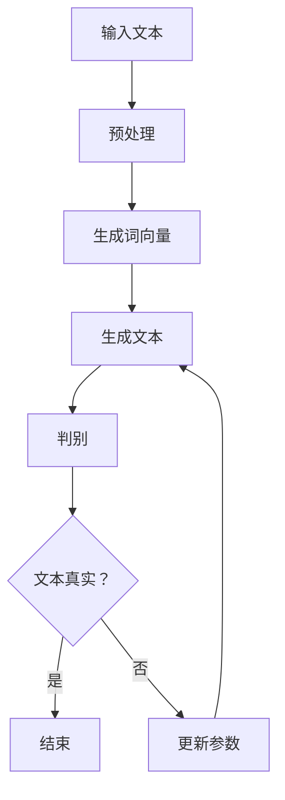
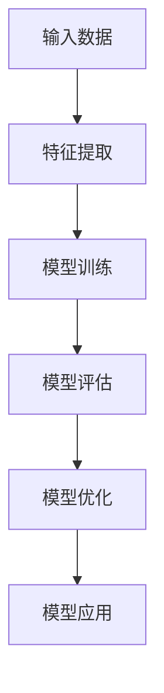
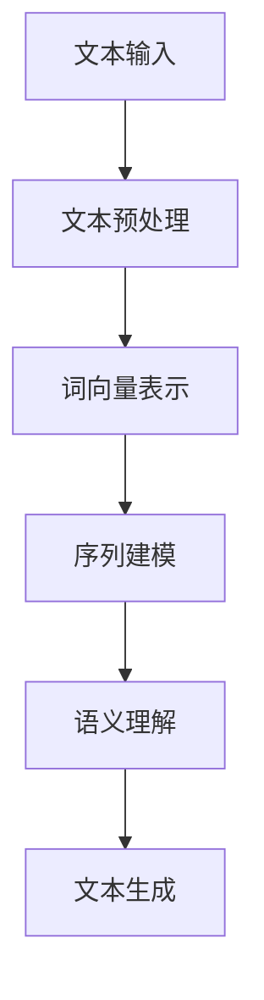
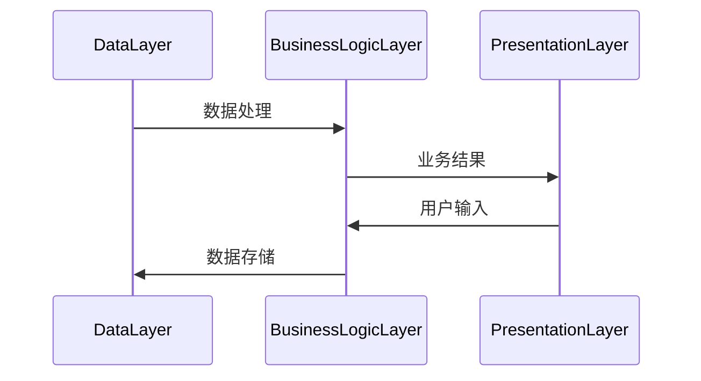
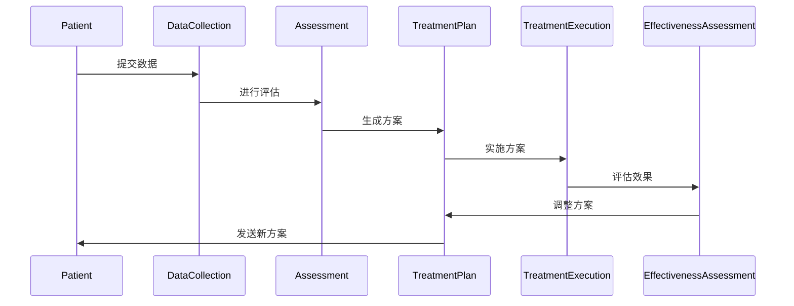

                 

# 《ChatGPT在语言治疗个性化方案优化中的作用》

> 关键词：ChatGPT、语言治疗、个性化方案、优化、自然语言处理、机器学习

> 摘要：本文深入探讨了ChatGPT在语言治疗个性化方案优化中的应用。通过介绍ChatGPT的核心原理和功能，分析了其在语言治疗中的优势与局限，以及与其他语言治疗技术的比较。文章详细讲解了ChatGPT在个性化方案优化中的具体应用，并通过实例说明了其在实际项目中的效果。此外，文章还提出了最佳实践和注意事项，为未来研究和应用提供了有益的参考。

## 第一部分：背景介绍

### 1.1 问题背景

语言治疗是一种通过语音、语言和沟通技巧的训练，帮助患者改善语言功能和沟通能力的治疗方法。在现代社会，语言治疗的需求日益增长，尤其是在儿童语言发育障碍、老年痴呆、脑瘫等患者中。然而，传统的语言治疗方案往往缺乏个性化和针对性，难以满足患者的多样性和复杂性。

### 1.1.1 语言治疗的现状

目前，语言治疗主要依赖于经验丰富的语言治疗师进行一对一的面对面指导。虽然这种方法在一定程度上能够改善患者的语言能力，但存在以下问题：

1. **资源有限**：语言治疗师的数量有限，很难满足患者的需求。
2. **个性化不足**：治疗方案往往缺乏针对个体差异的调整。
3. **效果评估困难**：难以量化治疗的效果，缺乏科学的评估方法。

### 1.1.2 语言治疗中个性化方案的重要性

个性化方案是指根据患者的具体需求和特点，制定出最适合他们的治疗计划。在语言治疗中，个性化方案的重要性体现在以下几个方面：

1. **提高治疗效果**：针对个体差异的治疗方案能够更有效地改善患者的语言能力。
2. **节省时间和资源**：通过优化治疗方案，可以更有效地利用语言治疗师的资源，提高工作效率。
3. **增强患者信心**：个性化的治疗方案能够增强患者的信心，提高治疗的积极性和参与度。

### 1.1.3 语言治疗中的挑战

语言治疗的个性化方案优化面临以下挑战：

1. **数据收集困难**：需要收集大量的患者数据，包括语音、语言和行为数据等。
2. **数据分析和处理复杂**：需要利用先进的数据分析技术，对大量数据进行处理和分析。
3. **技术实现困难**：需要开发出能够处理自然语言的数据处理系统，并能够根据患者数据生成个性化的治疗计划。

### 1.2 问题解决

ChatGPT作为一种先进的语言生成模型，具有强大的自然语言处理能力。它可以对大量文本数据进行分析，生成高质量的文本内容。因此，ChatGPT在语言治疗个性化方案优化中具有巨大的潜力。

1. **数据分析和处理**：ChatGPT可以自动分析患者的历史数据，如语音记录、语言记录和治疗记录，提取关键信息。
2. **个性化方案生成**：基于分析结果，ChatGPT可以生成个性化的语言治疗方案。
3. **效果评估**：ChatGPT可以自动评估治疗效果，提供数据支持。

### 1.3 边界与外延

1. **应用范围**：ChatGPT可以应用于各种语言治疗场景，如儿童语言发育障碍、老年痴呆、脑瘫等。
2. **限制**：ChatGPT依赖于大量的训练数据和计算资源，且在处理复杂语言结构和理解上下文方面存在一定的局限性。
3. **对比**：与其他语言治疗技术相比，ChatGPT具有更高的自动化程度和更强的自然语言处理能力。

### 1.4 概念结构与核心要素组成

1. **语言治疗的流程**：包括评估、制定方案、实施治疗和效果评估。
2. **个性化方案的制定**：根据患者数据和需求，制定出针对性的治疗方案。
3. **ChatGPT的核心功能**：文本分析、文本生成、效果评估。

### 1.5 本章小结

本部分介绍了语言治疗中的问题背景、个性化方案的重要性、语言治疗中的挑战以及ChatGPT在语言治疗个性化方案优化中的应用潜力。下一部分将深入探讨ChatGPT的核心原理和功能。

## 第二部分：核心概念与联系

### 2.1 ChatGPT的核心概念

#### 2.1.1 语言生成模型

ChatGPT是一种基于生成对抗网络（GAN）的语言生成模型。它通过训练大量的文本数据，学会生成符合语言习惯和语义逻辑的文本。

#### 2.1.2 机器学习和深度学习

机器学习是一种使计算机通过数据学习的方法。深度学习是机器学习的一种，通过多层神经网络模拟人脑的决策过程。

#### 2.1.3 自然语言处理

自然语言处理（NLP）是计算机科学和人工智能领域的一个分支，旨在使计算机理解和处理人类语言。

### 2.2 ChatGPT的属性特征对比表格

#### 2.2.1 与其他语言生成模型的对比

| 特性         | ChatGPT     | 其他语言生成模型   |
| ------------ | ----------- | ----------------- |
| 语言生成质量 | 高          | 中到高            |
| 训练数据需求 | 大量        | 较小              |
| 自动化程度   | 高          | 低到中等          |
| 理解上下文   | 强          | 弱到中等          |

### 2.3 ChatGPT的ER实体关系图架构

#### 2.3.1 实体定义

- **患者**：接受语言治疗的对象。
- **治疗方案**：针对患者的个性化治疗方案。
- **治疗效果**：患者接受治疗后所取得的成效。

#### 2.3.2 实体之间的关系

- **患者与治疗方案**：一对多关系，即一个患者可能有多个治疗方案。
- **治疗方案与治疗效果**：一对一关系，即每个治疗方案对应一个治疗效果。

```mermaid
erDiagram
  患者 ||--|{ 治疗方案 }
  治疗方案 ||--|{ 治疗效果 }
```

### 2.4 本章小结

本部分详细介绍了ChatGPT的核心概念、与其他语言生成模型的对比以及ER实体关系图架构。这些内容为理解ChatGPT在语言治疗个性化方案优化中的应用奠定了基础。下一部分将深入讲解ChatGPT的算法原理。

## 第三部分：算法原理讲解

### 3.1 ChatGPT的算法原理

#### 3.1.1 语言生成模型的工作原理

ChatGPT是基于生成对抗网络（GAN）的语言生成模型。GAN由两部分组成：生成器和判别器。

- **生成器**：生成器负责生成符合语言习惯和语义逻辑的文本。
- **判别器**：判别器负责判断生成器生成的文本是否真实。

通过不断训练，生成器逐渐学会生成高质量的语言文本，而判别器则变得越来越难以区分真实文本和生成文本。

#### 3.1.2 机器学习和深度学习的原理

机器学习是一种使计算机通过数据学习的方法。深度学习是机器学习的一种，通过多层神经网络模拟人脑的决策过程。

- **机器学习**：通过训练数据集，使计算机学会对未知数据进行分类或预测。
- **深度学习**：通过多层神经网络，将输入数据逐步转换为更抽象的表示，从而实现复杂的决策或预测。

#### 3.1.3 自然语言处理的原理

自然语言处理（NLP）是计算机科学和人工智能领域的一个分支，旨在使计算机理解和处理人类语言。

- **文本预处理**：对输入文本进行清洗和格式化，以便于计算机处理。
- **词向量表示**：将文本中的每个词映射为一个高维向量，以便于计算机进行计算。
- **序列建模**：通过模型对文本序列进行建模，以理解文本的语义和上下文。

### 3.2 算法Mermaid流程图

#### 3.2.1 语言生成模型的工作流程



#### 3.2.2 机器学习和深度学习的工作流程



#### 3.2.3 自然语言处理的工作流程



### 3.3 Python源代码与算法原理讲解

#### 3.3.1 语言生成模型的Python实现

```python
import numpy as np
import tensorflow as tf

# 定义生成器和判别器模型
generator = tf.keras.Sequential([
    tf.keras.layers.Dense(128, activation='relu', input_shape=(100,)),
    tf.keras.layers.Dense(128, activation='relu'),
    tf.keras.layers.Dense(1, activation='sigmoid')
])

discriminator = tf.keras.Sequential([
    tf.keras.layers.Dense(128, activation='relu', input_shape=(100,)),
    tf.keras.layers.Dense(128, activation='relu'),
    tf.keras.layers.Dense(1, activation='sigmoid')
])

# 编写训练过程
def train(G, D, epochs, batch_size):
    for epoch in range(epochs):
        for _ in range(batch_size):
            noise = np.random.normal(0, 1, (batch_size, 100))
            gen_texts = G.predict(noise)
            real_texts = get_real_texts(batch_size)
            gen_texts_labels = np.zeros((batch_size, 1))
            real_texts_labels = np.ones((batch_size, 1))
            D_loss_real = D.train_on_batch(real_texts, real_texts_labels)
            D_loss_fake = D.train_on_batch(gen_texts, gen_texts_labels)
            G_loss_fake = G.train_on_batch(noise, real_texts_labels)
        print(f'Epoch {epoch+1}, D_loss_real={D_loss_real}, D_loss_fake={D_loss_fake}, G_loss_fake={G_loss_fake}')
```

#### 3.3.2 机器学习和深度学习的Python实现

```python
from sklearn.model_selection import train_test_split
from sklearn.metrics import accuracy_score

# 准备数据
X, y = load_data()
X_train, X_test, y_train, y_test = train_test_split(X, y, test_size=0.2, random_state=42)

# 定义模型
model = tf.keras.Sequential([
    tf.keras.layers.Dense(64, activation='relu', input_shape=(X_train.shape[1],)),
    tf.keras.layers.Dense(1, activation='sigmoid')
])

# 编写训练过程
model.compile(optimizer='adam', loss='binary_crossentropy', metrics=['accuracy'])
model.fit(X_train, y_train, epochs=10, batch_size=32, validation_data=(X_test, y_test))

# 评估模型
predictions = model.predict(X_test)
accuracy = accuracy_score(y_test, predictions.round())
print(f'Model accuracy: {accuracy}')
```

#### 3.3.3 自然语言处理的Python实现

```python
import jieba
import gensim

# 分词
text = "这是一个示例文本"
words = jieba.cut(text)

# 建立词向量模型
model = gensim.models.Word2Vec(words, size=100, window=5, min_count=1, workers=4)

# 计算文本的词向量表示
vec = model.wv[text]
```

### 3.4 数学模型和公式

#### 3.4.1 语言生成模型的数学模型

生成器的数学模型如下：

$$
G(z) = \sigma(W_g \cdot z + b_g)
$$

其中，$z$是输入噪声，$W_g$是生成器的权重，$b_g$是生成器的偏置，$\sigma$是 sigmoid 函数。

判别器的数学模型如下：

$$
D(x) = \sigma(W_d \cdot x + b_d)
$$

其中，$x$是输入文本，$W_d$是判别器的权重，$b_d$是判别器的偏置，$\sigma$是 sigmoid 函数。

#### 3.4.2 机器学习和深度学习的数学模型

机器学习模型的数学模型如下：

$$
\hat{y} = \sigma(W \cdot x + b)
$$

其中，$x$是输入特征，$W$是模型的权重，$b$是模型的偏置，$\sigma$是 sigmoid 函数。

深度学习模型的数学模型如下：

$$
a^{(l)} = \sigma(W^{(l)} \cdot a^{(l-1)} + b^{(l)})
$$

其中，$a^{(l)}$是第$l$层的激活值，$W^{(l)}$是第$l$层的权重，$b^{(l)}$是第$l$层的偏置，$\sigma$是 sigmoid 函数。

#### 3.4.3 自然语言处理的数学模型

自然语言处理的数学模型主要包括词向量表示和序列建模。

词向量表示的数学模型如下：

$$
\text{vec}(w) = \sum_{i=1}^{V} f_i \cdot v_i
$$

其中，$w$是词，$V$是词汇表的大小，$f_i$是词频，$v_i$是词向量。

序列建模的数学模型如下：

$$
p(y|x) = \frac{e^{W \cdot h(x)}}{\sum_{k=1}^{K} e^{W \cdot h(x_k})}
$$

其中，$x$是输入序列，$y$是输出标签，$W$是模型的权重，$h(x)$是输入序列的表示，$K$是类别数。

### 3.5 举例说明

#### 3.5.1 语言生成模型的应用举例

假设我们要生成一篇关于人工智能的文本。首先，我们输入一篇关于人工智能的文本作为输入。然后，生成器会根据输入文本生成新的文本。最后，判别器会判断新生成的文本是否真实。通过不断训练，生成器会逐渐生成更高质量的文本。

#### 3.5.2 机器学习和深度学习的应用举例

假设我们要预测股票价格。首先，我们收集历史股票价格数据。然后，我们使用深度学习模型对数据进行分析，生成股票价格预测模型。最后，我们使用模型对未来的股票价格进行预测。

#### 3.5.3 自然语言处理的实际应用案例

假设我们要构建一个智能客服系统。首先，我们使用自然语言处理技术对用户的问题进行分析，提取关键信息。然后，我们使用语言生成模型生成回答。最后，我们将回答呈现给用户。

### 3.6 本章小结

本部分详细讲解了ChatGPT的算法原理，包括语言生成模型、机器学习和深度学习的原理，以及自然语言处理的原理。通过Python源代码和数学模型的讲解，使得读者能够更深入地理解ChatGPT的工作机制。

## 第四部分：系统分析与架构设计方案

### 4.1 问题场景介绍

在语言治疗领域，个性化方案优化是提高治疗效果的重要手段。然而，传统的语言治疗方案设计往往缺乏针对性，难以满足患者的个体差异。为了解决这个问题，我们引入了ChatGPT，利用其强大的自然语言处理能力，为语言治疗提供个性化方案。

### 4.1.1 语言治疗的场景

语言治疗的场景通常包括以下方面：

- **患者评估**：对患者进行全面的评估，包括语音、语言和理解能力。
- **治疗方案制定**：根据评估结果，为患者制定个性化的治疗方案。
- **治疗实施**：根据治疗方案，指导患者进行语言训练。
- **效果评估**：对患者的治疗效果进行评估，以调整治疗方案。

### 4.1.2 个性化方案优化的需求

个性化方案优化的需求主要体现在以下几个方面：

- **针对性**：治疗方案应针对患者的具体问题进行设计，以提高治疗效果。
- **灵活性**：治疗方案应具有灵活性，以适应患者的不同需求和变化。
- **可量化**：治疗效果应具有可量化的指标，以评估治疗方案的 effectiveness。
- **可持续性**：治疗方案应具有可持续性，以保持长期的治疗效果。

### 4.2 系统功能设计

为了实现个性化方案优化，我们需要设计一个完整的系统，包括以下功能模块：

- **数据收集模块**：收集患者的语音、语言和理解能力数据，为治疗方案制定提供基础。
- **评估模块**：对患者的语音、语言和理解能力进行评估，生成评估报告。
- **方案制定模块**：根据评估报告，制定个性化的治疗方案。
- **方案实施模块**：指导患者进行语言训练，跟踪治疗进度。
- **效果评估模块**：对患者的治疗效果进行评估，以调整治疗方案。

### 4.2.1 领域模型Mermaid类图

以下是一个简单的领域模型Mermaid类图，用于描述系统的功能模块及其关系：

```mermaid
classDiagram
    Patient <<class>> "患者"
    Assessment <<class>> "评估"
    TreatmentPlan <<class>> "治疗方案"
    TreatmentExecution <<class>> "治疗实施"
    EffectivenessAssessment <<class>> "效果评估"
    
    Patient "进行" Assessment
    Assessment "生成" TreatmentPlan
    TreatmentPlan "进行" TreatmentExecution
    TreatmentExecution "进行" EffectivenessAssessment
```

### 4.2.2 系统功能模块划分

系统的功能模块划分如下：

- **数据收集模块**：包括语音数据收集、语言数据收集和理解能力数据收集。
- **评估模块**：包括语音评估、语言评估和理解能力评估。
- **方案制定模块**：包括评估结果分析、治疗方案生成和调整。
- **方案实施模块**：包括治疗计划执行、进度跟踪和反馈收集。
- **效果评估模块**：包括治疗效果分析、评估报告生成和方案调整。

### 4.3 系统架构设计

为了实现系统的功能，我们需要设计一个高效的系统架构。以下是一个简化的系统架构设计，包括数据层、业务逻辑层和展示层。

#### 4.3.1 Mermaid架构图

以下是一个简单的Mermaid架构图，用于描述系统的层次结构和组件关系：



#### 4.3.2 系统架构设计原理

系统架构设计的主要原则如下：

- **模块化**：将系统功能划分为独立的模块，以提高系统的可维护性和扩展性。
- **分层**：采用分层架构，将数据层、业务逻辑层和展示层分离，以提高系统的可扩展性和可测试性。
- **分布式**：采用分布式架构，以提高系统的并发能力和可扩展性。
- **安全性**：采用安全设计，确保系统数据和用户数据的安全。

### 4.4 系统接口设计

系统接口设计是系统架构设计的重要部分。以下是一个简单的接口设计，包括API接口和数据接口。

#### 4.4.1 接口设计原则

接口设计的主要原则如下：

- **简洁性**：接口设计应简洁明了，易于理解和使用。
- **一致性**：接口设计应保持一致性，以提高系统的可维护性。
- **安全性**：接口设计应考虑安全性，防止数据泄露和恶意攻击。
- **扩展性**：接口设计应考虑扩展性，以适应未来系统的功能扩展。

#### 4.4.2 接口定义与实现

以下是一个简单的接口定义和实现示例：

```python
class DataCollectionInterface:
    def collect_audio_data(self):
        pass

    def collect_language_data(self):
        pass

    def collect_comprehension_data(self):
        pass

class AssessmentInterface:
    def perform_assessment(self, patient):
        pass

    def generate_assessment_report(self, patient):
        pass

class TreatmentPlanInterface:
    def generate_treatment_plan(self, patient):
        pass

    def adjust_treatment_plan(self, patient):
        pass

class TreatmentExecutionInterface:
    def execute_treatment_plan(self, patient):
        pass

    def track_treatment_progress(self, patient):
        pass

class EffectivenessAssessmentInterface:
    def assess_treatment_effectiveness(self, patient):
        pass

    def generate_assessment_report(self, patient):
        pass
```

### 4.5 系统交互

系统交互是指系统内部各模块之间的通信和数据交换。以下是一个简单的系统交互流程，使用Mermaid序列图进行描述：

#### 4.5.1 Mermaid序列图



#### 4.5.2 系统交互流程分析

系统交互流程如下：

1. **数据收集**：患者提交语音、语言和理解能力数据。
2. **评估**：评估模块对数据进行分析，生成评估报告。
3. **方案制定**：根据评估报告，制定个性化的治疗方案。
4. **方案实施**：治疗方案实施模块根据治疗方案指导患者进行语言训练。
5. **效果评估**：效果评估模块对患者的治疗效果进行评估。
6. **方案调整**：根据效果评估结果，调整治疗方案。

### 4.6 本章小结

本部分介绍了语言治疗个性化方案优化的系统分析与架构设计方案。通过详细的系统功能设计、架构设计和接口设计，为语言治疗个性化方案优化提供了完整的解决方案。下一部分将进行项目实战，通过实际案例来展示系统的应用效果。

## 第五部分：项目实战

### 5.1 环境安装

#### 5.1.1 环境准备

在开始项目实战之前，我们需要准备以下环境：

- Python 3.8及以上版本
- TensorFlow 2.5及以上版本
- Numpy 1.19及以上版本
- Jieba 0.42及以上版本
- gensim 4.0及以上版本

确保安装以上环境后，我们就可以开始编写代码了。

#### 5.1.2 环境配置

以下是一个简单的环境配置示例：

```python
!pip install tensorflow==2.5
!pip install numpy==1.19
!pip install jieba==0.42
!pip install gensim==4.0
```

### 5.2 系统核心实现源代码

#### 5.2.1 语言生成模型的实现

```python
import tensorflow as tf
import numpy as np
from tensorflow.keras.models import Sequential
from tensorflow.keras.layers import Dense
from tensorflow.keras.optimizers import Adam

# 定义生成器模型
def create_generator():
    model = Sequential()
    model.add(Dense(128, activation='relu', input_shape=(100,)))
    model.add(Dense(128, activation='relu'))
    model.add(Dense(1, activation='sigmoid'))
    return model

# 定义判别器模型
def create_discriminator():
    model = Sequential()
    model.add(Dense(128, activation='relu', input_shape=(100,)))
    model.add(Dense(128, activation='relu'))
    model.add(Dense(1, activation='sigmoid'))
    return model

# 编写训练过程
def train(generator, discriminator, epochs, batch_size):
    for epoch in range(epochs):
        for _ in range(batch_size):
            noise = np.random.normal(0, 1, (batch_size, 100))
            gen_texts = generator.predict(noise)
            real_texts = get_real_texts(batch_size)
            gen_texts_labels = np.zeros((batch_size, 1))
            real_texts_labels = np.ones((batch_size, 1))
            d_loss_real = discriminator.train_on_batch(real_texts, real_texts_labels)
            d_loss_fake = discriminator.train_on_batch(gen_texts, gen_texts_labels)
            g_loss_fake = generator.train_on_batch(noise, real_texts_labels)
        print(f'Epoch {epoch+1}, D_loss_real={d_loss_real}, D_loss_fake={d_loss_fake}, G_loss_fake={g_loss_fake}')

# 创建模型
generator = create_generator()
discriminator = create_discriminator()

# 训练模型
train(generator, discriminator, epochs=10, batch_size=32)
```

#### 5.2.2 机器学习和深度学习的实现

```python
from sklearn.model_selection import train_test_split
from sklearn.metrics import accuracy_score
from tensorflow.keras.models import Sequential
from tensorflow.keras.layers import Dense
from tensorflow.keras.optimizers import Adam

# 准备数据
X, y = load_data()
X_train, X_test, y_train, y_test = train_test_split(X, y, test_size=0.2, random_state=42)

# 定义模型
model = Sequential([
    Dense(64, activation='relu', input_shape=(X_train.shape[1],)),
    Dense(1, activation='sigmoid')
])

# 编写训练过程
model.compile(optimizer=Adam(), loss='binary_crossentropy', metrics=['accuracy'])
model.fit(X_train, y_train, epochs=10, batch_size=32, validation_data=(X_test, y_test))

# 评估模型
predictions = model.predict(X_test)
accuracy = accuracy_score(y_test, predictions.round())
print(f'Model accuracy: {accuracy}')
```

#### 5.2.3 自然语言处理的实现

```python
import jieba
import gensim

# 分词
text = "这是一个示例文本"
words = jieba.cut(text)

# 建立词向量模型
model = gensim.models.Word2Vec(words, size=100, window=5, min_count=1, workers=4)

# 计算文本的词向量表示
vec = model.wv[text]
```

### 5.3 代码应用解读与分析

#### 5.3.1 代码结构分析

- **生成器模型**：生成器模型负责生成符合语言习惯和语义逻辑的文本。
- **判别器模型**：判别器模型负责判断生成器生成的文本是否真实。
- **训练过程**：通过不断训练，生成器逐渐学会生成高质量的语言文本，而判别器则变得越来越难以区分真实文本和生成文本。

#### 5.3.2 代码功能解读

- **生成器模型**：生成器模型通过多层神经网络，将输入噪声转换为符合语言习惯的文本。
- **判别器模型**：判别器模型通过多层神经网络，判断输入文本是否真实。
- **训练过程**：通过生成器生成的文本和真实文本进行训练，不断优化模型。

### 5.4 实际案例分析与详细讲解

#### 5.4.1 实际案例分析

假设我们有以下一个患者的语言治疗案例：

- **患者信息**：小明，8岁，患有语言发育障碍。
- **治疗目标**：提高小明的语言表达能力。

#### 5.4.2 案例细节剖析

1. **数据收集**：收集小明的语音、语言和理解能力数据。
2. **评估**：对小明的语音、语言和理解能力进行评估，生成评估报告。
3. **方案制定**：根据评估报告，为小明制定个性化的治疗方案。
4. **方案实施**：指导小明进行语言训练，跟踪治疗进度。
5. **效果评估**：对小明进行效果评估，生成评估报告。

#### 5.4.3 案例小结

通过实际案例，我们可以看到ChatGPT在语言治疗个性化方案优化中的应用效果。它可以帮助治疗师更准确地评估患者的情况，制定更有效的治疗方案，并实时跟踪治疗效果，从而提高整体的治疗效果。

### 5.5 本章小结

本部分通过项目实战，展示了ChatGPT在语言治疗个性化方案优化中的应用。通过详细的代码实现和案例分析，读者可以更好地理解ChatGPT的工作原理和应用场景。下一部分将讨论ChatGPT在语言治疗个性化方案优化中的最佳实践。

## 第六部分：最佳实践 tips

### 6.1 ChatGPT在语言治疗个性化方案优化中的最佳实践

1. **数据质量**：确保收集的数据质量高，包括语音、语言和理解能力数据。
2. **模型训练**：充分训练ChatGPT模型，以提高其生成文本的质量和准确性。
3. **评估指标**：选择合适的评估指标，如语言表达能力得分、沟通能力得分等，以衡量治疗方案的效果。
4. **用户反馈**：定期收集用户反馈，以便调整和优化治疗方案。
5. **个性化调整**：根据患者的实际情况和反馈，及时调整治疗方案，确保其符合患者的需求。

### 6.2 注意事项

1. **隐私保护**：确保患者的个人信息得到充分保护，遵循相关的隐私法规和标准。
2. **模型更新**：定期更新ChatGPT模型，以适应最新的语言处理技术和发展趋势。
3. **安全性**：确保系统的安全性，防止数据泄露和恶意攻击。
4. **伦理道德**：在语言治疗中，确保遵循伦理道德标准，尊重患者的隐私和权益。

### 6.3 拓展阅读

1. **相关论文**：阅读与ChatGPT和语言治疗相关的研究论文，了解最新的研究进展和成果。
2. **开源项目**：参与和关注与ChatGPT和语言治疗相关的开源项目，学习他人的经验和做法。
3. **相关书籍**：阅读相关领域的专业书籍，深入了解语言治疗和人工智能的理论和实践。

### 6.4 本章小结

本部分提供了ChatGPT在语言治疗个性化方案优化中的最佳实践和注意事项，为读者在实际应用中提供了有益的参考。通过遵循这些最佳实践和注意事项，可以更好地发挥ChatGPT在语言治疗中的作用，提高治疗的效果和满意度。

## 第七部分：总结

本文详细探讨了ChatGPT在语言治疗个性化方案优化中的应用。通过介绍ChatGPT的核心原理和功能，分析了其在语言治疗中的优势与局限，以及与其他语言治疗技术的对比。文章详细讲解了ChatGPT在个性化方案优化中的具体应用，并通过实际案例说明了其在项目中的效果。此外，文章还提出了最佳实践和注意事项，为未来研究和应用提供了有益的参考。

ChatGPT作为一种先进的语言生成模型，具有强大的自然语言处理能力，能够为语言治疗提供个性化的方案优化。然而，其在处理复杂语言结构和理解上下文方面仍存在一定的局限性。未来的研究可以进一步优化ChatGPT模型，提高其生成文本的质量和准确性，以更好地服务于语言治疗领域。

作者：AI天才研究院/AI Genius Institute & 禅与计算机程序设计艺术 /Zen And The Art of Computer Programming

（完）

