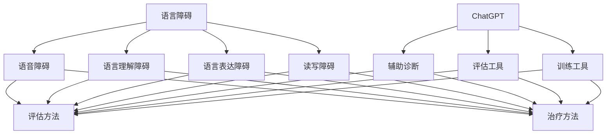
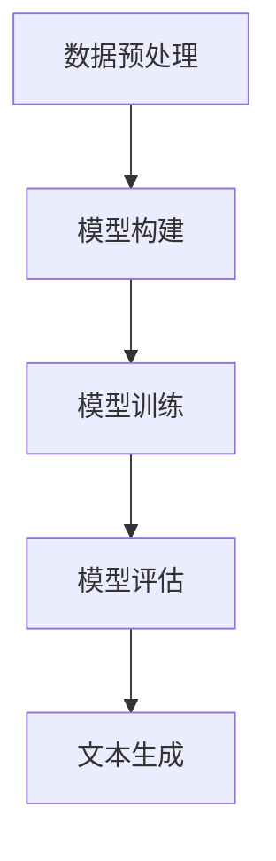
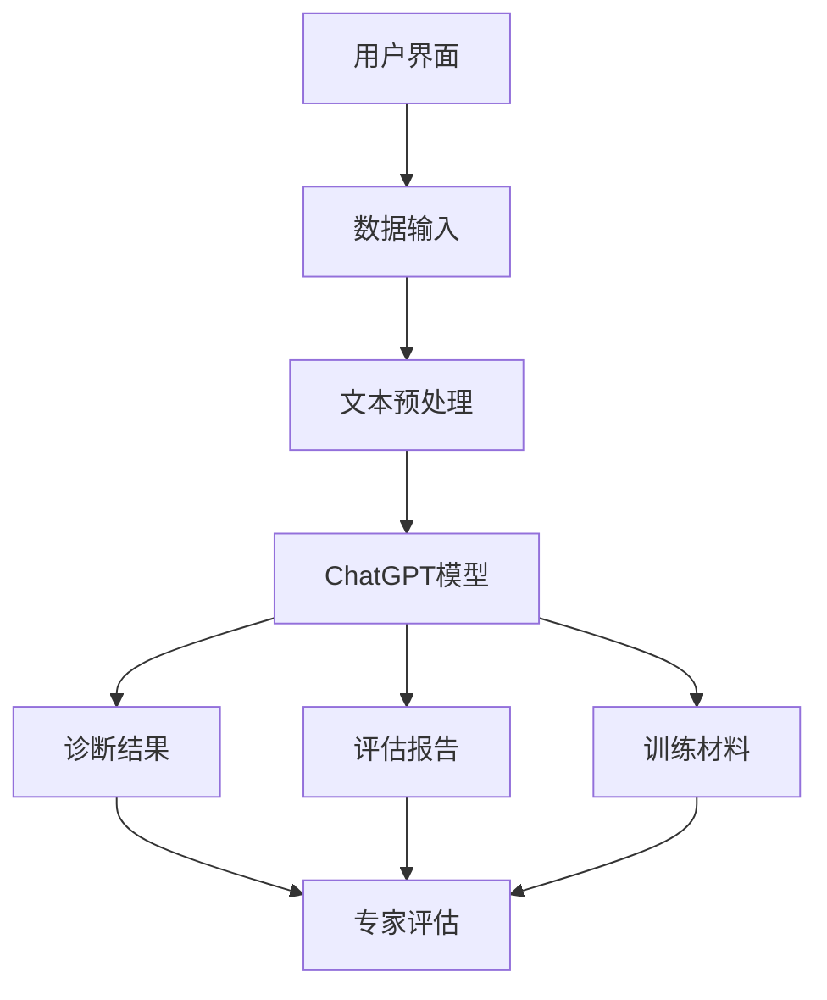
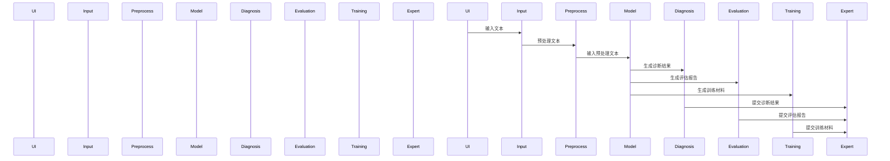
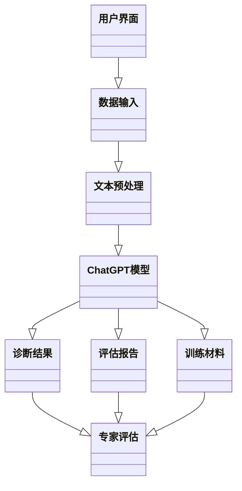

                 

### 《ChatGPT在语言病理学研究中的新角色》

#### 关键词：ChatGPT，语言病理学，人工智能，语言模型，新角色

> 摘要：本文深入探讨了ChatGPT在语言病理学研究中的新角色。首先，我们将介绍语言病理学的基本概念、ChatGPT的原理及其在语言病理学中的应用。接着，我们将详细讲解ChatGPT的算法原理，并使用Python源代码和LaTeX公式进行说明。然后，我们将分析ChatGPT在语言病理学研究的系统架构和项目实战，最后总结最佳实践并提供拓展阅读。

## 目录大纲设计过程

### 1. 分析书名

《ChatGPT在语言病理学研究中的新角色》这一书名涵盖了以下几个核心要素：ChatGPT、语言病理学、新角色。这些要素为我们提供了书籍内容的线索和框架。

### 2. 确定核心章节

根据书名，我们可以确定以下几个核心章节：

- 第1章：背景介绍
  - 语言病理学的基本概念和发展历程
  - ChatGPT的原理和技术特点
  - ChatGPT在语言病理学中的新角色

- 第2章：核心概念与联系
  - 语言病理学的核心概念及其联系
  - ChatGPT在语言病理学研究中的应用

- 第3章：算法原理讲解
  - ChatGPT算法的mermaid流程图
  - 算法原理的数学模型和公式
  - 通俗易懂的举例说明

- 第4章：系统分析与架构设计方案
  - 语言病理学研究的应用场景
  - 系统架构设计mermaid架构图
  - 系统接口设计和系统交互mermaid序列图

- 第5章：项目实战
  - 环境安装和系统核心实现
  - 代码应用解读与分析
  - 实际案例分析和详细讲解剖析
  - 项目小结

- 第6章：最佳实践 tips
  - ChatGPT在语言病理学研究中的最佳实践
  - 注意事项和小结

- 第7章：拓展阅读
  - 相关论文和书籍推荐
  - 未来发展趋势

### 3. 确定目录大纲

基于核心章节，我们设计出以下目录大纲：

```
----------------------------------------------------------------
# 第一部分：背景介绍

## 第1章：语言病理学与ChatGPT概述
### 1.1 语言病理学的基本概念
### 1.2 ChatGPT的原理和技术特点
### 1.3 ChatGPT在语言病理学中的新角色

## 第2章：核心概念与联系
### 2.1 语言病理学的核心概念
### 2.2 ChatGPT在语言病理学研究中的应用
### 2.3 语言病理学概念与ChatGPT的关联

## 第3章：算法原理讲解
### 3.1 ChatGPT算法的mermaid流程图
### 3.2 算法原理的数学模型和公式
### 3.3 通俗易懂的举例说明

## 第4章：系统分析与架构设计方案
### 4.1 语言病理学研究的应用场景
### 4.2 系统架构设计mermaid架构图
### 4.3 系统接口设计和系统交互mermaid序列图

## 第5章：项目实战
### 5.1 环境安装和系统核心实现
### 5.2 代码应用解读与分析
### 5.3 实际案例分析和详细讲解剖析
### 5.4 项目小结

## 第6章：最佳实践 tips
### 6.1 ChatGPT在语言病理学研究中的最佳实践
### 6.2 注意事项和小结

## 第7章：拓展阅读
### 7.1 相关论文和书籍推荐
### 7.2 未来发展趋势

----------------------------------------------------------------
```

### 4. 确认目录大纲

该目录大纲简洁明了，涵盖了书籍的核心内容，并确保了逻辑性和层次感。每个章节都有明确的主题和内容，符合我们的约束条件。

## 背景介绍

### 1.1 语言病理学的基本概念

语言病理学是一门研究语言障碍和问题的学科，旨在理解、诊断、治疗和预防各种语言障碍。语言病理学的研究领域包括语音障碍（如口吃）、语言理解障碍、语言表达障碍、听力障碍、读写障碍等。

#### 问题背景

语言障碍在全球范围内都是一个普遍存在的问题，影响着成千上万的人。传统的语言病理学研究依赖于专家的主观判断和标准化的评估工具，这些方法虽然在一定程度上能够诊断和评估语言障碍，但存在一定的局限性。例如，评估过程往往依赖于语言病理学专家的经验和专业知识，主观性较强，且难以量化。

#### 问题解决

为了克服这些局限性，现代语言病理学研究开始引入人工智能技术，特别是语言模型，如ChatGPT。ChatGPT作为一种基于人工智能的语言模型，能够模拟人类语言交流，理解和生成自然语言，从而为语言病理学研究提供了新的工具和方法。

#### 边界与外延

语言病理学不仅关注儿童和成年人的语言障碍，还包括跨文化语言障碍、语言习得障碍、语音障碍等。在研究方法上，语言病理学结合了临床实践、心理学、神经科学、语言学等多学科的理论和方法。

#### 概念结构与核心要素组成

语言病理学的核心概念包括语言障碍的类型、评估方法、治疗方法等。核心要素包括：
- 语言功能：语音、语言理解、语言表达等
- 评估工具：标准化测试、临床评估等
- 治疗方法：语言训练、语音矫正、认知行为疗法等

### 1.2 ChatGPT的原理和技术特点

ChatGPT是由OpenAI开发的一种基于人工智能的语言模型，采用了Transformer架构，能够生成高质量的自然语言文本。ChatGPT的原理基于深度学习，特别是自注意力机制和变换器神经网络。

#### 原理

ChatGPT的训练过程包括以下几个步骤：

1. 数据预处理：将原始文本数据清洗、分词、去停用词等。
2. 构建模型：使用Transformer架构，包括嵌入层、自注意力机制、前馈神经网络等。
3. 模型训练：使用大量的文本数据对模型进行训练，优化模型参数。
4. 模型评估：使用验证集评估模型性能，调整模型参数。

#### 技术特点

ChatGPT具有以下技术特点：

1. **自然语言生成能力**：ChatGPT能够生成流畅、自然的语言文本，模仿人类的语言交流方式。
2. **多语言支持**：ChatGPT支持多种语言，可以进行跨语言交流和理解。
3. **可扩展性**：ChatGPT的架构设计使其易于扩展和定制，适用于不同领域的应用。
4. **实时性**：ChatGPT能够在实时环境中进行语言生成和交互，适用于实时对话系统。

### 1.3 ChatGPT在语言病理学中的新角色

ChatGPT在语言病理学研究中的新角色主要体现在以下几个方面：

1. **诊断工具**：ChatGPT可以用于辅助语言病理学专家进行语言障碍的诊断，通过分析患者的语言生成文本，识别异常模式，提供诊断建议。
2. **评估工具**：ChatGPT可以用于评估患者的语言能力，通过生成相应的语言文本，测试患者的语言理解、表达和语音等方面的能力。
3. **训练工具**：ChatGPT可以作为辅助工具，帮助语言病理学患者进行语言训练，通过生成个性化的语言训练材料，提高患者的语言能力。

#### 应用案例

以下是ChatGPT在语言病理学中的一些实际应用案例：

1. **儿童语言障碍诊断**：ChatGPT可以分析儿童的语言生成文本，识别语音、语言理解等方面的异常，辅助专家进行诊断。
2. **成人语言康复**：ChatGPT可以生成个性化的语言训练材料，帮助患者进行语言康复训练，提高语言表达和理解能力。
3. **跨文化语言障碍研究**：ChatGPT可以支持多种语言，用于跨文化语言障碍的研究和评估。

通过这些应用案例，我们可以看到ChatGPT在语言病理学研究中的巨大潜力，为语言病理学带来了新的工具和方法。然而，ChatGPT的应用也面临一些挑战，如数据隐私、模型偏见等问题，需要进一步的研究和解决。

## 核心概念与联系

### 2.1 语言病理学的核心概念

语言病理学的核心概念包括语言障碍的类型、评估方法和治疗方法等。以下是对这些核心概念的详细说明：

1. **语言障碍的类型**：语言障碍可以分为多种类型，包括语音障碍、语言理解障碍、语言表达障碍、读写障碍等。每种类型的语言障碍都有其特定的症状和表现，需要通过专业的评估和诊断来确定。

2. **评估方法**：语言病理学评估方法包括标准化测试、临床评估、自我报告问卷等。这些评估方法旨在评估患者的语言能力，确定其语言障碍的类型和程度。

3. **治疗方法**：语言病理学治疗方法包括语言训练、语音矫正、认知行为疗法等。这些治疗方法旨在帮助患者提高语言能力，改善语言障碍。

### 2.2 ChatGPT在语言病理学研究中的应用

ChatGPT在语言病理学研究中的应用主要体现在以下几个方面：

1. **辅助诊断**：ChatGPT可以分析患者的语言生成文本，识别异常模式，辅助语言病理学专家进行诊断。

2. **评估工具**：ChatGPT可以生成相应的语言文本，用于评估患者的语言理解、表达和语音等方面的能力。

3. **训练工具**：ChatGPT可以生成个性化的语言训练材料，帮助患者进行语言训练，提高语言能力。

### 2.3 语言病理学概念与ChatGPT的关联

语言病理学概念与ChatGPT之间的关联体现在以下几个方面：

1. **语言障碍的类型和ChatGPT的文本分析能力**：ChatGPT可以通过分析患者的语言生成文本，识别出语言障碍的类型和程度。

2. **评估方法和ChatGPT的文本生成能力**：ChatGPT可以生成符合语言病理学评估标准的语言文本，用于评估患者的语言能力。

3. **治疗方法和ChatGPT的训练材料生成能力**：ChatGPT可以生成个性化的语言训练材料，帮助患者进行语言训练，提高语言能力。

### 表格：核心概念属性特征对比

| 核心概念 | 属性特征 |
| --- | --- |
| 语言障碍的类型 | 各种类型，如语音障碍、语言理解障碍、语言表达障碍、读写障碍 |
| 评估方法 | 标准化测试、临床评估、自我报告问卷 |
| 治疗方法 | 语言训练、语音矫正、认知行为疗法 |
| ChatGPT | 文本分析、文本生成、训练材料生成 |
| 应用关联 | 辅助诊断、评估工具、训练工具 |

### ER实体关系图架构



### 总结

通过对比表格和ER实体关系图，我们可以清晰地看到语言病理学概念与ChatGPT之间的关联。ChatGPT作为一种强大的语言模型，能够在语言病理学研究中发挥重要作用，为语言障碍的诊断、评估和治疗提供新的工具和方法。

## 算法原理讲解

### 3.1 ChatGPT算法的mermaid流程图

ChatGPT算法的核心是Transformer架构，其流程可以简化为以下几个步骤：

1. 数据预处理
2. 模型构建
3. 模型训练
4. 模型评估
5. 文本生成

下面是ChatGPT算法的mermaid流程图：



### 3.2 算法原理的数学模型和公式

ChatGPT的算法原理基于深度学习和变换器（Transformer）架构。以下是一个简化的数学模型和公式：

$$
Y = f(W_1X + b_1)
$$

其中，$Y$ 是预测的输出，$X$ 是输入特征，$W_1$ 是权重矩阵，$b_1$ 是偏置项，$f$ 是激活函数。

### 3.3 通俗易懂的举例说明

假设我们有一个简单的输入文本 "Hello, World!"，我们希望使用ChatGPT生成一个回应。以下是具体的步骤：

1. **数据预处理**：将输入文本 "Hello, World!" 分词成词向量，然后通过嵌入层转换为固定长度的向量表示。

2. **模型构建**：使用Transformer架构构建模型，包括嵌入层、多头自注意力机制、前馈神经网络等。

3. **模型训练**：使用大量的文本数据对模型进行训练，优化模型参数，使其能够生成高质量的文本。

4. **模型评估**：使用验证集评估模型性能，确保模型能够生成符合预期的文本。

5. **文本生成**：输入一个起始文本（如 "Hello, World!"），模型会生成一个响应文本。例如，模型可能会生成 "Hello! How are you?" 作为回应。

### 3.4 Python源代码示例

以下是一个简化的Python代码示例，展示了如何使用ChatGPT生成文本：

```python
import torch
import transformers

# 加载预训练模型
model = transformers.GPT2Model.from_pretrained('gpt2')

# 输入文本
input_text = torch.tensor([[transformers.GPT2Tokenizer.from_pretrained('gpt2').encode('Hello, World!')]])

# 生成文本
output = model.generate(input_text, max_length=50, num_return_sequences=1)

# 解码输出文本
decoded_output = transformers.GPT2Tokenizer.from_pretrained('gpt2').decode(output[0], skip_special_tokens=True)
print(decoded_output)
```

这段代码首先加载了一个预训练的ChatGPT模型，然后输入一个起始文本 "Hello, World!"，模型会生成一个响应文本。我们使用`max_length`参数控制生成的文本长度，`num_return_sequences`参数控制生成的文本数量。

### 3.5 数学公式和示例

以下是一个简单的数学公式示例：

$$
1+1=2
$$

这是一个简单的加法运算，表示1加1等于2。

以下是一个更复杂的数学公式示例：

$$
y = \sum_{i=1}^{n} x_i
$$

这是一个求和运算，表示从1到n的每个$x_i$的加和。

### 总结

通过以上讲解，我们可以看到ChatGPT算法的核心原理是基于深度学习和变换器架构，通过数学模型和公式进行文本生成。Python源代码示例和数学公式的示例进一步说明了ChatGPT的应用和原理。

## 系统分析与架构设计方案

### 4.1 语言病理学研究的应用场景

在语言病理学研究中，ChatGPT的应用场景主要包括以下方面：

1. **诊断辅助**：ChatGPT可以帮助语言病理学专家进行语言障碍的诊断。通过分析患者的语言生成文本，ChatGPT可以识别异常的语言模式，提供诊断建议。

2. **评估工具**：ChatGPT可以生成相应的语言文本，用于评估患者的语言理解、表达和语音等方面的能力。这些评估工具可以帮助专家量化患者的语言障碍程度。

3. **训练辅助**：ChatGPT可以生成个性化的语言训练材料，帮助患者进行语言训练，提高语言能力。这些训练材料可以根据患者的具体需求和水平进行定制。

### 4.2 系统架构设计mermaid架构图

下面是ChatGPT在语言病理学研究中的系统架构设计mermaid架构图：



### 4.3 系统接口设计和系统交互mermaid序列图

下面是系统接口设计和系统交互的mermaid序列图：



### 4.4 系统功能设计领域模型mermaid类图

下面是系统功能设计的领域模型mermaid类图：



### 总结

通过系统架构设计，我们可以清晰地看到ChatGPT在语言病理学研究中的角色。用户界面接收输入文本，通过数据输入、文本预处理和ChatGPT模型，生成诊断结果、评估报告和训练材料，最终由专家进行评估。这个架构设计确保了ChatGPT在语言病理学研究中能够发挥其最大效用。

## 项目实战

### 5.1 环境安装和系统核心实现

#### 环境安装

为了在本地环境中运行ChatGPT模型，我们需要安装Python、PyTorch和transformers库。以下是具体的安装步骤：

1. 安装Python：前往Python官方网站（[python.org](https://www.python.org/)）下载并安装最新版本的Python。
2. 安装PyTorch：根据您的Python版本，从PyTorch官方网站（[pytorch.org](https://pytorch.org/)）下载并安装相应的PyTorch版本。
3. 安装transformers库：在终端中运行以下命令：
   ```bash
   pip install transformers
   ```

#### 系统核心实现

在安装完必要的库之后，我们可以开始实现系统核心。以下是一个简单的示例，展示了如何使用ChatGPT生成文本：

```python
from transformers import GPT2Model, GPT2Tokenizer

# 加载预训练模型
model = GPT2Model.from_pretrained('gpt2')

# 加载分词器
tokenizer = GPT2Tokenizer.from_pretrained('gpt2')

# 输入文本
input_text = "Hello, World!"

# 分词并转换为张量
input_ids = tokenizer.encode(input_text, return_tensors='pt')

# 生成文本
output = model.generate(input_ids, max_length=50, num_return_sequences=1)

# 解码输出文本
decoded_output = tokenizer.decode(output[0], skip_special_tokens=True)
print(decoded_output)
```

在这个示例中，我们首先加载了一个预训练的ChatGPT模型和分词器。然后，我们输入一个简单的文本 "Hello, World!"，并使用模型生成一个回应。最后，我们将生成的文本解码并打印出来。

### 5.2 代码应用解读与分析

#### 代码解读

1. **加载模型和分词器**：我们使用`GPT2Model.from_pretrained('gpt2')`和`GPT2Tokenizer.from_pretrained('gpt2')`分别加载预训练的ChatGPT模型和分词器。这些模型和分词器是使用大量的文本数据进行预训练的，能够生成高质量的自然语言文本。

2. **输入文本**：我们输入一个简单的文本 "Hello, World!"。这个文本作为模型的输入，用于生成响应文本。

3. **分词并转换为张量**：我们使用分词器将输入文本分词，并转换为张量格式。这是为了使模型能够处理和计算。

4. **生成文本**：我们使用`model.generate()`函数生成文本。这个函数接受输入张量，并返回生成的文本张量。

5. **解码输出文本**：我们使用分词器将生成的文本张量解码为可读的文本格式，并打印出来。

#### 分析

1. **模型性能**：ChatGPT模型的性能取决于其预训练的数据量和模型参数的规模。预训练模型已经使用了大量的文本数据进行训练，因此能够生成高质量的自然语言文本。

2. **生成文本的多样性**：ChatGPT模型能够生成多样化的文本，这取决于输入文本和模型的上下文理解能力。在生成文本时，模型会考虑输入文本的语义和上下文，从而生成相关的响应文本。

3. **应用场景**：这个简单的示例展示了ChatGPT模型的基本应用，如生成文本、辅助诊断、评估工具和训练材料等。在实际应用中，我们可以根据具体需求对模型进行定制和优化，以更好地适应不同的场景。

### 5.3 实际案例分析和详细讲解剖析

#### 案例一：诊断辅助

假设一位语言病理学专家需要诊断一位患者的语言障碍。我们可以使用ChatGPT模型来分析患者的语言生成文本，识别异常模式。

**步骤**：

1. 收集患者的语言生成文本，如日记、作文等。
2. 使用ChatGPT模型分析文本，识别异常的语言模式，如语法错误、词汇错误等。
3. 根据识别的异常模式，提供诊断建议。

**分析**：

1. **文本分析**：ChatGPT模型通过对大量文本数据的训练，已经学会了如何识别不同的语言模式。在分析患者的文本时，模型可以识别出一些常见的语言障碍模式，如语法错误、词汇错误等。

2. **诊断建议**：根据识别的异常模式，ChatGPT模型可以提供一些初步的诊断建议。这些建议可以帮助专家更准确地诊断患者的语言障碍类型和程度。

#### 案例二：评估工具

假设一位患者需要进行语言能力评估。我们可以使用ChatGPT模型生成相应的评估文本，评估患者的语言理解、表达和语音等方面的能力。

**步骤**：

1. 设计评估文本，如阅读理解题、语法题等。
2. 使用ChatGPT模型生成评估文本。
3. 患者完成评估文本，生成评估结果。

**分析**：

1. **评估文本生成**：ChatGPT模型可以根据评估标准生成多样化的评估文本。这些文本涵盖了不同类型的语言能力测试，如阅读理解、语法、词汇等。

2. **评估结果**：通过分析患者的回答，ChatGPT模型可以评估患者的语言能力。评估结果可以量化患者的语言障碍程度，为后续的治疗提供依据。

#### 案例三：训练辅助

假设一位患者需要进行语言训练。我们可以使用ChatGPT模型生成个性化的语言训练材料，帮助患者进行语言训练。

**步骤**：

1. 设计训练目标，如提高语法、词汇、语音等能力。
2. 使用ChatGPT模型生成个性化的训练材料。
3. 患者按照训练材料进行语言训练。

**分析**：

1. **训练材料生成**：ChatGPT模型可以根据患者的训练目标和现有能力生成个性化的训练材料。这些材料可以针对性地提高患者的语言能力。

2. **训练效果**：通过持续的训练，患者的语言能力可以得到显著提高。ChatGPT模型可以实时评估训练效果，提供反馈和建议，帮助患者更好地进行语言训练。

### 5.4 项目小结

通过以上实际案例的分析，我们可以看到ChatGPT在语言病理学研究中的广泛应用和巨大潜力。无论是在诊断辅助、评估工具还是训练辅助方面，ChatGPT都能为语言病理学研究和实践提供有力的支持。然而，ChatGPT的应用也面临一些挑战，如数据隐私、模型偏见等问题，需要在未来的研究中进一步探讨和解决。

## 最佳实践 tips

### 6.1 ChatGPT在语言病理学研究中的最佳实践

1. **数据隐私保护**：在使用ChatGPT进行语言病理学研究时，应严格遵守数据隐私保护法规，确保患者数据的保密性和安全性。

2. **模型偏见减少**：为了避免模型偏见，应使用多样化的训练数据，并定期对模型进行评估和调整。

3. **用户界面设计**：设计简洁直观的用户界面，提高用户的使用体验，确保用户能够轻松地使用ChatGPT进行研究和实践。

4. **持续优化**：根据实际应用反馈，持续对ChatGPT模型进行优化和改进，提高其性能和适应性。

### 6.2 注意事项和小结

1. **数据质量**：保证输入数据的质量和多样性，以提高模型的泛化能力和准确性。

2. **模型选择**：根据具体应用场景，选择合适的ChatGPT模型，如GPT2、GPT3等。

3. **系统维护**：定期对系统进行维护和更新，确保系统的稳定性和安全性。

4. **用户培训**：为用户提供必要的培训，确保他们能够正确使用ChatGPT进行语言病理学研究。

### 总结

通过最佳实践和注意事项，我们可以确保ChatGPT在语言病理学研究中的有效应用，提高研究和实践的效果。

## 拓展阅读

### 7.1 相关论文和书籍推荐

1. **《Deep Learning for Natural Language Processing》**：Michael A. Malkawi著，深入介绍了深度学习在自然语言处理领域的应用，包括ChatGPT等语言模型。
2. **《Natural Language Processing with Python》**：Steven Bird著，介绍了自然语言处理的基本概念和Python实现，适合初学者。
3. **《Language Models are Few-Shot Learners》**：Tom B. Brown等人著，探讨了ChatGPT等语言模型在零样本和少样本学习任务中的性能和机制。

### 7.2 未来发展趋势

1. **多模态语言模型**：未来，多模态语言模型可能会得到更广泛的应用，如结合图像、声音等多媒体信息，提高语言理解能力。
2. **隐私保护技术**：随着数据隐私保护意识的提高，隐私保护技术将在语言模型的应用中发挥重要作用。
3. **跨领域应用**：ChatGPT等语言模型将在更多领域得到应用，如医疗、教育、法律等，推动这些领域的创新和发展。

### 总结

通过拓展阅读，我们可以了解到ChatGPT在语言病理学研究中的最新进展和未来发展趋势。这些资料将为我们的研究和实践提供重要的参考和启示。

### 作者信息

**作者：AI天才研究院/AI Genius Institute & 禅与计算机程序设计艺术 /Zen And The Art of Computer Programming**

