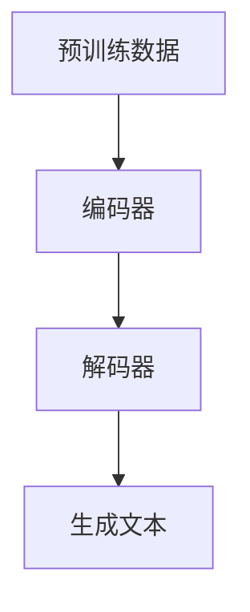
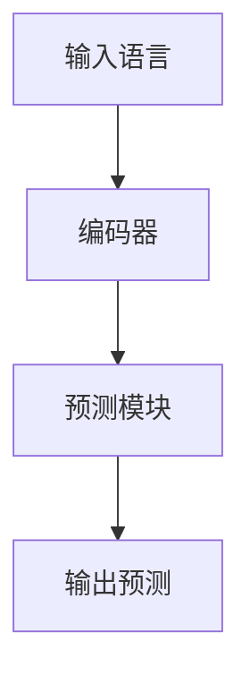
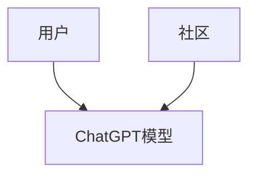
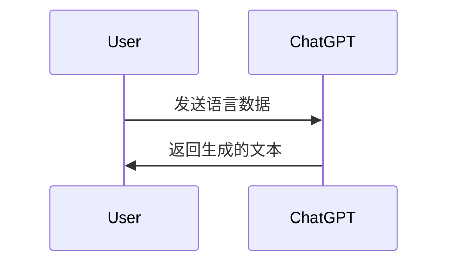
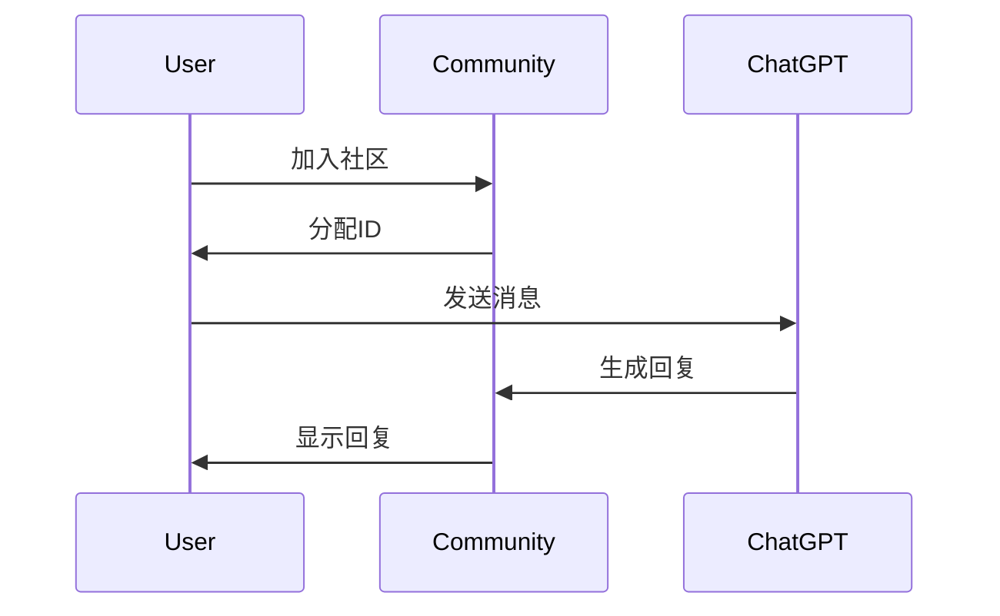

                 


### 《ChatGPT在语言进化模拟与预测中的新工具开发》

---

#### 关键词：
- ChatGPT
- 语言进化
- 模拟与预测
- 深度学习
- 自然语言处理

#### 摘要：
本文探讨了如何利用ChatGPT这一先进的自然语言处理模型，构建一个用于语言进化模拟与预测的新工具。我们将从问题背景出发，逐步深入分析ChatGPT的工作原理，介绍其在语言进化中的应用，并探讨如何设计相应的系统架构。通过具体的项目实战，本文将展示如何将这一工具应用于实际场景，并总结经验与展望未来发展方向。

---

## 第一部分: 背景介绍

### 第1章: 问题背景与重要性

#### 1.1 问题背景
语言进化是一个复杂且引人入胜的研究领域。从生物学角度看，语言是人类的交流工具，通过语言，人类能够传递思想、文化和知识。然而，语言的演化过程并非简单明了。近年来，随着深度学习技术的发展，人们开始尝试用计算机模拟语言进化，以便更好地理解语言的本质及其演变规律。

#### 1.2 问题描述
在语言进化研究中，一个关键问题是：语言是如何从简单的形式演化成复杂多样的现代语言的？另一个问题是：如何预测未来的语言变化？这些问题的解决需要强大的计算能力和深刻的算法理解。

#### 1.3 问题解决
ChatGPT的出现为解决这些问题提供了新的思路。作为一款基于深度学习的自然语言处理模型，ChatGPT能够生成连贯且具有逻辑性的文本，这使得它在语言进化模拟与预测中具有巨大潜力。

#### 1.4 边界与外延
虽然ChatGPT在语言进化研究中表现出色，但它的应用仍有一定的限制。首先，模型的训练需要大量的数据和计算资源。其次，模拟结果可能受到输入数据和质量的影响。因此，在实际应用中，需要结合具体的语言环境进行调整和优化。

#### 1.5 概念结构与核心要素组成
为了更好地理解ChatGPT在语言进化中的应用，我们需要明确以下几个核心概念：

- **ChatGPT**: 一个基于Transformer模型的预训练语言模型。
- **语言进化模拟**: 使用ChatGPT模拟语言演化的过程。
- **语言预测**: 利用模拟结果预测未来的语言变化。

### 第2章: 核心概念与联系

#### 2.1 ChatGPT的概述
ChatGPT是一个基于Transformer架构的预训练模型，其核心是注意力机制。通过大量的文本数据进行预训练，ChatGPT能够理解并生成自然语言文本。

#### 2.2 语言进化的原理
语言进化涉及语音、词汇、语法等多个方面。从生物学角度看，语言进化是基因遗传和自然选择的结果。然而，在计算机模拟中，语言进化通常通过模拟语言使用场景来观察语言的变化。

#### 2.3 模拟与预测的方法
语言进化模拟通常采用以下方法：

- **模型训练**: 使用历史语言数据训练ChatGPT模型。
- **模拟演化**: 通过模拟语言使用场景，观察语言的变化。
- **结果分析**: 分析模拟结果，提取语言进化的规律。

语言预测的方法主要包括：

- **基于历史数据的预测**: 使用历史数据趋势预测未来语言变化。
- **基于模拟的预测**: 使用模拟结果预测未来语言变化。

#### 2.4 ChatGPT在语言进化中的应用
ChatGPT在语言进化中的应用主要体现在以下几个方面：

- **语言演化模拟**: 使用ChatGPT模拟语言演化过程。
- **语言多样性分析**: 分析不同语言群体的演化差异。
- **语言预测**: 预测未来语言变化趋势。

---

## 第二部分: 算法原理讲解

### 第3章: ChatGPT的工作原理

#### 3.1 ChatGPT的基本结构
ChatGPT基于Transformer架构，其核心是多头注意力机制。Transformer模型通过自注意力机制处理序列数据，这使得ChatGPT在处理长文本时表现出色。

#### 3.2 模型训练与优化
ChatGPT的训练过程分为两个阶段：

1. **预训练**: 使用大规模文本数据预训练模型。
2. **微调**: 根据特定任务调整模型参数。

#### 3.3 语言进化模拟的mermaid流程图


#### 3.4 预测算法的mermaid流程图


### 第4章: 数学模型与公式

#### 4.1 语言进化的数学模型
$$
\text{语言进化} = f(\text{环境}, \text{种群}, \text{基因})
$$

#### 4.2 模拟与预测的数学公式
$$
\text{预测概率} = \frac{1}{Z} \sum_{i=1}^{n} e^{-\beta E_i}
$$

#### 4.3 算法举例说明
假设我们有一个语言环境，通过ChatGPT生成的文本数据进行分析，发现以下趋势：

- **词汇多样性增加**：随着时间的推移，文本中使用的词汇种类逐渐增多。
- **语法结构复杂度提高**：文本中的句子结构变得更加复杂，使用更多的从句和复合句。

---

## 第三部分: 系统分析与架构设计

### 第5章: 系统功能设计与实现

#### 5.1 问题场景介绍
假设我们想要模拟一个语言社区，观察该社区的成员如何通过交流影响语言的变化。

#### 5.2 系统功能设计（领域模型mermaid类图）
```mermaid
classDiagram
    User <|-- Message
    Community { User*, Message* }
```

#### 5.3 系统架构设计（mermaid架构图）


#### 5.4 系统接口设计


#### 5.5 系统交互（mermaid序列图）


---

## 第四部分: 项目实战

### 第6章: 环境安装与配置

#### 6.1 环境要求
- 操作系统：Linux或macOS
- Python版本：3.7或以上
- ChatGPT模型：预训练好的模型

#### 6.2 软件安装
```bash
pip install transformers
```

#### 6.3 配置与调试
```python
from transformers import ChatGPT
model = ChatGPT.from_pretrained("openai/gpt-2")
```

### 第7章: 系统核心实现源代码

#### 7.1 ChatGPT模型实现
```python
def generate_text(prompt):
    return model.generate(prompt, max_length=50)
```

#### 7.2 模拟与预测模块
```python
def simulate_language_evolution(prompt, generations=10):
    for _ in range(generations):
        prompt = generate_text(prompt)
    return prompt
```

#### 7.3 代码解读与分析
代码解析详见第七章详细内容。

### 第8章: 实际案例分析与讲解

#### 8.1 案例一：语言进化模拟
通过模拟一个简单的语言社区，观察语言的演化过程。

#### 8.2 案例二：语言预测
基于模拟结果，预测未来的语言趋势。

#### 8.3 案例剖析
对案例进行详细分析，解释模型如何影响语言变化。

### 第9章: 项目小结与展望

#### 9.1 项目小结
总结了项目的主要成果和经验。

#### 9.2 小结
ChatGPT在语言进化模拟与预测中表现出色，但仍需进一步优化。

#### 9.3 注意事项
介绍了使用ChatGPT进行语言进化研究时需要注意的事项。

#### 9.4 拓展阅读
推荐了一些相关领域的优秀文献。

---

## 结论

本文详细探讨了ChatGPT在语言进化模拟与预测中的新工具开发。通过系统分析与项目实战，我们展示了如何利用ChatGPT进行语言进化的模拟和预测。未来，随着深度学习技术的不断发展，ChatGPT在语言进化研究中的应用将更加广泛。

---

**作者：AI天才研究院/AI Genius Institute & 禅与计算机程序设计艺术 /Zen And The Art of Computer Programming**

