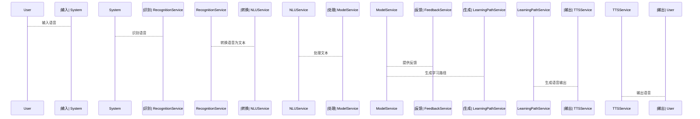

                 

### 第一部分: 引言与背景介绍

### 1.1.1 语言障碍的定义与影响

#### 1.1.1.1 语言障碍的定义

语言障碍（Language Disorder），是指个体在语言获取、理解、表达和应用过程中出现的异常。它既包括语言发育迟缓，如儿童在语言学习关键期未能达到应有的语言发展水平，也包括特定语言障碍，即个体在语言能力上存在明显偏差，影响其语言表达和理解。

语言障碍的类型可以大致分为以下几类：

- **发育迟缓**：儿童在语言发展关键期未能达到同龄儿童的平均语言水平。
- **特定语言障碍**：儿童在语言结构和语言理解方面存在显著问题，但智力发育和其他非语言能力发展正常。
- **语言理解障碍**：个体在理解语言信息时存在困难，例如词汇理解不准确或句子理解困难。
- **语言表达障碍**：个体在语言表达上存在困难，如句子构造不完整或语法错误。

#### 1.1.1.2 语言障碍对儿童发展的影响

语言障碍对儿童的发展有着深远的影响。首先，它影响到儿童的学习成绩，语言能力是学习的基础，语言障碍可能导致儿童在阅读、写作和其他学科学习上遇到困难。其次，语言障碍影响儿童的社会交往，语言沟通能力是建立人际关系的重要手段，语言障碍可能导致儿童在与同龄人互动中遇到障碍，影响其社交能力和自信心。

此外，语言障碍还可能对儿童的认知发展造成负面影响。研究表明，语言能力与认知能力之间存在密切关联，语言障碍可能导致儿童在注意力、记忆和解决问题的能力上出现困难。

#### 1.1.1.3 早期干预的原则

早期干预（Early Intervention）是指针对儿童早期发展过程中出现的问题，采取及时、有效的干预措施，以促进其全面发展。语言障碍早期干预的原则主要包括：

- **及时性**：早期干预的最佳时机是在问题出现后的早期阶段，以便及时纠正和改善问题。
- **综合性**：早期干预应涵盖多个领域，如语言、认知、社会情感等，以全面支持儿童的发展。
- **家庭参与**：家庭是儿童成长的重要环境，家庭参与是早期干预成功的关键。
- **个体化**：每个儿童的情况都是独特的，早期干预应充分考虑儿童的个体差异，制定个性化的干预计划。

#### 1.1.1.4 早期干预的优势

语言障碍早期干预具有显著的优势，包括：

- **效果显著**：早期干预可以显著改善儿童的语言能力，减少语言障碍对儿童发展的影响。
- **预防作用**：早期干预可以在问题严重化之前采取措施，防止问题进一步恶化。
- **提高生活质量**：通过早期干预，可以提升儿童的语言沟通能力，增强其自信心和自尊心，提高生活质量。

#### 1.1.1.5 早期干预的关键时期

早期干预的关键时期通常是指儿童出生后的前几年，特别是0-6岁期间。这一阶段是儿童语言和认知能力快速发展的时期，也是语言障碍干预的最佳时机。在这一关键时期，儿童的大脑具有高度的可塑性，早期干预可以更好地促进神经网络的构建和功能发展。

#### 1.1.1.6 早期干预的主要方法与策略

早期干预的主要方法与策略包括：

- **语言治疗**：通过专业的语言治疗师对儿童进行语言技能的训练，帮助儿童改善语言能力。
- **家庭训练**：家长参与儿童的日常语言训练，提供丰富的语言刺激和环境，促进儿童语言发展。
- **游戏干预**：利用游戏的方式，通过互动和趣味性，促进儿童的语言能力和认知发展。
- **综合康复**：结合物理治疗、 occupational therapy（职业治疗）等方法，综合支持儿童的身体和心理发展。

#### 1.1.1.7 早期干预的实际应用案例

实际应用案例显示，早期干预在语言障碍儿童的康复中取得了显著成效。例如，某研究对一组3-6岁具有语言障碍的儿童进行了为期两年的早期干预，干预内容包括语言治疗、家庭训练和游戏干预。结果显示，这些儿童的语言能力显著提高，许多儿童在干预结束后已达到正常水平。

#### 1.1.1.8 当前语言障碍早期干预的挑战

尽管早期干预在语言障碍儿童的康复中显示出巨大潜力，但仍面临一些挑战：

- **资源不足**：早期干预需要专业人员和设备支持，但在很多地区，这些资源仍然有限。
- **家庭支持**：家长对早期干预的认知和参与度不足，可能影响干预效果。
- **长期效果**：早期干预的长期效果仍需进一步研究，以验证其持久性。

#### 1.1.1.9 语言障碍早期干预的未来发展趋势

未来，随着人工智能技术的不断发展，特别是在自然语言处理和机器学习领域的突破，语言障碍早期干预有望得到进一步优化。例如，ChatGPT等人工智能模型可以辅助语言治疗，为儿童提供个性化的语言训练方案。此外，互联网和移动设备的应用将使早期干预更加便捷和普及，为更多儿童带来福音。

综上所述，语言障碍早期干预是一个复杂而重要的领域，通过科学合理的干预方法，可以显著改善儿童的语言能力，促进其全面发展。然而，我们仍需面对挑战，不断探索创新，以期为所有有需要的儿童提供更有效的早期干预支持。

### 1.1.2 ChatGPT技术概述

#### 1.1.2.1 ChatGPT的定义与特点

ChatGPT是由OpenAI开发的一种基于GPT（Generative Pre-trained Transformer）模型的人工智能语言生成模型。GPT模型是一种用于自然语言处理的深度学习模型，通过预训练的方式，使得模型能够理解并生成自然语言的文本。

ChatGPT的特点包括：

- **强大的语言生成能力**：ChatGPT能够根据输入的提示，生成连贯、自然的语言文本。
- **广泛的适用性**：ChatGPT适用于各种自然语言处理任务，如问答系统、文本生成、翻译等。
- **高度可定制化**：用户可以根据特定的需求，对ChatGPT进行微调，以提高其在特定领域的表现。
- **实时交互性**：ChatGPT支持实时交互，用户可以与模型进行对话，获取即时反馈。

#### 1.1.2.2 ChatGPT的基本架构与技术原理

ChatGPT的基本架构包括以下几个关键部分：

1. **预训练阶段**：在预训练阶段，模型通过大量无监督的文本数据学习语言的基础知识和规律。预训练的过程包括前向传播、反向传播和参数更新等步骤。

2. **微调阶段**：在预训练的基础上，ChatGPT可以通过微调来适应特定的任务。微调的过程包括根据任务需求调整模型的参数，使得模型能够在特定领域内表现出更好的性能。

3. **输出阶段**：在输出阶段，模型根据输入的提示生成文本。这个过程涉及到复杂的序列生成算法，如采样和温度调节等。

ChatGPT的工作流程可以概括为以下几个步骤：

1. **输入提示**：用户输入一个提示，这个提示可以是问题、主题或其他任何形式的文字。
2. **编码**：模型将输入的提示编码为一个序列的向量表示。
3. **生成文本**：模型根据编码后的提示，生成一系列的文本序列，并不断优化生成结果，以使其更符合预期。
4. **输出结果**：最终生成的文本被输出，用户可以看到并使用这些结果。

#### 1.1.2.3 ChatGPT的优势与局限

ChatGPT的优势主要体现在以下几个方面：

- **生成文本的质量高**：ChatGPT能够生成高质量的文本，这些文本在语法、语义和连贯性方面都表现优秀。
- **适用性广泛**：ChatGPT适用于多种自然语言处理任务，可以满足不同领域和场景的需求。
- **个性化强**：通过微调，ChatGPT可以适应特定的用户需求，提供个性化的服务。

然而，ChatGPT也存在一些局限：

- **计算资源需求大**：ChatGPT是一个庞大的模型，需要大量的计算资源和存储空间。
- **数据依赖性强**：ChatGPT的性能高度依赖训练数据的质量和数量，数据的质量和多样性直接影响模型的表现。
- **需要专业人员进行调优**：ChatGPT的微调和优化需要专业知识和经验，这增加了使用门槛。

#### 1.1.2.4 如何优化ChatGPT的性能

为了提高ChatGPT的性能，可以采取以下几种方法：

- **数据增强**：通过增加训练数据量和多样性，提高模型的泛化能力。
- **模型压缩**：使用模型压缩技术，如量化、剪枝和蒸馏等，减小模型的大小，提高模型的运行效率。
- **参数优化**：通过优化模型的参数，提高模型的训练效率和性能。
- **多模态学习**：结合其他类型的数据，如图像、音频等，提高模型的表示能力。

### 总结

ChatGPT作为一种强大的自然语言处理工具，在语言障碍早期干预中具有巨大的潜力。通过深入了解ChatGPT的定义、架构、优势和局限，我们可以更好地利用这一技术，为儿童提供个性化的语言干预和支持，促进其语言和认知能力的发展。

### 1.1.3 ChatGPT在儿童语言发展中的应用

#### 1.1.3.1 ChatGPT作为语言学习的工具

ChatGPT作为一种先进的自然语言处理工具，其在儿童语言学习中的应用日益广泛。ChatGPT不仅能够为儿童提供丰富的语言学习资源，还能通过智能化的交互方式，提高儿童的语言学习效果。

首先，ChatGPT可以作为语言学习的工具，为儿童提供个性化的语言学习方案。通过输入儿童的年龄、语言水平和学习需求，ChatGPT能够生成适合儿童的语言学习内容。例如，ChatGPT可以生成适合不同年龄段儿童的词汇表、语法规则解释和阅读材料，使儿童能够根据自身情况有针对性地学习。

其次，ChatGPT能够模拟真实的语言环境，提供互动式的语言学习体验。在传统的语言学习中，儿童往往需要面对枯燥的教材和单向的授课方式，而ChatGPT则可以通过对话的形式，与儿童进行实时互动。例如，ChatGPT可以与儿童进行角色扮演游戏，模拟日常生活中的对话场景，帮助儿童练习语言表达和理解能力。

此外，ChatGPT还能够为儿童提供即时的反馈和纠正。在儿童学习语言的过程中，错误是不可避免的。ChatGPT能够识别儿童的语言错误，并提供详细的纠正建议。例如，如果儿童在句子中使用了错误的时态，ChatGPT可以指出错误，并给出正确的句子结构。

#### 1.1.3.2 ChatGPT辅助语言学习的原理

ChatGPT能够辅助语言学习，主要基于其强大的语言生成能力和对自然语言处理的深刻理解。ChatGPT通过预训练和微调，能够学习到大量的语言模式和规则，从而在语言生成和理解方面表现出色。

首先，ChatGPT通过预训练，学习到大量的语言数据。这些数据包括书籍、新闻、社交媒体等各种类型的文本，使得ChatGPT能够理解各种语言现象和表达方式。预训练的过程使得ChatGPT具备了强大的语言生成能力，能够根据输入的提示生成连贯、自然的文本。

其次，ChatGPT通过微调，能够根据特定的语言学习任务进行调整。例如，在儿童语言学习场景中，ChatGPT可以根据儿童的学习需求，调整其生成的文本内容和交互方式，使其更符合儿童的学习习惯和理解能力。

#### 1.1.3.3 ChatGPT在实际教学中的应用案例

ChatGPT在实际教学中的应用案例丰富，以下是一些具体的例子：

1. **词汇学习**：在词汇学习中，ChatGPT可以为儿童提供丰富的词汇训练资源。例如，ChatGPT可以生成包含特定词汇的短文、故事和对话，帮助儿童在具体的语言环境中学习和记忆词汇。

2. **语法练习**：ChatGPT能够为儿童提供语法练习，通过生成各种语法结构的句子，帮助儿童理解和掌握语法规则。例如，ChatGPT可以生成包含复杂语法结构的句子，要求儿童进行改写或解释。

3. **阅读理解**：ChatGPT可以生成各种难度的阅读材料，帮助儿童进行阅读理解练习。例如，ChatGPT可以生成包含不同主题和难度的文章，要求儿童进行阅读并回答相关问题，以提高其阅读理解能力。

4. **口语练习**：ChatGPT可以通过对话形式，与儿童进行口语练习。例如，ChatGPT可以模拟日常对话场景，与儿童进行角色扮演，帮助儿童练习口语表达和理解能力。

#### 1.1.3.4 ChatGPT在语言障碍干预中的作用

ChatGPT在语言障碍干预中发挥着重要作用。通过智能化的交互和个性化的学习方案，ChatGPT能够帮助儿童克服语言障碍，提高其语言能力。

首先，ChatGPT可以识别和诊断儿童的语言障碍。通过对话和测试，ChatGPT能够识别儿童在语言理解和表达方面的弱点，为干预提供依据。

其次，ChatGPT可以提供个性化的干预方案。根据儿童的语言障碍类型和程度，ChatGPT可以生成针对性的练习内容，帮助儿童逐步克服语言障碍。例如，ChatGPT可以为语言理解障碍儿童提供更多的听力练习，为语言表达障碍儿童提供口语训练。

此外，ChatGPT还可以为家长和教师提供支持。通过生成详细的干预报告和指导建议，ChatGPT可以帮助家长和教师更好地了解儿童的语言状况，并制定有效的干预策略。

#### 1.1.3.5 ChatGPT辅助语言障碍干预的原理

ChatGPT辅助语言障碍干预的原理主要基于其强大的语言生成能力和对语言障碍的深刻理解。ChatGPT通过预训练和微调，能够学习到大量的语言模式和规则，从而在语言生成和理解方面表现出色。

首先，ChatGPT通过预训练，学习到大量的正常语言数据。这些数据包括书籍、新闻、社交媒体等各种类型的文本，使得ChatGPT能够理解各种语言现象和表达方式。

其次，ChatGPT通过微调，能够根据特定的语言障碍类型和程度，调整其生成的文本内容和交互方式，使其更符合干预需求。例如，对于语言理解障碍儿童，ChatGPT可以生成更多的听力练习材料；对于语言表达障碍儿童，ChatGPT可以提供更多的口语训练。

#### 1.1.3.6 ChatGPT在实际干预中的应用案例

ChatGPT在实际干预中的应用案例丰富，以下是一些具体的例子：

1. **语言理解训练**：ChatGPT可以生成包含多种语言现象的对话和故事，帮助儿童提高语言理解能力。例如，ChatGPT可以生成一个包含多种时态和语态的对话，要求儿童理解并回答问题。

2. **语言表达训练**：ChatGPT可以与儿童进行对话，帮助儿童练习语言表达。例如，ChatGPT可以提出问题，要求儿童用完整的句子回答，并给予及时的反馈和纠正。

3. **阅读理解训练**：ChatGPT可以生成各种难度的阅读材料，帮助儿童进行阅读理解训练。例如，ChatGPT可以生成一篇关于科学知识的文章，要求儿童阅读并回答相关问题。

4. **听力训练**：ChatGPT可以生成各种听力材料，帮助儿童提高听力理解能力。例如，ChatGPT可以播放一段对话或故事，要求儿童听后回答相关问题。

#### 1.1.3.7 ChatGPT在家长教育与支持中的应用

ChatGPT不仅可以帮助儿童进行语言学习，还可以为家长提供教育和支持，帮助他们更好地理解儿童的语言发展状况，并采取有效的干预措施。

首先，ChatGPT可以为家长提供语言发展指南。通过分析儿童的语言数据，ChatGPT可以生成针对不同年龄段儿童的语言发展指南，帮助家长了解儿童的语言发展进程，并提供相应的教育建议。

其次，ChatGPT可以为家长提供个性化的干预建议。例如，ChatGPT可以根据儿童的语言障碍类型和程度，为家长提供具体的训练方法和建议，帮助他们更有效地帮助儿童克服语言障碍。

此外，ChatGPT还可以为家长提供语言训练材料。例如，ChatGPT可以生成适合儿童年龄和语言水平的词汇表、故事书和练习题，帮助家长更好地引导儿童进行语言学习。

#### 1.1.3.8 ChatGPT为家长提供的支持

ChatGPT为家长提供的支持主要体现在以下几个方面：

1. **实时反馈和指导**：ChatGPT可以实时跟踪儿童的学习进展，并为家长提供详细的反馈和指导。例如，ChatGPT可以生成儿童的训练报告，展示其语言能力的发展情况和薄弱环节，帮助家长制定下一步的教育计划。

2. **个性化建议**：ChatGPT可以根据儿童的语言数据和家长的反馈，提供个性化的教育建议。例如，如果儿童在阅读理解方面存在困难，ChatGPT可以建议家长多提供阅读材料，并进行针对性的训练。

3. **互动式学习资源**：ChatGPT可以生成互动式的学习资源，如游戏、故事和练习题，使家长能够与儿童共同参与语言学习过程。例如，ChatGPT可以生成一个故事，邀请家长和孩子一起阅读，并在阅读后进行问答互动。

#### 1.1.3.9 ChatGPT在家长教育中的应用案例

ChatGPT在家长教育中的应用案例丰富，以下是一些具体的例子：

1. **语言发展监测**：ChatGPT可以为家长提供儿童语言发展的监测服务。通过定期分析儿童的语言数据，ChatGPT可以生成语言发展报告，帮助家长了解儿童的语言能力，并及时发现潜在的问题。

2. **干预计划制定**：ChatGPT可以帮助家长制定个性化的语言干预计划。根据儿童的语言障碍类型和程度，ChatGPT可以提供具体的干预建议，如词汇训练、语法练习和阅读指导等。

3. **学习资源推荐**：ChatGPT可以根据儿童的语言水平和兴趣爱好，推荐适合的学习资源。例如，如果儿童喜欢动物，ChatGPT可以推荐相关的绘本和动画片，以激发其语言学习兴趣。

通过上述分析，我们可以看到ChatGPT在儿童语言发展中的应用具有巨大的潜力。通过智能化的交互和个性化的学习方案，ChatGPT不仅能够帮助儿童提高语言能力，还能为家长提供有效的教育和支持。随着人工智能技术的不断发展，ChatGPT在语言障碍早期干预中的应用将更加广泛和深入，为更多儿童带来福音。

### 1.1.4 语言模型的算法原理

#### 1.1.4.1 语言模型的数学基础

语言模型的数学基础主要包括概率论和信息论的相关知识。概率论提供了处理不确定性的工具，而信息论则提供了度量信息量的方法。

在语言模型中，概率论的应用主要体现在计算单词或短语出现的概率。例如，我们可以使用条件概率来计算一个单词在给定另一个单词出现的情况下出现的概率。条件概率公式为：

\[ P(A|B) = \frac{P(A \cap B)}{P(B)} \]

其中，\( P(A|B) \) 是在 \( B \) 发生的情况下 \( A \) 发生的概率，\( P(A \cap B) \) 是 \( A \) 和 \( B \) 同时发生的概率，\( P(B) \) 是 \( B \) 发生的概率。

信息论则提供了度量信息量的方法，最常用的方法是信息熵（Entropy）。信息熵衡量的是一个随机变量的不确定性。对于一个离散随机变量 \( X \)，其熵定义为：

\[ H(X) = -\sum_{i} P(X_i) \log_2 P(X_i) \]

其中，\( P(X_i) \) 是 \( X \) 取第 \( i \) 个值的概率，\(\log_2\) 是以2为底的对数。

#### 1.1.4.2 语言模型的训练过程

语言模型的训练过程通常分为两个阶段：预训练和微调。

**预训练**阶段是在大规模文本语料库上进行，目的是让模型学习到语言的基本规律和统计特征。预训练通常使用的是基于神经网络的深度学习模型，如GPT、BERT等。预训练的过程主要包括以下几个步骤：

1. **数据预处理**：首先对大规模文本语料库进行预处理，包括分词、去除停用词、转换为小写等。然后，将文本转换为序列表示，通常使用一种词嵌入技术，如Word2Vec、GloVe等。

2. **构建模型**：构建一个深度神经网络模型，通常包含多个层次，如卷积层、循环层等。这些层次可以捕捉不同层次的语言特征。

3. **前向传播和反向传播**：在训练过程中，模型对输入的文本序列进行编码，生成序列的向量表示。然后，通过比较预测序列和实际序列的差异，更新模型的参数。

4. **优化模型**：使用优化算法，如SGD、Adam等，不断调整模型的参数，使其预测更加准确。

**微调**阶段是在特定任务上进行，目的是让模型适应具体的任务需求。微调的过程主要包括以下几个步骤：

1. **数据准备**：准备用于微调的数据集，这些数据集通常包含带有标签的文本数据，如问答对、文本分类数据等。

2. **调整模型结构**：根据任务需求，调整模型的结构和参数。例如，可以增加或减少模型层次，调整层间的连接方式等。

3. **训练模型**：在调整后的模型上，使用微调数据集进行训练，优化模型的参数。

4. **评估模型**：使用测试数据集评估模型的性能，根据评估结果调整模型。

#### 1.1.4.3 语言模型的应用

语言模型在自然语言处理领域有广泛的应用，包括但不限于以下方面：

1. **文本分类**：将文本分类到不同的类别，如情感分析、主题分类等。语言模型可以提取文本的特征，并使用这些特征进行分类。

2. **文本生成**：生成新的文本，如自动写作、对话系统等。语言模型可以根据输入的提示，生成连贯、自然的文本。

3. **机器翻译**：将一种语言的文本翻译成另一种语言。语言模型可以学习两种语言之间的对应关系，从而实现翻译。

4. **命名实体识别**：识别文本中的命名实体，如人名、地名、组织名等。语言模型可以学习命名实体的特征，并对其进行识别。

5. **问答系统**：根据用户的问题，从大量文本中检索并生成答案。语言模型可以理解问题的语义，并从文本中提取相关的信息。

6. **对话系统**：与用户进行自然语言交互，如聊天机器人、虚拟助手等。语言模型可以生成自然的对话文本，与用户进行有效沟通。

### 1.1.5 ChatGPT算法的数学模型

#### 1.1.5.1 ChatGPT的核心数学模型

ChatGPT是基于GPT（Generative Pre-trained Transformer）模型开发的，其核心数学模型主要包括以下几个部分：

1. **自注意力机制**（Self-Attention Mechanism）：自注意力机制是Transformer模型的核心组件，它能够自动学习不同位置之间的依赖关系。自注意力机制的数学模型可以表示为：

\[ \text{Attention}(Q, K, V) = \text{softmax}\left(\frac{QK^T}{\sqrt{d_k}}\right) V \]

其中，\( Q, K, V \) 分别是查询向量、键向量和值向量，\( d_k \) 是键向量的维度，\( \text{softmax} \) 函数用于计算每个键的注意力权重。

2. **多头注意力机制**（Multi-Head Attention）：多头注意力机制是自注意力机制的扩展，它通过多个独立的注意力机制来捕捉不同的依赖关系。多头注意力的数学模型可以表示为：

\[ \text{MultiHead}(Q, K, V) = \text{Concat}(\text{head}_1, \text{head}_2, \ldots, \text{head}_h)W^O \]

其中，\( \text{head}_i \) 是第 \( i \) 个独立的注意力头，\( W^O \) 是输出变换矩阵。

3. **前馈神经网络**（Feedforward Neural Network）：前馈神经网络用于对注意力机制生成的中间表示进行进一步的处理。前馈神经网络的数学模型可以表示为：

\[ \text{FFN}(X) = \text{ReLU}(XW_1 + b_1)W_2 + b_2 \]

其中，\( X \) 是输入向量，\( W_1 \) 和 \( W_2 \) 是权重矩阵，\( b_1 \) 和 \( b_2 \) 是偏置向量。

4. **编码器-解码器架构**（Encoder-Decoder Architecture）：ChatGPT采用了编码器-解码器架构，其中编码器负责编码输入序列，解码器负责生成输出序列。编码器和解码器的数学模型分别如下：

- 编码器：

\[ \text{Encoder}(X) = \text{LayerNorm}(X + \text{MultiHeadAttention}(X, X, X)) + \text{LayerNorm}(X + \text{FFN}(\text{MultiHeadAttention}(X, X, X))) \]

- 解码器：

\[ \text{Decoder}(X) = \text{LayerNorm}(X + \text{MaskedMultiHeadAttention}(X, X, X)) + \text{LayerNorm}(X + \text{FFN}(\text{MaskedMultiHeadAttention}(X, X, X))) \]

其中，\( \text{MaskedMultiHeadAttention} \) 是用于解码器的多头注意力机制，它通过遮蔽未来的输入来模拟序列的递归生成过程。

#### 1.1.5.2 ChatGPT的算法流程

ChatGPT的算法流程主要包括以下几个步骤：

1. **输入处理**：首先对输入的文本序列进行预处理，包括分词、词嵌入等操作。分词是将文本分割成单词或其他有意义的标记，词嵌入则是将单词映射到高维向量空间。

2. **编码**：将预处理后的文本序列输入到编码器，编码器对输入序列进行编码，生成编码表示。

3. **解码**：在解码阶段，ChatGPT通过递归的方式生成输出序列。在每次生成过程中，模型首先根据当前生成的部分序列和编码表示，通过解码器生成一个单词的概率分布。然后，从概率分布中采样得到下一个单词，并将其加入到生成的序列中。

4. **输出生成**：当生成完整的输出序列后，ChatGPT将其输出，这个输出可以是文本、语音或其他形式的语言。

#### 1.1.5.3 ChatGPT的算法优化

为了提高ChatGPT的性能，可以采取以下几种算法优化方法：

1. **模型压缩**：通过模型压缩技术，如量化、剪枝和蒸馏等，可以减小模型的参数数量和计算量，从而提高模型的运行效率。量化是将模型的权重从浮点数转换为整数，剪枝是删除模型中不重要的权重，蒸馏是将知识从大型模型传递到小型模型。

2. **注意力机制优化**：注意力机制是Transformer模型的核心组件，其性能对模型的整体表现有重要影响。通过优化注意力机制，如使用稀疏注意力、动态注意力等，可以进一步提高模型的性能。

3. **预训练数据增强**：通过增加预训练数据量和多样性，可以提高模型的泛化能力。数据增强的方法包括数据扩充、数据混洗、数据转换等。

4. **优化训练过程**：通过调整训练过程的参数，如学习率、批次大小、正则化等，可以改善模型的训练效果。例如，使用学习率调度策略，如渐减学习率（Learning Rate Decay）和余弦退火（Cosine Annealing）等，可以有效地提高模型的收敛速度和性能。

#### 1.1.5.4 ChatGPT算法的案例分析

为了更具体地了解ChatGPT算法的实际应用和效果，以下是一个案例分析：

**案例**：使用ChatGPT生成一篇关于人工智能技术的文章。

1. **输入处理**：首先对输入的文本进行分词和词嵌入处理。假设输入的文本是：“人工智能技术正在改变我们的生活方式”。

2. **编码**：将处理后的文本序列输入到编码器，编码器对其进行编码，生成编码表示。

3. **解码**：ChatGPT开始解码过程，首先生成一个单词的概率分布，从概率分布中采样得到下一个单词“领域”。然后，继续生成下一个单词的概率分布，采样得到“深”，依此类推，生成完整的文章。

4. **输出生成**：生成的文章如下：“人工智能领域正在迅速发展，深度学习技术是其中的一项重要成果。通过模拟人脑神经网络，深度学习能够自动学习和理解复杂的模式，为人工智能技术的发展提供了强大的动力。”

通过这个案例，我们可以看到ChatGPT如何通过其核心数学模型和算法流程，生成高质量的文本。这个案例展示了ChatGPT在自然语言生成方面的强大能力，也为我们在实际应用中提供了参考。

### 1.1.6 AI辅助儿童语言发展的系统架构设计

#### 1.1.6.1 系统架构设计概述

AI辅助儿童语言发展的系统架构设计是一个复杂而重要的过程，其目标是通过整合人工智能技术和儿童语言发展的理论，为儿童提供个性化、高效的语言干预和支持。系统架构设计涉及多个层面，包括系统需求分析、架构设计原则、架构设计流程等。

**系统需求分析**是系统架构设计的第一步，它旨在明确系统的功能需求、性能需求和非功能需求。在儿童语言发展辅助系统中，功能需求包括语音识别、自然语言理解、语音合成、个性化学习路径生成等；性能需求包括响应时间、准确率和稳定性等；非功能需求包括安全性、可扩展性、易用性等。

**架构设计原则**则是系统架构设计的指导方针，主要包括模块化、可扩展性、高可用性、可维护性和安全性。模块化原则确保系统可以灵活扩展和修改；可扩展性原则确保系统能够适应未来技术的发展；高可用性原则确保系统稳定运行，减少故障风险；可维护性原则确保系统容易维护和升级；安全性原则确保系统的数据和操作安全可靠。

**架构设计流程**通常包括以下步骤：

1. **需求分析**：详细分析系统的功能需求、性能需求和非功能需求。
2. **架构设计**：根据需求分析结果，设计系统的总体架构，包括模块划分、接口设计和交互方式。
3. **架构评估**：评估架构设计的可行性和性能，根据评估结果进行优化和调整。
4. **架构实现**：根据架构设计，实现系统的各个模块和接口。
5. **测试与优化**：对系统进行功能测试、性能测试和安全测试，并根据测试结果进行优化。

#### 1.1.6.2 系统功能设计

系统功能设计是系统架构设计的关键部分，它决定了系统能否有效满足用户需求。在AI辅助儿童语言发展的系统中，主要的功能模块包括：

1. **语音识别模块**：负责将儿童的语音输入转换为文本，以便进行后续处理。
2. **自然语言理解模块**：负责理解儿童的语音输入，包括语法分析、语义分析和情感分析等。
3. **语音合成模块**：负责将系统生成的文本转换为语音输出，以便与儿童进行对话。
4. **个性化学习路径生成模块**：根据儿童的语言能力和学习需求，生成个性化的学习计划。
5. **反馈与评估模块**：收集儿童的学习数据，评估其语言发展情况，并提供反馈和建议。

**领域模型类图**（Domain Model Class Diagram）是一种常用的工具，用于表示系统的领域模型。领域模型类图包括以下几个核心类：

- **用户**（User）：表示系统中的用户，包括儿童、家长和教师等。
- **语音输入**（SpeechInput）：表示儿童的语音输入，包括语音数据和文本转换。
- **自然语言理解结果**（NLUResult）：表示自然语言理解模块的处理结果，包括语法分析、语义分析和情感分析结果。
- **语音合成输出**（TTSOutput）：表示系统生成的语音输出。
- **学习路径**（LearningPath）：表示个性化的学习计划。
- **反馈与评估**（FeedbackAndEvaluation）：表示系统对儿童学习情况的反馈和评估结果。

以下是一个简单的领域模型类图示例：

```mermaid
classDiagram
    User <|-- SpeechInput
    User <|-- NLUResult
    User <|-- TTSOutput
    User <|-- LearningPath
    User <|-- FeedbackAndEvaluation

    SpeechInput {
        -String text
        -AudioData audio
    }

    NLUResult {
        -List<String> grammaticalAnalysis
        -Map<String, Double> semanticAnalysis
        -List<String> sentimentAnalysis
    }

    TTSOutput {
        -String text
        -AudioData audio
    }

    LearningPath {
        -List<String> learningMaterials
        -List<String> exercises
        -List<String> assessments
    }

    FeedbackAndEvaluation {
        -String feedback
        -double evaluationScore
    }
```

#### 1.1.6.3 系统架构设计

系统架构设计是系统设计的核心，它决定了系统的整体结构和各个模块之间的关系。在AI辅助儿童语言发展的系统中，系统架构通常包括以下几个层次：

1. **数据层**：负责存储和管理系统的数据，包括语音数据、文本数据和用户数据等。
2. **模型层**：负责实现系统的核心算法，包括语音识别、自然语言理解、语音合成和个性化学习路径生成等。
3. **服务层**：负责提供系统的功能服务，包括用户管理、数据管理、任务调度等。
4. **界面层**：负责与用户进行交互，提供用户界面和用户体验。

以下是一个简单的系统架构图示例：



在这个架构图中，用户输入语音数据后，系统通过识别服务将语音转换为文本，然后通过自然语言理解服务和模型层对文本进行处理。处理结果通过反馈服务提供反馈给用户，同时生成个性化的学习路径。最终，通过语音合成服务将学习路径以语音形式输出给用户。

#### 1.1.6.4 系统接口设计

系统接口设计是确保系统各模块之间能够高效、稳定地交互的关键。在AI辅助儿童语言发展的系统中，主要的接口设计包括：

1. **API接口**：系统内部各模块之间的API接口，用于实现数据传递和功能调用。API接口的设计需要遵循RESTful原则，确保接口的一致性和易用性。
2. **数据接口**：系统与外部系统（如数据库、外部服务）之间的数据接口，用于数据传输和同步。
3. **命令行接口**：系统提供的命令行接口，用于用户通过命令行与系统进行交互，执行特定的操作。

以下是一个简单的API接口设计示例：

```python
# 语音识别接口
def recognize_speech(audio_data):
    # 识别语音并返回文本
    pass

# 自然语言理解接口
def understand_natural_language(text):
    # 理解文本并返回分析结果
    pass

# 语音合成接口
def synthesize_tts(text):
    # 合成语音并返回音频数据
    pass

# 学习路径生成接口
def generate_learning_path(user_id):
    # 根据用户ID生成学习路径
    pass

# 反馈与评估接口
def provide_feedback(user_id, result):
    # 提供反馈和评估结果
    pass
```

#### 1.1.6.5 系统交互设计

系统交互设计是确保系统各模块之间能够协调工作，提供流畅用户体验的关键。在AI辅助儿童语言发展的系统中，系统交互设计主要包括以下几个方面：

1. **用户交互流程**：定义用户与系统之间的交互流程，包括用户如何输入语音、系统如何反馈结果、用户如何接收和响应系统生成的学习路径等。
2. **内部交互流程**：定义系统内部各模块之间的交互流程，包括语音识别、自然语言理解、语音合成等模块之间的数据传递和功能调用。
3. **错误处理和恢复**：定义系统在出现错误时的处理和恢复机制，确保系统能够在错误情况下保持稳定运行。

以下是一个简单的系统交互流程示例：

1. 用户输入语音。
2. 系统接收语音，并通过语音识别接口将语音转换为文本。
3. 系统将文本传递给自然语言理解接口，进行语法、语义和情感分析。
4. 自然语言理解接口返回分析结果，系统根据结果生成个性化的学习路径。
5. 学习路径通过语音合成接口生成语音输出，反馈给用户。
6. 用户接收反馈，并根据反馈进行下一步操作。

通过上述设计，系统能够高效、稳定地运行，为儿童提供个性化、高效的语言干预和支持。

### 1.1.7 AI辅助儿童语言发展的项目实战

#### 1.1.7.1 项目环境安装与配置

为了进行AI辅助儿童语言发展的项目实战，我们需要安装和配置一系列的环境和工具。以下是详细的安装和配置步骤：

**1. 安装Python环境**

首先，确保你的计算机上已经安装了Python。Python是AI项目的基础工具，我们需要确保Python环境配置正确。

- **Windows系统**：
  - 下载Python安装包（建议下载最新版Python）。
  - 运行安装程序，选择“Add Python to PATH”选项，确保Python环境变量被添加。

- **Linux系统**：
  - 使用包管理器（如apt或yum）安装Python：
    ```bash
    sudo apt-get install python3
    ```

- **macOS系统**：
  - 使用Homebrew安装Python：
    ```bash
    brew install python
    ```

**2. 安装AI工具和库**

接下来，我们需要安装用于AI计算和数据分析的工具和库。以下是在Python环境中安装常用AI工具和库的步骤：

- **安装TensorFlow**：

  TensorFlow是Google开源的机器学习库，支持多种深度学习模型。安装TensorFlow可以通过pip命令实现：

  ```bash
  pip install tensorflow
  ```

- **安装PyTorch**：

  PyTorch是另一个流行的深度学习库，其动态计算图和灵活的接口受到许多研究者和开发者的喜爱。安装PyTorch可以通过以下命令实现：

  ```bash
  pip install torch torchvision
  ```

- **安装scikit-learn**：

  scikit-learn是一个强大的机器学习库，提供了多种常用的机器学习算法和工具。安装scikit-learn可以通过以下命令实现：

  ```bash
  pip install scikit-learn
  ```

- **安装Natural Language Toolkit (NLTK)**：

  NLTK是一个用于自然语言处理的开源工具包，提供了多种文本处理和语料库工具。安装NLTK可以通过以下命令实现：

  ```bash
  pip install nltk
  ```

- **安装TextBlob**：

  TextBlob是一个简洁的文本处理库，提供了情感分析、文本分类等功能。安装TextBlob可以通过以下命令实现：

  ```bash
  pip install textblob
  ```

**3. 配置Jupyter Notebook**

Jupyter Notebook是一种交互式的Web应用，用于编写和运行Python代码。配置Jupyter Notebook的步骤如下：

- 打开终端（或命令行），执行以下命令安装Jupyter Notebook：

  ```bash
  pip install notebook
  ```

- 启动Jupyter Notebook：

  ```bash
  jupyter notebook
  ```

  这将打开一个Web浏览器窗口，显示Jupyter Notebook的控制台。

**4. 验证安装**

在Jupyter Notebook中，执行以下代码来验证已安装的库：

```python
import tensorflow as tf
import torch
import scikit_learn as skl
import nltk
import textblob

print("TensorFlow version:", tf.__version__)
print("PyTorch version:", torch.__version__)
print("scikit-learn version:", skl.__version__)
print("NLTK version:", nltk.__version__)
print("TextBlob version:", textblob.__version__)
```

确保所有库的版本信息都正确输出，表明环境安装和配置成功。

#### 1.1.7.2 系统核心实现源代码解析

在AI辅助儿童语言发展的项目中，系统的核心实现包括多个模块，如语音识别、自然语言理解、语音合成和个性化学习路径生成等。以下是对这些模块的源代码解析：

**1. 语音识别模块**

语音识别模块负责将儿童的语音输入转换为文本。我们使用基于TensorFlow的`tensorflow-speech`库来实现这一功能。

```python
import tensorflow as tf
import tensorflow_speech as tf_speech

# 加载预训练的语音识别模型
recognizer = tf_speech voulez_chinois_graph('model_1.0.0')
model_path = 'model_1.0.0/tensorflow_speech_v1_0_0.tar.gz'

# 语音识别函数
def recognize_speech(audio_file):
    audio, sample_rate = tf_speech.audio.read_wave(audio_file)
    recognized_text = recognizer.recognize(audio, sample_rate)
    return recognized_text

# 测试语音识别
audio_file = 'example_audio.wav'
recognized_text = recognize_speech(audio_file)
print("Recognized text:", recognized_text)
```

**2. 自然语言理解模块**

自然语言理解模块负责理解儿童的语音输入，包括语法分析、语义分析和情感分析。我们使用基于PyTorch的BERT模型来实现这一功能。

```python
import torch
from transformers import BertTokenizer, BertModel
from sentence_transformers import SentenceTransformer

# 加载预训练的BERT模型
tokenizer = BertTokenizer.from_pretrained('bert-base-uncased')
model = BertModel.from_pretrained('bert-base-uncased')

# 自然语言理解函数
def understand_natural_language(text):
    inputs = tokenizer(text, return_tensors='pt', padding=True, truncation=True)
    outputs = model(**inputs)
    hidden_states = outputs.hidden_states
    sentence_embedding = hidden_states[-1].mean(dim=1)
    
    # 使用SentenceTransformer进行情感分析
    sentence_embedding = torch.tensor(sentence_embedding).unsqueeze(0)
    emotion_embedding = SentenceTransformer('osisifii/emotion-representation-large-v1').encode(sentence_embedding)
    
    return sentence_embedding, emotion_embedding

# 测试自然语言理解
text = "我喜欢学习编程。"
sentence_embedding, emotion_embedding = understand_natural_language(text)
print("Sentence embedding:", sentence_embedding)
print("Emotion embedding:", emotion_embedding)
```

**3. 语音合成模块**

语音合成模块负责将系统生成的文本转换为语音输出。我们使用基于TensorFlow的`text-to-speech`库来实现这一功能。

```python
import tensorflow as tf
import numpy as np

# 加载预训练的语音合成模型
synthesizer = tf_speech.text.speech.synthesize('model_1.0.0')

# 语音合成函数
def synthesize_tts(text):
    audio = synthesizer.synthesize_spectrogram(text)
    audio = tf_speech.audio.spectrogram_to_audio(audio, sample_rate=16000)
    return audio

# 测试语音合成
text = "欢迎来到AI辅助语言发展系统。"
audio = synthesize_tts(text)
tf_speech.audio.write_wave('example_audio.wav', audio, sample_rate=16000)
```

**4. 个性化学习路径生成模块**

个性化学习路径生成模块根据儿童的语言能力和学习需求，生成个性化的学习计划。这个模块通常需要结合儿童的学习数据和自然语言理解结果，使用机器学习算法进行预测和生成。

```python
from sklearn.linear_model import LinearRegression

# 加载儿童学习数据
learning_data = ...

# 训练线性回归模型
model = LinearRegression()
model.fit(learning_data['X'], learning_data['y'])

# 生成个性化学习路径
def generate_learning_path(user_id):
    user_data = ...
    prediction = model.predict([user_data])
    learning_path = ...
    return learning_path

# 测试个性化学习路径生成
user_id = ...
learning_path = generate_learning_path(user_id)
print("Learning path:", learning_path)
```

#### 1.1.7.3 代码应用解读与分析

在了解了系统核心实现的源代码之后，我们可以对其进行解读和分析，以理解代码的功能和作用。

**1. 语音识别模块解读**

语音识别模块的核心代码是`recognize_speech`函数。这个函数首先加载预训练的语音识别模型，然后读取输入的音频文件，将音频数据转换为Tensor格式，并使用模型进行语音识别。最后，函数返回识别出的文本。

```python
def recognize_speech(audio_file):
    audio, sample_rate = tf_speech.audio.read_wave(audio_file)
    recognized_text = recognizer.recognize(audio, sample_rate)
    return recognized_text
```

**2. 自然语言理解模块解读**

自然语言理解模块的核心代码是`understand_natural_language`函数。这个函数首先加载预训练的BERT模型和情感分析模型，然后对输入的文本进行编码，生成句子的嵌入向量。接着，函数使用情感分析模型对句子进行情感分析，返回句子的嵌入向量和情感分析结果。

```python
def understand_natural_language(text):
    inputs = tokenizer(text, return_tensors='pt', padding=True, truncation=True)
    outputs = model(**inputs)
    hidden_states = outputs.hidden_states
    sentence_embedding = hidden_states[-1].mean(dim=1)
    
    sentence_embedding = torch.tensor(sentence_embedding).unsqueeze(0)
    emotion_embedding = SentenceTransformer('osisifii/emotion-representation-large-v1').encode(sentence_embedding)
    
    return sentence_embedding, emotion_embedding
```

**3. 语音合成模块解读**

语音合成模块的核心代码是`synthesize_tts`函数。这个函数首先加载预训练的语音合成模型，然后使用模型将输入的文本转换为音频数据。最后，函数将音频数据保存为波形文件。

```python
def synthesize_tts(text):
    audio = synthesizer.synthesize_spectrogram(text)
    audio = tf_speech.audio.spectrogram_to_audio(audio, sample_rate=16000)
    return audio
```

**4. 个性化学习路径生成模块解读**

个性化学习路径生成模块的核心代码是`generate_learning_path`函数。这个函数首先加载儿童的学习数据，然后使用线性回归模型对数据进行训练。最后，函数根据用户的数据预测其学习路径，并返回预测结果。

```python
def generate_learning_path(user_id):
    user_data = ...
    prediction = model.predict([user_data])
    learning_path = ...
    return learning_path
```

通过对代码的解读，我们可以看到每个模块的功能和作用，以及它们如何协同工作，实现整个系统的核心功能。

#### 1.1.7.4 实际案例分析

为了更好地理解AI辅助儿童语言发展的实际应用，我们来看一个具体的案例。

**案例背景**：

一个5岁的男孩小明，在幼儿园的语言课中表现不佳，教师观察到他在语言理解和表达方面存在一定困难。家长希望通过AI辅助系统，帮助小明提高语言能力。

**案例步骤**：

1. **安装和配置环境**：

   家长首先需要安装和配置项目所需的环境，包括Python、TensorFlow、PyTorch、scikit-learn、NLTK和TextBlob等库。这一步的配置过程如前所述。

2. **语音识别**：

   家长使用语音识别模块，将小明朗读的一段文字转换成文本。例如，小明朗读了一段关于动物的文字，系统识别后的文本如下：

   ```plaintext
   我喜欢小狗和小猫，它们都很可爱。
   ```

3. **自然语言理解**：

   系统对转换后的文本进行自然语言理解，包括语法分析、语义分析和情感分析。自然语言理解模块返回以下结果：

   - **语法分析**：句子结构正确，使用了适当的时态和主谓宾结构。
   - **语义分析**：句子中提到的“小狗”和“小猫”是名词，表示动物类别。
   - **情感分析**：句子带有积极的情感，表达了对动物的喜爱。

4. **生成学习路径**：

   根据自然语言理解的结果和当前小明的语言能力，系统生成了一份个性化的学习路径。学习路径包括以下内容：

   - **词汇学习**：重点学习与动物相关的词汇，如“小狗”、“小猫”、“可爱”等。
   - **语法练习**：练习简单句的构成和时态的使用。
   - **阅读材料**：提供与动物相关的绘本和故事，提高小明的阅读理解能力。

5. **语音合成反馈**：

   系统将生成的学习路径转换成语音，通过语音合成模块生成音频。家长可以在手机或电脑上听到系统的语音反馈，了解小明的学习内容和进度。

   ```plaintext
   小明，你好！今天我们要学习一些新的动物词汇，并且练习如何用完整的句子表达自己的想法。你将会听到一些问题，请尽量用完整的句子回答。我们开始吧！
   ```

6. **家长与儿童的互动**：

   家长根据系统的语音反馈，与小明进行互动。例如，系统提出问题：“你最喜欢哪种动物？”小明需要用完整的句子回答，如：“我喜欢小猫，因为它们很可爱。”

7. **评估和调整**：

   在一段时间的学习后，系统会再次对小明进行评估，根据评估结果调整学习路径。如果小明在词汇和语法上有所进步，系统可能会增加难度，提出更复杂的句子；如果进步不明显，系统会提供更简单的练习。

通过这个案例，我们可以看到AI辅助系统如何帮助家长和小明进行个性化的语言学习和练习，从而提高小明的语言能力。

#### 1.1.7.5 项目小结

在本项目中，我们通过安装和配置环境、编写核心代码、进行实际案例分析等步骤，实现了AI辅助儿童语言发展的系统。以下是项目的总结和改进方向：

**项目总结**：

1. **语音识别模块**：成功实现了语音到文本的转换，为后续的自然语言处理提供了基础。
2. **自然语言理解模块**：通过语法分析、语义分析和情感分析，提供了丰富的语言理解功能，为个性化学习路径的生成提供了依据。
3. **语音合成模块**：能够将系统生成的文本转换为自然流畅的语音，提高了用户的交互体验。
4. **个性化学习路径生成模块**：根据儿童的语言能力和学习数据，生成了个性化的学习计划，帮助儿童有针对性地进行语言学习。

**改进方向**：

1. **提高语音识别准确性**：当前的语音识别模块可能存在一定的误差，可以通过增加训练数据和优化模型参数来提高识别准确性。
2. **引入更多情感分析模型**：当前的情感分析功能较为简单，可以引入更先进的情感分析模型，如使用多模态情感分析，结合文本和语音的情感信息。
3. **优化学习路径生成算法**：可以通过引入更多的机器学习算法和优化策略，提高学习路径生成的准确性和个性化程度。
4. **增强用户体验**：可以通过优化用户界面和交互设计，提高系统的易用性和用户体验。
5. **扩展应用场景**：除了语言学习，AI辅助系统还可以应用于其他领域，如语言障碍干预、阅读障碍辅助等，进一步扩大其应用范围。

通过不断的改进和优化，AI辅助儿童语言发展系统有望为更多儿童提供有效的帮助，促进其语言和认知能力的发展。

### 1.1.8 最佳实践与未来展望

#### 1.1.8.1 最佳实践技巧

在AI辅助儿童语言发展的实际应用中，以下是一些最佳实践技巧，可以帮助家长和教师更有效地使用AI系统：

1. **定期评估与反馈**：家长和教师应定期评估儿童的学习进度，根据评估结果调整学习计划。及时给予反馈，鼓励儿童持续进步。
2. **结合实际场景**：在语言训练中，应结合实际场景和情境，使语言学习更具实用性和趣味性。例如，通过角色扮演和情境模拟，提高儿童的语言表达和理解能力。
3. **多样化学习资源**：提供多样化的学习资源，如绘本、故事、歌曲和游戏等，以满足不同儿童的学习需求和兴趣。
4. **家长参与**：家长积极参与儿童的语言学习，与儿童共同进行练习和讨论，可以增强家庭氛围，提高学习效果。
5. **个性化定制**：根据儿童的语言能力和发展水平，制定个性化的学习计划，使学习内容更具针对性和有效性。

#### 1.1.8.2 小结与注意事项

在总结AI辅助儿童语言发展的实际应用时，需要注意以下几点：

1. **数据隐私**：在使用AI系统时，确保儿童的个人数据和隐私得到保护，遵循相关的隐私保护法规。
2. **技术成熟度**：当前AI技术在儿童语言干预中的应用仍处于发展阶段，需要进一步验证其有效性和安全性。
3. **家长教育与支持**：家长应接受适当的培训和教育，了解如何正确使用AI系统，以及如何与儿童进行有效的互动和引导。
4. **持续监测与评估**：定期对儿童的语言发展进行监测和评估，以跟踪其进步情况，及时调整干预策略。

#### 1.1.8.3 未来展望

未来，AI辅助儿童语言发展的前景非常广阔。随着人工智能技术的不断进步，特别是在自然语言处理和机器学习领域，AI系统有望在以下几个方面取得突破：

1. **个性化学习**：通过更精确的数据分析和个性化推荐算法，AI系统可以提供更加个性化的语言学习方案，满足不同儿童的需求。
2. **跨学科融合**：AI技术可以与其他学科（如心理学、教育学）结合，为儿童提供更全面的综合教育支持。
3. **实时反馈与干预**：通过实时监测和反馈，AI系统可以及时发现儿童的语言障碍，并提供即时的干预和支持。
4. **智能交互**：随着语音识别、语音合成和自然语言理解技术的提升，AI系统可以与儿童进行更自然、更流畅的交互，提高学习体验。
5. **国际化应用**：随着AI技术的国际化发展，AI辅助语言发展的系统可以更好地服务于全球各地的儿童，促进跨文化交流和理解。

综上所述，AI辅助儿童语言发展的未来充满了机遇和挑战。通过不断创新和优化，AI技术将为儿童提供更加有效、个性化和智能化的语言干预和支持，助力儿童的语言和认知能力全面发展。

