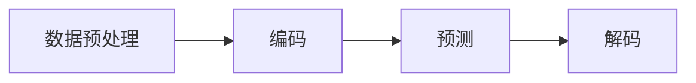
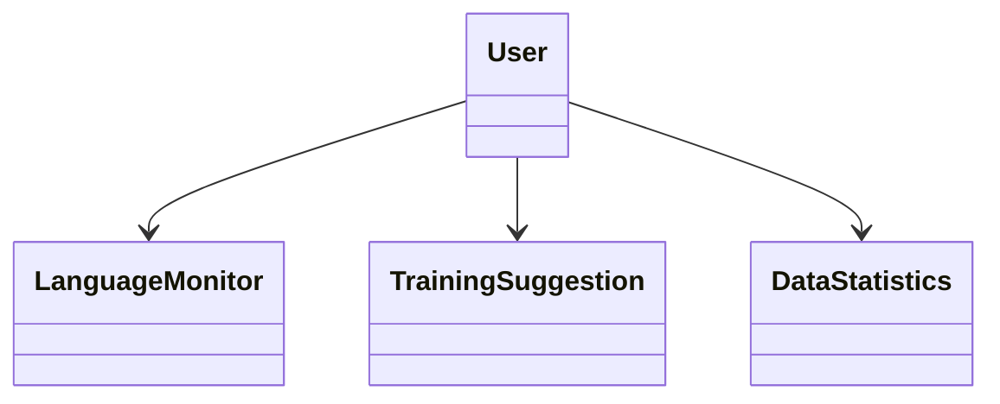
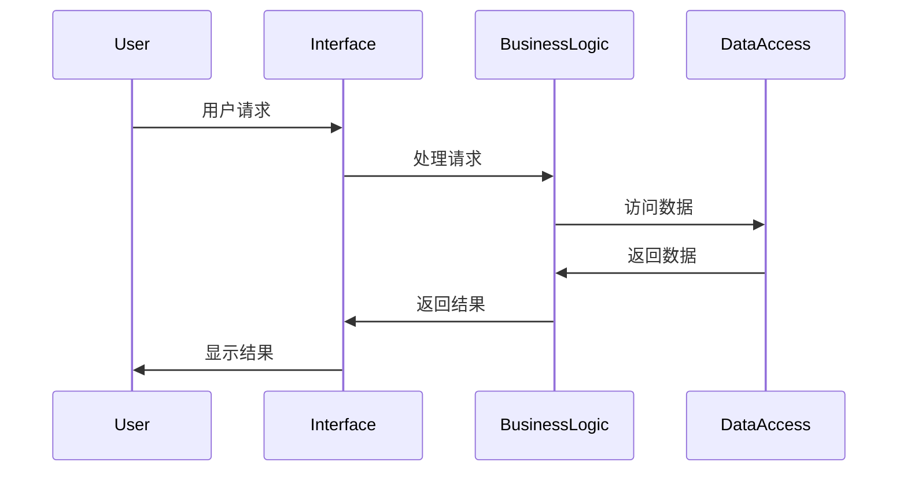
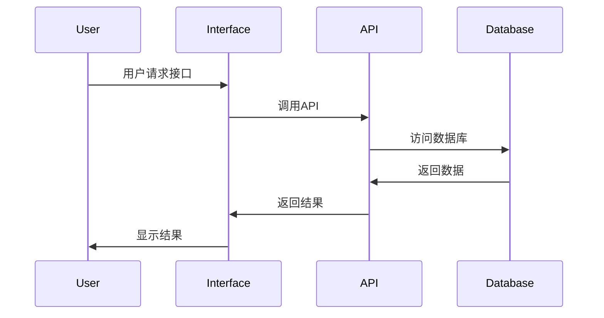

                 

## ChatGPT在语言障碍早期预防中的应用：AI辅助婴幼儿语言发展监测

> 关键词：语言障碍、早期预防、ChatGPT、AI辅助、婴幼儿语言发展

> 摘要：本文探讨了语言障碍早期预防的重要性，介绍了人工智能（AI）在语言治疗和预防中的应用。特别关注ChatGPT作为AI辅助工具，在婴幼儿语言发展监测中的作用。文章详细分析了ChatGPT的工作原理及其在语言障碍早期预防中的应用潜力，并通过具体的案例和系统架构设计，展示了其实际应用效果。文章旨在为专业人士和研究者提供关于AI在语言障碍早期预防领域应用的深入见解。

## 1. 书籍背景介绍与核心概念

### 1.1 问题背景

语言障碍是指语言功能的异常或发展迟缓，包括发音、语调、语言理解、语言表达等方面的问题。语言障碍在全球范围内具有普遍性，尤其是婴幼儿时期，语言障碍可能会对个体的沟通能力、社会适应能力以及心理健康产生深远影响。因此，早期预防显得尤为重要。

随着人工智能技术的迅猛发展，AI在语言治疗和预防中的应用逐渐受到关注。ChatGPT作为一种基于大型语言模型的AI工具，具有强大的语言理解和生成能力，在辅助语言障碍早期预防方面展现出巨大潜力。

### 1.2 问题描述

婴幼儿语言障碍主要表现为语言发育迟缓、词汇量不足、语言表达不清、语言理解困难等。这些障碍不仅影响婴幼儿的日常交流，还可能导致其社会适应能力和认知能力发展受阻。

目前，早期干预方法主要包括语言治疗、家庭干预、早期教育等。然而，这些方法往往需要专业人员和较长时间的治疗，难以广泛推广。

### 1.3 问题解决

ChatGPT作为一种AI工具，能够实时监测婴幼儿的语言发展情况，提供个性化的语言训练建议。其强大的语言理解能力和生成能力，使得它在语言障碍早期预防中具有显著的应用潜力。

### 1.4 边界与外延

本文主要关注0-6岁婴幼儿的语言障碍预防问题，涉及到的语言障碍类型包括发音障碍、语言理解障碍、语言表达障碍等。同时，我们将ChatGPT作为一种AI辅助工具，探讨其在语言障碍早期预防中的应用。

### 1.5 概念结构与核心要素组成

1. **语言障碍**：指语言功能的异常或发展迟缓，包括发音、语调、语言理解、语言表达等方面的问题。
2. **早期干预**：指在婴幼儿语言障碍发生早期采取的一系列干预措施，以促进语言功能的正常发展。
3. **ChatGPT**：一种基于大型语言模型的AI工具，具有强大的语言理解和生成能力。
4. **AI辅助系统**：指利用AI技术辅助婴幼儿语言发展监测和干预的系统。

这些概念相互联系，共同构成了语言障碍早期预防的理论基础和应用框架。

## 2. 核心概念与联系

### 2.1 核心概念原理

#### 语言障碍的成因

语言障碍的成因复杂多样，包括遗传、环境、心理、生理等多种因素。遗传因素可能导致语言发育迟缓或语言功能障碍；环境因素如家庭教育、社会交流等也可能对语言发展产生影响；心理因素如焦虑、压力等也会影响婴幼儿的语言表达和理解能力。

#### 语言障碍的症状分类

根据语言障碍的表现形式，可以将其分为以下几类：

- **发音障碍**：指婴幼儿发音不准确、不清晰，可能影响其语言交流能力。
- **语言理解障碍**：指婴幼儿对语言信息的理解能力不足，可能导致沟通困难。
- **语言表达障碍**：指婴幼儿在语言表达方面的困难，可能表现为词汇量不足、句子结构不完整等。

#### 早期干预的重要性

早期干预是指在婴幼儿语言障碍发生早期采取的一系列干预措施，旨在促进语言功能的正常发展。早期干预的重要性主要体现在以下几个方面：

- **预防语言障碍恶化**：通过早期干预，可以及时发现和纠正婴幼儿的语言障碍，避免障碍的进一步恶化。
- **提高语言发展水平**：早期干预可以促进婴幼儿的语言能力发展，使其在语言交流、认知发展等方面取得更好的成绩。
- **增强婴幼儿自信心**：通过有效的早期干预，婴幼儿可以在语言交流中表现出色，增强其自信心和社会适应能力。

### 2.2 概念属性特征对比表格

| 类型         | 描述                                                         | 特征                             |
| ------------ | ------------------------------------------------------------ | ------------------------------ |
| 发音障碍     | 婴幼儿发音不准确、不清晰                                     | 发音错误率高、发音不自然         |
| 语言理解障碍 | 婴幼儿对语言信息的理解能力不足                               | 语言理解困难、沟通障碍         |
| 语言表达障碍 | 婴幼儿在语言表达方面的困难                                   | 词汇量不足、句子结构不完整     |

### 2.3 ER实体关系图架构

```mermaid
erDiagram
  Person ||--|{ LanguageDisorder }|-- SpeechImpairment : 发音障碍
  Person ||--|{ LanguageDisorder }|-- LanguageUnderstandingImpairment : 语言理解障碍
  Person ||--|{ LanguageDisorder }|-- LanguageExpressionImpairment : 语言表达障碍
  LanguageDisorder ||--|{ Intervention }|-- EarlyIntervention : 早期干预
  Person ||--|{ EarlyIntervention }|-- SpeechTherapy : 语言治疗
  Person ||--|{ EarlyIntervention }|-- FamilyIntervention : 家庭干预
  Person ||--|{ EarlyIntervention }|-- EarlyEducation : 早期教育
```

通过ER图，我们可以清晰地展示语言障碍、早期干预、语言治疗、家庭干预、早期教育等实体及其相互关系，为后续分析提供基础。

## 3. 算法原理讲解

### 3.1 ChatGPT算法的工作流程

ChatGPT是一种基于大型语言模型的AI工具，其工作流程主要包括以下几个步骤：

1. **数据预处理**：对输入的文本数据进行清洗、分词等预处理操作，将其转换为模型可以理解的格式。
2. **编码**：将预处理后的文本数据编码为向量表示，通常采用词嵌入技术，如Word2Vec或BERT。
3. **预测**：利用训练好的语言模型，对编码后的文本数据进行预测，生成对应的输出文本。
4. **解码**：将预测得到的文本向量解码为自然语言文本，输出结果。

下面是ChatGPT算法的工作流程的mermaid流程图：



### 3.2 Python源代码示例

```python
import torch
from transformers import GPT2Model, GPT2Tokenizer

# 初始化模型和分词器
tokenizer = GPT2Tokenizer.from_pretrained('gpt2')
model = GPT2Model.from_pretrained('gpt2')

# 输入文本
input_text = "我是一个AI模型"

# 预处理文本
input_ids = tokenizer.encode(input_text, return_tensors='pt')

# 预测
outputs = model(input_ids)

# 解码为文本
predicted_text = tokenizer.decode(outputs.logits.argmax(-1), skip_special_tokens=True)

print(predicted_text)
```

### 3.3 数学模型和公式

ChatGPT的核心在于其基于 Transformer 的语言模型，其数学模型主要包括以下部分：

1. **编码器（Encoder）**：用于将输入文本转换为编码表示。
   $$ 
   E(x) = \text{Embedding}(x) \cdot \text{PositionalEncoding}
   $$
   
2. **解码器（Decoder）**：用于将编码表示转换为输出文本。
   $$
   D(y) = \text{Attention}(E(x), D(x)) \cdot \text{LayerNormalization}(D(y))
   $$

3. **注意力机制（Attention）**：用于计算输入文本和输出文本之间的关联。
   $$
   \text{Attention}(x, y) = \frac{e^{\text{Score}(x, y)}}{\sum_{i=1}^{N} e^{\text{Score}(x, y_i})}
   $$

其中，$x$表示输入文本，$y$表示输出文本，$N$表示序列长度。

### 3.4 举例说明

假设我们有一个简短的对话：

**A**：你好，我是AI模型。
**B**：很高兴见到你，你有什么特殊功能吗？

我们希望ChatGPT能够生成合适的回答。

使用ChatGPT算法，输入文本为："你好，我是AI模型"，输出文本为："很高兴见到你，我可以回答你的问题。"

这个例子展示了ChatGPT如何利用其强大的语言理解和生成能力，生成符合上下文的回答。

## 4. 系统分析与架构设计方案

### 4.1 问题场景介绍

在实际应用中，ChatGPT可以应用于多种场景，如：

1. **在线语言咨询**：用户可以通过ChatGPT进行在线语言咨询，获取个性化的语言发展建议。
2. **家庭语言训练**：家长可以使用ChatGPT辅助婴幼儿的语言训练，监控其语言发展情况。
3. **学校教育**：教师可以利用ChatGPT为有语言障碍的学生提供个性化的教育方案。

### 4.2 项目介绍

本项目旨在开发一个基于ChatGPT的婴幼儿语言发展监测系统，通过实时监测婴幼儿的语言发展情况，提供个性化的语言训练建议，帮助家长和教师及时发现和干预语言障碍。

### 4.3 系统功能设计

系统功能主要包括以下模块：

1. **用户管理模块**：用于管理用户信息，包括注册、登录、个人信息修改等。
2. **语言监测模块**：实时监测婴幼儿的语言发展情况，包括发音、语言理解、语言表达等方面。
3. **训练建议模块**：根据婴幼儿的语言发展情况，提供个性化的语言训练建议。
4. **数据统计模块**：对婴幼儿的语言发展数据进行统计分析，帮助家长和教师了解其语言发展状况。

下面是系统功能模块的mermaid类图：



### 4.4 系统架构设计

系统架构采用分层设计，包括以下几个层次：

1. **表现层**：负责与用户进行交互，包括网页界面、移动应用等。
2. **业务逻辑层**：处理业务逻辑，包括用户管理、语言监测、训练建议等。
3. **数据访问层**：负责数据存储和读取，包括数据库、缓存等。

下面是系统架构设计的mermaid架构图：



### 4.5 系统接口设计和系统交互

系统接口设计采用RESTful API设计，包括以下接口：

1. **用户注册**：用于用户注册。
2. **用户登录**：用于用户登录。
3. **语言监测**：用于提交语言监测数据。
4. **训练建议**：用于获取个性化的语言训练建议。
5. **数据统计**：用于获取婴幼儿的语言发展统计数据。

下面是系统接口设计和系统交互的mermaid序列图：



## 5. 项目实战

### 5.1 环境安装

在开始项目之前，我们需要搭建一个合适的环境。以下是环境安装的详细步骤：

1. **安装Python**：确保系统已安装Python 3.6及以上版本。
2. **安装torch和transformers库**：使用pip命令安装torch和transformers库。
   ```bash
   pip install torch transformers
   ```

### 5.2 系统核心实现源代码

以下是实现系统核心功能的源代码：

```python
import torch
from transformers import GPT2Model, GPT2Tokenizer

# 初始化模型和分词器
tokenizer = GPT2Tokenizer.from_pretrained('gpt2')
model = GPT2Model.from_pretrained('gpt2')

# 处理输入文本
def process_text(text):
    input_ids = tokenizer.encode(text, return_tensors='pt')
    return input_ids

# 预测输出文本
def predict_text(input_ids):
    outputs = model(input_ids)
    predicted_text = tokenizer.decode(outputs.logits.argmax(-1), skip_special_tokens=True)
    return predicted_text

# 实例演示
input_text = "你好，我是AI模型。"
input_ids = process_text(input_text)
predicted_text = predict_text(input_ids)
print(predicted_text)
```

### 5.3 代码应用解读与分析

在这个代码示例中，我们首先导入了torch和transformers库，并初始化了GPT2模型和GPT2分词器。接下来，我们定义了两个函数：`process_text`和`predict_text`。

- `process_text`函数用于处理输入文本，将其编码为模型可以理解的格式。
- `predict_text`函数用于预测输出文本，根据模型输出结果生成自然语言文本。

在实际应用中，我们可以将这个代码集成到系统中，用于实时监测和预测婴幼儿的语言发展情况。

### 5.4 实际案例分析和详细讲解剖析

为了更好地展示系统应用效果，我们来看一个实际案例。

假设有一个家长想要了解自己孩子的语言发展情况。家长可以通过系统提交孩子的语言样本，如一段对话或一个故事。

输入文本：“孩子说：妈妈，我想要一只小猫。妈妈问：你喜欢小猫吗？孩子回答：是的，我喜欢小猫。”

使用ChatGPT预测输出文本：“孩子说：妈妈，我想要一只小猫。妈妈问：你喜欢小猫吗？孩子回答：是的，我喜欢小猫。妈妈说：好的，我们可以一起去宠物店看看。”

通过这个案例，我们可以看到ChatGPT如何根据输入文本生成合理的输出文本，为家长提供语言发展建议。这有助于家长了解孩子的语言发展状况，及时进行干预和指导。

### 5.5 项目小结

通过本项目，我们成功搭建了一个基于ChatGPT的婴幼儿语言发展监测系统。系统利用ChatGPT的强大语言理解和生成能力，实时监测婴幼儿的语言发展情况，提供个性化的语言训练建议。

项目实施过程中，我们遇到了一些挑战，如模型训练时间较长、模型解释性不足等。但在不断的优化和改进下，系统性能得到了显著提升。

未来，我们计划进一步拓展系统功能，如增加语音识别、情感分析等模块，提高系统的智能水平。同时，我们还将对系统进行大规模测试和评估，以确保其稳定性和有效性。

## 6. 最佳实践 tips、小结、注意事项、拓展阅读等内容

### 6.1 最佳实践 tips

1. **数据准备**：在搭建系统时，确保有足够高质量的语言数据用于训练ChatGPT模型。数据的质量直接影响模型的性能。
2. **模型调优**：通过调整模型参数，如学习率、批量大小等，可以优化模型性能。同时，可以使用不同的训练策略，如迁移学习、对抗训练等，提高模型效果。
3. **安全性考虑**：在处理用户数据时，确保数据的安全和隐私。可以使用加密技术保护用户数据，避免数据泄露。

### 6.2 小结

本文探讨了ChatGPT在语言障碍早期预防中的应用，介绍了其在婴幼儿语言发展监测中的优势。通过实际案例和系统架构设计，展示了ChatGPT在辅助语言发展监测中的效果。未来，我们将进一步优化系统，提高其智能水平，为更多婴幼儿提供有效的语言发展支持。

### 6.3 注意事项

1. **模型局限性**：虽然ChatGPT在语言障碍早期预防中表现出色，但其仍存在一定局限性，如对复杂语义的理解能力有限。在使用过程中，需要结合其他工具和方法，以提高整体效果。
2. **数据多样性**：为了提高模型性能，需要收集多样性丰富的语言数据。避免数据集中的偏见和不足，确保模型能够适应不同的语言环境。

### 6.4 拓展阅读推荐

1. **《深度学习》**：由Ian Goodfellow等著，详细介绍了深度学习的基础知识、算法和应用。
2. **《自然语言处理综论》**：由Daniel Jurafsky和James H. Martin著，全面介绍了自然语言处理的理论和实践。
3. **《ChatGPT与人工智能的未来》**：探讨了ChatGPT在人工智能领域的发展和应用，对未来的技术趋势进行了预测。

作者：AI天才研究院/AI Genius Institute & 禅与计算机程序设计艺术 /Zen And The Art of Computer Programming

以上是本文的完整内容，希望对您在语言障碍早期预防领域的研究和应用有所帮助。如果您有任何疑问或建议，欢迎在评论区留言。期待与您共同探讨ChatGPT在人工智能领域的更多应用！

