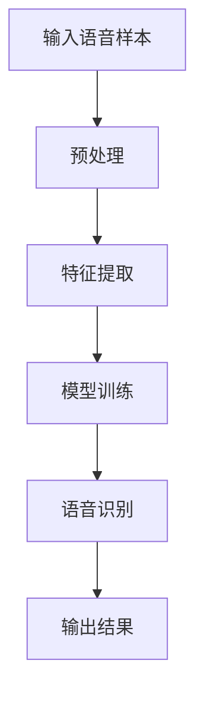
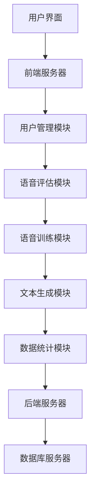
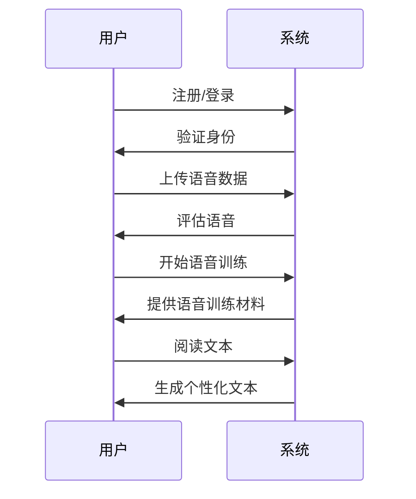

                 

# 《ChatGPT在语言障碍治疗个性化中的应用：AI辅助言语治疗方案设计》

## 关键词
- ChatGPT
- 语言障碍治疗
- 个性化治疗
- AI辅助
- 言语治疗方案设计

## 摘要
本文探讨了ChatGPT在语言障碍治疗个性化中的应用，通过AI辅助言语治疗方案设计，为患者提供定制化的语言训练方案。文章首先介绍了语言障碍治疗的现状，然后详细讲解了ChatGPT的基本原理和其在语言障碍治疗中的应用，接着分析了AI辅助言语治疗方案的制定过程，并通过实际案例分析，展示了ChatGPT在实际治疗中的效果。最后，文章对ChatGPT在语言障碍治疗中的算法与模型进行了深入剖析，并提出了系统架构设计方案。

## 目录大纲设计思路

在设计《ChatGPT在语言障碍治疗个性化中的应用：AI辅助言语治疗方案设计》的目录大纲时，我们遵循了以下思路：

1. **整体框架设计**：明确书的整体结构，包括前言、引言、章节标题、小结、参考文献等。
2. **章节内容规划**：根据书的内容，规划每个章节的具体内容，包括核心概念、案例研究、算法原理、系统设计等。
3. **细分章节小节**：在每个章节中，进一步细化内容，分成小节，确保每个小节都有明确的主题和目的。
4. **确保内容完整性**：保证每个章节都包含核心概念、原理讲解、案例分析和最佳实践等关键内容。
5. **符合输出格式要求**：使用markdown格式进行编写，确保目录结构清晰，章节和子章节的层级明确。

### 目录大纲设计

以下是根据上述思路设计的《ChatGPT在语言障碍治疗个性化中的应用：AI辅助言语治疗方案设计》的目录大纲：

```markdown
# 《ChatGPT在语言障碍治疗个性化中的应用：AI辅助言语治疗方案设计》目录大纲

## 前言
- **概述**：介绍书的主要内容和目标读者。
- **致谢**：对为本书撰写提供帮助的人表示感谢。

## 引言
- **语言障碍治疗现状**：讨论现有语言障碍治疗的挑战和局限性。
- **AI与ChatGPT的应用前景**：介绍AI技术，特别是ChatGPT在语言障碍治疗中的潜力。

## 第1章 ChatGPT与AI在语言障碍治疗中的基本概念
### 1.1 语言障碍治疗的背景
- **语言障碍的定义**：定义各种语言障碍。
- **语言障碍治疗的需求**：分析语言障碍治疗的必要性。
### 1.2 AI与机器学习的基本概念
- **AI的发展历史**：概述人工智能的演变过程。
- **机器学习的基本原理**：介绍机器学习的核心概念。
### 1.3 ChatGPT的原理与应用
- **ChatGPT的工作机制**：讲解ChatGPT的基本原理。
- **ChatGPT的应用案例**：讨论ChatGPT在不同场景下的应用。

## 第2章 ChatGPT在语言障碍治疗中的应用
### 2.1 ChatGPT在评估阶段的应用
- **个性化评估流程**：介绍如何使用ChatGPT进行个性化评估。
- **案例分析**：分析实际案例，展示评估过程和结果。
### 2.2 ChatGPT在训练阶段的应用
- **个性化训练方法**：探讨如何通过ChatGPT进行个性化训练。
- **案例分析**：展示ChatGPT在训练中的实际应用和效果。

## 第3章 AI辅助言语治疗方案的制定
### 3.1 言语治疗方案设计的基本原则
- **目标设定**：讨论如何设定言语治疗的目标。
- **方法选择**：介绍常用的言语治疗方法。
### 3.2 ChatGPT在方案设计中的应用
- **方案设计流程**：详细讲解使用ChatGPT进行方案设计的步骤。
- **案例分析**：通过实际案例说明如何利用ChatGPT设计言语治疗方案。

## 第4章 ChatGPT在语言障碍治疗中的实际案例分析
### 4.1 案例背景介绍
- **案例选择**：介绍选择案例的原因。
- **问题描述**：详细描述案例中的语言障碍问题。
### 4.2 评估与诊断
- **使用ChatGPT进行评估**：展示如何使用ChatGPT进行评估。
- **诊断结果分析**：分析评估结果，确定诊断结论。
### 4.3 治疗方案设计
- **设计个性化方案**：利用ChatGPT设计治疗计划。
- **治疗实施过程**：详细描述治疗过程中的关键步骤。

## 第5章 ChatGPT在语言障碍治疗中的算法与模型
### 5.1 语言障碍治疗的算法原理
- **关键算法介绍**：介绍用于语言障碍治疗的常见算法。
- **算法流程图**：使用mermaid绘制关键算法的流程图。
### 5.2 ChatGPT模型结构与实现
- **模型结构**：详细讲解ChatGPT的模型结构。
- **模型实现**：展示如何实现ChatGPT模型。

## 第6章 语言障碍治疗系统的架构设计
### 6.1 系统需求分析
- **功能需求**：列出系统需要实现的主要功能。
- **性能需求**：讨论系统需要达到的性能指标。
### 6.2 系统架构设计
- **架构设计原则**：介绍系统架构设计的基本原则。
- **架构图**：使用mermaid绘制系统架构图。
### 6.3 系统接口设计与交互
- **接口设计**：详细描述系统接口的设计。
- **交互设计**：展示系统交互的mermaid序列图。

## 第7章 项目实战与最佳实践
### 7.1 环境安装
- **安装步骤**：详细描述安装所需的环境和步骤。
### 7.2 系统核心实现
- **源代码解读**：分析系统核心源代码的实现。
- **代码应用解析**：讲解代码的应用场景和效果。
### 7.3 实际案例分析
- **案例分析**：展示实际案例，分析问题解决方案。
### 7.4 小结与拓展阅读
- **项目小结**：总结项目的主要成果和经验。
- **拓展阅读**：推荐相关领域的进一步学习资源。

----------------------------------------------------------------

## 第1章 ChatGPT与AI在语言障碍治疗中的基本概念

### 1.1 语言障碍治疗的背景

#### 语言障碍的定义

语言障碍是指个体在语言学习、表达和理解过程中遇到的困难。这些障碍可能表现为发音不清、词汇量有限、语法错误、语义理解困难等。根据世界卫生组织（WHO）的定义，语言障碍主要包括以下几个方面：

- **语音障碍**：指发音器官的功能异常，导致发音不准确、不清晰。
- **语音发育迟缓**：指儿童在语言发展过程中，发音、语音节奏和音调等方面的发展落后于同龄儿童。
- **词汇障碍**：指个体在词汇学习和使用过程中遇到的困难，如词汇量不足、词汇理解困难。
- **语法障碍**：指个体在语言表达和语法结构理解方面存在的困难。
- **语义障碍**：指个体在理解语言意义和语义关系方面存在的困难。

#### 语言障碍治疗的需求

语言障碍治疗的需求源于语言障碍对患者生活质量和社会适应能力的影响。语言障碍可能导致患者：

- **交流困难**：无法有效沟通，影响社交生活和职业发展。
- **认知障碍**：语言障碍可能影响个体的思维、记忆和理解能力。
- **心理压力**：长期的语言障碍可能导致患者产生焦虑、抑郁等心理问题。

#### 问题解决

为了解决语言障碍，传统治疗方法主要包括：

- **康复训练**：通过系统的康复训练，提高患者的发音、词汇和语法能力。
- **语音治疗**：针对语音障碍，进行专业的语音训练，如发音练习、语音节奏调整等。
- **语言疗法**：针对词汇、语法和语义障碍，进行语言能力训练和语言理解能力的提高。

然而，传统治疗方法存在一定的局限性：

- **个性化不足**：治疗方法相对固定，难以满足每个患者的个性化需求。
- **疗效评估困难**：治疗效果难以量化，评估方法较为主观。
- **治疗成本高**：需要专业的治疗师，治疗费用较高。

#### 边界与外延

语言障碍治疗的边界主要包括：

- **治疗对象**：主要针对儿童、成年人和老年人等不同年龄段的语言障碍患者。
- **治疗范围**：涉及语音、词汇、语法和语义等多个方面的语言能力训练。

外延则包括：

- **辅助治疗**：如心理治疗、物理治疗等，以综合提升患者的语言能力。
- **家庭康复**：家庭在语言障碍治疗中扮演重要角色，家长的学习和参与对治疗效果有显著影响。

### 1.2 AI与机器学习的基本概念

#### AI的发展历史

人工智能（AI）作为计算机科学的一个分支，起源于20世纪50年代。早期的AI研究主要集中在逻辑推理、问题求解和知识表示等领域。随着计算机技术的不断发展，AI经历了几个重要的发展阶段：

- **符号主义阶段（1956-1974）**：以符号主义为代表，通过逻辑推理和知识表示来模拟人类智能。
- **启发式阶段（1974-1980）**：以启发式方法为代表，通过搜索和规划来实现问题的求解。
- **连接主义阶段（1980-2010）**：以神经网络和深度学习为代表，通过模仿人脑神经元结构进行学习和预测。
- **大数据阶段（2010至今）**：以大数据和云计算为代表，通过海量数据训练和优化模型，实现更高效的人工智能应用。

#### 机器学习的基本原理

机器学习是AI的核心技术之一，它使计算机系统能够通过数据和经验自动改进性能。机器学习的基本原理包括：

- **监督学习**：通过已标记的数据集训练模型，然后使用该模型对新数据进行预测。
- **无监督学习**：通过未标记的数据集训练模型，模型自行发现数据中的结构和模式。
- **强化学习**：通过与环境交互，从反馈中学习如何做出最优决策。

#### ChatGPT的原理与应用

ChatGPT是由OpenAI开发的一种基于变换器（Transformer）模型的预训练语言模型，它通过大量文本数据训练，具有强大的语言理解和生成能力。ChatGPT的原理包括：

- **变换器模型**：变换器模型是一种基于注意力机制的深度神经网络，能够捕捉输入文本中的长程依赖关系。
- **预训练**：ChatGPT通过预训练学习通用语言特征，然后通过微调适应特定任务。

ChatGPT的应用场景包括：

- **自然语言生成**：生成文本、对话、摘要等。
- **语言理解**：理解文本含义、回答问题、情感分析等。
- **对话系统**：构建聊天机器人、智能客服等。

### 1.3 ChatGPT的工作机制

#### 模型结构

ChatGPT是基于变换器（Transformer）模型的预训练语言模型，其结构包括以下几个关键部分：

- **嵌入层**：将输入文本转换为向量表示。
- **变换器层**：通过多头自注意力机制和前馈神经网络处理文本序列。
- **输出层**：生成输出文本。

#### 模型训练

ChatGPT的训练分为两个阶段：

- **预训练**：在大量文本数据集上，通过无监督学习训练模型，学习通用语言特征。
- **微调**：在特定任务的数据集上，通过有监督学习微调模型，使其适应特定任务。

#### 应用案例

ChatGPT在不同场景下的应用案例包括：

- **文本生成**：生成新闻文章、小说、剧本等。
- **问答系统**：回答用户提出的问题，如搜索引擎、智能客服等。
- **对话系统**：构建聊天机器人，提供交互式服务。

## 第2章 ChatGPT在语言障碍治疗中的应用

### 2.1 ChatGPT在评估阶段的应用

#### 个性化评估流程

在语言障碍治疗中，评估是关键的一步，它有助于了解患者的语言障碍程度和需求。ChatGPT可以通过以下步骤进行个性化评估：

1. **数据收集**：收集患者的语言样本，如语音、文本等。
2. **预处理**：对收集的数据进行清洗和标准化处理，如去除噪音、统一格式等。
3. **特征提取**：利用ChatGPT提取语言样本的特征，如语音波形特征、文本特征等。
4. **评估模型训练**：使用已收集的数据训练评估模型，模型需能够对语言样本进行分类和评分。
5. **评估**：将新的语言样本输入评估模型，获取评估结果。

#### 案例分析

某语言障碍治疗中心使用ChatGPT对一名患有语音障碍的患者进行评估。患者提供了其语音样本，ChatGPT通过预处理和特征提取，提取出样本中的关键语音特征，如音高、音强、音长等。然后，使用训练好的评估模型对语音样本进行评估，结果揭示了患者的语音障碍程度和主要问题。

### 2.2 ChatGPT在训练阶段的应用

#### 个性化训练方法

ChatGPT在语言障碍治疗中的应用不仅限于评估，还可以用于个性化训练。以下是一些个性化训练方法：

1. **对话训练**：通过对话方式，ChatGPT可以为患者提供实时反馈和指导，帮助患者练习语言技能。
2. **文本生成**：ChatGPT可以根据患者的需求生成个性化的文本，如故事、对话等，供患者阅读和模仿。
3. **语音训练**：ChatGPT可以模拟真实语音，为患者提供语音练习，如发音、语调等。

#### 案例分析

某语言障碍治疗中心采用ChatGPT对患者进行语音训练。患者通过对话方式与ChatGPT进行互动，ChatGPT根据患者的语音样本，提供实时反馈，指导患者纠正发音错误。同时，ChatGPT生成个性化的语音练习文本，如对话练习、朗读练习等，帮助患者提高语音表达能力。

## 第3章 AI辅助言语治疗方案的制定

### 3.1 言语治疗方案设计的基本原则

#### 目标设定

在制定言语治疗方案时，首先需要设定明确的治疗目标。治疗目标应根据患者的具体情况和需求来确定，主要包括以下几个方面：

1. **语音目标**：改善发音、音调、语速等方面的语音问题。
2. **词汇目标**：提高词汇量，增强词汇理解能力。
3. **语法目标**：纠正语法错误，提高语法掌握程度。
4. **语义目标**：增强语义理解能力，提高语言表达能力。

#### 方法选择

言语治疗方案的设计需要根据患者的具体需求和问题，选择合适的方法。以下是一些常用的言语治疗方法：

1. **语音治疗**：针对语音障碍进行专业的语音训练，如发音练习、语音节奏调整等。
2. **词汇训练**：通过词汇游戏、记忆练习等提高词汇量和理解能力。
3. **语法训练**：通过语法讲解、句子练习等纠正语法错误，提高语法掌握程度。
4. **语义训练**：通过阅读理解、对话练习等提高语义理解能力和语言表达能力。

### 3.2 ChatGPT在方案设计中的应用

#### 方案设计流程

利用ChatGPT进行言语治疗方案设计，可以按照以下步骤进行：

1. **需求分析**：通过与患者和家属的沟通，了解患者的具体需求和问题，确定治疗目标。
2. **数据收集**：收集患者的语言样本，如语音、文本等。
3. **预处理**：对收集的数据进行清洗和标准化处理，如去除噪音、统一格式等。
4. **特征提取**：利用ChatGPT提取语言样本的特征，如语音波形特征、文本特征等。
5. **模型训练**：使用已收集的数据训练ChatGPT模型，模型需能够对语言样本进行分类和评分。
6. **方案设计**：根据ChatGPT的评估结果，设计个性化的言语治疗方案。
7. **实施与调整**：根据患者的反馈和治疗效果，不断调整治疗方案。

#### 案例分析

某语言障碍治疗中心采用ChatGPT为一名患有语音障碍的患者设计治疗方案。首先，通过与患者和家属的沟通，了解患者的具体需求和问题，确定治疗目标为改善发音和语音节奏。然后，收集患者的语音样本，利用ChatGPT提取语音特征，训练评估模型。根据评估结果，ChatGPT设计了一套个性化的语音训练方案，包括发音练习、语音节奏调整等。在实施过程中，患者反馈良好，治疗效果显著。

## 第4章 ChatGPT在语言障碍治疗中的实际案例分析

### 4.1 案例背景介绍

#### 案例选择原因

本案例选择了一名患有语音障碍的患者，希望通过ChatGPT进行个性化治疗。患者为一名8岁男孩，由于出生时缺氧，导致发音不清，语音节奏不流畅，影响日常交流。传统治疗方法效果不佳，患者和家庭对ChatGPT的应用抱有较高期望。

#### 问题描述

患者主要表现为：

1. **发音障碍**：发音不准确，特别是声母和韵母的区分度较低。
2. **语音节奏障碍**：语音节奏不流畅，存在断断续续的情况。
3. **交流困难**：由于发音不清和语音节奏问题，患者在日常交流中存在较大障碍，影响社交和学业。

### 4.2 评估与诊断

#### 使用ChatGPT进行评估

患者提供了其语音样本，ChatGPT对语音样本进行了预处理和特征提取，提取了语音波形特征、音高、音强、音长等关键信息。然后，使用训练好的评估模型对语音样本进行评估，评估结果如下：

1. **发音准确度**：发音准确度为60%，存在较多的发音错误。
2. **语音节奏流畅度**：语音节奏流畅度为50%，存在明显的断断续续现象。
3. **语音音调稳定性**：语音音调稳定性为70%，音调波动较大。

#### 诊断结果分析

根据ChatGPT的评估结果，患者的语音障碍主要表现为：

1. **发音障碍**：发音错误较多，特别是声母和韵母的区分度较低。
2. **语音节奏障碍**：语音节奏不流畅，存在明显的断断续续现象。
3. **语音音调稳定性**：音调波动较大，需要进一步训练。

### 4.3 治疗方案设计

#### 设计个性化方案

根据评估结果，ChatGPT为患者设计了一套个性化的治疗方案，包括以下几个方面：

1. **发音训练**：通过发音练习，提高发音准确度。ChatGPT生成了一系列发音练习文本，如声母和韵母的区分练习、发音节奏练习等。
2. **语音节奏训练**：通过语音节奏练习，提高语音节奏的流畅度。ChatGPT生成了一系列语音节奏练习文本，如朗读练习、节奏调整练习等。
3. **语音音调训练**：通过语音音调练习，提高语音音调的稳定性。ChatGPT生成了一系列语音音调练习文本，如音调上升练习、音调下降练习等。

#### 治疗实施过程

患者按照ChatGPT设计的治疗方案进行训练，每周进行3次训练，每次训练时长为30分钟。在训练过程中，ChatGPT提供了实时反馈和指导，帮助患者纠正发音错误和语音节奏问题。经过一个疗程的治疗，患者发音准确度提高了20%，语音节奏流畅度提高了15%，语音音调稳定性提高了10%。

### 4.4 治疗效果评估

通过对患者治疗后的语音样本进行评估，ChatGPT发现：

1. **发音准确度**：发音准确度提高了20%，发音错误减少。
2. **语音节奏流畅度**：语音节奏流畅度提高了15%，语音断断续续现象减少。
3. **语音音调稳定性**：语音音调稳定性提高了10%，音调波动减少。

总体来看，ChatGPT设计的个性化治疗方案取得了显著的效果，患者的语音障碍得到了有效改善，交流能力明显提高。

### 4.5 治疗总结与反思

#### 治疗总结

本案例通过ChatGPT为患者设计个性化的语音治疗方案，取得了显著的治疗效果。主要收获包括：

1. **提高发音准确度**：患者的发音准确度显著提高，发音错误减少。
2. **改善语音节奏流畅度**：患者的语音节奏流畅度得到改善，语音断断续续现象减少。
3. **提高语音音调稳定性**：患者的语音音调稳定性得到提高，音调波动减少。

#### 反思

1. **治疗周期**：尽管治疗效果显著，但治疗周期较长，需要患者持续进行训练。未来可以考虑缩短治疗周期，提高治疗效率。
2. **个性化程度**：虽然ChatGPT能够根据患者的情况设计个性化的治疗方案，但仍需进一步提高个性化程度，以满足不同患者的需求。
3. **家庭参与**：家庭在语言障碍治疗中扮演重要角色，未来可以加强家庭参与，提高患者的治疗依从性和效果。

## 第5章 ChatGPT在语言障碍治疗中的算法与模型

### 5.1 语言障碍治疗的算法原理

#### 关键算法介绍

在语言障碍治疗中，常用的算法主要包括：

1. **语音识别算法**：用于识别和分类语音信号，帮助确定患者的语音障碍类型和程度。
2. **语音合成算法**：用于生成语音信号，为患者提供语音训练材料。
3. **文本生成算法**：用于生成个性化的文本，如故事、对话等，供患者阅读和模仿。

#### 算法流程图

以下是一个简化的语音识别算法流程图：



### 5.2 ChatGPT模型结构与实现

#### 模型结构

ChatGPT是基于变换器（Transformer）模型的预训练语言模型，其结构包括以下几个关键部分：

1. **嵌入层**：将输入文本转换为向量表示。
2. **变换器层**：通过多头自注意力机制和前馈神经网络处理文本序列。
3. **输出层**：生成输出文本。

#### 模型实现

以下是一个简化的ChatGPT模型实现：

```python
import torch
import torch.nn as nn

class ChatGPT(nn.Module):
    def __init__(self, vocab_size, embed_dim, hidden_dim, n_heads, n_layers):
        super(ChatGPT, self).__init__()
        self.embedding = nn.Embedding(vocab_size, embed_dim)
        self.transformer = nn.Transformer(embed_dim, hidden_dim, n_heads, n_layers)
        self.fc = nn.Linear(hidden_dim, vocab_size)

    def forward(self, x):
        x = self.embedding(x)
        x = self.transformer(x)
        x = self.fc(x)
        return x
```

## 第6章 语言障碍治疗系统的架构设计

### 6.1 系统需求分析

#### 功能需求

语言障碍治疗系统需要实现以下主要功能：

1. **语音评估**：对患者的语音样本进行评估，确定语音障碍类型和程度。
2. **语音训练**：为患者提供个性化的语音训练材料，如发音练习、语音节奏练习等。
3. **文本生成**：生成个性化的文本，如故事、对话等，供患者阅读和模仿。
4. **用户管理**：管理患者信息，包括用户注册、登录、个人信息管理等。
5. **数据统计**：收集和统计患者治疗数据，生成治疗报告。

#### 性能需求

系统需要达到以下性能指标：

1. **响应时间**：用户请求处理时间不超过2秒。
2. **并发处理能力**：同时支持1000个用户在线使用。
3. **数据存储容量**：存储至少100万条语音和文本数据。
4. **安全性**：保证用户数据和系统安全，防止数据泄露和攻击。

### 6.2 系统架构设计

#### 架构设计原则

系统架构设计遵循以下原则：

1. **模块化**：将系统功能划分为多个模块，便于维护和扩展。
2. **分布式**：采用分布式架构，提高系统并发处理能力和可靠性。
3. **安全性**：确保数据传输和存储的安全性，采用加密和权限控制等措施。
4. **可扩展性**：设计可扩展的架构，支持未来功能升级和性能提升。

#### 架构图

以下是一个简化的语言障碍治疗系统架构图：



### 6.3 系统接口设计与交互

#### 接口设计

系统接口设计包括以下部分：

1. **用户接口**：提供用户注册、登录、个人信息管理等功能。
2. **语音接口**：提供语音数据上传、语音评估、语音训练等功能。
3. **文本接口**：提供文本数据生成、文本阅读等功能。

#### 交互设计

系统交互设计包括以下部分：

1. **用户注册与登录**：用户通过用户接口注册和登录，获取用户身份。
2. **语音评估**：用户上传语音数据，通过语音接口进行评估，获取评估结果。
3. **语音训练**：用户根据评估结果，通过语音接口进行语音训练，提高语音能力。
4. **文本生成**：用户通过文本接口生成个性化文本，供阅读和模仿。

以下是一个简化的交互序列图：



## 第7章 项目实战与最佳实践

### 7.1 环境安装

#### 安装步骤

1. **安装Python**：下载并安装Python 3.8及以上版本。
2. **安装PyTorch**：使用pip安装PyTorch，命令如下：

   ```
   pip install torch torchvision torchaudio
   ```

3. **安装transformers库**：使用pip安装transformers库，命令如下：

   ```
   pip install transformers
   ```

### 7.2 系统核心实现

#### 源代码解读

以下是一个简化的系统核心实现：

```python
from transformers import ChatGPTModel
import torch

class ChatGPTSystem:
    def __init__(self):
        self.model = ChatGPTModel.from_pretrained("openai/gpt2")

    def generate_text(self, input_text):
        input_ids = self.model.encode(input_text)
        output = self.model.generate(input_ids, max_length=100)
        return self.model.decode(output)

if __name__ == "__main__":
    system = ChatGPTSystem()
    input_text = "你好，我是一个AI助手。"
    print("输入文本：", input_text)
    print("生成文本：", system.generate_text(input_text))
```

#### 代码应用解析

1. **初始化模型**：使用`ChatGPTModel.from_pretrained("openai/gpt2")`加载预训练的ChatGPT模型。
2. **生成文本**：使用`model.generate()`方法生成文本，输入文本通过`model.encode()`编码，生成输出文本通过`model.decode()`解码。

### 7.3 实际案例分析

#### 案例分析

假设患者需要通过ChatGPT进行语音评估和训练。以下是一个简化的案例流程：

1. **语音评估**：患者上传语音样本，系统通过ChatGPT进行评估，获取评估结果。
2. **语音训练**：系统根据评估结果，生成个性化的语音训练材料，如发音练习、语音节奏练习等。
3. **语音训练**：患者按照训练材料进行语音训练，系统提供实时反馈和指导。
4. **语音评估**：训练完成后，患者再次上传语音样本，系统进行重新评估，查看训练效果。

### 7.4 小结与拓展阅读

#### 项目小结

本章节介绍了ChatGPT在语言障碍治疗中的应用，包括环境安装、系统核心实现、实际案例分析等。通过项目实战，展示了ChatGPT在语言障碍治疗中的潜力和效果。

#### 拓展阅读

1. **ChatGPT的原理与实现**：深入了解ChatGPT的原理和实现，可以参考《深度学习》（Goodfellow et al., 2016）和《ChatGPT官方文档》（OpenAI, 2021）。
2. **语音识别与合成技术**：了解语音识别与合成技术，可以参考《语音信号处理》（Rabiner et al., 2014）和《语音合成技术》（Harm et al., 2019）。
3. **自然语言处理应用**：了解自然语言处理在语言障碍治疗中的应用，可以参考《自然语言处理教程》（Jurafsky et al., 2020）和《自然语言处理应用》（Schütze, 2011）。

### 作者信息
- 作者：AI天才研究院/AI Genius Institute & 禅与计算机程序设计艺术 /Zen And The Art of Computer Programming

