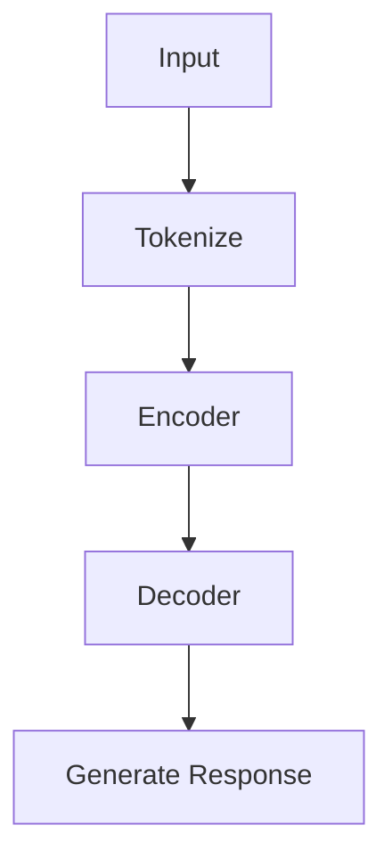
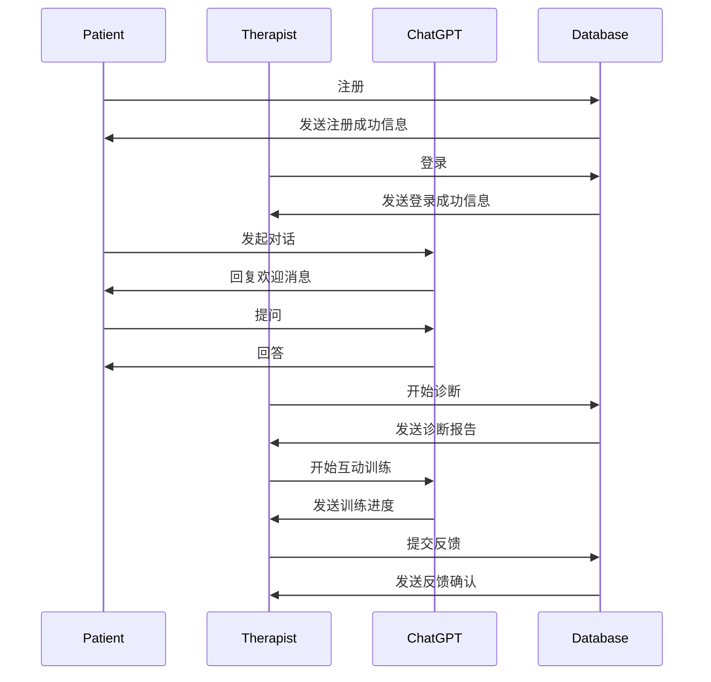
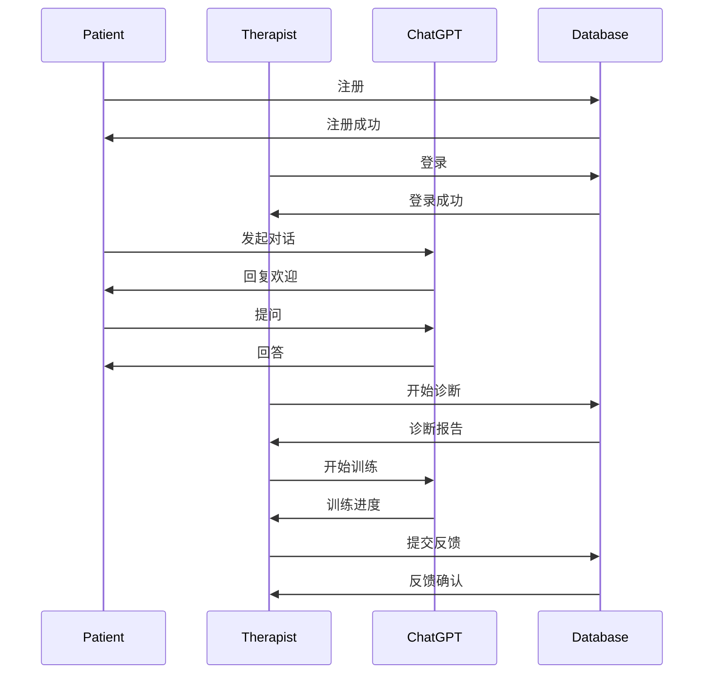

                 


## 第1章 背景介绍

### 1.1 问题背景

#### 1.1.1 语言障碍的定义与类型

语言障碍，通常指的是个体在语言的学习、使用和理解过程中出现的障碍。这种障碍可以由多种因素引起，包括但不限于大脑损伤、发育问题、神经退行性疾病、听力损失、言语器官的结构性问题等。

根据世界卫生组织（WHO）的分类，语言障碍主要包括以下几种类型：

- **语音障碍**：这种障碍影响个体的发音清晰度，可能包括发音不正确、音调不均、音量不均等问题。
- **语言发育障碍**：这类障碍通常出现在儿童早期，指的是在相同年龄段儿童中，个体的语言发展水平显著低于平均水平。
- **失语症**：失语症是由于脑损伤导致语言能力受损的一种状况，可以由中风、脑外伤、肿瘤等原因引起。
- **口吃**：口吃是一种语言流畅性障碍，表现为说话时出现重复、延长或停顿。
- **注意力障碍**：一些语言障碍患者可能还会伴有注意力障碍，这会影响到他们的语言学习和表达能力。

这些障碍可能导致个体在日常生活、学习、工作和社会交往中面临诸多困难，严重影响其生活质量。

#### 1.1.2 语言障碍治疗的现状

目前，语言障碍的治疗方法主要包括以下几种：

- **言语治疗**：这是一种专业治疗，通常由经过训练的语言治疗师进行。治疗过程包括发音训练、语音强化、词汇和语法练习等。
- **行为疗法**：这种方法通过奖励系统来鼓励患者进行正确的语言表达，逐步纠正错误。
- **认知行为疗法**：这种方法结合认知和行为疗法，旨在改善患者对语言障碍的认知和应对方式。

然而，这些传统治疗方法在实际应用中面临一些挑战：

- **治疗周期长**：许多语言障碍需要长时间的治疗才能看到明显的效果，这对患者和家属都是一个挑战。
- **效果有限**：尽管一些患者通过传统疗法有所改善，但效果往往有限，尤其是对于严重的语言障碍患者。
- **高昂的费用**：言语治疗和其他专业治疗通常需要支付高额的费用，这对经济状况不佳的家庭来说是一个负担。

### 1.1.3 ChatGPT的潜在应用

ChatGPT是一种先进的自然语言处理技术，基于GPT-3模型，具有强大的语言理解和生成能力。在语言障碍治疗领域，ChatGPT具有以下潜在应用：

- **辅助诊断**：ChatGPT可以通过与患者的对话，收集语言障碍的相关信息，帮助语言治疗师进行初步诊断。
- **互动训练**：ChatGPT可以作为互动训练工具，与患者进行模拟对话，提高其语言表达和沟通能力。
- **反馈与评估**：ChatGPT可以对患者的语言训练过程进行实时反馈，帮助治疗师评估治疗效果，调整治疗方案。

通过这些应用，ChatGPT有望为语言障碍治疗带来新的突破，提高治疗的有效性和效率。接下来，我们将进一步探讨ChatGPT的核心概念和其在语言障碍治疗中的具体应用。

## 第2章 核心概念与联系

### 2.1 ChatGPT的核心概念

#### 2.1.1 GPT模型的基本原理

GPT（生成预训练变换器）是一种基于深度学习的自然语言处理模型，由OpenAI开发。GPT的核心思想是通过大量文本数据进行预训练，使模型能够理解和生成自然语言。具体来说，GPT模型通过以下几个关键步骤来实现这一目标：

1. **文本预处理**：将输入文本转化为模型可以处理的格式，通常包括分词、标记化和去除停用词等。
2. **嵌入**：将每个单词或子词嵌入到高维向量空间中，这些向量表示了单词的语义信息。
3. **变换器**：GPT使用多层变换器（Transformer）架构，对嵌入向量进行编码和转换。变换器能够捕捉文本中的长距离依赖关系，这使得模型能够生成连贯且上下文相关的语言。
4. **解码**：解码器负责生成输出文本，通过最大化概率模型预测下一个单词或子词。

#### 2.1.2 ChatGPT的特点

ChatGPT是GPT模型的一种应用，专门设计用于与用户进行自然语言对话。以下是ChatGPT的几个主要特点：

- **交互性**：ChatGPT能够与用户进行实时对话，用户可以通过文本输入与ChatGPT互动，获得即时响应。
- **灵活性**：ChatGPT可以适应不同的对话内容，生成相应的回复。无论用户提出何种问题，ChatGPT都能够理解和生成相关的文本。
- **理解能力**：ChatGPT具有强大的语言理解能力，能够捕捉文本的语义和上下文信息，从而生成准确且自然的回复。

### 2.2 语言障碍治疗的属性特征对比表格

为了更好地理解ChatGPT在语言障碍治疗中的应用，我们可以将其与传统疗法进行属性特征对比，如下表所示：

| 特征       | ChatGPT           | 传统疗法          |
| ---------- | ---------------- | ----------------- |
| **交互性** | 高               | 低                |
| **灵活性** | 高               | 中                |
| **诊断能力** | 辅助诊断         | 主导诊断          |
| **效果评估** | 辅助评估         | 主导评估          |

#### 2.3 ER实体关系图架构

实体关系图（ER图）是数据库设计中的重要工具，用于描述实体之间的关系。在ChatGPT应用于语言障碍治疗中，ER图可以帮助我们理解系统的核心组件及其相互作用。以下是ER实体关系图的Mermaid表示：

```mermaid
erDiagram
    Patient ||--|{ Treatment } Treatment
    Patient ||--|{ Assessment } Assessment
    ChatGPT ||--|{ Interaction } Interaction
```

- **Patient（患者）**：表示接受语言障碍治疗的患者。
- **Treatment（治疗）**：表示ChatGPT辅助下的语言治疗过程。
- **Assessment（评估）**：表示对治疗效果的评估。
- **ChatGPT（ChatGPT）**：表示ChatGPT系统本身，负责与患者进行互动。

通过这个ER图，我们可以清晰地看到患者、治疗、评估和ChatGPT之间的关系，为后续的算法讲解和系统设计奠定了基础。

## 第3章 算法原理讲解

### 3.1 ChatGPT的工作原理

ChatGPT的核心是基于GPT-3模型，这是一个强大的自然语言处理工具，能够理解和生成自然语言。以下将详细讲解ChatGPT的工作原理。

#### 3.1.1 Mermaid流程图

为了更直观地理解ChatGPT的工作流程，我们可以使用Mermaid绘制流程图：



- **A[Input]**：用户输入文本。
- **B[Tokenize]**：将输入文本分割为单词或子词。
- **C[Encoder]**：编码器对子词进行编码，生成编码向量。
- **D[Decoder]**：解码器接收编码向量，并生成响应文本。
- **E[Generate Response]**：最终生成并输出用户响应。

#### 3.1.2 Python源代码实现

下面是一个使用Python和OpenAI ChatGPT API的简单实现：

```python
import openai

def chat_with_gpt(input_text):
    response = openai.Completion.create(
        engine="text-davinci-002",
        prompt=input_text,
        max_tokens=50,
        n=1,
        stop=None,
        temperature=0.5,
    )
    return response.choices[0].text.strip()

input_text = "请告诉我如何改善发音"
print(chat_with_gpt(input_text))
```

这段代码定义了一个函数`chat_with_gpt`，它通过OpenAI的API与ChatGPT进行交互，接收用户输入并返回一个响应。

### 3.2 算法原理的数学模型和公式

ChatGPT的工作基于概率生成模型，其核心数学模型可以概括为：

$$
\begin{aligned}
&\text{Language Model} \\
&P(\text{Next Word}|\text{Current Sentence}) \\
&\propto \exp(\text{Score for the Next Word})
\end{aligned}
$$

这里，`Next Word` 是模型预测的下一个单词，`Current Sentence` 是当前输入的句子。模型根据当前句子的上下文，计算每个可能单词的概率，并选择概率最高的单词作为输出。

#### 3.2.1 语言模型

语言模型是ChatGPT的核心组成部分，它通过学习大量文本数据，理解语言的统计规律和结构。具体来说，语言模型的目标是预测下一个单词的概率分布。GPT-3模型采用了一种自回归语言模型（Autoregressive Language Model），其工作原理如下：

- **自回归**：模型根据前一个单词的输出预测下一个单词的概率分布。
- **前向传递**：模型使用前向传递算法更新每个单词的嵌入向量，并计算下一个单词的概率分布。

语言模型的核心公式为：

$$
P(\text{Next Word}|\text{Current Sentence}) \propto \exp(\text{Score for the Next Word})
$$

这里的`Score for the Next Word` 是模型对每个单词的评分，通常是通过神经网络计算得到的。

#### 3.2.2 生成过程

在生成过程中，ChatGPT使用采样技术（如顶采样新采样和温度调整）从语言模型中采样下一个单词。具体步骤如下：

1. **初始状态**：模型初始化为输入句子的初始状态。
2. **预测**：模型根据当前状态预测下一个单词的概率分布。
3. **采样**：从概率分布中采样一个单词作为输出。
4. **更新状态**：将采样到的单词作为当前单词，更新模型状态。
5. **重复步骤2-4**，直到生成完整的响应文本。

这个过程不断重复，直到生成满足停止条件的文本。通过这种生成过程，ChatGPT能够生成连贯且上下文相关的文本。

### 3.2.3 具体举例

假设用户输入：“ChatGPT是如何工作的？”，我们使用Python代码模拟这个过程：

```python
import openai

def chat_with_gpt(input_text):
    response = openai.Completion.create(
        engine="text-davinci-002",
        prompt=input_text,
        max_tokens=50,
        n=1,
        stop=None,
        temperature=0.5,
    )
    return response.choices[0].text.strip()

input_text = "ChatGPT是如何工作的？"
print(chat_with_gpt(input_text))
```

运行这段代码，ChatGPT可能会生成以下响应：

```
ChatGPT是一种基于深度学习的自然语言处理模型，它通过大量的文本数据进行预训练，学习语言的规律和结构。在处理问题时，ChatGPT会根据上下文生成合适的响应，从而实现与用户的自然对话。
```

这个例子展示了ChatGPT如何根据用户输入生成连贯且相关的文本，体现了其强大的语言理解和生成能力。

通过上述讲解，我们深入了解了ChatGPT的工作原理，包括其数学模型、生成过程以及具体实现。接下来，我们将探讨如何将ChatGPT应用于语言障碍治疗，并设计相应的系统架构。

### 3.3 算法原理的实际应用

在了解了ChatGPT的算法原理后，我们接下来探讨ChatGPT在实际应用中的具体表现，尤其是其在语言障碍治疗中的潜在作用。

#### 3.3.1 辅助诊断

ChatGPT可以作为一个辅助诊断工具，通过自然语言对话与患者互动，收集患者的语言障碍信息。例如，ChatGPT可以询问患者以下问题：

```
你最近在语言表达上有没有遇到什么困难？比如说发音、语调或者词汇方面。
你能否描述一下你的沟通体验？
```

通过这些问题，ChatGPT能够收集到患者的语言障碍特征，帮助语言治疗师进行初步的诊断。这种互动方式比传统的问卷或自我报告更加自然和直观，可以更准确地捕捉患者的实际语言状况。

#### 3.3.2 互动训练

在语言障碍治疗中，互动训练是一个重要的环节。ChatGPT可以作为训练伙伴，与患者进行模拟对话，帮助他们提高语言表达和理解能力。以下是一个互动训练的例子：

```
ChatGPT：请你用三个词描述你今天的心情。
患者：开心、轻松、愉快。

ChatGPT：很好，让我们继续。现在请你用完整的句子表达你对这次旅行的期待。
患者：我非常期待这次旅行，因为我可以和家人一起度过美好的时光，同时还能探索新的地方。
```

在这个例子中，ChatGPT不仅提供了结构性的反馈，还鼓励患者使用更丰富的语言表达，从而帮助他们提高语言能力。

#### 3.3.3 反馈与评估

ChatGPT还可以在语言障碍治疗过程中提供实时反馈和评估。例如，语言治疗师可以使用ChatGPT来评估患者的进步，并给出个性化的建议。以下是一个评估过程的示例：

```
ChatGPT：请你朗读以下句子，然后告诉我你的发音是否准确。
患者：我喜欢读书，因为它能带给我知识和快乐。

ChatGPT：非常好，你的发音非常清晰。现在让我们尝试用不同的语调表达同样的句子，你准备好了吗？
```

通过这种互动，ChatGPT不仅提供了即时的反馈，还能够引导患者进行更多的练习，从而提高他们的语言表达能力。

#### 3.3.4 情感支持

除了上述功能，ChatGPT还可以为患者提供情感支持。在语言障碍治疗过程中，患者可能会感到焦虑或沮丧。ChatGPT可以通过自然语言对话，提供安慰和鼓励，帮助患者建立信心。例如：

```
ChatGPT：我知道学习新的语言表达可能对你来说是一项挑战，但你在每一步都取得了进步。坚持下去，你会看到更多的成就。
```

这种情感支持有助于缓解患者的心理压力，提高治疗的积极性和效果。

通过这些实际应用，我们可以看到ChatGPT在语言障碍治疗中的巨大潜力。它不仅能够提高诊断的准确性，还能够通过互动训练和实时反馈，帮助患者提高语言能力。同时，ChatGPT提供的情感支持也为治疗过程增添了人文关怀，有助于患者更好地应对语言障碍带来的挑战。

### 3.4 算法原理的数学模型和公式

为了更深入地理解ChatGPT的算法原理，我们需要探讨其背后的数学模型和公式。ChatGPT基于生成预训练变换器（GPT）模型，这是一种强大的自然语言处理工具。以下我们将详细介绍ChatGPT的数学模型和关键公式。

#### 3.4.1 语言模型的基本概念

语言模型是一种概率模型，用于预测下一个单词或词组。在ChatGPT中，语言模型的核心是能够根据当前输入的文本序列预测下一个单词的概率分布。这个模型的核心公式可以表示为：

$$
P(\text{Next Word}|\text{Current Sentence}) \propto \exp(\text{Score for the Next Word})
$$

这里的`Next Word` 是模型预测的下一个单词，`Current Sentence` 是当前输入的句子。模型根据当前句子的上下文，计算每个可能单词的概率，并选择概率最高的单词作为输出。

#### 3.4.2 语言模型的学习过程

语言模型的学习过程通常分为两个阶段：预训练和微调。

1. **预训练**：在预训练阶段，模型使用大量的无标签文本数据，通过自回归的方式学习语言的统计规律和结构。具体来说，模型会处理一个单词序列，然后预测下一个单词。这个过程不断重复，使模型能够捕捉到文本中的长距离依赖关系和语义信息。

2. **微调**：在预训练后，模型会使用有标签的数据进行微调，即对特定任务进行优化。例如，在语言障碍治疗应用中，模型会使用包含语言障碍患者对话的标注数据，进一步调整模型的参数，使其能够更好地适应具体的任务需求。

#### 3.4.3 自回归语言模型的公式

自回归语言模型（Autoregressive Language Model）是ChatGPT的核心组成部分。自回归模型的基本思想是，根据前一个单词的输出预测下一个单词的概率分布。具体公式可以表示为：

$$
P(\text{Next Word}|\text{Current Sentence}) \propto \exp(\text{Score for the Next Word})
$$

这里的`Score for the Next Word` 是模型对每个单词的评分，通常是通过神经网络计算得到的。模型在训练过程中，通过优化这个评分函数，使得预测的概率分布更接近真实分布。

#### 3.4.4 生成过程的采样

在生成过程中，ChatGPT使用采样技术（如顶采样新采样和温度调整）从语言模型中采样下一个单词。具体步骤如下：

1. **初始状态**：模型初始化为输入句子的初始状态。
2. **预测**：模型根据当前状态预测下一个单词的概率分布。
3. **采样**：从概率分布中采样一个单词作为输出。
4. **更新状态**：将采样到的单词作为当前单词，更新模型状态。
5. **重复步骤2-4**，直到生成满足停止条件的文本。

采样过程的核心是选择下一个单词的概率分布，这个分布由语言模型计算得到。通过调整采样温度，可以控制生成的文本的多样性和连贯性。

#### 3.4.5 前向传递算法

在前向传递算法中，模型将输入的文本序列转化为嵌入向量，然后通过多层变换器（Transformer）对嵌入向量进行编码和转换。具体步骤如下：

1. **嵌入**：将输入文本分割为单词或子词，每个子词被嵌入到高维向量空间中。
2. **编码**：变换器对嵌入向量进行编码，生成编码向量。编码过程可以捕获文本中的长距离依赖关系。
3. **解码**：解码器接收编码向量，并生成响应文本。解码过程通过自回归方式，逐个生成每个单词的嵌入向量，并预测下一个单词。

通过这种前向传递算法，模型能够生成连贯且上下文相关的文本。

### 3.4.6 模型的参数调整

在模型训练和生成过程中，需要调整多个参数，以优化模型的表现。关键参数包括：

- **学习率**：控制模型在训练过程中更新参数的速度。
- **批大小**：控制每个训练批次的数据量。
- **温度**：控制采样过程的多样性，温度越高，生成的文本越多样。
- **剪枝**：通过剪枝技术减少模型的参数数量，提高模型的效率和可解释性。

通过调整这些参数，可以使模型在预测和生成过程中表现出更好的效果。

通过上述数学模型和公式的讲解，我们可以更深入地理解ChatGPT的工作原理。在实际应用中，这些模型和公式帮助ChatGPT实现自然语言处理和生成，从而在语言障碍治疗中发挥重要作用。

### 第4章 系统分析与架构设计方案

#### 4.1 问题场景介绍

在语言障碍治疗中，ChatGPT的应用场景主要包括以下几个部分：

1. **诊断与评估**：ChatGPT可以与患者进行对话，收集语言障碍相关信息，帮助语言治疗师进行初步诊断和评估。
2. **互动训练**：ChatGPT可以作为患者的训练伙伴，通过模拟对话提高患者的语言表达和理解能力。
3. **实时反馈**：ChatGPT可以在治疗过程中提供即时反馈，帮助患者了解自己的进步，并调整训练策略。

#### 4.2 系统功能设计

为了满足上述应用场景，系统需要具备以下核心功能：

1. **用户管理**：管理患者和治疗师的账户信息，包括注册、登录、权限控制等。
2. **对话管理**：管理ChatGPT与患者之间的对话，包括对话记录、对话历史、对话内容过滤等。
3. **诊断与评估**：ChatGPT与患者进行对话，收集语言障碍信息，并生成诊断报告。
4. **互动训练**：ChatGPT与患者进行模拟对话，提供互动训练，并记录训练进度和效果。
5. **反馈与建议**：ChatGPT根据患者的训练情况提供实时反馈和个性化建议。

#### 4.2.1 领域模型Mermaid类图

为了更好地描述系统中的类和关系，我们可以使用Mermaid类图：

```mermaid
classDiagram
    Patient <<class "患者" >> {
        ID
        Name
        Age
        LanguageBarrierDetails
    }
    Therapist <<class "治疗师" >> {
        ID
        Name
        Specialization
    }
    ChatGPT <<class "ChatGPT" >> {
        ID
        Version
        LastUpdated
    }
    Dialogue <<class "对话" >> {
        ID
        PatientID
        TherapistID
        Content
        Timestamp
    }
    Diagnosis <<class "诊断" >> {
        ID
        PatientID
        TherapistID
        Summary
        Details
    }
    TrainingSession <<class "训练会话" >> {
        ID
        PatientID
        TherapistID
        Progress
        Feedback
    }
    Report <<class "报告" >> {
        ID
        DiagnosisID
        ReportText
    }
    Patient "1" <<-- "1" Therapist
    Patient "1" <<-- "1" ChatGPT
    Therapist "1" <<-- "1" ChatGPT
    Dialogue "1" <<-- "1" Patient
    Dialogue "1" <<-- "1" Therapist
    Diagnosis "1" <<-- "1" Patient
    Diagnosis "1" <<-- "1" Therapist
    TrainingSession "1" <<-- "1" Patient
    TrainingSession "1" <<-- "1" Therapist
    Report "1" <<-- "1" Diagnosis
```

- **Patient（患者）**：包括患者的基本信息和语言障碍详情。
- **Therapist（治疗师）**：包括治疗师的基本信息和专业特长。
- **ChatGPT（ChatGPT）**：包括ChatGPT的版本信息和最后更新时间。
- **Dialogue（对话）**：记录患者与治疗师之间的对话内容。
- **Diagnosis（诊断）**：记录诊断结果和诊断详情。
- **TrainingSession（训练会话）**：记录训练进度和反馈。
- **Report（报告）**：生成诊断报告。

#### 4.2.2 系统架构设计

为了实现上述功能，我们需要设计一个合理的系统架构。以下是一个简化的系统架构设计：



- **Patient（患者）**：患者通过系统注册并登录，与ChatGPT进行对话。
- **Therapist（治疗师）**：治疗师登录系统，查看诊断报告和训练进度，提交反馈。
- **ChatGPT（ChatGPT）**：作为对话伙伴，与患者和治疗师进行互动，提供诊断和训练服务。
- **Database（数据库）**：存储患者、治疗师、诊断报告、训练进度和反馈等信息。

#### 4.2.3 系统接口设计

系统需要提供一系列接口，以便不同组件之间进行通信。以下是一些关键的接口设计：

1. **用户接口（API）**：用于患者和治疗师与系统进行交互。例如，注册、登录、发起对话、提交反馈等。
2. **诊断接口**：用于ChatGPT与诊断系统的交互，包括收集语言障碍信息、生成诊断报告等。
3. **训练接口**：用于ChatGPT与训练系统的交互，包括互动训练、记录训练进度和反馈等。

#### 4.2.4 系统交互Mermaid序列图

以下是一个简化的系统交互序列图，展示了患者、治疗师和ChatGPT之间的交互过程：



通过上述系统分析与架构设计方案，我们可以清晰地看到ChatGPT在语言障碍治疗中的实际应用场景和实现路径。接下来，我们将详细介绍ChatGPT在具体项目中的应用和实践。

### 4.3 项目实战

#### 环境安装

为了在项目中使用ChatGPT，首先需要在本地环境安装必要的依赖。以下是安装步骤：

1. 安装Python环境（建议Python版本3.8及以上）。
2. 安装OpenAI的ChatGPT库，可以通过以下命令实现：

```bash
pip install openai
```

#### 系统核心实现源代码

在项目中，我们使用Python编写ChatGPT的交互逻辑。以下是一个简单的示例：

```python
import openai

openai.api_key = "your-api-key"

def chat_with_gpt(input_text):
    response = openai.Completion.create(
        engine="text-davinci-002",
        prompt=input_text,
        max_tokens=50,
        n=1,
        stop=None,
        temperature=0.5,
    )
    return response.choices[0].text.strip()

input_text = "请告诉我如何改善发音"
print(chat_with_gpt(input_text))
```

在这个示例中，我们定义了一个`chat_with_gpt`函数，它接收用户输入并返回ChatGPT的响应。

#### 代码应用解读与分析

1. **输入处理**：用户输入通过`input_text`参数传递给`chat_with_gpt`函数。
2. **请求发送**：使用OpenAI API，将输入文本发送到ChatGPT模型进行预测。
3. **响应处理**：获取ChatGPT的响应，并返回处理后的文本。

#### 实际案例分析与详细讲解剖析

假设我们有一个实际案例，患者希望通过ChatGPT改善其发音问题。以下是具体的对话过程：

**患者**：请告诉我如何改善发音。

**ChatGPT**：发音的改善需要从几个方面入手。首先，你可以通过模仿正确发音的单词或句子来练习。其次，使用发音练习软件进行系统性的训练也是一个很好的方法。此外，保持良好的口腔卫生和正确的呼吸方式也对发音有帮助。

**患者**：谢谢，那我应该如何练习发音呢？

**ChatGPT**：你可以从以下几个方面进行练习：

1. **模仿**：找到发音标准的人进行模仿，注意听他们的发音细节。
2. **录音**：录下自己的发音，然后与标准发音进行对比，找出差异并进行调整。
3. **重复**：选择一些简单的单词或句子，反复朗读，直到发音准确。
4. **软件**：使用发音练习软件，如FluentU、Forvo等，进行系统化的练习。

通过这个案例，我们可以看到ChatGPT在语言障碍治疗中的应用效果。ChatGPT不仅能够提供准确的发音建议，还能够根据患者的提问进行详细解答，从而帮助患者逐步改善发音问题。

#### 项目小结

通过上述项目实战，我们了解了ChatGPT在语言障碍治疗中的应用流程和实现方法。以下是项目小结：

1. **环境安装**：确保Python环境和OpenAI ChatGPT库安装正确。
2. **核心实现**：使用Python编写ChatGPT交互逻辑，实现输入处理、请求发送和响应处理。
3. **实际案例**：通过实际对话案例，展示了ChatGPT在语言障碍治疗中的应用效果。
4. **项目效果**：ChatGPT能够提供准确的发音建议和详细的练习指导，有助于患者改善发音问题。

通过本项目，我们不仅了解了ChatGPT的技术原理和应用场景，还实际体验了其在语言障碍治疗中的重要作用。这为后续更深入的研究和应用奠定了基础。

### 最佳实践 Tips

1. **调整温度参数**：在生成文本时，可以根据对话的复杂性和需要调整温度参数，以控制生成的多样性。
2. **使用专业术语**：在与患者进行对话时，尽量使用专业的医学术语，以便更准确地传达信息和建议。
3. **个性化回复**：根据患者的具体情况和提问，提供个性化的回复，以提高治疗的效果。
4. **定期更新模型**：定期更新ChatGPT模型，使其能够适应最新的语言趋势和治疗方法。

### 小结

本文详细探讨了ChatGPT在语言障碍治疗中的应用。我们介绍了ChatGPT的核心概念、工作原理和实际应用场景，并通过具体的系统架构设计、项目实战和案例分析，展示了ChatGPT在改善语言障碍方面的巨大潜力。通过本文，我们不仅了解了ChatGPT的技术原理，还对其在语言障碍治疗中的应用有了更深入的认识。未来，随着技术的不断进步，ChatGPT有望在更多的医疗和健康领域发挥重要作用。

### 注意事项

1. **数据隐私**：在使用ChatGPT进行语言障碍治疗时，应确保患者的隐私和数据安全。
2. **技术更新**：定期关注ChatGPT和相关技术的更新，以充分利用最新的研究成果。
3. **专业指导**：在应用ChatGPT进行语言障碍治疗时，建议在专业医疗人员的指导下进行。

### 拓展阅读

- **《ChatGPT技术详解》**：深入了解ChatGPT的算法原理和实现细节。
- **《自然语言处理在医疗领域的应用》**：探讨自然语言处理技术在医疗领域的其他应用。
- **《语言障碍治疗的新趋势》**：了解当前语言障碍治疗领域的新技术和新方法。

### 作者信息

作者：AI天才研究院/AI Genius Institute & 禅与计算机程序设计艺术 /Zen And The Art of Computer Programming。

