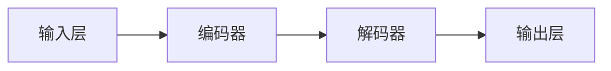
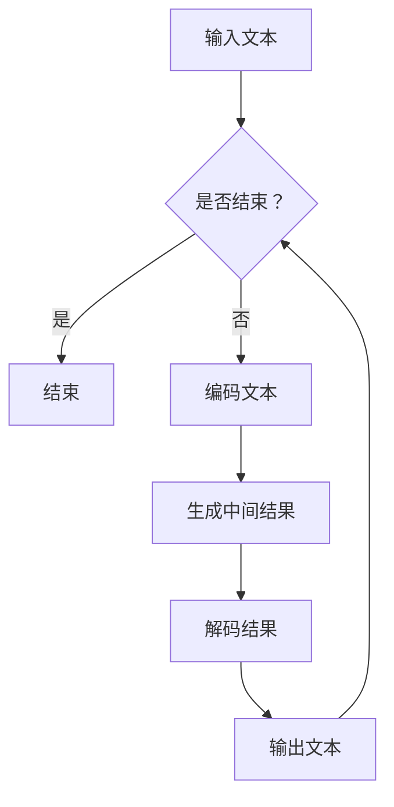
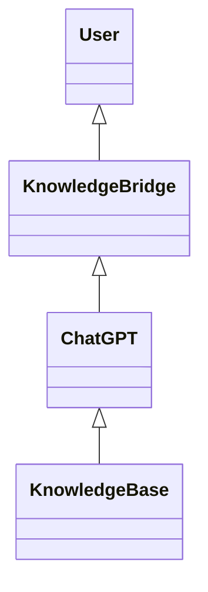
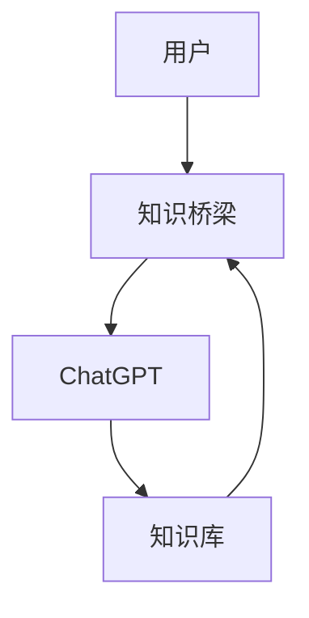
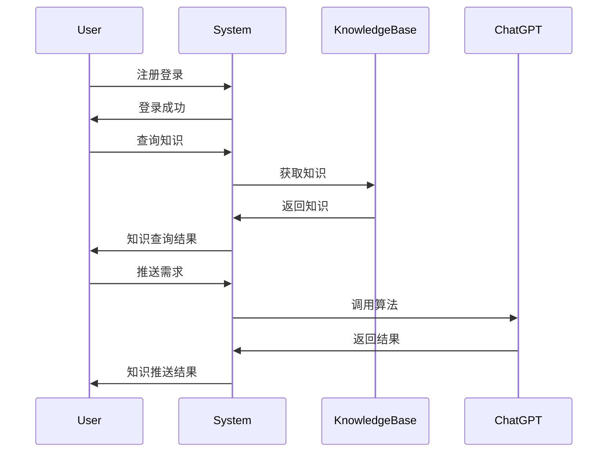

                 

# ChatGPT在跨代知识传承中的桥梁作用

## 关键词
- 跨代知识传承
- ChatGPT
- 知识桥梁
- 人工智能
- 技术传承
- 知识共享

## 摘要
本文旨在探讨ChatGPT在跨代知识传承中的桥梁作用。随着技术的飞速发展，如何高效地传递知识成为了一个重要的问题。ChatGPT作为一种先进的自然语言处理技术，为跨代知识传承提供了新的可能。本文首先介绍了跨代知识传承的挑战和ChatGPT的基本原理，然后分析了ChatGPT在知识传承中的作用，最后提出了构建知识桥梁的方法和步骤。通过本文的探讨，希望能为跨代知识传承提供一些有益的启示。

## 第一部分：背景介绍

### 1.1. 问题背景

#### 1.1.1. 跨代知识传承的挑战

跨代知识传承是知识管理中的重要环节。在传统意义上，知识传承主要通过教育、培训、实践等方式进行。然而，随着科技的发展，知识的更新速度越来越快，传统的知识传承方式面临巨大的挑战：

1. **知识复杂性增加**：现代知识体系越来越复杂，涉及多个学科领域，传统的口传心授方式难以满足需求。
2. **知识更新频率加快**：互联网和信息技术的发展，使得知识更新速度加快，传统的知识传承方式难以跟上知识更新的步伐。
3. **知识传播渠道有限**：传统教育、培训等方式的传播渠道有限，难以实现大规模、快速的知识传播。

#### 1.1.2. ChatGPT的崛起

ChatGPT是由OpenAI开发的一种基于Transformer的预训练语言模型。它具有以下特点：

1. **强大的自然语言处理能力**：ChatGPT能够理解和生成自然语言，这使得它能够处理复杂的知识内容。
2. **大规模预训练**：ChatGPT在大规模数据集上进行预训练，积累了丰富的知识。
3. **灵活的交互方式**：ChatGPT可以通过文本、语音等多种方式进行交互，这使得它能够适应不同的知识传承场景。

#### 1.1.3. ChatGPT在知识传承中的作用

ChatGPT的出现为跨代知识传承提供了新的可能性。它能够在以下几个方面发挥重要作用：

1. **知识自动化生成**：ChatGPT可以根据现有的知识库自动生成文档、教程等，使得知识传承更加高效。
2. **个性化学习**：ChatGPT可以根据学习者的需求和知识水平，提供个性化的学习内容，提高学习效果。
3. **知识问答**：ChatGPT可以作为智能问答系统，为学习者提供即时的知识解答，帮助他们解决实际问题。

### 1.2. 核心概念

#### 1.2.1. 跨代知识传承

跨代知识传承是指在不同代际之间传递和共享知识的过程。它包括以下几个关键要素：

1. **知识内容**：知识传承的核心是知识内容，它可以是理论、方法、技能等。
2. **传承者**：传承者是知识的传递者，他们拥有丰富的知识和经验。
3. **学习者**：学习者是知识的接受者，他们需要通过学习来获取和掌握知识。

#### 1.2.2. ChatGPT技术基础

ChatGPT是一种基于Transformer的预训练语言模型。它的工作原理主要包括以下几个方面：

1. **预训练**：ChatGPT在大规模数据集上进行预训练，学习语言模式、知识结构等。
2. **微调**：在特定任务上对ChatGPT进行微调，使其能够更好地适应具体场景。

#### 1.2.3. 知识桥梁概念

知识桥梁是指用于连接不同知识体系、不同学习场景的工具或平台。知识桥梁需要具备以下特点：

1. **互联互通**：知识桥梁能够连接不同的知识体系，实现知识的共享和传递。
2. **智能推荐**：知识桥梁可以根据学习者的需求和知识水平，提供个性化的学习内容。
3. **自适应**：知识桥梁能够根据知识更新的速度和频率，动态调整知识内容和学习方式。

### 1.3. 边界与外延

#### 1.3.1. ChatGPT的应用范围

ChatGPT的应用范围非常广泛，包括但不限于以下几个方面：

1. **教育领域**：ChatGPT可以用于智能问答、个性化学习等。
2. **企业培训**：ChatGPT可以用于企业内部知识库的构建、员工培训等。
3. **公共服务**：ChatGPT可以用于政府、医疗、法律等公共服务领域。

#### 1.3.2. 跨代知识传承的限制

跨代知识传承受到以下几个因素的制约：

1. **知识本身的复杂性**：知识本身具有复杂性，难以通过简单的传授方式进行传承。
2. **学习者的接受能力**：学习者的接受能力有限，难以快速掌握复杂知识。
3. **传承者的表达能力**：传承者的表达能力有限，难以将知识传授得生动、形象。

#### 1.3.3. 知识桥梁的构建方法

构建知识桥梁需要遵循以下几个原则：

1. **开放性**：知识桥梁需要具备开放性，能够连接不同的知识体系。
2. **灵活性**：知识桥梁需要具备灵活性，能够适应不同的知识传承场景。
3. **智能化**：知识桥梁需要具备智能化，能够根据学习者的需求和知识水平，提供个性化的服务。

## 第二部分：核心概念与联系

### 2.1. ChatGPT原理与特性

#### 2.1.1. ChatGPT的工作原理

ChatGPT的工作原理主要包括以下几个步骤：

1. **预训练**：ChatGPT在大规模数据集上进行预训练，学习语言模式、知识结构等。
2. **微调**：在特定任务上对ChatGPT进行微调，使其能够更好地适应具体场景。
3. **生成**：ChatGPT根据输入的文本或问题，生成相应的文本或回答。

#### 2.1.2. ChatGPT的主要特性

ChatGPT具有以下主要特性：

1. **自然语言处理能力**：ChatGPT能够理解和生成自然语言，这使得它能够处理复杂的知识内容。
2. **大规模预训练**：ChatGPT在大规模数据集上进行预训练，积累了丰富的知识。
3. **灵活的交互方式**：ChatGPT可以通过文本、语音等多种方式进行交互，这使得它能够适应不同的知识传承场景。

#### 2.1.3. ChatGPT与传统对话系统的对比

ChatGPT与传统对话系统在以下几个方面存在差异：

1. **知识范围**：ChatGPT具有更广泛的知识范围，能够处理复杂的知识内容。
2. **交互方式**：ChatGPT能够通过多种方式进行交互，而传统对话系统通常只能通过文本或语音进行交互。
3. **自适应能力**：ChatGPT具有更强的自适应能力，能够根据用户的需求和场景动态调整回答。

### 2.2. 跨代知识传递模型

#### 2.2.1. 跨代知识传递的概念

跨代知识传递是指在不同代际之间传递和共享知识的过程。它包括以下几个关键要素：

1. **知识内容**：知识传递的核心是知识内容，它可以是理论、方法、技能等。
2. **传承者**：传承者是知识的传递者，他们拥有丰富的知识和经验。
3. **学习者**：学习者是知识的接受者，他们需要通过学习来获取和掌握知识。

#### 2.2.2. 跨代知识传递的挑战

跨代知识传递面临以下几个挑战：

1. **知识复杂性增加**：现代知识体系越来越复杂，涉及多个学科领域，传统的口传心授方式难以满足需求。
2. **知识更新频率加快**：互联网和信息技术的发展，使得知识更新速度加快，传统的知识传承方式难以跟上知识更新的步伐。
3. **知识传播渠道有限**：传统教育、培训等方式的传播渠道有限，难以实现大规模、快速的知识传播。

#### 2.2.3. 跨代知识传递的关键要素

跨代知识传递的关键要素包括：

1. **知识内容**：知识内容是跨代知识传递的核心，它需要具有代表性、实用性和前瞻性。
2. **传承者**：传承者是知识传递的关键，他们需要具备丰富的知识和经验，同时具备良好的表达能力。
3. **学习者**：学习者是知识传递的接受者，他们需要具备一定的学习能力和接受能力。

### 2.3. 知识桥梁机制

#### 2.3.1. 知识桥梁的构成

知识桥梁由以下几个部分构成：

1. **知识库**：知识库是知识桥梁的基础，它存储了丰富的知识内容。
2. **传递者**：传递者是知识桥梁的桥梁，他们负责将知识从传承者传递给学习者。
3. **学习者**：学习者是知识桥梁的目标，他们通过知识桥梁获取知识。

#### 2.3.2. 知识桥梁的功能

知识桥梁的主要功能包括：

1. **知识传递**：知识桥梁能够实现知识的传递，使得知识能够在不同代际之间共享。
2. **知识共享**：知识桥梁能够实现知识的共享，使得知识能够在更大范围内传播。
3. **知识优化**：知识桥梁能够对知识进行优化，使得知识更加实用、有价值。

#### 2.3.3. 知识桥梁的实现方法

知识桥梁的实现方法包括：

1. **在线教育平台**：通过在线教育平台，实现知识的在线传递和共享。
2. **智能问答系统**：通过智能问答系统，实现知识的即时传递和解答。
3. **知识图谱**：通过知识图谱，实现知识的结构化和优化。

### 2.4. 核心概念关系图

为了更好地理解本文的核心概念，我们使用了Mermaid流程图来展示核心概念之间的关系。以下是一个简单的ER实体关系图：

```mermaid
erDiagram
  KnowledgeTransmission --> ChatGPT
  KnowledgeTransmission ||--|{ KnowledgeBridge }
  ChatGPT ||--|{ KnowledgeBase }
```

在这个ER图中，`KnowledgeTransmission`代表跨代知识传递过程，`ChatGPT`代表ChatGPT技术，`KnowledgeBridge`代表知识桥梁，`KnowledgeBase`代表知识库。通过这个关系图，我们可以清晰地看到各个核心概念之间的联系和作用。

## 第三部分：算法原理讲解

### 3.1. ChatGPT算法流程

#### 3.1.1. ChatGPT算法框架

ChatGPT的算法框架主要包括以下几个部分：

1. **输入层**：接收用户输入的文本或问题。
2. **编码器**：对输入文本进行编码，提取关键信息。
3. **解码器**：根据编码器的输出，生成相应的文本或回答。
4. **输出层**：输出最终的文本或回答。

以下是一个简单的Mermaid流程图：



#### 3.1.2. 算法流程图（Mermaid）



在这个流程图中，我们首先接收用户输入的文本，然后判断是否结束。如果结束，则输出结果；否则，对文本进行编码，生成中间结果，然后解码生成输出文本，最后再次判断是否结束。

#### 3.1.3. Python代码实现

以下是ChatGPT算法的一个简单Python实现：

```python
import transformers

# 加载预训练模型
model = transformers.pipeline('text-generation', model='gpt2')

# 输入文本
input_text = "How to make a cup of coffee?"

# 生成文本
output_text = model(input_text)

# 输出文本
print(output_text)
```

在这个实现中，我们首先加载预训练模型，然后输入文本，模型会自动进行编码、解码和生成输出文本。

### 3.2. 数学模型与公式

ChatGPT的数学模型主要包括以下几个方面：

1. **编码器**：编码器使用Transformer模型，其主要参数包括嵌入维度、隐藏层数、隐藏单元数等。
2. **解码器**：解码器同样使用Transformer模型，其参数与编码器相同。
3. **损失函数**：损失函数用于评估模型的预测结果，常用的损失函数包括交叉熵损失等。

以下是ChatGPT算法的主要数学公式：

$$
\begin{aligned}
    L &= -\frac{1}{N}\sum_{i=1}^{N}\sum_{j=1}^{V} y_{ij} \log(p_{ij}) \\
    p_{ij} &= \text{softmax}(W_{ij} \cdot z_j)
\end{aligned}
$$

其中，$L$是损失函数，$N$是样本数量，$V$是词汇表大小，$y_{ij}$是真实标签，$p_{ij}$是预测概率。

### 3.3. 算法原理讲解

#### 3.3.1. ChatGPT如何处理输入

ChatGPT首先接收用户输入的文本，然后将其转换为编码形式。具体步骤如下：

1. **分词**：将输入文本进行分词，将其拆分为单词或词组。
2. **编码**：将分词后的文本转换为嵌入向量，每个词或词组对应一个嵌入向量。
3. **处理**：对编码后的向量进行处理，如添加位置编码、进行序列处理等。

#### 3.3.2. 知识提取与融合

ChatGPT通过预训练过程，从大规模数据中提取知识。具体步骤如下：

1. **预训练**：在预训练过程中，模型通过对抗性训练、自注意力机制等提取知识。
2. **微调**：在特定任务上，模型通过微调进一步优化知识提取效果。
3. **融合**：模型将提取到的知识进行融合，形成对问题的全面理解。

#### 3.3.3. 举例说明

假设我们有一个问题：“如何制作一杯咖啡？”ChatGPT的处理过程如下：

1. **输入处理**：ChatGPT接收输入文本，进行分词和编码。
2. **知识提取**：ChatGPT从预训练数据中提取相关知识，如咖啡的制作步骤、材料等。
3. **知识融合**：ChatGPT将提取到的知识进行融合，形成对问题的全面理解。
4. **生成回答**：ChatGPT根据输入文本和融合的知识，生成回答：“首先，将水加热至沸腾。然后，将咖啡粉放入咖啡壶中，加入适量的热水。等待1-2分钟后，将咖啡倒入杯中，加入适量的糖和牛奶即可。”

## 第四部分：系统分析与架构设计

### 4.1. 项目介绍

#### 4.1.1. 项目背景

随着科技的快速发展，知识的更新速度越来越快，传统的知识传承方式已经无法满足现代社会的需求。为了解决这个问题，我们提出了一个基于ChatGPT的跨代知识传承系统。

#### 4.1.2. 项目目标

本项目的主要目标是构建一个高效、智能的跨代知识传承系统，实现知识的自动化生成、个性化推送和实时问答等功能。

#### 4.1.3. 项目规模

本项目涉及多个模块，包括知识库构建、算法优化、用户交互等。预计项目周期为12个月，团队规模为10人。

### 4.2. 系统功能设计

#### 4.2.1. 领域模型（Mermaid类图）



在这个类图中，`User`表示用户，`KnowledgeBridge`表示知识桥梁，`ChatGPT`表示ChatGPT算法，`KnowledgeBase`表示知识库。用户通过知识桥梁与ChatGPT和知识库进行交互。

#### 4.2.2. 功能模块介绍

本项目的主要功能模块包括：

1. **知识库构建**：构建一个包含丰富知识内容的知识库，为ChatGPT提供数据支持。
2. **算法优化**：对ChatGPT算法进行优化，提高其处理效率和准确性。
3. **用户交互**：设计一个用户友好的交互界面，方便用户与系统进行交互。
4. **知识推送**：根据用户需求和兴趣，推送个性化的知识内容。

### 4.3. 系统架构设计

#### 4.3.1. 系统架构图（Mermaid）



在这个架构图中，用户通过知识桥梁与ChatGPT和知识库进行交互。知识桥梁负责连接用户、ChatGPT和知识库，实现知识的传递和共享。

#### 4.3.2. 架构设计原则

系统架构设计遵循以下几个原则：

1. **模块化**：系统功能模块化，便于维护和扩展。
2. **分布式**：系统采用分布式架构，提高系统的可扩展性和容错性。
3. **可扩展**：系统设计考虑未来的扩展需求，易于增加新功能。

### 4.4. 系统接口设计

#### 4.4.1. 接口规范

系统接口设计遵循RESTful API规范，主要包括以下接口：

1. **用户接口**：用于用户注册、登录、个人信息管理等。
2. **知识接口**：用于知识查询、知识推送等。
3. **算法接口**：用于ChatGPT算法的输入输出等。

#### 4.4.2. 接口实现

以下是用户接口的一个简单示例：

```python
from flask import Flask, request, jsonify

app = Flask(__name__)

@app.route('/register', methods=['POST'])
def register():
    data = request.get_json()
    username = data['username']
    password = data['password']
    # 注册逻辑
    return jsonify({'status': 'success', 'message': '注册成功'})

if __name__ == '__main__':
    app.run(debug=True)
```

### 4.5. 系统交互设计

#### 4.5.1. 用户与系统的交互

用户与系统的交互主要包括以下步骤：

1. **注册登录**：用户通过注册和登录进入系统。
2. **查询知识**：用户可以通过搜索或分类方式查询知识。
3. **知识推送**：系统根据用户需求推送个性化的知识内容。

#### 4.5.2. 系统内部交互

系统内部交互主要包括以下步骤：

1. **数据同步**：知识库与ChatGPT之间的数据同步。
2. **算法调用**：系统根据用户需求调用ChatGPT算法。
3. **结果反馈**：系统将算法结果反馈给用户。

#### 4.5.3. 序列图（Mermaid）



在这个序列图中，用户通过注册登录进入系统，查询知识，系统根据用户需求调用ChatGPT算法，生成知识推送结果，最后将结果反馈给用户。

## 第五部分：项目实战

### 5.1. 环境安装

#### 5.1.1. 硬件要求

本项目对硬件的要求如下：

1. **CPU**：至少4核CPU
2. **内存**：至少8GB内存
3. **硬盘**：至少100GB空闲空间

#### 5.1.2. 软件安装

本项目需要安装以下软件：

1. **Python**：版本3.8及以上
2. **Flask**：用于构建Web接口
3. **transformers**：用于加载和调用ChatGPT模型

安装命令如下：

```bash
pip install python==3.8
pip install Flask
pip install transformers
```

#### 5.1.3. 环境配置

在安装完软件后，需要进行以下配置：

1. **配置Python环境变量**：将Python安装路径添加到环境变量中。
2. **配置Flask环境变量**：将Flask的安装路径添加到环境变量中。

### 5.2. 系统核心实现

#### 5.2.1. 数据准备

数据准备是系统构建的重要环节。本项目需要以下数据：

1. **用户数据**：包括用户名、密码等。
2. **知识数据**：包括各类知识内容。
3. **算法数据**：用于训练和优化ChatGPT模型。

数据可以从以下途径获取：

1. **公开数据集**：可以从网上下载公开的数据集。
2. **自定义数据**：可以根据项目需求自定义数据。

#### 5.2.2. 算法实现

算法实现是系统的核心。本项目采用ChatGPT模型，其实现步骤如下：

1. **加载预训练模型**：使用transformers库加载预训练模型。
2. **输入处理**：对用户输入进行分词和编码。
3. **生成回答**：根据编码后的输入生成回答。
4. **输出处理**：对生成的回答进行解码和格式化。

以下是算法实现的Python代码：

```python
from transformers import pipeline

# 加载预训练模型
model = pipeline('text-generation', model='gpt2')

# 输入处理
input_text = "How to make a cup of coffee?"

# 生成回答
output_text = model(input_text)

# 输出处理
print(output_text)
```

#### 5.2.3. 功能模块实现

功能模块实现包括用户接口、知识接口和算法接口等。以下是用户接口的一个简单示例：

```python
from flask import Flask, request, jsonify

app = Flask(__name__)

@app.route('/register', methods=['POST'])
def register():
    data = request.get_json()
    username = data['username']
    password = data['password']
    # 注册逻辑
    return jsonify({'status': 'success', 'message': '注册成功'})

if __name__ == '__main__':
    app.run(debug=True)
```

### 5.3. 代码应用解读与分析

#### 5.3.1. 代码结构分析

代码结构包括以下几个部分：

1. **导入模块**：导入必要的Python模块和库。
2. **定义类和函数**：定义类和函数，实现具体的逻辑功能。
3. **主程序**：实现主程序逻辑，包括用户交互、知识查询和推送等。

#### 5.3.2. 关键代码解读

关键代码包括以下几个部分：

1. **加载预训练模型**：使用transformers库加载预训练模型。
2. **输入处理**：对用户输入进行分词和编码。
3. **生成回答**：根据编码后的输入生成回答。
4. **输出处理**：对生成的回答进行解码和格式化。

以下是关键代码的解读：

```python
from transformers import pipeline

# 加载预训练模型
model = pipeline('text-generation', model='gpt2')

# 输入处理
input_text = "How to make a cup of coffee?"

# 生成回答
output_text = model(input_text)

# 输出处理
print(output_text)
```

#### 5.3.3. 应用案例分析

以用户查询“如何制作一杯咖啡？”为例，系统处理过程如下：

1. **用户输入**：用户输入问题“如何制作一杯咖啡？”。
2. **输入处理**：系统对用户输入进行分词和编码，生成嵌入向量。
3. **生成回答**：系统使用ChatGPT模型生成回答，如“首先，将水加热至沸腾。然后，将咖啡粉放入咖啡壶中，加入适量的热水。等待1-2分钟后，将咖啡倒入杯中，加入适量的糖和牛奶即可。”
4. **输出处理**：系统将生成的回答进行解码和格式化，输出给用户。

### 5.4. 实际案例分析与讲解

#### 5.4.1. 案例背景

某公司需要为员工提供跨代知识传承系统，以便快速传递知识、提高员工技能。

#### 5.4.2. 案例分析

1. **需求分析**：公司需要实现知识查询、知识推送和实时问答等功能。
2. **技术选型**：采用ChatGPT技术，实现高效的知识传递和共享。
3. **系统架构**：采用分布式架构，提高系统的可扩展性和容错性。

#### 5.4.3. 案例讲解

1. **知识库构建**：构建包含各类知识的知识库，为ChatGPT提供数据支持。
2. **算法优化**：对ChatGPT算法进行优化，提高其处理效率和准确性。
3. **用户交互**：设计用户友好的交互界面，方便员工查询知识和进行实时问答。
4. **知识推送**：系统根据员工的需求和兴趣，推送个性化的知识内容。

### 5.5. 项目小结

#### 5.5.1. 项目总结

本项目通过构建基于ChatGPT的跨代知识传承系统，实现了知识的高效传递和共享。项目取得了以下成果：

1. **知识查询**：员工可以快速查询所需知识，提高工作效率。
2. **知识推送**：系统根据员工需求推送个性化知识，提高员工技能。
3. **实时问答**：员工可以随时提问，获得即时的知识解答。

#### 5.5.2. 经验教训

本项目在实施过程中，积累了以下经验教训：

1. **需求分析**：充分了解用户需求，确保系统能够满足用户需求。
2. **技术选型**：选择合适的算法和架构，提高系统的性能和稳定性。
3. **用户体验**：关注用户体验，设计简洁直观的交互界面。

#### 5.5.3. 拓展阅读

1. **ChatGPT技术**：深入了解ChatGPT的工作原理和应用场景。
2. **知识管理**：学习知识管理的相关理论和实践。
3. **人工智能**：了解人工智能的发展趋势和应用领域。

## 最佳实践 Tips

在实施跨代知识传承系统时，可以参考以下最佳实践：

1. **明确需求**：充分了解用户需求，确保系统能够满足用户需求。
2. **数据质量**：保证知识库的数据质量，确保知识的准确性和实用性。
3. **用户参与**：鼓励用户参与知识传承过程，提高知识传承的效果。
4. **持续优化**：根据用户反馈和实际应用情况，持续优化系统和算法。

## 注意事项

在实施跨代知识传承系统时，需要注意以下几点：

1. **数据安全**：确保知识库的数据安全，防止数据泄露和滥用。
2. **系统稳定性**：确保系统的稳定性和可靠性，防止系统故障影响知识传承。
3. **用户体验**：关注用户体验，设计简洁直观的交互界面，提高用户满意度。

## 拓展阅读

1. **《人工智能简史》**：了解人工智能的发展历程和应用领域。
2. **《知识管理实践》**：学习知识管理的相关理论和实践。
3. **《深度学习》**：深入了解深度学习的工作原理和应用场景。

