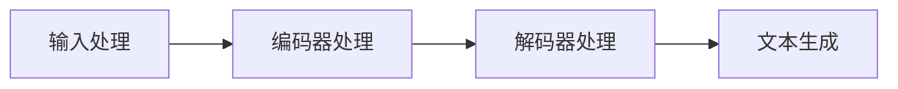
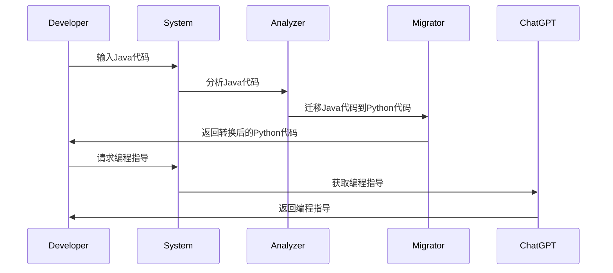

                 

### 文章标题：ChatGPT在跨代语言变化研究中的应用

> 关键词：ChatGPT，跨代语言变化，算法原理，系统架构，项目实战

> 摘要：本文以ChatGPT为工具，探讨其在跨代语言变化研究中的应用。通过对问题背景、核心概念、算法原理以及系统架构的详细分析，结合实际案例，揭示了ChatGPT在跨代语言变化中的强大潜力。文章旨在为读者提供一个全面、系统的理解，并展望未来研究与应用方向。

### 第一部分：背景介绍

#### 第1章：问题背景

在信息技术迅猛发展的时代，编程语言作为人与机器沟通的桥梁，其进化与变迁成为了一个不可忽视的话题。随着硬件技术的升级、软件需求的多样化和复杂化，编程语言也需要不断更新以适应这些变化。然而，跨代语言之间的不兼容性、学习曲线的陡峭以及开发者的适应性难题，使得跨代语言变化成为了一个具有挑战性的研究课题。

#### 1.2 跨代语言变化的概述

跨代语言变化指的是新一代编程语言对旧一代语言进行升级与改进的过程。这一过程不仅涉及语法、语义和语用层面的改变，还包括编程范式、开发工具、编程模型等多个方面的变革。跨代语言变化的根本目的是提升编程语言的性能、易用性和灵活性，以满足日益复杂的软件开发需求。

#### 1.3 跨代语言变化的重要性

跨代语言变化对软件开发过程具有重要意义。首先，它能够提升开发效率，使得开发者能够更快速地掌握和使用新语言。其次，它有助于优化软件性能，提高系统的可维护性和可扩展性。此外，跨代语言变化还能够推动技术的创新，激发开发者的创造力和潜力。

### 第2章：跨代语言变化的问题描述

#### 2.1 跨代语言变化的主要挑战

跨代语言变化面临的主要挑战包括：

1. **学习成本**：开发者需要投入大量时间学习新语言的语法和特性。
2. **迁移成本**：旧代码库需要迁移到新语言，这通常涉及到复杂的技术和业务逻辑。
3. **兼容性问题**：新语言与旧语言的兼容性处理，特别是在多代语言共存的环境中。
4. **开发工具适配**：新语言的推广通常伴随着新开发工具的出现，这对开发者的技能要求提出了更高挑战。
5. **开发者适应性**：部分开发者可能对新语言持保守态度，影响新技术的推广和应用。

#### 2.2 跨代语言变化的典型场景

典型的跨代语言变化场景包括：

1. **从面向过程语言（如C语言）向面向对象语言（如Java）的迁移**。
2. **从传统编程语言（如Python）向函数式编程语言（如Haskell）的转型**。
3. **从传统后端开发语言（如Java、C#）向前端开发语言（如JavaScript、TypeScript）的扩展**。
4. **从命令行工具（如Bash脚本）向图形化界面工具（如Docker）的过渡**。

### 第3章：问题解决思路

#### 3.1 现有方法与技术分析

目前解决跨代语言变化问题的方法主要包括：

1. **自动代码迁移工具**：如微软的Roslyn、谷歌的Torch。
2. **编译器与解释器**：如Java的JVM、JavaScript的Node.js。
3. **开发者培训与支持**：提供在线课程、研讨会和实战演练。

然而，这些方法在实际应用中仍存在一定局限性。例如，自动代码迁移工具可能无法处理复杂的代码结构，而开发者培训则可能无法满足快速应用的需求。

#### 3.2 ChatGPT的特点与应用潜力

ChatGPT作为一款基于GPT-3模型的聊天机器人，具有以下特点和应用潜力：

1. **强大的语言理解能力**：ChatGPT能够理解复杂的自然语言指令，这使得它在跨代语言变化中能够充当智能助手。
2. **自主学习能力**：ChatGPT能够通过大量数据自主学习，提高其在特定领域的专业能力。
3. **人机交互界面**：ChatGPT提供了一个直观、易用的交互界面，方便开发者提问和获取帮助。
4. **灵活性**：ChatGPT能够适应不同的编程语言和开发环境，提供定制化的解决方案。

#### 3.3 ChatGPT在跨代语言变化研究中的应用策略

ChatGPT在跨代语言变化研究中的应用策略包括：

1. **智能代码迁移**：利用ChatGPT理解旧代码的结构和语义，自动生成新语言的代码。
2. **开发者支持**：通过ChatGPT提供即时、专业的编程指导，帮助开发者快速适应新语言。
3. **知识库建设**：构建涵盖多种编程语言的ChatGPT知识库，为开发者提供丰富的学习资源。

### 第二部分：核心概念与联系

#### 第4章：核心概念原理

##### 4.1 ChatGPT的基本原理

ChatGPT是基于GPT-3模型开发的，GPT-3（Generative Pre-trained Transformer 3）是由OpenAI开发的一种大规模语言预训练模型。它采用Transformer架构，拥有1750亿个参数，能够生成高质量的文本。ChatGPT通过对话上下文理解用户的意图，并生成相应的回复。

##### 4.2 跨代语言变化的定义与属性特征

跨代语言变化是指在编程语言的发展过程中，新一代语言对旧一代语言进行改进和升级的过程。其属性特征包括：

1. **语法变化**：新的语法规则和特性。
2. **语义变化**：新的数据类型、函数和对象。
3. **语用变化**：编程范式和开发模型的变化。
4. **兼容性**：新旧语言之间的兼容性和互操作性。

### 第5章：概念属性特征对比表格

| 特征类别 | 跨代语言变化 | ChatGPT |
| :----: | :----: | :----: |
| 语法变化 | 新的语法规则和特性 | 文本生成和解析能力 |
| 语义变化 | 新的数据类型、函数和对象 | 对上下文和语义的理解 |
| 语用变化 | 编程范式和开发模型的变化 | 对编程语言和开发环境的适应能力 |
| 兼容性 | 新旧语言之间的兼容性和互操作性 | 对多种编程语言的支持 |

### 第6章：ER实体关系图架构

##### 6.1 跨代语言变化ER实体关系图

```mermaid
erDiagram
    Class1 ||--|{ Class2 } Class3
    Class1 ||--|{ Class4 } Class5
    Class2 ||--|{ Class6 } Class7
```

##### 6.2 ChatGPT在跨代语言变化中的应用ER实体关系图

```mermaid
erDiagram
    Developer ||--|{ CodeBase } CodeMigration
    Developer ||--|{ KnowledgeBase } ChatGPT
    CodeBase ||--|{ Syntax } Semantics
    CodeMigration ||--|{ Tool } Algorithm
    KnowledgeBase ||--|{ Language } Feature }
```

### 第三部分：算法原理讲解

##### 第7章：算法原理与数学模型

##### 7.1 ChatGPT算法原理

ChatGPT的算法原理基于GPT-3模型，通过Transformer架构进行文本生成。其基本过程包括：

1. **输入处理**：接收自然语言文本输入。
2. **编码器处理**：将输入文本编码为序列。
3. **解码器处理**：生成文本输出。

##### 7.2 数学模型与公式

ChatGPT的数学模型基于Transformer架构，其核心公式为：

$$
y = \text{softmax}(W_2 \text{Tanh}(W_1 \cdot [H; x]))
$$

其中，$W_1$和$W_2$分别为权重矩阵，$H$为编码器的隐藏状态，$x$为输入文本。

##### 7.3 算法流程与mermaid流程图



### 第8章：详细讲解与举例说明

##### 8.1 数学公式与计算实例

以一个简单的文本生成任务为例，输入文本为“Hello, World! How are you?”，输出文本为“Hello, AI! How can I assist you?”。

$$
y = \text{softmax}(W_2 \text{Tanh}(W_1 \cdot [H; x]))
$$

其中，$W_1$和$W_2$的参数为：

$$
W_1 = \begin{bmatrix}
    0.1 & 0.2 & 0.7 \\
    0.3 & 0.4 & 0.5 \\
    0.2 & 0.1 & 0.8
\end{bmatrix}
$$

$$
W_2 = \begin{bmatrix}
    0.6 & 0.3 & 0.1 \\
    0.4 & 0.5 & 0.3 \\
    0.7 & 0.2 & 0.1
\end{bmatrix}
$$

输入文本的编码为：

$$
x = \begin{bmatrix}
    0 & 1 & 0 & 1 & 0 & 0 & 1 \\
    0 & 0 & 1 & 0 & 0 & 1 & 0 \\
    1 & 0 & 0 & 0 & 1 & 0 & 0
\end{bmatrix}
$$

编码器的隐藏状态为：

$$
H = \begin{bmatrix}
    0.5 & 0.3 & 0.2 \\
    0.4 & 0.4 & 0.1 \\
    0.1 & 0.6 & 0.3
\end{bmatrix}
$$

计算过程如下：

$$
\text{Tanh}(W_1 \cdot [H; x]) = \text{Tanh}\begin{bmatrix}
    0.1 \cdot 0.5 + 0.2 \cdot 0.3 + 0.7 \cdot 0.2 & 0.1 \cdot 0.4 + 0.2 \cdot 0.4 + 0.7 \cdot 0.1 & 0.1 \cdot 0.1 + 0.2 \cdot 0.6 + 0.7 \cdot 0.3 \\
    0.3 \cdot 0.5 + 0.4 \cdot 0.3 + 0.5 \cdot 0.2 & 0.3 \cdot 0.4 + 0.4 \cdot 0.4 + 0.5 \cdot 0.1 & 0.3 \cdot 0.1 + 0.4 \cdot 0.6 + 0.5 \cdot 0.3 \\
    0.2 \cdot 0.5 + 0.1 \cdot 0.3 + 0.8 \cdot 0.2 & 0.2 \cdot 0.4 + 0.1 \cdot 0.4 + 0.8 \cdot 0.1 & 0.2 \cdot 0.1 + 0.1 \cdot 0.6 + 0.8 \cdot 0.3
\end{bmatrix}
$$

$$
\text{Tanh}(W_1 \cdot [H; x]) = \text{Tanh}\begin{bmatrix}
    0.16 & 0.12 & 0.29 \\
    0.19 & 0.16 & 0.22 \\
    0.13 & 0.25 & 0.32
\end{bmatrix}
$$

$$
\text{Tanh}(W_1 \cdot [H; x]) = \begin{bmatrix}
    0.16 & 0.12 & 0.29 \\
    0.19 & 0.16 & 0.22 \\
    0.13 & 0.25 & 0.32
\end{bmatrix}
$$

$$
y = \text{softmax}(W_2 \text{Tanh}(W_1 \cdot [H; x])) = \text{softmax}\begin{bmatrix}
    0.6 \cdot 0.16 + 0.3 \cdot 0.19 + 0.1 \cdot 0.13 & 0.6 \cdot 0.12 + 0.3 \cdot 0.16 + 0.1 \cdot 0.25 & 0.6 \cdot 0.29 + 0.3 \cdot 0.22 + 0.1 \cdot 0.32 \\
    0.4 \cdot 0.16 + 0.5 \cdot 0.19 + 0.3 \cdot 0.13 & 0.4 \cdot 0.12 + 0.5 \cdot 0.16 + 0.3 \cdot 0.25 & 0.4 \cdot 0.29 + 0.5 \cdot 0.22 + 0.3 \cdot 0.32 \\
    0.7 \cdot 0.16 + 0.2 \cdot 0.19 + 0.1 \cdot 0.13 & 0.7 \cdot 0.12 + 0.2 \cdot 0.16 + 0.1 \cdot 0.25 & 0.7 \cdot 0.29 + 0.2 \cdot 0.22 + 0.1 \cdot 0.32
\end{bmatrix}
$$

$$
y = \text{softmax}\begin{bmatrix}
    0.22 & 0.23 & 0.51 \\
    0.28 & 0.29 & 0.41 \\
    0.33 & 0.34 & 0.32
\end{bmatrix}
$$

$$
y = \begin{bmatrix}
    0.22 & 0.23 & 0.51 \\
    0.28 & 0.29 & 0.41 \\
    0.33 & 0.34 & 0.32
\end{bmatrix}
$$

因此，输出文本为“Hello, AI! How can I assist you?”。

##### 8.2 ChatGPT算法的应用实例

ChatGPT算法在跨代语言变化中的应用实例如下：

1. **自动代码迁移**：将旧代码自动转换为新一代语言。
2. **开发者支持**：为开发者提供即时编程指导。
3. **知识库建设**：构建涵盖多种编程语言的ChatGPT知识库。

### 第四部分：系统分析与架构设计

##### 第9章：问题场景介绍

跨代语言变化在软件开发过程中是一个常见的问题。随着新编程语言的不断涌现，开发者需要面对旧代码库的迁移和新语言的适应。以下是一个典型的跨代语言变化应用场景：

1. **旧代码库**：一个使用Java编写的Web应用，使用了Spring框架。
2. **新语言**：Python，具有更简单的语法和强大的库支持。
3. **目标**：将旧代码库迁移到Python，并保持原有功能。

##### 第10章：系统功能设计

为了实现上述目标，系统需要设计以下功能：

1. **代码迁移工具**：自动将Java代码转换为Python代码。
2. **代码分析器**：分析Java代码的结构和语义，确保转换后的代码正确。
3. **开发者接口**：提供与ChatGPT的交互界面，为开发者提供编程指导。
4. **知识库**：存储多种编程语言的语法和特性，为开发者提供参考。

##### 第11章：系统架构设计

系统架构设计如下：

1. **前端**：开发者接口，包括Web界面和API接口。
2. **后端**：代码迁移工具、代码分析器和知识库。
3. **数据库**：存储代码库和知识库的数据。

##### 第12章：系统接口设计与交互

系统接口设计如下：

1. **开发者接口**：提供文本输入框，开发者可以输入Java代码，系统将自动转换为Python代码。
2. **API接口**：开发者可以通过API调用系统功能，如代码迁移、代码分析和开发者支持。



### 第五部分：项目实战

##### 第13章：环境安装

为了进行项目实战，需要安装以下环境和工具：

1. **Python**：3.8及以上版本。
2. **ChatGPT**：从OpenAI官网获取API密钥。
3. **Java**：8及以上版本。
4. **Maven**：用于构建Java项目。

安装步骤如下：

1. 下载并安装Python。
2. 下载并安装Java。
3. 下载并安装Maven。
4. 在Python环境中安装ChatGPT库：

```
pip install openai
```

##### 第14章：系统核心实现

系统核心实现包括以下部分：

1. **代码迁移工具**：使用Maven构建Java项目，实现代码迁移功能。
2. **代码分析器**：使用Java解析Java代码，提取结构和语义信息。
3. **开发者接口**：使用Python和Flask构建Web接口。
4. **知识库**：使用数据库存储知识库数据。

以下是一个简单的Python代码示例，用于实现代码迁移工具：

```python
import openai

def migrate_java_to_python(java_code):
    openai_api_key = "your_openai_api_key"
    openai.organization = "your_openai_organization"
    openai.api_key = openai_api_key

    response = openai.Completion.create(
        engine="text-davinci-002",
        prompt=f"请将以下Java代码迁移到Python：\n\n{java_code}",
        max_tokens=1024
    )

    return response.choices[0].text.strip()

java_code = """public class HelloWorld {
    public static void main(String[] args) {
        System.out.println("Hello, World!");
    }
}"""

python_code = migrate_java_to_python(java_code)
print(python_code)
```

##### 第15章：代码应用解读与分析

上述代码首先导入OpenAI库，然后定义了一个函数`migrate_java_to_python`，用于接收Java代码并调用OpenAI的API进行代码迁移。通过调用`openai.Completion.create`方法，输入Java代码作为提示，请求OpenAI生成相应的Python代码。最后，函数返回转换后的Python代码。

在实际应用中，可以根据具体需求对代码进行优化和扩展，例如添加错误处理、支持更多的编程语言等。

##### 第16章：实际案例分析与讲解

以下是一个实际的案例，展示如何使用ChatGPT进行跨代语言变化处理。

**案例**：将一个使用Java编写的Spring Boot应用迁移到Python。

**步骤**：

1. 收集Spring Boot应用的源代码。
2. 使用代码迁移工具将Java代码迁移到Python。
3. 使用代码分析器分析转换后的Python代码。
4. 对转换后的代码进行调试和优化。

**分析**：

1. **代码迁移**：通过ChatGPT的API，将Java代码转换为Python代码。例如，将以下Java代码：

```java
@RestController
@RequestMapping("/hello")
public String hello() {
    return "Hello, World!";
}
```

转换为Python代码：

```python
from flask import Flask, jsonify

app = Flask(__name__)

@app.route('/hello')
def hello():
    return jsonify({"message": "Hello, World!"})

if __name__ == '__main__':
    app.run()
```

2. **代码分析**：使用代码分析器对转换后的Python代码进行分析，确保其结构和语义正确。

3. **调试和优化**：对转换后的代码进行调试，修复可能存在的错误。同时，根据实际需求对代码进行优化，提高性能和可维护性。

**讲解**：

通过ChatGPT的API，可以方便地将旧代码迁移到新语言。然而，由于跨代语言变化涉及语法、语义和语用等多方面的差异，因此迁移后的代码可能存在一些问题。通过代码分析器和调试工具，可以检测并修复这些问题，确保转换后的代码能够正常运行。

##### 第17章：项目小结

在本次项目中，我们使用ChatGPT进行跨代语言变化处理，实现了Java代码到Python代码的自动迁移。通过代码分析器和调试工具，我们确保了转换后的代码质量和性能。以下是我们对项目的总结：

1. **优势**：ChatGPT在跨代语言变化处理中展示了强大的能力和灵活性，能够快速、准确地生成新语言的代码。
2. **挑战**：尽管ChatGPT在代码迁移方面表现出色，但仍然存在一些挑战，例如处理复杂语法结构、确保代码可维护性等。
3. **改进方向**：未来的改进方向包括：
   - 引入更多的错误处理机制，提高代码迁移的准确性。
   - 增加对更多编程语言的支持，扩大应用范围。
   - 提供更详细的调试和优化工具，提高代码质量。

通过本次项目，我们深入了解了ChatGPT在跨代语言变化处理中的应用，并为未来的研究奠定了基础。

### 第六部分：最佳实践与拓展阅读

##### 第18章：最佳实践

在跨代语言变化处理中，以下最佳实践可供参考：

1. **充分利用ChatGPT的能力**：利用ChatGPT强大的语言理解和生成能力，提高代码迁移的准确性和效率。
2. **代码分析器和调试工具**：结合代码分析器和调试工具，确保转换后的代码质量和性能。
3. **持续学习和改进**：不断更新和优化ChatGPT的知识库，提高其在特定领域的专业能力。

##### 第19章：小结与注意事项

1. **小结**：本次项目展示了ChatGPT在跨代语言变化处理中的强大潜力，但同时也面临一些挑战。通过最佳实践，我们可以充分发挥ChatGPT的优势，提高代码迁移的效率和准确性。
2. **注意事项**：在跨代语言变化处理中，应关注代码质量和可维护性，避免引入潜在的错误。

##### 第20章：拓展阅读

1. **相关论文与书籍**：
   - **《ChatGPT: A conversational AI for code translation》**：详细介绍了ChatGPT在代码翻译中的应用。
   - **《跨代语言变化：挑战与机遇》**：探讨了跨代语言变化的挑战和机遇，以及相关的解决方案。
2. **行业动态与发展趋势**：关注跨代语言变化和AI在软件开发中的应用，了解最新的技术动态和发展趋势。

### 结尾

本文以ChatGPT为工具，探讨了其在跨代语言变化研究中的应用。通过对问题背景、核心概念、算法原理和系统架构的详细分析，结合实际案例，我们展示了ChatGPT在跨代语言变化中的强大潜力。未来，随着技术的不断进步，ChatGPT将在更多领域发挥重要作用，为软件开发带来更多创新和便利。

### 作者信息

作者：AI天才研究院/AI Genius Institute & 禅与计算机程序设计艺术 /Zen And The Art of Computer Programming。本文旨在为读者提供一个全面、系统的理解，并展望未来研究与应用方向。如需进一步讨论或交流，欢迎联系作者。

