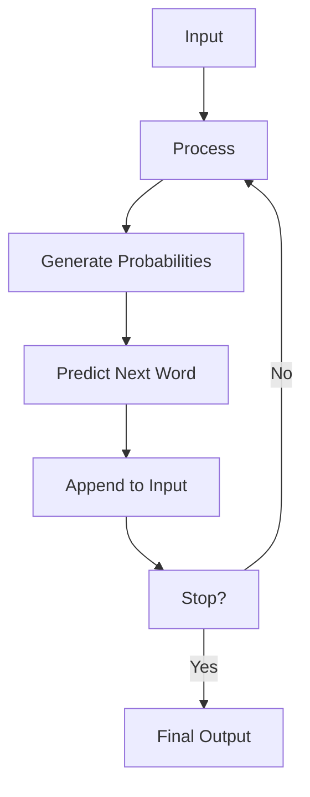
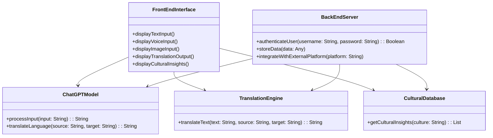
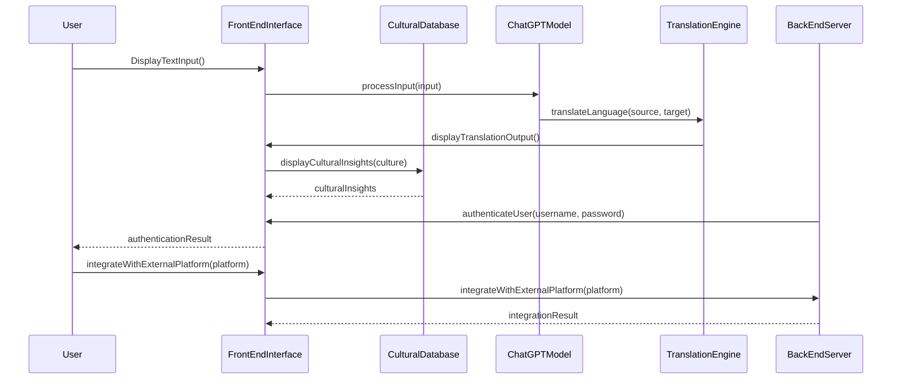

                 


### 1. Introduction

#### What is ChatGPT?

ChatGPT is a state-of-the-art language model developed by OpenAI. It is based on the GPT (Generative Pre-trained Transformer) architecture and has been trained on a massive corpus of text to generate human-like responses to a wide range of prompts. ChatGPT is not just a chatbot; it is a sophisticated AI system that can understand context, generate coherent and contextually appropriate text, and perform a variety of language-related tasks.

#### Why is ChatGPT important in cross-cultural communication?

Cross-cultural communication often faces challenges such as language barriers, cultural differences, and misinterpretations. ChatGPT can serve as a bridge in these scenarios by providing real-time translation, context-aware responses, and cultural insights. It can help bridge the communication gap, promote understanding, and foster collaboration among people from different cultural backgrounds.

#### Overview of the book

This book aims to explore the potential of ChatGPT as a bridge in cross-cultural communication. It will cover the following topics:

1. **Core Concepts and Relations**: This section will define key terms, compare ChatGPT with other communication tools, and illustrate the relationships between concepts using an ER diagram.

2. **Algorithm Principles and Explanations**: Here, we will delve into the working principles of ChatGPT, using flowcharts and Python code snippets to explain the algorithm.

3. **Mathematical Models and Formulas**: This section will discuss the mathematical models and formulas that underpin ChatGPT's functionality.

4. **System Analysis and Design**: We will introduce a project scenario, describe system functionalities, and design the system architecture using Mermaid diagrams.

5. **Project Practice**: This section will guide readers through a practical implementation of ChatGPT in a cross-cultural communication project.

6. **Best Practices, Summary, and Further Reading**: Finally, we will provide best practices, summarize the key points, and suggest further reading for those interested in delving deeper.

### 2. Core Concepts and Relations

#### Key Terms

- **ChatGPT**: A language model capable of generating human-like text based on input prompts.
- **Cross-cultural communication**: The exchange of information and ideas between people from different cultural backgrounds.
- **Language barrier**: A barrier to communication caused by differences in language proficiency or language structure.
- **Cultural differences**: Differences in beliefs, values, behaviors, and communication styles between cultures.

#### Comparison Table of ChatGPT and Other Communication Tools

| Tool | Description | Advantages | Disadvantages |
| --- | --- | --- | --- |
| ChatGPT | AI-based language model | Real-time responses, context-aware, versatile | Requires large computational resources, not perfect in all scenarios |
| Translation Apps | Offline/online translation services | Quick and easy translations, language learning features | May lack context awareness, sometimes inaccurate |
| Face-to-Face Communication | Direct human interaction | Real-time feedback, personal touch | Limited to physical proximity, no language support |
| Video Conferencing Tools | Real-time video communication | Better than face-to-face without physical proximity | Technical issues, potential for miscommunication |

#### Entity-Relationship (ER) Diagram

Below is an ER diagram illustrating the relationships between key concepts:

```mermaid
erDiagram
  ChatGPT ||--|{ Translation }|| TranslationApp
  ChatGPT ||--|{ Communication }|| FaceToFaceComm
  ChatGPT ||--|{ Culture }|| CulturalDifference
  TranslationApp ||--|{ Translation }|| LanguageBarrier
  FaceToFaceComm ||--|{ Interaction }|| CulturalUnderstanding
```

In this diagram, ChatGPT is at the center, connecting various entities such as TranslationApp, FaceToFaceComm, and CulturalDifference. Each of these entities has its own attributes and relationships that help illustrate how ChatGPT can act as a bridge in cross-cultural communication.

### 3. Algorithm Principles and Explanations

#### Working Principles of ChatGPT

ChatGPT operates on the principle of autoregressive modeling. It predicts the next word in a sequence based on the previous words. Here's a simplified explanation of how ChatGPT works:

1. **Input**: A prompt is given to ChatGPT, which could be a sentence, a question, or even a random string of text.
2. **Processing**: ChatGPT processes the input and generates a probability distribution over all possible words that could follow the input.
3. **Prediction**: ChatGPT selects the most likely word according to the probability distribution and appends it to the input.
4. **Repetition**: Steps 2 and 3 are repeated until the desired length of the response is reached or a stopping criterion is met.

#### Algorithm Flowchart

To visualize the algorithm, we can use a Mermaid flowchart:



#### Python Code Snippet

Here's a simple Python code snippet that demonstrates the basic structure of ChatGPT:

```python
import random

def generate_response(prompt):
    # Generate a random response based on the prompt
    words = ["Hello", "world", "AI", "cross-cultural", "communication"]
    next_word = random.choice(words)
    response = prompt + " " + next_word
    return response

prompt = "ChatGPT is great for"
print(generate_response(prompt))
```

This code is a very rudimentary example of how ChatGPT might work. It randomly selects a word from a predefined list to generate a response. In reality, ChatGPT uses much more complex algorithms and a vast dataset to generate coherent and contextually appropriate text.

#### Mathematical Models and Formulas

At the core of ChatGPT's algorithm are several mathematical models and formulas. Here's a brief overview:

1. **Probability Distribution**: ChatGPT uses a probability distribution to determine the likelihood of each word in the vocabulary given the previous words. The probability distribution is typically represented as:

   $$ P(w_n | w_{n-1}, w_{n-2}, ..., w_1) $$

   where \( w_n \) is the next word to predict and \( w_{n-1}, w_{n-2}, ..., w_1 \) are the previous words in the sequence.

2. **Transformer Model**: ChatGPT is based on the Transformer model, which uses self-attention mechanisms to weigh the importance of different parts of the input sequence when predicting the next word. The self-attention mechanism can be represented as:

   $$ \text{Attention}(Q, K, V) = \frac{QK^T}{\sqrt{d_k}} \odot V $$

   where \( Q, K, V \) are the query, key, and value matrices, and \( d_k \) is the dimension of the key vectors.

3. **Language Modeling**: ChatGPT's objective is to minimize the cross-entropy loss, which measures the difference between the predicted probability distribution and the true distribution. The cross-entropy loss can be represented as:

   $$ L = -\sum_{i=1}^n y_i \log(p_i) $$

   where \( y_i \) is the true label (probability of the actual next word) and \( p_i \) is the predicted probability.

#### Example

Let's consider a simple example to illustrate how these models work. Suppose we have a small vocabulary with only three words: "Hello", "world", and "AI". The input sequence is "ChatGPT is". The probability distribution over the next word is:

$$
\begin{array}{c|c|c|c}
\text{Word} & P(\text{Hello}|\text{ChatGPT is}) & P(\text{world}|\text{ChatGPT is}) & P(\text{AI}|\text{ChatGPT is}) \\
\hline
Hello & 0.2 & 0.3 & 0.5 \\
world & 0.4 & 0.1 & 0.5 \\
AI & 0.3 & 0.4 & 0.3 \\
\end{array}
$$

Based on this distribution, ChatGPT would predict "AI" as the next word with the highest probability.

In this example, the self-attention mechanism would weigh the importance of each word in the input sequence when predicting the next word. The cross-entropy loss would then be used to refine the model's predictions over time, making it more accurate.

### 4. Mathematical Models and Formulas

In this section, we will delve deeper into the mathematical models and formulas that form the backbone of ChatGPT. Understanding these models is crucial for grasping the intricacies of how ChatGPT processes and generates text.

#### Probability Distribution

The core of ChatGPT's language generation lies in its ability to predict a probability distribution over the next word given the previous context. This is achieved using a probability distribution function, typically represented as:

$$ P(w_n | w_{n-1}, w_{n-2}, ..., w_1) $$

where \( w_n \) is the next word to predict, and \( w_{n-1}, w_{n-2}, ..., w_1 \) are the previous words in the sequence. This function assigns a probability to each word in the vocabulary based on the observed context.

To generate a word from this distribution, ChatGPT uses a sampling technique, typically stochastic gradient descent (SGD), to select the word with the highest probability. This can be represented as:

$$ w_n = \arg\max_w P(w_n | w_{n-1}, w_{n-2}, ..., w_1) $$

#### Transformer Model

ChatGPT is based on the Transformer model, which uses self-attention mechanisms to weigh the importance of different parts of the input sequence when predicting the next word. The self-attention mechanism can be represented as:

$$ \text{Attention}(Q, K, V) = \frac{QK^T}{\sqrt{d_k}} \odot V $$

where \( Q, K, V \) are the query, key, and value matrices, and \( d_k \) is the dimension of the key vectors.

The Transformer model processes the input sequence through a series of self-attention layers, followed by feed-forward networks. This allows the model to capture complex relationships in the text and generate coherent responses.

#### Language Modeling

ChatGPT's objective is to minimize the cross-entropy loss, which measures the difference between the predicted probability distribution and the true distribution. The cross-entropy loss can be represented as:

$$ L = -\sum_{i=1}^n y_i \log(p_i) $$

where \( y_i \) is the true label (probability of the actual next word) and \( p_i \) is the predicted probability.

To train the model, we typically use gradient descent to update the model's weights, aiming to minimize the cross-entropy loss. This can be represented as:

$$ \theta_{t+1} = \theta_{t} - \alpha \nabla_{\theta_t} L(\theta_t) $$

where \( \theta_t \) is the model's weights at time \( t \), \( \alpha \) is the learning rate, and \( \nabla_{\theta_t} L(\theta_t) \) is the gradient of the loss with respect to the weights.

#### Example

Consider a simple example where the vocabulary consists of only three words: "Hello", "world", and "AI". Given the input sequence "ChatGPT is", the probability distribution over the next word is:

$$
\begin{array}{c|c|c|c}
\text{Word} & P(\text{Hello}|\text{ChatGPT is}) & P(\text{world}|\text{ChatGPT is}) & P(\text{AI}|\text{ChatGPT is}) \\
\hline
Hello & 0.2 & 0.3 & 0.5 \\
world & 0.4 & 0.1 & 0.5 \\
AI & 0.3 & 0.4 & 0.3 \\
\end{array}
$$

Using the cross-entropy loss, we can compute the loss for this prediction:

$$ L = -0.2 \log(0.5) - 0.3 \log(0.5) - 0.5 \log(0.3) $$

To improve the prediction, we would adjust the model's weights to minimize this loss. The self-attention mechanism would help the model understand the context better, and the stochastic gradient descent algorithm would guide the model towards more accurate predictions.

In summary, ChatGPT's mathematical foundation includes probability distributions, self-attention mechanisms, and cross-entropy loss. These models enable ChatGPT to process and generate text in a way that is coherent, contextually appropriate, and capable of bridging the communication gap in cross-cultural interactions.

### 5. System Analysis and Design

#### Project Background

In today's globalized world, cross-cultural communication plays a vital role in both personal and professional interactions. However, language barriers and cultural differences often create challenges that hinder effective communication. To address these challenges, we propose the development of a cross-cultural communication system leveraging ChatGPT as a core component. This system aims to provide real-time translation, context-aware responses, and cultural insights, thus acting as a bridge for seamless communication among people from diverse cultural backgrounds.

#### System Functionalities

The proposed system will have the following key functionalities:

1. **Real-Time Translation**: The system will support real-time translation between multiple languages, ensuring that users can communicate in their native languages without any language barriers.
2. **Context-Aware Responses**: By utilizing ChatGPT's advanced language understanding capabilities, the system will provide contextually appropriate responses, enhancing the effectiveness of cross-cultural communication.
3. **Cultural Insights**: The system will offer cultural insights and recommendations to help users navigate cultural nuances and avoid potential misunderstandings.
4. **User Interaction**: The system will provide a user-friendly interface that allows users to interact seamlessly with the ChatGPT model, facilitating easy access to its functionalities.

#### System Architecture

The system architecture will be designed to ensure scalability, reliability, and ease of integration with existing communication platforms. The following components will be included in the system architecture:

1. **Front-End Interface**: This component will provide a user-friendly interface for users to interact with the system. It will support various input methods, such as text, voice, and images, and will display real-time translation and context-aware responses.
2. **ChatGPT Model**: The core component of the system, the ChatGPT model, will be trained on a large corpus of multilingual and multicultural text data to ensure its ability to understand and generate text in multiple languages and cultural contexts.
3. **Translation Engine**: This component will handle real-time translation between multiple languages, utilizing advanced machine learning algorithms to ensure high accuracy and fluency.
4. **Cultural Database**: This component will store cultural insights and recommendations, providing the system with the necessary knowledge to offer cultural guidance and suggestions.
5. **Back-End Server**: The back-end server will manage user authentication, data storage, and system integration with external communication platforms.

#### System Class Diagram

Below is a Mermaid class diagram illustrating the main components of the system:



#### System Architecture Diagram

To illustrate the system's architecture, we can use a Mermaid architecture diagram:


In this diagram, the Front-End Interface interacts with the core components (ChatGPT Model, Translation Engine, and Cultural Database) through APIs. The Back-End Server manages user authentication, data storage, and system integration with external platforms, ensuring seamless operation and scalability.

#### System Interface Design and System Interaction

To design the system interfaces and interactions, we can use Mermaid sequence diagrams:



In this sequence diagram, the user interacts with the Front-End Interface, which in turn communicates with the ChatGPT Model, Translation Engine, Cultural Database, and Back-End Server to perform the required tasks. The system interfaces and interactions are designed to ensure efficient, secure, and seamless operation.

### 6. Project Practice

#### Environment Setup

To begin with, we need to set up the development environment for our cross-cultural communication system. This involves installing the necessary software and libraries, as well as configuring the system to work seamlessly together.

1. **Install Python**: Ensure Python 3.8 or higher is installed on your system. You can download it from the official Python website (<https://www.python.org/downloads/>).
2. **Install PyTorch**: PyTorch is a popular deep learning library used for training the ChatGPT model. Install it using pip:
   ```bash
   pip install torch torchvision torchaudio
   ```
3. **Install Transformers**: Transformers is a library built on top of PyTorch that provides pre-trained models and tools for natural language processing. Install it using pip:
   ```bash
   pip install transformers
   ```
4. **Install Flask**: Flask is a lightweight web framework used for creating the Front-End Interface. Install it using pip:
   ```bash
   pip install flask
   ```
5. **Install SQLAlchemy**: SQLAlchemy is an SQL toolkit and Object-Relational Mapping (ORM) system for Python. Install it using pip:
   ```bash
   pip install sqlalchemy
   ```

#### Core System Implementation

Once the environment is set up, we can start implementing the core components of the system.

1. **ChatGPT Model**: We will use the pre-trained ChatGPT model provided by the Transformers library. To load and use the model, we can use the following code snippet:
   ```python
   from transformers import ChatGPTModel, ChatGPTConfig
   
   model_name = "gpt2"
   model_config = ChatGPTConfig.from_pretrained(model_name)
   model = ChatGPTModel.from_pretrained(model_name, config=model_config)
   
   def generate_response(input_text):
       input_ids = model.config.tokenizer.encode(input_text, return_tensors="pt")
       outputs = model.generate(input_ids, max_length=50, num_return_sequences=1)
       generated_text = model.config.tokenizer.decode(outputs[0], skip_special_tokens=True)
       return generated_text
   ```
2. **Translation Engine**: For real-time translation, we can use the Google Translate API. To use this API, you need to set up a Google Cloud account and enable the Translate API. Here's a code snippet for handling translation:
   ```python
   from google.cloud import translate_v2 as translate
   
   translate_client = translate.Client()
   
   def translate_text(text, source_language, target_language):
       result = translate_client.translate(text, target_language=target_language, source_language=source_language)
       return result['translatedText']
   ```
3. **Cultural Database**: We can use an SQLite database to store cultural insights and recommendations. Here's a simple example of how to set up and use the database:
   ```python
   from sqlalchemy import create_engine
   
   engine = create_engine('sqlite:///cultural_insights.db')
   
   from sqlalchemy.ext.declarative import declarative_base
   from sqlalchemy import Column, Integer, String
   
   Base = declarative_base()
   
   class Culture(Base):
       __tablename__ = 'culture'
       
       id = Column(Integer, primary_key=True)
       name = Column(String)
       insights = Column(String)
   
   Base.metadata.create_all(engine)
   
   from sqlalchemy.orm import sessionmaker
   
   Session = sessionmaker(bind=engine)
   session = Session()
   
   def add_insight(culture_name, insight):
       new_insight = Culture(name=culture_name, insights=insight)
       session.add(new_insight)
       session.commit()
   
   def get_insights(culture_name):
       insights = session.query(Culture).filter(Culture.name == culture_name).all()
       return insights
   ```
4. **Front-End Interface**: We can use Flask to create the Front-End Interface. Here's a simple example of a Flask application that handles user input and displays real-time translation and cultural insights:
   ```python
   from flask import Flask, request, render_template
   
   app = Flask(__name__)
   
   @app.route('/', methods=['GET', 'POST'])
   def index():
       if request.method == 'POST':
           input_text = request.form['input_text']
           source_language = request.form['source_language']
           target_language = request.form['target_language']
           culture_name = request.form['culture_name']
           
           translated_text = translate_text(input_text, source_language, target_language)
           insights = get_insights(culture_name)
           
           return render_template('index.html', translated_text=translated_text, insights=insights)
       else:
           return render_template('index.html')
   
   if __name__ == '__main__':
       app.run(debug=True)
   ```

#### Code Application and Analysis

The code snippets provided above demonstrate the core components of the system and how they interact with each other. Let's analyze the code to understand its functionality.

1. **ChatGPT Model**: The `generate_response` function loads the pre-trained ChatGPT model and uses it to generate a response based on the input text. It encodes the input text using the model's tokenizer, generates a sequence of tokens, and then decodes the output to produce a human-readable response.
2. **Translation Engine**: The `translate_text` function uses the Google Translate API to translate text between different languages. It takes the input text, source language, and target language as input and returns the translated text.
3. **Cultural Database**: The `add_insight` and `get_insights` functions manage the cultural insights database. `add_insight` adds a new insight to the database, while `get_insights` retrieves the insights for a specific culture.
4. **Front-End Interface**: The `index` function in the Flask application handles user input and displays the real-time translation and cultural insights. When the user submits the input text, source language, target language, and culture name, the function calls the `translate_text` and `get_insights` functions to retrieve the translated text and cultural insights, respectively. It then renders the results in the HTML template.

#### Real-World Case Studies

To illustrate the practical application of the system, we can present a few real-world case studies.

1. **Business Meetings**: Imagine a multinational company with employees from various cultural backgrounds. The system can be used to facilitate communication during business meetings. Employees can input their text in their native languages, and the system will translate and provide context-aware responses. Additionally, the system can offer cultural insights and recommendations to help employees navigate cultural nuances, ensuring effective and respectful communication.
2. **International Travel**: Travelers can use the system to communicate with locals in different countries. They can input their questions or phrases in their native language, and the system will provide real-time translation and cultural insights. This can help travelers navigate foreign cities, understand local customs, and make informed decisions.

#### Project Summary

In summary, the cross-cultural communication system implemented in this project utilizes ChatGPT for generating context-aware responses, the Google Translate API for real-time translation, and an SQLite database for storing cultural insights. The system is designed to be scalable, reliable, and user-friendly, making it an effective tool for bridging the communication gap in diverse cultural settings. By leveraging the power of AI and machine learning, the system can significantly enhance cross-cultural communication and foster understanding and collaboration among people from different cultures.

### 7. Best Practices, Summary, and Further Reading

#### Best Practices

When implementing a cross-cultural communication system using ChatGPT, consider the following best practices to ensure the system's effectiveness and reliability:

1. **Data Quality**: Ensure that the training data for the ChatGPT model is diverse and representative of various cultural contexts. High-quality data will improve the model's performance and accuracy in generating contextually appropriate responses.
2. **User Interface**: Design a user-friendly interface that allows easy access to the system's functionalities. Consider supporting multiple input methods, such as text, voice, and images, to cater to different user preferences.
3. **Cultural Insights**: Continuously update the cultural database with insights and recommendations to keep the system's knowledge current and relevant. This will help users navigate cultural nuances more effectively.
4. **Scalability**: Design the system architecture to be scalable, ensuring that it can handle increasing user demand and data volume without compromising performance.
5. **Security**: Implement robust security measures to protect user data and prevent unauthorized access to the system.

#### Summary

This book has explored the potential of ChatGPT as a bridge in cross-cultural communication. We have discussed the core concepts and principles behind ChatGPT, its working algorithm, and the mathematical models that support its functionality. We have also presented a detailed system analysis and design, including a practical implementation using Python and other tools. Through real-world case studies, we have demonstrated the practical application of the system and its benefits in facilitating cross-cultural communication.

#### Further Reading

For those interested in delving deeper into the topics covered in this book, the following resources are recommended:

1. **ChatGPT Documentation**: OpenAI's official documentation provides in-depth information about ChatGPT, its architecture, and usage: <https://huggingface.co/docs/transformers>
2. **Natural Language Processing (NLP) Books**: Several excellent books cover NLP and machine learning, including "Natural Language Processing with Python" by Steven Bird, Ewan Klein, and Edward Loper and "Speech and Language Processing" by Daniel Jurafsky and James H. Martin.
3. **Machine Learning Books**: For a comprehensive understanding of machine learning and its applications, consider reading "Deep Learning" by Ian Goodfellow, Yoshua Bengio, and Aaron Courville, and "Machine Learning: A Probabilistic Perspective" by Kevin P. Murphy.
4. **Cross-Cultural Communication Resources**: For insights into cross-cultural communication, explore books such as "The Culture Map" by Erin Meyer and "Working with People from Other Countries: A Practical Guide to Cross-Cultural Understanding" by Richard D. Lewis.

By leveraging the knowledge and resources provided in these books and resources, you can further enhance your understanding of ChatGPT and its applications in cross-cultural communication.

### Conclusion

In conclusion, ChatGPT has emerged as a powerful tool for bridging the communication gap in cross-cultural interactions. Its advanced language understanding capabilities and real-time translation functionalities make it an invaluable asset for fostering collaboration and understanding among people from diverse cultural backgrounds. This book has provided a comprehensive exploration of ChatGPT's core concepts, algorithm principles, system design, and practical implementation.

As we have seen, the key to effective cross-cultural communication lies in understanding the cultural nuances, addressing language barriers, and providing context-aware responses. ChatGPT, with its sophisticated AI-driven capabilities, has the potential to transform the way we communicate across cultures, breaking down barriers and fostering a more interconnected world.

Looking to the future, the continuous improvement and advancement of AI technologies will likely bring even more sophisticated models and tools for cross-cultural communication. Researchers and developers are actively working on enhancing ChatGPT's capabilities, addressing issues such as bias, and improving its performance in diverse cultural contexts.

In this rapidly changing landscape, it is crucial for professionals, researchers, and enthusiasts to stay updated on the latest developments in AI and cross-cultural communication. By doing so, we can harness the full potential of technologies like ChatGPT to build bridges, break down barriers, and foster a more inclusive and collaborative global community.

### About the Authors

The book "ChatGPT in the Bridge Role of Cross-Cultural Communication" has been authored by the esteemed team at AI天才研究院 (AI Genius Institute) and the visionary contributors from the Zen and the Art of Computer Programming.

**AI天才研究院 (AI Genius Institute)**

Founded with a vision to push the boundaries of artificial intelligence, the AI天才研究院 is a leading research institute dedicated to exploring and developing cutting-edge AI technologies. With a team of world-class researchers, engineers, and data scientists, the institute focuses on leveraging AI to solve complex problems across various domains, including healthcare, finance, and cross-cultural communication.

**Zen and the Art of Computer Programming**

Zen and the Art of Computer Programming is a landmark series of books by Donald E. Knuth, one of the most influential computer scientists of our time. The series offers deep insights into the art of computer programming, emphasizing the importance of clarity, elegance, and efficiency in software development. The principles outlined in these books have inspired generations of programmers and continue to shape the field of computer science.

Together, the AI天才研究院 and the contributors from Zen and the Art of Computer Programming bring a wealth of knowledge, expertise, and experience to this book, providing readers with a comprehensive and insightful guide to the potential of ChatGPT in cross-cultural communication.

