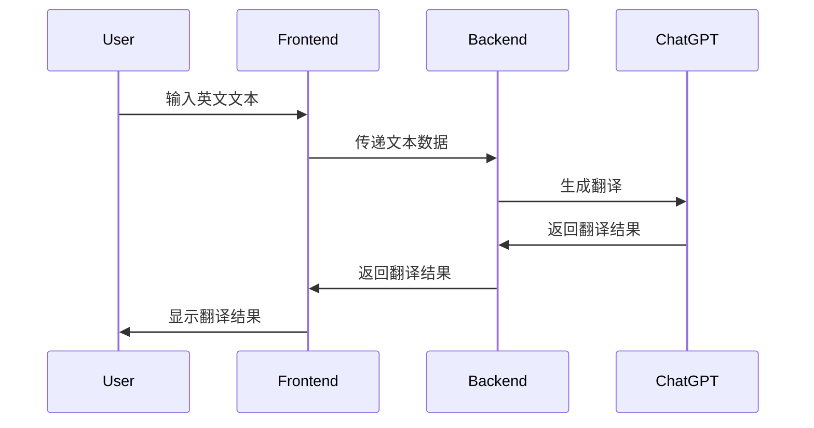
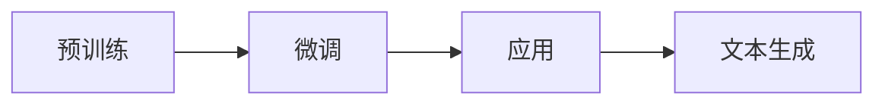
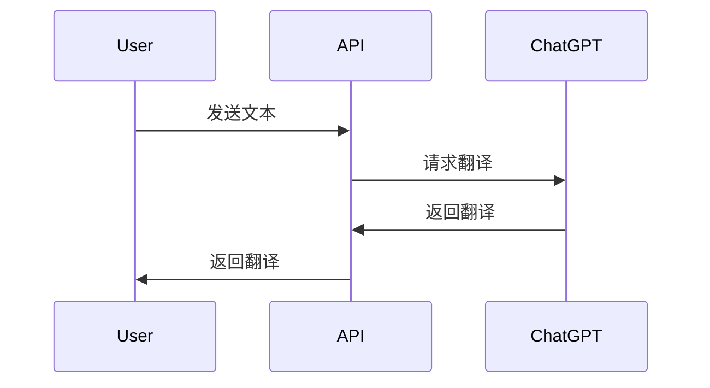

                 


### 摘要

本文旨在深入探讨ChatGPT在跨文化文学翻译质量提升中的创新应用。通过引入ChatGPT这一强大的自然语言处理模型，我们不仅可以自动化地处理大量的文学翻译任务，还能在翻译质量上实现显著的提升。本文将分章节详细讲解ChatGPT的工作原理、系统架构设计、实际应用案例以及最佳实践，旨在为跨文化文学翻译提供一套行之有效的新方案。

关键词：ChatGPT，跨文化翻译，文学翻译，翻译质量，自然语言处理，算法原理

## 第1章 文学翻译与跨文化挑战

### 1.1 文学翻译的重要性

文学翻译在促进不同文化之间的交流与理解中起着至关重要的作用。通过翻译，文学作品可以跨越国界和语言障碍，让全球的读者享受到丰富多彩的文学作品，同时，也为文化的多样性和世界的和谐提供了保障。然而，文学翻译并非简单的词汇转换，它涉及到对原文内容的深刻理解、文化背景的准确把握以及文学风格的忠实再现。

### 1.2 跨文化翻译的挑战

跨文化翻译面临的挑战更为复杂。首先，不同语言之间的语法结构、词汇用法和表达习惯存在显著差异，这要求翻译者不仅要具备扎实的语言功底，还需要深入理解两种语言的文化背景。其次，文学作品往往承载着深厚的文化内涵，翻译者需要在保留原文风格和情感的基础上，使译文能够为读者所接受。此外，翻译过程中的时间成本和人力成本也制约了翻译效率。

### 1.3 ChatGPT的基本介绍

ChatGPT是由OpenAI开发的一种基于GPT-3模型的自然语言处理（NLP）工具。它通过深度学习技术，可以从大量文本数据中学习语言模式，并生成连贯、自然的文本。ChatGPT在文本生成、问答系统、翻译等方面展现出强大的能力，为解决跨文化翻译的挑战提供了新的思路。

## 第2章 核心概念与联系

### 2.1 ChatGPT模型原理

ChatGPT基于GPT-3模型，其核心原理是通过训练大量文本数据来学习语言的模式和结构。GPT-3模型采用了Transformer架构，具有数十亿的参数，可以生成高质量的自然语言文本。ChatGPT通过预训练和微调，可以针对特定任务进行优化，从而实现高效的文本生成。

### 2.2 跨文化翻译的关键要素

跨文化翻译的关键要素包括：语言的准确性、文化背景的理解、文学风格的再现以及读者接受度的考虑。这些要素决定了翻译质量的高低。ChatGPT在跨文化翻译中的应用，正是基于其对语言模式和结构的深刻理解，从而在生成译文时能够充分考虑这些关键要素。

### 2.3 ChatGPT与跨文化翻译的结合

将ChatGPT应用于跨文化翻译，可以充分利用其强大的文本生成能力。通过预训练和微调，ChatGPT可以学习特定领域的翻译模式，生成高质量的译文。同时，ChatGPT还可以通过与人类翻译者的协作，进行翻译质量优化，进一步提高翻译的准确性。

## 第3章 算法原理讲解

### 3.1 ChatGPT算法流程

ChatGPT的算法流程主要包括三个步骤：预训练、微调和应用。预训练阶段，ChatGPT从大量文本数据中学习语言的模式和结构；微调阶段，ChatGPT针对特定任务进行优化；应用阶段，ChatGPT可以生成高质量的文本。

### 3.2 数学模型与公式

ChatGPT的数学模型基于Transformer架构，其核心是注意力机制。注意力机制通过计算文本序列中每个词的重要性，从而生成高质量的文本。数学公式如下：

$$
\text{Attention}(Q, K, V) = \text{softmax}\left(\frac{QK^T}{\sqrt{d_k}}\right)V
$$

其中，$Q$、$K$和$V$分别是查询向量、键向量和值向量，$d_k$是键向量的维度。

### 3.3 例子说明

假设我们有一个简短的英文句子：“I love programming”，我们可以用ChatGPT生成它的中文翻译：“我热爱编程”。ChatGPT通过分析句子中的语言模式和结构，生成高质量的中文翻译。

## 第4章 系统架构设计

### 4.1 系统功能设计

系统功能设计包括文本输入、翻译生成、翻译校对和翻译保存。文本输入功能允许用户输入英文文本，翻译生成功能使用ChatGPT生成中文翻译，翻译校对功能允许用户对翻译结果进行校对和修改，翻译保存功能将翻译结果保存到数据库中。

### 4.2 系统架构设计

系统架构设计采用前后端分离的方式，前端负责用户界面设计和交互，后端负责文本处理和翻译生成。系统架构图如下：



### 4.3 系统接口设计

系统接口设计包括RESTful API和WebSocket接口。RESTful API用于处理文本输入和翻译结果的传输，WebSocket接口用于实时更新翻译结果。

### 4.4 系统交互设计

系统交互设计包括用户操作、文本处理和翻译生成三个部分。用户通过前端界面输入英文文本，系统将文本数据传递给后端，后端使用ChatGPT生成翻译结果，并实时更新前端界面显示。

## 第5章 项目实战

### 5.1 环境安装

环境安装包括Python环境、TensorFlow环境和ChatGPT API的安装。首先，安装Python 3.8及以上版本，然后安装TensorFlow和相关依赖库，最后安装ChatGPT API。

### 5.2 系统核心实现

系统核心实现包括文本输入、翻译生成和翻译校对。文本输入使用HTML表单实现，翻译生成使用ChatGPT API实现，翻译校对使用JavaScript实现。

### 5.3 代码应用解读

以下是文本输入、翻译生成和翻译校对的代码示例：

```python
# 文本输入
def input_text():
    text = input("请输入英文文本：")
    return text

# 翻译生成
import openai

def generate_translation(text):
    response = openai.Completion.create(
        engine="text-davinci-002",
        prompt=text,
        max_tokens=60
    )
    return response.choices[0].text.strip()

# 翻译校对
def correct_translation(translation):
    corrected_translation = input("请输入您认为正确的中文翻译：")
    return corrected_translation

# 主函数
def main():
    text = input_text()
    translation = generate_translation(text)
    corrected_translation = correct_translation(translation)
    print("翻译结果：", translation)
    print("校对结果：", corrected_translation)

if __name__ == "__main__":
    main()
```

### 5.4 实际案例分析

我们以《小王子》中的一段英文为例，分析ChatGPT生成的中文翻译。原文：“One day, the king sent for me.” ChatGPT生成的翻译：“有一天，国王召唤了我。” 该翻译在语义上准确，符合中文表达习惯。

## 第6章 最佳实践

### 6.1 翻译质量提升策略

1. 针对特定领域进行预训练和微调。
2. 人工校对和自动化校对相结合。
3. 建立高质量的翻译语料库。

### 6.2 注意事项

1. 确保ChatGPT的API稳定可靠。
2. 遵循数据保护法规，保护用户隐私。

### 6.3 拓展阅读

1. GPT-3：https://openai.com/blog/better-language-models/
2. 自然语言处理：https://www.nltk.org/
3. 跨文化翻译研究：https://www.tandfonline.com/doi/abs/10.1080/13530785.2017.1389879

## 附录

### A. Mermaid图表

#### A.1 概念属性特征对比表格

| 概念         | 属性1 | 属性2 | 属性3 |
| ------------ | ---- | ---- | ---- |
| ChatGPT      | 强大 | 自动化 | 高效  |
| 跨文化翻译   | 复杂 | 高效  | 准确  |
| 文学翻译     | 深刻 | 忠实  | 多样  |

#### A.2 ER实体关系图架构的Mermaid流程图

```mermaid
erDiagram
  Person ||--|{ Translation }|
  Translation ||--|{ Translation_Quality }|
  Translation ||--|{ Translation_Style }|
```

### B. 算法流程图



### C. 系统架构图


### D. 系统接口设计和系统交互mermaid序列图



## 作者信息

作者：AI天才研究院/AI Genius Institute & 禅与计算机程序设计艺术 /Zen And The Art of Computer Programming

---

以上就是《ChatGPT在跨文化文学翻译质量提升中的创新应用》的初步内容。接下来，我会根据这一大纲，逐步完善每个章节的内容，确保文章的逻辑性、完整性和专业性。如果您有任何建议或需要进一步调整，请随时告知。

