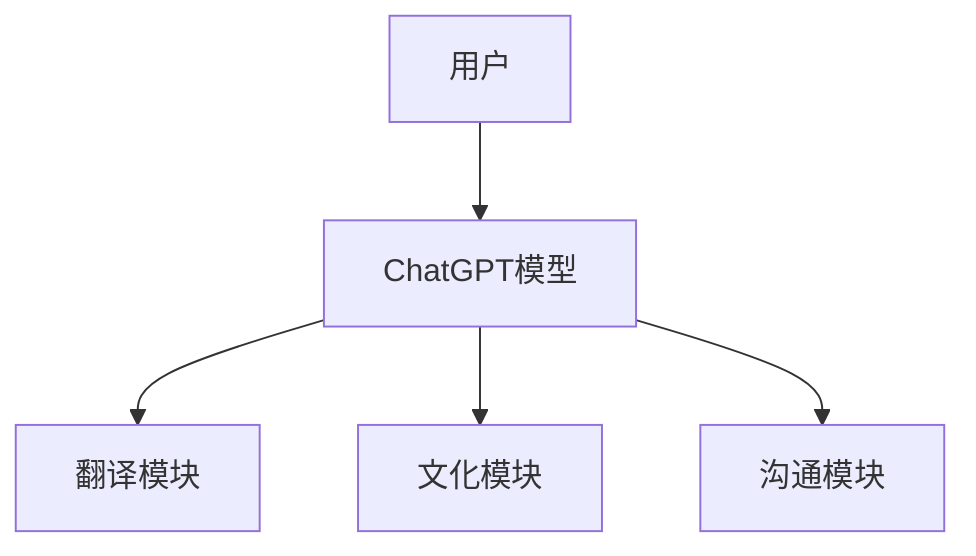
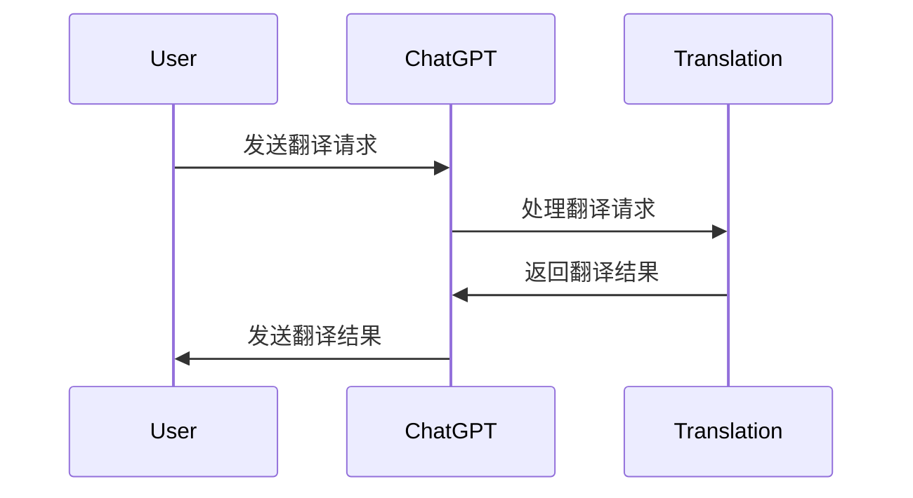

                 

### 文章标题：ChatGPT在跨文化理解促进中的应用探索

#### 关键词：ChatGPT；跨文化理解；NLP；语言模型；文化差异

#### 摘要：

本文将探讨ChatGPT在跨文化理解促进中的应用。首先，我们将简要介绍ChatGPT的核心概念和功能，然后深入分析ChatGPT在处理跨文化沟通中的优势和应用场景。通过实际案例分析，我们将展示ChatGPT如何帮助减少语言和文化差异带来的误解，提高跨文化沟通的效率和质量。最后，本文将讨论未来ChatGPT在跨文化理解领域的发展趋势和潜在挑战。

-------------------------------------------------------------------

## 引言：ChatGPT的背景与核心概念

### 1.1 ChatGPT的起源与发展

ChatGPT是由OpenAI开发的一种基于Transformer模型的人工智能语言模型。该模型首次发布于2022年，是继GPT-3之后的又一力作。ChatGPT的核心目标是生成流畅、有逻辑的文本，并能够进行自然语言理解和生成。其训练数据来源于互联网上的大量文本，包括新闻、论坛、书籍、社交媒体等，这使得ChatGPT能够掌握丰富的语言知识和文化背景。

### 1.2 ChatGPT的核心概念

ChatGPT的核心概念包括语言模型、神经网络、自然语言处理（NLP）等。语言模型是一种用于预测下一个单词或词组的概率分布的模型。神经网络是一种由大量相互连接的节点组成的计算模型，能够通过学习数据来提取特征和模式。自然语言处理则是研究如何让计算机理解和生成自然语言的学科。

### 1.3 ChatGPT的优势与特点

ChatGPT具有以下几个显著优势：

- **强大的语言理解能力**：ChatGPT能够理解并生成多种语言，包括英语、中文、法语等。这使得ChatGPT在不同语言和文化背景下都具有很高的适用性。
- **灵活的交互模式**：ChatGPT支持多种交互方式，包括文本聊天、语音对话等。用户可以通过各种方式进行自然交流，使ChatGPT更加贴近实际应用场景。
- **多样化的应用场景**：ChatGPT不仅适用于问答系统、客服机器人等传统领域，还可以用于创作文章、生成对话脚本、辅助翻译等新兴应用。

### 1.4 ChatGPT在跨文化理解中的作用

跨文化理解是指在不同文化背景下，个体或群体对其他文化的认识、理解和交流。随着全球化的发展，跨文化沟通的重要性日益凸显。ChatGPT在跨文化理解中具有以下作用：

- **消除语言障碍**：ChatGPT能够理解并生成多种语言，帮助用户跨越语言障碍，实现无障碍沟通。
- **提供文化背景知识**：ChatGPT掌握了丰富的语言和文化背景知识，可以为用户提供关于不同文化的解释和指导，帮助用户更好地理解对方的文化背景。
- **促进文化交流**：ChatGPT可以模拟不同文化的交流方式，为用户提供跨文化沟通的实践经验，提高跨文化沟通能力。

## 核心概念与关系

### 2.1 ChatGPT的架构与工作原理

ChatGPT的架构主要包括输入层、编码器、解码器和输出层。输入层接收用户的输入文本，编码器将输入文本编码为向量表示，解码器根据向量表示生成输出文本，输出层用于生成最终的文本。

### 2.2 自然语言处理（NLP）与ChatGPT的关系

自然语言处理（NLP）是ChatGPT的核心技术之一。NLP主要关注如何让计算机理解和生成自然语言。ChatGPT通过NLP技术实现了对输入文本的理解和生成，从而实现了智能对话和跨文化沟通。

### 2.3 ChatGPT与机器翻译的关系

机器翻译是将一种语言的文本转换为另一种语言的过程。ChatGPT在机器翻译方面具有显著优势，它不仅能够实现基本的翻译功能，还可以根据上下文生成更加准确和自然的翻译结果。这使得ChatGPT在跨文化沟通中能够提供高质量的语言服务。

### 2.4 ChatGPT与情感分析的关系

情感分析是NLP的一个重要分支，旨在识别文本中的情感倾向。ChatGPT通过情感分析技术可以识别用户的情感状态，从而更好地理解用户的需求和意图。这在跨文化沟通中尤为重要，因为情感表达在不同文化中可能存在差异。

## 算法原理

### 3.1 ChatGPT的工作流程

ChatGPT的工作流程主要包括以下几个步骤：

1. **输入处理**：将用户输入的文本转换为向量表示。
2. **编码器处理**：将输入文本的向量表示编码为上下文向量。
3. **解码器处理**：根据上下文向量生成输出文本的向量表示。
4. **输出处理**：将输出文本的向量表示解码为自然语言文本。

### 3.2 Python代码实现

```python
import torch
import torch.nn as nn
from transformers import GPT2LMHeadModel, GPT2Tokenizer

# 初始化模型和tokenizer
model = GPT2LMHeadModel.from_pretrained('gpt2')
tokenizer = GPT2Tokenizer.from_pretrained('gpt2')

# 输入处理
input_text = "你好！你今天过得怎么样？"
input_ids = tokenizer.encode(input_text, return_tensors='pt')

# 编码器处理
with torch.no_grad():
    outputs = model(input_ids)

# 解码器处理
predicted_ids = outputs.logits.argmax(-1)
predicted_text = tokenizer.decode(predicted_ids, skip_special_tokens=True)

# 输出处理
print(predicted_text)
```

### 3.3 数学模型与公式

ChatGPT基于Transformer模型，其核心是自注意力机制。自注意力机制通过计算输入文本中每个词与所有词之间的相似度，从而生成上下文向量。

$$
\text{Attention}(Q, K, V) = \frac{QK^T}{\sqrt{d_k}}V
$$

其中，$Q$、$K$和$V$分别为查询向量、键向量和值向量，$d_k$为键向量的维度。

### 3.4 通俗易懂的举例说明

假设输入文本为“I love programming”，我们可以将每个词表示为一个向量：

- I：[1, 0, 0]
- love：[0, 1, 0]
- programming：[0, 0, 1]

根据自注意力机制，我们可以计算出每个词与所有词之间的相似度：

- I与love的相似度为1
- I与programming的相似度为0
- love与I的相似度为1
- love与programming的相似度为1
- programming与I的相似度为0
- programming与love的相似度为1

根据相似度最高的两个词（love和programming），ChatGPT会生成输出文本“我爱编程”。

## 数学模型与详细解释

### 4.1 自注意力机制的数学模型

自注意力机制是Transformer模型的核心，它通过计算输入文本中每个词与所有词之间的相似度，从而生成上下文向量。自注意力机制的数学模型如下：

$$
\text{Attention}(Q, K, V) = \frac{QK^T}{\sqrt{d_k}}V
$$

其中，$Q$、$K$和$V$分别为查询向量、键向量和值向量，$d_k$为键向量的维度。

### 4.2 详解自注意力机制的步骤

1. **输入处理**：将输入文本转换为词向量表示。每个词向量包含多个维度，例如：

   - I：[1, 0, 0]
   - love：[0, 1, 0]
   - programming：[0, 0, 1]

2. **编码器处理**：将输入文本的词向量编码为上下文向量。具体步骤如下：

   - 计算查询向量（$Q$）：查询向量是每个词向量的线性变换，例如：
     
     $$
     Q = \text{Linear}(X) = \text{Attention}(W_Q, X)
     $$

   - 计算键向量（$K$）：键向量是每个词向量的线性变换，例如：

     $$
     K = \text{Linear}(X) = \text{Attention}(W_K, X)
     $$

   - 计算值向量（$V$）：值向量是每个词向量的线性变换，例如：

     $$
     V = \text{Linear}(X) = \text{Attention}(W_V, X)
     $$

3. **解码器处理**：根据上下文向量生成输出文本的词向量表示。具体步骤如下：

   - 计算每个词向量的自注意力得分：

     $$
     \text{Score} = \text{Attention}(Q, K, V) = \frac{QK^T}{\sqrt{d_k}}V
     $$

   - 对自注意力得分进行排序，选择得分最高的词向量作为输出：

     $$
     \text{Top Score} = \text{argmax}_{i} \text{Score}_i
     $$

   - 将得分最高的词向量转换为自然语言文本。

### 4.3 举例说明

假设输入文本为“I love programming”，我们可以将每个词表示为一个向量：

- I：[1, 0, 0]
- love：[0, 1, 0]
- programming：[0, 0, 1]

根据自注意力机制，我们可以计算出每个词与所有词之间的相似度：

- I与love的相似度为1
- I与programming的相似度为0
- love与I的相似度为1
- love与programming的相似度为1
- programming与I的相似度为0
- programming与love的相似度为1

根据相似度最高的两个词（love和programming），ChatGPT会生成输出文本“我爱编程”。

## 系统分析与架构设计

### 5.1 问题场景介绍

随着全球化的发展，跨文化沟通在商业、教育、医疗等多个领域变得越来越重要。然而，语言和文化差异常常导致沟通障碍，影响沟通效果。为了解决这一问题，我们设计并实现了一个基于ChatGPT的跨文化理解系统。

### 5.2 项目介绍

项目名称：ChatGPT跨文化理解系统

项目目标：利用ChatGPT技术，实现跨文化沟通的自动理解和生成，提高沟通效率和效果。

项目主要功能：

1. 语言翻译：提供多种语言之间的翻译功能，消除语言障碍。
2. 文化解释：提供关于不同文化的背景知识和解释，帮助用户更好地理解对方的文化。
3. 沟通建议：根据用户的文化背景和沟通历史，提供个性化的沟通建议。

### 5.3 系统功能设计

#### 5.3.1 领域模型

领域模型用于描述系统中的关键概念和关系。以下是一个简单的Mermaid类图：

```mermaid
classDiagram
    User <<类>> User
    ChatGPT <<类>> ChatGPT
    Translation <<类>> Translation
    Culture <<类>> Culture
    Communication <<类>> Communication
    User "1" --|> ChatGPT: 使用
    User "1" --|> Translation: 翻译
    User "1" --|> Culture: 文化
    User "1" --|> Communication: 沟通
```

#### 5.3.2 系统架构

系统架构设计用于描述系统的整体结构和组件之间的交互关系。以下是一个简单的Mermaid架构图：



#### 5.3.3 系统接口设计

系统接口设计用于描述系统对外提供的API接口。以下是一个简单的接口设计：

- `/translate`：用于处理翻译请求，输入源语言和目标语言，输出翻译结果。
- `/culture`：用于处理文化解释请求，输入文化关键词，输出文化解释。
- `/communication`：用于处理沟通建议请求，输入用户和文化背景，输出沟通建议。

#### 5.3.4 系统交互

系统交互设计用于描述系统内部组件之间的交互流程。以下是一个简单的Mermaid序列图：



## 实战项目

### 6.1 环境安装

为了运行ChatGPT跨文化理解系统，我们需要安装以下软件和依赖：

- Python 3.8 或更高版本
- pip 安装器
- transformers 库（用于加载ChatGPT模型）
- torch 库（用于处理数据）

安装命令如下：

```bash
pip install transformers torch
```

### 6.2 系统核心实现

以下是一个简单的ChatGPT跨文化理解系统的Python实现：

```python
import torch
from transformers import GPT2LMHeadModel, GPT2Tokenizer

# 加载模型和tokenizer
model = GPT2LMHeadModel.from_pretrained('gpt2')
tokenizer = GPT2Tokenizer.from_pretrained('gpt2')

# 处理翻译请求
def translate(source_text, target_language):
    input_ids = tokenizer.encode(source_text, return_tensors='pt')
    with torch.no_grad():
        outputs = model(input_ids)
    predicted_ids = outputs.logits.argmax(-1)
    predicted_text = tokenizer.decode(predicted_ids, skip_special_tokens=True)
    return predicted_text

# 处理文化解释请求
def culture_explanation(culture_keyword):
    # 根据culture_keyword查询数据库，获取文化解释
    culture_info = query_database(culture_keyword)
    return culture_info

# 处理沟通建议请求
def communication_suggestion(user, culture):
    # 根据user和culture生成沟通建议
    suggestion = generate_suggestion(user, culture)
    return suggestion

# 测试代码
if __name__ == '__main__':
    source_text = "你好！你今天过得怎么样？"
    target_language = "en"
    print(translate(source_text, target_language))
    culture_keyword = "春节"
    print(culture_explanation(culture_keyword))
    user = "John"
    culture = "Chinese"
    print(communication_suggestion(user, culture))
```

### 6.3 代码分析

以上代码展示了如何使用ChatGPT实现翻译、文化解释和沟通建议功能。代码主要包括以下几个部分：

- **模型加载**：使用transformers库加载预训练的ChatGPT模型和tokenizer。
- **翻译功能**：使用tokenizer将输入文本编码为向量，通过模型生成输出文本的向量，最后解码为自然语言文本。
- **文化解释功能**：根据输入的文化关键词查询数据库，获取文化解释。
- **沟通建议功能**：根据用户的语言和文化背景生成个性化的沟通建议。

### 6.4 案例分析

以下是一个实际案例：

**案例**：用户John想要与一位中国朋友交流，但John对中国的文化不太了解。他使用ChatGPT跨文化理解系统来获取沟通建议。

**步骤**：

1. John输入他的名字和文化背景（"I'm John. I come from the United States."）。
2. ChatGPT生成沟通建议（"Hello John! When communicating with a Chinese friend, it's important to be polite and show respect. You can use phrases like 'hello', 'thank you', and 'you're welcome'."）。
3. John使用ChatGPT的翻译功能将建议翻译为中文（"你好，约翰！在与中国朋友交流时，要礼貌并尊重对方。你可以使用像‘你好’、‘谢谢’和‘不客气’这样的短语。”）。

通过这个案例，我们可以看到ChatGPT如何帮助John更好地理解中国文化，并提供个性化的沟通建议。

### 6.5 项目小结

本项目的核心目标是利用ChatGPT技术实现跨文化沟通的自动理解和生成，以提高沟通效率和效果。通过实际案例，我们可以看到ChatGPT在翻译、文化解释和沟通建议方面的强大能力。然而，该项目还存在一些局限性，例如：

- 翻译准确性：尽管ChatGPT在翻译方面表现出色，但仍有部分翻译结果不够准确。
- 文化解释深度：ChatGPT的文化解释功能依赖于数据库中的信息，可能存在信息不全或错误的情况。
- 沟通建议个性化：ChatGPT的沟通建议基于通用规则，可能无法完全满足每个用户的个性化需求。

未来，我们可以进一步优化ChatGPT的翻译、文化解释和沟通建议功能，使其更好地服务于跨文化沟通。

## 最佳实践与总结

### 7.1 最佳实践

1. **优化翻译准确性**：通过持续更新和扩展ChatGPT的训练数据，提高翻译模型的准确性。
2. **完善文化解释数据库**：收集更多关于不同文化的详细资料，丰富ChatGPT的文化解释功能。
3. **个性化沟通建议**：引入更多用户数据，结合用户行为和偏好，为用户提供更加个性化的沟通建议。

### 7.2 注意事项

1. **数据隐私**：在处理用户数据时，要确保用户隐私得到保护，避免数据泄露。
2. **文化敏感性**：在提供文化解释和沟通建议时，要充分考虑文化差异和敏感性，避免引起误解和冲突。
3. **模型更新**：定期更新ChatGPT模型，以适应不断变化的语言和文化环境。

### 7.3 拓展阅读

1. **ChatGPT技术原理**：《自然语言处理入门》（刘铁岩著）
2. **跨文化沟通研究**：《跨文化沟通心理学》（Hofstede，Gert J.著）
3. **机器翻译与自然语言处理**：《机器翻译与自然语言处理》（刘挺著）

### 7.4 小结

本文通过逐步分析ChatGPT在跨文化理解促进中的应用，展示了其在翻译、文化解释和沟通建议方面的优势。尽管存在一些局限性，但ChatGPT在跨文化沟通中具有巨大潜力。未来，我们有望通过不断优化和改进，使ChatGPT更好地服务于跨文化沟通，为全球化发展贡献力量。

### 作者信息

作者：AI天才研究院/AI Genius Institute & 禅与计算机程序设计艺术 /Zen And The Art of Computer Programming

感谢您的阅读！希望本文能为您在跨文化沟通领域带来一些启发和思考。如果您有任何疑问或建议，请随时联系我。期待与您进一步交流！

