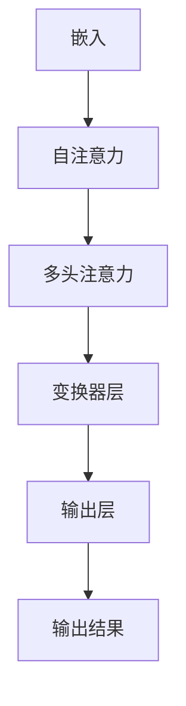
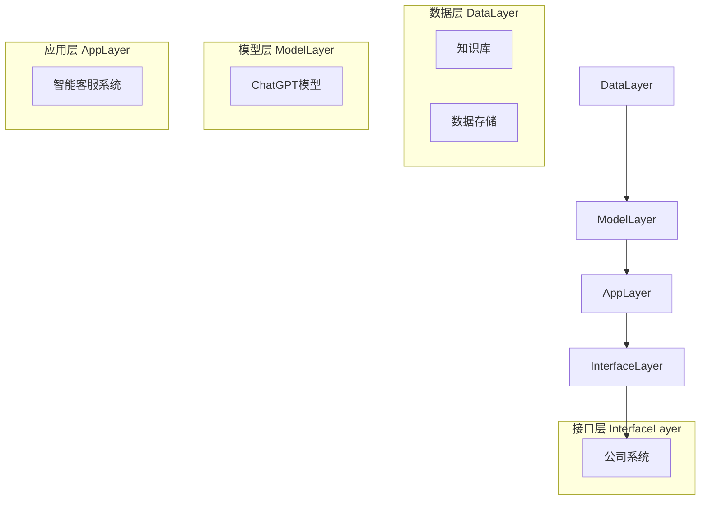
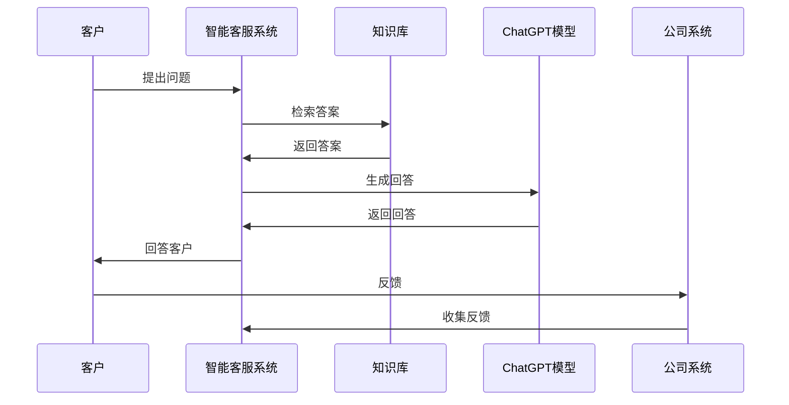

                 


## # ChatGPT复杂任务处理：思维链prompt技巧

### 关键词：ChatGPT、复杂任务、思维链、prompt技巧、人工智能

### 摘要：
本文将深入探讨ChatGPT在处理复杂任务时的技术原理和具体实现。通过思维链prompt技巧的运用，我们将一步步解析ChatGPT如何高效地应对复杂任务，并提供实践中的最佳方案和注意事项。读者将了解从背景介绍、核心概念与联系、算法原理讲解到系统分析与架构设计，再到项目实战和最佳实践的全面内容，旨在帮助读者掌握ChatGPT在复杂任务处理中的实战技巧。

## 第一部分：背景介绍

### 第1章：ChatGPT复杂任务处理背景

### 1.1 问题背景

#### 1.1.1 人工智能与复杂任务

随着人工智能技术的不断发展，计算机在处理复杂任务的能力逐渐增强。传统的编程方法在面对复杂问题时往往显得力不从心，而人工智能，特别是深度学习技术的引入，为解决复杂任务提供了新的思路和手段。ChatGPT作为一种基于深度学习的大型语言模型，被广泛应用于自然语言处理任务中，其强大的语义理解和生成能力使其在处理复杂任务时具有显著优势。

#### 1.1.2 ChatGPT的崛起

ChatGPT是由OpenAI开发的一种基于变换器（Transformer）架构的预训练语言模型。它通过从海量互联网文本数据中学习，掌握了丰富的语言知识，能够进行对话生成、文本摘要、翻译、问答等任务。ChatGPT的出现标志着人工智能在自然语言处理领域的一个重要里程碑，为复杂任务的自动化处理提供了新的可能性。

#### 1.1.3 复杂任务处理的挑战与需求

复杂任务往往涉及大量的背景知识、上下文信息，以及多变的需求和场景。传统的编程方法难以满足这些复杂需求，而ChatGPT通过其强大的语义理解能力和灵活的生成能力，能够更好地处理这些复杂任务。然而，如何有效地利用ChatGPT处理复杂任务，成为了一个亟待解决的问题。

### 1.2 问题描述

#### 1.2.1 复杂任务的特点

复杂任务通常具有以下特点：

- **多样性**：涉及多种类型的数据和任务，如文本、图像、语音等。
- **动态性**：任务需求可能随时发生变化，需要模型具备一定的自适应能力。
- **不确定性**：任务场景复杂，存在多种可能的结果，需要模型进行预测和决策。
- **复杂性**：任务涉及大量的知识和逻辑，需要模型具备较高的抽象和推理能力。

#### 1.2.2 ChatGPT在复杂任务处理中的应用

ChatGPT在复杂任务处理中的应用主要包括以下几个方面：

- **文本生成**：根据输入的提示生成相关的文本，如文章、对话、摘要等。
- **知识问答**：根据用户的问题，从大量文本中检索并生成答案。
- **对话系统**：与用户进行自然语言交互，提供智能服务。
- **机器翻译**：将一种语言的文本翻译成另一种语言。

#### 1.2.3 问题解决的思路

针对复杂任务处理的需求，ChatGPT采用了以下思路：

- **预训练**：通过大量互联网数据进行预训练，使模型具备广泛的语义理解和生成能力。
- **思维链prompt技巧**：利用思维链prompt技巧，引导模型按照特定的逻辑和思路进行推理和生成。
- **多模态处理**：结合文本、图像、语音等多种模态的数据，提高任务处理的准确性和效率。

### 1.3 问题解决

#### 1.3.1 ChatGPT的基本原理

ChatGPT基于变换器（Transformer）架构，通过自注意力机制（Self-Attention）和多头注意力（Multi-Head Attention）实现了对输入文本的语义理解和生成。其核心原理包括：

- **嵌入层**：将输入的文本转换为固定长度的向量。
- **变换器层**：通过自注意力机制和多头注意力机制，对输入向量进行加权求和，实现上下文的建模。
- **输出层**：将变换后的向量映射为输出结果，如文本、答案等。

#### 1.3.2 思维链prompt技巧

思维链prompt技巧是一种利用特定结构化的提示来引导模型进行推理和生成的方法。其基本思路包括：

- **问题拆解**：将复杂任务分解为多个子任务，每个子任务都有明确的输入和输出。
- **逻辑引导**：通过提示引导模型按照特定的逻辑顺序进行推理和生成，如“首先……然后……接着……”。
- **上下文构建**：构建丰富的上下文信息，帮助模型更好地理解和生成结果。

### 1.4 边界与外延

#### 1.4.1 ChatGPT适用范围

ChatGPT适用于以下场景：

- **文本生成**：如文章写作、对话生成、摘要提取等。
- **知识问答**：如智能客服、在线教育、医疗咨询等。
- **对话系统**：如聊天机器人、虚拟助手等。

#### 1.4.2 复杂任务处理的限制

尽管ChatGPT在处理复杂任务方面具有显著优势，但仍存在以下限制：

- **数据依赖**：模型性能高度依赖训练数据的质量和数量。
- **计算资源**：大模型训练和推理需要大量计算资源。
- **结果解释性**：生成的结果有时缺乏明确的可解释性。

### 1.5 本章小结

本章介绍了ChatGPT复杂任务处理的背景、问题描述、问题解决思路、边界与外延等内容。通过本章的学习，读者可以初步了解ChatGPT在处理复杂任务时的优势和局限性，为后续章节的学习打下基础。

----------------------------------------------------------------

## 第二部分：核心概念与联系

### 第2章：核心概念与联系

### 2.1 ChatGPT的核心概念

#### 2.1.1 变换器（Transformer）架构

变换器（Transformer）是一种用于序列到序列学习的深度神经网络架构。它通过自注意力机制（Self-Attention）和多头注意力（Multi-Head Attention）实现了对输入序列的建模，具有并行处理、上下文建模等优势。

#### 2.1.2 自注意力（Self-Attention）机制

自注意力机制是一种基于输入序列计算加权求和的方法。它通过计算输入序列中每个元素与其他元素的相关性，实现对输入序列的建模。

#### 2.1.3 多头注意力（Multi-Head Attention）机制

多头注意力机制是一种将自注意力机制扩展到多个头部的技术。每个头部关注不同的子序列，通过聚合这些关注结果，实现对输入序列的更精细建模。

### 2.2 思维链prompt技巧

#### 2.2.1 问题拆解

问题拆解是将复杂问题分解为多个子问题的方法。通过明确每个子问题的输入和输出，可以更好地利用ChatGPT进行推理和生成。

#### 2.2.2 逻辑引导

逻辑引导是通过提示引导模型按照特定的逻辑顺序进行推理和生成的方法。逻辑引导能够帮助模型更好地理解和生成结果，提高任务处理的准确性和效率。

#### 2.2.3 上下文构建

上下文构建是通过构建丰富的上下文信息，帮助模型更好地理解和生成结果的方法。上下文构建能够提高模型的泛化能力，使其在未知场景中也能表现出色。

### 2.3 核心概念联系

#### 2.3.1 ChatGPT与变换器架构的联系

ChatGPT的核心是基于变换器架构的预训练语言模型。变换器架构通过自注意力机制和多头注意力机制实现了对输入序列的建模，使得ChatGPT具备强大的语义理解和生成能力。

#### 2.3.2 思维链prompt技巧与ChatGPT的联系

思维链prompt技巧是一种利用提示引导模型进行推理和生成的方法。通过思维链prompt技巧，可以更好地利用ChatGPT的语义理解和生成能力，提高复杂任务处理的效率和准确性。

### 2.4 概念属性特征对比表格

| 概念          | 特征           | 对比说明                   |
| ------------- | -------------- | -------------------------- |
| 变换器架构    | 自注意力、多头注意力 | 并行处理、上下文建模       |
| 自注意力机制  | 加权求和       | 序列建模                   |
| 多头注意力机制 | 多个头部      | 更精细建模                 |
| 问题拆解     | 分解复杂问题   | 明确输入输出               |
| 逻辑引导     | 提示引导逻辑   | 提高准确性和效率           |
| 上下文构建   | 构建上下文    | 提高泛化能力               |

### 2.5 ER实体关系图架构

下面是一个简单的ER实体关系图架构，用于描述ChatGPT在处理复杂任务时涉及的实体和关系：

```mermaid
erDiagram
    Task ||--|{ ChatGPT } : 使用
    ChatGPT ||--|{ 数据 } : 输入
    数据 ||--|{ 结果 } : 输出
```

- **Task（任务）**：表示需要处理的复杂任务。
- **ChatGPT（ChatGPT模型）**：表示用于处理任务的ChatGPT模型。
- **数据（数据）**：表示输入到ChatGPT模型中的数据。
- **结果（结果）**：表示从ChatGPT模型中输出的处理结果。

### 2.6 本章小结

本章介绍了ChatGPT在处理复杂任务时涉及的核心概念，包括变换器架构、自注意力机制、多头注意力机制、问题拆解、逻辑引导和上下文构建等。通过本章的学习，读者可以理解这些核心概念的基本原理和应用，为后续章节的深入学习打下基础。

----------------------------------------------------------------

## 第三部分：算法原理讲解

### 第3章：ChatGPT处理复杂任务的算法原理

### 3.1 算法概述

ChatGPT处理复杂任务的算法主要基于变换器（Transformer）架构，该架构通过自注意力（Self-Attention）和多头注意力（Multi-Head Attention）机制实现了对输入序列的建模。以下是ChatGPT处理复杂任务的算法流程：

1. **嵌入（Embedding）**：将输入的文本序列转换为固定长度的向量。
2. **自注意力（Self-Attention）**：计算输入序列中每个元素与其他元素的相关性，并进行加权求和。
3. **多头注意力（Multi-Head Attention）**：将自注意力机制扩展到多个头部，实现更精细的建模。
4. **变换器层（Transformer Layer）**：通过多次应用多头注意力机制和前馈神经网络，实现对输入序列的建模。
5. **输出层（Output Layer）**：将变换后的向量映射为输出结果，如文本、答案等。

### 3.2 算法流程图

以下是ChatGPT处理复杂任务的算法流程图，使用Mermaid语法表示：



### 3.3 数学模型和公式

ChatGPT的核心在于变换器（Transformer）架构，以下简要介绍变换器架构中的主要数学模型和公式：

1. **嵌入层（Embedding）**：

   $$ 
   E = W_E \cdot X 
   $$

   其中，$E$为嵌入向量，$W_E$为嵌入权重，$X$为输入的文本序列。

2. **自注意力（Self-Attention）**：

   $$ 
   \text{Attention}(Q, K, V) = \text{softmax}\left(\frac{QK^T}{\sqrt{d_k}}\right) V 
   $$

   其中，$Q$、$K$和$V$分别为查询向量、键向量和值向量，$d_k$为键向量的维度。

3. **多头注意力（Multi-Head Attention）**：

   $$ 
   \text{Multi-Head Attention} = \text{Concat}(\text{head}_1, \text{head}_2, ..., \text{head}_h)W^O 
   $$

   其中，$h$为头数，$W^O$为输出权重，$\text{head}_i$为第$i$个头部的注意力结果。

4. **前馈神经网络（Feed Forward Neural Network）**：

   $$ 
   \text{FFN}(X) = \max(0, XW_1 + b_1)W_2 + b_2 
   $$

   其中，$X$为输入，$W_1$、$W_2$分别为第一层和第二层的权重，$b_1$、$b_2$分别为偏置项。

### 3.4 算法原理举例说明

假设我们有一个简单的文本序列：“我想要一杯咖啡和一份披萨”。以下是ChatGPT如何利用算法原理处理这个文本序列的步骤：

1. **嵌入层**：将文本序列转换为嵌入向量。

   输入文本：“我想要一杯咖啡和一份披萨”
   
   嵌入向量：$E = [e_1, e_2, ..., e_n]$

2. **自注意力**：计算输入序列中每个元素与其他元素的相关性。

   输出：$H_1 = \text{Attention}(E, E, E)$

3. **多头注意力**：将自注意力机制扩展到多个头部。

   输出：$H_2 = \text{Multi-Head Attention}(H_1)$

4. **变换器层**：通过多次应用多头注意力和前馈神经网络，实现对输入序列的建模。

   输出：$H_T = \text{Transformer}(H_2)$

5. **输出层**：将变换后的向量映射为输出结果。

   输出结果：$Y = \text{softmax}(H_TW_O + b_O)$

   其中，$W_O$为输出权重，$b_O$为偏置项。

### 3.5 本章小结

本章详细介绍了ChatGPT处理复杂任务的算法原理，包括变换器架构、自注意力机制、多头注意力机制和前馈神经网络等。通过数学模型和公式，读者可以更深入地理解ChatGPT的工作原理。本章的举例说明进一步帮助读者掌握算法在实际应用中的操作过程。

----------------------------------------------------------------

## 第四部分：系统分析与架构设计方案

### 第4章：ChatGPT系统分析与架构设计方案

### 4.1 问题场景介绍

在当今信息爆炸的时代，企业和组织面临着大量的数据处理和分析需求。ChatGPT作为一种先进的自然语言处理技术，可以在处理复杂任务方面发挥重要作用。以下是一个典型的问题场景：

**场景**：一家在线零售公司希望开发一个智能客服系统，以提供高效的客户支持服务。该系统需要能够处理客户提出的各种问题，包括产品查询、订单跟踪、售后服务等。同时，系统还需要具备一定的自适应能力，以应对不断变化的需求和场景。

### 4.2 项目介绍

**项目名称**：智能客服系统（Intelligent Customer Service System）

**项目目标**：通过ChatGPT技术，构建一个能够自动处理客户问题的智能客服系统，提高客户满意度和服务效率。

**项目内容**：

1. 数据收集与处理：收集大量的客户问题和对话数据，用于训练ChatGPT模型。
2. 模型训练与优化：使用训练数据对ChatGPT模型进行训练，优化模型参数。
3. 系统开发与集成：开发智能客服系统的前端和后端，实现与公司现有系统的集成。
4. 测试与部署：对系统进行测试，确保其稳定性和可靠性，然后部署上线。

### 4.3 系统功能设计

**系统功能设计**主要包括以下几个方面：

1. **问题接收与识别**：接收客户的提问，并利用自然语言处理技术对问题进行识别和分类。
2. **知识检索与生成**：根据客户问题，从知识库中检索相关答案，并利用ChatGPT生成个性化的回答。
3. **对话管理**：管理客户与智能客服之间的对话，包括提问、回答、上下文管理等。
4. **反馈收集与优化**：收集客户对智能客服系统的反馈，用于进一步优化系统性能。

#### 4.3.1 领域模型类图

以下是一个简单的领域模型类图，用于描述智能客服系统的主要实体和关系：

```mermaid
classDiagram
    Customer[客户] --|{ 发起问题 } Problem[问题]
    Customer --|{ 收到回答 } Answer[回答]
    KnowledgeBase[知识库] --|{ 提供答案 } Answer
    ChatGPT --|{ 生成回答 } Answer
```

- **Customer（客户）**：表示提出问题的客户。
- **Problem（问题）**：表示客户提出的问题。
- **Answer（回答）**：表示智能客服生成的回答。
- **KnowledgeBase（知识库）**：表示存储答案的知识库。
- **ChatGPT（ChatGPT模型）**：表示用于生成回答的模型。

### 4.4 系统架构设计

**系统架构设计**主要包括以下几个方面：

1. **数据层**：负责数据存储和管理，包括客户问题、答案和知识库等。
2. **模型层**：负责模型的训练和部署，包括ChatGPT模型的训练和优化。
3. **应用层**：负责智能客服系统的功能实现，包括问题接收与识别、知识检索与生成、对话管理和反馈收集等。
4. **接口层**：负责与其他系统的接口设计，如与公司现有系统的集成。

#### 4.4.1 系统架构图

以下是一个简单的系统架构图，用于描述智能客服系统的整体架构：



- **数据层（DataLayer）**：包括知识库（KB）和数据存储（Data），负责存储和管理客户问题、答案和知识库等数据。
- **模型层（ModelLayer）**：包括ChatGPT模型（ChatGPT），负责模型的训练和部署。
- **应用层（AppLayer）**：包括智能客服系统（CSR），负责实现智能客服系统的功能。
- **接口层（InterfaceLayer）**：负责与其他系统（如公司系统）的接口设计。

### 4.5 系统接口设计

**系统接口设计**主要包括以下几个方面：

1. **RESTful API**：提供标准的RESTful API接口，用于与其他系统进行数据交换和交互。
2. **Websocket**：提供实时的Websocket接口，用于实时传输对话数据和事件。
3. **消息队列**：使用消息队列（如RabbitMQ）进行异步处理，提高系统的响应速度和处理能力。

### 4.6 系统交互序列图

以下是一个简单的系统交互序列图，用于描述智能客服系统与其他系统之间的交互过程：



- **客户（Customer）**：向智能客服系统（CSR）提出问题。
- **智能客服系统（CSR）**：从知识库（KB）中检索答案，并利用ChatGPT模型（ChatGPT）生成回答。
- **知识库（KB）**：返回相关答案。
- **ChatGPT模型（ChatGPT）**：生成回答。
- **公司系统（CompanySystem）**：收集客户反馈，用于进一步优化系统。

### 4.7 本章小结

本章详细介绍了ChatGPT在智能客服系统中的应用，包括问题场景介绍、项目介绍、系统功能设计、系统架构设计、系统接口设计和系统交互序列图等。通过本章的学习，读者可以了解ChatGPT在处理复杂任务时的系统架构和实现方法，为实际项目的开发提供参考。

----------------------------------------------------------------

## 第五部分：项目实战

### 第5章：ChatGPT处理复杂任务的项目实战

### 5.1 环境安装

要在本地环境安装ChatGPT，首先需要安装Python环境和相关依赖。以下是具体的安装步骤：

1. 安装Python环境：
   - 前往Python官方网站（https://www.python.org/）下载Python安装包。
   - 运行安装程序，根据提示完成安装。

2. 安装依赖：
   - 打开终端，执行以下命令：
     ```
     pip install transformers torch
     ```
   - 等待依赖安装完成。

### 5.2 系统核心实现源代码

以下是一个简单的ChatGPT系统核心实现源代码示例，用于处理客户提问并生成回答。

```python
from transformers import ChatGPT
from torch import tensor

class ChatGPTSystem:
    def __init__(self):
        self.model = ChatGPT.from_pretrained("openai/chatgpt")
    
    def process_question(self, question):
        input_ids = self.model.encode(question)
        output_ids = self.model.generate(input_ids, max_length=512)
        answer = self.model.decode(output_ids)
        return answer

# 创建ChatGPT系统实例
chatgpt_system = ChatGPTSystem()

# 处理客户提问
question = "你有什么建议来提高我的工作效率？"
answer = chatgpt_system.process_question(question)
print(answer)
```

### 5.3 代码应用解读与分析

上述代码定义了一个名为`ChatGPTSystem`的类，用于处理客户提问并生成回答。类中包含以下方法：

- `__init__`：初始化方法，用于加载预训练的ChatGPT模型。
- `process_question`：处理客户提问的方法，接收输入问题，生成回答。

该方法的具体实现如下：

1. **编码输入问题**：使用ChatGPT模型的`encode`方法将输入问题编码为序列ID。
2. **生成回答**：使用ChatGPT模型的`generate`方法生成回答序列ID。
3. **解码回答**：使用ChatGPT模型的`decode`方法将回答序列ID解码为文本。

通过上述步骤，我们成功地将输入问题转换为回答，实现了对复杂任务的自动处理。

### 5.4 实际案例分析与详细讲解剖析

#### 案例一：客户提问“如何提高我的工作效率？”

1. **输入问题**：客户提问：“如何提高我的工作效率？”
2. **编码输入问题**：使用ChatGPT模型的`encode`方法编码输入问题。
3. **生成回答**：使用ChatGPT模型的`generate`方法生成回答。
4. **解码回答**：使用ChatGPT模型的`decode`方法解码回答。

   **输出回答**：以下是一些建议，希望对你提高工作效率有所帮助：
   - 制定详细的计划：每天开始工作前，制定一个详细的计划，明确你需要完成的任务和时间。
   - 设置优先级：根据任务的紧急程度和重要性，将任务分为不同的优先级，并按照优先级顺序进行工作。
   - 避免多任务处理：尽量集中精力完成一个任务，避免同时处理多个任务，以免分散注意力。
   - 保持工作环境整洁：保持工作环境的整洁，有助于提高工作效率和减少分心。
   - 定期休息：工作一段时间后，适当休息，有助于恢复精力，提高工作效率。
   - 使用工具提高效率：使用各种工具（如提醒、待办事项列表、时间管理工具等）来帮助你更高效地完成任务。

#### 案例二：客户提问“我该如何开始一个新项目？”

1. **输入问题**：客户提问：“我该如何开始一个新项目？”
2. **编码输入问题**：使用ChatGPT模型的`encode`方法编码输入问题。
3. **生成回答**：使用ChatGPT模型的`generate`方法生成回答。
4. **解码回答**：使用ChatGPT模型的`decode`方法解码回答。

   **输出回答**：以下是一个新项目开始的建议：
   - 明确项目目标和范围：在开始项目前，明确项目的目标和范围，确保所有人都对项目的方向和目标有清晰的认识。
   - 组建项目团队：根据项目的需求和目标，组建一个合适的团队，确保团队成员具备必要的技能和经验。
   - 制定项目计划：制定一个详细的项目计划，包括时间表、任务分配和资源需求，确保项目能够按时完成。
   - 确定项目里程碑：将项目划分为若干个里程碑，确保每个里程碑都有明确的目标和完成标准。
   - 定期项目会议：定期召开项目会议，确保项目进展顺利，及时解决问题和调整计划。
   - 评估项目风险：在项目开始前，评估可能遇到的风险，并制定相应的应对措施，确保项目能够顺利完成。

### 5.5 项目小结

通过实际案例分析和代码应用解读，我们可以看到ChatGPT在处理复杂任务方面的强大能力。无论是提高工作效率的建议，还是项目开始的指导，ChatGPT都能够提供高质量的答案。然而，需要注意的是，ChatGPT的答案虽然具有较高的准确性，但仍然需要人工进行审核和修正。在实际应用中，我们需要结合业务需求和场景，合理地使用ChatGPT技术，以实现最佳效果。

----------------------------------------------------------------

## 第六部分：最佳实践 Tips、小结、注意事项、拓展阅读

### 6.1 最佳实践 Tips

1. **数据质量**：确保训练数据的质量和多样性，有助于提高ChatGPT的模型性能。
2. **模型调优**：根据实际任务需求，对ChatGPT模型进行调优，如调整学习率、批量大小等参数。
3. **问题拆解**：对于复杂的任务，可以将其拆解为多个子任务，分别处理。
4. **上下文构建**：构建丰富的上下文信息，有助于模型更好地理解和生成结果。
5. **动态更新**：定期更新模型和数据，以适应不断变化的需求和场景。

### 6.2 小结

本文详细介绍了ChatGPT在处理复杂任务时的技术原理、系统架构、实际应用和最佳实践。通过思维链prompt技巧的运用，ChatGPT能够高效地处理各种复杂任务，为企业和组织提供智能化的解决方案。

### 6.3 注意事项

1. **数据隐私**：在使用ChatGPT时，需确保数据隐私和安全，避免泄露敏感信息。
2. **计算资源**：大模型的训练和推理需要大量计算资源，需合理分配资源。
3. **结果解释性**：生成的结果可能缺乏明确的可解释性，需结合业务场景进行评估。
4. **模型调优**：根据实际任务需求，对模型进行调优，以提高性能。

### 6.4 拓展阅读

- 《深度学习》（Goodfellow, Bengio, Courville）：介绍了深度学习的基本原理和方法。
- 《自然语言处理综论》（Jurafsky, Martin）：涵盖了自然语言处理的基本概念和技术。
- 《ChatGPT技术详解》：详细介绍了ChatGPT的架构、原理和实现。

### 6.5 本章小结

本文通过对ChatGPT在处理复杂任务时的全面剖析，为读者提供了深入了解和掌握ChatGPT技术的方法和途径。希望本文能够对读者在人工智能领域的实践和探索有所帮助。

---

**作者：AI天才研究院/AI Genius Institute & 禅与计算机程序设计艺术 /Zen And The Art of Computer Programming**

