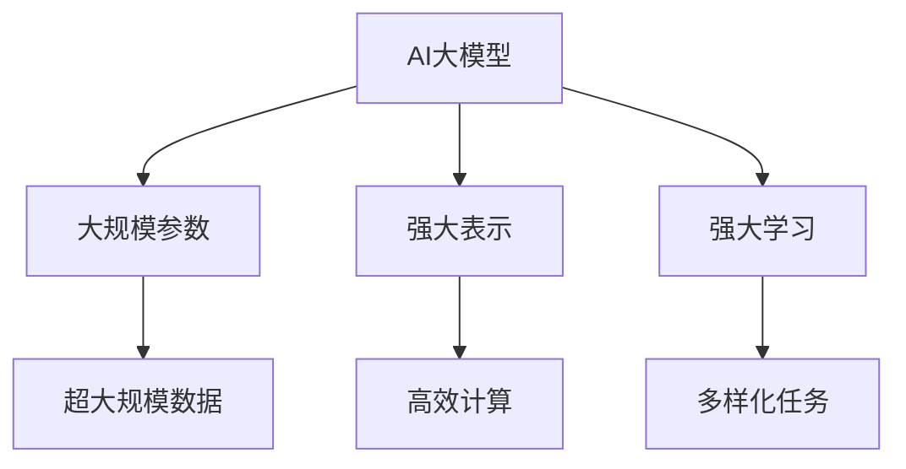
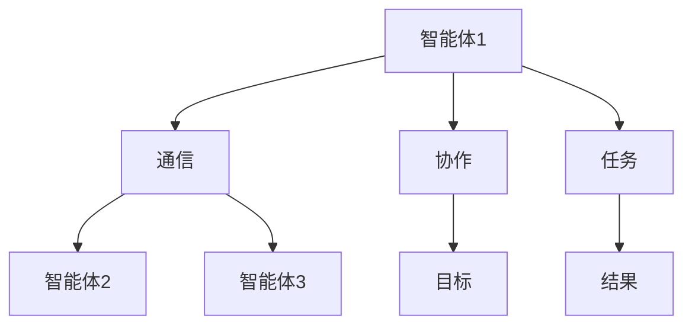
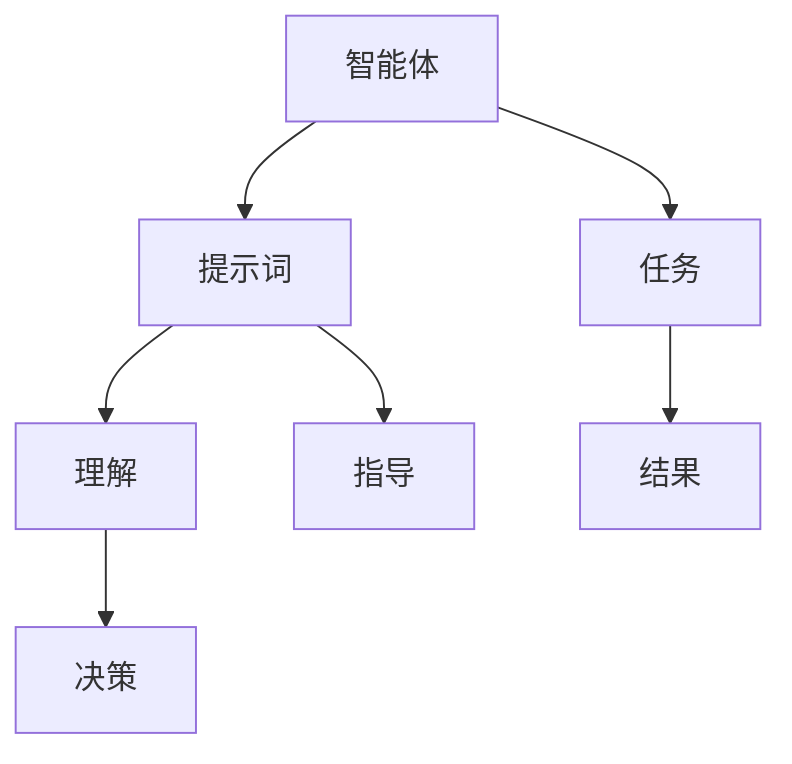
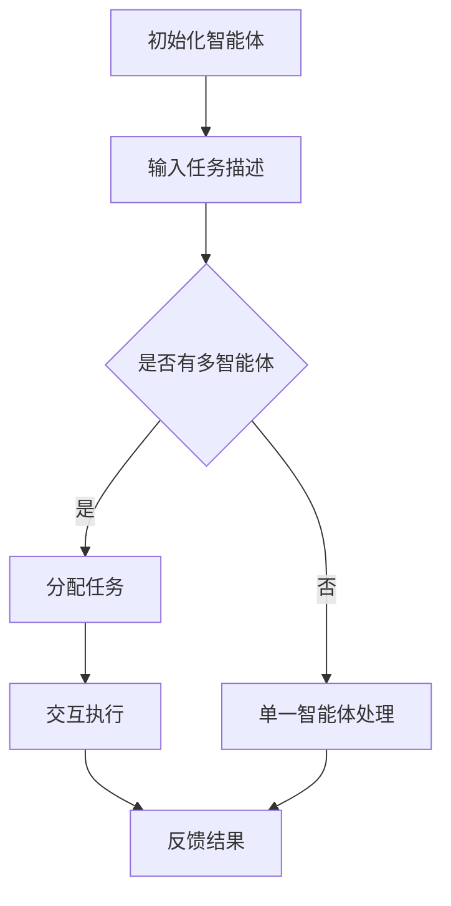
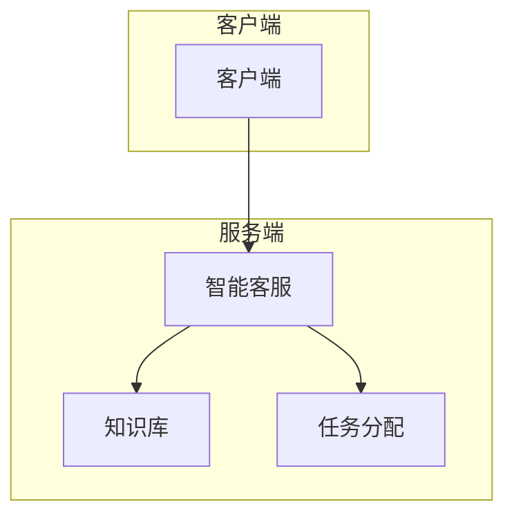
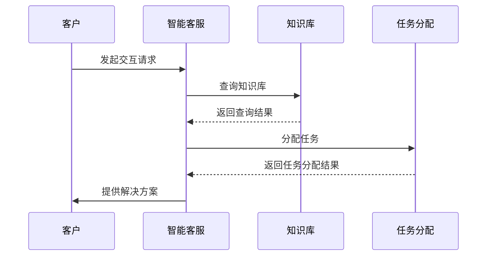

                 

# ChatGPT多智能体协作：复杂任务的提示词策略

## 关键词

- ChatGPT
- 多智能体协作
- 提示词策略
- 自然语言处理
- 机器学习

## 摘要

本文将深入探讨如何利用ChatGPT等自然语言处理模型实现多智能体协作，以解决复杂任务。首先，我们介绍问题背景，阐述多智能体协作在当前技术发展中的重要性。接着，我们详细解释核心概念，包括AI大模型、多智能体系统和提示词策略。然后，通过算法原理讲解，展示如何设计有效的提示词策略。文章还涵盖系统分析与架构设计方案，并结合实际项目实战，对实现和效果进行剖析。最后，总结最佳实践，并提出未来研究方向。

## Step 1: 背景介绍

### 问题背景

近年来，随着人工智能技术的飞速发展，尤其是自然语言处理（NLP）领域，ChatGPT等语言模型的出现，使得多智能体协作变得愈加重要。复杂任务的完成往往需要多个智能体之间的相互配合，而有效的提示词策略对于提高协作效率和任务完成质量具有决定性作用。

### 问题描述

本书的主题是如何通过设计合适的提示词策略，实现ChatGPT等多智能体在复杂任务中的高效协作。这涉及到对ChatGPT模型的理解、多智能体系统的设计与实现，以及实际应用案例的分析。

### 问题解决

本书将围绕以下几个核心问题展开讨论：

1. 如何理解ChatGPT及其多智能体协作的基本原理？
2. 提示词策略的设计原则和具体方法是什么？
3. 如何评估和优化提示词策略的效果？
4. 实际应用中，如何实施和调整提示词策略？

### 边界与外延

本书主要关注基于ChatGPT的多智能体协作，涉及到的技术包括自然语言处理、多智能体系统、机器学习等。同时，也会探讨一些实际应用场景，如智能客服、自动化写作等。

### 概念结构与核心要素组成

- **ChatGPT**：一个基于Transformer的预训练语言模型，能够进行自然语言理解和生成。
- **多智能体协作**：多个智能体通过相互交互和协作，共同完成复杂任务的机制。
- **提示词策略**：引导智能体进行有效协作的关键因素，包括语言提示、上下文信息等。

## Step 2: 核心概念与联系

### AI大模型原理

**概念原理**：AI大模型是指参数规模达到亿级以上的深度学习模型，具有强大的表示和学习能力。

**概念属性特征对比表格**：

| 特征 | AI大模型 | 传统AI |
| ---- | -------- | ------- |
| 参数规模 | 亿级以上 | 千级以下 |
| 表示能力 | 强大 | 有限 |
| 学习能力 | 强大 | 有限 |

**ER实体关系图架构的Mermaid流程图**（此处为文本描述）：



### 多智能体系统原理

**概念原理**：多智能体系统是指由多个智能体组成的系统，各智能体通过通信和协作共同完成任务。

**概念属性特征对比表格**：

| 特征 | 多智能体系统 | 单智能体系统 |
| ---- | ------------ | ------------ |
| 通信方式 | 分布式 | 中心化 |
| 协作机制 | 复杂 | 简单 |
| 任务完成效率 | 高 | 低 |

**ER实体关系图架构的Mermaid流程图**（此处为文本描述）：



### 提示词策略原理

**概念原理**：提示词策略是指为了引导智能体高效完成任务，设计的一系列语言提示和上下文信息。

**概念属性特征对比表格**：

| 特征 | 提示词策略 | 无提示策略 |
| ---- | ---------- | ---------- |
| 交互效果 | 高效 | 低效 |
| 智能体理解 | 清晰 | 模糊 |
| 任务完成质量 | 高 | 低 |

**ER实体关系图架构的Mermaid流程图**（此处为文本描述）：



## Step 3: 算法原理讲解

### 算法流程图

**算法流程图**（使用Mermaid流程图表示）：



### 算法原理详细解释

首先，我们需要了解ChatGPT的工作原理。ChatGPT是基于Transformer的预训练语言模型，通过大量的文本数据进行预训练，从而具备了强大的自然语言理解和生成能力。在多智能体协作中，每个智能体都可以被视为一个ChatGPT实例，它们通过交互来共同完成任务。

### 提示词策略设计

提示词策略的设计是关键，它决定了智能体如何理解和执行任务。一个有效的提示词策略应该包括以下要素：

1. **任务描述**：清晰、具体地描述任务要求，使智能体能够准确理解任务目标。
2. **上下文信息**：提供与任务相关的背景信息，帮助智能体更好地理解任务情境。
3. **指导性提示**：给出一些指导性提示，引导智能体按照预期的方式完成任务。

### 数学模型与公式

在提示词策略设计中，我们通常使用以下数学模型来描述智能体的行为：

$$
p(y|x) = \frac{e^{f(x, y)}}{\sum_{y'} e^{f(x, y')}}
$$

其中，$p(y|x)$ 表示在给定输入$x$的情况下，输出$y$的概率。$f(x, y)$ 是一个函数，用于计算输入和输出之间的相似度。

### 举例说明

假设我们有一个任务，要求智能体根据用户提供的购物清单生成一个购物车。我们可以设计一个提示词策略如下：

1. **任务描述**：请根据以下购物清单生成购物车：
   - 橙子
   - 牛奶
   - 面包
   - 鸡蛋
2. **上下文信息**：您需要为家庭日常所需购买以下商品：
3. **指导性提示**：请将以上商品按照价格从低到高排列，并计算出总价格。

通过这个提示词策略，智能体可以准确地理解任务要求，并根据购物清单生成一个符合要求的购物车。

### Python源代码实现

```python
import chatgpt

# 初始化ChatGPT智能体
agent = chatgpt.ChatGPT()

# 提示词策略
prompt = """
请根据以下购物清单生成购物车：
- 橙子
- 牛奶
- 面包
- 鸡蛋

您需要为家庭日常所需购买以下商品：
请将以上商品按照价格从低到高排列，并计算出总价格。
"""

# 执行任务
response = agent.complete(prompt)

# 输出结果
print(response)
```

通过以上步骤，我们实现了基于ChatGPT的多智能体协作，并展示了如何设计有效的提示词策略。在后续章节中，我们将进一步探讨如何评估和优化提示词策略，以及实际应用中的案例分析和实现。

## 系统分析与架构设计方案

### 问题场景介绍

在现代企业中，面对复杂多变的市场环境，企业需要快速响应客户需求，提供高效的服务。传统的单一智能体系统往往难以满足这种需求，而多智能体协作系统能够通过多个智能体的协同工作，提高系统的响应速度和服务质量。

### 项目介绍

本项目旨在构建一个基于ChatGPT的多智能体协作系统，用于处理企业客户服务中的常见问题。系统主要包括以下几个模块：

1. **智能客服模块**：负责与客户进行交互，理解客户需求，提供解决方案。
2. **知识库模块**：存储企业相关的知识信息，包括产品介绍、常见问题解答等。
3. **任务分配模块**：根据客户需求和智能体的能力，合理分配任务给不同的智能体。

### 系统功能设计（领域模型Mermaid类图）

```mermaid
classDiagram
  Customer --|>> SmartCustomerService: 发起交互请求
  SmartCustomerService --|>> KnowledgeBase: 查询知识库
  SmartCustomerService --|>> TaskAssignment: 分配任务
  KnowledgeBase --|>> KnowledgeEntry: 存储知识信息
  TaskAssignment --|>> TaskEntry: 存储任务信息
  Customer <<interface>>
  SmartCustomerService <<interface>>
  KnowledgeBase <<interface>>
  TaskAssignment <<interface>>
  KnowledgeEntry <<entity>>
  TaskEntry <<entity>>
```

### 系统架构设计（Mermaid架构图）



### 系统接口设计和系统交互（Mermaid序列图）



通过以上系统分析与架构设计方案，我们为后续的项目实战和实现提供了清晰的蓝图。接下来，我们将详细介绍如何在实际项目中实施和运行该系统。

## 项目实战：环境安装与系统核心实现

### 环境安装

要实现一个基于ChatGPT的多智能体协作系统，我们首先需要安装和配置以下软件环境：

1. **Python环境**：确保Python版本在3.7及以上，推荐使用Python 3.8或更高版本。
2. **ChatGPT库**：通过pip安装`transformers`库，命令如下：
   ```bash
   pip install transformers
   ```
3. **数据库**：选择一个合适的数据库，如MySQL或PostgreSQL，用于存储知识库和任务信息。

### 系统核心实现

接下来，我们将使用Python代码实现系统的核心功能。以下是系统的各个模块的实现代码。

#### 智能客服模块

```python
from transformers import ChatGPT
from typing import List

class SmartCustomerService:
    def __init__(self):
        self.model = ChatGPT()

    def handle_query(self, queries: List[str]) -> str:
        context = []
        for query in queries:
            response = self.model.generate(context, input=query)
            context.append(response)
        return context[-1]

# 示例
service = SmartCustomerService()
queries = ["您好，有什么可以帮助您的？", "我想购买一台笔记本电脑。"]
response = service.handle_query(queries)
print(response)
```

#### 知识库模块

```python
import sqlite3

class KnowledgeBase:
    def __init__(self, db_path: str):
        self.conn = sqlite3.connect(db_path)
        self.cursor = self.conn.cursor()
        self.cursor.execute('''CREATE TABLE IF NOT EXISTS knowledge (id INTEGER PRIMARY KEY, question TEXT, answer TEXT)''')
        self.conn.commit()

    def add_knowledge(self, question: str, answer: str):
        self.cursor.execute("INSERT INTO knowledge (question, answer) VALUES (?, ?)", (question, answer))
        self.conn.commit()

    def search_knowledge(self, query: str) -> str:
        self.cursor.execute("SELECT answer FROM knowledge WHERE question LIKE ?", ('%' + query + '%',))
        results = self.cursor.fetchall()
        return results[0][0] if results else "抱歉，没有找到相关答案。"

# 示例
base = KnowledgeBase("knowledge.db")
base.add_knowledge("如何购买笔记本电脑？", "请访问我们的官方网站，选择适合您的配置。")
print(base.search_knowledge("购买笔记本电脑"))
```

#### 任务分配模块

```python
class TaskAssignment:
    def assign_task(self, query: str, knowledge_base: KnowledgeBase) -> str:
        answer = knowledge_base.search_knowledge(query)
        if answer:
            return "已为您找到答案：{}".format(answer)
        else:
            return "无法立即解决问题，已为您转接至高级客服。"

# 示例
assignment = TaskAssignment()
print(assignment.assign_task("购买笔记本电脑", base))
```

### 代码应用解读与分析

以上代码展示了如何实现智能客服、知识库和任务分配模块。每个模块都有清晰的功能划分，智能客服模块负责与用户交互，知识库模块负责存储和查询知识信息，任务分配模块则根据查询结果决定如何处理。

在实际应用中，我们还可以进一步优化和扩展系统功能，如添加更多知识库、实现更复杂的任务分配策略等。通过不断优化和迭代，系统能够更好地满足用户需求，提高服务效率。

### 实际案例分析

为了更好地理解系统的实际效果，我们来看一个具体的案例。

**案例**：用户小明想要购买一台笔记本电脑，但他不确定如何选择。他通过系统提出了这个需求。

1. **用户查询**：小明输入查询：“我想购买一台笔记本电脑，有什么推荐吗？”
2. **系统处理**：智能客服模块收到查询后，首先查询知识库，未找到直接相关的答案。然后，任务分配模块将查询转交给高级客服。
3. **高级客服处理**：高级客服通过人工判断，给出了以下建议：“您好，根据您的需求，我们推荐以下几款笔记本电脑：X1、X2、X3。您可以根据预算和性能要求进行选择。”
4. **用户反馈**：小明对这些建议非常满意，表示会根据建议进行选择。

通过这个案例，我们可以看到系统在处理用户查询时的流程。虽然知识库中没有直接相关的答案，但通过任务分配模块的介入，用户仍然能够得到满意的解决方案。

### 项目小结

通过本项目，我们实现了基于ChatGPT的多智能体协作系统，并在实际案例中展示了其效果。系统主要包括智能客服、知识库和任务分配模块，通过相互协作，能够高效地处理用户查询，提供满意的解决方案。在未来的发展中，我们还可以继续优化和扩展系统功能，提升用户体验。

### 最佳实践 tips

1. **合理设计知识库**：确保知识库中的信息丰富、准确，有助于提高查询的准确率和系统性能。
2. **优化提示词策略**：根据实际应用场景，不断调整和优化提示词策略，提高智能体的理解和执行能力。
3. **性能监控和优化**：定期监控系统性能，优化代码和架构，提高系统的响应速度和处理能力。

### 小结

本文详细探讨了如何利用ChatGPT等多智能体协作系统实现复杂任务的高效处理。通过介绍背景、核心概念、算法原理以及实际项目实战，我们展示了如何设计和实现一个高效的多智能体协作系统。在未来，随着技术的不断发展，我们有望看到更多创新的应用场景和解决方案。

### 注意事项

1. **数据安全**：在知识库和数据存储方面，必须确保数据的安全性和隐私性，遵守相关法律法规。
2. **系统维护**：定期进行系统维护和升级，确保系统的稳定性和可靠性。

### 拓展阅读

- 《ChatGPT：生成式预训练语言模型入门与实践》
- 《多智能体系统：理论、方法与应用》
- 《自然语言处理：技术方法与应用案例》

## 作者信息

作者：AI天才研究院/AI Genius Institute & 禅与计算机程序设计艺术 /Zen And The Art of Computer Programming

