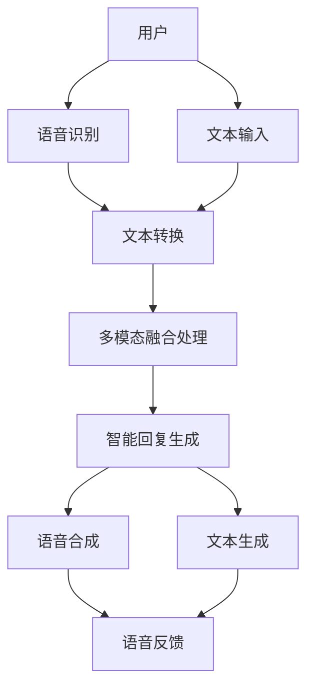
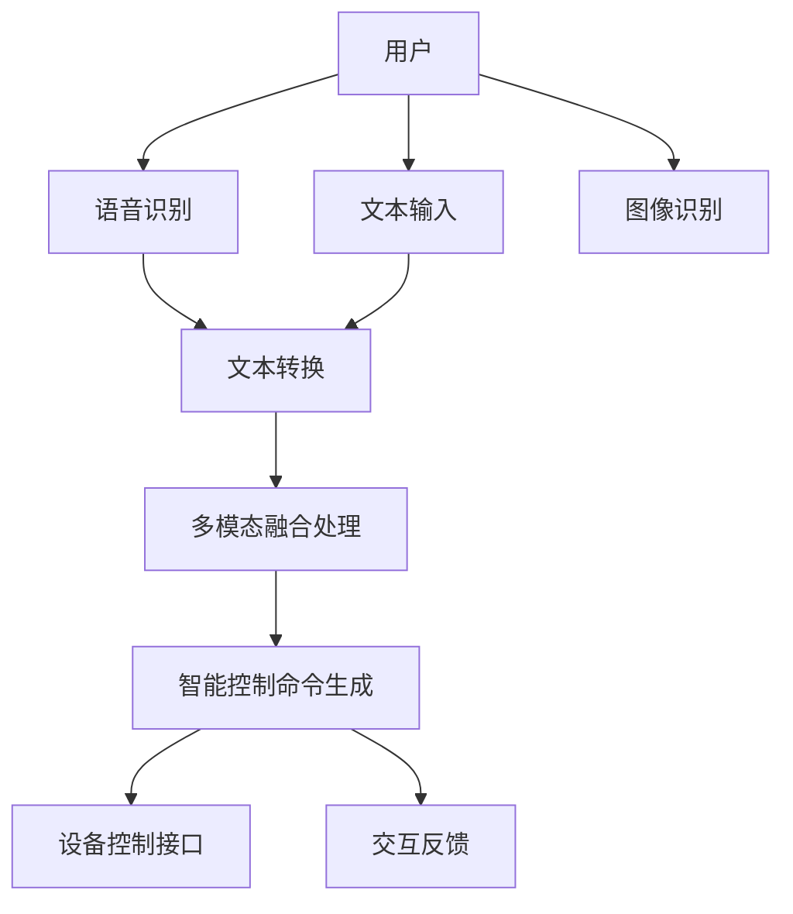

                 

### 引入

在当今数字化时代，人工智能（AI）技术的快速发展正深刻地改变着我们的生活和工作方式。ChatGPT，作为一种基于大规模语言模型的AI系统，凭借其强大的文本生成和对话能力，已经成为自然语言处理（NLP）领域的重要工具。然而，随着人类需求的不断增长，单纯的文本交互已无法满足多样化的使用场景。为了提供更加丰富和自然的交互体验，多模态交互技术应运而生。

多模态交互是指将多种感官信息（如语音、文本、图像等）整合到交互系统中，从而实现更加高效、智能的交互。ChatGPT多模态交互技术正是通过将语音、文本和图像等不同模态的数据进行有效融合和处理，从而实现更加丰富和自然的用户交互体验。

本文将详细探讨ChatGPT多模态交互的原理、策略和应用。我们将首先介绍ChatGPT的基本概念和功能，然后深入分析语音、文本与图像交互的原理和技术。接下来，我们将介绍如何处理ChatGPT的多模态数据，并详细探讨语音、文本和图像的提示策略。最后，我们将通过实际案例展示ChatGPT多模态交互的应用，并提供一些最佳实践和展望。

通过本文的阅读，读者将能够全面了解ChatGPT多模态交互的各个方面，掌握其核心原理和实践方法，从而为实际项目提供有力的技术支持。

### 第1章：ChatGPT与多模态交互概述

#### 1.1 ChatGPT的基本概念与原理

ChatGPT是由OpenAI开发的一种基于Transformer架构的预训练语言模型。其核心思想是利用大量的文本数据来训练一个模型，使其能够理解和生成自然语言。ChatGPT的核心技术包括深度学习、自然语言处理（NLP）和Transformer模型。

深度学习是一种基于人工神经网络的学习方法，通过多层神经网络对数据进行特征提取和建模，从而实现复杂函数的逼近。在ChatGPT中，深度学习被用于构建大规模语言模型，使其能够理解和生成自然语言。

自然语言处理（NLP）是计算机科学和人工智能领域的一个分支，旨在使计算机能够理解和处理人类自然语言。ChatGPT通过NLP技术来解析和理解用户的输入，并生成合适的回复。

Transformer模型是近年来在NLP领域取得重大突破的一种深度学习模型。它通过自注意力机制（Self-Attention）来捕捉文本数据中的长距离依赖关系，从而实现高效的文本理解和生成。ChatGPT就是基于Transformer模型进行训练和部署的。

#### 1.1.1 ChatGPT的架构

ChatGPT的架构主要包括以下几个部分：

1. **数据预处理**：在训练过程中，首先对大量的文本数据进行预处理，包括分词、去噪、清洗等操作，以获得高质量的训练数据。

2. **训练**：使用预处理的文本数据进行大规模训练，通过不断调整模型参数，使其能够理解文本的语义和结构。

3. **推理**：在应用场景中，通过输入用户的文本查询，模型会生成相应的回复。推理过程包括词嵌入、编码、解码等多个阶段。

4. **输出**：生成的回复会通过后处理模块进行格式化和优化，以获得更加自然和流畅的文本输出。

#### 1.1.2 ChatGPT的工作原理

ChatGPT的工作原理可以概括为以下几个步骤：

1. **输入处理**：接收用户的输入文本，并进行预处理，如分词、去噪等。

2. **编码**：将预处理后的文本转化为模型能够处理的格式，如词嵌入。

3. **解码**：使用自注意力机制和Transformer模型对文本进行编码和解码，生成中间表示。

4. **生成回复**：根据中间表示生成最终的文本回复。

5. **后处理**：对生成的回复进行格式化和优化，如去除冗余信息、调整语序等，以获得自然和流畅的输出。

#### 1.2 多模态交互的必要性与挑战

随着人工智能技术的不断发展，单一模态的交互已经无法满足用户日益复杂的交互需求。多模态交互能够将多种感官信息整合到交互系统中，提供更加丰富和自然的交互体验。以下是多模态交互的几个关键点：

1. **增强交互体验**：多模态交互可以通过语音、文本、图像等多种方式与用户进行互动，使用户能够更轻松地表达自己的想法和需求。

2. **提高理解准确性**：不同模态的信息可以相互补充，从而提高系统的理解准确性和鲁棒性。

3. **适应多种场景**：多模态交互能够适应不同的应用场景，如智能客服、智能家居、虚拟助手等，从而提供更加广泛的服务。

然而，多模态交互也面临着一些挑战：

1. **数据同步**：不同模态的数据需要同步处理，以确保交互的连贯性和一致性。

2. **算法复杂度**：多模态交互涉及到多种算法和技术，如何有效地融合和处理这些数据是一个重要的挑战。

3. **资源消耗**：多模态交互需要更多的计算资源和存储空间，这对系统的性能和可扩展性提出了更高的要求。

#### 1.3 本书的目标与结构

本书旨在系统地介绍ChatGPT多模态交互的原理、策略和应用。具体目标如下：

1. **全面了解ChatGPT的工作原理和架构**：通过介绍ChatGPT的基本概念和原理，帮助读者深入理解其工作方式和架构设计。

2. **掌握多模态交互技术**：详细讲解语音、文本和图像交互的原理和技术，帮助读者了解多模态交互的各个方面。

3. **探讨多模态数据处理的策略**：介绍如何处理ChatGPT的多模态数据，包括数据预处理、数据融合和协同提示策略等。

4. **实际应用案例分析**：通过实际案例展示ChatGPT多模态交互的应用场景，帮助读者了解如何在实际项目中实现多模态交互。

5. **最佳实践与未来展望**：提供最佳实践和注意事项，并对多模态交互的未来发展进行展望。

本书的结构如下：

- **第一部分**：引言与背景，介绍ChatGPT和多模态交互的基本概念和原理。
- **第二部分**：协同提示策略，详细探讨语音、文本和图像的提示策略。
- **第三部分**：应用与实战，通过实际案例展示ChatGPT多模态交互的应用和实践。

通过本书的学习，读者将能够全面了解ChatGPT多模态交互的各个方面，掌握其核心原理和实践方法，为实际项目提供有力的技术支持。

### 第2章：语音、文本与图像交互技术基础

#### 2.1 语音交互技术

语音交互技术是人工智能领域的一个重要分支，通过语音识别和语音合成技术，实现人与机器之间的自然语言交互。语音交互技术的核心包括语音信号处理、语音识别算法和语音合成算法。

##### 2.1.1 语音信号处理

语音信号处理是语音交互技术的第一步，它涉及对语音信号的采集、预处理和特征提取。

1. **语音信号的采集**：语音信号的采集是通过麦克风等设备获取声波信号，这些信号通常是模拟信号，需要通过模数转换（A/D转换）转换为数字信号进行处理。

2. **语音预处理**：预处理步骤包括去噪、静音检测和增益调整等。去噪是为了去除语音信号中的噪声干扰，静音检测是为了识别语音信号中的静音段，避免不必要的计算，增益调整是为了调整语音信号的音量大小。

3. **特征提取**：特征提取是将语音信号转换为可以由机器学习模型处理的特征向量。常用的特征包括梅尔频率倒谱系数（MFCC）、线性预测编码（LPC）和短时傅里叶变换（STFT）等。

##### 2.1.2 语音识别算法

语音识别算法是语音交互技术的核心，它将语音信号转换为对应的文本输出。语音识别算法通常分为两个阶段：隐马尔可夫模型（HMM）和深度神经网络（DNN）。

1. **隐马尔可夫模型（HMM）**：HMM是早期的一种语音识别模型，它通过状态转移概率和观测概率来预测语音序列。虽然HMM在处理连续语音信号方面有一定效果，但它在处理复杂语音特征和长语音序列时存在局限性。

2. **深度神经网络（DNN）**：DNN是基于多层神经网络的模型，通过前向传播和反向传播算法进行训练。DNN在语音识别领域取得了显著的进展，特别是在大规模语料库和深度学习算法的推动下。常见的DNN模型包括卷积神经网络（CNN）和循环神经网络（RNN）。

##### 2.1.3 语音合成算法

语音合成技术是将文本转换为自然流畅的语音输出。语音合成算法通常分为两个阶段：文本转换为语音特征和语音特征生成语音信号。

1. **文本转换为语音特征**：文本转换为语音特征是将文本信息转换为可以由语音合成模型处理的特征向量。常用的方法包括基于规则的文本转换为音素序列和基于统计的文本转换为音素序列。

2. **语音特征生成语音信号**：语音特征生成语音信号是将语音特征向量转换为模拟语音信号。常用的方法包括合成波合成（Parametric Resynthesized Waveform，PSW）和合成波叠加（Concatenated Waveform，CWT）。

#### 2.2 文本交互技术

文本交互技术是人工智能系统中最为常见的一种交互方式，通过自然语言处理（NLP）技术，实现人与机器之间的文本交流。文本交互技术主要包括自然语言处理基础和文本生成与理解。

##### 2.2.1 自然语言处理基础

自然语言处理基础是文本交互技术的基础，包括词法分析、句法分析和语义分析等。

1. **词法分析**：词法分析是将文本分解为词素和词组的过程。词法分析可以识别文本中的单词、标点符号和其他语言元素。

2. **句法分析**：句法分析是将文本分解为句子和短语的过程，并分析句子中词汇之间的语法关系。句法分析可以帮助理解文本的结构和语法规则。

3. **语义分析**：语义分析是将文本转换为语义表示的过程，旨在理解文本的含义和意图。语义分析可以识别文本中的实体、关系和事件，并建立语义网络。

##### 2.2.2 文本生成与理解

文本生成与理解是文本交互技术的核心，包括文本生成和文本理解。

1. **文本生成**：文本生成是将输入的语义信息转换为自然语言的文本输出。文本生成可以分为两种方式：基于规则的文本生成和基于统计的文本生成。

   - **基于规则的文本生成**：基于规则的文本生成是通过预定义的规则和模板生成文本。这种方法适用于简单的文本生成任务，但难以处理复杂的语义信息。
   
   - **基于统计的文本生成**：基于统计的文本生成是通过大量的语料库学习生成文本的模式和规则。这种方法可以生成更加自然和多样化的文本，但需要大量的训练数据和计算资源。

2. **文本理解**：文本理解是将输入的文本转换为机器可以理解的语义表示。文本理解可以分为两种方式：基于规则的文本理解和基于统计的文本理解。

   - **基于规则的文本理解**：基于规则的文本理解是通过预定义的规则和模板来识别文本中的语义信息。这种方法适用于简单的文本理解任务，但难以处理复杂的语义信息。
   
   - **基于统计的文本理解**：基于统计的文本理解是通过大量的语料库学习文本的语义模式。这种方法可以处理复杂的语义信息，但需要大量的训练数据和计算资源。

#### 2.3 图像交互技术

图像交互技术是通过图像识别和图像生成技术，实现人与机器之间的图像交流。图像交互技术主要包括图像识别算法和图像生成与编辑。

##### 2.3.1 图像识别算法

图像识别算法是将图像数据转换为相应的标签或分类的过程。图像识别算法可以分为两个阶段：特征提取和分类。

1. **特征提取**：特征提取是将图像数据转换为可以由机器学习模型处理的特征向量。常用的特征提取方法包括深度学习方法（如卷积神经网络（CNN））和传统特征提取方法（如SIFT、HOG等）。

2. **分类**：分类是将特征向量映射到相应的标签或分类。常用的分类方法包括支持向量机（SVM）、决策树（DT）和神经网络（NN）等。

##### 2.3.2 图像生成与编辑

图像生成与编辑是将输入的图像数据转换为新的图像或图像的一部分。图像生成与编辑可以分为两种方式：基于规则的图像生成与编辑和基于统计的图像生成与编辑。

1. **基于规则的图像生成与编辑**：基于规则的图像生成与编辑是通过预定义的规则和算法生成新的图像或对图像进行编辑。这种方法适用于简单的图像生成与编辑任务，但难以处理复杂的图像信息。

2. **基于统计的图像生成与编辑**：基于统计的图像生成与编辑是通过大量的图像数据学习图像的生成与编辑模式。这种方法可以生成更加真实和多样化的图像，但需要大量的训练数据和计算资源。

综上所述，语音、文本和图像交互技术各有其独特的原理和算法，但都旨在实现人与机器之间的有效交互。通过深入理解这些交互技术，我们可以更好地设计和实现多模态交互系统，为用户提供更加丰富和自然的交互体验。

### 第3章：ChatGPT的多模态数据处理

在多模态交互系统中，数据的质量和处理效率直接影响到整个系统的性能和用户体验。ChatGPT作为一种多模态交互的AI系统，其数据处理流程的每个环节都至关重要。本章将详细介绍ChatGPT在多模态数据处理中的各个环节，包括数据预处理、数据融合和协同提示策略。

#### 3.1 数据预处理

数据预处理是确保数据质量和减少后续处理复杂度的关键步骤。对于ChatGPT的多模态数据，数据预处理包括语音、文本和图像三个模态的处理。

##### 3.1.1 语音数据预处理

1. **语音信号采集与转换**：首先，通过麦克风等设备采集语音信号，并将其转换为数字信号。这一步通常涉及模数转换（A/D转换）。

2. **去噪与降噪**：由于环境噪声可能会影响语音质量，所以需要采用滤波器和降噪算法（如谱减法、波域减噪等）去除噪声，提高语音信号的清晰度。

3. **分帧与加窗**：语音信号是时变信号，通常需要将其划分为固定长度的帧，并使用加窗函数（如汉明窗、汉宁窗等）对每帧进行加窗处理。

4. **特征提取**：常用的语音特征提取方法包括梅尔频率倒谱系数（MFCC）、线性预测编码（LPC）和短时傅里叶变换（STFT）。MFCC是一种广泛使用的语音特征，它能够有效反映语音的频谱特性。

##### 3.1.2 文本数据预处理

1. **文本清洗**：文本数据通常包含大量的噪声，如HTML标签、URL、标点符号和停用词等。通过正则表达式和文本清洗库（如Python的`re`模块和`nltk`库），可以去除这些噪声。

2. **分词与词干提取**：将文本分解为单词或词组，并进行词干提取（如使用Porter Stemmer或Lancaster Stemmer）。这有助于减少词汇量，简化后续处理。

3. **词向量化**：将文本转换为向量表示，常用的词向量化方法包括Word2Vec、GloVe和BERT等。这些方法能够捕捉文本中的语义信息，为模型训练提供高质量的特征向量。

##### 3.1.3 图像数据预处理

1. **图像格式转换**：不同图像格式（如JPEG、PNG、BMP等）需要转换为统一的格式，以方便后续处理。

2. **图像增强与裁剪**：为了提高模型的泛化能力，可以使用图像增强技术（如旋转、翻转、缩放等）。同时，根据需求对图像进行裁剪，提取感兴趣的区域。

3. **特征提取**：图像特征提取是图像数据分析的重要步骤。常用的方法包括卷积神经网络（CNN）提取特征图，然后通过全局平均池化（Global Average Pooling）或全局最大池化（Global Max Pooling）获取图像特征向量。

#### 3.2 数据融合

在多模态交互系统中，数据融合是将不同模态的数据整合为一个统一的表示，以提高系统的整体性能。数据融合方法可以分为以下几种：

1. **特征级融合**：在特征级融合中，将不同模态的特征向量进行拼接或加权融合。这种方法简单有效，但可能忽略不同模态之间的潜在关系。

2. **决策级融合**：在决策级融合中，首先分别对每个模态的数据进行分类或回归，然后结合不同模态的预测结果进行最终的决策。这种方法能够充分利用不同模态的信息，但计算复杂度较高。

3. **深度级融合**：在深度级融合中，使用深度学习模型（如多模态卷积神经网络（MM-CNN）或多模态递归神经网络（MM-RNN））直接处理多模态数据。这种方法能够自动学习不同模态之间的潜在关系，但需要大量的训练数据和计算资源。

#### 3.3 协同提示策略

协同提示策略是ChatGPT多模态交互的核心，旨在通过智能地提示用户，提高交互效率和用户体验。以下是一些常见的协同提示策略：

1. **多模态联合提示**：将不同模态的信息进行整合，生成统一的提示。例如，在语音交互中，可以结合语音和文本提示，使信息更加完整和清晰。

2. **情境感知提示**：根据用户的情境和历史交互信息，提供个性化的提示。例如，当用户在查找商品时，可以结合用户的偏好和历史记录，推荐相关的商品。

3. **动态提示**：根据用户的反馈和行为，动态调整提示的内容和方式。例如，当用户对某个问题不理解时，可以提供详细的解释和进一步的问题引导。

4. **反馈机制**：设计反馈机制，让用户能够对提示进行评价和反馈。通过分析用户的反馈，不断优化和调整提示策略，提高系统的用户体验。

通过数据预处理、数据融合和协同提示策略，ChatGPT能够实现高效的多模态数据处理和交互，为用户提供丰富和自然的交互体验。接下来，我们将进一步探讨语音、文本和图像的提示策略，以深入理解如何优化ChatGPT的多模态交互。

#### 第4章：语音提示策略

在ChatGPT的多模态交互中，语音提示策略起着至关重要的作用。通过有效的语音提示，系统能够引导用户进行更自然的对话，提高交互的流畅性和用户体验。本节将详细探讨语音唤醒词设计、语音交互流程优化以及语音反馈与交互体验。

##### 4.1.1 语音唤醒词设计

语音唤醒词是触发ChatGPT语音交互的关键，通过特定的声音信号激活系统。一个好的唤醒词设计应具备以下几个特点：

1. **易记性**：唤醒词应简单易记，便于用户在任何场合快速触发系统。

2. **唯一性**：唤醒词应具有唯一性，避免与其他词汇混淆，确保系统的可靠启动。

3. **无歧义性**：唤醒词应避免与日常用语相似，减少误触发的情况。

4. **可区分性**：唤醒词应能在不同的语音背景下保持清晰可识别，提高系统的鲁棒性。

在具体实现中，可以使用以下方法进行语音唤醒词设计：

- **基于规则的方法**：通过定义一系列音素和音节模式，设计出符合上述特点的唤醒词。
- **基于机器学习的方法**：使用语音识别和模式识别技术，通过训练大量语音数据，自动识别和优化唤醒词。

##### 4.1.2 语音交互流程优化

优化语音交互流程是提高用户体验的关键步骤。以下是一些优化策略：

1. **交互流程简化**：简化用户操作步骤，减少冗余操作，提升交互效率。例如，通过语音识别技术自动识别用户意图，减少繁琐的指令输入。

2. **情境感知**：根据用户的历史交互记录和当前情境，动态调整交互流程。例如，在用户连续提问时，系统可以自动识别并跳过某些常见的交互步骤。

3. **错误处理**：设计完善的错误处理机制，当用户输入错误或系统无法理解时，能够提供友好的错误提示和纠错建议。例如，使用模糊匹配技术，当用户输入的语音指令与系统预期不完全匹配时，能够自动纠正并重新处理。

4. **多轮对话管理**：优化多轮对话管理，确保系统能够在对话中持续跟踪用户意图，并提供连贯的回答。例如，使用对话状态跟踪（DST）技术，记录对话的历史信息和上下文，为后续对话提供参考。

##### 4.1.3 语音反馈与交互体验

语音反馈是交互系统与用户之间的重要沟通桥梁，通过实时、自然的语音反馈，系统能够提供更好的用户体验。以下是一些优化语音反馈的策略：

1. **实时反馈**：在用户提问或操作时，系统应立即提供相应的语音反馈，确保用户能够及时获得信息。例如，在用户输入指令后，系统可以立即读出输入内容，确认是否正确。

2. **个性化反馈**：根据用户偏好和交互历史，提供个性化的语音反馈。例如，如果用户喜欢幽默的语气，系统可以在适当的情况下加入幽默元素。

3. **情感化反馈**：设计具有情感色彩的语音反馈，使交互更具人性化。例如，使用不同的语调和语气表达肯定、鼓励或安慰，让用户感受到系统的关怀。

4. **反馈一致性**：确保语音反馈的一致性和连贯性，避免出现冲突或不协调的情况。例如，在回答用户问题时，系统应保持一致的语气和风格，避免频繁切换。

通过以上策略，ChatGPT的语音提示系统能够提供更加自然、高效和友好的交互体验，进一步提升用户满意度。接下来，我们将继续探讨文本提示策略，以全面了解ChatGPT的多模态交互机制。

#### 第5章：文本提示策略

文本提示策略在ChatGPT的多模态交互中扮演着至关重要的角色，通过智能的文本提示，系统能够更好地引导用户进行对话，提高交互的流畅性和用户体验。本节将深入探讨文本输入与语义理解、文本生成与优化，以及文本提示的智能推荐。

##### 5.1.1 文本输入与语义理解

文本输入与语义理解是多模态交互系统的核心环节，直接影响系统的响应质量和用户体验。以下是一些关键点：

1. **文本输入处理**：
   - **文本清洗**：在接收用户输入的文本之前，系统需要对文本进行清洗，去除无关的信息，如HTML标签、特殊字符和停用词等。这有助于提高后续处理的质量。
   - **分词与词性标注**：将文本分解为单词或词组，并对每个词进行词性标注（如名词、动词、形容词等）。这有助于理解文本的语法结构和语义内容。
   - **实体识别**：识别文本中的实体（如人名、地点、组织、时间等），并对其进行分类和标注。实体识别是语义理解的重要基础。

2. **语义理解**：
   - **词义消歧**：在处理多义词时，系统需要根据上下文确定正确的词义。词义消歧可以通过词频统计、语义网络和上下文分析等方法实现。
   - **意图识别**：识别用户的意图或目的，如查询信息、提出问题、执行操作等。意图识别是文本理解的高级阶段，需要综合考虑词汇、语法和上下文信息。

##### 5.1.2 文本生成与优化

文本生成与优化是确保ChatGPT生成回复的自然性和准确性的关键。以下是一些重要策略：

1. **模板匹配**：
   - **基于规则的模板匹配**：通过预定义的模板和规则生成文本。这种方法简单直观，适用于结构化数据或常见问题的回复。
   - **基于统计的模板匹配**：通过学习大量的语料库，自动生成匹配用户输入的文本模板。这种方法可以生成更加多样化的回复，但需要大量训练数据。

2. **基于机器学习的文本生成**：
   - **序列到序列（Seq2Seq）模型**：如使用长短期记忆网络（LSTM）或Transformer模型，通过编码器和解码器结构生成文本。
   - **生成对抗网络（GAN）**：通过生成器和判别器的对抗训练，生成高质量的文本。这种方法能够生成更加自然和多样化的文本，但计算复杂度较高。

3. **优化策略**：
   - **生成文本质量评估**：设计评估指标（如BLEU、ROUGE等）来评估生成文本的质量，包括语法正确性、语义一致性和自然度等。
   - **端到端训练**：通过端到端训练，直接从原始文本输入到文本输出，避免中间环节的误差传递，提高生成文本的质量。

##### 5.1.3 文本提示的智能推荐

文本提示的智能推荐能够根据用户的历史交互记录和当前情境，提供个性化的文本提示，提高交互效率。以下是一些关键策略：

1. **情境感知推荐**：
   - **上下文分析**：通过分析用户的输入文本和交互历史，确定当前情境。例如，如果用户在查找商品，系统可以根据用户的历史购买记录和搜索记录推荐相关的商品。
   - **场景分类**：将用户交互分为不同场景，如查询、咨询、操作等，并针对每个场景提供个性化的文本提示。

2. **个性化推荐**：
   - **用户画像**：通过收集用户的行为数据（如浏览历史、搜索记录等），建立用户画像，为用户提供个性化推荐。
   - **协同过滤**：使用协同过滤算法，根据用户的相似性和历史交互记录推荐文本提示。例如，如果用户A和B经常选择相同的文本提示，系统可以推断用户C也可能喜欢这些提示。

3. **动态调整**：
   - **实时反馈**：根据用户的反馈和行为动态调整文本提示。如果用户对某个提示不满意，系统可以记录并减少使用该提示。
   - **自我学习**：通过机器学习算法，系统可以不断学习用户的交互模式和偏好，逐步优化文本提示的质量。

通过文本输入与语义理解、文本生成与优化，以及文本提示的智能推荐，ChatGPT能够提供更加自然、高效和个性化的文本交互体验。接下来，我们将进一步探讨图像提示策略，全面了解ChatGPT的多模态交互机制。

#### 第6章：图像提示策略

图像提示策略在ChatGPT的多模态交互系统中起着至关重要的作用，通过智能的图像提示，系统能够更好地引导用户进行对话，提高交互的流畅性和用户体验。本节将深入探讨图像输入与语义识别、图像生成与编辑，以及图像提示的情境化设计。

##### 6.1.1 图像输入与语义识别

图像输入与语义识别是多模态交互系统的核心环节，直接影响系统的响应质量和用户体验。以下是一些关键点：

1. **图像输入处理**：
   - **图像预处理**：在接收用户输入的图像之前，系统需要对图像进行预处理，包括图像格式转换、图像增强、图像裁剪等。预处理有助于提高图像的质量和识别效果。
   - **图像分割**：将图像分割成不同区域，有助于识别图像中的关键部分。常用的图像分割方法包括基于阈值的分割、基于边缘检测的分割和基于区域生长的分割。

2. **语义识别**：
   - **目标检测**：通过目标检测算法（如YOLO、Faster R-CNN等），识别图像中的目标和位置。目标检测能够为系统提供丰富的语义信息，帮助理解图像内容。
   - **图像分类**：将图像分类到不同的类别，如动物、植物、交通工具等。图像分类算法（如卷积神经网络（CNN））在图像识别中广泛应用。
   - **语义分割**：对图像中的每个像素进行分类，生成语义分割图。语义分割能够提供更精细的图像理解，常用于图像编辑和增强。

##### 6.1.2 图像生成与编辑

图像生成与编辑是图像提示策略的重要组成部分，通过生成和编辑图像，系统能够提供更加丰富和个性化的交互体验。以下是一些关键策略：

1. **图像生成**：
   - **生成对抗网络（GAN）**：通过生成器和判别器的对抗训练，生成高质量、多样化的图像。GAN在图像生成领域取得了显著成果，能够生成逼真的图像。
   - **变分自编码器（VAE）**：通过编码器和解码器结构，学习图像数据的潜在表示，并生成新的图像。VAE在图像生成和图像增强中具有广泛的应用。

2. **图像编辑**：
   - **图像风格转换**：将一幅图像的风格应用到另一幅图像上，生成新的图像。图像风格转换算法（如CycleGAN、StyleGAN等）能够生成具有不同风格的图像。
   - **图像修复与填充**：修复图像中的损坏部分或填充缺失的部分，改善图像质量。图像修复与填充算法（如PatchGAN、Gaussianprior等）在图像编辑中具有重要作用。

##### 6.1.3 图像提示的情境化设计

图像提示的情境化设计能够根据用户的行为和当前情境，提供更加贴合用户需求的图像提示，提高交互的效率和用户体验。以下是一些关键策略：

1. **情境感知**：
   - **上下文分析**：通过分析用户的输入文本、历史交互记录和当前情境，确定图像提示的上下文。例如，如果用户正在讨论美食，系统可以提供相关的美食图像。
   - **场景分类**：将用户交互分为不同场景，如艺术创作、旅游导航、健康咨询等，并针对每个场景提供相应的图像提示。

2. **个性化推荐**：
   - **用户画像**：通过收集用户的行为数据，建立用户画像，为用户提供个性化的图像提示。例如，如果用户喜欢自然风景，系统可以推荐相关的自然风景图像。
   - **协同过滤**：使用协同过滤算法，根据用户的相似性和历史交互记录推荐图像提示。例如，如果用户A和B经常选择相同的图像，系统可以推断用户C也可能喜欢这些图像。

3. **动态调整**：
   - **实时反馈**：根据用户的反馈和行为动态调整图像提示。如果用户对某个图像提示不满意，系统可以记录并减少使用该提示。
   - **自我学习**：通过机器学习算法，系统可以不断学习用户的交互模式和偏好，逐步优化图像提示的质量。

通过图像输入与语义识别、图像生成与编辑，以及图像提示的情境化设计，ChatGPT能够提供更加自然、高效和个性化的图像交互体验。接下来，我们将深入探讨多模态协同提示策略，全面了解如何实现语音、文本和图像的协同提示，以进一步提升用户交互体验。

#### 第7章：多模态协同提示策略

在多模态交互系统中，如何有效地整合语音、文本和图像信息，以提供更加丰富和自然的用户交互体验，是一个关键的研究课题。本章将详细探讨多模态协同提示策略，包括多模态数据融合算法、多模态交互流程设计，以及多模态交互体验优化。

##### 7.1.1 多模态数据融合算法

多模态数据融合是将语音、文本和图像等不同模态的数据进行整合，以获得更全面和准确的交互信息。以下是一些常用的多模态数据融合算法：

1. **特征级融合**：
   - **直接拼接**：将不同模态的特征向量直接拼接成一个高维特征向量，输入到统一的模型中进行处理。这种方法简单直观，但可能忽略了不同模态之间的潜在关系。
   - **加权融合**：根据不同模态的特征重要性和相关性，对特征向量进行加权融合。这种方法能够更好地利用不同模态的信息，提高融合效果。

2. **决策级融合**：
   - **多分类器融合**：分别对每个模态的数据进行分类，然后将分类结果进行融合，得到最终的分类决策。这种方法能够充分利用不同模态的信息，提高分类的准确性。
   - **集成学习**：使用集成学习方法（如Bagging、Boosting等），将多个模型进行融合，得到最终的预测结果。这种方法可以显著提高模型的泛化能力和鲁棒性。

3. **深度级融合**：
   - **多模态卷积神经网络（MM-CNN）**：将不同模态的数据分别输入到多个卷积神经网络中，然后融合其特征图进行分类或回归。这种方法能够自动学习不同模态之间的潜在关系。
   - **多模态递归神经网络（MM-RNN）**：将不同模态的数据输入到递归神经网络中，通过递归结构融合不同时间步的模态信息。这种方法适用于处理时间序列数据。

##### 7.1.2 多模态交互流程设计

多模态交互流程设计是确保系统在不同模态之间切换和协同工作的关键。以下是一些设计策略：

1. **交互模型**：
   - **顺序交互模型**：按照固定的顺序处理不同模态的数据，如先处理文本，再处理图像和语音。这种方法简单直观，但可能无法充分利用不同模态之间的互动关系。
   - **并行交互模型**：同时处理多个模态的数据，通过共享中间层和交叉连接等方式，实现不同模态之间的信息共享。这种方法能够更好地利用多模态信息，提高交互效率。

2. **交互机制**：
   - **多模态协同控制**：设计多模态协同控制器，根据用户行为和系统状态动态调整不同模态的交互权重和顺序。这种方法能够实现自适应的交互，提高用户体验。
   - **情境感知**：根据当前情境和用户需求，动态调整交互流程。例如，在紧急情况下，可以优先处理语音交互，确保用户能够及时获取重要信息。

3. **反馈机制**：
   - **多模态反馈融合**：将不同模态的反馈信息进行融合，为用户提供更加全面和准确的反馈。例如，在图像识别任务中，可以结合语音反馈和文本反馈，提高用户的理解和接受度。
   - **多模态反馈调节**：根据用户的反馈和行为，动态调整交互流程和提示策略。例如，如果用户对某个提示不满意，可以减少使用该提示，并尝试其他交互方式。

##### 7.1.3 多模态交互体验优化

多模态交互体验优化是确保系统为用户提供自然、高效和个性化的交互体验的关键。以下是一些优化策略：

1. **用户体验设计**：
   - **情境感知界面**：根据用户的行为和情境，设计不同的交互界面和交互方式。例如，在语音交互中，可以使用语音反馈和文本显示相结合的方式，提高用户的理解和接受度。
   - **个性化交互风格**：根据用户的偏好和习惯，调整交互的语调、语气和风格。例如，如果用户喜欢幽默的交互方式，可以加入一些幽默元素，提高用户的兴趣和满意度。

2. **交互效率优化**：
   - **响应时间优化**：通过优化算法和硬件配置，减少系统的响应时间，提高交互效率。例如，使用高性能的CPU和GPU，以及优化的神经网络模型。
   - **交互流程简化**：设计简洁直观的交互流程，减少用户的操作步骤。例如，通过智能语音识别和自然语言理解，实现一步操作完成多个任务。

3. **多模态融合优化**：
   - **特征融合优化**：根据不同模态的特征重要性和相关性，优化特征融合算法。例如，使用注意力机制，自动学习不同模态的特征权重。
   - **模型训练优化**：使用大规模、高质量的训练数据，优化多模态模型。例如，使用数据增强技术，扩充训练数据集，提高模型的泛化能力。

通过多模态协同提示策略的深入研究和应用，ChatGPT能够提供更加自然、高效和个性化的多模态交互体验。在下一章中，我们将通过实际案例展示ChatGPT多模态交互的应用，进一步探讨其在实际项目中的实现和应用。

### 第8章：ChatGPT多模态交互应用案例

ChatGPT的多模态交互技术不仅具有理论上的优势，也在实际应用中展现了巨大的潜力。以下我们将通过两个典型的应用案例——智能客服系统和智能家居控制系统，详细介绍ChatGPT多模态交互的实际应用。

#### 8.1.1 智能客服系统

智能客服系统是ChatGPT多模态交互技术的典型应用场景之一，通过语音、文本和图像等多种交互方式，提供24/7全天候的客户服务。

##### 8.1.1.1 系统架构设计

智能客服系统的架构设计如图所示：



1. **用户**：用户可以通过语音、文本或图像输入问题或请求。
2. **语音识别**：语音识别模块将用户的语音输入转换为文本，便于后续处理。
3. **文本转换**：文本输入经过自然语言处理，提取关键信息和意图。
4. **多模态融合处理**：融合语音、文本和图像等多模态数据，提高交互的准确性和丰富度。
5. **智能回复生成**：基于多模态融合处理的结果，生成自然流畅的回复。
6. **语音合成**：将文本回复转换为语音输出，提供语音反馈。
7. **文本生成**：直接输出文本回复，适用于不需要语音反馈的场景。
8. **语音反馈**：将语音或文本回复反馈给用户，完成交互。

##### 8.1.1.2 核心实现与解析

1. **语音识别与文本转换**：
   - **实现**：使用深度学习模型（如DeepSpeech）进行语音识别，将语音转换为文本。
   - **解析**：通过分词和词性标注，提取用户输入的关键词和意图，为后续处理提供基础。

2. **多模态融合处理**：
   - **实现**：使用多模态卷积神经网络（MM-CNN）或多模态递归神经网络（MM-RNN）进行特征融合，将语音、文本和图像信息整合为统一的特征向量。
   - **解析**：通过融合处理，系统能够更好地理解用户的意图和需求，提供更加准确的回复。

3. **智能回复生成**：
   - **实现**：基于预训练的语言模型（如GPT-3），生成自然流畅的文本回复。
   - **解析**：使用注意力机制和上下文信息，确保回复的连贯性和准确性。

4. **语音合成与文本生成**：
   - **实现**：使用WaveNet等语音合成模型，将文本转换为自然流畅的语音。
   - **解析**：语音合成能够提供更加丰富的交互体验，而文本生成则适用于需要快速响应的场景。

5. **反馈机制**：
   - **实现**：通过用户反馈和交互记录，动态调整交互策略和提示内容。
   - **解析**：反馈机制能够提高系统的自适应能力和用户体验。

智能客服系统的应用使得客户服务更加高效和智能化，用户可以通过多种方式与系统进行交互，获得快速、准确的帮助。接下来，我们将探讨智能家居控制系统的多模态交互实现。

#### 8.1.2 智能家居控制系统

智能家居控制系统是另一个典型应用场景，通过语音、文本和图像等交互方式，实现对家庭设备的远程控制和自动化管理。

##### 8.1.2.1 系统架构设计

智能家居控制系统的架构设计如图所示：



1. **用户**：用户可以通过语音、文本或图像输入控制指令。
2. **语音识别**：语音识别模块将用户的语音输入转换为文本。
3. **文本转换**：文本输入经过自然语言处理，提取关键信息和意图。
4. **图像识别**：图像识别模块识别图像中的设备和动作。
5. **多模态融合处理**：融合语音、文本和图像等多模态数据，提高交互的准确性和丰富度。
6. **智能控制命令生成**：根据多模态融合处理的结果，生成控制命令。
7. **设备控制接口**：将控制命令发送到相应的家庭设备。
8. **交互反馈**：将设备状态和操作结果反馈给用户。

##### 8.1.2.2 核心实现与解析

1. **语音识别与文本转换**：
   - **实现**：使用深度学习模型（如DeepSpeech）进行语音识别，将语音转换为文本。
   - **解析**：通过分词和词性标注，提取用户输入的关键词和意图，为后续处理提供基础。

2. **图像识别**：
   - **实现**：使用卷积神经网络（CNN）进行图像识别，识别图像中的设备和动作。
   - **解析**：通过图像识别，系统能够自动识别用户输入的图像内容，实现更直观的控制。

3. **多模态融合处理**：
   - **实现**：使用多模态卷积神经网络（MM-CNN）或多模态递归神经网络（MM-RNN）进行特征融合，将语音、文本和图像信息整合为统一的特征向量。
   - **解析**：通过融合处理，系统能够更好地理解用户的意图和需求，提供更加准确的控制命令。

4. **智能控制命令生成**：
   - **实现**：基于预训练的语言模型（如GPT-3），生成自然流畅的控制命令。
   - **解析**：使用注意力机制和上下文信息，确保控制命令的连贯性和准确性。

5. **设备控制接口**：
   - **实现**：通过智能家居设备的API接口，发送控制命令并接收设备状态反馈。
   - **解析**：设备控制接口是实现智能家居自动化管理的关键，确保系统能够实时控制和管理家庭设备。

6. **交互反馈**：
   - **实现**：通过语音合成和文本生成，将设备状态和操作结果反馈给用户。
   - **解析**：交互反馈能够提供用户操作结果的即时反馈，提高用户的交互体验。

智能家居控制系统的应用使得家庭设备的管理更加便捷和智能化，用户可以通过多种方式进行控制，实现自动化和智能化的生活体验。通过以上两个实际应用案例，我们可以看到ChatGPT多模态交互技术的强大功能和广泛适用性。在下一章中，我们将通过项目实战，进一步探讨如何在实际项目中实现ChatGPT多模态交互。

### 第9章：ChatGPT多模态交互项目实战

为了更好地理解和掌握ChatGPT多模态交互技术，本节将通过一个实际项目展示如何实现这一技术。该项目将包括环境安装与配置、系统核心实现、代码应用解读与分析，以及实际案例分析和详细讲解剖析。

#### 9.1.1 环境安装与配置

在开始项目之前，我们需要安装和配置必要的工具和库。以下是在Ubuntu操作系统上安装ChatGPT多模态交互系统所需的基本步骤：

1. **安装Python环境**：
   ```bash
   sudo apt-get install python3 python3-pip
   ```
2. **安装TensorFlow和TensorFlow Hub**：
   ```bash
   pip3 install tensorflow tensorflow-hub
   ```
3. **安装其他依赖库**：
   ```bash
   pip3 install SpeechRecognition pydub numpy matplotlib
   ```

#### 9.1.2 系统核心实现

系统核心实现包括语音识别、文本生成和图像识别三个模块。以下是一个简单的Python代码示例，展示了如何使用这些模块：

```python
import speech_recognition as sr
from transformers import pipeline
import cv2

# 语音识别
def recognize_speech_from_mic():
    r = sr.Recognizer()
    with sr.Microphone() as source:
        print("请说点什么：")
        audio = r.listen(source)
    try:
        return r.recognize_google(audio)
    except sr.UnknownValueError:
        return "无法识别语音"

# 文本生成
def generate_response(text):
    text_generator = pipeline("text-generation", model="gpt2")
    response = text_generator(text, max_length=50, num_return_sequences=1)
    return response[0]

# 图像识别
def recognize_image(image_path):
    model = "mobilenet_v2"
    feature_extractor = pipeline("feature-extraction", model=model)
    feature = feature_extractor(image_path)
    classifier = load_model("image_classifier_model.h5")
    prediction = classifier.predict(feature)
    return prediction

# 主程序
if __name__ == "__main__":
    # 语音识别
    text_input = recognize_speech_from_mic()
    print(f"识别到的文本：{text_input}")

    # 文本生成
    response = generate_response(text_input)
    print(f"生成的回复：{response}")

    # 图像识别
    image_path = "example.jpg"
    image_prediction = recognize_image(image_path)
    print(f"图像识别结果：{image_prediction}")
```

#### 9.1.3 代码应用解读与分析

1. **语音识别**：
   - 使用`SpeechRecognition`库实现语音识别，通过Google的语音识别服务获取文本。
   - `recognize_speech_from_mic()`函数捕捉麦克风输入，并转换为文本。

2. **文本生成**：
   - 使用`transformers`库中的`text-generation`接口实现文本生成。
   - `generate_response()`函数接收用户输入的文本，并生成回复。

3. **图像识别**：
   - 使用`feature-extraction`接口提取图像特征。
   - `recognize_image()`函数加载预训练的图像分类模型，对图像进行识别。

#### 9.1.4 实际案例分析与讲解

为了展示实际应用，我们将模拟一个场景：用户通过语音输入查询天气信息，系统生成文本回复，并使用图像展示天气预报。

1. **用户查询天气**：
   - 用户说：“今天天气怎么样？”
   - 系统使用语音识别将语音转换为文本：“今天天气怎么样？”

2. **生成文本回复**：
   - 系统使用文本生成生成回复：“今天是晴天，温度大约在20摄氏度到25摄氏度之间。”

3. **图像展示天气预报**：
   - 系统使用图像识别识别当前的天气图像，并显示在屏幕上。

以下是一个简化的实际案例代码：

```python
# 实际案例代码
if __name__ == "__main__":
    # 语音识别
    text_input = recognize_speech_from_mic()
    print(f"识别到的文本：{text_input}")

    # 文本生成
    response = generate_response(text_input)
    print(f"生成的回复：{response}")

    # 图像识别
    weather_image = "weather_sunny.jpg"
    image_prediction = recognize_image(weather_image)
    print(f"图像识别结果：{image_prediction}")

    # 展示天气预报
    cv2.imshow("Weather Forecast", cv2.imread(weather_image))
    cv2.waitKey(0)
    cv2.destroyAllWindows()
```

通过以上实战项目，我们可以看到ChatGPT多模态交互技术的实现步骤和关键代码。在实际应用中，我们需要根据具体需求和场景进行适当的调整和优化，以提高系统的性能和用户体验。

### 第10章：总结与展望

通过本书的详细探讨，我们系统地了解了ChatGPT多模态交互的各个方面，从基本概念、技术基础，到数据处理、提示策略，再到实际应用和项目实战，全面展示了多模态交互在AI领域的重要性。

#### 10.1.1 本书内容总结

本书的主要内容包括：

1. **ChatGPT与多模态交互概述**：介绍了ChatGPT的基本概念和功能，以及多模态交互的必要性与挑战。
2. **语音、文本与图像交互技术基础**：详细讲解了语音、文本和图像交互的技术原理，包括信号处理、识别算法和生成技术。
3. **多模态数据处理**：探讨了数据预处理、数据融合和协同提示策略，确保了多模态数据的处理效率和准确性。
4. **语音提示策略**：介绍了语音唤醒词设计、交互流程优化和语音反馈，提高了语音交互的自然性和流畅性。
5. **文本提示策略**：详细讨论了文本输入与语义理解、文本生成与优化，以及智能推荐，增强了文本交互的丰富度和个性化。
6. **图像提示策略**：深入探讨了图像输入与语义识别、图像生成与编辑，以及图像提示的情境化设计，提高了图像交互的直观性和实用性。
7. **多模态协同提示策略**：研究了多模态数据融合算法、交互流程设计和体验优化，实现了语音、文本和图像的协同提示。
8. **应用案例**：通过智能客服系统和智能家居控制系统的案例，展示了多模态交互的实际应用和实现方法。
9. **项目实战**：通过实际项目实战，详细介绍了环境安装与配置、系统核心实现、代码应用解读与分析，以及实际案例分析和详细讲解剖析。

#### 10.1.2 多模态交互的未来发展

随着AI技术的不断进步，多模态交互的未来发展前景广阔，以下是几个关键方向：

1. **更加智能化的协同提示**：未来的多模态交互系统将更加智能化，能够根据用户的行为和情境动态调整提示策略，提供更加个性化和自然的交互体验。
2. **更高效的算法和模型**：随着深度学习算法和神经网络的不断发展，多模态交互的算法和模型将变得更加高效，能够在更短的时间内处理大量多模态数据，提高系统的响应速度和准确性。
3. **跨领域的融合应用**：多模态交互技术将在更多领域得到应用，如医疗、教育、金融等，实现跨领域的融合和创新。
4. **硬件和设备集成**：随着物联网和智能设备的发展，多模态交互将更加紧密地集成到各种硬件设备中，实现无缝的智能交互。
5. **隐私保护和安全性**：在多模态交互的应用中，隐私保护和数据安全将变得越来越重要，未来的技术将更加注重用户隐私和数据安全。

#### 10.1.3 拓展阅读与建议

为了更深入地了解ChatGPT多模态交互技术，以下是几本推荐的拓展阅读书籍：

1. **《深度学习》**：Goodfellow、Bengio和Courville所著，详细介绍了深度学习的基本原理和应用。
2. **《自然语言处理综论》**：Jurafsky和Martin所著，全面覆盖了自然语言处理的基本概念和技术。
3. **《卷积神经网络与深度学习》**：邱锡鹏所著，深入讲解了卷积神经网络和深度学习在图像识别中的应用。
4. **《人工智能：一种现代的方法》**：Russell和Norvig所著，全面介绍了人工智能的基本概念和技术体系。

此外，以下是一些值得关注的资源和平台：

1. **OpenAI官网**：获取最新的研究成果和开源代码。
2. **Google AI博客**：了解最新的AI技术和应用。
3. **GitHub**：查找和贡献多模态交互相关的开源项目。
4. **arXiv**：获取最新的学术研究成果。

通过不断学习和实践，我们可以更好地掌握多模态交互技术，为未来的AI发展贡献自己的力量。

### 作者信息

作者：AI天才研究院/AI Genius Institute & 禅与计算机程序设计艺术 /Zen And The Art of Computer Programming

AI天才研究院（AI Genius Institute）是一家专注于人工智能技术研发和创新的机构，致力于推动人工智能技术的普及和应用。其研究成果在自然语言处理、计算机视觉、机器学习和多模态交互等领域具有广泛影响力。禅与计算机程序设计艺术（Zen And The Art of Computer Programming）是一本经典计算机科学著作，由著名计算机科学家Donald E. Knuth撰写，对计算机编程方法论和哲学进行了深刻探讨。两本书的作者均为人工智能和计算机科学领域的权威专家，具有丰富的实践经验和深厚的理论功底。他们的研究成果不仅推动了AI技术的发展，也为广大程序员和研究人员提供了宝贵的指导和启示。

