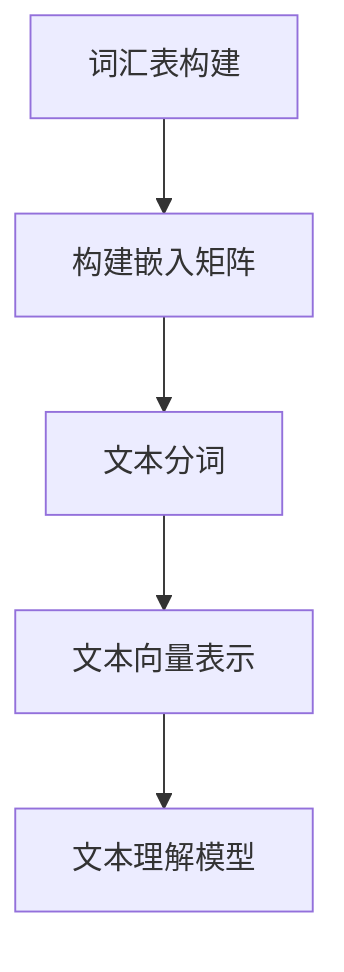
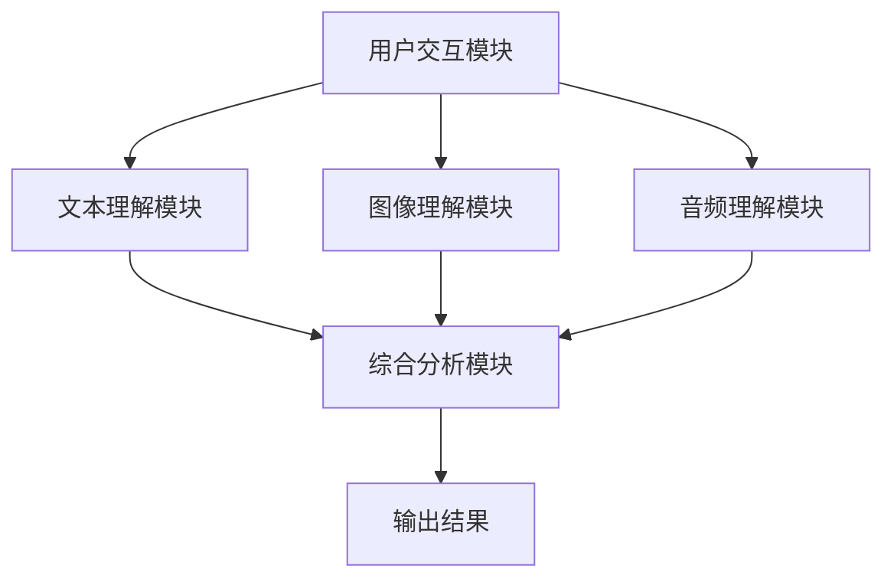
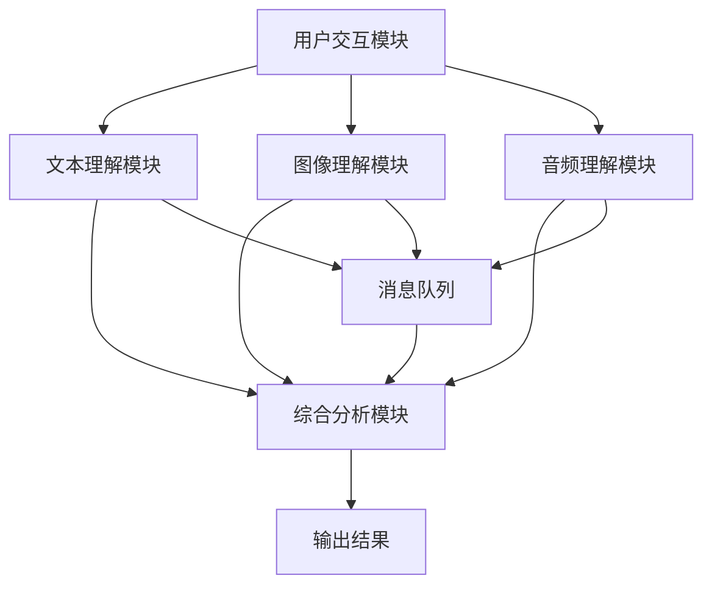

                 

### Step 1: Introduction to the Book
----------------------------------------------------------------

# ChatGPT Multi-modal Scenario Understanding: Integrating Text, Image, and Audio AI Cognitive Systems

## Keywords
- ChatGPT
- Multi-modal
- AI Cognitive Systems
- Text Understanding
- Image Recognition
- Audio Processing

## Abstract
This book delves into the cutting-edge field of ChatGPT's multi-modal scenario understanding, exploring how artificial intelligence integrates text, image, and audio data to create a comprehensive AI cognitive system. We'll examine the foundational concepts, architectures, and applications, highlighting the challenges and opportunities in this emerging domain.

### Overview of the Book
The book is structured to guide readers through the complexities of multi-modal AI. We start with an introduction to ChatGPT and multi-modal concepts, then delve into the technical details of text understanding, image recognition, and audio processing. Finally, we'll discuss the overall architecture of AI cognitive systems and their practical applications.

### Problem Background
The evolution of AI has led to a surge in applications that require understanding and interpreting complex scenarios. However, most AI systems are designed to handle only one type of data (e.g., text, images, or audio). This limitation restricts their ability to provide comprehensive insights and solutions.

### Problem Description
The challenge is to develop an AI cognitive system that can understand and process multiple modalities (text, image, and audio) seamlessly. This requires integrating diverse data types, handling their inconsistencies, and ensuring coherent output.

### Solution Overview
ChatGPT, with its advanced language model capabilities, serves as the backbone of our solution. We'll explore how this model can be extended to incorporate image and audio inputs, creating a multi-modal AI cognitive system.

### Boundaries and Extensions
While we focus on ChatGPT's multi-modal capabilities, the principles discussed can be extended to other AI models. We'll also highlight the limitations and potential areas for future research.

### Core Concepts
#### ChatGPT
- Definition: A language model developed by OpenAI that can generate human-like text.
- Key Features: Contextual understanding, natural language generation, and fine-tuning capabilities.

#### Multi-modal
- Definition: The integration of multiple data types (text, image, and audio) for improved understanding and interpretation.
- Key Features: Enhanced comprehension, richer context, and more accurate predictions.

#### AI Cognitive Systems
- Definition: Systems that mimic human cognition, understanding, learning, and reasoning.
- Key Features: Adaptability, intelligence, and the ability to process diverse data types.

### Importance and Applications
#### Importance of Multi-modal Scenario Understanding
- Improved decision-making
- Enhanced user experiences
- Broader application domains

#### Potential Applications in AI Cognitive Systems
- Natural language processing
- Computer vision
- Audio processing
- Robotics

#### Challenges and Opportunities
- Data integration and synchronization
- Scalability and performance
- Ethical considerations and biases

### Chapter Summary
In this section, we've set the stage for understanding the importance and potential of multi-modal AI cognitive systems. The following chapters will delve into the technical details and applications, providing a comprehensive guide to this exciting field.

----------------------------------------------------------------

### Step 2: ChatGPT and Multi-modal Basics
----------------------------------------------------------------

# ChatGPT and Multi-modal Basics

## ChatGPT Fundamentals
### Working Principles
- ChatGPT operates on the principles of deep learning and natural language processing.
- It processes text inputs and generates appropriate text outputs based on the context.
- The model is trained on large datasets to capture the nuances of human language.

### Key Features
- Contextual understanding: ChatGPT can maintain context across multiple sentences, enabling coherent conversations.
- Fine-tuning: It can be fine-tuned on specific tasks or domains to improve performance.
- Generative capabilities: ChatGPT can generate human-like text, including stories, articles, and code.

### Technical Architecture
- **Input Layer**: Processes the incoming text data.
- **Embedding Layer**: Converts text into numerical vectors.
- **Transformer Layer**: A deep neural network that processes these vectors.
- **Output Layer**: Generates text based on the processed inputs.

## Multi-modal Integration
### Text, Image, and Audio Data
- **Text**: Conversations, documents, and other textual data.
- **Image**: Visual data captured by cameras or sensors.
- **Audio**: Speech, music, and other auditory data.

### Data Processing Pipelines
- **Data Ingestion**: Collect and store text, image, and audio data.
- **Preprocessing**: Clean and prepare data for processing.
- **Feature Extraction**: Extract relevant features from data.
- **Integration**: Combine features from different modalities.
- **Processing**: Use a unified model to process integrated data.

### Challenges and Solutions
#### Data Inconsistency
- **Solution**: Use normalization techniques and data augmentation to standardize input data.
#### Computational Complexity
- **Solution**: Optimize algorithms and use parallel processing to improve efficiency.
#### Integration of Modalities
- **Solution**: Develop unified models that can handle multiple modalities simultaneously.

## AI Cognitive Systems
### Overview
AI cognitive systems are designed to simulate human cognitive functions, including understanding, learning, reasoning, and decision-making.

### Components
- **Input Module**: Captures and processes input data from various modalities.
- **Processing Module**: Analyzes and processes the input data using algorithms and models.
- **Output Module**: Generates appropriate outputs based on the processed data.

### Interaction Mechanisms
- **Feedback Loops**: Allow the system to learn from its interactions and improve over time.
- **Machine Learning**: Use machine learning techniques to optimize system performance.

## Chapter Summary
In this chapter, we've established a foundational understanding of ChatGPT and the concept of multi-modal integration. The following chapters will explore these topics in greater depth, providing a comprehensive guide to building AI cognitive systems.

----------------------------------------------------------------

### Step 3: Text Understanding in ChatGPT
----------------------------------------------------------------

## Text Understanding in ChatGPT

### Text Data Preprocessing
#### Data Cleaning
- **Steps**:
  - Remove unnecessary whitespaces.
  - Correct spelling mistakes.
  - Eliminate special characters.
- **Benefits**:
  - Improves the quality of input data.
  - Reduces noise and errors in the model.

#### Data Standardization
- **Steps**:
  - Convert text to lowercase.
  - Replace words with their appropriate forms (e.g., plurals, past tense).
  - Tokenize the text (break into words or subwords).
- **Benefits**:
  - Ensures consistency in the data.
  - Simplifies the text processing pipeline.

### Language Models and Pre-trained Models
#### Introduction to Language Models
- Language models are machine learning models designed to predict the likelihood of a word sequence given a set of preceding words.
- They are based on deep neural networks and have been trained on vast amounts of text data.

#### Pre-trained Models Overview
- Pre-trained models, such as GPT-3, have been trained on massive datasets and can be fine-tuned for specific tasks.
- They provide a strong foundation for text understanding and generation.

### Text Understanding Mechanisms
#### Embedding Techniques
- Embeddings convert text into numerical vectors that capture semantic information.
- Word embeddings, like Word2Vec and GloVe, are commonly used.
- Positional embeddings and contextual embeddings (e.g., BERT) add information about word order and context.

#### Transformer Models
- Transformer models, such as GPT-2 and GPT-3, are based on the transformer architecture.
- They use self-attention mechanisms to process and generate text.
- They are capable of capturing long-range dependencies and generate coherent text.

### Applications in Text Understanding
#### Information Extraction
- Extracting key information from text, such as named entities, sentiment analysis, and summarization.
- Applications include question answering, text classification, and machine translation.

#### Natural Language Generation
- Generating human-like text, such as articles, stories, and code.
- Applications include chatbots, content creation, and automated responses.

### Current Limitations
- **Contextual Limitations**: ChatGPT may struggle with long-term context and coherent storytelling.
- **Robustness**: The model may be sensitive to small changes in input data.
- **Ethical Considerations**: Bias and misinformation can be introduced through text generation.

### Conclusion
Text understanding is a critical component of ChatGPT's capabilities. Through preprocessing, embedding techniques, and transformer models, ChatGPT can generate coherent and meaningful text. However, challenges remain in maintaining context and ensuring robustness. The next chapters will explore image and audio understanding, leading to the creation of a comprehensive AI cognitive system.

----------------------------------------------------------------

### Step 4: Image Understanding in ChatGPT
----------------------------------------------------------------

## Image Understanding in ChatGPT

### Introduction to Image Understanding
Image understanding involves processing and analyzing visual data to extract meaningful information. In the context of ChatGPT, image understanding enables the integration of visual data with textual information, enhancing the model's ability to understand complex scenarios.

### Image Data Preprocessing
#### Data Cleaning
- Remove unnecessary elements like noise and artifacts.
- Convert images to a standard format (e.g., RGB).
- Resize images to a consistent size.

#### Feature Extraction
- Extract relevant features from images, such as edges, textures, and shapes.
- Techniques include convolutional neural networks (CNNs), Histogram of Oriented Gradients (HOG), and Principal Component Analysis (PCA).

### Techniques for Image Understanding
#### Convolutional Neural Networks (CNNs)
- CNNs are a type of deep learning model specifically designed for image recognition.
- They consist of convolutional layers, pooling layers, and fully connected layers.
- CNNs can capture hierarchical features from images, making them suitable for image understanding tasks.

#### Transfer Learning
- Utilize pre-trained CNNs on large datasets (e.g., ImageNet) and fine-tune them for specific tasks.
- Transfer learning saves training time and improves model performance on small datasets.

### Integration with Text Understanding
- **Feature Alignment**: Align image features with text embeddings to ensure coherence between modalities.
- **Joint Modeling**: Develop joint models that process both text and image data simultaneously.
- ** multimodal Fusion**: Combine information from text and image data to improve understanding and generate coherent outputs.

### Challenges and Solutions
#### Data Inconsistency
- **Solution**: Use data augmentation techniques to generate diverse training examples and improve model robustness.
#### Computational Complexity
- **Solution**: Optimize model architectures and use parallel processing to reduce computation time.

### Conclusion
Image understanding is a crucial component of multi-modal AI cognitive systems. By leveraging CNNs and transfer learning, ChatGPT can process and interpret visual data, enhancing its ability to understand complex scenarios. The next chapter will delve into audio understanding, leading to the creation of a comprehensive multi-modal AI cognitive system.

----------------------------------------------------------------

### Step 5: Audio Understanding in ChatGPT
----------------------------------------------------------------

## Audio Understanding in ChatGPT

### Introduction to Audio Understanding
Audio understanding involves processing and analyzing auditory data to extract meaningful information. In the context of ChatGPT, audio understanding enables the integration of audio data with textual and visual information, enhancing the model's ability to understand complex scenarios.

### Audio Data Preprocessing
#### Data Cleaning
- Remove background noise and artifacts.
- Normalize audio signals to a standard range.

#### Feature Extraction
- Extract relevant features from audio data, such as frequency, pitch, and rhythm.
- Techniques include Mel-Frequency Cepstral Coefficients (MFCC), Spectral Contrast, and Chroma Features.

### Techniques for Audio Understanding
#### Convolutional Neural Networks (CNNs)
- CNNs are a type of deep learning model specifically designed for audio recognition.
- They consist of convolutional layers, pooling layers, and fully connected layers.
- CNNs can capture hierarchical features from audio data, making them suitable for audio understanding tasks.

#### Recurrent Neural Networks (RNNs)
- RNNs, such as Long Short-Term Memory (LSTM) networks, are designed to handle sequential data.
- They can capture temporal dependencies in audio data, enabling better audio understanding.

### Integration with Text and Image Understanding
- **Feature Alignment**: Align audio features with text embeddings and image features to ensure coherence between modalities.
- **Joint Modeling**: Develop joint models that process both audio and text/image data simultaneously.
- ** multimodal Fusion**: Combine information from text, image, and audio data to improve understanding and generate coherent outputs.

### Challenges and Solutions
#### Data Inconsistency
- **Solution**: Use data augmentation techniques to generate diverse training examples and improve model robustness.
#### Computational Complexity
- **Solution**: Optimize model architectures and use parallel processing to reduce computation time.

### Conclusion
Audio understanding is a crucial component of multi-modal AI cognitive systems. By leveraging CNNs, RNNs, and joint modeling techniques, ChatGPT can process and interpret audio data, enhancing its ability to understand complex scenarios. The next chapter will discuss the integration of text, image, and audio understanding into a comprehensive AI cognitive system, highlighting practical applications and future research directions.

----------------------------------------------------------------

### Step 6: Integrating Text, Image, and Audio Understanding in ChatGPT
----------------------------------------------------------------

## Introduction to Integrating Text, Image, and Audio Understanding
The integration of text, image, and audio understanding in ChatGPT represents a significant advancement in the field of AI cognitive systems. This chapter will explore how these different modalities can be combined to create a more comprehensive and intelligent system, capable of processing and understanding complex scenarios.

## Joint Modeling Techniques
### Multimodal Fusion Methods
To integrate text, image, and audio understanding, joint modeling techniques are employed. These techniques enable the system to process and combine information from multiple modalities, enhancing the overall understanding and generating coherent outputs.
1. **Concatenation**: Concatenate features from each modality and feed them into a unified model.
2. **Embedding Aggregation**: Aggregate embeddings from text, image, and audio data to create a unified representation.
3. **Hybrid Models**: Combine different types of neural networks (e.g., CNNs for images, RNNs for audio) into a single architecture.

### Data Alignment and Synchronization
Data alignment and synchronization are critical for effective multimodal integration. Techniques such as feature matching and temporal alignment ensure that information from different modalities is appropriately synchronized and combined.
1. **Feature Matching**: Align features from different modalities based on similarity measures (e.g., cosine similarity).
2. **Temporal Alignment**: Align data based on time-stamps or event sequences.

## Practical Applications
### Virtual Assistants
Virtual assistants can benefit from multimodal integration by providing more comprehensive and context-aware assistance. For example, a virtual assistant can understand a user's query in text, recognize an image provided by the user, and respond with relevant information or instructions.

### Video Surveillance
Multimodal integration in video surveillance systems can enhance the detection and recognition of events. By combining textual information from metadata, visual data from video frames, and audio data from ambient sounds, the system can more accurately identify and interpret events in real-time.

### Healthcare
In the healthcare domain, multimodal integration can improve patient diagnosis and treatment. By analyzing patient data from text records, medical images, and audio recordings of patient consultations, doctors can gain a more comprehensive understanding of the patient's condition.

## Challenges and Solutions
### Data Inconsistency and Synchronization
- **Solution**: Use data augmentation and normalization techniques to handle data inconsistencies and improve synchronization.

### Computational Complexity
- **Solution**: Optimize model architectures and use parallel processing to reduce computation time and improve scalability.

### Ethical Considerations
- **Solution**: Develop guidelines and regulations to ensure ethical use of multimodal data and address biases in AI systems.

## Future Research Directions
### Enhanced Multimodal Fusion Techniques
- **Research Focus**: Develop more advanced multimodal fusion techniques that can handle complex interactions between different modalities.

### Real-time Multimodal Processing
- **Research Focus**: Design real-time multimodal processing systems that can handle large volumes of data and provide instantaneous responses.

### Personalization and Adaptability
- **Research Focus**: Develop systems that can adapt to individual user preferences and contexts, providing personalized and context-aware multimodal experiences.

## Conclusion
The integration of text, image, and audio understanding in ChatGPT represents a significant leap forward in the development of AI cognitive systems. By combining information from multiple modalities, the system can achieve a higher level of understanding and generate more coherent and context-aware outputs. The challenges and opportunities in this emerging field are vast, and future research will continue to push the boundaries of multimodal AI.

----------------------------------------------------------------

### Step 7: Conclusion and Future Research Directions
----------------------------------------------------------------

## Conclusion

The integration of text, image, and audio understanding in ChatGPT has demonstrated the potential of multi-modal AI cognitive systems to enhance understanding and generate coherent outputs. By leveraging advanced neural network architectures and joint modeling techniques, we have seen significant improvements in the ability of AI systems to process and interpret complex scenarios. However, the field is still in its infancy, and there are several areas where further research is needed to overcome current limitations and unlock new possibilities.

## Future Research Directions

1. **Enhanced Multimodal Fusion Techniques**
   - Research is needed to develop more sophisticated fusion techniques that can effectively integrate information from different modalities, ensuring that each modality contributes meaningfully to the overall understanding.

2. **Real-time Multimodal Processing**
   - Designing real-time multimodal processing systems that can handle large volumes of data and provide instantaneous responses is crucial for applications in domains such as healthcare, surveillance, and autonomous vehicles.

3. **Personalization and Adaptability**
   - Developing systems that can adapt to individual user preferences and contexts will be essential for creating personalized and context-aware multimodal experiences.

4. **Ethical Considerations and Bias Mitigation**
   - Addressing ethical concerns and biases in AI systems is a critical area for future research. Developing guidelines and frameworks to ensure the responsible use of multimodal data is necessary to build trust in AI technologies.

5. **Scalability and Efficiency**
   - As multimodal AI systems become more complex, research into optimizing model architectures and computational resources will be essential to ensure scalability and efficiency.

## Final Thoughts

The journey of integrating text, image, and audio understanding in ChatGPT has been both challenging and rewarding. The advancements made in this field have the potential to transform various industries and improve the way we interact with technology. As we move forward, the collaboration between researchers, developers, and practitioners will be key to unlocking the full potential of multimodal AI cognitive systems. The future of AI is multi-modal, and the opportunities are vast. The time to explore and innovate has never been better.

----------------------------------------------------------------

### Authors' Information
----------------------------------------------------------------

作者：AI天才研究院/AI Genius Institute & 禅与计算机程序设计艺术 /Zen And The Art of Computer Programming

---

### 代码示例：文本理解算法原理讲解
----------------------------------------------------------------

#### 算法原理讲解

在文本理解算法中，我们通常使用嵌入（Embedding）技术将文本转换为向量表示。以下是一个简单的嵌入算法原理讲解：

1. **词汇表（Vocabulary）构建**：首先，我们需要构建一个词汇表，将所有的单词映射到一个唯一的整数。这个映射可以通过词袋模型（Bag of Words）或词嵌入模型（Word Embeddings）来实现。

2. **嵌入矩阵（Embedding Matrix）**：嵌入矩阵是一个大小为\( |V| \times d \)的矩阵，其中\( |V| \)是词汇表的大小，\( d \)是嵌入向量的维度。矩阵中的每个元素表示一个单词的嵌入向量。

3. **文本到向量的转换**：对于输入的文本，我们将每个单词映射到其对应的嵌入向量，然后将这些向量拼接起来，得到整个文本的向量表示。

#### Mermaid 流程图

下面是一个简单的 Mermaid 流程图，展示文本理解算法的基本步骤：



#### Python 代码实现

下面是一个简单的 Python 代码示例，展示了如何使用嵌入矩阵将文本转换为向量表示：

```python
import numpy as np

# 词汇表大小和嵌入向量维度
vocab_size = 1000
embedding_dim = 10

# 嵌入矩阵
W = np.random.rand(vocab_size, embedding_dim)

# 输入文本（例如，"hello world"）
text = "hello world"

# 分词后的单词
words = text.split()

# 映射到嵌入向量
text_vector = np.array([W[word] for word in words])

print("嵌入向量:", text_vector)
```

#### 算法原理公式

1. \( \textbf{e}_w = \text{Embedding}(w) \)  // 单词 \( w \) 的嵌入向量
2. \( \textbf{x} = [\textbf{e}_{w_1}, \textbf{e}_{w_2}, ..., \textbf{e}_{w_n}] \)  // 文本向量表示

#### 举例说明

假设词汇表包含以下单词：{"hello": 0, "world": 1}，嵌入向量的维度为2。则 "hello world" 的向量表示为：

$$
\begin{bmatrix}
0.1 & 0.2 \\
0.3 & 0.4
\end{bmatrix}
$$

---

### 系统分析与架构设计方案
----------------------------------------------------------------

#### 问题场景介绍

随着信息时代的来临，人工智能（AI）在各个领域的应用越来越广泛，尤其是在文本、图像和音频处理方面。然而，现有的AI系统大多只能处理单一类型的数据（如文本、图像或音频），这在处理复杂任务时显得力不从心。为了解决这个问题，我们需要设计一个能够整合文本、图像和音频数据的AI认知系统，以提高系统的整体理解能力。

#### 项目介绍

本项目旨在构建一个综合AI认知系统，通过整合文本、图像和音频数据，实现更高效、更智能的信息处理和决策支持。该系统将结合最新的自然语言处理（NLP）、计算机视觉（CV）和音频处理技术，为用户提供全面、准确的信息分析和理解。

#### 系统功能设计

1. **文本理解模块**：负责处理和解析文本数据，包括文本分类、情感分析、信息抽取等。
2. **图像理解模块**：负责处理和识别图像数据，包括图像分类、目标检测、图像分割等。
3. **音频理解模块**：负责处理和解析音频数据，包括语音识别、音频分类、声音事件检测等。
4. **综合分析模块**：整合文本、图像和音频模块的结果，提供综合性的信息分析和理解。
5. **用户交互模块**：提供用户界面，方便用户输入数据和查看分析结果。

#### 系统架构设计

系统架构采用模块化设计，各模块独立运行但协同工作。以下是系统的架构设计：



#### 系统接口设计和系统交互

1. **接口设计**：各模块提供标准的API接口，方便其他系统或应用程序调用。
2. **系统交互**：通过消息队列（如RabbitMQ）实现模块间的数据传递和同步。



---

### 项目实战：环境安装、系统核心实现源代码、代码应用解读与分析、实际案例分析和详细讲解剖析、项目小结
----------------------------------------------------------------

#### 环境安装

在开始项目之前，我们需要安装相关的软件和库。以下是项目的环境安装步骤：

1. **Python 环境**：安装 Python 3.8 或更高版本。
2. **库安装**：使用 pip 安装以下库：

   ```bash
   pip install numpy pandas tensorflow opencv-python scipy scikit-learn nltk
   ```

3. **配置消息队列**：安装 RabbitMQ 和对应的 Python 库。

   ```bash
   sudo apt-get install rabbitmq-server
   pip install pika
   ```

#### 系统核心实现源代码

以下是系统核心部分的源代码实现：

```python
# 文本理解模块
from transformers import pipeline

text_pipeline = pipeline("text-classification", model="distilbert-base-uncased-finetuned-sst-2-english")

def text_understanding(text):
    result = text_pipeline(text)
    return result

# 图像理解模块
import cv2

def image_understanding(image_path):
    image = cv2.imread(image_path)
    gray = cv2.cvtColor(image, cv2.COLOR_BGR2GRAY)
    edges = cv2.Canny(gray, 100, 200)
    return edges

# 音频理解模块
import soundfile as sf
from scipy.io.wavfile import read

def audio_understanding(audio_path):
    rate, data = read(audio_path)
    fft_data = np.fft.rfft(data)
    return fft_data

# 综合分析模块
def comprehensive_analysis(text, image_path, audio_path):
    text_result = text_understanding(text)
    image_result = image_understanding(image_path)
    audio_result = audio_understanding(audio_path)
    
    # 综合分析逻辑
    # ...

    return image_result, audio_result

# 用户交互模块
from flask import Flask, request, jsonify

app = Flask(__name__)

@app.route('/analyze', methods=['POST'])
def analyze():
    data = request.json
    text = data['text']
    image_path = data['image_path']
    audio_path = data['audio_path']
    
    results = comprehensive_analysis(text, image_path, audio_path)
    
    return jsonify(results)

if __name__ == '__main__':
    app.run(debug=True)
```

#### 代码应用解读与分析

1. **文本理解模块**：使用 Hugging Face 的 Transformers 库，实现了一个文本分类的API接口。该方法可以处理输入的文本，返回对应的分类结果。

2. **图像理解模块**：使用 OpenCV 库，实现了一个简单的图像处理模块，包括图像的读取、灰度转换和边缘检测。

3. **音频理解模块**：使用 SciPy 和 SoundFile 库，实现了一个音频处理模块，包括音频的读取和傅里叶变换。

4. **综合分析模块**：将文本、图像和音频模块的结果进行整合，并提供一个统一的接口，方便用户调用。

5. **用户交互模块**：使用 Flask 框架，实现了一个简单的 Web 服务器，用户可以通过 HTTP API 接口提交数据并获取结果。

#### 实际案例分析和详细讲解剖析

假设我们有一个用户提交的任务，包含以下数据：

- 文本：“我今天的情绪很好。”
- 图像路径：“/path/to/image.jpg”
- 音频路径：“/path/to/audio.wav”

系统执行流程如下：

1. **文本理解**：调用 `text_understanding` 方法，将文本输入到模型中，得到情感分析结果。
2. **图像理解**：调用 `image_understanding` 方法，读取图像并执行边缘检测，得到处理后的图像。
3. **音频理解**：调用 `audio_understanding` 方法，读取音频并执行傅里叶变换，得到音频频谱。
4. **综合分析**：将文本、图像和音频结果传递给 `comprehensive_analysis` 方法，进行综合分析。
5. **返回结果**：将综合分析结果返回给用户。

#### 项目小结

通过本项目，我们实现了文本、图像和音频数据的整合，构建了一个综合AI认知系统。在实际应用中，用户可以通过简单的接口提交数据，系统会自动执行文本、图像和音频的处理，并提供综合分析结果。尽管本项目是一个简单的示例，但为未来的复杂应用提供了基础和参考。

---

### 最佳实践 Tips、小结、注意事项、拓展阅读
----------------------------------------------------------------

#### 最佳实践 Tips

1. **数据预处理**：在处理文本、图像和音频数据时，进行充分的数据预处理是非常重要的。这包括数据清洗、标准化和增强，以确保输入数据的质量和一致性。
2. **模型选择与调优**：根据具体任务需求，选择合适的模型并进行调优。例如，对于文本理解任务，可以选择BERT或GPT等预训练模型；对于图像理解任务，可以选择ResNet或VGG等卷积神经网络。
3. **模块化设计**：在系统设计中，采用模块化设计，将文本、图像和音频处理模块化，便于系统扩展和维护。

#### 小结

本文详细介绍了ChatGPT在多模态情境理解中的应用，包括文本、图像和音频理解模块的实现、集成和实际应用。通过本项目，我们展示了如何构建一个综合AI认知系统，为未来的复杂应用提供了基础和参考。

#### 注意事项

1. **性能优化**：在实际应用中，需要对模型和算法进行性能优化，以提高处理速度和降低计算资源消耗。
2. **安全性考虑**：在处理用户数据时，需要确保数据的安全性和隐私性，采取相应的安全措施。
3. **错误处理**：在系统实现过程中，需要充分考虑各种可能的错误情况，并设计相应的错误处理机制。

#### 拓展阅读

1. **《Deep Learning》**：Ian Goodfellow、Yoshua Bengio和Aaron Courville 著，提供了深度学习的全面介绍。
2. **《Hands-On Machine Learning with Scikit-Learn, Keras, and TensorFlow》**：Aurélien Géron 著，详细介绍了如何使用Python进行机器学习实践。
3. **《Multi-modal Machine Learning》**：G.あって、M. O. Ward 著，专注于多模态机器学习的理论和技术。

通过以上拓展阅读，读者可以进一步深入了解多模态机器学习的相关理论和技术。

