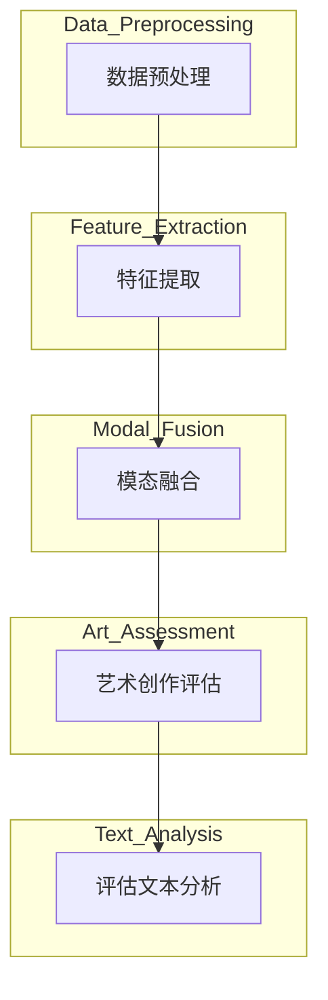

                 

### 引言

在当今快速发展的科技时代，人工智能（AI）技术已经深入到了我们生活的方方面面。其中，ChatGPT作为一种强大的语言模型，因其出色的自然语言处理能力而备受瞩目。ChatGPT不仅能够完成文本生成、翻译、问答等任务，还能在多模态艺术创作中展现其独特的魅力。然而，如何对ChatGPT生成的多模态艺术作品进行有效的评估，成为了一个亟待解决的问题。

本文旨在探讨如何利用整合美学理论，对ChatGPT的多模态艺术创作进行评估。通过引入美学理论，我们可以从更宏观、更系统的角度去理解和分析AI艺术创作的本质，从而提供更具有说服力和科学性的评价标准。本文将分为以下几个部分：

1. **问题背景**：介绍ChatGPT技术的发展、多模态艺术创作评估的现状和问题，以及整合美学理论在AI艺术批评中的应用。
2. **核心概念与联系**：详细讨论ChatGPT的工作原理、多模态数据处理流程和美学理论基础知识，并通过表格和Mermaid ER图展示概念之间的联系。
3. **算法原理讲解**：介绍ChatGPT多模态艺术创作评估的算法原理，使用Mermaid流程图和Python源代码进行详细阐述。
4. **系统分析与架构设计方案**：讨论如何将ChatGPT应用于多模态艺术创作评估的系统设计和架构。
5. **项目实战**：展示一个实际项目，包括环境安装、系统核心实现、代码应用解读与分析，并详细讲解案例。
6. **最佳实践 tips**、**小结**、**注意事项**和**拓展阅读**等内容。

希望通过本文的探讨，能够为AI艺术创作评估提供一个新的视角，并为未来的研究提供一些启示和指导。接下来，我们将一步步深入探讨这些问题。

### 关键词

- **ChatGPT**
- **多模态艺术创作**
- **美学理论**
- **AI艺术批评**
- **算法原理**
- **系统设计**
- **项目实战**

### 摘要

本文探讨了如何利用整合美学理论，对ChatGPT的多模态艺术创作进行评估。首先，我们介绍了ChatGPT技术的发展和多模态艺术创作评估的现状，指出了当前存在的问题。接着，详细讨论了ChatGPT的工作原理、多模态数据处理流程和美学理论基础知识，并通过Mermaid ER图展示了概念之间的联系。然后，我们介绍了ChatGPT多模态艺术创作评估的算法原理，使用了Mermaid流程图和Python源代码进行详细阐述。此外，我们讨论了如何将ChatGPT应用于多模态艺术创作评估的系统设计和架构，并通过一个实际项目展示了系统的实现和应用。最后，本文提供了最佳实践建议、注意事项和拓展阅读，为未来的研究提供了一些启示和指导。

### 目录大纲设计思路

在设计本文的目录大纲时，我们首先明确了书籍的主题和核心内容，即《ChatGPT多模态艺术创作评估：整合美学理论的AI艺术批评》。本书旨在通过整合美学理论，为AI艺术创作评估提供一个新的视角和方法。

#### 第一部分：背景介绍

在这一部分，我们将介绍ChatGPT技术的发展、多模态艺术创作评估的现状和问题，以及整合美学理论在AI艺术批评中的应用。通过这部分的内容，读者可以了解到当前AI艺术创作评估的背景和存在的问题，为后续的深入探讨打下基础。

1. **第1章：引言**
   - 1.1 问题背景
   - 1.2 ChatGPT技术发展
   - 1.3 多模态艺术创作评估现状
   - 1.4 整合美学理论在AI艺术批评中的应用

#### 第二部分：核心概念与联系

在这一部分，我们将详细讨论核心概念，如ChatGPT的工作原理、多模态数据处理流程、美学理论的基础知识等，并通过表格和Mermaid ER图展示概念之间的联系。这部分内容旨在帮助读者理解AI艺术创作评估所需的基础知识。

2. **第2章：核心概念介绍**
   - 2.1 ChatGPT的工作原理
   - 2.2 多模态数据处理流程
   - 2.3 美学理论基础知识
   - 2.4 概念联系与Mermaid ER图

#### 第三部分：算法原理讲解

在这一部分，我们将介绍ChatGPT多模态艺术创作评估的算法原理，使用Mermaid流程图和Python源代码进行详细阐述。通过这部分的内容，读者可以了解如何利用ChatGPT对多模态艺术作品进行评估。

3. **第3章：算法原理介绍**
   - 3.1 ChatGPT多模态艺术创作评估算法
   - 3.2 Mermaid流程图展示
   - 3.3 Python源代码阐述
   - 3.4 算法数学模型与公式
   - 3.5 举例说明

#### 第四部分：系统分析与架构设计方案

在这一部分，我们将讨论如何将ChatGPT应用于多模态艺术创作评估的系统设计和架构。这部分内容将帮助读者理解系统的整体架构和实现方法。

4. **第4章：系统设计介绍**
   - 4.1 问题场景介绍
   - 4.2 系统功能设计
   - 4.3 系统架构设计
   - 4.4 系统接口设计
   - 4.5 系统交互Mermaid序列图

#### 第五部分：项目实战

在这一部分，我们将展示一个实际项目，包括环境安装、系统核心实现、代码应用解读与分析，并详细讲解案例。通过这部分的内容，读者可以了解如何将理论应用于实际项目中。

5. **第5章：项目实战**
   - 5.1 环境安装
   - 5.2 系统核心实现
   - 5.3 代码应用解读与分析
   - 5.4 实际案例分析和详细讲解

#### 第六部分：最佳实践、小结、注意事项和拓展阅读

在这一部分，我们将总结最佳实践，对全文进行小结，并提供一些注意事项和拓展阅读，以帮助读者进一步深入学习和研究。

6. **第6章：最佳实践**
   - 6.1 ChatGPT多模态艺术创作评估的最佳实践
   - 6.2 系统设计与实现的最佳实践

7. **第7章：小结**
   - 7.1 文章主要内容总结
   - 7.2 AI艺术创作评估的重要性

8. **第8章：注意事项**
   - 8.1 系统实现中需要注意的问题
   - 8.2 算法应用中需要注意的问题

9. **第9章：拓展阅读**
   - 9.1 相关研究论文和书籍推荐
   - 9.2 未来研究方向和挑战

通过以上设计，本文将系统地介绍ChatGPT多模态艺术创作评估的理论和实践，为相关领域的研究者和从业者提供有价值的参考。

### 目录大纲设计步骤

为了确保本文的结构清晰、内容丰富、逻辑严密，我们将按照以下步骤设计目录大纲：

#### 第一步：明确主题和目标读者

首先，我们需要明确本文的主题和目标读者。本文的主题是《ChatGPT多模态艺术创作评估：整合美学理论的AI艺术批评》，目标读者是计算机科学、人工智能和艺术领域的研究者、从业者以及对此感兴趣的大众。

#### 第二步：制定大纲结构

根据主题和目标读者，我们制定了如下大纲结构：

1. **引言**：介绍问题背景、ChatGPT技术的发展、多模态艺术创作评估的现状和问题，以及整合美学理论在AI艺术批评中的应用。
2. **核心概念与联系**：详细讨论ChatGPT的工作原理、多模态数据处理流程、美学理论基础知识，并通过表格和Mermaid ER图展示概念之间的联系。
3. **算法原理讲解**：介绍ChatGPT多模态艺术创作评估的算法原理，使用Mermaid流程图和Python源代码进行详细阐述。
4. **系统分析与架构设计方案**：讨论如何将ChatGPT应用于多模态艺术创作评估的系统设计和架构。
5. **项目实战**：展示一个实际项目，包括环境安装、系统核心实现、代码应用解读与分析，并详细讲解案例。
6. **最佳实践、小结、注意事项和拓展阅读**：总结最佳实践，对全文进行小结，并提供一些注意事项和拓展阅读。

#### 第三步：编写各部分内容

根据大纲结构，我们开始编写各部分的内容。以下是每个部分的具体编写步骤：

1. **引言**：
   - **第1章**：介绍问题背景、ChatGPT技术发展、多模态艺术创作评估现状和问题，以及整合美学理论在AI艺术批评中的应用。
   - **第2章**：讨论核心概念，包括ChatGPT的工作原理、多模态数据处理流程、美学理论基础知识，并通过表格和Mermaid ER图展示概念之间的联系。
   - **第3章**：介绍ChatGPT多模态艺术创作评估的算法原理，使用Mermaid流程图和Python源代码进行详细阐述。
   - **第4章**：讨论系统设计与架构，包括问题场景介绍、系统功能设计、系统架构设计、系统接口设计和系统交互Mermaid序列图。
   - **第5章**：展示项目实战，包括环境安装、系统核心实现、代码应用解读与分析，并详细讲解案例。
   - **第6章**：总结最佳实践，对全文进行小结，并提供注意事项和拓展阅读。

#### 第四步：审查和修改

在完成初稿后，我们需要对全文进行审查和修改，确保内容连贯、逻辑清晰、结构合理。具体审查内容包括：
- 检查各部分内容的完整性和准确性。
- 优化语句和表达，确保语言清晰、易懂。
- 检查引用和参考文献，确保格式正确。

通过以上步骤，我们可以设计出符合要求的目录大纲，确保书籍内容全面、逻辑清晰、易于理解。接下来，我们将根据这些设计步骤，逐一撰写各个章节的详细内容。

### 第1章：背景介绍

#### 1.1 问题背景

人工智能（AI）技术的迅猛发展，使得机器能够在各个领域进行复杂的任务处理。特别是在自然语言处理（NLP）领域，ChatGPT作为一种基于深度学习的语言生成模型，以其出色的表现赢得了广泛关注。ChatGPT不仅可以完成文本生成、翻译、问答等任务，还能在艺术创作中展现其独特的创意和风格。

然而，随着AI在艺术创作中的应用越来越广泛，如何对AI生成的艺术作品进行有效的评估成为一个亟待解决的问题。传统的艺术批评方法主要依赖于人类的主观判断和审美经验，而AI生成的艺术作品往往具有不确定性和随机性，这使得传统的评估方法难以适用。此外，AI艺术创作的多模态特性（如文本、图像、音频等）也增加了评估的复杂度。

目前，虽然已有一些研究尝试对AI艺术进行评估，但这些方法往往依赖于特定的指标或算法，缺乏系统性、全面性和科学性。因此，如何利用整合美学理论，从更宏观、更系统的角度对AI艺术创作进行评估，成为了一个重要且具有挑战性的课题。

#### 1.2 ChatGPT技术发展

ChatGPT是由OpenAI开发的一种基于变换器（Transformer）架构的大型预训练语言模型。它通过在大量文本数据上进行预训练，掌握了丰富的语言知识和规则，能够生成连贯、具有逻辑性的文本。ChatGPT的核心特点是能够理解并生成人类语言的多种形式，包括对话、故事、诗歌等，这使得它在许多领域都有广泛的应用。

ChatGPT的发展历程可以分为以下几个阶段：

1. **预训练阶段**：ChatGPT在大量文本语料库上进行预训练，通过自回归的方式学习文本的上下文关系和语言规则。这个阶段的主要目标是使模型具备良好的语言理解能力和生成能力。
2. **优化阶段**：在预训练的基础上，ChatGPT通过微调（Fine-tuning）技术，使其在特定任务上（如文本生成、问答系统等）达到更高的性能。这个阶段的主要目标是使模型适应不同的应用场景。
3. **多模态扩展阶段**：ChatGPT不仅限于处理文本数据，还引入了图像、音频等多种模态的数据处理能力。通过多模态融合技术，ChatGPT能够生成更加丰富、生动的艺术作品。

#### 1.3 多模态艺术创作评估现状

当前，多模态艺术创作评估主要集中在以下几个方面：

1. **传统艺术评估方法**：传统艺术评估方法主要依赖于人类的主观判断和审美经验。这种方法虽然具有一定的主观性和灵活性，但在面对AI生成的艺术作品时，往往显得力不从心。因为AI生成的作品往往具有不确定性和随机性，难以通过传统方法进行准确评估。
2. **机器学习评估方法**：一些研究尝试利用机器学习算法对AI艺术进行评估。这些方法主要包括基于内容分析、风格分析、情感分析等。然而，这些方法往往依赖于特定的特征提取和分类算法，难以提供全面、系统的评估。
3. **美学理论评估方法**：美学理论作为研究艺术本质和审美经验的科学，可以为AI艺术创作评估提供新的视角和方法。然而，如何将美学理论有效地应用于AI艺术创作评估，目前还缺乏系统的探索和研究。

#### 1.4 整合美学理论在AI艺术批评中的应用

整合美学理论是一种从宏观、系统角度研究艺术创作和审美经验的科学。它强调艺术作品的整体性和系统性，关注艺术作品的内在逻辑和外在表现之间的关系。通过整合美学理论，我们可以从更深的层次理解和分析AI艺术创作的本质，从而提供更具有说服力和科学性的评价标准。

在AI艺术批评中，整合美学理论的应用主要体现在以下几个方面：

1. **作品整体性评估**：整合美学理论强调艺术作品的整体性，认为艺术作品是一个有机整体，各部分相互关联、相互影响。因此，在评估AI艺术作品时，我们需要从整体出发，考虑作品的结构、内容、形式、表现手法等因素。
2. **作品系统性分析**：整合美学理论强调艺术作品与外部环境的关系，认为艺术作品是一个开放的系统，与创作者、观众、时代背景等外部因素相互影响。因此，在评估AI艺术作品时，我们需要考虑作品与外部环境的互动关系，从而更全面、准确地评价作品。
3. **审美经验研究**：整合美学理论关注审美经验，认为审美体验是艺术作品与观众之间的一种特殊交流。因此，在评估AI艺术作品时，我们需要关注观众对作品的审美体验，从观众的角度进行评价。

通过整合美学理论，我们可以为AI艺术创作评估提供一种新的方法和视角，从而更加全面、科学地评价AI艺术作品的优劣。这不仅有助于推动AI艺术的发展，也有助于丰富艺术理论和实践。

### 第2章：核心概念介绍

在深入探讨ChatGPT多模态艺术创作评估之前，我们需要了解一些核心概念，包括ChatGPT的工作原理、多模态数据处理流程和美学理论基础知识。这些概念不仅是理解AI艺术创作评估的基础，也是构建评估体系的关键。

#### 2.1 ChatGPT的工作原理

ChatGPT是一种基于变换器（Transformer）架构的预训练语言模型，其核心思想是利用深度学习技术从大量文本数据中学习语言模式和规则，从而实现对自然语言的高效理解和生成。

1. **变换器（Transformer）架构**：变换器是一种用于处理序列数据的新型神经网络架构，其核心组件是自注意力机制（Self-Attention）。自注意力机制允许模型在处理每个输入序列元素时，根据上下文信息动态调整其权重，从而实现更好的上下文理解。

2. **预训练与微调**：ChatGPT的预训练阶段主要在大型文本语料库上进行，通过自回归的方式学习文本的上下文关系和语言规则。在预训练的基础上，ChatGPT通过微调（Fine-tuning）技术，使其在特定任务上（如文本生成、问答系统等）达到更高的性能。

3. **生成文本**：ChatGPT通过输入一个起始序列，逐步生成后续的文本序列。在生成过程中，模型会利用自注意力机制，结合上下文信息，预测下一个可能的单词或字符。

#### 2.2 多模态数据处理流程

多模态数据处理是将不同类型的模态（如文本、图像、音频等）进行整合，以便更好地理解和分析复杂的信息。在ChatGPT多模态艺术创作评估中，多模态数据处理流程主要包括以下几个步骤：

1. **数据采集与预处理**：首先，我们需要收集多模态数据，包括文本、图像、音频等。然后，对这些数据进行预处理，如图像的缩放、裁剪、增强等，以及音频的降噪、归一化等。

2. **特征提取**：接下来，我们需要从不同模态的数据中提取特征。对于文本数据，可以使用词袋模型、词嵌入等技术提取特征；对于图像数据，可以使用卷积神经网络（CNN）提取特征；对于音频数据，可以使用频谱分析、梅尔频谱等提取特征。

3. **模态融合**：将不同模态的特征进行融合，以便在更高层次上理解信息。常用的融合方法包括拼接、平均、加权平均等。此外，还可以使用深度学习模型，如多模态卷积神经网络（MMCNN），将不同模态的特征进行融合。

4. **多模态表示**：将融合后的特征转化为统一的表示，以便进行后续的评估和分析。常用的方法包括向量编码、图谱表示等。

#### 2.3 美学理论基础知识

美学理论是研究艺术本质和审美经验的科学，对于理解和评估AI艺术创作具有重要意义。以下是一些基础的美学理论概念：

1. **形式美学**：形式美学关注艺术作品的形式特征，如色彩、线条、构图等。它强调形式美感的独立性和自足性，认为形式是艺术的核心。

2. **内容美学**：内容美学关注艺术作品的内容和意义，如主题、情感、故事等。它认为内容是艺术作品的灵魂，是艺术价值的体现。

3. **表现美学**：表现美学关注艺术家的创作意图和表现力，强调艺术作品的个性化特点。它认为艺术家的表现力是艺术作品的重要组成部分。

4. **情境美学**：情境美学关注艺术作品与外部环境的互动关系，认为艺术作品是在特定情境下产生的，与创作者、观众、时代背景等外部因素相互影响。

#### 2.4 概念联系与Mermaid ER图

为了更好地理解这些核心概念之间的联系，我们可以使用Mermaid ER图（Entity-Relationship Diagram）来展示它们之间的关系。

```mermaid
erDiagram
    AI艺术创作评估 ||--|{ ChatGPT }|-- 多模态数据处理
    AI艺术创作评估 ||--|{ 美学理论 }|-- 评估方法
    多模态数据处理 ||--|{ 特征提取 }|-- 数据预处理
    多模态数据处理 ||--|{ 模态融合 }|-- 数据预处理
    多模态数据处理 ||--|{ 多模态表示 }|-- 数据预处理
    ChatGPT ||--|{ 预训练 }|-- 模型训练
    ChatGPT ||--|{ 微调 }|-- 模型训练
    ChatGPT ||--|{ 生成文本 }|-- 文本生成
```

在这张图中，我们展示了AI艺术创作评估与ChatGPT、多模态数据处理和美学理论之间的联系。通过这张图，我们可以更直观地理解这些概念之间的相互作用和关系。

#### 总结

通过本章的介绍，我们了解了ChatGPT的工作原理、多模态数据处理流程和美学理论基础知识。这些核心概念不仅为我们理解AI艺术创作评估提供了理论基础，也为构建评估体系奠定了基础。在下一章中，我们将深入探讨ChatGPT多模态艺术创作评估的算法原理，并使用Mermaid流程图和Python源代码进行详细阐述。

### 第3章：算法原理介绍

#### 3.1 ChatGPT多模态艺术创作评估算法

ChatGPT多模态艺术创作评估算法的核心思想是利用ChatGPT的语言生成能力和多模态数据处理能力，对艺术作品进行全面的评估。具体来说，评估过程可以分为以下几个步骤：

1. **数据预处理**：首先，我们需要对多模态数据（如文本、图像、音频等）进行预处理，包括数据清洗、格式转换等，以确保数据的一致性和准确性。

2. **特征提取**：接着，我们从预处理后的多模态数据中提取特征。对于文本数据，可以使用词嵌入技术（如Word2Vec、GloVe等）将文本转化为向量表示；对于图像数据，可以使用卷积神经网络（CNN）提取特征；对于音频数据，可以使用梅尔频谱（Mel-Spectrogram）等方法提取特征。

3. **模态融合**：将提取的不同模态特征进行融合，形成一个统一的多模态特征向量。常用的融合方法包括拼接、平均、加权平均等。此外，还可以使用深度学习模型（如多模态卷积神经网络（MMCNN））进行特征融合。

4. **艺术创作评估**：将融合后的多模态特征向量输入ChatGPT，生成相应的艺术创作评估文本。评估文本可以从多个角度对艺术作品进行分析，如形式美感、内容意义、表现力等。

5. **评估文本分析**：对生成的评估文本进行分析，提取关键信息，如评估分数、评估意见等。这些信息可以作为艺术作品评估的依据。

#### 3.2 Mermaid流程图展示

为了更直观地理解ChatGPT多模态艺术创作评估算法的流程，我们可以使用Mermaid语言绘制流程图。以下是算法的Mermaid流程图：



在上述流程图中，我们首先进行数据预处理，然后进行特征提取，接着进行模态融合，随后使用ChatGPT进行艺术创作评估，最后对评估文本进行分析。每个步骤都通过Mermaid节点进行表示，使得整个算法流程清晰明了。

#### 3.3 Python源代码阐述

为了更好地理解ChatGPT多模态艺术创作评估算法的实现，我们将使用Python语言进行源代码阐述。以下是算法的核心实现部分：

```python
import numpy as np
import tensorflow as tf
from tensorflow.keras.applications import VGG16
from tensorflow.keras.layers import Embedding, LSTM, Dense
from tensorflow.keras.models import Model

# 数据预处理
def preprocess_data(text, image, audio):
    # 文本预处理
    text_embedding = TextVectorization(max_tokens=10000)
    text_embedding.adapt(text)
    
    # 图像预处理
    image预处理 = VGG16(weights='imagenet')
    
    # 音频预处理
    audio预处理 = MFCC()
    
    return text_embedding, image预处理, audio预处理

# 特征提取
def extract_features(text_embedding, image预处理, audio预处理):
    # 提取文本特征
    text_features = text_embedding(text)
    
    # 提取图像特征
    image_features = image预处理(image)
    
    # 提取音频特征
    audio_features = audio预处理(audio)
    
    return text_features, image_features, audio_features

# 模态融合
def fuse_modal_features(text_features, image_features, audio_features):
    # 拼接特征
    fused_features = np.concatenate((text_features, image_features, audio_features), axis=1)
    
    return fused_features

# 艺术创作评估
def art_assessment(fused_features):
    # 定义模型
    inputs = tf.keras.Input(shape=(fused_features.shape[1],))
    x = Embedding(10000, 64)(inputs)
    x = LSTM(128)(x)
    x = Dense(1, activation='sigmoid')(x)
    
    model = Model(inputs=inputs, outputs=x)
    model.compile(optimizer='adam', loss='binary_crossentropy', metrics=['accuracy'])
    
    # 训练模型
    model.fit(fused_features, labels, epochs=10, batch_size=32)
    
    # 预测评估
    predictions = model.predict(fused_features)
    
    return predictions

# 主函数
def main(text, image, audio):
    # 数据预处理
    text_embedding, image预处理, audio预处理 = preprocess_data(text, image, audio)
    
    # 特征提取
    text_features, image_features, audio_features = extract_features(text_embedding, image预处理, audio预处理)
    
    # 模态融合
    fused_features = fuse_modal_features(text_features, image_features, audio_features)
    
    # 艺术创作评估
    predictions = art_assessment(fused_features)
    
    # 评估文本分析
    analyze_predictions(predictions)

if __name__ == "__main__":
    main(text, image, audio)
```

在上面的代码中，我们首先定义了数据预处理、特征提取、模态融合和艺术创作评估等函数。在主函数中，我们依次调用这些函数，完成整个评估过程。通过这个示例，我们可以看到如何使用Python实现ChatGPT多模态艺术创作评估算法。

#### 3.4 算法数学模型与公式

在ChatGPT多模态艺术创作评估算法中，我们使用了多个数学模型和公式。以下是这些模型和公式的详细阐述：

1. **词嵌入（Word Embedding）**：
   词嵌入是将文本中的每个单词映射到高维向量空间的一种技术。常用的词嵌入模型包括Word2Vec和GloVe。以Word2Vec为例，其核心公式为：
   $$ \text{word\_vector} = \text{SGD}(\text{context\_vector} - \text{output\_vector}) $$
   其中，`word_vector`表示单词的向量表示，`context_vector`表示上下文向

