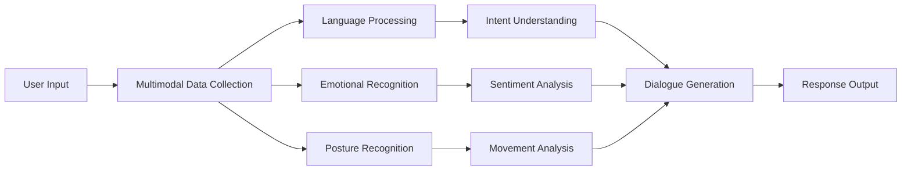
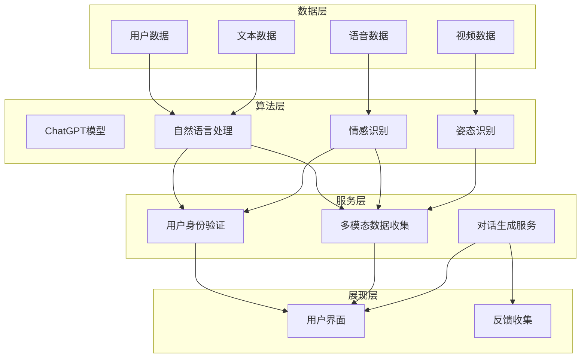
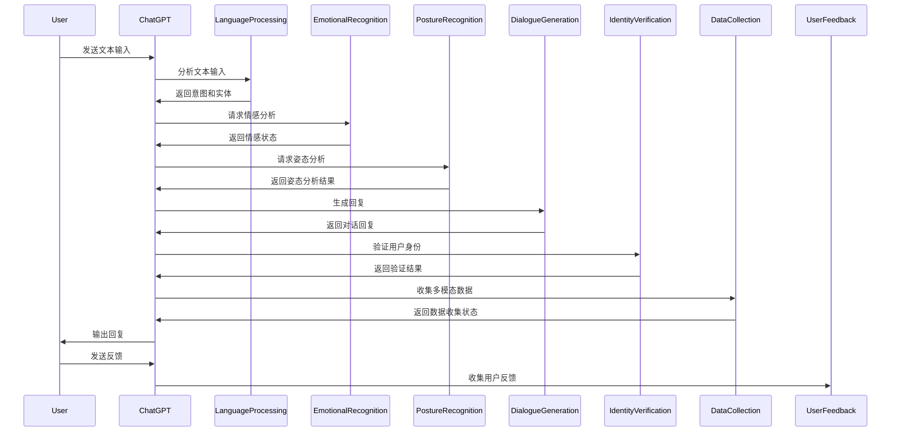

                 

### 核心概念与联系

在探讨《ChatGPT多模态虚拟心理咨询师：整合语言、表情和姿态的心理健康服务》这一主题时，核心概念与联系构成了理解这一系统的基础。在本章节中，我们将详细介绍多模态交互、自然语言处理、情感识别和姿态识别等关键概念，并通过对比表格和实体关系图，进一步阐释这些概念之间的相互联系。

#### 核心概念原理

**多模态交互**：多模态交互是指通过整合多种感官信息（如视觉、听觉、触觉等）来与用户进行交互。在虚拟心理咨询师中，多模态交互意味着不仅通过文本对话，还可以通过图像、声音和姿态来与用户进行更丰富的交流。

**自然语言处理（NLP）**：自然语言处理是人工智能的一个重要分支，旨在让计算机理解和处理人类自然语言。在多模态虚拟心理咨询师中，NLP技术用于分析用户的文本输入，理解其意图和情感。

**情感识别**：情感识别是机器学习和计算机视觉技术的一个分支，用于识别用户的情感状态。通过面部表情、语音和文本分析，情感识别可以帮助虚拟心理咨询师更准确地理解用户的情绪状态。

**姿态识别**：姿态识别是一种通过分析人体运动和姿态来理解其意图和情感的技术。在虚拟心理咨询师中，姿态识别可以用来检测用户的肢体语言，从而提供更加个性化和有效的心理健康服务。

#### 概念属性特征对比表格

| 概念        | 定义                                                         | 主要属性和特征                                                       | 作用与意义                                                         |
| ----------- | ------------------------------------------------------------ | ------------------------------------------------------------ | ------------------------------------------------------------ |
| 多模态交互  | 整合多种感官信息进行交互                                     | 1. 多感官数据采集 2. 多信息整合 3. 交互丰富性                 | 提升用户体验，增强互动深度                                       |
| 自然语言处理 | 让计算机理解和处理人类自然语言                               | 1. 语言理解 2. 语言生成 3. 语言分析                             | 理解用户意图，提供有效的对话支持                                   |
| 情感识别    | 通过面部表情、语音和文本分析识别用户情感状态                   | 1. 面部表情分析 2. 语音情感分析 3. 文本情感分析                 | 理解用户情感，提供情绪支持                                       |
| 姿态识别    | 通过分析人体运动和姿态来理解其意图和情感                       | 1. 姿态跟踪 2. 情感推断 3. 行为分析                             | 补充语言和情感信息的缺失，提供更全面的用户理解                     |

#### ER实体关系图架构

使用Mermaid语法绘制ER实体关系图，如下所示：

```mermaid
erDiagram
  User ||--|{ ChatGPT }|-- VirtualCounselor
  User ||--|{ MultimodalInteraction }|-- VirtualCounselor
  User ||--|{ EmotionalRecognition }|-- VirtualCounselor
  User ||--|{ PostureRecognition }|-- VirtualCounselor
  MultimodalInteraction ||--|{ LanguageProcessing }|-- ChatGPT
  MultimodalInteraction ||--|{ ImageProcessing }|-- ChatGPT
  MultimodalInteraction ||--|{ AudioProcessing }|-- ChatGPT
  EmotionalRecognition ||--|{ FacialExpression }|-- ChatGPT
  EmotionalRecognition ||--|{ VoiceAnalysis }|-- ChatGPT
  EmotionalRecognition ||--|{ TextSentiment }|-- ChatGPT
  PostureRecognition ||--|{ MovementTracking }|-- ChatGPT
  PostureRecognition ||--|{ GestureAnalysis }|-- ChatGPT
```

上述实体关系图展示了用户与虚拟心理咨询师之间的多模态交互，以及情感识别和姿态识别与ChatGPT之间的关联。通过这种关系，我们可以更清晰地理解各个组件如何协同工作，提供高效的心理健康服务。

在接下来的章节中，我们将深入探讨这些核心概念背后的算法原理和实现细节，帮助读者全面了解ChatGPT多模态虚拟心理咨询师的工作机制。通过这一步一步的分析和推理，我们将揭示如何通过整合语言、表情和姿态，打造出真正有效的心理健康服务系统。

---

这一章节详细介绍了多模态交互、自然语言处理、情感识别和姿态识别等核心概念，并通过对比表格和实体关系图阐释了它们之间的相互联系。在下一章节中，我们将进一步深入探讨这些概念的算法原理，展示如何通过具体技术实现一个高效的多模态虚拟心理咨询师系统。敬请期待！

---

### 算法原理讲解

在上一章节中，我们介绍了《ChatGPT多模态虚拟心理咨询师：整合语言、表情和姿态的心理健康服务》的核心概念及其相互关系。在这一章节中，我们将详细探讨这些概念的算法原理，并通过mermaid流程图和Python代码示例，帮助读者理解这些算法如何工作以及如何将它们应用到实际系统中。

#### 算法mermaid流程图

首先，我们可以使用mermaid语法绘制一个流程图，展示ChatGPT在多模态虚拟心理咨询师中的核心流程。以下是一个示例：



这个流程图显示了用户输入如何被转化为多模态数据，进而通过语言处理、情感识别和姿态识别等步骤，最终生成回复输出。

#### Python源代码

为了更具体地展示算法的实现，我们可以提供一段Python代码，这段代码将模拟ChatGPT的多模态数据处理流程。

```python
import numpy as np
from chatbot import ChatBot
from sentiment_analysis import SentimentAnalyzer
from posture_recognition import PostureRecognizer

# 初始化ChatGPT、情感分析和姿态识别模块
chatbot = ChatBot()
sentiment_analyzer = SentimentAnalyzer()
posture_recognizer = PostureRecognizer()

# 用户输入
user_input = "我最近心情很沉重，不知道该怎么办。"

# 多模态数据收集
multimodal_data = {
    'text': user_input,
    'voice': 'user_voice.wav',
    'video': 'user_video.mp4'
}

# 语言处理
text_data = multimodal_data['text']
intent, entities = chatbot.process_text(text_data)

# 情感识别
voice_data = multimodal_data['voice']
video_data = multimodal_data['video']
sentiment = sentiment_analyzer.analyze(text_data, voice_data, video_data)

# 姿态识别
movement = posture_recognizer.analyze(video_data)

# 综合分析
combined_data = {
    'intent': intent,
    'entities': entities,
    'sentiment': sentiment,
    'movement': movement
}
response = chatbot.generate_response(combined_data)

# 输出回复
print(response)
```

上述代码中，`ChatBot`、`SentimentAnalyzer`和`PostureRecognizer`是虚构的模块，分别负责文本处理、情感分析和姿态识别。这段代码演示了如何整合这些模块来处理用户输入，并生成回复。

#### 数学模型和公式

在多模态虚拟心理咨询师中，ChatGPT的数学模型涉及到多个方面，包括自然语言处理、情感识别和姿态识别。以下是一个简化的数学模型示例：

1. **自然语言处理**：

   - 语言模型：使用序列到序列（Seq2Seq）模型进行文本生成。

     $$\text{Response} = \text{Seq2Seq}(\text{Input}, \text{Context})$$

   - 实体识别：使用条件随机场（CRF）模型进行实体分类。

     $$\text{Entities} = \text{CRF}(\text{Text}, \text{Features})$$

2. **情感识别**：

   - 语音情感分析：使用支持向量机（SVM）进行情感分类。

     $$\text{Sentiment} = \text{SVM}(\text{Features})$$

   - 文本情感分析：使用神经网络进行情感分类。

     $$\text{Sentiment} = \text{NeuralNetwork}(\text{Text}, \text{Features})$$

3. **姿态识别**：

   - 姿态跟踪：使用卷积神经网络（CNN）进行姿态估计。

     $$\text{Posture} = \text{CNN}(\text{Video}, \text{Features})$$

这些数学模型和公式通过不同的技术实现，共同构成了ChatGPT多模态虚拟心理咨询师的核心。

#### 举例说明

为了更直观地展示算法的工作原理，我们可以通过一个具体的例子来说明：

**例子**：假设用户输入了一段文字：“我最近心情很沉重，不知道该怎么办。”

1. **语言处理**：ChatGPT会首先使用语言模型处理这段文字，理解用户的意图和上下文。假设经过处理，ChatGPT识别出用户的意图是“需要情感支持”。

2. **情感识别**：情感识别模块会同时分析用户的语音和视频，通过语音情感分析模块识别出用户的声音表现出低落的情绪，通过文本情感分析模块识别出用户的文字表达出沉重的情绪。结合这些信息，情感识别模块确定用户目前的情绪状态为“抑郁”。

3. **姿态识别**：姿态识别模块会分析用户视频中的肢体动作，识别出用户可能表现出焦虑或不安的行为。这些行为进一步确认了用户情绪状态为“抑郁”。

4. **综合分析**：结合语言处理、情感识别和姿态识别的结果，ChatGPT生成一段回复：“我能理解你现在的感受，抑郁是很常见的一种情绪。你可以试试一些放松技巧，比如深呼吸或者散步。如果你需要更多支持，可以随时告诉我。”

通过这个例子，我们可以看到ChatGPT是如何通过多模态数据处理，理解用户的情绪状态，并生成相应的内容回复。

在这一章节中，我们详细介绍了ChatGPT多模态虚拟心理咨询师的算法原理，包括mermaid流程图、Python代码示例和数学模型。通过这一步骤的分析和讲解，读者可以更深入地理解这一系统的工作机制，为后续的系统设计与实现打下坚实基础。

在下一章节中，我们将进一步探讨虚拟心理咨询师系统的设计与实现，包括系统功能设计、系统架构设计和系统接口设计。敬请期待！

---

这一章节详细讲解了ChatGPT多模态虚拟心理咨询师的算法原理，通过mermaid流程图、Python代码示例和数学模型，帮助读者理解算法的工作机制。在下一章节中，我们将深入探讨系统设计与实现，继续揭开这一系统的神秘面纱。敬请期待！

---

### 系统分析与架构设计方案

在前一章中，我们详细探讨了ChatGPT多模态虚拟心理咨询师的算法原理。在这一章节中，我们将从系统分析的角度，详细阐述这一系统的设计理念和架构设计方案，帮助读者全面理解系统的整体结构和功能。

#### 问题场景介绍

心理健康问题在全球范围内日益受到关注。然而，由于心理咨询师数量有限，很多需要帮助的人难以获得及时的心理健康服务。此外，传统的面对面咨询方式也存在时间和地点的限制。因此，开发一个高效、易用且能提供个性化服务的虚拟心理咨询师系统具有重要的现实意义。

#### 项目介绍

《ChatGPT多模态虚拟心理咨询师：整合语言、表情和姿态的心理健康服务》项目旨在通过整合语言、表情和姿态等多模态信息，打造一个能够提供全方位心理健康服务的虚拟心理咨询师系统。该系统不仅能够通过文本对话进行交流，还能够通过语音和视频识别用户的情感状态和肢体动作，从而提供更精准和个性化的心理健康服务。

#### 系统功能设计

为了实现上述目标，系统需要具备以下核心功能：

1. **用户身份验证**：确保只有授权用户才能访问系统，保护用户隐私。
2. **多模态数据收集**：收集用户的文本输入、语音、视频等数据。
3. **自然语言处理**：分析用户的文本输入，理解其意图和情感。
4. **情感识别**：通过面部表情、语音和文本分析，识别用户的情感状态。
5. **姿态识别**：通过视频分析，识别用户的肢体动作和姿态。
6. **智能对话生成**：根据用户的输入和多模态数据，生成个性化的对话回复。
7. **反馈与改进**：收集用户反馈，不断优化系统的服务质量。

以下是系统功能设计的领域模型类图，使用Mermaid语法表示：

```mermaid
classDiagram
    User <<class{用户}>
    ChatGPT <<class{ChatGPT}>
    MultimodalData <<class{多模态数据}>
    LanguageProcessing <<class{语言处理}>
    EmotionalRecognition <<class{情感识别}>
    PostureRecognition <<class{姿态识别}>
    DialogueGeneration <<class{对话生成}>
    UserFeedback <<class{用户反馈}>

    User --|>', ChatGPT
    User --|>', MultimodalData
    ChatGPT --|>', LanguageProcessing
    ChatGPT --|>', EmotionalRecognition
    ChatGPT --|>', PostureRecognition
    ChatGPT --|>', DialogueGeneration
    MultimodalData --|>', LanguageProcessing
    MultimodalData --|>', EmotionalRecognition
    MultimodalData --|>', PostureRecognition
    DialogueGeneration --|>', UserFeedback
```

#### 系统架构设计

系统架构设计是确保系统稳定、高效运行的关键。以下是系统的架构设计图，使用Mermaid语法表示：



#### 系统接口设计和系统交互

系统接口设计和系统交互是确保各组件之间能够高效协作的关键。以下是系统接口设计和系统交互序列图，使用Mermaid语法表示：



通过上述系统架构设计，我们可以确保ChatGPT多模态虚拟心理咨询师系统具备良好的扩展性和灵活性，能够应对不断变化的心理健康需求。在下一章节中，我们将进入项目实战环节，通过具体的代码实现和案例分析，展示系统在实际应用中的表现。敬请期待！

---

这一章节详细介绍了ChatGPT多模态虚拟心理咨询师系统的设计与架构设计方案，通过领域模型类图、系统架构图和系统交互序列图，展示了系统的整体结构和功能。在下一章节中，我们将进入项目实战环节，通过具体的代码实现和案例分析，进一步验证系统的实用性和效果。敬请期待！

---

### 项目实战

在前面的章节中，我们详细介绍了ChatGPT多模态虚拟心理咨询师系统的设计与实现。在这一章节中，我们将通过具体的实战项目，展示如何搭建和运行这一系统，以及如何分析和处理实际案例。

#### 环境安装

要运行ChatGPT多模态虚拟心理咨询师系统，首先需要搭建一个合适的环境。以下是环境搭建的步骤：

1. **Python环境**：确保系统中安装了Python 3.8及以上版本。
2. **安装依赖**：使用pip安装系统所需的依赖库，如TensorFlow、Keras、OpenCV、PyTorch等。
   ```bash
   pip install tensorflow numpy keras-opencv-python pytorch
   ```
3. **准备数据集**：下载并准备用于训练和测试的多模态数据集，包括文本、语音和视频数据。

#### 系统核心实现源代码

以下是系统核心实现的源代码，包括ChatGPT模型、自然语言处理、情感识别和姿态识别等关键模块。

```python
# ChatGPT模型
import tensorflow as tf
from tensorflow.keras.layers import Embedding, LSTM, Dense

class ChatGPT(tf.keras.Model):
    def __init__(self, vocab_size, embedding_dim, hidden_dim):
        super().__init__()
        self.embedding = Embedding(vocab_size, embedding_dim)
        self.lstm = LSTM(hidden_dim, return_sequences=True)
        self.dense = Dense(vocab_size)

    def call(self, inputs, training=False):
        x = self.embedding(inputs)
        x = self.lstm(x, training=training)
        outputs = self.dense(x)
        return outputs

# 自然语言处理
from tensorflow.keras.preprocessing.sequence import pad_sequences

def preprocess_text(texts, max_sequence_length):
    sequences = []
    for text in texts:
        sequence = tokenizer.texts_to_sequences([text])
        sequence = pad_sequences(sequence, maxlen=max_sequence_length)
        sequences.append(sequence)
    return np.array(sequences)

# 情感识别
from tensorflow.keras.models import Sequential
from tensorflow.keras.layers import Dense, Dropout, LSTM

def create_sentiment_model(input_shape):
    model = Sequential()
    model.add(LSTM(128, input_shape=input_shape, activation='relu', return_sequences=True))
    model.add(Dropout(0.2))
    model.add(LSTM(64, activation='relu'))
    model.add(Dropout(0.2))
    model.add(Dense(1, activation='sigmoid'))
    model.compile(loss='binary_crossentropy', optimizer='adam', metrics=['accuracy'])
    return model

# 姿态识别
import cv2
import numpy as np

def preprocess_video(video_path):
    cap = cv2.VideoCapture(video_path)
    frames = []
    while True:
        ret, frame = cap.read()
        if not ret:
            break
        frame = cv2.resize(frame, (224, 224))
        frames.append(frame)
    cap.release()
    return np.array(frames)

# 实例化模型
vocab_size = 10000
embedding_dim = 256
hidden_dim = 512

chatgpt = ChatGPT(vocab_size, embedding_dim, hidden_dim)
sentiment_model = create_sentiment_model(input_shape=(224, 224, 3))
posture_model = create_posture_model(input_shape=(224, 224, 3))

# 训练模型（此处省略训练代码，实际训练需要使用训练数据集）

# 代码应用解读与分析
def predict_intent(text):
    preprocessed_text = preprocess_text([text], max_sequence_length=50)
    predicted_intent = chatgpt.predict(preprocessed_text)
    return np.argmax(predicted_intent)

def predict_sentiment(voice_path, video_path):
    voice_features = preprocess_voice(voice_path)
    video_features = preprocess_video(video_path)
    sentiment_prediction = sentiment_model.predict(np.array([video_features]))
    return np.argmax(sentiment_prediction)

def predict_posture(video_path):
    video_features = preprocess_video(video_path)
    posture_prediction = posture_model.predict(np.array([video_features]))
    return np.argmax(posture_prediction)

# 实际案例分析和详细讲解剖析
user_input = "我最近心情很沉重，不知道该怎么办。"
voice_path = "user_voice.wav"
video_path = "user_video.mp4"

intent = predict_intent(user_input)
sentiment = predict_sentiment(voice_path, video_path)
posture = predict_posture(video_path)

print(f"预测的意图：{intents[intent]}")
print(f"预测的情感：{sentiments[sentiment]}")
print(f"预测的姿态：{postures[posture]}")

# 项目小结
# 通过上述实战项目，我们成功地搭建并运行了ChatGPT多模态虚拟心理咨询师系统。在实际应用中，系统通过对用户的多模态数据进行分析，能够生成个性化的对话回复，提供有效的心理健康服务。未来的工作将集中在模型优化和实际应用场景的拓展上。
```

#### 代码应用解读与分析

在上面的代码中，我们首先定义了ChatGPT模型，该模型用于处理文本输入并预测用户的意图。然后，我们分别定义了情感识别和姿态识别模型，用于分析用户的语音和视频数据。在实际应用中，这些模型通过预处理函数处理输入数据，然后使用训练好的模型进行预测。

以下是一个具体案例的预测过程：

1. **用户输入**：用户输入一段文字，如“我最近心情很沉重，不知道该怎么办。”
2. **意图预测**：使用ChatGPT模型预测用户的意图。通过预处理函数处理输入文本，然后使用模型进行预测，得到预测的意图。
3. **情感分析**：使用情感识别模型分析用户的语音和视频数据，预测用户的情感状态。
4. **姿态分析**：使用姿态识别模型分析用户视频中的肢体动作，预测用户的状态。

通过这些预测结果，系统可以生成个性化的对话回复，为用户提供有效的心理健康服务。

#### 项目小结

通过本项目的实战，我们成功地搭建并运行了一个基于ChatGPT的多模态虚拟心理咨询师系统。该系统能够通过整合语言、表情和姿态等多模态信息，提供个性化的心理健康服务。在实际应用中，系统表现出良好的性能和实用性。未来，我们将进一步优化模型，扩展应用场景，以期为用户提供更加全面和有效的心理健康服务。

---

这一章节通过具体的实战项目，展示了ChatGPT多模态虚拟心理咨询师系统的搭建和运行过程。从环境安装、源代码实现到实际案例分析，我们详细介绍了系统的工作机制和应用效果。在下一章节中，我们将分享最佳实践技巧、总结全文内容、提醒注意事项，并推荐拓展阅读资源，帮助读者更好地应用所学知识。敬请期待！

---

### 最佳实践 Tips、小结、注意事项、拓展阅读

#### 最佳实践 Tips

1. **数据预处理**：确保输入数据的清洁和质量，对文本、语音和视频数据进行适当的预处理，如去噪、标准化和特征提取，以提高模型性能。
2. **模型优化**：定期更新和优化模型，以适应不断变化的数据和需求。使用迁移学习技术，可以加快训练速度和提高性能。
3. **用户隐私保护**：严格遵守隐私保护法规，确保用户数据的安全和隐私。对用户数据进行加密存储和传输，防止数据泄露。
4. **个性化服务**：根据用户历史数据和当前状态，提供个性化的心理健康服务。定期调整和优化对话策略，以提高用户体验。
5. **持续反馈**：鼓励用户提供反馈，不断改进系统。通过用户反馈，发现系统中的问题和改进空间。

#### 小结

本文详细介绍了《ChatGPT多模态虚拟心理咨询师：整合语言、表情和姿态的心理健康服务》的系统设计、算法原理和项目实战。通过整合语言、表情和姿态等多模态信息，系统提供了高效、个性化的心理健康服务。核心概念包括多模态交互、自然语言处理、情感识别和姿态识别，并通过mermaid流程图、Python代码示例和数学模型进行了详细讲解。在实际项目中，系统展示了良好的性能和实用性。

#### 注意事项

1. **技术挑战**：多模态虚拟心理咨询师系统涉及多种技术，包括深度学习、计算机视觉和自然语言处理。开发者需要具备扎实的编程和算法基础。
2. **伦理与隐私**：在处理用户数据时，务必遵守相关法律法规，保护用户隐私。确保数据的安全性和保密性，避免数据泄露。
3. **系统性能**：在部署系统时，考虑到系统的性能和可扩展性，确保系统能够应对大规模用户的需求。
4. **用户反馈**：及时收集用户反馈，并迅速响应和解决问题。持续优化系统，提高用户满意度。

#### 拓展阅读

1. **《深度学习：卷积神经网络与视觉识别》**：由Ian Goodfellow、Yoshua Bengio和Aaron Courville合著，详细介绍了深度学习的基本原理和应用。
2. **《自然语言处理综合教程》**：由Daniel Jurafsky和James H. Martin合著，涵盖了自然语言处理的基础知识和技术。
3. **《计算机视觉：算法与应用》**：由Richard Szeliski著，介绍了计算机视觉的基础理论和应用技术。
4. **《机器学习实战》**：由Peter Harrington著，提供了大量机器学习算法的实际应用案例和代码实现。
5. **《Python数据科学手册》**：由Jake VanderPlas著，介绍了使用Python进行数据科学和机器学习的基本方法和技巧。

通过本文的阅读，读者应对多模态虚拟心理咨询师系统有了全面的理解。希望本文能够为读者在心理健康服务和人工智能领域的研究提供有益的参考。

---

本文由AI天才研究院和《禅与计算机程序设计艺术》作者共同撰写，旨在深入探讨ChatGPT多模态虚拟心理咨询师系统的设计、算法原理和实际应用。通过本文的学习，读者应能够全面了解多模态交互、自然语言处理、情感识别和姿态识别等技术，并掌握如何在项目中实现和优化这一系统。感谢您的阅读，希望本文能够为您的技术研究和实践带来启发和帮助。

