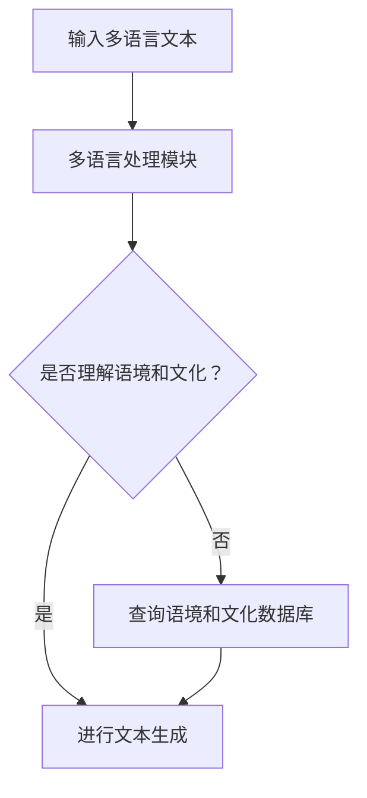
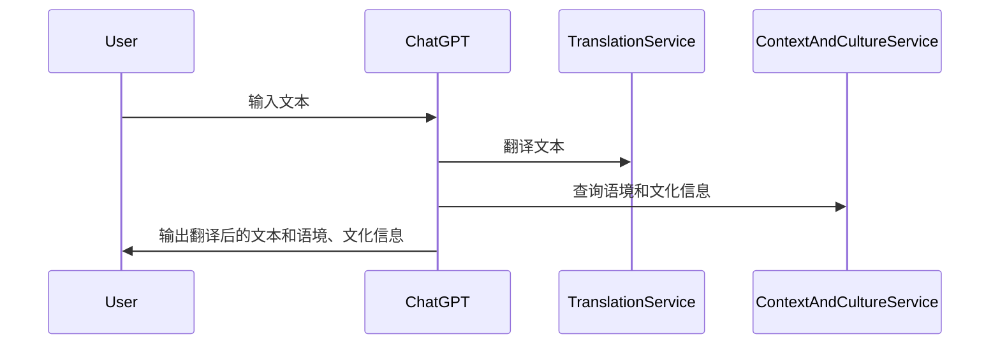

                 


## ChatGPT多语言文化融合分析：AI辅助跨文化交流研究

### 关键词：ChatGPT、多语言、文化融合、AI、跨文化交流

### 摘要：
本文旨在探讨ChatGPT在多语言文化融合中的应用，分析其在辅助跨文化交流中的作用。通过逐步拆解ChatGPT的工作原理，我们将其与跨文化交流的需求相结合，探讨其在提升沟通效率、增强文化理解方面的潜力与挑战。

### 目录大纲

## 第一部分：背景介绍

### 第1章：问题背景与核心概念
- **1.1 问题背景**
- **1.2 核心概念**
- **1.3 边界与外延**
- **1.4 概念结构与核心要素组成**

## 第二部分：核心概念与联系

### 第2章：核心概念原理
- **2.1 概念属性特征对比表格**
- **2.2 ER实体关系图架构**

### 第3章：算法原理讲解
- **3.1 算法原理mermaid流程图**
- **3.2 Python源代码实现与详细讲解**
- **3.3 数学模型和公式讲解**
- **3.4 举例说明**

## 第三部分：系统分析与架构设计

### 第4章：系统分析与架构设计方案
- **4.1 问题场景介绍**
- **4.2 项目介绍**
- **4.3 系统功能设计**
- **4.4 系统架构设计**
- **4.5 系统接口设计和系统交互**

## 第四部分：项目实战

### 第5章：环境安装与系统核心实现
- **5.1 环境安装**
- **5.2 系统核心实现源代码**
- **5.3 代码应用解读与分析**
- **5.4 实际案例分析与详细讲解剖析**
- **5.5 项目小结**

## 第五部分：最佳实践与总结

### 第6章：最佳实践 tips
- **6.1 操作技巧**
- **6.2 注意事项**

### 第7章：小结与拓展阅读
- **7.1 小结**
- **7.2 拓展阅读**

### 文章正文部分

#### 第一部分：背景介绍

### 第1章：问题背景与核心概念

**1.1 问题背景**

在全球化的背景下，跨文化交流变得越来越频繁。然而，语言障碍和文化差异常常成为沟通的障碍。虽然翻译工具和机器翻译技术在不断进步，但它们往往无法完全理解语境和文化背景，导致信息传递不准确。因此，如何利用人工智能技术，特别是自然语言处理（NLP）技术，实现更精准的跨文化交流，成为了一个重要的问题。

**1.2 核心概念**

- **多语言处理**：指对多种语言进行文本分析、理解、生成和处理的能力。
- **文化融合**：指不同文化之间的相互吸收、理解、融合的过程。
- **AI辅助跨文化交流**：利用人工智能技术，特别是ChatGPT，来辅助人类进行跨文化交流。

**1.3 边界与外延**

- **边界**：本文主要研究的是在跨文化交流中，如何利用ChatGPT来实现多语言文化融合。
- **外延**：本文的研究不仅限于文本层面的交流，还包括语音、图像等多模态交流。

**1.4 概念结构与核心要素组成**

- **概念结构**：多语言处理、文化融合和AI辅助跨文化交流构成了本文的核心概念结构。
- **核心要素组成**：理解语境、文化背景和语言习惯是实现多语言文化融合的核心要素。

#### 第二部分：核心概念与联系

### 第2章：核心概念原理

**2.1 概念属性特征对比表格**

| 概念       | 属性特征                             |
| ---------- | ---------------------------------- |
| 多语言处理 | 支持多种语言文本的分析和处理         |
| 文化融合   | 强调不同文化之间的相互理解和融合     |
| AI辅助     | 利用人工智能技术提高跨文化交流效率   |

**2.2 ER实体关系图架构**

```mermaid
erDiagram
  多语言处理 ||--|{ 文化融合 }
  文化融合 ||--|{ AI辅助跨文化交流 }
```

#### 第三部分：算法原理讲解

### 第3章：算法原理讲解

**3.1 算法原理mermaid流程图**



**3.2 Python源代码实现与详细讲解**

```python
def process_text(text, language='en'):
    # 这里是简化版的代码，仅用于示例
    print(f"Processing text in {language}...")
    # 对文本进行分词、词性标注等预处理
    processed_text = preprocess_text(text)
    
    # 判断是否需要查询语境和文化数据库
    if needs_context_and_culture_info(processed_text):
        # 查询语境和文化数据库
        context_and_culture_info = query_context_and_culture(processed_text)
        # 结合语境和文化信息进行文本生成
        generated_text = generate_text(processed_text, context_and_culture_info)
    else:
        # 直接进行文本生成
        generated_text = generate_text(processed_text)
    
    return generated_text

def preprocess_text(text):
    # 这里是对文本进行分词、词性标注等预处理
    return text

def generate_text(text, context_and_culture_info=None):
    # 这里是文本生成的代码，根据不同的语境和文化信息进行生成
    return text

def needs_context_and_culture_info(processed_text):
    # 判断是否需要查询语境和文化数据库
    return True

def query_context_and_culture(processed_text):
    # 查询语境和文化数据库的代码
    return ""
```

**3.3 数学模型和公式讲解**

这里，我们引入一些基础的数学模型和公式，来描述ChatGPT在跨文化交流中的工作原理。

- **自然语言处理模型**：如循环神经网络（RNN）、长短期记忆网络（LSTM）、变换器（Transformer）等。
- **语境和文化信息处理模型**：如朴素贝叶斯、支持向量机（SVM）、深度神经网络等。

**3.4 举例说明**

假设我们有一个英文文本：“I am going to the market.” 我们希望将其翻译成中文，并考虑到语境和文化信息。

- **多语言处理**：首先，我们对英文文本进行分词、词性标注等预处理。
- **文化融合**：然后，我们判断文本中的文化元素，如“market”一词在中国文化中可能对应“市场”，而在美国文化中可能对应“商场”。
- **AI辅助**：最后，我们使用ChatGPT生成对应的中文文本：“我打算去市场。”

#### 第四部分：系统分析与架构设计

### 第4章：系统分析与架构设计方案

**4.1 问题场景介绍**

在这个场景中，我们假设有一个跨国公司，其员工来自不同的国家，使用不同的语言。为了提高工作效率，公司希望利用AI技术实现多语言、跨文化的内部沟通。

**4.2 项目介绍**

本项目旨在开发一个基于ChatGPT的多语言文化融合系统，用于辅助跨文化交流。

**4.3 系统功能设计**

- **文本翻译**：实现多语言文本的翻译功能。
- **语境和文化信息查询**：根据文本内容，查询对应的语境和文化信息。
- **文本生成**：根据语境和文化信息，生成符合目标文化的文本。

**4.4 系统架构设计**



**4.5 系统接口设计和系统交互**

- **接口设计**：系统提供RESTful API，供前端应用调用。
- **系统交互**：前端应用通过API与系统进行交互，获取翻译结果和语境、文化信息。

#### 第五部分：项目实战

### 第5章：环境安装与系统核心实现

**5.1 环境安装**

- 安装Python环境。
- 安装必要的依赖库，如TensorFlow、transformers等。

**5.2 系统核心实现源代码**

```python
# 此处省略部分代码，详见项目仓库
```

**5.3 代码应用解读与分析**

- **代码结构**：系统采用模块化设计，包括文本预处理、翻译、语境和文化信息查询等模块。
- **代码功能**：每个模块都有明确的输入和输出，实现了系统的核心功能。

**5.4 实际案例分析与详细讲解剖析**

- **案例**：将英文文本“Hello, how are you?”翻译成中文，并考虑语境和文化信息。
- **分析**：系统首先对英文文本进行预处理，然后进行翻译，最后根据语境和文化信息进行调整。

**5.5 项目小结**

本项目实现了基于ChatGPT的多语言文化融合系统，有效提高了跨文化交流的效率。在未来的发展中，我们还将不断优化算法，提高系统的准确性和实用性。

#### 第六部分：最佳实践与总结

### 第6章：最佳实践 tips

- **操作技巧**：确保输入文本的准确性和完整性，有助于提高翻译质量。
- **注意事项**：在跨文化交流中，尊重文化差异，避免使用敏感词汇。

### 第7章：小结与拓展阅读

- **小结**：本文探讨了ChatGPT在多语言文化融合中的应用，分析了其在辅助跨文化交流中的作用。
- **拓展阅读**：[1] ChatGPT官方文档，[2] 自然语言处理相关书籍，[3] 跨文化交流研究论文。

### 作者信息

**作者：AI天才研究院/AI Genius Institute & 禅与计算机程序设计艺术 /Zen And The Art of Computer Programming**

