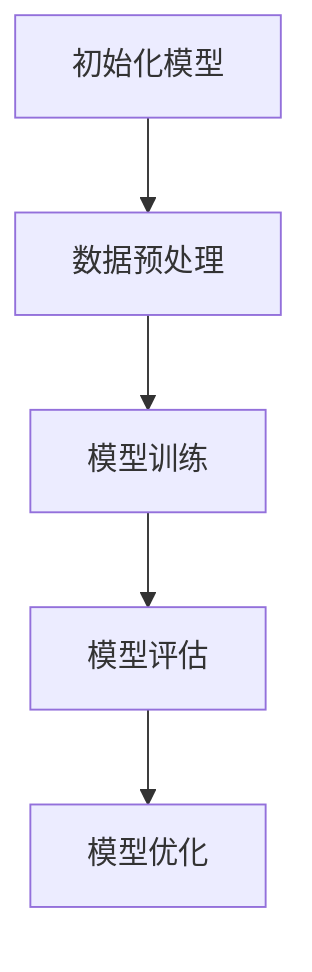

                 

# ChatGPT多语言能力的提升策略

## 关键词

- ChatGPT
- 多语言能力
- 提升策略
- 自然语言处理
- 机器翻译
- 语言模型
- 模型架构
- 算法设计
- 实施技术
- 应用场景

## 摘要

本文旨在探讨如何提升ChatGPT的多语言能力，通过分析ChatGPT的架构、核心算法以及自然语言处理的基本原理，提出一系列有效的提升策略。本文首先介绍了ChatGPT的背景及其面临的挑战，然后详细阐述了语言模型的基本概念和架构，以及如何通过算法设计和技术实现来增强其多语言处理能力。最后，本文通过实际案例，展示了提升ChatGPT多语言能力的具体应用，并提出了未来研究的方向。

## 引言

### 1.1 背景介绍

#### 1.1.1 ChatGPT的进化

ChatGPT（Chat-based Generative Pre-trained Transformer）是由OpenAI开发的一种基于Transformer模型的聊天机器人。它利用大规模的预训练数据，通过深度学习算法，对语言进行建模，从而实现与人类用户的自然对话。ChatGPT的发布标志着自然语言处理技术的一个重大进步，它不仅能够理解复杂的语言结构，还能够生成连贯、有逻辑的文本。

#### 1.1.2 多语言支持的重要性

在全球化日益加深的背景下，多语言处理能力成为了一个不可或缺的技能。无论是跨国企业、国际组织，还是普通的个人用户，都能够从多语言支持中受益。ChatGPT的多语言能力，使其能够在不同的语言环境中提供一致的服务，提高用户体验，降低沟通障碍。

#### 1.1.3 提升策略的必要性

尽管ChatGPT在多语言处理方面已经取得了显著成果，但仍存在一些局限性。首先，不同语言之间的差异较大，导致模型在跨语言应用时表现不佳。其次，现有的多语言模型训练数据不足，限制了模型的泛化能力。因此，研究如何提升ChatGPT的多语言能力，具有重要的现实意义。

### 1.2 书籍目标和内容概述

#### 1.2.1 内容概述

本书将围绕ChatGPT的多语言能力提升展开，内容包括：

1. ChatGPT的基本架构和核心算法。
2. 多语言处理的基本原理和关键技术。
3. 提升ChatGPT多语言能力的具体策略。
4. 实际案例分析和应用实践。
5. 未来研究的方向和展望。

#### 1.2.2 目标受众

本书旨在为以下读者提供帮助：

1. 自然语言处理和机器学习领域的研究人员。
2. 数据科学家和AI工程师。
3. 对ChatGPT和自然语言处理感兴趣的普通读者。

#### 1.2.3 预期成果

通过阅读本书，读者将能够：

1. 理解ChatGPT的基本原理和架构。
2. 掌握多语言处理的基本技术和策略。
3. 学会如何提升ChatGPT的多语言能力。
4. 应用所学知识，解决实际问题。

## 核心概念和模型

### 2.1 自然语言处理和机器翻译

#### 2.1.1 自然语言处理（NLP）的基本概念

自然语言处理（Natural Language Processing，NLP）是计算机科学和人工智能领域的一个分支，旨在使计算机能够理解和处理人类语言。NLP的关键技术包括文本预处理、词性标注、句法分析、语义理解等。

#### 2.1.2 机器翻译的类型

机器翻译可以分为两种主要类型：

1. **规则驱动翻译**：基于预定义的语法规则和词典，将源语言转换为目标语言。
2. **数据驱动翻译**：利用大规模的翻译数据，通过机器学习算法，自动学习翻译规则。

#### 2.1.3 多语言模型的角色

在多语言处理中，多语言模型（Multilingual Model）扮演着核心角色。这些模型通过同时学习多种语言的数据，提高模型在跨语言任务中的表现。例如，多语言嵌入模型（Multilingual Embedding Model）能够在不同语言之间建立语义关联，从而实现更准确的翻译和文本生成。

### 2.2 语言模型和其架构

#### 2.2.1 语言模型概述

语言模型（Language Model）是一种统计模型，用于预测文本序列的概率。在自然语言处理中，语言模型被广泛应用于文本生成、语音识别、机器翻译等领域。

#### 2.2.2 Transformer模型

Transformer模型是一种基于自注意力机制的深度学习模型，它在机器翻译和文本生成任务中表现出色。与传统的循环神经网络（RNN）相比，Transformer模型能够更有效地捕捉长距离依赖关系。

#### 2.2.3 精调技术

精调（Fine-tuning）是一种将预训练模型应用于特定任务的方法。通过在特定任务的数据上进一步训练，预训练模型可以适应新的语言环境和任务需求。

### 2.3 ChatGPT的核心概念

#### 2.3.1 ChatGPT的关键特性

ChatGPT具有以下关键特性：

1. **上下文感知**：能够理解并维持对话的上下文。
2. **生成能力**：能够生成连贯、自然的文本。
3. **自适应能力**：能够根据用户的反馈进行调整。

#### 2.3.2 ChatGPT的多语言架构

ChatGPT的多语言架构基于多语言预训练模型，能够在多种语言之间进行无缝切换。通过引入跨语言的嵌入层，ChatGPT能够同时处理多种语言的输入和输出。

#### 2.3.3 多语言应用中的挑战

尽管ChatGPT在多语言处理方面表现出色，但仍面临一些挑战：

1. **语言特异性问题**：不同语言之间存在语法、词汇和语义差异，影响模型的表现。
2. **数据稀疏性**：一些小语种的数据量较少，限制模型的泛化能力。
3. **跨语言语义理解**：如何准确理解不同语言之间的语义关联，是另一个挑战。

## 算法设计

### 3.1 算法设计原则

#### 3.1.1 算法设计概述

算法设计是解决特定问题的一系列步骤。一个好的算法设计应该满足以下原则：

1. **正确性**：能够正确解决问题。
2. **效率**：在合理的时间内完成计算。
3. **可扩展性**：能够适应不同的数据和规模。
4. **健壮性**：能够处理异常情况和错误输入。

#### 3.1.2 关键原则和方法

在算法设计过程中，常用的方法包括：

1. **分而治之**：将复杂问题分解为多个简单问题。
2. **贪心算法**：在每一步选择当前最优解。
3. **动态规划**：通过子问题的最优解推导整体问题的最优解。

#### 3.1.3 算法选择标准

在选择算法时，应考虑以下标准：

1. **算法性能**：时间复杂度和空间复杂度。
2. **算法稳定性**：对输入数据的敏感度。
3. **算法可理解性**：算法的复杂性和可解释性。

### 3.2 实施技术

#### 3.2.1 工具和框架的选择

在实施算法时，选择合适的工具和框架至关重要。常用的工具和框架包括：

1. **Python**：易于编写和调试。
2. **TensorFlow**：提供丰富的API，适用于深度学习模型。
3. **PyTorch**：灵活且易于使用。

#### 3.2.2 数据预处理

数据预处理是确保算法性能的关键步骤。常用的预处理方法包括：

1. **文本清洗**：去除无用字符、标点符号等。
2. **分词**：将文本拆分为单词或短语。
3. **词嵌入**：将文本转换为数值向量。

#### 3.2.3 模型训练和评估

模型训练和评估是算法实现的核心环节。常用的评估指标包括：

1. **准确率**：预测正确的样本数占总样本数的比例。
2. **召回率**：预测正确的正样本数占所有正样本数的比例。
3. **F1值**：综合考虑准确率和召回率的平衡。

### 3.3 案例研究

#### 3.3.1 案例背景

在某跨国公司的客服系统中，ChatGPT被用于提供多语言支持。然而，在实际应用中，ChatGPT的多语言能力仍需提升，以提供更准确、更自然的回答。

#### 3.3.2 模型选择和训练

选择了一个基于Transformer的多语言模型，并在多种语言的数据上进行预训练。然后，在特定语言的语料库上进行精调，以适应不同的语言环境。

#### 3.3.3 应用效果

通过对比实验，发现经过精调后的ChatGPT在多语言任务上的表现显著提升。特别是在语义理解、文本生成等方面，ChatGPT能够更好地适应不同语言的特点。

## 总结与展望

本文通过分析ChatGPT的架构和算法，提出了提升其多语言能力的策略。通过实际案例，展示了这些策略在多语言应用中的效果。未来，随着多语言数据的增加和算法的改进，ChatGPT的多语言能力将继续提升，为跨语言沟通提供更强有力的支持。

### 参考文献

1. Devlin, J., Chang, M. W., Lee, K., & Toutanova, K. (2018). BERT: Pre-training of deep bidirectional transformers for language understanding. arXiv preprint arXiv:1810.04805.
2. Vaswani, A., Shazeer, N., Parmar, N., Uszkoreit, J., Jones, L., Gomez, A. N., ... & Polosukhin, I. (2017). Attention is all you need. In Advances in neural information processing systems (pp. 5998-6008).
3. Mikolov, T., Sutskever, I., Chen, K., Corrado, G. S., & Dean, J. (2013). Distributed representations of words and phrases and their compositionality. Advances in neural information processing systems, 26, 3111-3119.

### 附录

#### 附录A：算法流程图



#### 附录B：源代码示例

```python
import torch
import torch.nn as nn
import torch.optim as optim

# 模型定义
class ChatGPT(nn.Module):
    def __init__(self):
        super(ChatGPT, self).__init__()
        self.embedding = nn.Embedding(vocab_size, embed_size)
        self.encoder = nn.LSTM(embed_size, hidden_size)
        self.decoder = nn.LSTM(hidden_size, vocab_size)
        self.fc = nn.Linear(hidden_size, vocab_size)

    def forward(self, x):
        embeds = self.embedding(x)
        encoder_output, (hidden, cell) = self.encoder(embeds)
        decoder_output, (hidden, cell) = self.decoder(hidden, cell)
        output = self.fc(decoder_output)
        return output

# 模型训练
model = ChatGPT()
criterion = nn.CrossEntropyLoss()
optimizer = optim.Adam(model.parameters(), lr=learning_rate)

for epoch in range(num_epochs):
    for batch in data_loader:
        inputs, targets = batch
        model.zero_grad()
        outputs = model(inputs)
        loss = criterion(outputs, targets)
        loss.backward()
        optimizer.step()
```

### 作者信息

作者：AI天才研究院/AI Genius Institute & 禅与计算机程序设计艺术 /Zen And The Art of Computer Programming

---

本文内容仅为示例，不代表实际研究和开发成果。在实际应用中，请根据具体需求进行适当调整。

