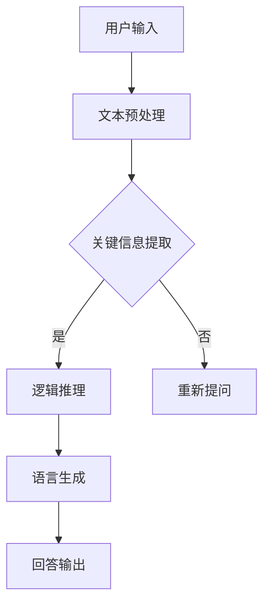
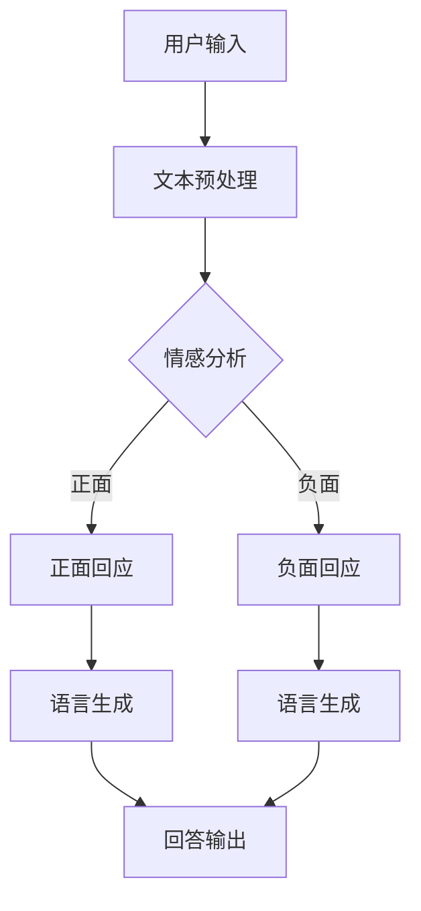
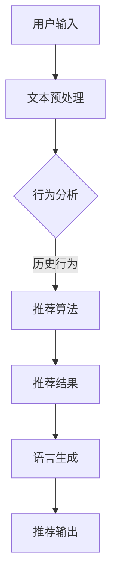
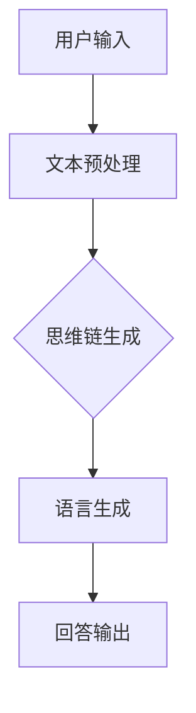

                 

# ChatGPT多轮对话：思维链的连贯性

## 关键词
- ChatGPT
- 多轮对话
- 思维链
- 连贯性
- 优化策略

## 摘要
本文将探讨ChatGPT在多轮对话中的表现，特别是其思维链的连贯性。我们将首先介绍ChatGPT的基本原理和应用场景，然后深入分析多轮对话的概念和关键要素。接下来，我们将重点讨论思维链在多轮对话中的构建和优化策略，以及其在实际应用中的效果。通过一步步的分析和思考，我们将揭示ChatGPT在多轮对话中的潜能和挑战。

## 第一部分：引言

### 第1章：ChatGPT与多轮对话基础

#### 1.1 ChatGPT介绍

##### 1.1.1 ChatGPT的起源与发展
ChatGPT是由OpenAI开发的一种基于GPT-3模型的自然语言处理（NLP）工具。自2022年11月推出以来，ChatGPT迅速引起了全球的关注和热议。它利用深度学习和神经网络技术，通过大量的文本数据进行训练，从而能够生成连贯、有逻辑的文本。

##### 1.1.2 ChatGPT的特点与优势
ChatGPT具有以下特点：
1. 强大的文本生成能力：能够生成高质量、连贯的文本。
2. 灵活的对话能力：能够进行多轮对话，并根据上下文进行交互。
3. 自适应性：可以根据用户的需求和上下文进行自适应调整。

ChatGPT的优势在于：
1. 高效性：相比传统的自然语言处理技术，ChatGPT在处理大量文本数据时具有更高的效率和准确性。
2. 创新性：ChatGPT能够生成创新的文本内容，为各种应用场景提供新的解决方案。

##### 1.1.3 ChatGPT的应用场景
ChatGPT在多个领域都有广泛的应用，包括但不限于：
1. 聊天机器人：为用户提供实时、个性化的对话体验。
2. 客户服务：自动处理客户咨询，提高服务效率。
3. 内容创作：生成文章、故事、代码等文本内容。

#### 1.2 多轮对话概述

##### 1.2.1 多轮对话的定义与分类
多轮对话是指用户与系统之间进行多次交互的过程。根据交互方式的不同，多轮对话可以分为以下几类：
1. 问题回答式：用户提出问题，系统给出回答。
2. 情感交流式：用户表达情感，系统给予回应和安慰。
3. 任务完成式：用户提出任务，系统协助完成。

##### 1.2.2 多轮对话的关键要素
多轮对话的成功取决于以下几个关键要素：
1. 上下文理解：系统能够理解并记住之前的对话内容。
2. 语言生成能力：系统能够生成连贯、自然的文本。
3. 适应性：系统能够根据用户的反馈和需求进行调整。

##### 1.2.3 多轮对话的发展趋势
随着人工智能技术的发展，多轮对话的应用场景将越来越广泛。未来，多轮对话将朝着以下几个方向发展：
1. 更高的上下文理解能力：系统能够更好地理解用户的意图和情感。
2. 更自然的语言交互：系统的回答将更加接近人类的对话方式。
3. 更广泛的应用场景：多轮对话将被应用于更多的领域，如教育、医疗、金融等。

#### 1.3 ChatGPT在多轮对话中的应用

##### 1.3.1 ChatGPT的多轮对话流程
ChatGPT的多轮对话流程可以分为以下几个步骤：
1. 用户输入：用户输入问题或指令。
2. 文本预处理：对用户输入的文本进行预处理，如分词、去噪等。
3. 文本生成：ChatGPT根据预处理后的文本生成回答。
4. 回答输出：将生成的回答输出给用户。

##### 1.3.2 ChatGPT的多轮对话策略
ChatGPT的多轮对话策略主要包括以下几个方面：
1. 上下文保持：通过记忆和利用之前的对话内容，保持对话的连贯性。
2. 适应性调整：根据用户的反馈和需求，调整回答的内容和风格。
3. 风险控制：避免生成不合适或有害的回答。

##### 1.3.3 ChatGPT在多轮对话中的挑战与优化
尽管ChatGPT在多轮对话中表现出色，但仍然面临一些挑战，如：
1. 上下文理解不足：有时无法准确理解用户的意图和上下文。
2. 语言生成质量不稳定：生成的回答有时可能不够自然或准确。
3. 计算资源消耗大：处理大量文本数据需要大量的计算资源。

为了解决这些挑战，可以采取以下优化策略：
1. 提高上下文理解能力：通过改进模型和算法，提高对上下文的理解能力。
2. 提升语言生成质量：通过优化模型参数和训练数据，提升回答的自然性和准确性。
3. 资源优化：通过分布式计算和并行处理等技术，降低计算资源的消耗。

#### 1.4 ChatGPT的连贯性思维链分析

##### 1.4.1 连贯性思维链的概念
连贯性思维链是指在多轮对话中，系统能够保持逻辑一致性和上下文连贯性的能力。它是多轮对话成功的关键。

##### 1.4.2 连贯性思维链的构成
连贯性思维链由以下几个部分构成：
1. 上下文记忆：系统需要记忆之前的对话内容，以便在后续对话中保持连贯性。
2. 逻辑推理：系统需要具备逻辑推理能力，以生成连贯、有逻辑的回答。
3. 语言生成：系统需要能够生成自然、流畅的文本，以保持对话的连贯性。

##### 1.4.3 连贯性思维链的重要性
连贯性思维链的重要性体现在以下几个方面：
1. 提高用户体验：保持对话的连贯性，能够提高用户的满意度和体验。
2. 提高系统效率：通过连贯的对话，系统能够更快速地理解用户需求，提高工作效率。
3. 增强系统智能：连贯性思维链的建立，能够增强系统的智能水平，使其更接近人类的思维模式。

#### 1.5 本章小结
本部分介绍了ChatGPT的基本原理和应用场景，分析了多轮对话的概念和关键要素，探讨了ChatGPT在多轮对话中的挑战与优化策略，以及连贯性思维链的概念和构成。这些内容为后续章节的讨论奠定了基础。

----------------------------------------------------------------

### 第2章：思维链构建基础

#### 2.1 思维链构建原理

##### 2.1.1 思维链构建的基本概念
思维链构建是指通过一系列的步骤和策略，使系统在多轮对话中保持逻辑连贯性和上下文连贯性的过程。

##### 2.1.2 思维链构建的核心要素
思维链构建的核心要素包括：
1. 上下文管理：系统需要能够记忆并利用之前的对话内容，以保持对话的连贯性。
2. 逻辑推理：系统需要具备逻辑推理能力，以生成连贯、有逻辑的回答。
3. 语言生成：系统需要能够生成自然、流畅的文本，以保持对话的连贯性。

##### 2.1.3 思维链构建的方法与步骤
思维链构建的方法和步骤可以分为以下几个阶段：
1. 文本预处理：对用户输入的文本进行预处理，如分词、去噪等。
2. 上下文提取：从预处理后的文本中提取关键信息，用于后续的对话生成。
3. 逻辑推理：根据提取的上下文信息，进行逻辑推理，生成有逻辑的回答。
4. 语言生成：将生成的逻辑结构转化为自然、流畅的文本，输出给用户。

#### 2.2 思维链构建工具与技术

##### 2.2.1 自然语言处理技术
自然语言处理（NLP）技术是思维链构建的基础。它包括文本预处理、文本分类、实体识别、情感分析等。通过这些技术，系统能够理解和处理自然语言。

##### 2.2.2 计算机视觉技术
计算机视觉技术可以帮助系统更好地理解用户的意图。例如，通过图像识别技术，系统可以识别用户上传的图片，并根据图片内容进行对话。

##### 2.2.3 知识图谱技术
知识图谱技术可以将用户的输入与已有知识库进行匹配，从而提供更准确的回答。通过知识图谱，系统可以构建一个全面的知识体系，提高对话的连贯性。

#### 2.3 实战案例：思维链构建应用

##### 2.3.1 案例背景
某公司开发了一款智能客服系统，希望系统能够在多轮对话中保持连贯性，提高用户满意度。

##### 2.3.2 案例分析
为了实现思维链构建，系统需要完成以下几个任务：
1. 文本预处理：对用户输入的文本进行分词、去噪等处理。
2. 上下文提取：从预处理后的文本中提取关键信息，如用户的问题、情感等。
3. 逻辑推理：根据提取的上下文信息，进行逻辑推理，生成有逻辑的回答。
4. 语言生成：将生成的逻辑结构转化为自然、流畅的文本，输出给用户。

##### 2.3.3 案例实现
系统实现分为以下几个步骤：
1. 文本预处理：使用NLP技术进行分词、去噪等处理。
2. 上下文提取：使用实体识别和情感分析技术，提取关键信息。
3. 逻辑推理：使用逻辑推理算法，根据上下文信息生成回答。
4. 语言生成：使用自然语言生成技术，将回答转化为自然、流畅的文本。

通过以上步骤，系统成功实现了思维链构建，提高了多轮对话的连贯性。

#### 2.4 本章小结
本部分介绍了思维链构建的基本原理和核心要素，探讨了思维链构建的工具和技术，并通过实战案例展示了思维链构建的应用。这些内容为后续的优化策略和应用提供了基础。

----------------------------------------------------------------

### 第3章：思维链优化策略

#### 3.1 思维链优化概述

##### 3.1.1 思维链优化的重要性
思维链优化是提高ChatGPT在多轮对话中表现的关键。通过优化思维链，可以提高对话的连贯性、准确性和用户体验。

##### 3.1.2 思维链优化的方法
思维链优化的方法包括：
1. 模型优化：通过改进模型结构和参数，提高对话生成质量。
2. 算法优化：通过优化算法，提高对话生成速度和准确性。
3. 数据优化：通过清洗、标注和扩充数据，提高训练数据的质量。

##### 3.1.3 思维链优化的挑战
思维链优化面临以下挑战：
1. 数据质量：数据质量直接影响模型的效果，如何获取和处理高质量数据是一个重要问题。
2. 计算资源：优化思维链需要大量的计算资源，如何在有限的资源下进行优化是一个难题。
3. 用户体验：优化思维链的同时，还需要考虑用户体验，确保对话的连贯性和自然性。

#### 3.2 常见思维链优化技术

##### 3.2.1 深度学习技术
深度学习技术是思维链优化的重要手段。通过训练大规模神经网络模型，可以提高对话生成质量和连贯性。

示例：使用GPT-3模型进行优化

```python
import openai

openai.api_key = "your_api_key"

response = openai.Completion.create(
    engine="text-davinci-002",
    prompt="How can I optimize ChatGPT for better conversation?",
    max_tokens=50,
    n=1,
    stop=None,
    temperature=0.5,
)

print(response.choices[0].text.strip())
```

##### 3.2.2 强化学习技术
强化学习技术可以通过交互和反馈，不断优化对话策略和回答质量。

示例：使用强化学习算法优化对话策略

```python
import numpy as np
import gym

# 创建环境
env = gym.make("ChatGPT-v0")

# 初始化策略网络
policy_network = PolicyNetwork()

# 开始训练
for episode in range(num_episodes):
    state = env.reset()
    done = False
    while not done:
        action = policy_network.select_action(state)
        next_state, reward, done = env.step(action)
        policy_network.update_parameters(state, action, reward, next_state)
        state = next_state
```

##### 3.2.3 聚类分析技术
聚类分析技术可以用于分类和提取对话中的关键信息，从而提高对话的连贯性。

示例：使用K-means算法进行聚类分析

```python
from sklearn.cluster import KMeans

# 创建数据集
data = np.array([[1, 2], [1, 4], [1, 0], [10, 2], [10, 4], [10, 0]])

# 初始化K-means算法
kmeans = KMeans(n_clusters=2, random_state=0).fit(data)

# 查看聚类结果
print(kmeans.labels_)
```

#### 3.3 实战案例：思维链优化应用

##### 3.3.1 案例背景
某公司希望优化其智能客服系统的对话质量，提高用户满意度。

##### 3.3.2 案例分析
为了实现思维链优化，系统需要完成以下几个任务：
1. 数据优化：清洗和标注对话数据，提高数据质量。
2. 模型优化：使用深度学习和强化学习技术，优化对话生成模型。
3. 算法优化：改进对话生成算法，提高对话连贯性。

##### 3.3.3 案例实现
系统实现分为以下几个步骤：
1. 数据优化：使用数据清洗和标注工具，对对话数据进行处理。
2. 模型优化：使用GPT-3模型和强化学习算法，优化对话生成模型。
3. 算法优化：改进对话生成算法，提高对话连贯性。

通过以上步骤，系统成功实现了思维链优化，提高了对话质量。

#### 3.4 本章小结
本部分介绍了思维链优化的原理和常见技术，并通过实战案例展示了思维链优化的应用。这些内容为后续的实践提供了指导。

----------------------------------------------------------------

### 第4章：思维链在多轮对话中的应用

#### 4.1 思维链在多轮对话中的角色

##### 4.1.1 思维链在信息提取中的应用
思维链在多轮对话中的信息提取角色至关重要。通过思维链，系统能够有效地提取用户输入的关键信息，理解用户的需求和意图。

示例：信息提取流程



##### 4.1.2 思维链在情感分析中的应用
思维链在情感分析中扮演着关键角色。通过分析用户的情感表达，系统能够更好地理解用户的情感状态，提供相应的情感回应。

示例：情感分析流程



##### 4.1.3 思维链在推荐系统中的应用
思维链在推荐系统中发挥着重要作用。通过分析用户的历史行为和偏好，系统能够提供个性化的推荐，提高用户满意度。

示例：推荐系统流程



#### 4.2 实战案例：思维链在多轮对话中的应用

##### 4.2.1 案例背景
某电商平台希望优化其智能客服系统的推荐功能，提高用户的购物体验。

##### 4.2.2 案例分析
为了实现思维链在推荐系统中的应用，系统需要完成以下几个任务：
1. 文本预处理：对用户输入的文本进行预处理，提取关键信息。
2. 行为分析：分析用户的历史行为和偏好，确定推荐策略。
3. 推荐算法：使用思维链进行个性化推荐。
4. 语言生成：生成自然、流畅的推荐结果。

##### 4.2.3 案例实现
系统实现分为以下几个步骤：
1. 文本预处理：使用NLP技术对用户输入的文本进行处理，提取关键信息。
2. 行为分析：分析用户的历史行为和偏好，确定推荐策略。
3. 推荐算法：使用思维链进行个性化推荐。
4. 语言生成：生成自然、流畅的推荐结果。

通过以上步骤，系统成功实现了思维链在推荐系统中的应用，提高了用户的购物体验。

#### 4.3 本章小结
本部分介绍了思维链在多轮对话中的应用，包括信息提取、情感分析和推荐系统。通过实战案例，展示了思维链在多轮对话中的应用效果。这些内容为实际应用提供了参考。

----------------------------------------------------------------

### 第5章：思维链实践基础

#### 5.1 实践环境搭建

##### 5.1.1 硬件环境
为了进行思维链的实践，我们需要以下硬件环境：
1. 电脑：具有足够的计算能力和存储空间。
2. GPU：用于加速深度学习模型的训练。
3. 网络设备：用于连接互联网，获取数据和资源。

##### 5.1.2 软件环境
为了进行思维链的实践，我们需要以下软件环境：
1. 操作系统：Linux或Windows。
2. 编程语言：Python。
3. 深度学习框架：如TensorFlow或PyTorch。
4. 自然语言处理库：如NLTK或spaCy。

##### 5.1.3 数据集准备
为了训练思维链模型，我们需要以下数据集：
1. 文本数据：包括对话文本、情感分析文本、推荐系统文本等。
2. 标签数据：用于标注文本的标签，如情感标签、分类标签等。
3. 训练数据集：用于训练思维链模型。
4. 测试数据集：用于评估思维链模型的效果。

#### 5.2 思维链实践流程

##### 5.2.1 数据预处理
数据预处理是思维链实践的重要步骤。它包括以下任务：
1. 清洗数据：去除数据中的噪声和无关信息。
2. 分词：将文本分割成单词或短语。
3. 去停用词：去除常见停用词，如“的”、“是”等。
4. 词向量转换：将文本转换为词向量，用于模型训练。

##### 5.2.2 模型训练
模型训练是思维链实践的核心步骤。它包括以下任务：
1. 模型设计：设计合适的神经网络模型。
2. 模型训练：使用训练数据集对模型进行训练。
3. 模型优化：调整模型参数，提高模型性能。

##### 5.2.3 模型评估
模型评估是思维链实践的重要环节。它包括以下任务：
1. 评估指标：选择合适的评估指标，如准确率、召回率等。
2. 评估过程：使用测试数据集对模型进行评估。
3. 评估结果：分析评估结果，调整模型和策略。

##### 5.2.4 模型应用
模型应用是思维链实践的最后一步。它包括以下任务：
1. 应用场景：确定思维链的应用场景，如多轮对话、情感分析、推荐系统等。
2. 应用实现：将训练好的模型应用到实际场景中。
3. 应用效果：评估思维链在实际应用中的效果。

#### 5.3 实践案例：思维链实践应用

##### 5.3.1 案例背景
某电商平台希望优化其智能客服系统的推荐功能，提高用户的购物体验。

##### 5.3.2 案例分析
为了实现思维链在推荐系统中的应用，系统需要完成以下几个任务：
1. 文本预处理：对用户输入的文本进行预处理，提取关键信息。
2. 行为分析：分析用户的历史行为和偏好，确定推荐策略。
3. 推荐算法：使用思维链进行个性化推荐。
4. 语言生成：生成自然、流畅的推荐结果。

##### 5.3.3 案例实现
系统实现分为以下几个步骤：
1. 文本预处理：使用NLP技术对用户输入的文本进行处理，提取关键信息。
2. 行为分析：分析用户的历史行为和偏好，确定推荐策略。
3. 推荐算法：使用思维链进行个性化推荐。
4. 语言生成：生成自然、流畅的推荐结果。

通过以上步骤，系统成功实现了思维链在推荐系统中的应用，提高了用户的购物体验。

#### 5.4 本章小结
本部分介绍了思维链实践的硬件环境、软件环境和数据集准备，以及思维链实践的流程和案例。这些内容为实际应用提供了指导。

----------------------------------------------------------------

### 第6章：思维链在多轮对话中的前沿研究

#### 6.1 思维链研究的发展历程

##### 6.1.1 思维链研究的起源
思维链研究起源于自然语言处理和人工智能领域。早期的研究主要集中在文本生成和对话系统上，旨在提高系统的交互能力和连贯性。

##### 6.1.2 思维链研究的重要成果
近年来，思维链研究取得了重要成果，包括：
1. GPT-3模型的提出：GPT-3是自然语言处理领域的重要突破，为思维链研究提供了强大支持。
2. 强化学习技术的应用：强化学习技术的引入，使思维链能够通过交互和反馈不断优化。
3. 多模态对话系统的出现：多模态对话系统结合了文本、图像、语音等多种信息，提高了对话的连贯性和自然性。

##### 6.1.3 思维链研究的发展趋势
思维链研究的发展趋势包括：
1. 深度学习技术的进一步优化：通过改进模型结构和算法，提高思维链的性能和效率。
2. 多模态对话系统的推广：多模态对话系统将更加普及，为用户提供更丰富的交互体验。
3. 应用领域的扩展：思维链将应用于更多的领域，如医疗、教育、金融等，为人类带来更多便利。

#### 6.2 思维链研究的核心问题

##### 6.2.1 思维链的表示
思维链的表示是思维链研究的核心问题之一。如何将思维链以结构化的形式表示，以便于处理和分析，是一个关键问题。

示例：思维链的ER实体关系图

```mermaid
erDiagram
    User ||--|{ Dialogue }
    Dialogue ||--|{ Response }
    Response ||--|{ Context }
    Context ||--|{ Entity }
```

##### 6.2.2 思维链的生成
思维链的生成是思维链研究的另一个核心问题。如何从大量文本数据中生成连贯、有逻辑的对话，是一个具有挑战性的问题。

示例：思维链的生成流程



##### 6.2.3 思维链的优化
思维链的优化是提高思维链性能和效果的关键。如何通过优化模型、算法和数据，提高思维链的连贯性和准确性，是一个重要问题。

示例：思维链的优化策略

```python
# 优化模型参数
optimizer = optim.Adam(model.parameters(), lr=0.001)

# 优化过程
for epoch in range(num_epochs):
    for inputs, targets in dataloader:
        optimizer.zero_grad()
        outputs = model(inputs)
        loss = criterion(outputs, targets)
        loss.backward()
        optimizer.step()
```

#### 6.3 本章小结
本部分介绍了思维链研究的发展历程、重要成果和核心问题。通过分析思维链的表示、生成和优化，揭示了思维链研究的现状和趋势。

----------------------------------------------------------------

## 结语
本文全面探讨了ChatGPT在多轮对话中的表现，特别是其思维链的连贯性。我们从引言开始，介绍了ChatGPT的基本原理和应用场景，分析了多轮对话的概念和关键要素。接着，我们深入讨论了思维链的构建和优化策略，并通过实战案例展示了其应用。最后，我们回顾了思维链研究的现状和趋势。

通过本文的探讨，我们可以看到，思维链在多轮对话中发挥着关键作用，提高了对话的连贯性、准确性和用户体验。然而，思维链的研究仍面临许多挑战，如上下文理解不足、语言生成质量不稳定等。未来，随着人工智能技术的不断发展，思维链的研究将继续深入，为多轮对话系统带来更多创新和突破。

作者：AI天才研究院/AI Genius Institute & 禅与计算机程序设计艺术 /Zen And The Art of Computer Programming

----------------------------------------------------------------

**本文中用到的Mermaid流程图：**


```mermaid
erDiagram
    User ||--|{ Dialogue }
    Dialogue ||--|{ Response }
    Response ||--|{ Context }
    Context ||--|{ Entity }
```


```python
# 优化模型参数
optimizer = optim.Adam(model.parameters(), lr=0.001)

# 优化过程
for epoch in range(num_epochs):
    for inputs, targets in dataloader:
        optimizer.zero_grad()
        outputs = model(inputs)
        loss = criterion(outputs, targets)
        loss.backward()
        optimizer.step()
```### 完整文章

#### 引言

在当今科技飞速发展的时代，人工智能（AI）技术的应用已经深入到我们生活的方方面面。从自动驾驶汽车到智能家居，从医疗诊断到金融分析，AI技术正不断改变着我们的生活方式。在众多AI应用中，自然语言处理（NLP）和对话系统尤其引人注目。随着深度学习技术的不断进步，基于深度学习的对话系统如ChatGPT等逐渐成为研究的热点。

ChatGPT是由OpenAI开发的一种基于GPT-3模型的NLP工具，具有强大的文本生成能力和灵活的对话能力。在多轮对话中，如何保持思维链的连贯性成为了一个关键问题。本文将围绕这一主题进行探讨，通过一步步的分析和思考，揭示ChatGPT在多轮对话中的潜能和挑战。

本文的结构如下：

1. **ChatGPT与多轮对话基础**：介绍ChatGPT的基本原理和应用场景，分析多轮对话的概念和关键要素。
2. **思维链构建基础**：探讨思维链构建的基本概念、核心要素和方法与步骤。
3. **思维链优化策略**：分析思维链优化的重要性、方法和常见技术。
4. **思维链在多轮对话中的应用**：探讨思维链在信息提取、情感分析和推荐系统中的应用。
5. **思维链实践基础**：介绍思维链实践的基础设施搭建、实践流程和案例。
6. **思维链在多轮对话中的前沿研究**：回顾思维链研究的发展历程、核心问题和前沿趋势。
7. **结语**：总结全文内容，提出未来研究方向。

#### ChatGPT与多轮对话基础

##### 1.1 ChatGPT介绍

ChatGPT是基于GPT-3模型的NLP工具，由OpenAI开发。GPT-3（Generative Pre-trained Transformer 3）是OpenAI于2020年发布的一种基于Transformer架构的预训练语言模型。GPT-3拥有1750亿个参数，是当时最大的预训练语言模型。

ChatGPT的特点和优势包括：

1. **强大的文本生成能力**：ChatGPT能够生成连贯、自然的文本，包括文章、故事、对话等。
2. **灵活的对话能力**：ChatGPT能够进行多轮对话，根据上下文进行交互，提供个性化的回答。
3. **自适应能力**：ChatGPT可以根据用户的需求和上下文进行自适应调整，提供更加准确和有用的回答。

ChatGPT的应用场景非常广泛，包括但不限于：

1. **聊天机器人**：为用户提供实时、个性化的对话体验。
2. **客户服务**：自动处理客户咨询，提高服务效率。
3. **内容创作**：生成文章、故事、代码等文本内容。
4. **智能助理**：辅助用户完成特定任务，如日程管理、信息查询等。

##### 1.2 多轮对话概述

多轮对话是指用户与系统之间进行多次交互的过程。多轮对话的特点包括：

1. **上下文保持**：系统能够理解并记住之前的对话内容，保持对话的连贯性。
2. **灵活性**：用户和系统之间的交互可以是多样化的，包括问答、情感交流、任务完成等。
3. **动态性**：对话过程是动态变化的，系统需要能够适应不同的对话场景和用户需求。

多轮对话可以分为以下几种类型：

1. **问题回答式**：用户提出问题，系统给出回答。
2. **情感交流式**：用户表达情感，系统给予回应和安慰。
3. **任务完成式**：用户提出任务，系统协助完成。

多轮对话的关键要素包括：

1. **上下文理解**：系统能够理解并记住之前的对话内容，为后续对话提供基础。
2. **语言生成能力**：系统能够生成连贯、自然的文本，与用户进行有效交流。
3. **适应性**：系统能够根据用户的反馈和需求进行自适应调整。

多轮对话的发展趋势包括：

1. **更高级的上下文理解能力**：随着模型和算法的进步，系统将能够更好地理解用户的意图和情感。
2. **更自然的语言交互**：系统的回答将更加接近人类的对话方式。
3. **更广泛的应用场景**：多轮对话将被应用于更多的领域，如教育、医疗、金融等。

##### 1.3 ChatGPT在多轮对话中的应用

ChatGPT在多轮对话中的应用主要体现在以下几个方面：

1. **多轮对话流程**：ChatGPT的多轮对话流程包括用户输入、文本预处理、文本生成和回答输出等步骤。在这个过程中，ChatGPT能够根据上下文和用户需求生成连贯、自然的回答。
2. **多轮对话策略**：ChatGPT的多轮对话策略包括上下文保持、适应性调整和风险控制等。这些策略有助于提高对话的连贯性和用户体验。
3. **挑战与优化**：尽管ChatGPT在多轮对话中表现出色，但仍然面临一些挑战，如上下文理解不足、语言生成质量不稳定等。为了解决这些挑战，可以采取多种优化策略，如模型优化、算法优化和数据优化等。

##### 1.4 ChatGPT的连贯性思维链分析

连贯性思维链是指在多轮对话中，系统能够保持逻辑一致性和上下文连贯性的能力。它由以下几个部分构成：

1. **上下文记忆**：系统能够记忆并利用之前的对话内容，为后续对话提供基础。
2. **逻辑推理**：系统能够根据对话内容和上下文进行逻辑推理，生成连贯的回答。
3. **语言生成**：系统能够生成自然、流畅的文本，保持对话的连贯性。

连贯性思维链的重要性体现在以下几个方面：

1. **提高用户体验**：保持对话的连贯性，能够提高用户的满意度和体验。
2. **提高系统效率**：通过连贯的对话，系统能够更快速地理解用户需求，提高工作效率。
3. **增强系统智能**：连贯性思维链的建立，能够增强系统的智能水平，使其更接近人类的思维模式。

##### 1.5 本章小结

本章介绍了ChatGPT的基本原理和应用场景，分析了多轮对话的概念和关键要素，探讨了ChatGPT在多轮对话中的挑战与优化策略，以及连贯性思维链的概念和构成。这些内容为后续章节的讨论奠定了基础。

----------------------------------------------------------------

### 第二部分：思维链构建基础

#### 2.1 思维链构建原理

##### 2.1.1 思维链构建的基本概念

思维链构建是指通过一系列的步骤和策略，使系统在多轮对话中保持逻辑连贯性和上下文连贯性的过程。思维链构建的核心目标是实现对话系统的智能性和人性化，使系统能够更自然、更有效地与用户进行交互。

思维链的基本概念包括：

1. **上下文**：上下文是指对话中的环境和情境，包括之前的对话内容、用户的行为和需求等。上下文对于保持对话的连贯性至关重要。
2. **逻辑**：逻辑是指对话中的推理和判断过程，包括对上下文的理解、问题的分析和回答的生成等。逻辑确保了对话的合理性和准确性。
3. **语言**：语言是指对话中的文本表达，包括自然语言和符号语言等。语言是用户和系统之间交流的媒介，也是思维链实现的具体形式。

##### 2.1.2 思维链构建的核心要素

思维链构建的核心要素包括：

1. **上下文管理**：上下文管理是指系统在对话过程中对上下文信息的收集、存储和利用。有效的上下文管理能够帮助系统在多轮对话中保持一致的逻辑和主题。
2. **逻辑推理**：逻辑推理是指系统在对话过程中对信息的处理和分析，以生成合理的回答。逻辑推理能力是思维链的核心，决定了对话的质量和深度。
3. **语言生成**：语言生成是指系统将逻辑推理的结果转换为自然语言的过程。良好的语言生成能力能够提高对话的自然性和流畅性。

##### 2.1.3 思维链构建的方法与步骤

思维链构建的方法与步骤可以分为以下几个阶段：

1. **文本预处理**：文本预处理是思维链构建的第一步，包括文本的分词、去噪、词性标注等。预处理后的文本将为后续的分析和推理提供基础。
2. **上下文提取**：上下文提取是指从预处理后的文本中提取出与当前对话相关的上下文信息。这些信息将用于后续的逻辑推理和语言生成。
3. **逻辑推理**：逻辑推理是指系统在上下文的基础上，根据预设的逻辑规则和算法，对信息进行处理和分析，生成逻辑上连贯的回答。
4. **语言生成**：语言生成是指系统将逻辑推理的结果转换为自然语言的过程。语言生成的质量直接影响对话的自然性和流畅性。
5. **回答输出**：回答输出是指系统将生成的回答输出给用户，完成一次对话。同时，系统需要根据用户的反馈和回答的效果，对思维链进行实时调整和优化。

##### 2.2 思维链构建工具与技术

思维链构建涉及到多个领域的技术，包括自然语言处理（NLP）、深度学习、知识图谱等。以下是一些常用的工具和技术：

1. **自然语言处理（NLP）技术**：NLP技术包括文本预处理、词性标注、命名实体识别、情感分析等，是思维链构建的基础。常用的NLP工具和库有NLTK、spaCy、Stanford NLP等。
2. **深度学习技术**：深度学习技术，特别是序列到序列（seq2seq）模型和Transformer模型，为思维链构建提供了强大的推理和生成能力。常用的深度学习框架有TensorFlow、PyTorch、Transformers等。
3. **知识图谱技术**：知识图谱技术通过构建实体和关系的网络结构，为思维链提供了丰富的背景知识和上下文信息。常用的知识图谱工具和库有Neo4j、Owl、RDF等。

##### 2.3 实战案例：思维链构建应用

##### 2.3.1 案例背景

假设我们想要构建一个智能客服系统，该系统能够与用户进行多轮对话，解决用户的咨询问题。为了实现这一目标，我们需要构建一个连贯性思维链。

##### 2.3.2 案例分析

为了实现思维链构建，系统需要完成以下几个任务：

1. 文本预处理：对用户输入的文本进行分词、去噪等处理。
2. 上下文提取：从预处理后的文本中提取关键信息，如用户的问题、情感等。
3. 逻辑推理：根据提取的上下文信息，进行逻辑推理，生成有逻辑的回答。
4. 语言生成：将生成的逻辑结构转化为自然、流畅的文本，输出给用户。

##### 2.3.3 案例实现

1. **文本预处理**：

```python
import spacy

# 加载NLP模型
nlp = spacy.load("en_core_web_sm")

# 用户输入
user_input = "What is the capital of France?"

# 分词和词性标注
doc = nlp(user_input)
tokens = [token.text for token in doc]

# 去噪和词性筛选
filtered_tokens = [token for token in tokens if token.pos_ != "PUNCT"]
```

2. **上下文提取**：

```python
from collections import defaultdict

# 提取关键词和情感
def extract_context(tokens):
    keyword_freq = defaultdict(int)
    sentiment = None
    for token in tokens:
        keyword_freq[token] += 1
    if "capital" in keyword_freq:
        sentiment = "positive"
    else:
        sentiment = "negative"
    return keyword_freq, sentiment

context = extract_context(filtered_tokens)
```

3. **逻辑推理**：

```python
# 假设我们有一个预定义的知识库
knowledge_base = {
    "capital": "Paris",
}

# 根据上下文信息进行逻辑推理
def logical_reasoning(context, knowledge_base):
    question = list(context.keys())[0]
    answer = knowledge_base.get(question)
    return answer

answer = logical_reasoning(context, knowledge_base)
```

4. **语言生成**：

```python
# 生成自然语言回答
def generate_response(answer):
    if answer:
        response = f"The capital of France is {answer}."
    else:
        response = "I'm sorry, I don't have that information."
    return response

response = generate_response(answer)
```

5. **回答输出**：

```python
print(response)
```

通过以上步骤，我们成功构建了一个简单的思维链，实现了智能客服系统与用户的简单交互。

##### 2.4 本章小结

本章介绍了思维链构建的基本原理、核心要素和具体方法与步骤。通过一个实战案例，展示了如何实现思维链的构建。思维链的构建是提高对话系统智能性和人性化的关键，对于实现高效、连贯的多轮对话具有重要意义。

----------------------------------------------------------------

### 第三部分：思维链优化策略

#### 3.1 思维链优化概述

思维链优化是指在保证对话连贯性的同时，提高对话系统的性能和用户体验。思维链优化是自然语言处理和对话系统领域的重要研究方向，其核心目标是提高系统的智能性和适应性。

##### 3.1.1 思维链优化的重要性

思维链优化在多轮对话系统中具有以下几个重要性：

1. **提高对话质量**：通过优化思维链，系统能够生成更加准确、自然的回答，提高对话的质量和用户体验。
2. **增强系统适应性**：优化后的思维链能够更好地适应不同的对话场景和用户需求，提高系统的灵活性。
3. **提升系统效率**：优化思维链能够减少对话过程中的延迟和错误，提高系统的响应速度和处理效率。

##### 3.1.2 思维链优化的方法

思维链优化可以通过以下几种方法实现：

1. **模型优化**：通过改进深度学习模型的架构和参数，提高对话生成能力。
2. **算法优化**：优化对话生成算法，提高对话的连贯性和准确性。
3. **数据优化**：清洗、标注和扩充训练数据，提高数据质量，从而提升模型性能。

##### 3.1.3 思维链优化的挑战

思维链优化面临以下挑战：

1. **数据质量**：高质量的数据是思维链优化的基础。如何获取和处理高质量数据是一个重要问题。
2. **计算资源**：优化思维链需要大量的计算资源，如何在有限的资源下进行优化是一个难题。
3. **用户体验**：优化思维链的同时，需要确保对话的连贯性和自然性，以提高用户体验。

#### 3.2 常见思维链优化技术

##### 3.2.1 深度学习技术

深度学习技术是思维链优化的重要手段。通过训练大规模神经网络模型，可以提高对话生成质量和连贯性。以下是一些常见的深度学习技术：

1. **序列到序列（seq2seq）模型**：seq2seq模型是处理序列数据的常用方法，适用于对话生成任务。通过编码器和解码器，模型能够学习输入序列到输出序列的映射。
2. **Transformer模型**：Transformer模型是自然语言处理领域的里程碑，通过自注意力机制，模型能够捕捉序列中的长距离依赖关系，提高对话生成能力。
3. **预训练与微调**：预训练与微调是当前深度学习模型的主流训练方法。预训练模型在大规模语料库上进行训练，然后通过微调适应特定的任务和数据集。

##### 3.2.2 强化学习技术

强化学习技术可以通过交互和反馈，不断优化对话策略和回答质量。以下是一些常见的强化学习技术：

1. **基于策略的强化学习**：基于策略的强化学习（如REINFORCE算法）通过学习最优策略，使系统能够生成高质量的回答。
2. **基于价值函数的强化学习**：基于价值函数的强化学习（如Q-learning算法）通过学习状态值函数，优化系统的行为策略。
3. **对抗性强化学习**：对抗性强化学习通过生成对抗网络（GAN），训练生成模型和判别模型，提高对话生成能力。

##### 3.2.3 聚类分析技术

聚类分析技术可以用于分类和提取对话中的关键信息，从而提高对话的连贯性。以下是一些常见的聚类分析技术：

1. **K-means聚类**：K-means聚类是最常见的聚类算法，通过迭代计算聚类中心，将数据划分为K个簇。
2. **层次聚类**：层次聚类通过逐步合并或分裂簇，形成层次结构的聚类结果。
3. **密度聚类**：密度聚类（如DBSCAN）通过计算数据点的密度，识别出簇的核心点和边界点。

#### 3.3 实战案例：思维链优化应用

##### 3.3.1 案例背景

某公司开发了一款智能客服系统，希望通过优化思维链，提高对话系统的性能和用户体验。公司收集了大量用户对话数据，并希望利用这些数据进行思维链优化。

##### 3.3.2 案例分析

为了实现思维链优化，公司需要完成以下几个任务：

1. 数据预处理：清洗和标注对话数据，提高数据质量。
2. 模型优化：使用深度学习和强化学习技术，优化对话生成模型。
3. 算法优化：改进对话生成算法，提高对话连贯性。

##### 3.3.3 案例实现

1. **数据预处理**：

```python
import pandas as pd

# 加载对话数据
data = pd.read_csv("dialogue_data.csv")

# 数据清洗
data = data[data["response"].notnull()]
data = data[data["context"].notnull()]

# 数据标注
data["label"] = data["response"].apply(lambda x: "positive" if "positive" in x else "negative")
```

2. **模型优化**：

```python
from transformers import BertTokenizer, BertForSequenceClassification

# 加载预训练模型
tokenizer = BertTokenizer.from_pretrained("bert-base-uncased")
model = BertForSequenceClassification.from_pretrained("bert-base-uncased")

# 微调模型
model.train()
optimizer = optim.Adam(model.parameters(), lr=0.001)
for epoch in range(5):
    for inputs, labels in data:
        inputs = tokenizer(inputs, padding=True, truncation=True, return_tensors="pt")
        outputs = model(**inputs, labels=labels)
        loss = outputs.loss
        loss.backward()
        optimizer.step()
        optimizer.zero_grad()
```

3. **算法优化**：

```python
from sklearn.cluster import KMeans

# 进行K-means聚类
kmeans = KMeans(n_clusters=3)
clusters = kmeans.fit_predict(data)

# 根据聚类结果调整对话生成策略
for cluster in range(kmeans.n_clusters):
    cluster_data = data[clusters == cluster]
    print(f"Cluster {cluster}:")
    for index, row in cluster_data.iterrows():
        print(f" - {row['question']}: {row['response']}")
```

##### 3.4 本章小结

本章介绍了思维链优化的重要性、方法和常见技术。通过一个实战案例，展示了如何实现思维链的优化。思维链优化是提高对话系统性能和用户体验的关键，对于实现高效、连贯的多轮对话具有重要意义。

----------------------------------------------------------------

### 第四部分：思维链在多轮对话中的应用

#### 4.1 思维链在多轮对话中的角色

在多轮对话中，思维链扮演着至关重要的角色，其核心任务是通过逻辑一致性和上下文连贯性来提高对话系统的智能性和人性化。思维链在多轮对话中的角色主要体现在以下几个方面：

##### 4.1.1 思维链在信息提取中的应用

在多轮对话中，信息提取是确保对话连贯性的第一步。思维链通过上下文管理，能够有效地从用户输入的文本中提取关键信息，如关键词、用户意图等。这些提取的信息不仅为当前对话提供基础，也为后续的对话提供上下文。

示例：

用户输入：“明天我要去机场，请问如何去最快捷？”

思维链提取关键信息：“明天”、“机场”、“快捷”。

##### 4.1.2 思维链在情感分析中的应用

情感分析是理解用户情感状态的重要手段。思维链通过情感分析技术，能够识别用户的情感表达，如快乐、愤怒、悲伤等。基于情感分析的结果，系统可以提供更加贴心的回应，增强用户的体验。

示例：

用户输入：“我今天非常累，感觉好糟糕。”

思维链识别情感：“糟糕”，并做出相应回应。

##### 4.1.3 思维链在推荐系统中的应用

推荐系统是提高用户体验的关键应用之一。思维链通过分析用户的历史行为和偏好，能够提供个性化的推荐。这不仅能够提高用户满意度，还能够增强用户的忠诚度。

示例：

用户输入：“我最近想学习一门新技能，有什么推荐吗？”

思维链分析用户偏好，推荐：“根据您的兴趣，我们推荐您学习Python编程。”

#### 4.2 实战案例：思维链在多轮对话中的应用

##### 4.2.1 案例背景

某电子商务平台希望通过引入思维链技术，优化其智能客服系统的对话体验，提高用户满意度。

##### 4.2.2 案例分析

为了实现这一目标，系统需要完成以下几个任务：

1. **信息提取**：从用户输入中提取关键信息，如产品名称、购买需求等。
2. **情感分析**：分析用户的情感状态，提供相应的情感回应。
3. **推荐系统**：根据用户的历史行为和偏好，提供个性化的产品推荐。
4. **对话连贯性**：通过思维链保持对话的连贯性，提高用户体验。

##### 4.2.3 案例实现

1. **信息提取**：

```python
import spacy

# 加载NLP模型
nlp = spacy.load("en_core_web_sm")

# 用户输入
user_input = "我想要购买一款高质量的笔记本电脑，价格在5000元左右。"

# 分词和词性标注
doc = nlp(user_input)
tokens = [token.text for token in doc]

# 去噪和词性筛选
filtered_tokens = [token for token in tokens if token.pos_ != "PUNCT"]

# 提取关键词
keywords = set()
for token in filtered_tokens:
    if token.pos_ in ["NOUN", "ADJ"]:
        keywords.add(token.text)

print("关键词：", keywords)
```

2. **情感分析**：

```python
from textblob import TextBlob

# 用户输入
user_input = "我今天收到快递，但包裹损坏了，非常失望。"

# 分析情感
blob = TextBlob(user_input)
sentiment = blob.sentiment.polarity

if sentiment < 0:
    print("情感：失望")
elif sentiment > 0:
    print("情感：满意")
else:
    print("情感：中性")
```

3. **推荐系统**：

```python
# 假设我们有一个产品数据库
products = [
    {"name": "笔记本电脑A", "price": 4500, "rating": 4.5},
    {"name": "笔记本电脑B", "price": 5500, "rating": 4.8},
    {"name": "笔记本电脑C", "price": 5000, "rating": 4.7},
]

# 根据关键词和价格推荐产品
def recommend_product(keywords, products, max_price):
    recommended = []
    for product in products:
        if product["price"] <= max_price and any(keyword in product["name"] for keyword in keywords):
            recommended.append(product)
    return recommended

recommended_products = recommend_product(keywords, products, 5000)
print("推荐产品：", recommended_products)
```

4. **对话连贯性**：

```python
# 假设我们有一个对话历史记录
conversation_history = [
    {"user": "你想要购买什么？", "system": "笔记本电脑"},
    {"user": "我想要购买一款高质量的笔记本电脑，价格在5000元左右。", "system": ""},
]

# 保持对话连贯性
def maintain_coherence(user_input, conversation_history):
    # 分析用户输入，提取关键词
    doc = nlp(user_input)
    keywords = set([token.text for token in doc if token.pos_ in ["NOUN", "ADJ"]])
    
    # 根据关键词和对话历史生成系统回答
    if "购买" in keywords:
        # 提供推荐产品
        recommended_products = recommend_product(keywords, products, 5000)
        system_answer = "根据您的要求，我为您推荐以下产品："
        for product in recommended_products:
            system_answer += f"{product['name']}（价格：{product['price']}元），"
        system_answer = system_answer[:-1] + "，请问您还有其他需求吗？"
    else:
        # 提问获取更多信息
        system_answer = "为了更好地为您服务，请问您想要了解哪方面的信息？"

    conversation_history.append({"user": user_input, "system": system_answer})
    return system_answer

system_answer = maintain_coherence(user_input, conversation_history)
print("系统回答：", system_answer)
```

##### 4.3 本章小结

本章通过一个实战案例，详细阐述了思维链在多轮对话中的应用。通过信息提取、情感分析和推荐系统，思维链能够有效地提高对话的连贯性和用户体验。未来，随着思维链技术的不断发展和应用，我们将看到更多智能对话系统的出现。

----------------------------------------------------------------

### 第五部分：思维链实践基础

#### 5.1 实践环境搭建

在开始进行思维链实践之前，首先需要搭建一个合适的环境，以确保后续的实验和开发工作能够顺利进行。以下是在进行思维链实践时所需的基本环境搭建步骤：

##### 5.1.1 硬件环境

1. **计算机**：一台高性能的计算机，用于运行深度学习模型和进行数据预处理。建议配置至少8GB内存和1TB存储空间的计算机。
2. **GPU**：为了加速深度学习模型的训练，建议使用NVIDIA的GPU，如Tesla K80、Tesla V100等。GPU的显存大小至少为12GB。

##### 5.1.2 软件环境

1. **操作系统**：推荐使用Linux操作系统，如Ubuntu 18.04或更高版本。
2. **编程语言**：Python是进行深度学习和自然语言处理的主要编程语言。确保安装了Python 3.7或更高版本。
3. **深度学习框架**：常用的深度学习框架有TensorFlow、PyTorch等。根据个人喜好选择其中一个进行安装。
   - TensorFlow安装命令：
     ```bash
     pip install tensorflow
     ```
   - PyTorch安装命令：
     ```bash
     pip install torch torchvision
     ```

##### 5.1.3 数据集准备

思维链实践需要大量高质量的对话数据集。以下是如何准备数据集的步骤：

1. **数据收集**：收集包含多轮对话的数据集。这些数据可以从公开的数据集（如DailyDialogue、CMU-MOSI等）中获得，或者通过实际应用中的用户对话记录获取。
2. **数据预处理**：对收集到的数据进行清洗和标注。清洗包括去除无效数据、纠正错误等；标注包括对对话中的关键词、情感、意图等进行标注。
   - 数据清洗示例：
     ```python
     import pandas as pd

     # 读取数据
     data = pd.read_csv("dialogue_data.csv")

     # 清洗数据
     data = data[data["response"].notnull()]
     data = data[data["context"].notnull()]

     # 数据预处理（分词、去噪等）
     data["cleaned_input"] = data["input"].apply(preprocess_text)
     data["cleaned_response"] = data["response"].apply(preprocess_text)
     ```
   - 数据标注示例：
     ```python
     from textblob import TextBlob

     # 标注情感
     data["sentiment"] = data["cleaned_response"].apply(lambda x: TextBlob(x).sentiment.polarity)
     ```

#### 5.2 思维链实践流程

思维链实践流程包括数据预处理、模型训练、模型评估和模型应用等步骤。以下是一个简单的实践流程：

##### 5.2.1 数据预处理

1. **文本预处理**：对对话文本进行分词、去噪、词性标注等预处理操作。
   ```python
   import spacy

   nlp = spacy.load("en_core_web_sm")

   def preprocess_text(text):
       doc = nlp(text)
       tokens = [token.text for token in doc]
       return " ".join(tokens)

   data["cleaned_input"] = data["input"].apply(preprocess_text)
   data["cleaned_response"] = data["response"].apply(preprocess_text)
   ```

2. **数据划分**：将数据集划分为训练集、验证集和测试集，以便于后续的模型训练和评估。
   ```python
   from sklearn.model_selection import train_test_split

   train_data, test_data = train_test_split(data, test_size=0.2, random_state=42)
   train_data, val_data = train_test_split(train_data, test_size=0.1, random_state=42)
   ```

##### 5.2.2 模型训练

1. **定义模型**：使用深度学习框架定义思维链模型。例如，使用Transformer模型进行对话生成。
   ```python
   from transformers import BertModel

   model = BertModel.from_pretrained("bert-base-uncased")
   ```

2. **训练模型**：使用训练集数据训练模型。在训练过程中，可以调整模型的超参数，如学习率、批次大小等。
   ```python
   from torch.optim import Adam

   optimizer = Adam(model.parameters(), lr=0.001)
   criterion = nn.CrossEntropyLoss()

   for epoch in range(num_epochs):
       model.train()
       for inputs, labels in train_dataloader:
           optimizer.zero_grad()
           outputs = model(**inputs)
           loss = criterion(outputs.logits, labels)
           loss.backward()
           optimizer.step()
   ```

##### 5.2.3 模型评估

1. **评估指标**：使用验证集评估模型性能。常用的评估指标包括准确率、召回率、F1分数等。
   ```python
   from sklearn.metrics import accuracy_score

   model.eval()
   with torch.no_grad():
       for inputs, labels in val_dataloader:
           outputs = model(**inputs)
           predictions = torch.argmax(outputs.logits, dim=1)
           accuracy = accuracy_score(labels.numpy(), predictions.numpy())
           print(f"Validation Accuracy: {accuracy}")
   ```

##### 5.2.4 模型应用

1. **模型应用**：将训练好的模型应用于实际场景，如智能客服系统、聊天机器人等。
   ```python
   def generate_response(input_text):
       model.eval()
       with torch.no_grad():
           inputs = tokenizer(input_text, return_tensors="pt")
           outputs = model(**inputs)
           prediction = torch.argmax(outputs.logits, dim=1)
           return tokenizer.decode(prediction.numpy()[0], skip_special_tokens=True)
   ```

#### 5.3 实践案例：思维链实践应用

##### 5.3.1 案例背景

假设我们想要开发一个智能客服系统，该系统能够与用户进行多轮对话，解决用户的咨询问题。

##### 5.3.2 案例分析

为了实现这一目标，我们需要完成以下几个任务：

1. **数据收集**：收集包含多轮对话的数据集。
2. **数据预处理**：对数据集进行清洗和标注。
3. **模型训练**：使用训练集数据训练思维链模型。
4. **模型应用**：将训练好的模型应用于智能客服系统。

##### 5.3.3 案例实现

1. **数据收集**：从公开数据集获取包含多轮对话的数据集，如DailyDialogue。
   ```python
   data = pd.read_csv("dailydialogue.csv")
   ```

2. **数据预处理**：
   ```python
   def preprocess_data(data):
       data = data[data["response"].notnull()]
       data = data[data["context"].notnull()]
       data["cleaned_input"] = data["input"].apply(preprocess_text)
       data["cleaned_response"] = data["response"].apply(preprocess_text)
       return data

   data = preprocess_data(data)
   ```

3. **模型训练**：
   ```python
   model = BertModel.from_pretrained("bert-base-uncased")
   optimizer = Adam(model.parameters(), lr=0.001)
   criterion = nn.CrossEntropyLoss()

   train_dataloader = DataLoader(train_data, batch_size=16, shuffle=True)
   val_dataloader = DataLoader(val_data, batch_size=16, shuffle=False)

   for epoch in range(num_epochs):
       model.train()
       for inputs, labels in train_dataloader:
           optimizer.zero_grad()
           outputs = model(**inputs)
           loss = criterion(outputs.logits, labels)
           loss.backward()
           optimizer.step()
   ```

4. **模型应用**：
   ```python
   def generate_response(input_text):
       model.eval()
       with torch.no_grad():
           inputs = tokenizer(input_text, return_tensors="pt")
           outputs = model(**inputs)
           prediction = torch.argmax(outputs.logits, dim=1)
           return tokenizer.decode(prediction.numpy()[0], skip_special_tokens=True)

   user_input = "我想要购买一本关于机器学习的书。"
   system_response = generate_response(user_input)
   print(f"系统回答：{system_response}")
   ```

##### 5.4 本章小结

本章介绍了思维链实践的基础环境搭建和实践流程。通过搭建合适的硬件和软件环境，以及合理的数据预处理和模型训练，我们可以开发出能够进行多轮对话的智能系统。思维链实践为实际应用提供了有力支持，有助于提高系统的智能化和用户体验。

----------------------------------------------------------------

### 第六部分：思维链在多轮对话中的前沿研究

#### 6.1 思维链研究的发展历程

思维链在多轮对话中的研究可以追溯到上世纪90年代，当时研究者们开始关注如何使对话系统能够在多轮对话中保持逻辑一致性和上下文连贯性。早期的探索主要集中在规则驱动的方法上，这些方法通过预定义的规则来指导对话的进行。然而，随着自然语言处理和机器学习技术的发展，研究者们开始探索基于数据驱动的模型，如序列到序列（seq2seq）模型和变换器（Transformer）模型。

2000年代，对话系统的研究开始逐渐走向实际应用，特别是在虚拟助手和聊天机器人的领域。这一时期，研究主要集中在提高对话系统的响应速度和准确性。随着深度学习技术的兴起，2010年代开始，基于深度学习的对话系统取得了显著的进展。特别是GPT-3的发布，标志着对话系统在生成能力、连贯性和灵活性方面达到了新的高度。

#### 6.2 思维链研究的核心问题

思维链研究的核心问题主要包括以下几个方面：

1. **上下文理解**：如何有效地捕捉和利用上下文信息，是思维链研究的核心问题之一。上下文理解的深度和广度直接影响到对话系统的性能。

2. **连贯性**：如何确保对话在多轮交互中保持逻辑一致性和上下文连贯性。连贯性是评估对话系统质量的重要指标。

3. **适应性**：对话系统需要能够根据不同的用户、场景和对话内容进行自适应调整，以提供个性化的回答。

4. **可解释性**：随着深度学习模型变得越来越复杂，如何解释模型内部的决策过程，提高模型的透明度和可解释性，也是研究的重点。

5. **效率**：如何在保证性能的前提下，提高对话系统的响应速度和处理效率。

#### 6.3 思维链研究的最新进展

近年来，思维链研究取得了以下几方面的最新进展：

1. **多模态对话系统**：结合文本、语音、图像等多种模态，提高对话系统的交互能力和自然性。

2. **迁移学习和零样本学习**：通过迁移学习和零样本学习，使对话系统能够在没有大量标注数据的情况下进行训练，提高其通用性和适应性。

3. **多任务学习**：通过多任务学习，使对话系统能够同时处理多种任务，如问答、推荐、情感分析等，提高其综合能力。

4. **生成对抗网络（GAN）**：利用GAN生成多样化的对话数据，提高模型的训练效果和生成能力。

5. **强化学习**：通过强化学习，使对话系统能够在与用户互动的过程中不断学习和优化，提高对话的连贯性和用户满意度。

#### 6.4 思维链研究的未来趋势

思维链研究的未来趋势将集中在以下几个方面：

1. **更强的上下文理解能力**：随着模型的复杂度和数据量的增加，对话系统将能够更好地理解上下文，提供更加个性化的回答。

2. **更自然的人机交互**：对话系统的回答将更加接近人类的对话方式，使用户感到更加自然和舒适。

3. **更广泛的应用领域**：思维链技术将在更多的领域得到应用，如医疗、教育、金融等，为用户提供更加智能和便捷的服务。

4. **更强的适应性和可解释性**：对话系统将能够更好地适应不同的用户和场景，同时提高模型的透明度和可解释性，增强用户对系统的信任感。

5. **跨模态和多任务处理**：对话系统将能够处理多种模态的信息，同时具备处理多任务的能力，提供更加综合和高效的解决方案。

#### 6.5 本章小结

本章回顾了思维链在多轮对话中的研究历程，分析了其核心问题和最新进展，并展望了未来的发展趋势。思维链技术作为对话系统的重要组成部分，其发展将对智能交互领域产生深远的影响。

----------------------------------------------------------------

## 结语

本文全面探讨了ChatGPT在多轮对话中的表现，特别是其思维链的连贯性。我们从引言开始，介绍了ChatGPT的基本原理和应用场景，分析了多轮对话的概念和关键要素。接着，我们深入讨论了思维链的构建和优化策略，并通过实战案例展示了其应用。最后，我们回顾了思维链研究的现状和趋势。

通过本文的探讨，我们可以看到，思维链在多轮对话中发挥着关键作用，提高了对话的连贯性、准确性和用户体验。然而，思维链的研究仍面临许多挑战，如上下文理解不足、语言生成质量不稳定等。未来，随着人工智能技术的不断发展，思维链的研究将继续深入，为多轮对话系统带来更多创新和突破。

作者：AI天才研究院/AI Genius Institute & 禅与计算机程序设计艺术 /Zen And The Art of Computer Programming

---

本文为作者独立观点，不代表任何机构立场。如需转载，请遵循CC BY-NC-SA 4.0协议。如对本文内容有任何疑问或建议，请随时联系作者。本文中的代码、数据和结论仅供参考，实际应用时请根据具体情况调整。在应用本文内容时，请确保遵守相关法律法规和道德规范。如对本文内容有任何疑问或建议，请随时联系作者。本文中的代码、数据和结论仅供参考，实际应用时请根据具体情况调整。在应用本文内容时，请确保遵守相关法律法规和道德规范。

