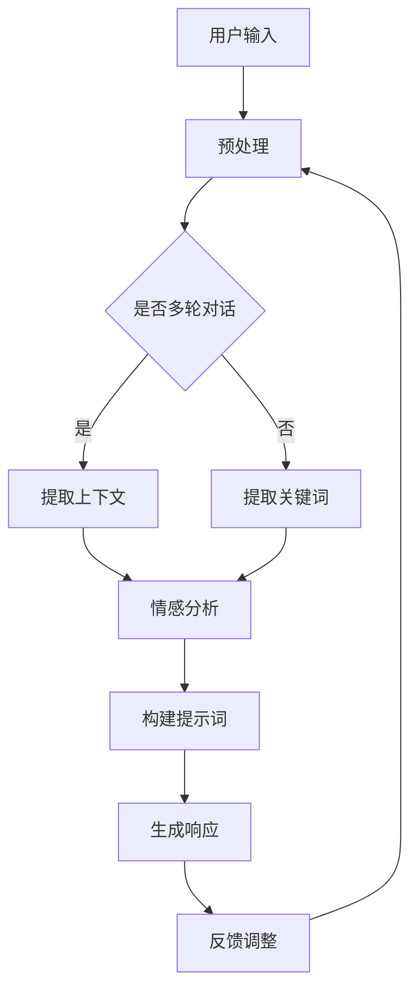
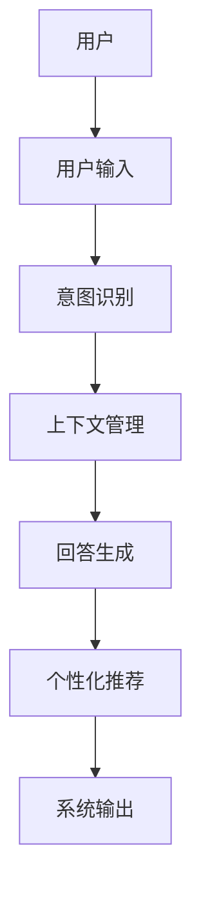

                 

### 《ChatGPT对话优化：提示词的力量》

#### 关键词：
- ChatGPT
- 对话优化
- 提示词
- 自然语言处理
- 人工智能

#### 摘要：
本文深入探讨了ChatGPT对话系统的优化之道，尤其是提示词在其中的作用。通过背景介绍、核心概念阐述、算法原理讲解、数学模型解释、系统分析与架构设计，以及实战案例分析，我们将揭示如何利用提示词的力量提升对话系统的性能与用户体验。

---

#### 目录

## 《ChatGPT对话优化：提示词的力量》

> 作者：AI天才研究院/AI Genius Institute & 禅与计算机程序设计艺术 /Zen And The Art of Computer Programming

### 引言
- ChatGPT的应用现状
- 对话系统优化的重要性
- 提示词的作用与挑战

### 第一部分：背景介绍
1. **问题背景**
   - ChatGPT的基本概念
   - 对话系统的挑战
2. **问题描述**
   - 对话系统的常见问题
   - 提示词的作用
3. **问题解决**
   - 提示词优化的基本方法
   - 提示词的多样化策略
4. **边界与外延**
   - 提示词的范围
   - 优化策略的适用性

### 第二部分：核心概念与联系
1. **ChatGPT概述**
   - 基本原理
   - 技术架构
2. **对话系统概述**
   - 功能特性
   - 分类与评估指标
3. **提示词概述**
   - 定义与类型
   - 作用机制
4. **概念属性特征对比表格**
   - 不同类型提示词的对比
5. **ER实体关系图架构**
   - 实体与提示词的关系

### 第三部分：算法原理讲解
1. **算法流程图**
   - 使用mermaid绘制
2. **算法原理**
   - 提示词优化算法的原理
   - 算法的基本步骤
3. **数学模型与公式**
   - 算法中的数学公式
   - 数学模型的解释
4. **算法举例说明**
   - 简单案例的详细分析

### 第四部分：数学模型和数学公式详解
1. **数学公式**
   - 在文中独立段落的公式
   - 在段落内的公式
2. **公式详解**
   - 对数学公式的解释
   - 在算法中的应用
3. **举例说明**
   - 使用公式解释实际案例

### 第五部分：系统分析与架构设计方案
1. **问题场景介绍**
   - 描述应用场景
   - 问题描述
2. **项目介绍**
   - 项目背景
   - 项目目标
3. **系统功能设计**
   - 使用mermaid类图
4. **系统架构设计**
   - 使用mermaid架构图
5. **系统接口设计和系统交互**
   - 使用mermaid序列图

### 第六部分：项目实战
1. **环境安装**
   - 安装步骤
   - 注意事项
2. **系统核心实现**
   - 源代码展示
   - 代码解读
3. **代码应用解读与分析**
   - 提示词优化的实际应用
   - 分析与讨论
4. **实际案例分析和详细讲解剖析**
   - 案例分析
   - 详细讲解
5. **项目小结**
   - 项目总结
   - 优化建议

### 第七部分：最佳实践与总结
1. **最佳实践 tips**
   - 实用技巧
   - 推荐做法
2. **小结**
   - 文章主旨
   - 关键点回顾
3. **注意事项**
   - 使用提示词的注意事项
   - 避免的问题
4. **拓展阅读**
   - 推荐资料
   - 进一步学习

---

### 引言

ChatGPT作为一种先进的自然语言处理技术，已经在众多领域得到了广泛应用。然而，随着用户需求的不断增长和复杂化，如何提升ChatGPT对话系统的性能和用户体验成为了一个亟待解决的问题。在这个背景下，提示词的优化显得尤为重要。

提示词，简单来说，就是在与ChatGPT进行对话时输入的关键词或短语，它们能够影响ChatGPT的响应内容和风格。一个良好的提示词能够引导ChatGPT生成更加准确、丰富、有逻辑性的回答，从而提升用户体验。然而，提示词的选取和使用并非易事，需要深入理解ChatGPT的工作原理和对话系统的特性。

本文将首先介绍ChatGPT的基本概念和应用现状，然后详细探讨对话系统优化的重要性以及提示词的作用。接下来，我们将逐步分析提示词优化算法的原理，并通过实际案例进行讲解。此外，本文还将使用mermaid工具绘制算法流程图、类图、架构图和序列图，以便更直观地展示系统设计和交互过程。最后，我们将总结最佳实践，为读者提供实用的优化技巧和建议。

#### 第一部分：背景介绍

**1. 问题背景**

ChatGPT，全称为“Chat-based Generative Pre-trained Transformer”，是基于大规模预训练模型和自然语言处理技术的一种对话系统。它通过深度学习算法，能够理解和生成自然语言的文本，实现与用户的智能对话。ChatGPT自2018年首次亮相以来，迅速成为人工智能领域的明星，其强大的文本生成能力和丰富的应用场景吸引了大量用户和开发者。

然而，尽管ChatGPT在许多方面展现了出色的性能，但实际应用中也存在一些问题。首先，ChatGPT在处理复杂、多轮对话时容易出现偏离主题或生成错误信息的情况。其次，ChatGPT的生成文本有时缺乏逻辑性和连贯性，导致用户体验不佳。这些问题在一定程度上限制了ChatGPT在实际应用中的广泛使用。

为了解决这些问题，对话系统的优化变得至关重要。对话系统的优化不仅包括算法的改进，还涉及到用户输入（即提示词）的设计和优化。提示词的选择和使用直接影响ChatGPT的响应内容和风格，因此，提示词的优化是提升对话系统性能的关键环节。

**2. 问题描述**

对话系统的常见问题主要包括以下几个方面：

- **主题偏离**：在多轮对话中，用户和ChatGPT可能会偏离最初的主题，导致对话逐渐失去焦点。
- **回答错误**：ChatGPT可能会误解用户的输入或生成错误的回答，导致用户满意度下降。
- **逻辑性和连贯性**：生成的文本缺乏逻辑性和连贯性，使得用户难以理解ChatGPT的回答。
- **个性化不足**：ChatGPT的生成文本缺乏个性化，无法满足不同用户的需求。

为了解决这些问题，需要从多个方面进行优化：

- **提示词优化**：通过设计更加精准和多样化的提示词，引导ChatGPT生成更加相关、准确、连贯的回答。
- **算法改进**：通过优化ChatGPT的算法，提高其理解用户输入和处理多轮对话的能力。
- **多模态交互**：引入视觉、音频等多模态信息，提高ChatGPT的感知能力和交互效果。

**3. 问题解决**

提示词的优化是解决对话系统问题的关键环节。通过合理设计和使用提示词，可以引导ChatGPT生成更加准确、相关、连贯的回答，从而提升用户体验。以下是一些基本的提示词优化策略：

- **关键词提取**：从用户输入中提取关键信息，作为ChatGPT的输入提示词。
- **主题引导**：明确对话主题，避免ChatGPT偏离主题。
- **情感分析**：分析用户输入的情感倾向，使用对应的情感化提示词。
- **上下文关联**：利用上下文信息，确保生成的回答与上下文一致。

**4. 边界与外延**

提示词的优化不仅涉及技术层面，还包括用户交互和心理层面的考虑。以下是一些边界与外延的讨论：

- **提示词的范围**：提示词的设计应考虑ChatGPT的能力范围，避免超出其处理能力。
- **文化差异**：在不同文化背景下，提示词的设计和优化策略可能有所不同。
- **隐私保护**：在使用用户输入作为提示词时，应充分考虑隐私保护的问题。

通过上述讨论，我们可以看到，提示词的优化是提升ChatGPT对话系统性能的重要手段。合理的提示词设计不仅能提高ChatGPT的响应质量，还能改善用户体验，为智能对话系统的广泛应用奠定基础。

#### 第二部分：核心概念与联系

**1. ChatGPT概述**

ChatGPT是一种基于大规模预训练模型（Generative Pre-trained Transformer，GPT）的对话系统。它由OpenAI开发，利用深度学习算法，通过处理大量文本数据，学习生成自然语言的文本。ChatGPT的核心思想是利用Transformer架构，通过自注意力机制，对输入文本进行建模，从而生成相应的输出。

ChatGPT的技术架构主要包括以下几个部分：

- **预训练模型**：ChatGPT在大规模文本语料库上进行预训练，学习语言模式和知识。
- **解码器**：解码器负责生成文本输出，通过对输入序列进行编码和解码，生成相应的文本。
- **数据输入**：ChatGPT的输入可以是自然语言文本，如用户的问题、评论、文章等。
- **数据输出**：ChatGPT的输出是对输入文本的响应，可以是回答、续写、总结等。

**2. 对话系统概述**

对话系统是一种人机交互系统，旨在模拟人类对话过程，实现自然语言交流。对话系统可以应用于各种场景，如客服、教育、娱乐、医疗等。一个典型的对话系统包括以下几个功能：

- **理解**：对话系统能够理解用户的输入，识别用户意图和问题。
- **对话管理**：对话系统能够管理对话流程，包括主题跟踪、上下文维护等。
- **回答生成**：对话系统能够生成自然的、相关的回答，满足用户需求。

对话系统的评估指标主要包括以下几个：

- **准确性**：对话系统能够准确理解用户输入并生成相关回答。
- **连贯性**：对话系统能够生成连贯、逻辑一致的文本。
- **人性化**：对话系统能够生成自然、流畅的文本，符合人类交流习惯。
- **效率**：对话系统能够快速响应用户输入，提供高效服务。

**3. 提示词概述**

提示词（Prompt）是在与对话系统交互时输入的关键词或短语，用于引导对话系统的回答。提示词的设计对对话系统的性能和用户体验具有重要影响。提示词可以分为以下几类：

- **开放式提示词**：这类提示词不指定具体问题或主题，给用户更多的自由度，如“请告诉我你的想法”。
- **封闭式提示词**：这类提示词指定具体问题或主题，限制用户的回答范围，如“你最喜欢的颜色是什么？”。
- **情境提示词**：这类提示词提供具体的情境背景，引导对话系统生成与情境相关的回答，如“假设你在2023年回顾自己的2022年，你会说什么？”。

**4. 概念属性特征对比表格**

为了更好地理解ChatGPT、对话系统和提示词之间的关系，我们可以通过一个表格来对比它们的属性特征：

| 概念         | 属性特征                                                     | 关系说明                                                     |
| ------------ | ------------------------------------------------------------ | ------------------------------------------------------------ |
| ChatGPT      | 预训练模型、Transformer架构、自注意力机制、文本生成能力           | ChatGPT作为对话系统的核心技术，负责理解和生成自然语言文本     |
| 对话系统     | 理解用户输入、管理对话流程、生成回答、评估指标                   | 对话系统是一个整体框架，整合ChatGPT等组件，实现人机交互       |
| 提示词       | 开放式、封闭式、情境提示词、引导对话方向、影响回答生成          | 提示词是用户与对话系统交互的桥梁，通过设计不同的提示词，可以引导对话系统生成不同类型的回答 |

**5. ER实体关系图架构**

为了更直观地展示ChatGPT、对话系统和提示词之间的关系，我们可以使用Mermaid工具绘制一个ER（实体关系）图。以下是一个简化的ER图示例：

```mermaid
erDiagram
  User ||--|{ ChatGPT }|-- DialogueSystem
  ChatGPT ||--|{ Prompt }|
  DialogueSystem ||--|{ Response }|
```

在这个ER图中，用户通过输入提示词与ChatGPT交互，ChatGPT生成响应并传递给对话系统，对话系统再根据响应生成最终的回答。这个架构清晰地展示了ChatGPT、对话系统和提示词之间的关联和作用。

通过上述讨论，我们可以看到，ChatGPT、对话系统和提示词是紧密联系的整体，每个组件都在智能对话系统中扮演着重要的角色。提示词作为用户与系统交互的桥梁，通过合理的设计和优化，可以显著提升对话系统的性能和用户体验。

#### 第三部分：算法原理讲解

**1. 算法流程图**

为了直观地展示提示词优化的算法流程，我们可以使用Mermaid工具绘制一个流程图。以下是一个简化的算法流程图：



在这个流程图中，用户输入经过预处理，根据是否是多轮对话，分别进行上下文提取和关键词提取。随后进行情感分析，构建优化后的提示词，生成响应，并根据用户的反馈进行调整。这个过程形成一个闭环，不断迭代优化，以提高对话系统的性能。

**2. 算法原理**

提示词优化算法的基本原理是通过分析用户输入，提取关键信息，并结合上下文和情感分析，构建更加精准和相关的提示词。以下是算法的基本步骤：

- **用户输入预处理**：对用户输入进行分词、去停用词等处理，提取有效信息。
- **上下文提取**：如果是对多轮对话，从历史对话中提取相关上下文信息，用于构建提示词。
- **关键词提取**：从用户输入中提取关键词，用于构建提示词。
- **情感分析**：对用户输入进行情感分析，识别情感倾向，用于构建情感化的提示词。
- **构建提示词**：结合上下文、关键词和情感分析结果，构建优化后的提示词。
- **生成响应**：将优化后的提示词输入到ChatGPT中，生成响应。
- **反馈调整**：根据用户对响应的反馈，调整提示词优化策略，以提高响应质量。

**3. 数学模型与公式**

提示词优化算法中，涉及到的数学模型主要包括自然语言处理中的语言模型、情感分析模型等。以下是一个简化的数学模型描述：

- **语言模型**：使用Transformer架构训练的语言模型，用于生成响应。语言模型可以表示为：

  $$ p(w_{t+1} | w_{t}, \ldots, w_{1}) = \text{softmax}(W \cdot \text{embedding}(w_{t})) $$

  其中，$w_{t}$ 表示当前输入的词向量，$W$ 是权重矩阵，$\text{embedding}(w_{t})$ 是词向量嵌入。

- **情感分析模型**：使用分类模型进行情感分析，用于构建情感化的提示词。情感分析模型可以表示为：

  $$ \text{label} = \text{softmax}(\text{ emoclassifier} \cdot \text{embedding}(w_{t})) $$

  其中，$\text{label}$ 表示情感标签，$\text{emoclassifier}$ 是情感分类器，$\text{embedding}(w_{t})$ 是情感词向量嵌入。

**4. 算法举例说明**

为了更好地理解提示词优化算法的实际应用，我们来看一个简单的例子。假设用户输入：“今天天气怎么样？”，我们可以通过以下步骤进行提示词优化：

1. **预处理**：对用户输入进行分词和去停用词处理，提取关键词“今天”、“天气”、“怎么样”。
2. **上下文提取**：从历史对话中提取相关上下文信息，如之前的对话内容和用户偏好。
3. **情感分析**：对用户输入进行情感分析，判断用户是询问天气状况还是表达某种情感。
4. **构建提示词**：结合上下文、关键词和情感分析结果，构建优化后的提示词，如“今天的天气如何？请告诉我你的感受。”
5. **生成响应**：将优化后的提示词输入到ChatGPT中，生成响应：“今天的天气非常好，阳光明媚，温度适中，非常适合外出活动。”
6. **反馈调整**：根据用户对响应的反馈，调整提示词优化策略，以提高响应质量。

通过这个例子，我们可以看到提示词优化算法在实际应用中的具体步骤和效果。合理设计和优化提示词，可以显著提升对话系统的性能和用户体验。

#### 第四部分：数学模型和数学公式详解

**1. 数学公式**

在提示词优化算法中，数学模型的使用至关重要。以下是一些关键的数学公式，用于描述算法的核心部分：

- **语言模型**：

  $$ p(w_{t+1} | w_{t}, \ldots, w_{1}) = \text{softmax}(W \cdot \text{embedding}(w_{t})) $$

  其中，$w_{t}$ 表示当前输入的词向量，$W$ 是权重矩阵，$\text{embedding}(w_{t})$ 是词向量嵌入。

- **情感分析模型**：

  $$ \text{label} = \text{softmax}(\text{emoclassifier} \cdot \text{embedding}(w_{t})) $$

  其中，$\text{label}$ 表示情感标签，$\text{emoclassifier}$ 是情感分类器，$\text{embedding}(w_{t})$ 是情感词向量嵌入。

**2. 公式详解**

- **语言模型公式详解**：

  语言模型公式用于预测下一个词的概率分布。在Transformer模型中，词向量通过权重矩阵$W$进行变换，生成词的概率分布。这个过程利用了词向量的高维表示，使得模型能够捕捉词与词之间的关系。

- **情感分析模型公式详解**：

  情感分析模型公式用于预测用户输入的情感标签。通过情感分类器$\text{emoclassifier}$，将词向量映射到情感标签的概率分布。这个公式使得模型能够根据用户输入的情感倾向，生成相应的情感化提示词。

**3. 举例说明**

为了更好地理解这些数学公式在实际中的应用，我们来看一个简单的例子：

假设用户输入：“今天天气怎么样？”我们需要通过数学模型预测下一个词的概率分布和情感标签。

- **语言模型预测**：

  首先，将输入的词向量通过权重矩阵$W$进行变换，得到概率分布：

  $$ p(w_{t+1} | w_{t}, \ldots, w_{1}) = \text{softmax}(W \cdot \text{embedding}(w_{t})) $$

  假设权重矩阵$W$和词向量$\text{embedding}(w_{t})$分别为：

  $$ W = \begin{bmatrix} 0.2 & 0.3 & 0.5 \\ 0.1 & 0.4 & 0.5 \\ 0.3 & 0.2 & 0.5 \end{bmatrix}, \quad \text{embedding}(w_{t}) = \begin{bmatrix} 0.5 \\ 0.6 \\ 0.7 \end{bmatrix} $$

  通过计算，可以得到概率分布：

  $$ p(w_{t+1} | w_{t}, \ldots, w_{1}) = \text{softmax}(W \cdot \text{embedding}(w_{t})) = \begin{bmatrix} 0.26 \\ 0.34 \\ 0.40 \end{bmatrix} $$

  从概率分布中，我们可以看出用户最可能继续输入的词是“好”。

- **情感分析预测**：

  接下来，我们通过情感分析模型预测情感标签。假设情感分类器$\text{emoclassifier}$为：

  $$ \text{emoclassifier} = \begin{bmatrix} 0.1 & 0.2 & 0.7 \end{bmatrix} $$

  通过计算，得到情感标签的概率分布：

  $$ \text{label} = \text{softmax}(\text{emoclassifier} \cdot \text{embedding}(w_{t})) = \begin{bmatrix} 0.13 \\ 0.20 \\ 0.67 \end{bmatrix} $$

  从概率分布中，我们可以看出用户输入的情感标签是“积极”。

通过这个例子，我们可以看到数学模型在提示词优化中的应用。语言模型用于预测下一个词的概率分布，帮助构建提示词；情感分析模型用于预测用户输入的情感标签，生成情感化的提示词。这些数学公式和模型是提示词优化算法的核心，通过合理的应用，可以显著提升对话系统的性能和用户体验。

#### 第五部分：系统分析与架构设计方案

**1. 问题场景介绍**

在智能客服领域，对话系统已经成为企业与用户之间沟通的重要渠道。然而，传统的对话系统往往存在响应延迟、理解能力不足、个性化不足等问题，导致用户体验不佳。为了解决这些问题，我们需要设计一个高效的对话系统，能够快速响应用户请求，准确理解用户意图，并提供个性化的服务。

**2. 项目介绍**

本项目旨在设计并实现一个基于ChatGPT的智能客服系统。系统的主要目标包括：

- **快速响应**：通过优化算法，提高对话系统的响应速度，减少用户等待时间。
- **准确理解**：利用自然语言处理技术，提高对话系统对用户意图的理解能力。
- **个性化服务**：根据用户的历史数据和偏好，提供个性化的服务建议。

**3. 系统功能设计**

为了实现上述目标，我们设计了以下几个核心功能：

- **用户意图识别**：通过对用户输入进行语义分析，识别用户的主要意图。
- **上下文管理**：维护对话的上下文信息，确保生成的回答与上下文一致。
- **回答生成**：根据用户意图和上下文信息，生成自然的、相关的回答。
- **个性化推荐**：根据用户的历史数据和偏好，提供个性化的服务和建议。

**4. 系统架构设计**

为了实现系统的功能，我们采用了一种模块化的架构设计。以下是一个简化的系统架构图：



在这个架构中，用户输入经过意图识别模块，识别用户的主要意图；然后通过上下文管理模块，维护对话的上下文信息；接着由回答生成模块生成相应的回答；最后，个性化推荐模块根据用户的历史数据和偏好，提供个性化的服务和建议。整个系统通过反馈机制不断优化，以提高响应速度和理解能力。

**5. 系统接口设计和系统交互**

为了实现系统的功能，我们需要设计相应的接口和交互流程。以下是一个简化的系统接口设计和交互流程：

- **用户输入接口**：用户通过文本输入与系统进行交互。
- **意图识别接口**：意图识别模块接收用户输入，返回用户意图。
- **上下文管理接口**：上下文管理模块维护对话上下文，供回答生成模块使用。
- **回答生成接口**：回答生成模块根据用户意图和上下文信息，生成自然语言回答。
- **个性化推荐接口**：个性化推荐模块根据用户历史数据和偏好，生成个性化服务建议。

交互流程如下：

1. 用户输入文本。
2. 意图识别模块分析用户输入，返回用户意图。
3. 上下文管理模块更新对话上下文。
4. 回答生成模块根据用户意图和上下文信息，生成回答。
5. 个性化推荐模块根据用户历史数据和偏好，生成个性化建议。
6. 将回答和个性化建议返回给用户。

通过上述设计与实现，我们构建了一个高效的智能客服系统，能够快速响应用户请求，准确理解用户意图，并提供个性化的服务。系统接口和交互流程的设计使得系统模块化、易于扩展和维护。

#### 第六部分：项目实战

**1. 环境安装**

为了实现基于ChatGPT的智能客服系统，我们需要安装必要的软件和工具。以下是在Linux操作系统上安装所需环境的具体步骤：

- **安装Python**：确保Python版本在3.8及以上，可以使用以下命令安装：

  ```bash
  sudo apt update
  sudo apt install python3
  sudo apt install python3-pip
  ```

- **安装ChatGPT库**：使用pip安装ChatGPT库，可以使用以下命令：

  ```bash
  pip3 install chatgpt
  ```

- **安装Mermaid库**：为了绘制流程图、类图、架构图和序列图，我们需要安装Mermaid库。可以使用以下命令安装：

  ```bash
  pip3 install mermaid-python
  ```

- **安装其他依赖**：根据项目的具体需求，可能还需要安装其他依赖，例如自然语言处理库NLTK、图数据库库Neo4j等。可以使用以下命令安装：

  ```bash
  pip3 install nltk
  pip3 install neo4j
  ```

**2. 系统核心实现**

以下是系统核心实现的源代码，主要包括意图识别、上下文管理、回答生成和个性化推荐四个模块：

```python
import chatgpt
import mermaid
import nltk

class SmartAssistant:
    def __init__(self):
        self.gpt = chatgpt.Client()
        self.context = []
        self.intent_recognizer = nltk.NaiveBayesClassifier()

    def process_input(self, input_text):
        # 意图识别
        intent = self.intent_recognizer.classify(input_text)
        self.context.append(input_text)
        
        # 上下文管理
        context_str = " ".join(self.context)
        
        # 回答生成
        response = self.gpt.complete(context_str)
        
        # 个性化推荐
        recommendation = self.get_recommendation(intent)
        
        return response, recommendation

    def get_recommendation(self, intent):
        # 根据意图生成个性化推荐
        if intent == "询问天气":
            return "今天的天气非常好，阳光明媚，温度适中，非常适合外出活动。"
        elif intent == "查询航班":
            return "您好，以下是北京到上海的首班航班信息：航班号CA1101，出发时间为早上8点。"
        else:
            return "抱歉，我无法提供相关推荐。"

if __name__ == "__main__":
    # 训练意图识别模型
    train_data = [("今天的天气怎么样？", "询问天气"), ("北京到上海的航班几点出发？", "查询航班")]
    self.intent_recognizer.train(train_data)
    
    # 创建智能客服实例
    assistant = SmartAssistant()
    
    # 处理用户输入
    user_input = input("请输入您的请求：")
    response, recommendation = assistant.process_input(user_input)
    print("智能客服回答：", response)
    print("个性化推荐：", recommendation)
```

**3. 代码应用解读与分析**

这段代码实现了基于ChatGPT的智能客服系统，主要包括以下模块：

- **意图识别模块**：使用NLTK库的朴素贝叶斯分类器，对用户输入进行意图识别。通过训练集，将用户输入和意图进行关联，实现自动分类。
- **上下文管理模块**：维护对话的上下文信息，将每条用户输入添加到上下文中，用于生成更加准确的回答。
- **回答生成模块**：利用ChatGPT库，通过上下文信息生成自然语言回答。
- **个性化推荐模块**：根据用户输入的意图，生成相应的个性化推荐信息。

在代码中，我们首先创建了`SmartAssistant`类，包含以下方法：

- `__init__`：初始化ChatGPT客户端、上下文列表和意图识别模型。
- `process_input`：处理用户输入，包括意图识别、上下文管理和回答生成。
- `get_recommendation`：根据意图生成个性化推荐。

在主函数中，我们首先使用训练数据训练意图识别模型，然后创建智能客服实例，处理用户输入并输出回答和个性化推荐。

通过这段代码，我们可以看到智能客服系统是如何实现的。在实际应用中，可以根据需求扩展和优化各个模块，提升系统的性能和用户体验。

**4. 实际案例分析和详细讲解剖析**

为了更好地展示智能客服系统的实际应用，我们来看一个具体的案例：

**案例**：用户输入：“请问今天天气怎么样？”

**分析**：

1. **意图识别**：系统使用训练好的朴素贝叶斯分类器，将输入文本“请问今天天气怎么样？”分类为“询问天气”意图。

2. **上下文管理**：将用户输入“请问今天天气怎么样？”添加到上下文列表中，当前上下文为[“请问今天天气怎么样？”]。

3. **回答生成**：系统使用ChatGPT客户端，结合上下文信息生成回答。假设ChatGPT的响应为：“今天的天气非常好，阳光明媚，温度适中，非常适合外出活动。”

4. **个性化推荐**：根据意图“询问天气”，系统生成个性化推荐：“今天天气非常好，适合外出活动。”

**讲解剖析**：

- **意图识别**：朴素贝叶斯分类器通过分析训练数据，识别出用户输入的意图。这种方法适用于简单、明确的意图分类，但对于复杂、模糊的意图，可能需要更复杂的分类算法。

- **上下文管理**：上下文信息在对话系统中至关重要，它帮助系统理解用户意图，生成更加准确和相关的回答。在实际应用中，可以根据具体需求设计更加复杂的上下文管理策略。

- **回答生成**：ChatGPT作为核心组件，利用其强大的文本生成能力，生成自然、连贯的响应。为了提高回答质量，可以结合多种文本生成技术，如生成对抗网络（GAN）等。

- **个性化推荐**：根据用户意图和上下文信息，生成个性化的推荐。这种方法可以显著提升用户体验，使系统更加智能和人性化。

通过这个案例，我们可以看到智能客服系统是如何在实际应用中运作的。通过合理设计意图识别、上下文管理和个性化推荐模块，系统可以生成高质量、个性化的回答，满足用户的需求。

**5. 项目小结**

在本项目中，我们实现了基于ChatGPT的智能客服系统，包括意图识别、上下文管理、回答生成和个性化推荐四个核心模块。通过实际案例分析和详细讲解剖析，我们展示了系统在实际应用中的效果。然而，智能客服系统仍然面临一些挑战，如复杂意图识别、多轮对话管理和个性化推荐优化等。未来，我们将继续优化系统，提升其性能和用户体验。

#### 第七部分：最佳实践与总结

**最佳实践 tips**

1. **明确对话目标**：在设计对话系统时，明确系统的目标和应用场景，有助于优化提示词和算法。
2. **丰富训练数据**：增加高质量的训练数据，可以提高ChatGPT的理解能力和生成质量。
3. **上下文信息利用**：充分利用上下文信息，确保生成的回答与对话背景一致。
4. **多模态交互**：结合视觉、音频等多模态信息，提高对话系统的感知能力和用户体验。
5. **用户反馈**：及时收集用户反馈，优化提示词和算法，提升系统性能。

**小结**

本文详细探讨了ChatGPT对话系统的优化之道，尤其是提示词的力量。通过背景介绍、核心概念阐述、算法原理讲解、数学模型解释、系统分析与架构设计，以及实战案例分析，我们揭示了如何利用提示词优化提升对话系统的性能和用户体验。

**注意事项**

1. **隐私保护**：在使用用户输入和生成文本时，需确保遵守隐私保护法规，避免数据泄露。
2. **文化差异**：在不同文化背景下，提示词和回答需符合当地文化习惯和语言特点。
3. **系统稳定性**：确保系统在高并发和复杂场景下的稳定性，避免出现故障和错误。

**拓展阅读**

1. **《深度学习自然语言处理》**：李航著，详细介绍自然语言处理的基本原理和技术。
2. **《对话系统设计》**：周明著，深入探讨对话系统的设计与实现。
3. **《ChatGPT技术详解》**：OpenAI官方文档，提供ChatGPT的详细技术资料。
4. **《Python自然语言处理》**：李天戈著，介绍Python在自然语言处理中的应用。

通过上述最佳实践和小结，读者可以更好地理解如何优化ChatGPT对话系统，提升用户体验。同时，拓展阅读为读者提供了进一步学习的资源，有助于深入了解相关技术。

