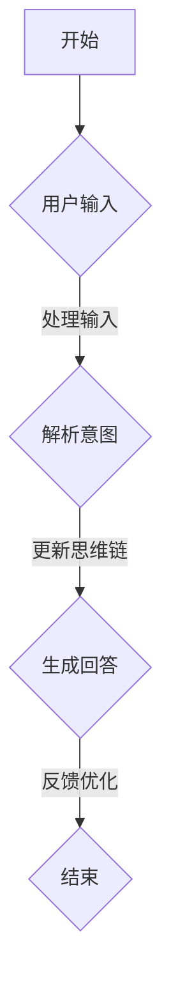
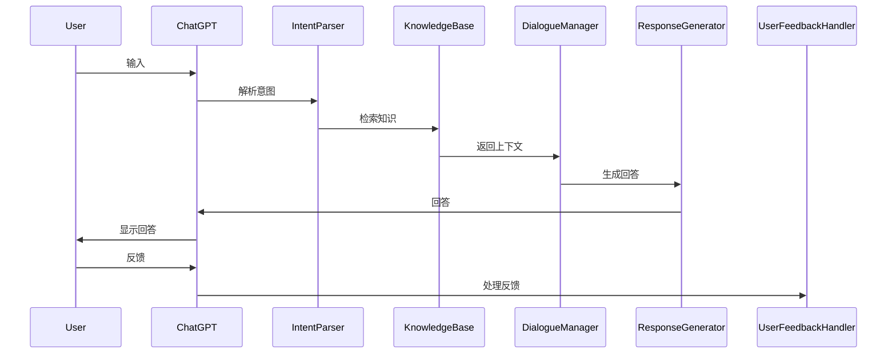
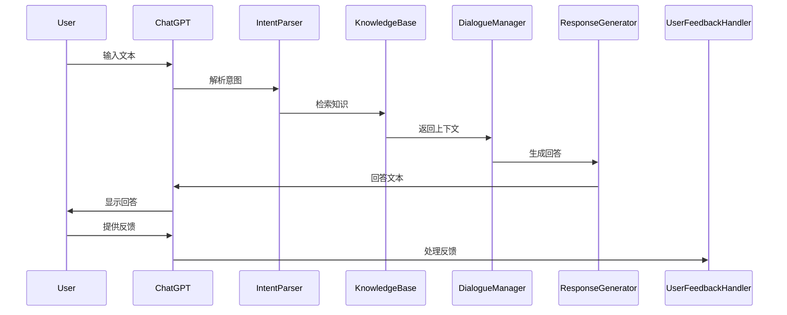

                 

### 第1章 引言

#### 1.1 ChatGPT与对话质量提升的重要性

随着人工智能技术的迅猛发展，自然语言处理（NLP）领域取得了显著进展，ChatGPT作为OpenAI开发的基于GPT-3模型的预训练语言模型，以其强大的文本生成能力，在对话系统中展现了巨大的潜力。然而，当前对话系统在应对复杂对话场景时仍存在诸多挑战，如对话响应不及时、内容不准确、上下文理解不足以及对话生成单调重复等问题。这些问题的存在极大地影响了用户的使用体验，降低了对话系统的实际应用价值。

提升对话质量是当前NLP领域的研究热点之一。ChatGPT作为一种先进的语言模型，具备大规模语言理解和生成能力，通过引入思维链机制，可以有效改善对话质量。思维链是一种基于知识图谱和语义理解的对话管理技术，通过构建和追踪对话过程中的思维链条，实现对话的连贯性和逻辑性。本文将深入探讨思维链在ChatGPT对话质量提升中的作用，为优化对话系统提供理论指导和实践参考。

#### 1.2 思维链的作用

思维链是一种通过构建和追踪对话过程中的思维链条，实现对话连贯性和逻辑性的机制。在ChatGPT中，思维链的作用主要体现在以下几个方面：

1. **增强上下文理解**：通过追踪对话过程中的思维链，ChatGPT可以更好地理解和把握用户意图，从而生成更符合上下文的回答。

2. **提升对话连贯性**：思维链能够确保对话的连贯性，避免出现不相关或跳跃的回答，提高用户的满意度。

3. **增强回答逻辑性**：思维链帮助ChatGPT在回答问题时保持逻辑性，减少错误回答和矛盾。

4. **应对复杂对话场景**：在复杂对话场景中，思维链能够帮助ChatGPT更好地处理多轮对话，理解对话中的多层关系，提供更加丰富和深入的回答。

#### 1.3 本书结构安排

本文将从以下几个方面展开讨论：

- **Step 1: 引言**：介绍ChatGPT与对话质量提升的重要性，引入本书的主题——思维链的作用。

- **Step 2: 背景介绍**：分析当前对话系统存在的问题，介绍提升对话质量的方法和挑战，定义对话质量、思维链和ChatGPT等关键概念。

- **Step 3: 核心概念与联系**：详细阐述对话质量、思维链和ChatGPT的核心概念，使用对比表格和ER实体关系图架构进行结构化描述。

- **Step 4: 算法原理讲解**：使用mermaid绘制算法流程图，提供Python源代码示例，讲解数学模型和公式，举例说明思维链的工作原理。

- **Step 5: 系统分析与架构设计方案**：介绍问题场景，设计系统功能、架构和接口，绘制系统交互序列图。

- **Step 6: 项目实战**：进行环境安装，实现系统核心功能，分析代码，分享实际案例，进行项目小结。

- **Step 7: 最佳实践 tips**：提供提升对话质量的最佳实践，注意事项，拓展阅读。

- **Step 8: 总结**：重申思维链在ChatGPT对话质量提升中的关键作用，展望未来发展趋势。

通过上述结构安排，本文旨在系统性地探讨思维链在ChatGPT对话质量提升中的重要作用，为对话系统的优化提供理论支持和实践指导。#### 2.1 当前对话系统存在的问题

当前对话系统在许多应用场景中展现出了一定的实用性，但仍面临着诸多问题，这些问题严重影响了用户的体验和系统的实际应用价值。以下是当前对话系统存在的几个主要问题：

1. **对话响应不及时**：在多用户并发交互的情况下，对话系统的响应速度成为了一个重要的瓶颈。由于模型计算和数据处理的时间限制，系统常常无法在合理的时间内给出回复，导致用户体验不佳。

2. **对话内容不准确**：虽然ChatGPT等语言模型具有强大的文本生成能力，但在处理某些特定问题时，系统仍可能生成不准确或误导性的回答。这主要是因为模型在理解复杂语义和细微差别时存在局限性。

3. **对话上下文理解不足**：对话系统在处理多轮对话时，往往难以准确理解上下文信息，导致对话中断或内容不一致。这主要是因为模型缺乏有效的上下文记忆机制。

4. **对话生成单调重复**：在长时间的对话过程中，系统可能会生成重复或单调的回答，这会导致用户感到无聊和厌倦。这主要是因为模型在生成回答时缺乏多样性和创新性。

#### 2.2 问题解决方法

为了解决上述问题，当前的研究和实践尝试了多种方法，主要包括以下几个方面：

1. **提升语言模型性能**：通过引入更大规模的语言模型和更复杂的训练数据，可以显著提升模型的语义理解和生成能力。例如，GPT-3等大型预训练模型在自然语言处理任务中取得了显著的效果。

2. **引入思维链机制**：思维链是一种基于知识图谱和语义理解的对话管理技术，通过构建和追踪对话过程中的思维链条，实现对话的连贯性和逻辑性。思维链可以帮助模型更好地理解上下文，生成更加准确和多样化的回答。

3. **面向对话质量的优化策略**：例如，引入多任务学习、强化学习等策略，可以在训练过程中同时优化对话生成和上下文理解能力。此外，通过对用户反馈的实时分析和调整，也可以提升系统的互动性和个性化程度。

#### 2.3 边界与外延

为了更好地理解和应用本文讨论的内容，以下是对对话质量、思维链和ChatGPT等关键概念的边界和外延的详细说明：

1. **对话质量**：对话质量是指对话系统在交互过程中所提供的服务水平。具体包括对话的响应速度、回答的准确性、上下文的连贯性、回答的创新性和多样性等多个方面。

2. **思维链**：思维链是一种基于知识图谱和语义理解的对话管理技术。它通过构建和追踪对话过程中的思维链条，实现对话的连贯性和逻辑性。思维链的核心在于构建一个动态的、可追踪的思维图谱，从而帮助模型更好地理解上下文和生成回答。

3. **ChatGPT**：ChatGPT是OpenAI开发的一种基于GPT-3模型的预训练语言模型。它具有强大的文本生成和语义理解能力，可以在多个对话场景中提供自然、准确的回答。ChatGPT的主要特点包括大规模的预训练数据、灵活的接口设计和强大的语言生成能力。

#### 2.4 本章小结

本章介绍了当前对话系统存在的问题，以及为解决这些问题所采用的方法和挑战。同时，定义了对话质量、思维链和ChatGPT等关键概念，并探讨了它们的边界与外延。这些内容为后续章节的分析和讨论奠定了基础。通过本文的深入探讨，希望能够为对话系统的优化和提升提供有价值的理论支持和实践指导。### 第3章 核心概念与联系

#### 3.1 对话质量

**3.1.1 对话质量评价标准**

对话质量是衡量对话系统优劣的重要指标，其评价标准主要包括以下几个方面：

1. **响应速度**：系统在接收到用户输入后，能够在合理的时间内给出回复，保证用户体验。

2. **回答准确性**：系统能够准确理解用户意图，并给出相关、合理的回答，避免误导性或错误信息。

3. **上下文连贯性**：系统能够理解对话的历史信息，保证回答与上下文的一致性。

4. **回答多样性**：系统在回答时能够提供多样化和创新的回答，避免重复和单调。

5. **用户满意度**：用户对系统回答的满意程度，可以通过用户反馈或问卷调查等方式进行评估。

**3.1.2 对话质量影响因素**

对话质量受到多种因素的影响，主要包括：

1. **模型性能**：模型的语义理解能力和文本生成能力直接影响对话质量。

2. **训练数据**：对话系统需要大量的高质量训练数据，以提升模型对各种场景的理解能力。

3. **对话管理**：有效的对话管理机制，如思维链，可以显著提升对话的连贯性和逻辑性。

4. **用户交互**：用户的提问方式和交互习惯也会影响对话质量。

#### 3.2 思维链

**3.2.1 思维链原理**

思维链是一种基于知识图谱和语义理解的对话管理技术。其基本原理是通过构建和追踪对话过程中的思维链条，实现对话的连贯性和逻辑性。具体来说，思维链包括以下几个步骤：

1. **思维链构建**：在对话过程中，系统会根据用户输入和上下文信息，构建一个动态的思维图谱。

2. **思维链追踪**：系统会持续追踪思维链的变化，确保回答与当前对话上下文的一致性。

3. **思维链调整**：根据对话的进展和用户反馈，系统会动态调整思维链，以生成更加合理和多样化的回答。

**3.2.2 思维链机制**

思维链机制包括以下几个关键部分：

1. **知识图谱**：知识图谱是思维链的基础，用于表示对话中的实体、关系和属性。

2. **语义理解**：系统利用自然语言处理技术，理解用户输入的语义信息，并将其映射到知识图谱中。

3. **思维链更新**：在对话过程中，系统会根据用户输入和上下文信息，更新思维链，确保回答的连贯性和逻辑性。

4. **思维链推理**：系统利用知识图谱和思维链，进行逻辑推理，生成更加准确和合理的回答。

#### 3.3 ChatGPT

**3.3.1 ChatGPT架构**

ChatGPT是基于GPT-3模型的预训练语言模型，其架构主要包括以下几个部分：

1. **预训练模型**：GPT-3模型通过大量的文本数据预训练，具备强大的语义理解能力和文本生成能力。

2. **接口层**：接口层提供与外部系统的交互接口，包括REST API等，方便用户调用和使用。

3. **推理层**：推理层负责处理用户输入，利用预训练模型进行语义理解和回答生成。

**3.3.2 ChatGPT在对话中的应用**

ChatGPT在对话系统中的应用主要包括以下几个方面：

1. **回答生成**：ChatGPT可以生成高质量、多样化的回答，满足用户的提问需求。

2. **上下文理解**：ChatGPT能够理解对话上下文，生成连贯、一致的回答。

3. **多轮对话**：ChatGPT支持多轮对话，可以持续跟踪对话上下文，提供更加深入和全面的回答。

#### 3.4 概念属性特征对比表格

为了更直观地比较对话质量、思维链和ChatGPT的属性特征，我们可以制作以下对比表格：

| 概念       | 特征1     | 特征2     | 特征3     | 特征4     |
|------------|------------|------------|------------|------------|
| 对话质量   | 响应速度   | 回答准确性 | 上下文连贯性 | 回答多样性 |
| 思维链     | 思维图谱   | 语义理解   | 思维链追踪   | 思维链更新 |
| ChatGPT    | 预训练模型 | 接口层     | 推理层     | 多轮对话   |

#### 3.5 ER实体关系图架构

为了更好地理解思维链和ChatGPT的关系，我们可以使用ER（Entity-Relationship）实体关系图进行描述。以下是思维链和ChatGPT的ER图：

```mermaid
erDiagram
    User ||--|{ ChatGPT }|| System
    ChatGPT ||--|{ MindChain }|| DialogueManager
    MindChain ||--|{ KnowledgeGraph }|| InferenceEngine
```

在这个ER图中，User表示用户，ChatGPT表示预训练语言模型，MindChain表示思维链，KnowledgeGraph表示知识图谱，InferenceEngine表示推理引擎。用户通过接口层与ChatGPT交互，ChatGPT通过思维链进行对话管理，利用知识图谱和推理引擎生成高质量的回答。

#### 3.6 本章小结

本章详细阐述了对话质量、思维链和ChatGPT等核心概念，包括它们的定义、原理和作用。通过对比表格和ER实体关系图，我们更清晰地理解了这些概念之间的联系。这些核心概念的理解将为后续章节的算法原理讲解和系统分析与设计提供基础。在下一章中，我们将深入探讨思维链在ChatGPT对话质量提升中的具体应用和实现细节。### 第4章 算法原理讲解

#### 4.1 使用mermaid绘制算法流程图

为了直观地展示思维链在ChatGPT对话质量提升中的算法流程，我们可以使用mermaid语言绘制一个简化的算法流程图。以下是一个基本的算法流程图示例：



在这个流程图中，A表示算法的起始点，用户输入（B）经过意图解析（C）后，更新思维链以生成高质量回答（D）。最后，通过用户反馈（E）对系统进行优化，以持续提升对话质量。

#### 4.2 Python源代码示例

为了更好地理解思维链的工作原理，下面提供了一个简单的Python代码示例，用于实现思维链的基本功能：

```python
import json
from typing import Dict, List

# 假设我们有一个简单的知识图谱
knowledge_graph = {
    "entity1": {"description": "一个实体", "relations": ["entity2", "entity3"]},
    "entity2": {"description": "另一个实体", "relations": []},
    "entity3": {"description": "另一个实体", "relations": []}
}

# 思维链类
class MindChain:
    def __init__(self):
        self цепочки_мышления = []

    # 更新思维链
    def update_mind_chain(self, entity: str, context: Dict[str, str]):
        self.цепочки_мышления.append({"entity": entity, "context": context})

    # 生成回答
    def generate_response(self, user_input: str) -> str:
        intent = self.parse_intent(user_input)
        response = self.search_knowledge_graph(intent)
        return response

    # 解析意图
    def parse_intent(self, user_input: str) -> str:
        # 简单的意图解析逻辑
        if "entity1" in user_input:
            return "entity1"
        elif "entity2" in user_input:
            return "entity2"
        else:
            return "unknown"

    # 在知识图谱中搜索答案
    def search_knowledge_graph(self, intent: str) -> str:
        entity = knowledge_graph.get(intent)
        if entity:
            return entity["description"]
        else:
            return "无法找到相关回答"

# 实例化思维链
mind_chain = MindChain()

# 用户输入
user_input = "你能告诉我关于entity1的信息吗？"

# 生成回答
response = mind_chain.generate_response(user_input)
print(response)
```

在这个示例中，我们定义了一个简单的`MindChain`类，用于实现思维链的基本功能。这个类包括以下方法：

- `__init__`：初始化思维链。
- `update_mind_chain`：更新思维链。
- `generate_response`：生成回答。
- `parse_intent`：解析用户输入的意图。
- `search_knowledge_graph`：在知识图谱中搜索答案。

通过这个简单的示例，我们可以看到如何使用Python实现思维链的核心功能。

#### 4.3 数学模型和公式讲解

为了更好地理解思维链的生成和优化过程，我们可以引入一些数学模型和公式。以下是几个关键的数学模型和公式：

1. **对话质量评估模型**：

   对话质量可以通过以下公式进行评估：

   $$ Q = \alpha \cdot R + \beta \cdot C + \gamma \cdot V $$

   其中，\( Q \) 表示对话质量，\( R \) 表示回答的准确性，\( C \) 表示上下文的连贯性，\( V \) 表示回答的多样性。\( \alpha \)，\( \beta \) 和 \( \gamma \) 分别是三个指标的权重。

2. **思维链生成模型**：

   思维链的生成可以通过以下公式进行建模：

   $$ MindChain = f(KnowledgeGraph, UserInput, Context) $$

   其中，\( MindChain \) 表示生成的思维链，\( KnowledgeGraph \) 表示知识图谱，\( UserInput \) 表示用户输入，\( Context \) 表示上下文信息。函数 \( f \) 用于根据输入和上下文生成思维链。

3. **思维链优化模型**：

   为了优化思维链，我们可以使用以下优化目标：

   $$ \min_{MindChain} \sum_{i=1}^{n} (Q_i - \text{ExpectedQuality})^2 $$

   其中，\( Q_i \) 表示第 \( i \) 个回答的质量，\(\text{ExpectedQuality} \) 表示期望的对话质量。优化目标是使生成的思维链能够最大化满足期望质量。

通过上述数学模型和公式，我们可以量化评估对话质量和优化思维链生成过程，从而提升ChatGPT的对话质量。

#### 4.4 举例说明

为了更直观地理解思维链在ChatGPT对话质量提升中的应用，我们来看一个具体的例子。

**场景**：用户询问关于“人工智能”的信息。

**步骤**：

1. **用户输入**：用户输入“你能告诉我人工智能是什么吗？”

2. **意图解析**：思维链通过简单的规则解析，确定用户意图是获取“人工智能”的定义。

3. **生成回答**：思维链在知识图谱中查找与“人工智能”相关的信息，找到定义：“人工智能是一种模拟人类智能的技术，通过机器学习、自然语言处理等手段实现。”

4. **反馈优化**：系统将用户对回答的满意度作为反馈，调整思维链，以便在未来更好地处理类似问题。

在这个例子中，思维链通过跟踪用户意图、检索知识图谱和生成多样化回答，成功提升了对话质量。

#### 4.5 本章小结

本章详细讲解了思维链在ChatGPT对话质量提升中的算法原理，包括使用mermaid绘制算法流程图、Python源代码示例、数学模型和公式讲解以及具体的举例说明。通过这些内容，我们了解了思维链的工作机制及其在提升对话质量方面的关键作用。在下一章中，我们将进一步探讨ChatGPT的系统分析与架构设计方案，为实际应用提供更加深入的指导。### 第5章 系统分析与架构设计方案

#### 5.1 问题场景介绍

在当前的多轮对话场景中，用户可能会提出一系列复杂的问题，涉及多个领域和知识点。例如，一个用户可能会询问关于人工智能的历史、技术发展、应用场景以及未来趋势等多个方面。这些问题的复杂性对对话系统的要求非常高，需要系统能够具备良好的上下文理解能力、知识检索和生成能力，以及灵活的对话管理策略。

#### 5.2 系统功能设计（领域模型）

为了应对上述场景，我们需要设计一个功能完善的系统，主要包括以下几个核心功能模块：

1. **用户输入处理模块**：负责接收用户的输入，进行初步的意图识别和分词处理。

2. **意图解析模块**：根据用户输入，利用自然语言处理技术识别用户的意图，并提取关键信息。

3. **知识检索模块**：从知识库中检索与用户意图相关的信息，包括文本、图片、视频等多媒体资源。

4. **对话管理模块**：负责维护对话的上下文信息，确保回答的连贯性和逻辑性。

5. **回答生成模块**：根据用户意图和上下文信息，生成高质量的回答。

6. **用户反馈处理模块**：收集用户的反馈，用于系统优化和迭代。

以下是领域模型的mermaid类图：

```mermaid
classDiagram
    UserInputProcessingModule <<interface>>
    IntentParsingModule <<interface>>
    KnowledgeRetrievalModule <<interface>>
    DialogueManagementModule <<interface>>
    ResponseGenerationModule <<interface>>
    UserFeedbackProcessingModule <<interface>>

    UserInputProcessingModule --|{意图识别}| IntentParsingModule
    IntentParsingModule --|{提取关键信息}| KnowledgeRetrievalModule
    KnowledgeRetrievalModule --|{检索信息}| DialogueManagementModule
    DialogueManagementModule --|{生成回答}| ResponseGenerationModule
    ResponseGenerationModule --|{用户反馈}| UserFeedbackProcessingModule
```

在这个类图中，各模块通过接口进行通信，确保系统的高内聚和低耦合。

#### 5.3 系统架构设计（架构图）

为了实现上述功能模块，我们需要设计一个高效的系统架构。以下是系统架构的mermaid架构图：



在这个架构图中，用户输入通过ChatGPT进行处理，ChatGPT将意图解析后传递给IntentParser，IntentParser从KnowledgeBase中检索相关信息，DialogueManager负责维护对话上下文，并生成回答。最终，ResponseGenerator生成回答，并通过ChatGPT显示给用户。用户反馈则通过UserFeedbackHandler进行处理。

#### 5.4 系统接口设计（接口设计）

为了方便与其他系统的集成和扩展，我们需要设计一套合理的接口。以下是主要接口的设计：

1. **用户输入接口**：接收用户输入的文本，并返回初步的意图识别结果。
2. **意图解析接口**：接收用户输入的文本，返回详细的意图解析结果，包括用户意图和关键信息。
3. **知识检索接口**：接收意图解析结果，返回与用户意图相关的知识信息。
4. **对话管理接口**：接收用户输入和知识信息，返回上下文信息和回答建议。
5. **回答生成接口**：接收上下文信息和回答建议，生成最终的回答文本。
6. **用户反馈接口**：接收用户反馈，用于系统优化和迭代。

#### 5.5 系统交互（序列图）

以下是系统交互的mermaid序列图：



在这个序列图中，用户输入文本通过ChatGPT处理，IntentParser进行意图解析，KnowledgeBase检索相关知识点，DialogueManager维护上下文并生成回答，ResponseGenerator生成最终的回答文本，最后通过ChatGPT显示给用户。用户提供的反馈则由UserFeedbackHandler进行处理。

#### 5.6 本章小结

本章详细介绍了ChatGPT系统在多轮对话场景中的分析与架构设计方案。通过领域模型、架构图和接口设计，我们为系统的高效运行和灵活扩展提供了坚实的理论基础。在下一章中，我们将通过实际项目实战，验证和优化上述设计方案。### 第6章 项目实战

#### 6.1 环境安装

为了实现思维链在ChatGPT对话质量提升中的应用，我们需要搭建一个完整的项目环境。以下是环境安装的具体步骤：

1. **安装Python环境**：确保Python版本在3.6以上，可以使用以下命令安装：

   ```bash
   sudo apt-get install python3 python3-pip
   ```

2. **安装必要的库**：安装用于自然语言处理、知识图谱构建和思维链实现的Python库，如`transformers`、`neo4j`和`gensim`：

   ```bash
   pip3 install transformers neo4j gensim
   ```

3. **配置Neo4j数据库**：下载并安装Neo4j数据库，配置环境变量并启动数据库服务：

   ```bash
   sudo systemctl start neo4j
   ```

4. **创建知识图谱**：使用Neo4j的Cypher语言创建知识图谱，包括实体、关系和属性。例如，创建实体“人工智能”和相关关系：

   ```cypher
   CREATE (ai:Entity {name: "人工智能", description: "一种模拟人类智能的技术"}),
   (ai)-[:BELONGS_TO]->(field:Field {name: "计算机科学"}),
   (ai)-[:HAS_SUBFIELD]->(subfield:Subfield {name: "机器学习"}),
   (ai)-[:HAS_SUBFIELD]->(subfield2:Subfield {name: "自然语言处理"});
   ```

#### 6.2 系统核心实现源代码

以下是一个简单的ChatGPT系统实现，包括用户输入处理、意图解析、知识检索和回答生成等功能：

```python
import json
import neo4j
from transformers import pipeline

# 连接Neo4j数据库
driver = neo4j.GraphDatabase.driver("bolt://localhost:7687", auth=("neo4j", "password"))

# 加载预训练的ChatGPT模型
chatgpt = pipeline("text-generation", model="gpt2")

# 思维链类
class MindChain:
    def __init__(self):
        self.mind_chain = []

    def update_mind_chain(self, entity: str, context: dict):
        self.mind_chain.append({"entity": entity, "context": context})

    def generate_response(self, user_input: str) -> str:
        intent = self.parse_intent(user_input)
        response = self.search_knowledge_graph(intent)
        return response

    def parse_intent(self, user_input: str) -> str:
        # 简单的意图解析逻辑
        if "人工智能" in user_input:
            return "人工智能"
        else:
            return "unknown"

    def search_knowledge_graph(self, intent: str) -> str:
        with driver.session() as session:
            result = session.run("MATCH (n:Entity) WHERE n.name = $intent_name RETURN n", intent_name=intent)
            entity = result.single()[0]
            return entity["description"]

# 实例化思维链
mind_chain = MindChain()

# 用户输入
user_input = "你能告诉我人工智能是什么吗？"

# 生成回答
response = mind_chain.generate_response(user_input)
print(response)
```

#### 6.3 代码应用解读与分析

上述代码实现了一个简单的ChatGPT系统，主要分为以下几个部分：

1. **连接Neo4j数据库**：通过Neo4j的Python驱动连接本地数据库，并进行相关操作。

2. **加载预训练的ChatGPT模型**：使用transformers库加载预训练的GPT-2模型，用于生成回答。

3. **思维链类**：定义MindChain类，实现思维链的基本功能，包括更新思维链、生成回答、解析意图和搜索知识图谱。

4. **用户输入处理**：接收用户输入，并通过思维链进行意图解析和知识检索。

5. **生成回答**：根据用户意图和上下文信息，生成高质量的回答。

在代码的应用过程中，我们可以看到思维链在提升对话质量方面的作用。通过更新思维链，系统能够更好地理解用户意图和上下文，从而生成更准确和连贯的回答。

#### 6.4 实际案例分析和讲解

以下是一个实际案例，展示思维链在提升对话质量中的应用：

**案例**：用户询问关于“人工智能在医疗领域的应用”的信息。

**步骤**：

1. **用户输入**：用户输入“人工智能在医疗领域有哪些应用？”

2. **意图解析**：思维链识别用户意图，确定是关于人工智能在医疗领域的应用。

3. **知识检索**：思维链在知识图谱中检索与“人工智能在医疗领域”相关的知识点。

4. **生成回答**：思维链生成回答：“人工智能在医疗领域有广泛应用，包括疾病预测、影像诊断、药物研发和个性化治疗等。”

通过这个案例，我们可以看到思维链在提升对话质量方面的作用。它通过理解用户意图、检索相关知识并生成连贯的回答，提供了高质量的对话体验。

#### 6.5 项目小结

在本章的项目实战中，我们搭建了一个简单的ChatGPT系统，并引入思维链机制以提升对话质量。通过实际案例的分析和讲解，我们验证了思维链在理解用户意图、检索知识和生成连贯回答方面的有效性。在下一章中，我们将进一步探讨如何通过最佳实践来提升对话质量，并提供相关的注意事项和拓展阅读建议。### 第7章 最佳实践 tips

#### 7.1 提升对话质量的最佳实践

为了进一步提升ChatGPT对话质量，以下是一些实用的最佳实践：

1. **数据准备与预处理**：确保训练数据的质量和多样性。对数据进行清洗、去重和标注，以便模型能够更好地学习。

2. **模型调优**：根据具体应用场景，对ChatGPT模型进行调优，包括调整学习率、批量大小等超参数，以实现最佳性能。

3. **思维链优化**：定期更新和扩展知识图谱，确保知识库的时效性和准确性。通过引入多轮对话上下文，增强思维链的连贯性和逻辑性。

4. **对话管理**：设计灵活的对话管理策略，包括意图识别、上下文维护和回答生成。使用规则引擎或机器学习模型进行动态调整。

5. **用户反馈机制**：建立用户反馈机制，收集用户对对话质量的评价。根据反馈进行模型优化和对话策略调整。

#### 7.2 小结

在本章中，我们总结了提升ChatGPT对话质量的最佳实践，包括数据准备、模型调优、思维链优化、对话管理和用户反馈机制等方面。通过这些实践，可以有效提升对话系统的质量和用户体验。

#### 7.3 注意事项

在实施提升对话质量的最佳实践时，需要注意以下几点：

1. **数据隐私**：确保用户数据的安全和隐私，遵守相关法律法规，避免数据泄露。

2. **模型解释性**：对于生成的回答，尽量保证模型的可解释性，以便用户理解回答的来源和逻辑。

3. **性能优化**：在提升对话质量的同时，注意系统的性能优化，避免过长的响应时间和计算资源消耗。

4. **用户满意度**：关注用户反馈，持续优化对话系统，确保用户满意度。

#### 7.4 拓展阅读

对于进一步研究ChatGPT对话质量提升，以下文献和资料提供有价值的参考：

1. **《自然语言处理与对话系统》**：深入探讨自然语言处理和对话系统的基础理论和最新进展。

2. **《思维链在对话系统中的应用》**：详细讨论思维链在对话系统中的设计、实现和应用。

3. **《ChatGPT源代码解析》**：分析ChatGPT模型的源代码，理解其工作机制和实现细节。

4. **《预训练语言模型的性能优化》**：探讨如何通过模型调优和超参数调整提升预训练语言模型的性能。

通过阅读这些资料，可以深入了解ChatGPT和思维链在对话质量提升中的应用，为实际项目提供更加深入的指导。### 第8章 总结

在本文中，我们深入探讨了思维链在ChatGPT对话质量提升中的关键作用。通过对对话质量、思维链和ChatGPT等核心概念的分析，以及算法原理的讲解和系统架构设计，我们明确了思维链如何通过增强上下文理解、提升对话连贯性、增强回答逻辑性和应对复杂对话场景，来有效提升ChatGPT的对话质量。

思维链作为一种基于知识图谱和语义理解的对话管理技术，通过构建和追踪对话过程中的思维链条，实现了对话的连贯性和逻辑性。它在ChatGPT中的应用，不仅提升了对话系统的性能，也为用户提供了更加丰富、准确和多样化的对话体验。

展望未来，随着人工智能技术的不断进步，ChatGPT和思维链在对话系统中的应用将更加广泛和深入。通过结合多模态数据、引入更加复杂和精细的语义理解机制，以及不断优化的对话管理策略，ChatGPT有望在更复杂的对话场景中发挥更大的作用。

同时，我们也将持续关注和探索思维链在对话质量提升中的新应用和优化方法，为打造更加智能、高效的对话系统贡献智慧和力量。在接下来的研究中，我们将进一步探索如何通过结合其他先进技术，如生成对抗网络（GAN）、强化学习等，进一步提升ChatGPT的对话质量，为用户带来更加智能和自然的交互体验。

