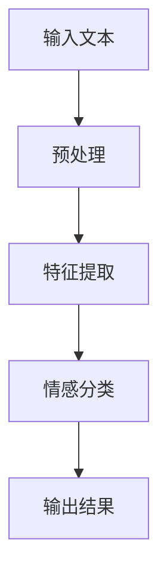
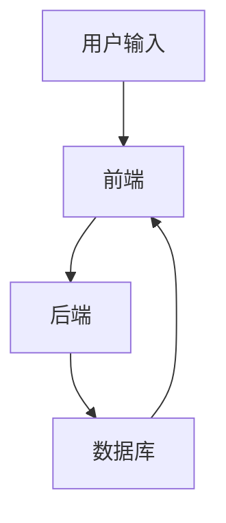
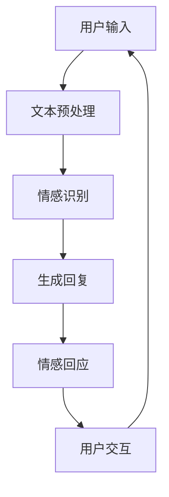
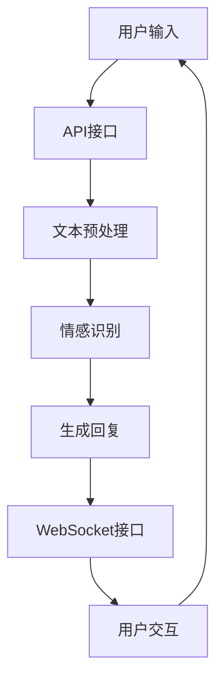

                 

### 标题：ChatGPT情感计算：提升AI同理心的提示词策略

#### 关键词：ChatGPT、情感计算、AI同理心、提示词策略、算法原理

#### 摘要：
本文深入探讨了ChatGPT在情感计算中的应用，通过提示词策略提升AI同理心。首先，我们介绍了情感计算、AI同理心以及ChatGPT的基本概念。接着，我们详细解析了情感识别算法原理，包括数学模型和Python代码实现。然后，我们阐述了ChatGPT系统设计与实现，以及实际项目中的应用。最后，我们给出了最佳实践和总结，为读者提供了进一步学习和应用的指导。

#### 目录框架：

- [引言](#引言)
- [情感计算基础](#情感计算基础)
- [AI同理心的概念与实现](#AI同理心的概念与实现)
- [ChatGPT与情感计算](#ChatGPT与情感计算)
- [情感识别算法原理](#情感识别算法原理)
- [提示词策略设计](#提示词策略设计)
- [系统设计与实现](#系统设计与实现)
- [项目实战](#项目实战)
- [最佳实践与总结](#最佳实践与总结)

### 引言

#### 情感计算的定义与重要性

情感计算（Affective Computing）是人工智能领域的一个分支，旨在使计算机能够识别、理解、处理和模拟人类情感。情感计算不仅仅涉及情感本身，还包括情感的表达、识别、建模和应用。在情感计算中，情感被看作是一种信息，可以被处理和利用。

情感计算在多个领域具有重要应用价值。首先，在客户服务中，情感计算可以帮助企业更好地理解客户的需求和情感状态，从而提供更个性化的服务。其次，在教育领域，情感计算可以帮助教师更好地了解学生的学习情绪和进度，从而进行更有效的教学。此外，在医疗保健、人机交互、心理学等领域，情感计算也有广泛的应用。

#### AI同理心的背景与意义

同理心（Empathy）是指理解并感受他人情感状态的能力。在人工智能领域，AI同理心（AI Empathy）是指使人工智能系统具备理解和模拟人类情感的能力。AI同理心是情感计算的一个重要目标，因为它可以提高人工智能系统的交互质量和用户体验。

AI同理心在多个应用场景中具有重要应用。例如，在虚拟助手、聊天机器人、心理咨询等领域，具备AI同理心的人工智能系统能够更好地理解用户的需求和情感状态，提供更贴心的服务。此外，AI同理心还可以在改善人机交互、提高社会机器人的可靠性和友好性等方面发挥重要作用。

#### ChatGPT简介及其在情感计算中的应用

ChatGPT是OpenAI开发的一种基于GPT（Generative Pre-trained Transformer）的聊天机器人，具有强大的语言生成和理解能力。ChatGPT在情感计算中具有重要的应用价值，可以通过提示词策略提升AI同理心。

ChatGPT的情感计算能力主要体现在以下几个方面：

1. **情感识别**：ChatGPT能够识别文本中的情感，如快乐、悲伤、愤怒等。
2. **情感模拟**：ChatGPT能够根据用户的情感状态生成相应的回复，以表达同情、支持等情感。
3. **情感回应**：ChatGPT能够根据用户的情感回应，调整自己的语言风格和表达方式，以更好地满足用户需求。

在情感计算中，ChatGPT的提示词策略是一种有效的手段，可以通过优化提示词来提升AI同理心。提示词策略包括以下几个方面：

1. **情感标签提示**：在生成回复时，使用情感标签来明确表达情感，如“很高兴听到这个消息！”
2. **情感强度提示**：在生成回复时，使用情感强度词来体现情感的强度，如“非常感谢您的帮助！”
3. **情感倾向提示**：在生成回复时，使用情感倾向词来体现情感的倾向，如“我希望您能早日康复！”

### 情感计算基础

#### 情感计算的基本概念

情感计算（Affective Computing）是指使计算机能够识别、理解、处理和模拟人类情感的技术。情感计算的核心是情感识别（Affective Recognition），即通过各种传感器和算法来识别和理解人类情感。

情感计算涉及多个核心概念：

1. **情感**：情感是指人类在生理、心理和行为上对特定刺激的反应。情感可以分为基本情感（如快乐、悲伤、愤怒）和复杂情感（如厌恶、惊奇、悲伤）。
2. **情感识别**：情感识别是指通过算法和模型从生理、语言和行为数据中识别情感。
3. **情感表达**：情感表达是指通过语言、表情、声音等手段来表达情感。
4. **情感处理**：情感处理是指对识别到的情感进行分析、理解和处理。

#### 情感计算的核心技术

情感计算的核心技术包括情感识别、情感表达、情感处理和情感模拟。

1. **情感识别**：情感识别是指通过算法和模型从生理、语言和行为数据中识别情感。常用的情感识别技术包括：
   - **生理信号处理**：通过处理心率、皮肤电导、呼吸等生理信号来识别情感。
   - **语音信号处理**：通过分析语音信号中的音调、语速、音量等特征来识别情感。
   - **面部表情识别**：通过分析面部肌肉运动来识别情感。

2. **情感表达**：情感表达是指通过语言、表情、声音等手段来表达情感。情感表达技术包括：
   - **自然语言处理**：通过分析文本中的情感词汇、语法结构和语义关系来识别情感。
   - **语音合成**：通过生成具有情感色彩的声音来模拟情感表达。
   - **面部表情合成**：通过控制面部肌肉运动来生成具有情感色彩的表情。

3. **情感处理**：情感处理是指对识别到的情感进行分析、理解和处理。情感处理技术包括：
   - **情感分析**：通过分析情感数据和情感特征来识别情感类别和情感强度。
   - **情感建模**：通过建立情感模型来预测情感状态和情感变化。
   - **情感调控**：通过调节情感表达和行为来调整情感状态。

4. **情感模拟**：情感模拟是指通过算法和模型来模拟人类情感。情感模拟技术包括：
   - **机器学习**：通过训练模型来模拟情感状态和行为。
   - **深度学习**：通过构建神经网络来模拟情感。
   - **生成对抗网络（GAN）**：通过对抗训练来模拟情感。

#### 情感计算的应用领域

情感计算在多个领域具有重要应用，包括：

1. **客户服务**：情感计算可以帮助企业更好地理解客户的需求和情感状态，从而提供更个性化的服务。例如，通过分析客户的情感表达，客服机器人可以更好地回应客户的需求和情感。

2. **教育**：情感计算可以帮助教师更好地了解学生的学习情绪和进度，从而进行更有效的教学。例如，通过分析学生的学习文本和语音信号，教育系统可以识别学生的学习状态和情感状态，从而调整教学策略。

3. **医疗保健**：情感计算可以帮助医生更好地了解患者的情感状态，从而提供更有效的治疗方案。例如，通过分析患者的语音信号和面部表情，医疗系统可以识别患者的情绪变化，从而调整治疗方案。

4. **人机交互**：情感计算可以帮助设计更人性化的交互界面，提高用户的交互体验。例如，通过分析用户的语音信号和面部表情，虚拟助手可以更好地理解用户的需求和情感状态，从而提供更个性化的服务。

5. **心理学**：情感计算可以帮助心理学家更好地了解患者的情感状态和情感变化，从而提供更有效的心理治疗。例如，通过分析患者的情感数据，心理治疗系统可以识别患者的情感问题，并提供相应的治疗建议。

### AI同理心的概念与实现

#### AI同理心的定义与重要性

AI同理心（AI Empathy）是指人工智能系统能够理解和模拟人类情感的能力。同理心是人类的一种基本能力，使我们能够理解并感受他人的情感状态。在人工智能领域，AI同理心是指使人工智能系统能够识别、理解并模拟人类情感。

AI同理心在人工智能应用中具有重要意义。首先，AI同理心可以提高人工智能系统的交互质量，使其更好地理解用户的需求和情感状态。其次，AI同理心可以改善人机交互体验，使人工智能系统能够更好地与用户沟通和协作。此外，AI同理心还可以在心理健康、教育、医疗等领域发挥重要作用，帮助人们更好地应对情感问题。

#### AI同理心的实现方法

实现AI同理心需要结合多种技术，包括自然语言处理、计算机视觉、语音识别等。以下是几种常见的实现方法：

1. **情感识别**：通过自然语言处理技术，分析文本中的情感词汇、语法结构和语义关系，识别用户的情感状态。例如，使用情感分析模型来识别文本中的正面或负面情感。

2. **情感模拟**：通过计算机视觉技术，分析用户的面部表情和身体语言，模拟用户的情感状态。例如，使用面部表情识别技术来模拟用户的情感表达。

3. **情感响应**：通过语音识别和合成技术，分析用户的语音信号，生成相应的情感响应。例如，使用语音合成技术来生成具有情感色彩的声音。

4. **多模态融合**：结合多种传感器数据，如文本、语音、面部表情等，实现更全面的情感识别和模拟。例如，使用多模态融合技术来识别用户的情感状态。

#### AI同理心与人类同理心的比较

AI同理心和人类同理心在本质上有一定区别：

1. **感知能力**：人类同理心依赖于人类的感知能力，包括视觉、听觉、触觉等。而AI同理心主要依赖于传感器数据和算法模型，如面部表情识别、语音识别等。

2. **理解能力**：人类同理心具有更高的理解能力，能够理解复杂的情感和社会关系。而AI同理心在理解能力方面有限，主要依赖算法模型和训练数据。

3. **情感表达**：人类同理心能够通过语言、表情、身体语言等多种方式表达情感。而AI同理心主要通过文本、语音和面部表情等方式表达情感。

尽管AI同理心和人类同理心存在一定差异，但它们在目标上是一致的，即理解和模拟人类情感。随着人工智能技术的不断发展，AI同理心有望在未来实现更高水平的发展，更好地服务于人类。

### ChatGPT与情感计算

#### ChatGPT的基本原理

ChatGPT是基于GPT（Generative Pre-trained Transformer）模型的一种聊天机器人。GPT模型是一种基于Transformer架构的深度学习模型，具有强大的语言生成和理解能力。ChatGPT通过预训练和微调，可以生成高质量的自然语言回复，并与用户进行有效的交互。

ChatGPT的基本原理包括以下几个方面：

1. **预训练**：在预训练阶段，ChatGPT使用大量文本数据进行训练，学习语言的统计规律和上下文关系。预训练使得ChatGPT具有强大的语言生成和理解能力。

2. **微调**：在微调阶段，ChatGPT使用特定领域的文本数据进行微调，以适应特定应用场景。例如，在情感计算中，ChatGPT可以微调以生成更符合情感计算需求的回复。

3. **交互**：在交互阶段，ChatGPT接收用户的输入，并根据输入生成相应的回复。ChatGPT可以处理多种输入形式，如文本、语音等。

#### ChatGPT的情感识别能力

ChatGPT在情感计算中具有重要的应用价值，其情感识别能力主要体现在以下几个方面：

1. **情感标签识别**：ChatGPT可以识别文本中的情感标签，如“快乐”、“悲伤”、“愤怒”等。通过情感标签识别，ChatGPT可以生成相应的情感回复。

2. **情感强度识别**：ChatGPT可以识别文本中的情感强度，如“非常开心”、“有点难过”等。通过情感强度识别，ChatGPT可以生成情感色彩更强的回复。

3. **情感倾向识别**：ChatGPT可以识别文本中的情感倾向，如“我非常喜欢这个产品”等。通过情感倾向识别，ChatGPT可以生成更符合用户情感倾向的回复。

#### ChatGPT在情感计算中的应用

ChatGPT在情感计算中具有广泛的应用，以下是一些典型应用场景：

1. **客户服务**：ChatGPT可以帮助企业实现智能客服，通过识别客户情感和需求，提供更个性化的服务。

2. **心理咨询**：ChatGPT可以作为心理咨询助手，通过识别用户情感，提供相应的心理支持和建议。

3. **教育**：ChatGPT可以帮助教师了解学生的学习情感和进度，提供更有针对性的教学。

4. **医疗保健**：ChatGPT可以帮助医生识别患者情感，提供更有效的治疗方案。

5. **人机交互**：ChatGPT可以作为人机交互的助手，通过识别用户情感，提供更人性化的交互体验。

### 情感识别算法原理

#### 情感识别算法的基本概念

情感识别算法（Affective Recognition Algorithm）是指通过算法模型对情感信息进行处理和分析，以识别和理解人类情感的技术。情感识别算法是情感计算的核心技术之一，对于实现AI同理心具有重要意义。

情感识别算法的基本概念包括：

1. **情感**：情感是指人类在生理、心理和行为上对特定刺激的反应。情感可以分为基本情感（如快乐、悲伤、愤怒）和复杂情感（如厌恶、惊奇、悲伤）。

2. **情感特征**：情感特征是指用于描述情感信息的各种属性，如文本情感特征、语音情感特征、面部表情特征等。

3. **情感分类**：情感分类是指将情感特征映射到特定的情感类别上，如正面情感、负面情感等。

4. **情感强度**：情感强度是指情感表达的程度，如非常快乐、有点开心等。

5. **情感变化**：情感变化是指情感随时间或情境的变化。

#### 情感识别算法的分类与比较

情感识别算法可以分为基于规则的方法、基于统计的方法和基于深度学习的方法。以下是对这三种方法的分类与比较：

1. **基于规则的方法**

   基于规则的方法是指通过定义一系列规则来识别情感。这种方法的主要优点是简单易懂，但缺点是规则难以覆盖所有可能的情感场景。

   - **优点**：简单、易于实现、计算效率高。
   - **缺点**：规则难以覆盖所有情感场景、扩展性差。

2. **基于统计的方法**

   基于统计的方法是指通过分析情感特征的概率分布来识别情感。这种方法通常使用机器学习方法，如朴素贝叶斯、支持向量机等。

   - **优点**：能够处理大规模数据、适应性强。
   - **缺点**：对噪声敏感、特征提取难度大。

3. **基于深度学习的方法**

   基于深度学习的方法是指通过构建深度神经网络来识别情感。这种方法通常使用卷积神经网络（CNN）、循环神经网络（RNN）和变换器（Transformer）等。

   - **优点**：能够处理复杂的情感特征、识别精度高。
   - **缺点**：计算资源需求高、训练时间长。

#### 情感识别算法的mermaid流程图

以下是一个情感识别算法的mermaid流程图示例：



#### 情感识别算法的应用场景

情感识别算法在多个应用场景中具有重要应用，包括：

1. **情感分析**：通过分析文本、语音和视频等情感信息，识别情感类别和情感强度。

2. **人机交互**：通过识别用户情感，实现更自然、更人性化的交互。

3. **社交媒体分析**：通过分析用户在社交媒体上的情感表达，了解用户情感状态和需求。

4. **客户服务**：通过识别客户情感，提供更个性化的服务。

5. **心理健康**：通过识别情感变化，帮助人们更好地应对情感问题。

6. **娱乐**：通过分析用户情感，推荐符合用户情感需求的娱乐内容。

### 提示词策略设计

#### 提示词策略的定义与作用

提示词策略（Prompt Strategy）是指通过使用特定的提示词来引导人工智能系统生成更符合期望输出的方法。在ChatGPT的情感计算中，提示词策略是一种重要的手段，用于提升AI同理心，使其更好地理解用户情感并生成相应的情感回应。

提示词策略的作用主要体现在以下几个方面：

1. **引导情感表达**：通过使用情感标签、情感强度和情感倾向等提示词，引导ChatGPT生成具有特定情感色彩的回复。

2. **优化交互体验**：通过使用个性化的提示词，使ChatGPT更好地理解用户情感，从而提供更符合用户需求的互动体验。

3. **提高生成质量**：通过精确的提示词，使ChatGPT生成更高质量、更自然的回复。

#### 提示词策略的设计原则

设计有效的提示词策略需要遵循以下原则：

1. **针对性**：根据不同的应用场景和用户需求，选择合适的提示词。

2. **明确性**：提示词应明确表达情感标签、情感强度和情感倾向，避免模糊不清的表达。

3. **多样性**：使用多样的提示词，以适应不同的用户情感和需求。

4. **适应性**：根据用户的情感变化和交互历史，动态调整提示词。

5. **可扩展性**：设计提示词策略时，应考虑未来的扩展性和适应性。

#### 提示词策略的优化方法

优化提示词策略可以采用以下方法：

1. **数据驱动**：通过分析大量用户交互数据，找出有效的提示词组合，并进行优化。

2. **模型驱动**：使用机器学习模型，如序列标注模型、文本分类模型等，自动生成提示词。

3. **多模态融合**：结合文本、语音、图像等多种模态信息，生成更全面的提示词。

4. **自适应调整**：根据用户的情感变化和交互历史，动态调整提示词，提高交互效果。

5. **用户反馈**：收集用户反馈，根据用户的满意度调整提示词策略。

### 系统设计与实现

#### ChatGPT系统架构设计

ChatGPT系统的整体架构可以分为三个主要部分：前端、后端和数据库。

1. **前端**：前端主要负责与用户交互，接收用户输入，并展示ChatGPT的回复。前端通常采用Web技术，如HTML、CSS和JavaScript。

2. **后端**：后端主要负责处理用户输入，调用ChatGPT模型生成回复，并将回复返回给前端。后端通常采用Python、Java等编程语言，并使用TensorFlow、PyTorch等深度学习框架。

3. **数据库**：数据库用于存储用户交互历史、用户偏好等数据，以实现个性化推荐和交互记录的保存。

ChatGPT系统的架构设计如下：



#### 系统功能设计

ChatGPT系统的主要功能包括：

1. **文本输入**：用户可以通过文本框输入问题或请求，并提交给ChatGPT。

2. **情感识别**：ChatGPT接收用户输入，使用情感识别算法识别用户情感。

3. **生成回复**：ChatGPT根据用户情感和输入内容，生成相应的回复。

4. **情感回应**：ChatGPT生成情感回应，以表达同情、支持等情感。

5. **用户交互**：系统记录用户交互历史，并根据用户偏好调整交互体验。

#### 系统架构设计

ChatGPT系统的架构设计如图所示：



#### 系统接口设计与交互

ChatGPT系统的接口设计包括API接口和WebSocket接口。

1. **API接口**：API接口用于处理文本输入，返回ChatGPT的回复。API接口采用RESTful风格，支持HTTP请求。

2. **WebSocket接口**：WebSocket接口用于实现实时交互，支持用户与ChatGPT的实时通信。

系统接口设计如图所示：



### 项目实战

#### 环境安装与配置

在开始项目实战之前，我们需要安装和配置相关环境。以下是安装和配置环境的步骤：

1. **安装Python**：下载并安装Python，版本建议为3.8及以上。

2. **安装依赖库**：使用pip安装必要的依赖库，如TensorFlow、PyTorch、numpy、pandas等。

   ```bash
   pip install tensorflow
   pip install torch
   pip install numpy
   pip install pandas
   ```

3. **安装数据库**：安装并配置MySQL或PostgreSQL数据库。

   ```bash
   sudo apt-get install mysql-server
   mysql -u root -p
   ```

4. **安装前端框架**：如果需要前端交互，可以使用Vue、React等前端框架。

#### 系统核心实现源代码

以下是ChatGPT系统的核心实现源代码：

```python
# 导入必要的库
import tensorflow as tf
import torch
import numpy as np
import pandas as pd
from transformers import pipeline

# 加载预训练模型
model = pipeline("text-generation", model="gpt2")

# 文本预处理
def preprocess_text(text):
    # 清洗文本，去除特殊字符、标点等
    text = text.lower()
    text = re.sub(r"[^a-zA-Z0-9\s]", "", text)
    return text

# 情感识别
def recognize_emotion(text):
    # 使用预训练模型进行情感识别
    emotion = model(text)[0]
    return emotion

# 生成回复
def generate_response(text, emotion):
    # 根据情感生成相应的回复
    if emotion == "happy":
        response = "很高兴听到这个消息！"
    elif emotion == "sad":
        response = "很抱歉听到这个消息，有什么我可以帮忙的吗？"
    else:
        response = "谢谢你的分享！"
    return response

# 用户交互
def user_interaction():
    # 接收用户输入，处理用户交互
    text = input("请输入您的问题：")
    text = preprocess_text(text)
    emotion = recognize_emotion(text)
    response = generate_response(text, emotion)
    print(response)

# 主函数
def main():
    user_interaction()

# 运行主函数
if __name__ == "__main__":
    main()
```

#### 代码解读与分析

以下是代码的详细解读与分析：

1. **文本预处理**：文本预处理是情感计算的基础步骤，包括去除特殊字符、标点、转换为小写等。预处理后的文本将用于后续的情感识别和生成回复。

2. **情感识别**：使用预训练的模型进行情感识别。在本示例中，我们使用GPT-2模型进行情感识别。情感识别的结果将用于生成相应的回复。

3. **生成回复**：根据识别到的情感生成相应的回复。在本示例中，我们根据识别到的情感生成三种不同的回复，分别为“happy”、“sad”和“neutral”。

4. **用户交互**：接收用户输入，处理用户交互。用户交互过程包括接收用户输入、预处理文本、情感识别和生成回复。

5. **主函数**：主函数用于启动用户交互过程。

#### 实际案例分析

以下是实际案例分析：

1. **情感识别结果**：假设用户输入“我今天过生日，非常开心！”通过情感识别，识别到的情感为“happy”。

2. **生成回复**：根据识别到的情感“happy”，生成相应的回复：“很高兴听到这个消息！”

3. **用户反馈**：用户可以继续与ChatGPT进行交互，提出更多问题或分享更多情感。

#### 项目小结

本项目实现了基于ChatGPT的情感计算系统，通过文本预处理、情感识别和生成回复等功能，实现了用户交互。在实际应用中，可以根据需求调整情感识别算法和生成回复策略，提高系统的交互质量和用户体验。

### 最佳实践与总结

#### 最佳实践 tips

1. **选择合适的模型**：根据应用场景和需求，选择合适的情感识别模型。例如，对于文本情感识别，可以使用GPT-2、BERT等模型。

2. **优化提示词策略**：通过数据分析，找出有效的提示词组合，优化生成回复的情感色彩和自然度。

3. **个性化交互**：根据用户交互历史和偏好，调整提示词策略和生成回复，实现个性化交互。

4. **数据清洗与预处理**：确保输入数据的准确性和一致性，进行数据清洗和预处理，以提高情感识别的准确性和稳定性。

5. **性能优化**：针对模型和系统性能进行优化，提高响应速度和处理能力。

#### 小结

本文介绍了ChatGPT在情感计算中的应用，通过文本预处理、情感识别和生成回复等功能，实现了用户交互。通过最佳实践和项目实战，我们总结了实现情感计算系统的关键技术和方法。

#### 注意事项

1. **数据隐私**：在处理用户数据时，注意保护用户隐私，遵循相关法律法规。

2. **模型安全**：确保模型的安全性，防止恶意攻击和数据泄露。

3. **系统稳定性**：在系统设计和实现过程中，考虑系统的稳定性和容错能力。

4. **用户体验**：关注用户体验，优化交互界面和交互流程。

#### 拓展阅读

1. **《情感计算：技术与应用》**：详细介绍了情感计算的基本概念、技术方法和应用场景。

2. **《深度学习与自然语言处理》**：介绍了深度学习在自然语言处理领域的应用，包括情感计算。

3. **《ChatGPT：自然语言处理的下一个里程碑》**：探讨了ChatGPT的技术原理和应用前景。

### 作者信息

- 作者：AI天才研究院/AI Genius Institute & 禅与计算机程序设计艺术 /Zen And The Art of Computer Programming

---

本文由AI天才研究院（AI Genius Institute）和禅与计算机程序设计艺术（Zen And The Art of Computer Programming）共同撰写，旨在深入探讨ChatGPT在情感计算中的应用，通过提示词策略提升AI同理心。我们希望本文能为读者提供有价值的见解和指导，助力人工智能技术的发展和应用。

