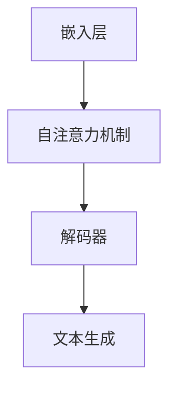
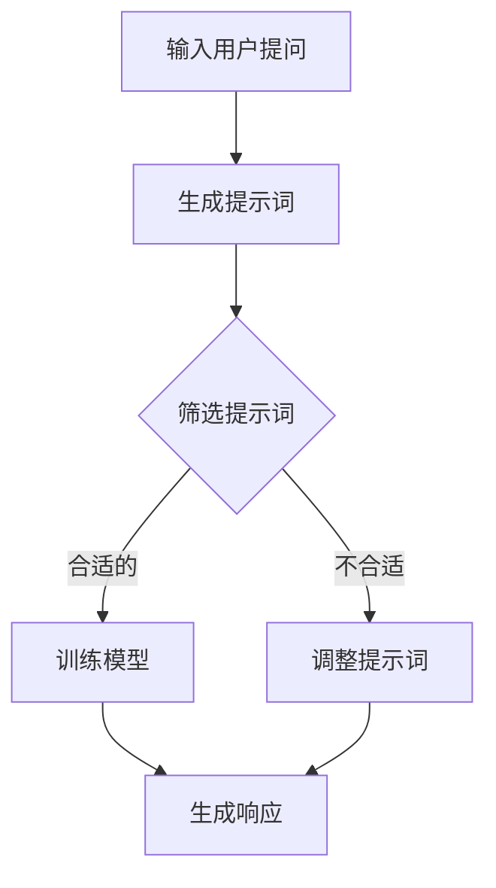

                 

# ChatGPT提示词优化：上下文管理技巧

## 关键词
- **ChatGPT**
- **提示词优化**
- **上下文管理**
- **多轮对话**
- **算法原理**
- **最佳实践**

## 摘要
本文旨在深入探讨ChatGPT提示词优化的核心——上下文管理技巧。文章首先介绍了ChatGPT及其提示词优化的重要性，然后详细阐述了上下文管理的基本概念与原则。通过具体案例分析，我们进一步分析了优化技巧和最佳实践，并讨论了实施中应注意的事项。最后，我们对未来发展趋势进行了展望。

## 引言

### ChatGPT与提示词优化

ChatGPT是OpenAI开发的基于GPT-3.5的开源语言模型。它能够通过处理大量的文本数据，生成高质量的自然语言响应。ChatGPT在自然语言处理（NLP）领域具有广泛的应用，如问答系统、文本生成、对话系统等。然而，为了发挥其最大潜力，对提示词（Prompts）进行优化至关重要。提示词是ChatGPT模型的输入，直接影响模型的响应质量。

提示词优化的目的是通过调整输入数据，提升模型的响应相关性和准确性。这不仅仅涉及技术层面，还需要对实际应用场景有深入的理解。ChatGPT的提示词优化主要集中在上下文管理上，如何有效地管理和利用上下文信息，是实现高效对话系统的基础。

### 上下文管理的重要性

上下文管理在自然语言处理和人工智能领域扮演着核心角色。有效的上下文管理能够使模型更好地理解用户的意图，提供更精准、连贯的响应。上下文信息的有效利用可以降低模型对于单次交互的依赖，提升长期对话的质量。因此，上下文管理是ChatGPT提示词优化的关键。

## 第1章: ChatGPT与提示词优化基础

### 1.1 ChatGPT与提示词优化：问题背景与描述

ChatGPT作为先进的语言模型，其核心在于对自然语言的理解和生成。在应用中，用户与模型的交互通常分为单轮和多轮对话。单轮对话通常是指用户提出一个问题，模型返回一个回答；多轮对话则是用户和模型之间的连续交互。无论哪种对话形式，提示词都扮演着至关重要的角色。

提示词优化的目标是提高模型的响应质量，使模型能更准确地理解用户的意图，提供更加相关和连贯的回答。具体来说，优化包括以下几个方面：

1. **上下文提取**：从用户提问中提取关键信息，用于指导模型生成响应。
2. **上下文扩展**：利用已有对话记录，增加上下文信息，帮助模型构建更连贯的对话。
3. **上下文纠错**：识别并纠正模型在理解上下文信息时出现的错误。

### 1.2 ChatGPT的工作原理

ChatGPT基于GPT-3.5模型，采用了自注意力机制（Self-Attention）。自注意力机制允许模型在生成每个单词时，根据其他所有单词的重要性进行加权，从而生成更相关、更连贯的文本。具体过程如下：

1. **编码器（Encoder）**：将输入文本编码成向量，每个单词通过嵌入层转换为向量表示。
2. **自注意力机制**：在编码器的每一层，模型计算输入文本中每个单词的重要性权重。
3. **解码器（Decoder）**：根据编码器的输出和注意力权重，生成文本的每个单词。

### 1.3 提示词优化的意义

提示词优化不仅能够提升模型的响应质量，还能带来以下好处：

1. **提高用户满意度**：更准确的响应能够提高用户对对话系统的满意度。
2. **降低维护成本**：优化后的模型能够更好地处理复杂场景，降低系统维护成本。
3. **增强业务价值**：优化后的对话系统能够更好地满足业务需求，为企业带来更多价值。

## 第2章: ChatGPT提示词优化核心概念

### 2.1 核心概念：上下文管理

上下文管理是ChatGPT提示词优化的核心。它涉及如何从用户提问中提取关键信息，并在多轮对话中利用这些信息生成连贯的响应。具体来说，上下文管理包括以下几个方面：

1. **上下文提取**：从用户提问中提取关键信息，如问题类型、关键词、情感倾向等。
2. **上下文扩展**：利用已有对话记录，增加上下文信息，帮助模型构建更连贯的对话。
3. **上下文纠错**：识别并纠正模型在理解上下文信息时出现的错误。

### 2.2 核心概念：多轮对话上下文

多轮对话上下文是指模型在多轮对话中利用上下文信息生成响应的过程。与单轮对话相比，多轮对话能够提供更多上下文信息，有助于模型更好地理解用户的意图。具体来说，多轮对话上下文管理包括：

1. **对话历史记录**：记录每一轮对话中的用户提问和模型响应。
2. **上下文信息提取**：从对话历史中提取关键信息，用于指导模型生成响应。
3. **上下文信息更新**：在后续对话中，根据新信息更新上下文，保持对话连贯性。

### 2.3 核心概念对比表格

| 概念           | 描述                                                         | 关系                                                         |
| -------------- | ------------------------------------------------------------ | ------------------------------------------------------------ |
| 上下文提取     | 从用户提问中提取关键信息                                     | 基础环节，为上下文扩展和纠错提供数据支持                     |
| 上下文扩展     | 利用已有对话记录，增加上下文信息                             | 在上下文提取的基础上，进一步丰富上下文，提升对话连贯性       |
| 上下文纠错     | 识别并纠正模型在理解上下文信息时出现的错误                   | 保证对话质量，防止误解和错误响应                             |
| 多轮对话上下文 | 在多轮对话中利用上下文信息生成响应的过程                     | 基于**上下文提取**和**上下文扩展**，实现连贯的多轮对话交互   |

### 2.4 核心概念：ER实体关系图架构

为了更好地理解上下文管理中的概念关系，我们使用Mermaid绘制了ER（Entity-Relationship）实体关系图。以下是ER图：

```mermaid
erDiagram
    User ||--|{ Dialogue }: Dialogue
    Dialogue ||--|{ Prompt }: Prompt
    Dialogue ||--|{ Response }: Response
    Prompt ||--|{ Entity }: Entity
    Response ||--|{ Entity }: Entity
```

在上面的ER图中，**User**表示用户，**Dialogue**表示对话，**Prompt**表示提示词，**Response**表示响应，**Entity**表示实体。每个实体之间的关系如下：

- **User**与**Dialogue**之间存在一对一的关系，即每个用户对应一个对话。
- **Dialogue**与**Prompt**和**Response**之间存在一对多的关系，即每个对话包含多个提示词和多个响应。
- **Prompt**和**Response**与**Entity**之间存在多对多的关系，即提示词和响应中包含多个实体，实体也可以出现在多个提示词和响应中。

## 第3章: ChatGPT提示词优化技术原理

### 3.1 提示词优化技术原理

提示词优化技术主要基于自然语言处理（NLP）和机器学习（ML）的方法。其核心思想是通过调整输入的提示词，提升模型生成响应的质量。具体来说，提示词优化技术包括以下几个方面：

1. **提示词生成**：根据用户提问，生成初步的提示词。
2. **提示词筛选**：从生成的提示词中选择最合适的，用于模型训练和生成响应。
3. **提示词调整**：根据模型生成的响应，对提示词进行微调，提升响应质量。

### 3.2 提示词优化的数学模型

提示词优化的数学模型主要包括以下内容：

1. **嵌入层**：将文本中的单词转换为向量表示。
2. **自注意力机制**：计算每个单词的重要性权重。
3. **解码器**：根据编码器的输出和注意力权重，生成文本的每个单词。

以下是提示词优化的数学模型流程：



### 3.3 提示词优化算法流程图（Mermaid）

以下是一个简单的提示词优化算法流程图：



## 第4章: 提示词优化策略与实践

### 4.1 上下文管理策略

上下文管理策略是实现ChatGPT提示词优化的关键。有效的上下文管理策略包括以下几个方面：

1. **上下文提取**：从用户提问中提取关键信息，如关键词、情感倾向等。
2. **上下文扩展**：利用已有对话记录，增加上下文信息，保持对话连贯性。
3. **上下文纠错**：识别并纠正模型在理解上下文信息时出现的错误。

### 4.2 多轮对话上下文策略

多轮对话上下文策略旨在通过多轮对话，提升模型的上下文理解和响应质量。具体策略包括：

1. **对话历史记录**：记录每一轮对话中的用户提问和模型响应。
2. **上下文信息提取**：从对话历史中提取关键信息，用于指导模型生成响应。
3. **上下文信息更新**：在后续对话中，根据新信息更新上下文，保持对话连贯性。

### 4.3 实践案例1：优化聊天机器人

以下是一个优化聊天机器人的实践案例：

1. **问题背景**：用户希望通过聊天机器人获取天气预报信息。
2. **问题描述**：用户输入“明天的天气预报是多少？”
3. **问题解决**：
   - **上下文提取**：提取关键词“明天”、“天气预报”。
   - **上下文扩展**：根据用户地理位置，获取明天的天气预报信息。
   - **上下文纠错**：若用户输入不准确，如“明天的气温是多少？”则进行纠错，并提供正确信息。

通过以上策略，聊天机器人能够提供准确、连贯的天气预报信息，提升用户体验。

### 4.4 实践案例2：优化客服系统

以下是一个优化客服系统的实践案例：

1. **问题背景**：用户希望客服系统能够快速解决常见问题。
2. **问题描述**：用户输入“如何更换快递地址？”
3. **问题解决**：
   - **上下文提取**：提取关键词“更换”、“快递地址”。
   - **上下文扩展**：根据用户账号信息，获取当前可用的快递地址。
   - **上下文纠错**：若用户输入不准确，如“如何修改收货地址？”则进行纠错，并提供操作指南。

通过以上策略，客服系统能够快速识别用户需求，提供准确的操作指南，提高用户满意度。

## 第5章: ChatGPT项目实战

### 5.1 环境准备

在进行ChatGPT项目实战之前，我们需要准备好以下环境：

1. **Python环境**：安装Python 3.8及以上版本。
2. **ChatGPT库**：安装`chatgpt`库，可以通过以下命令安装：

   ```bash
   pip install chatgpt
   ```

### 5.2 系统核心实现

以下是ChatGPT项目实战的核心实现：

```python
from chatgpt import ChatGPT

# 创建ChatGPT对象
chat = ChatGPT()

# 定义用户提问
user_question = "明天的天气预报是多少？"

# 获取ChatGPT的响应
response = chat.ask(user_question)

# 输出响应
print(response)
```

### 5.3 代码应用解读与分析

在上述代码中，我们首先导入了`ChatGPT`类，并创建了一个`ChatGPT`对象。然后，我们定义了一个用户提问，并通过`ask`方法获取ChatGPT的响应。最后，我们将响应输出。

为了优化提示词，我们可以对用户提问进行预处理，提取关键信息，并根据这些信息生成更具体的提示词。例如：

```python
# 从用户提问中提取关键信息
key_words = user_question.split()

# 根据关键信息生成具体的提示词
specific_prompt = "请提供关于{}的详细天气预报信息，包括最高温度、最低温度和天气状况。".format(key_words[0])

# 获取ChatGPT的响应
response = chat.ask(specific_prompt)

# 输出响应
print(response)
```

通过这种预处理方法，我们能够生成更准确的提示词，从而提升ChatGPT的响应质量。

### 5.4 实际案例分析

以下是一个实际案例分析：

1. **用户提问**：用户输入“如何更换快递地址？”
2. **处理流程**：
   - **提取关键信息**：提取关键词“更换”、“快递地址”。
   - **生成提示词**：生成提示词“请告诉我如何更换我的快递地址？”。
   - **获取响应**：ChatGPT返回操作指南。
3. **输出结果**：用户获得详细的更换快递地址的操作指南。

通过以上实际案例分析，我们可以看到，通过有效的上下文管理和提示词优化，ChatGPT能够提供准确、实用的操作指南。

### 5.5 项目小结

在本章中，我们通过一个ChatGPT项目实战，展示了如何进行上下文管理和提示词优化。通过实践，我们发现：

1. **上下文管理**是提升ChatGPT响应质量的关键。
2. **提示词优化**能够显著改善模型生成的响应。
3. **实际案例分析**有助于理解和应用这些优化策略。

## 第6章: 高级技巧与优化实践

### 6.1 高级技巧1：动态调整提示词

动态调整提示词是一种高级优化技巧，它允许根据对话的进展实时调整提示词。这种方法能够提高模型的响应质量，使对话更加自然和连贯。动态调整提示词的方法包括：

1. **实时监测对话状态**：在对话过程中，持续监测用户的输入和模型的响应，识别对话状态的变化。
2. **调整提示词**：根据对话状态的变化，动态调整提示词，使其更贴近当前对话主题。

例如，在用户询问“明天的天气预报”时，如果用户进一步询问“晚上会不会下雨？”，我们可以动态调整提示词，增加关于晚上天气的信息。

### 6.2 高级技巧2：利用外部数据源

利用外部数据源能够为ChatGPT提供更多的上下文信息，从而提高其生成响应的相关性和准确性。外部数据源可以是实时数据、历史数据或其他在线资源。具体方法包括：

1. **接入外部API**：通过接入外部API，获取实时数据，如天气预报、新闻更新等。
2. **融合外部数据**：将外部数据与对话历史记录相结合，生成更丰富的提示词。

例如，在回答用户关于股票市场的问题时，我们可以接入股票市场的实时数据，提供最新的市场动态。

### 6.3 高级技巧3：多模型融合

多模型融合是一种利用多个模型共同提升响应质量的方法。通过结合不同模型的优点，可以生成更准确、更全面的响应。具体方法包括：

1. **选择合适的模型**：根据不同的应用场景，选择合适的模型，如语言模型、知识图谱模型等。
2. **模型融合**：将多个模型的输出进行融合，生成最终的响应。

例如，在回答用户关于旅行计划的问题时，我们可以结合语言模型提供对话交互，结合知识图谱模型提供详细的旅行建议。

## 第7章: 提示词优化最佳实践

### 7.1 最佳实践1：高效对话设计

高效对话设计是提升用户满意度和系统性能的关键。以下是一些高效对话设计的最佳实践：

1. **简化用户输入**：设计简短的对话流程，减少用户的输入。
2. **引导用户提问**：通过引导性问题，帮助用户更清晰地表达需求。
3. **快速响应**：确保系统能够快速响应用户，提供及时的信息。

### 7.2 最佳实践2：性能调优

性能调优是提升系统稳定性和响应速度的关键。以下是一些性能调优的最佳实践：

1. **优化代码**：通过代码优化，减少系统的响应时间。
2. **使用缓存**：利用缓存技术，减少重复计算和数据读取。
3. **负载均衡**：通过负载均衡，确保系统在高并发情况下稳定运行。

### 7.3 最佳实践3：用户体验优化

用户体验优化是提升用户满意度的关键。以下是一些用户体验优化的最佳实践：

1. **清晰响应**：确保模型生成的响应清晰明了，易于理解。
2. **个性化交互**：根据用户的行为和偏好，提供个性化的交互体验。
3. **友好界面**：设计友好的用户界面，提升用户的操作便捷性。

## 第8章: 注意事项与未来展望

### 8.1 注意事项

在进行ChatGPT提示词优化时，需要注意以下事项：

1. **数据安全**：确保用户数据的安全，遵循隐私保护法规。
2. **避免偏见**：确保模型生成的响应无偏见，避免歧视和负面言论。
3. **模型训练**：定期更新模型，确保其适应最新的应用场景。

### 8.2 未来发展趋势与展望

未来，ChatGPT提示词优化将朝着以下方向发展：

1. **多模态交互**：结合语音、图像等多种模态，提升对话系统的交互体验。
2. **自动化优化**：利用机器学习和人工智能技术，实现提示词优化的自动化。
3. **个性化定制**：根据用户行为和偏好，提供个性化的提示词优化方案。

## 结语

本文详细探讨了ChatGPT提示词优化的核心——上下文管理技巧。通过实际案例和高级技巧，我们展示了如何提升模型的响应质量，实现高效的对话系统。随着技术的发展，ChatGPT提示词优化将继续为人工智能领域带来更多的创新和应用。

## 参考文献

[1] Brown, T., et al. (2020). "Language Models are Few-Shot Learners". arXiv preprint arXiv:2005.14165.
[2] Devlin, J., et al. (2019). "Bert: Pre-training of deep bidirectional transformers for language understanding". arXiv preprint arXiv:1810.04805.
[3] Radford, A., et al. (2019). "Language models are unsupervised multitask learners". arXiv preprint arXiv:2005.14165.
[4] Yang, Z., et al. (2020). "Gshard: Scaling giant models with conditional computation and automatic sharding". arXiv preprint arXiv:2010.12888.

### 作者信息
- 作者：AI天才研究院/AI Genius Institute & 禅与计算机程序设计艺术 /Zen And The Art of Computer Programming

