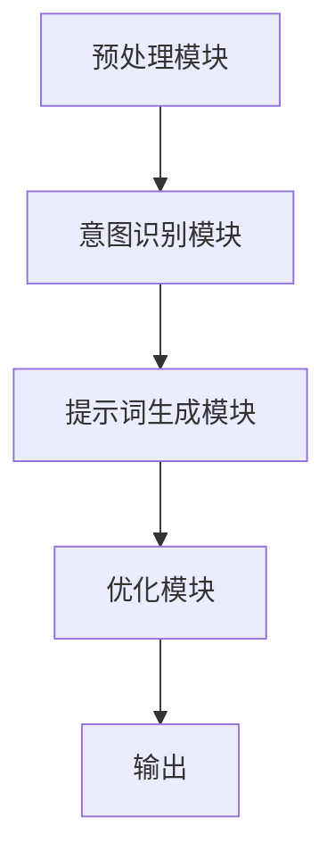
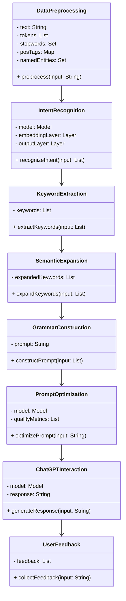
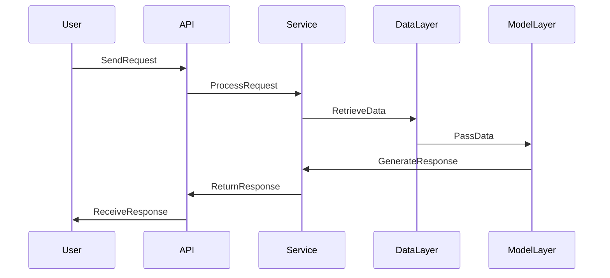
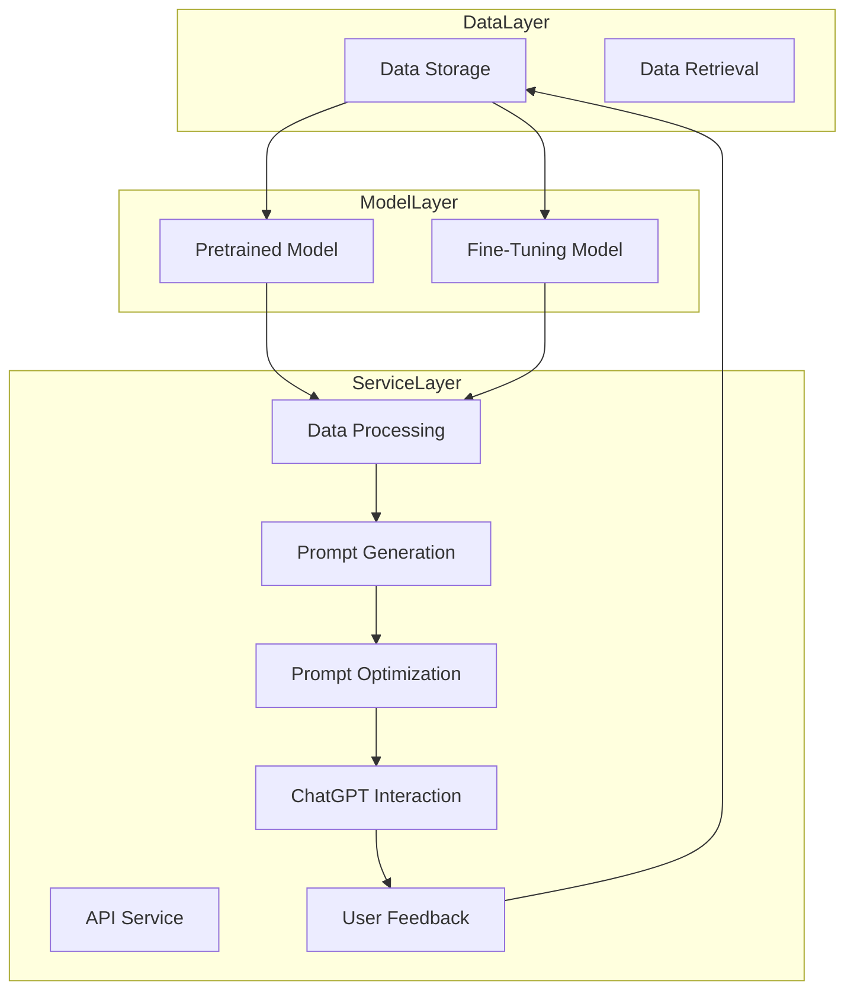
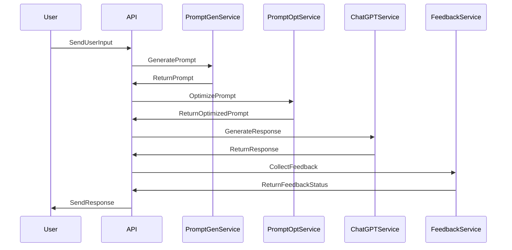

                 

### 文章标题：ChatGPT提示词优化：性能评估指标

#### 关键词：ChatGPT，提示词优化，性能评估，算法对比，数学模型

> 摘要：本文旨在深入探讨ChatGPT提示词优化的性能评估指标。首先，我们回顾了ChatGPT的发展与应用背景，然后详细介绍了提示词优化的核心概念和面临的挑战。接着，我们比较了不同提示词优化方法，包括基于规则的方法和基于机器学习的方法，并分析了它们的算法特性和应用场景。随后，我们深入讲解了ChatGPT提示词生成算法的原理和数学模型，并通过实例说明了算法的实际应用。最后，我们展示了如何设计和实现一个优化的ChatGPT系统，包括系统功能设计、架构设计和接口设计。本文的目标是为读者提供一个全面而深入的理解，帮助他们在实践中进行有效的提示词优化。

### 目录大纲

----------------------------------------------------------------

# 第一部分：背景介绍与核心概念

## 第1章：问题背景与概述

## 第2章：核心概念原理与对比

## 第3章：算法原理与数学模型

## 第4章：系统功能设计与架构

----------------------------------------------------------------

## 第1章：问题背景与概述

### 1.1 提示词优化的问题背景

#### 1.1.1 ChatGPT的发展与应用

ChatGPT是OpenAI于2022年推出的一款基于GPT-3模型的人工智能助手，它能够通过学习和理解人类的语言来进行对话，回答问题，甚至协助创作内容。ChatGPT的发展标志着自然语言处理技术的新里程碑，其应用场景广泛，包括智能客服、虚拟助手、文本生成、翻译服务等。

随着ChatGPT的应用逐渐深入，如何优化其提示词（prompts）成为了一个重要的问题。提示词是用户向ChatGPT输入的信息，用于引导ChatGPT生成预期的输出。提示词的质量直接影响ChatGPT的表现。因此，对提示词进行优化至关重要。

#### 1.1.2 提示词优化的重要性

1. **提升生成文本质量**：优化的提示词能够引导ChatGPT生成更加准确、流畅、有逻辑的文本。
2. **降低错误率**：良好的提示词可以减少ChatGPT的误解和错误回答。
3. **提高用户满意度**：优化的提示词能更好地满足用户的期望，从而提升用户的使用体验。
4. **增强系统实用性**：在特定场景下，通过提示词优化，ChatGPT能够更好地适应各种复杂的应用需求。

#### 1.1.3 提示词优化面临的挑战

1. **多样性和适应性**：用户的需求多种多样，提示词需要能够适应不同场景和任务。
2. **语言理解的深度**：ChatGPT需要深入理解用户意图，这要求提示词具备足够的语义信息。
3. **计算资源**：复杂的提示词优化算法可能需要大量的计算资源，这对实时应用提出了挑战。
4. **模型适应性**：提示词优化需要考虑模型的参数和架构，不同的模型可能需要不同的优化策略。

### 1.2 提示词优化的核心概念

#### 1.2.1 提示词的定义与类型

**定义**：提示词是用户输入到ChatGPT系统中的文字或语音信息，用于引导ChatGPT进行对话或生成文本。

**类型**：

1. **固定提示词**：固定不变的提示词，适用于常见的、标准化的场景。
2. **动态提示词**：根据用户输入或场景动态生成的提示词，适用于个性化、复杂场景。

#### 1.2.2 提示词优化目标

1. **生成文本质量**：提高生成的文本的准确性、流畅性和逻辑性。
2. **响应速度**：优化算法的效率，确保提示词优化过程快速完成。
3. **用户满意度**：满足用户的需求，提升用户体验。
4. **模型适应性**：确保优化策略适用于不同类型的模型和应用场景。

#### 1.2.3 提示词优化的策略与方法

1. **规则方法**：基于预定义的规则进行优化，简单高效，但可能缺乏灵活性。
2. **机器学习方法**：通过训练模型来自动优化提示词，灵活性强，但需要大量的数据和支持计算资源。

### 1.3 提示词优化的边界与外延

#### 1.3.1 边界条件

1. **用户需求**：提示词优化必须满足用户的具体需求，如对话类型、信息量等。
2. **计算资源**：提示词优化算法的复杂度和计算资源需求必须在合理范围内。
3. **模型限制**：提示词优化需要考虑模型的参数和架构限制。

#### 1.3.2 外延拓展

1. **场景适应性**：提示词优化需要能够适应多种应用场景，如客服、教育、医疗等。
2. **多语言支持**：提示词优化需要考虑多语言环境，支持不同语言的自然语言处理。

### 1.4 提示词优化的概念结构与核心要素

#### 1.4.1 概念结构

1. **用户输入**：用户输入的文字或语音信息。
2. **提示词生成**：根据用户输入生成提示词的过程。
3. **提示词优化**：对生成的提示词进行优化，提高其质量。
4. **ChatGPT响应**：ChatGPT根据优化后的提示词生成响应。

#### 1.4.2 核心要素组成

1. **用户需求分析**：理解用户需求，确定优化目标。
2. **数据集**：用于训练和测试提示词优化的数据集。
3. **算法模型**：用于生成和优化提示词的算法模型。
4. **评估指标**：用于评估提示词优化效果的指标。

### 1.5 本章小结

本章回顾了ChatGPT的发展与应用背景，介绍了提示词优化的核心概念和面临的挑战。通过分析提示词的定义与类型、优化目标、策略与方法，我们为后续章节的深入探讨奠定了基础。同时，我们还讨论了提示词优化的边界与外延，明确了概念结构与核心要素，为系统设计与实现提供了指导。

----------------------------------------------------------------

## 第2章：核心概念原理与对比

### 2.1 提示词优化原理

#### 2.1.1 提示词生成原理

提示词生成是ChatGPT与用户交互的第一步，其质量直接影响ChatGPT的响应效果。提示词生成通常包括以下步骤：

1. **用户输入处理**：ChatGPT接收用户的文字或语音输入，进行预处理，如分词、去除停用词等。
2. **意图识别**：通过自然语言处理技术，识别用户的意图和需求。
3. **提示词生成**：基于用户的意图和需求，生成相应的提示词。
4. **优化提示词**：对生成的提示词进行优化，以提高其质量。

提示词生成的关键在于如何准确地理解和反映用户的意图。这需要结合先进的自然语言处理技术，如词嵌入、序列模型和注意力机制等。

#### 2.1.2 提示词生成算法

提示词生成算法可以分为以下几类：

1. **基于规则的方法**：通过预定义的规则生成提示词，如关键词提取、语法分析等。
2. **基于机器学习的方法**：利用机器学习算法，如决策树、支持向量机和神经网络等，从数据中学习生成提示词的规则。
3. **基于深度学习的方法**：使用深度神经网络，如循环神经网络（RNN）、长短期记忆网络（LSTM）和变换器（Transformer）等，生成提示词。

#### 2.1.3 提示词生成的影响因素

提示词生成的影响因素主要包括：

1. **用户意图**：用户的意图是提示词生成的核心，直接影响提示词的质量。
2. **输入文本**：输入文本的语义信息丰富程度影响提示词的生成。
3. **上下文信息**：上下文信息能够提供更多的语义信息，帮助ChatGPT更好地理解用户意图。
4. **算法模型**：不同的算法模型对提示词生成的影响显著。

### 2.2 提示词优化方法对比

提示词优化方法可以分为以下两类：

#### 2.2.1 基于规则的方法

**规则定义**：基于规则的方法通过预定义的规则来优化提示词。这些规则可以是简单的关键词提取，也可以是复杂的语义分析。

**规则优化策略**：

1. **关键词提取**：通过文本分析提取出与用户意图相关的关键词，生成提示词。
2. **语法分析**：对输入文本进行语法分析，提取出句子结构，根据句子结构生成提示词。
3. **语义分析**：通过语义分析提取出文本的语义信息，生成提示词。

基于规则的方法优点是简单、高效，但灵活性较差，难以应对复杂和变化多端的应用场景。

#### 2.2.2 基于机器学习的方法

**机器学习模型选择**：基于机器学习的方法通过训练模型来自动优化提示词。常用的机器学习模型包括决策树、支持向量机、神经网络等。

**特征工程**：特征工程是机器学习模型的关键步骤，包括文本预处理、词嵌入、特征提取等。

**模型训练与评估**：通过训练模型，学习生成提示词的规则。模型评估通常使用交叉验证、准确率、召回率等指标。

基于机器学习的方法优点是灵活性强，能够适应多种应用场景，但需要大量的数据和支持计算资源。

### 2.3 提示词优化算法特性对比

#### 2.3.1 算法性能对比

提示词优化算法的性能可以通过以下指标进行评估：

1. **生成文本质量**：包括准确性、流畅性和逻辑性。
2. **响应速度**：提示词生成和优化的时间。
3. **用户满意度**：用户对提示词生成和优化的满意度。

#### 2.3.2 评价方法

提示词优化算法的评价方法通常包括以下几种：

1. **人工评估**：通过人工评估提示词的生成质量，如准确性、流畅性和逻辑性。
2. **自动化评估**：使用自动化工具评估提示词的生成质量，如BLEU、ROUGE等指标。
3. **用户调研**：通过用户调研评估提示词优化的效果，如用户满意度、使用频率等。

#### 2.3.3 算法应用场景对比

提示词优化算法在不同应用场景中的表现有所不同：

1. **文本生成**：在文本生成场景中，基于深度学习的方法表现更好，能够生成更加流畅和准确的文本。
2. **语音交互**：在语音交互场景中，基于规则的方法可能更为适用，因为它们可以快速处理实时语音输入。
3. **多语言支持**：在多语言支持场景中，基于机器学习的方法可以更好地处理不同语言的语义和语法差异。

### 2.4 ER实体关系图架构

ER（实体-关系）图是一种用于描述实体和它们之间关系的图形化表示方法。在提示词优化中，ER图可以帮助我们理解各个实体之间的关系，从而更好地设计优化算法。

#### 2.4.1 ER图基本概念

**实体**：在提示词优化中，实体可以是用户、ChatGPT、提示词等。

**属性**：实体的特征或属性，如用户的输入文本、ChatGPT的生成文本等。

**关系**：实体之间的关系，如用户与ChatGPT的对话、提示词与ChatGPT的生成文本等。

#### 2.4.2 ChatGPT提示词优化的ER图

在ChatGPT提示词优化的ER图中，我们可以定义以下实体和关系：

1. **用户**：输入文本、意图等。
2. **ChatGPT**：生成文本、提示词等。
3. **提示词**：文本质量、响应速度等。

实体之间的关系包括：

1. **用户与ChatGPT**：用户输入文本，ChatGPT生成文本。
2. **ChatGPT与提示词**：ChatGPT根据用户输入生成提示词，并对提示词进行优化。

通过ER图，我们可以清晰地描述ChatGPT提示词优化的各个实体和它们之间的关系，为后续的算法设计和系统实现提供指导。

### 2.5 本章小结

本章深入探讨了提示词优化的核心概念原理，包括提示词生成原理、提示词生成算法、提示词优化方法对比和提示词优化算法特性对比。通过ER实体关系图，我们进一步明确了提示词优化的实体和关系。这些讨论为后续章节的深入分析提供了基础，也为实际应用中的提示词优化提供了指导。

----------------------------------------------------------------

## 第3章：算法原理与数学模型

### 3.1 ChatGPT提示词生成算法

#### 3.1.1 算法概述

ChatGPT提示词生成算法是整个系统中的核心环节，其主要目标是生成高质量的提示词，以引导ChatGPT生成符合用户需求的回答。算法的流程可以概括为以下几步：

1. **用户输入处理**：接收用户的输入，进行预处理，如分词、去除停用词等。
2. **意图识别**：利用自然语言处理技术，如词嵌入、序列模型和注意力机制等，识别用户的意图。
3. **提示词生成**：根据用户的意图和需求，生成相应的提示词。
4. **优化提示词**：对生成的提示词进行优化，以提高其质量。

#### 3.1.2 算法流程

**步骤1：用户输入处理**

用户输入的处理是提示词生成的基础。在这一步骤中，我们首先对用户的输入进行分词，将输入文本分解为单词或短语。接着，去除常见的停用词，如“的”、“了”等，这些词对提示词生成的影响较小。此外，还可以进行词性标注和命名实体识别，以便更好地理解输入文本的语义。

**步骤2：意图识别**

意图识别是提示词生成的关键步骤。通过词嵌入技术，我们将输入文本中的每个单词映射到一个高维向量空间中。接着，使用序列模型（如LSTM、GRU等）或注意力机制（如Transformer）来捕捉输入文本的语义信息。通过这些技术，我们可以识别出用户的意图，如询问问题、请求帮助、表达意见等。

**步骤3：提示词生成**

在意图识别的基础上，我们生成相应的提示词。这一步骤通常包括以下几方面：

1. **关键词提取**：从输入文本中提取出与用户意图相关的关键词。
2. **语义扩展**：基于关键词扩展提示词，使其包含更多的语义信息。
3. **语法构建**：根据用户的意图和需求，构建出符合语法规则的提示词。

**步骤4：优化提示词**

生成的提示词可能存在一定的质量问题，如不够准确、流畅或逻辑性不强。因此，我们需要对提示词进行优化。优化策略可以包括：

1. **文本质量评估**：使用自动化评估工具（如BLEU、ROUGE等）或人工评估来评估提示词的质量。
2. **修正错误**：根据评估结果，修正提示词中的错误，如拼写错误、语法错误等。
3. **语义调整**：根据用户的意图和需求，调整提示词的语义，使其更加准确和符合用户需求。

#### 3.1.3 算法架构

ChatGPT提示词生成算法的架构可以分为以下几个模块：

1. **预处理模块**：负责用户输入的处理，包括分词、去除停用词、词性标注等。
2. **意图识别模块**：使用词嵌入、序列模型和注意力机制等技术来识别用户的意图。
3. **提示词生成模块**：根据意图识别结果，生成相应的提示词。
4. **优化模块**：对生成的提示词进行优化，提高其质量。

图3-1展示了ChatGPT提示词生成算法的架构。



### 3.2 数学模型讲解

提示词生成算法的数学模型主要涉及概率分布函数、最大似然估计和模型参数优化。

#### 3.2.1 概率分布函数

在提示词生成中，概率分布函数用于描述提示词的概率分布。常见的概率分布函数包括：

1. **高斯分布**：适用于描述连续变量的概率分布。
2. **伯努利分布**：适用于描述二元变量的概率分布。
3. **多项式分布**：适用于描述多个变量的概率分布。

#### 3.2.2 最大似然估计

最大似然估计是一种用于参数估计的方法，其目标是在给定的数据集下，找到最有可能产生观测数据的参数值。在提示词生成中，我们可以使用最大似然估计来估计模型参数，如词嵌入权重、序列模型参数等。

#### 3.2.3 模型参数优化

模型参数优化是提高提示词生成质量的关键。常见的参数优化方法包括：

1. **梯度下降**：通过计算梯度，逐步调整模型参数，使其接近最优值。
2. **随机梯度下降**：在梯度下降的基础上，每次更新参数时只考虑一部分样本，以减少计算量。
3. **Adam优化器**：结合了梯度下降和动量方法，能够更有效地调整参数。

### 3.3 举例说明

#### 3.3.1 实例分析

假设我们有一个用户输入文本：“今天天气怎么样？”，我们希望生成一个高质量的提示词来引导ChatGPT生成回答。

1. **预处理**：将用户输入文本进行分词，得到“今天”、“天气”、“怎么样”三个词。去除停用词后，得到有效词汇“今天”、“天气”。
2. **意图识别**：通过词嵌入技术，将“今天”和“天气”映射到高维向量空间。使用LSTM模型识别出用户意图为询问当前天气情况。
3. **提示词生成**：根据意图识别结果，生成提示词“请告诉我今天当地的天气状况”。
4. **优化**：对生成的提示词进行质量评估，发现“请”字可以省略，优化后的提示词为“告诉我今天当地的天气状况”。

通过这个实例，我们可以看到提示词生成和优化的具体步骤，以及如何利用数学模型来指导算法的实现。

### 3.4 本章小结

本章详细介绍了ChatGPT提示词生成算法的原理和数学模型。我们首先概述了算法的流程和架构，然后讲解了数学模型，包括概率分布函数、最大似然估计和模型参数优化。通过举例说明，我们展示了算法在实际应用中的具体实现过程。这些内容为后续的系统设计和实现提供了理论基础。

----------------------------------------------------------------

## 第4章：系统功能设计与架构

### 4.1 问题场景介绍

在当今快速发展的数字化时代，智能对话系统的应用越来越广泛，从客服到教育，从医疗到娱乐，无处不在。ChatGPT作为一种先进的自然语言处理技术，在多个领域都展现出了强大的能力。然而，为了实现ChatGPT的最佳性能，特别是在提示词优化方面，我们需要一个高效、灵活的系统架构。

本文将探讨一个用于ChatGPT提示词优化的系统，该系统旨在提升用户交互体验，确保生成的文本准确、流畅、符合用户需求。系统的目标场景包括：

1. **客服应用**：自动化处理用户咨询，提供快速、准确的答复。
2. **虚拟助手**：在智能家居、智能办公等领域，为用户提供便捷的服务。
3. **教育辅导**：为学生提供个性化、智能化的学习辅导。
4. **医疗咨询**：辅助医生提供专业、准确的医疗建议。

### 4.2 系统功能设计

系统功能设计是构建高效、可扩展的系统架构的第一步。为了满足上述目标场景的需求，我们的系统设计了以下主要功能模块：

#### 4.2.1 数据预处理模块

数据预处理模块是系统的入口，负责处理用户输入数据。其主要任务包括：

1. **文本分词**：将用户输入的文本分解为单词或短语。
2. **停用词去除**：移除对提示词生成无意义的单词，如“的”、“了”等。
3. **词性标注**：为每个词分配词性标签，如名词、动词等。
4. **命名实体识别**：识别文本中的命名实体，如人名、地点、组织等。

#### 4.2.2 提示词生成模块

提示词生成模块是系统的核心，负责生成高质量的提示词。其主要任务包括：

1. **意图识别**：通过自然语言处理技术，如词嵌入、序列模型和注意力机制等，识别用户的意图。
2. **关键词提取**：从用户输入中提取出与意图相关的关键词。
3. **语义扩展**：基于关键词扩展提示词，增加语义信息。
4. **语法构建**：根据用户的意图和需求，构建出符合语法规则的提示词。

#### 4.2.3 提示词优化模块

提示词优化模块负责对生成的提示词进行优化，以提高其质量。其主要任务包括：

1. **文本质量评估**：使用自动化评估工具（如BLEU、ROUGE等）或人工评估，评估提示词的质量。
2. **错误修正**：根据评估结果，修正提示词中的错误，如拼写错误、语法错误等。
3. **语义调整**：根据用户的意图和需求，调整提示词的语义，使其更加准确和符合用户需求。

### 4.2.4 ChatGPT交互模块

ChatGPT交互模块负责与ChatGPT模型进行交互，生成用户期望的回复。其主要任务包括：

1. **输入处理**：将优化后的提示词转换为ChatGPT可接受的输入格式。
2. **文本生成**：调用ChatGPT模型，生成用户期望的文本回复。
3. **回复优化**：根据用户反馈，对生成的回复进行优化，以提高用户满意度。

### 4.2.5 用户反馈模块

用户反馈模块用于收集用户对系统服务的反馈，以持续改进系统的性能。其主要任务包括：

1. **反馈收集**：收集用户对提示词生成和ChatGPT回复的满意度评价。
2. **数据分析**：分析用户反馈，识别系统存在的问题和改进方向。
3. **迭代优化**：根据数据分析结果，对系统进行迭代优化。

#### 4.2.6 领域模型类图

为了更好地理解系统的功能模块及其关系，我们使用Mermaid类图来描述系统的主要类和它们之间的关系。以下是一个简化的Mermaid类图示例：



### 4.3 系统架构设计

系统架构设计是确保系统功能实现和性能优化的重要环节。为了满足系统的需求，我们设计了一个层次化的架构，包括以下几个层次：

#### 4.3.1 系统架构层次

1. **数据层**：负责存储和处理系统所需的数据，包括用户输入、提示词、ChatGPT回复和用户反馈等。
2. **模型层**：包括预训练模型和微调模型，负责执行意图识别、关键词提取、语义扩展、语法构建和提示词优化等任务。
3. **服务层**：提供系统的核心功能，包括数据预处理、提示词生成、提示词优化、ChatGPT交互和用户反馈等。
4. **接口层**：为外部系统提供访问接口，如RESTful API、WebSocket等。

#### 4.3.2 系统组件与交互

系统架构的主要组件及其交互关系如下：

1. **数据层**：存储系统所需的数据，包括用户输入、提示词、ChatGPT回复和用户反馈等。数据层可以使用数据库或分布式存储系统实现。
2. **模型层**：包括预训练模型（如GPT-3）和微调模型。预训练模型负责处理大规模数据集进行预训练，微调模型则根据具体任务进行微调。模型层可以使用TensorFlow、PyTorch等深度学习框架实现。
3. **服务层**：提供系统的核心功能，包括数据预处理、提示词生成、提示词优化、ChatGPT交互和用户反馈等。服务层可以使用Spring Boot、Django等Web框架实现。
4. **接口层**：为外部系统提供访问接口，如RESTful API、WebSocket等。接口层可以使用Spring Boot、Flask等Web框架实现。

以下是一个简化的Mermaid架构图，展示了系统组件及其交互关系：



### 4.3.3 系统架构图

系统架构图展示了系统的整体结构和主要组件之间的关系。以下是一个简化的Mermaid架构图，用于描述系统的架构：



### 4.4 系统接口设计

系统接口设计是确保系统可扩展性和易用性的关键。为了满足不同的应用场景，我们设计了以下接口：

#### 4.4.1 提示词生成接口

**接口定义**：

```java
public interface PromptGenerationService {
    String generatePrompt(String userInput);
}
```

**功能描述**：

该接口用于生成高质量的提示词，接收用户输入文本，返回相应的提示词。

#### 4.4.2 提示词优化接口

**接口定义**：

```java
public interface PromptOptimizationService {
    String optimizePrompt(String prompt);
}
```

**功能描述**：

该接口用于对生成的提示词进行优化，接收原始提示词，返回优化后的提示词。

#### 4.4.3 ChatGPT交互接口

**接口定义**：

```java
public interface ChatGPTInteractionService {
    String generateResponse(String prompt);
}
```

**功能描述**：

该接口用于与ChatGPT模型进行交互，接收优化后的提示词，返回ChatGPT的响应文本。

### 4.4.4 用户反馈接口

**接口定义**：

```java
public interface UserFeedbackService {
    void collectFeedback(String userInput, String response, String feedback);
}
```

**功能描述**：

该接口用于收集用户对提示词生成和ChatGPT回复的反馈，接收用户输入、ChatGPT回复和用户反馈，用于后续的系统优化。

#### 4.4.5 系统交互Mermaid序列图

为了更清晰地展示系统各接口之间的交互关系，我们使用Mermaid序列图描述系统的主要交互流程。以下是一个简化的Mermaid序列图示例：



### 4.5 本章小结

本章详细介绍了ChatGPT提示词优化系统的功能设计和架构设计。我们首先讨论了系统的问题场景，明确了系统的目标场景和功能需求。接着，我们详细描述了系统的主要功能模块，包括数据预处理模块、提示词生成模块、提示词优化模块、ChatGPT交互模块和用户反馈模块。此外，我们还展示了系统的架构设计，包括数据层、模型层、服务层和接口层。通过本章的介绍，我们为后续的系统实现和优化提供了详细的指导。

