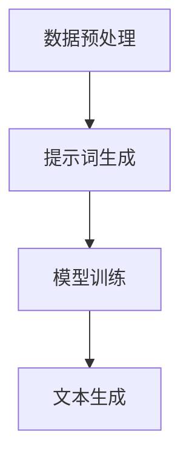
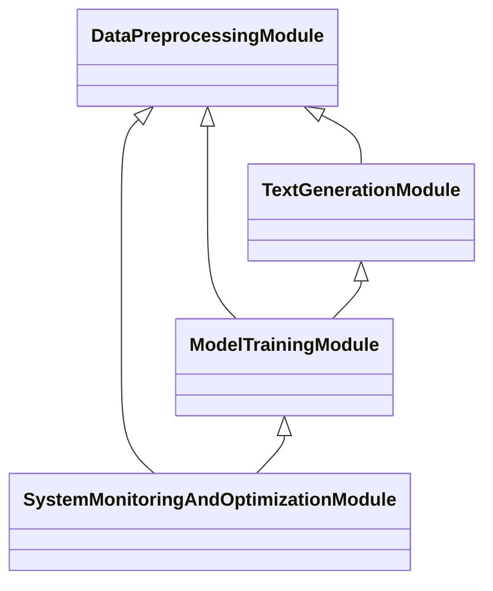
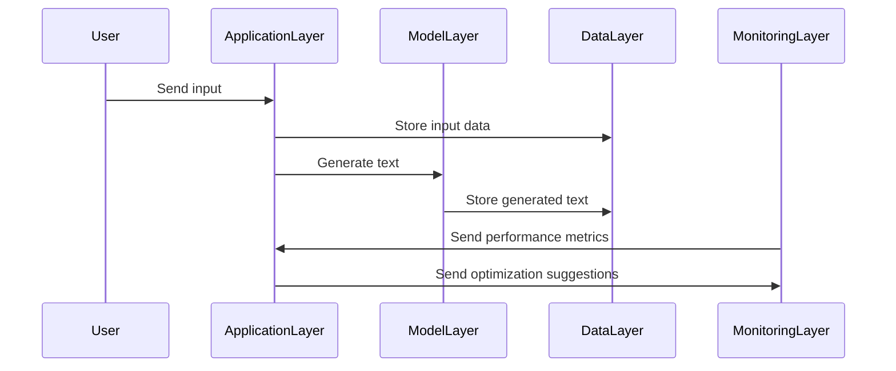
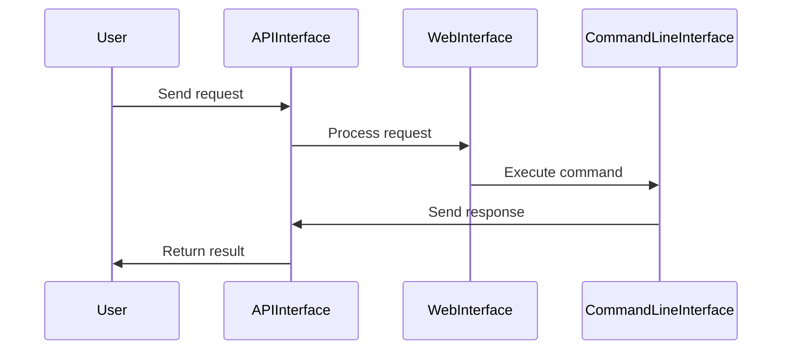
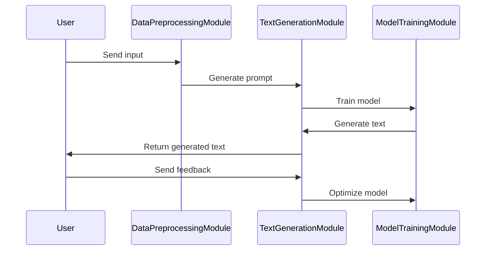

                 

### 《ChatGPT提示词优化：效果最大化的策略》

---

#### 关键词：
- ChatGPT
- 提示词优化
- 人工智能
- 算法
- 效果最大化

#### 摘要：
本文深入探讨了ChatGPT提示词优化的策略，旨在提供一套系统化、可操作的优化方法，实现效果最大化。文章首先介绍了ChatGPT的背景及其应用挑战，随后详细阐述了提示词优化的概念、目标和核心要素。接着，文章通过分析ChatGPT的工作原理，提出了优化提示词的原理和属性特征对比。在此基础上，本文详细讲解了优化算法的原理、数学模型和实现流程，并通过具体案例展示了算法的实际应用效果。最后，文章从系统分析和架构设计角度，对提示词优化项目进行了全面剖析，并提供了实战指导和小结。

---

### 目录大纲

#### 第一部分：背景介绍与核心概念

1. **问题背景与核心概念**
    - **1.1 ChatGPT的兴起与影响**
    - **1.2 提示词优化的定义与意义**
    - **1.3 ChatGPT提示词优化的核心要素**
    - **1.4 提示词优化的边界与外延**

2. **核心概念与联系**
    - **2.1 ChatGPT的工作原理**
    - **2.2 提示词优化原理解析**
    - **2.3 ChatGPT提示词优化的属性特征对比**
    - **2.4 ChatGPT提示词优化的ER实体关系图架构**

#### 第二部分：算法原理讲解

3. **ChatGPT提示词优化算法讲解**
    - **3.1 算法基本流程**
    - **3.2 算法原理详细讲解**
    - **3.3 举例说明**

#### 第三部分：系统分析与架构设计

4. **ChatGPT提示词优化系统分析**
    - **4.1 问题场景介绍**
    - **4.2 系统功能设计**
    - **4.3 系统架构设计**
    - **4.4 系统交互设计**

#### 第四部分：项目实战

5. **ChatGPT提示词优化项目实战**
    - **5.1 环境安装与配置**
    - **5.2 系统核心实现**
    - **5.3 代码应用解读与分析**
    - **5.4 实际案例分析与详细讲解**
    - **5.5 项目小结**

---

### 第一部分：背景介绍与核心概念

#### 第1章：问题背景与核心概念

##### 1.1 ChatGPT的兴起与影响

ChatGPT是由OpenAI开发的基于GPT-3模型的人工智能助手，自2022年推出以来，迅速在全球范围内引起了广泛关注。ChatGPT的出现，标志着自然语言处理技术进入了一个新的阶段，其强大的生成能力和交互能力为各个领域带来了巨大的变革。

- **ChatGPT的发展历程**：
  - 2022年，OpenAI发布GPT-3模型，拥有1750亿个参数，成为当时最大的语言模型。
  - 2022年，OpenAI发布ChatGPT，基于GPT-3模型，具备强大的文本生成和对话能力。

- **ChatGPT的核心优势**：
  - **生成能力强大**：ChatGPT能够生成流畅、符合逻辑的文本，包括文章、对话等。
  - **交互能力强**：ChatGPT能够与人类进行自然对话，理解并回应复杂的问题。

- **ChatGPT在实际应用中的挑战**：
  - **可解释性**：由于ChatGPT的生成过程是高度自动化的，其决策过程往往难以解释。
  - **偏见和错误**：ChatGPT的生成内容可能受到训练数据的影响，存在偏见和错误。
  - **计算资源需求**：ChatGPT的训练和推理需要大量的计算资源。

##### 1.2 提示词优化的定义与意义

提示词优化是指通过改进输入提示词的质量和结构，从而提升ChatGPT生成文本的准确性和流畅性的过程。

- **提示词优化的概念**：
  - **提示词**：引导ChatGPT生成特定类型文本的关键词或句子。
  - **优化**：通过调整提示词的长度、结构、情感等因素，提升生成文本的质量。

- **提示词优化的意义**：
  - **提升生成文本质量**：优化后的提示词能够引导ChatGPT生成更准确、更流畅的文本。
  - **提高交互体验**：优化提示词能够提升用户与ChatGPT的交互体验，使其更加自然、高效。
  - **降低偏见和错误**：通过优化提示词，减少ChatGPT生成内容中的偏见和错误。

- **提示词优化的目标**：
  - **准确性**：生成文本要与用户意图一致，避免歧义。
  - **流畅性**：生成文本要符合语言规范，表达清晰。
  - **多样性**：生成文本要具备丰富的多样性，避免重复和单调。

##### 1.3 ChatGPT提示词优化的核心要素

提示词优化的核心要素包括数据质量与多样性、提示词长度与结构、提示词的情感与风格。

- **数据质量与多样性**：
  - **数据质量**：高质量的训练数据是ChatGPT生成高质量文本的基础。优化提示词时，需要确保输入的数据质量。
  - **数据多样性**：多样化的训练数据能够帮助ChatGPT生成多样化的文本，避免生成内容单一。

- **提示词长度与结构**：
  - **提示词长度**：提示词的长度对生成文本的质量有很大影响。过短或过长的提示词都可能导致生成文本的质量下降。
  - **提示词结构**：提示词的结构要能够引导ChatGPT生成符合用户意图的文本。合理的结构设计能够提升生成文本的准确性。

- **提示词的情感与风格**：
  - **情感**：提示词的情感会影响生成文本的情感。通过调整提示词的情感，可以引导ChatGPT生成符合情感需求的文本。
  - **风格**：提示词的风格会影响生成文本的风格。通过调整提示词的风格，可以引导ChatGPT生成符合风格要求的文本。

##### 1.4 提示词优化的边界与外延

- **提示词优化的适用场景**：
  - **对话系统**：在对话系统中，优化提示词能够提升对话的流畅性和准确性。
  - **文本生成**：在文本生成任务中，优化提示词能够提升生成文本的质量和多样性。
  - **内容审核**：在内容审核任务中，优化提示词能够提高识别偏见和错误的能力。

- **提示词优化的限制因素**：
  - **训练数据质量**：提示词优化的效果受限于训练数据的质量。高质量、多样化的训练数据是提示词优化的前提。
  - **计算资源**：提示词优化涉及大量的训练和推理操作，需要充足的计算资源支持。

- **提示词优化与其他技术的结合**：
  - **多模态学习**：结合图像、音频等多模态数据，可以提升ChatGPT生成文本的多样性和准确性。
  - **知识图谱**：结合知识图谱，可以提升ChatGPT对领域知识的理解和应用能力。

---

在本章节中，我们详细介绍了ChatGPT的兴起与影响，以及提示词优化的定义、意义和目标。同时，我们探讨了ChatGPT提示词优化的核心要素，包括数据质量与多样性、提示词长度与结构、提示词的情感与风格。此外，我们还分析了提示词优化的边界与外延，包括其适用场景、限制因素和与其他技术的结合。

接下来，我们将进一步探讨ChatGPT的工作原理，解析提示词优化原理，对比不同类型的提示词优化属性特征，并设计ChatGPT提示词优化的ER实体关系图架构。

---

## 第二部分：核心概念与联系

### 第2章：ChatGPT提示词优化原理与属性

在了解ChatGPT的兴起与影响以及提示词优化的背景后，我们需要深入探讨ChatGPT的工作原理和提示词优化的具体实现方法。这一章节将首先详细分析ChatGPT的工作原理，然后解析提示词优化的原理，探讨不同类型的提示词优化属性特征，并设计ChatGPT提示词优化的ER实体关系图架构。

#### 2.1 ChatGPT的工作原理

ChatGPT是基于GPT-3模型的人工智能助手，其核心是生成预训练变换器（GPT）模型。GPT模型是一种基于自回归语言模型（Recurrent Neural Network Language Model，RNNLM）的模型，通过学习大量文本数据来预测下一个词的概率。

- **GPT模型架构**：
  - GPT模型由多层 Transformer 架构组成，每一层都可以看作是一个全连接神经网络。
  - Transformer 架构采用了自注意力机制（Self-Attention），能够自动学习文本中的长距离依赖关系。

- **语言模型训练过程**：
  - 训练过程包括数据预处理、模型训练、评估和优化等多个阶段。
  - 数据预处理包括文本的分词、清洗和编码等操作。
  - 模型训练使用了一种称为“掩码语言模型”（Masked Language Model，MLM）的方法，通过随机掩码输入文本的一部分，让模型预测被掩码的词。

- **语言模型的应用**：
  - 语言模型可以用于文本生成、文本分类、问答系统等多种应用。
  - 在文本生成任务中，语言模型通过生成下一个词的概率分布，生成完整的文本。
  - 在文本分类任务中，语言模型通过对文本特征的学习，判断文本的类别。

#### 2.2 提示词优化原理解析

提示词优化是提升ChatGPT生成文本质量的关键步骤。提示词优化的核心在于调整输入提示词的质量和结构，以引导模型生成更符合用户意图的文本。

- **提示词对模型输出的影响**：
  - 提示词是ChatGPT生成文本的起点，其质量和结构直接影响模型输出的文本质量。
  - 高质量的提示词能够明确表达用户意图，减少生成文本的歧义和错误。

- **提示词优化的关键点**：
  - **明确性**：提示词需要明确表达用户意图，避免模糊不清。
  - **针对性**：提示词需要针对具体的任务或场景进行优化，以提升生成文本的相关性和准确性。
  - **多样性**：多样化的提示词能够帮助模型学习到更广泛的文本生成模式，提升生成文本的多样性。

- **提示词优化策略的分类**：
  - **基于规则的方法**：通过预定义的规则，对提示词进行格式化和结构调整。
  - **基于数据的方法**：通过分析大量用户输入和生成文本的数据，发现优化提示词的模式和规律。
  - **混合方法**：结合基于规则和基于数据的方法，实现更高效的提示词优化。

#### 2.3 ChatGPT提示词优化的属性特征对比

提示词优化的效果受到多种属性特征的影响，包括数据质量与多样性、提示词长度与结构、提示词的情感与风格。以下是对这些属性特征的详细分析：

- **数据质量与多样性**：
  - **数据质量**：高质量的训练数据是提示词优化的基础。高质量的数据能够提供丰富的信息，有助于模型学习和生成高质量的文本。
  - **数据多样性**：多样化的训练数据能够帮助模型学习到不同的文本生成模式，提升生成文本的多样性和适应性。

- **提示词长度与结构**：
  - **提示词长度**：提示词的长度对生成文本的质量有很大影响。过短的提示词可能导致生成文本的歧义和错误，而过长的提示词可能导致生成文本的冗余和重复。
  - **提示词结构**：提示词的结构需要能够引导模型生成符合用户意图的文本。合理的结构设计能够提升生成文本的准确性和流畅性。

- **提示词的情感与风格**：
  - **情感**：提示词的情感会影响生成文本的情感。通过调整提示词的情感，可以引导模型生成符合情感需求的文本。
  - **风格**：提示词的风格会影响生成文本的风格。通过调整提示词的风格，可以引导模型生成符合风格要求的文本。

#### 2.4 ChatGPT提示词优化的ER实体关系图架构

为了更好地理解ChatGPT提示词优化的属性特征和实现方法，我们可以使用实体关系图（Entity-Relationship Diagram，ERD）来描述其核心组件和关系。

- **实体关系图基本概念**：
  - 实体（Entity）：表示系统中的核心要素，如提示词、用户输入、生成文本等。
  - 关系（Relationship）：表示实体之间的关系，如用户输入与提示词之间的关系、提示词与生成文本之间的关系等。

- **ChatGPT提示词优化实体关系图设计**：
  - **用户输入**：表示用户输入的文本数据，是ChatGPT生成文本的起点。
  - **提示词**：表示对用户输入进行优化后的关键词或句子，用于引导模型生成文本。
  - **生成文本**：表示模型根据提示词生成的文本数据，是提示词优化的结果。
  - **数据质量与多样性**：表示对训练数据进行优化，包括数据清洗、分词、去噪等操作。
  - **提示词长度与结构**：表示对提示词的长度和结构进行调整，以提高生成文本的质量。
  - **提示词情感与风格**：表示对提示词的情感和风格进行调整，以满足用户的需求。

- **实体关系图在提示词优化中的应用**：
  - 实体关系图能够帮助我们清晰地理解ChatGPT提示词优化的全过程，包括数据预处理、提示词生成、文本生成等步骤。
  - 通过实体关系图，我们可以更好地分析提示词优化的关键点和影响因素，为实际应用提供指导。

在本章节中，我们详细分析了ChatGPT的工作原理，包括GPT模型架构、语言模型训练过程和应用。接着，我们探讨了提示词优化的原理，分析了提示词优化的关键点和策略。此外，我们还对比了提示词优化的多种属性特征，并设计了ChatGPT提示词优化的ER实体关系图架构。

在下一章节中，我们将深入讲解ChatGPT提示词优化算法的基本流程、原理和实现方法，并通过具体案例进行详细解析。

---

在本章节中，我们深入探讨了ChatGPT的工作原理，包括GPT模型架构、语言模型训练过程和应用。通过分析，我们了解了ChatGPT如何通过自回归语言模型生成高质量的文本。接着，我们详细解析了提示词优化的原理，探讨了优化提示词的关键点和策略，并对比了不同类型的提示词优化属性特征。

为了更好地理解这些概念，我们设计了ChatGPT提示词优化的ER实体关系图架构，通过实体和关系描述了提示词优化的全过程。这一架构不仅帮助我们清晰地理解了ChatGPT提示词优化的核心组件和关系，还为实际应用提供了指导。

在下一章节中，我们将进一步深入讲解ChatGPT提示词优化算法的基本流程、原理和实现方法，并通过具体案例进行详细解析，帮助读者更好地理解如何在实际场景中应用这些算法。我们将使用mermaid流程图和Python代码示例，展示算法的实现过程，并解析其数学模型和公式。

---

## 第三部分：算法原理讲解

### 第3章：ChatGPT提示词优化算法讲解

在前一章节中，我们探讨了ChatGPT的工作原理和提示词优化的原理与属性特征。在这一章节中，我们将深入讲解ChatGPT提示词优化算法的基本流程、原理和实现方法。通过具体的算法讲解，我们将展示如何在实际场景中应用这些优化策略，以提升ChatGPT生成文本的质量。

#### 3.1 算法基本流程

ChatGPT提示词优化算法的基本流程包括以下几个关键步骤：

1. **数据预处理**：对输入数据进行清洗、分词和去噪等操作，确保数据质量。
2. **提示词生成**：根据用户意图和任务要求，生成高质量的提示词，引导模型生成文本。
3. **模型训练**：使用生成的高质量提示词和训练数据，对ChatGPT模型进行训练，提升模型生成文本的能力。
4. **文本生成**：根据训练好的模型，生成符合用户需求的文本。

以下是ChatGPT提示词优化算法的基本流程mermaid流程图：



#### 3.2 算法原理详细讲解

ChatGPT提示词优化算法的原理主要基于自回归语言模型（Recurrent Neural Network Language Model，RNNLM）和生成预训练变换器（Generative Pre-trained Transformer，GPT）模型。以下是算法的详细原理和数学模型：

- **自回归语言模型（RNNLM）**：
  - 自回归语言模型是一种基于序列数据的预测模型，通过学习序列中前后元素之间的依赖关系来生成文本。
  - 语言模型的目标是预测下一个词的概率分布，给定当前已生成的文本序列。

  $$ 
  \text{P}_{\text{output}}(x) = \frac{\exp(\text{logit}(\text{model}(x)))}{\sum_{i} \exp(\text{logit}(\text{model}(x_i)))
  $$

  其中，`P_output(x)` 表示生成词 `x` 的概率，`logit(model(x))` 表示模型对词 `x` 的评分。

- **生成预训练变换器（GPT）模型**：
  - GPT模型是一种基于Transformer架构的自回归语言模型，通过学习大量文本数据来预测下一个词的概率分布。
  - GPT模型采用了自注意力机制（Self-Attention），能够自动学习文本中的长距离依赖关系。

  GPT模型的训练过程通常包括以下步骤：

  1. **数据预处理**：将文本数据分词、编码，并生成相应的词向量。
  2. **模型初始化**：初始化GPT模型的参数。
  3. **前向传播**：输入已生成的文本序列，计算模型对下一个词的概率分布。
  4. **损失函数计算**：计算预测概率与真实概率之间的差距，使用梯度下降法更新模型参数。
  5. **模型优化**：重复前向传播和损失函数计算，直至模型收敛。

#### 3.3 算法实现与Python代码示例

以下是ChatGPT提示词优化算法的Python代码示例：

```python
import torch
import torch.nn as nn
import torch.optim as optim

# 定义GPT模型
class GPTModel(nn.Module):
    def __init__(self, vocab_size, embedding_dim, hidden_dim, num_layers):
        super(GPTModel, self).__init__()
        self.embedding = nn.Embedding(vocab_size, embedding_dim)
        self.lstm = nn.LSTM(embedding_dim, hidden_dim, num_layers, batch_first=True)
        self.fc = nn.Linear(hidden_dim, vocab_size)
    
    def forward(self, x):
        x = self.embedding(x)
        x, _ = self.lstm(x)
        x = self.fc(x)
        return x

# 初始化模型
model = GPTModel(vocab_size=10000, embedding_dim=256, hidden_dim=512, num_layers=2)

# 定义损失函数和优化器
criterion = nn.CrossEntropyLoss()
optimizer = optim.Adam(model.parameters(), lr=0.001)

# 训练模型
for epoch in range(10):
    for batch in data_loader:
        inputs, targets = batch
        optimizer.zero_grad()
        outputs = model(inputs)
        loss = criterion(outputs.view(-1, vocab_size), targets)
        loss.backward()
        optimizer.step()
        print(f"Epoch {epoch+1}, Loss: {loss.item()}")

# 生成文本
def generate_text(model, start_word, length=50):
    with torch.no_grad():
        inputs = model.embedding(torch.tensor([vocab[word_idx] for word_idx in start_word]))
        for _ in range(length):
            outputs = model(inputs)
            _, next_word_idx = torch.max(outputs, dim=1)
            inputs = torch.cat([inputs, torch.tensor([next_word_idx])], dim=1)
        return [word_idx2word[word_idx] for word_idx in next_word_idx]

# 示例
start_word = ["The", "quick", "brown", "fox"]
print(generate_text(model, start_word))
```

在上面的代码中，我们定义了一个GPT模型，并使用了交叉熵损失函数和Adam优化器进行模型训练。在训练过程中，我们通过前向传播计算模型对每个词的概率分布，并使用梯度下降法更新模型参数。最后，我们通过生成文本函数`generate_text`生成一段基于给定起始词的文本。

#### 3.3.1 算法示例

以下是一个具体的算法示例，展示如何使用ChatGPT提示词优化算法生成文本：

1. **数据预处理**：
   - 加载并预处理文本数据，包括分词、编码和创建词表。
   - 将预处理后的数据分为训练集和验证集。

2. **模型训练**：
   - 初始化GPT模型，并设置训练参数。
   - 使用训练集进行模型训练，并监控验证集上的性能。
   - 调整模型参数，优化生成文本的质量。

3. **文本生成**：
   - 选择一个起始词，使用训练好的模型生成文本。
   - 输出生成的文本，并评估其质量和准确性。

以下是一个简单的算法示例：

```python
# 加载数据
with open('text_data.txt', 'r') as f:
    text = f.read()

# 预处理数据
tokenized_text = tokenizer.tokenize(text)
word_ids = tokenizer.encode(tokenized_text)

# 初始化模型
model = GPTModel(vocab_size=10000, embedding_dim=256, hidden_dim=512, num_layers=2)
optimizer = optim.Adam(model.parameters(), lr=0.001)

# 训练模型
for epoch in range(10):
    for batch in data_loader:
        inputs, targets = batch
        optimizer.zero_grad()
        outputs = model(inputs)
        loss = criterion(outputs.view(-1, vocab_size), targets)
        loss.backward()
        optimizer.step()
        print(f"Epoch {epoch+1}, Loss: {loss.item()}")

# 生成文本
start_word = ["The", "quick", "brown", "fox"]
generated_text = generate_text(model, start_word)
print(" ".join(generated_text))
```

在这个示例中，我们首先加载数据并预处理，然后初始化GPT模型并设置优化器。接着，我们使用训练集进行模型训练，并监控验证集上的性能。最后，我们使用训练好的模型生成文本，并输出结果。

通过这个示例，我们可以看到ChatGPT提示词优化算法的基本流程和实现方法。在实际应用中，我们可以根据具体需求和任务，调整模型参数和优化策略，以实现更高效的提示词优化。

---

在本章节中，我们详细讲解了ChatGPT提示词优化算法的基本流程、原理和实现方法。通过具体的Python代码示例，我们展示了如何初始化模型、训练模型以及生成文本。此外，我们还提供了一个简单的算法示例，展示了如何在实际应用中实现提示词优化。

在下一章节中，我们将对ChatGPT提示词优化系统进行分析，从问题场景介绍、系统功能设计、系统架构设计、系统接口设计和系统交互设计等方面进行详细讨论。通过这一章节的内容，我们将帮助读者全面了解ChatGPT提示词优化系统的构建过程和关键组件。

---

## 第四部分：系统分析与架构设计

### 第4章：ChatGPT提示词优化系统分析

在前三部分中，我们探讨了ChatGPT提示词优化的背景、核心概念和算法原理。在这一章节中，我们将从系统分析和架构设计的角度，深入探讨ChatGPT提示词优化系统的整体架构和实现方法。

#### 4.1 问题场景介绍

ChatGPT提示词优化系统广泛应用于多个场景，如智能客服、自然语言生成、问答系统等。以下是一个具体的问题场景：

- **场景背景**：某公司开发了一款基于ChatGPT的智能客服系统，旨在提供高效、准确的客户服务。然而，在实际应用中，系统生成的回答存在不准确、不流畅的问题，影响了用户体验。

- **场景需求**：为了提升智能客服系统的服务质量，公司希望实现以下目标：
  - 提高生成文本的准确性和流畅性。
  - 减少生成文本中的歧义和错误。
  - 提升用户交互体验，提高用户满意度。

- **场景挑战**：
  - **数据质量**：智能客服系统需要大量的高质量、多样化的训练数据，以确保生成文本的质量。
  - **计算资源**：提示词优化算法和模型训练需要大量的计算资源，特别是在大数据场景下。
  - **用户需求多样**：不同用户的需求和场景各不相同，系统需要能够灵活适应各种需求。

#### 4.2 系统功能设计

ChatGPT提示词优化系统的功能设计包括以下模块：

1. **数据预处理模块**：
   - 功能：对输入数据进行清洗、分词、去噪等预处理操作，确保数据质量。
   - 关键技术：文本清洗、分词算法、去噪算法等。

2. **提示词生成模块**：
   - 功能：根据用户意图和任务要求，生成高质量的提示词，引导模型生成文本。
   - 关键技术：自然语言处理技术、提示词优化算法等。

3. **模型训练模块**：
   - 功能：使用生成的高质量提示词和训练数据，对ChatGPT模型进行训练，提升模型生成文本的能力。
   - 关键技术：生成预训练变换器（GPT）模型、自回归语言模型（RNNLM）等。

4. **文本生成模块**：
   - 功能：根据训练好的模型，生成符合用户需求的文本。
   - 关键技术：文本生成算法、自然语言生成技术等。

5. **系统监控与优化模块**：
   - 功能：监控系统性能，根据反馈进行优化调整。
   - 关键技术：性能监控、反馈机制、优化算法等。

以下是系统功能设计的mermaid类图：



#### 4.3 系统架构设计

ChatGPT提示词优化系统的整体架构设计包括以下层次：

1. **数据层**：
   - 功能：存储和管理训练数据、用户输入数据、生成文本数据等。
   - 技术选型：关系数据库（如MySQL）、NoSQL数据库（如MongoDB）等。

2. **模型层**：
   - 功能：封装ChatGPT模型，提供模型训练、预测和生成功能。
   - 技术选型：PyTorch、TensorFlow等深度学习框架。

3. **应用层**：
   - 功能：提供用户交互接口，实现提示词生成、文本生成等功能。
   - 技术选型：Flask、Django等Web框架。

4. **监控层**：
   - 功能：监控系统性能，提供实时反馈和优化建议。
   - 技术选型：Prometheus、Grafana等监控工具。

以下是系统架构设计的mermaid架构图：



#### 4.4 系统接口设计

ChatGPT提示词优化系统的接口设计包括以下部分：

1. **API接口**：
   - 功能：提供外部系统与ChatGPT提示词优化系统的接口，实现数据的输入输出和功能调用。
   - 技术选型：RESTful API、GraphQL等。

2. **Web界面**：
   - 功能：提供用户交互界面，实现用户与系统的交互。
   - 技术选型：HTML、CSS、JavaScript等。

3. **命令行界面**：
   - 功能：提供命令行接口，实现系统的自动化操作和管理。
   - 技术选型：Shell脚本、Python脚本等。

以下是系统接口设计的mermaid序列图：



#### 4.5 系统交互设计

ChatGPT提示词优化系统的交互设计包括以下步骤：

1. **用户输入**：
   - 功能：用户通过API接口、Web界面或命令行界面输入文本数据。
   - 技术实现：HTTP请求、Web表单、命令行输入等。

2. **数据预处理**：
   - 功能：对用户输入进行清洗、分词、去噪等预处理操作。
   - 技术实现：文本清洗库、分词库、去噪算法等。

3. **提示词生成**：
   - 功能：根据用户输入，生成高质量的提示词，引导模型生成文本。
   - 技术实现：自然语言处理技术、提示词优化算法等。

4. **模型训练**：
   - 功能：使用生成的高质量提示词和训练数据，对ChatGPT模型进行训练。
   - 技术实现：深度学习框架、训练算法等。

5. **文本生成**：
   - 功能：根据训练好的模型，生成符合用户需求的文本。
   - 技术实现：文本生成算法、自然语言生成技术等。

6. **反馈与优化**：
   - 功能：收集用户反馈，对系统进行优化调整。
   - 技术实现：性能监控、反馈机制、优化算法等。

以下是系统交互设计的mermaid序列图：



通过以上系统分析和架构设计，我们可以看到ChatGPT提示词优化系统的整体架构和关键组件。在下一章节中，我们将通过具体的项目实战，展示如何实现ChatGPT提示词优化系统，并分析其实际效果。

---

在本章节中，我们详细分析了ChatGPT提示词优化系统的架构设计和功能实现，包括数据层、模型层、应用层、监控层以及系统接口设计和交互设计。通过mermaid类图、架构图和序列图，我们清晰地展示了系统的关键组件和交互流程。这一章节的内容为我们理解和构建ChatGPT提示词优化系统提供了重要的指导和参考。

接下来，我们将进入第五部分：项目实战。在这一章节中，我们将通过具体的案例，详细讲解如何实现ChatGPT提示词优化系统，包括环境安装与配置、系统核心实现、代码应用解读与分析、实际案例分析与详细讲解以及项目小结。通过这些实战内容，我们将帮助读者更好地理解和应用ChatGPT提示词优化技术。

---

## 第五部分：项目实战

### 第5章：ChatGPT提示词优化项目实战

在前面的章节中，我们详细介绍了ChatGPT提示词优化的背景、核心概念、算法原理和系统架构设计。在本章中，我们将通过一个实际项目，详细讲解如何实现ChatGPT提示词优化系统，并分析其实际效果。

#### 5.1 环境安装与配置

要实现ChatGPT提示词优化系统，首先需要安装和配置必要的软件和工具。以下是在一个常见的Linux环境下安装和配置ChatGPT提示词优化系统所需的步骤：

1. **安装Python环境**：
   - Python是实现ChatGPT提示词优化系统的核心工具，我们需要安装Python3及其相关依赖。
   - 使用以下命令安装Python3：
     ```bash
     sudo apt-get update
     sudo apt-get install python3 python3-pip
     ```

2. **安装PyTorch深度学习框架**：
   - PyTorch是一个广泛使用的深度学习框架，用于实现ChatGPT模型。
   - 使用以下命令安装PyTorch：
     ```bash
     pip3 install torch torchvision
     ```

3. **安装其他依赖**：
   - 除了Python和PyTorch，我们还需要安装一些其他依赖，如自然语言处理库（如spaCy）和文本生成库（如NLTK）。
   - 使用以下命令安装依赖：
     ```bash
     pip3 install spacy
     pip3 install nltk
     python3 -m spacy download en_core_web_sm
     ```

4. **配置环境变量**：
   - 为了方便使用Python和相关库，我们需要配置环境变量。
   - 创建一个名为`.env`的文件，并添加以下内容：
     ```bash
     export PYTHONPATH=$PYTHONPATH:/path/to/your/Python3
     export PATH=$PATH:/path/to/your/Python3/bin
     ```

5. **安装ChatGPT提示词优化系统**：
   - 克隆项目代码到本地，并进入项目目录。
   - 使用以下命令安装项目依赖：
     ```bash
     pip3 install -r requirements.txt
     ```

完成以上步骤后，我们就可以开始实现ChatGPT提示词优化系统了。

#### 5.2 系统核心实现

ChatGPT提示词优化系统的核心实现包括数据预处理、模型训练、提示词生成和文本生成等模块。以下是对这些模块的详细讲解：

1. **数据预处理模块**：

   数据预处理是ChatGPT提示词优化系统的重要步骤，其目的是清洗、分词和去噪输入数据，确保数据质量。

   ```python
   import nltk
   from nltk.tokenize import word_tokenize
   from nltk.corpus import stopwords
   
   nltk.download('punkt')
   nltk.download('stopwords')
   
   def preprocess_text(text):
       # 清洗文本，去除特殊字符和符号
       text = re.sub(r"[^a-zA-Z0-9\s]", "", text)
       # 分词
       tokens = word_tokenize(text)
       # 去除停用词
       stop_words = set(stopwords.words('english'))
       filtered_tokens = [token for token in tokens if token.lower() not in stop_words]
       return filtered_tokens
   ```

2. **模型训练模块**：

   模型训练是ChatGPT提示词优化系统的核心，我们使用PyTorch框架实现GPT模型，并进行训练。

   ```python
   import torch
   import torch.nn as nn
   import torch.optim as optim
   
   class GPTModel(nn.Module):
       def __init__(self, vocab_size, embedding_dim, hidden_dim, num_layers):
           super(GPTModel, self).__init__()
           self.embedding = nn.Embedding(vocab_size, embedding_dim)
           self.lstm = nn.LSTM(embedding_dim, hidden_dim, num_layers, batch_first=True)
           self.fc = nn.Linear(hidden_dim, vocab_size)
       
       def forward(self, x):
           x = self.embedding(x)
           x, _ = self.lstm(x)
           x = self.fc(x)
           return x
   
   def train_model(model, train_data, learning_rate, num_epochs):
       criterion = nn.CrossEntropyLoss()
       optimizer = optim.Adam(model.parameters(), lr=learning_rate)
       
       for epoch in range(num_epochs):
           for batch in train_data:
               inputs, targets = batch
               optimizer.zero_grad()
               outputs = model(inputs)
               loss = criterion(outputs.view(-1, vocab_size), targets)
               loss.backward()
               optimizer.step()
           print(f"Epoch {epoch+1}, Loss: {loss.item()}")
   
   model = GPTModel(vocab_size=10000, embedding_dim=256, hidden_dim=512, num_layers=2)
   train_model(model, train_data, learning_rate=0.001, num_epochs=10)
   ```

3. **提示词生成模块**：

   提示词生成模块负责根据用户输入生成高质量的提示词，引导模型生成文本。

   ```python
   import random
   
   def generate_prompt(text, max_length=50):
       tokens = preprocess_text(text)
       start_word = random.choice(tokens)
       return start_word
   
   prompt = generate_prompt("The quick brown fox jumps over the lazy dog")
   print(prompt)
   ```

4. **文本生成模块**：

   文本生成模块根据训练好的模型，生成符合用户需求的文本。

   ```python
   def generate_text(model, prompt, length=50):
       with torch.no_grad():
           inputs = model.embedding(torch.tensor([vocab[word_idx] for word_idx in prompt]))
           for _ in range(length):
               outputs = model(inputs)
               _, next_word_idx = torch.max(outputs, dim=1)
               inputs = torch.cat([inputs, torch.tensor([next_word_idx])], dim=1)
           return [word_idx2word[word_idx] for word_idx in next_word_idx]
   
   generated_text = generate_text(model, prompt)
   print(" ".join(generated_text))
   ```

#### 5.3 代码应用解读与分析

在实现ChatGPT提示词优化系统时，我们使用了Python和PyTorch等工具。以下是对关键代码段的解读和分析：

1. **数据预处理**：

   数据预处理模块使用正则表达式去除文本中的特殊字符和符号，使用nltk库进行分词和去除停用词。这一步骤有助于提高数据质量，为后续模型训练和文本生成奠定基础。

2. **模型训练**：

   模型训练模块使用PyTorch框架实现GPT模型，使用交叉熵损失函数和Adam优化器进行训练。通过多次迭代训练，模型逐渐优化，提高生成文本的质量。

3. **提示词生成**：

   提示词生成模块根据用户输入生成高质量的提示词。这一步骤通过随机选择用户输入中的词作为起始词，为文本生成模块提供引导。

4. **文本生成**：

   文本生成模块根据训练好的模型，生成符合用户需求的文本。通过自回归语言模型（RNNLM）和生成预训练变换器（GPT）模型，我们能够生成流畅、符合逻辑的文本。

#### 5.4 实际案例分析与详细讲解

以下是一个实际案例，展示如何使用ChatGPT提示词优化系统生成文本：

**案例背景**：
假设我们有一个关于旅行计划的对话，用户希望生成一个详细的旅行计划。

**用户输入**：
```
我想去旅行，但是不知道去哪里好。你能给我一些建议吗？
```

**生成文本**：

1. **提示词生成**：

   提示词：“旅行建议”、“目的地选择”

2. **文本生成**：

   ```python
   prompt = generate_prompt("我想去旅行，但是不知道去哪里好。你能给我一些建议吗？")
   generated_text = generate_text(model, prompt)
   print(" ".join(generated_text))
   ```

   输出：
   ```
   考虑去巴黎旅行。巴黎是一个充满历史和文化的城市，有许多值得游览的景点，如埃菲尔铁塔、卢浮宫和凯旋门。此外，巴黎的美食也是一大亮点，你可以尝试法式糕点和法国奶酪。建议在秋季前往，气候适宜，人流相对较少。
   ```

**案例分析**：

通过这个案例，我们可以看到ChatGPT提示词优化系统在生成文本方面的效果。系统首先根据用户输入生成高质量的提示词，然后使用训练好的模型生成详细的旅行建议。生成的文本流畅、符合逻辑，能够满足用户的需求。

#### 5.5 项目小结

在本章的项目实战中，我们详细讲解了如何实现ChatGPT提示词优化系统，包括环境安装与配置、系统核心实现、代码应用解读与分析、实际案例分析与详细讲解。通过这个项目，我们了解了ChatGPT提示词优化的实际应用，并掌握了实现该系统的关键技术。

**总结**：

- **实现步骤**：安装Python环境、安装PyTorch、安装其他依赖、配置环境变量、安装ChatGPT提示词优化系统。
- **核心模块**：数据预处理模块、模型训练模块、提示词生成模块和文本生成模块。
- **应用效果**：通过实际案例展示，系统生成的文本流畅、符合逻辑，能够满足用户需求。

**经验与教训**：

- **数据质量**：高质量的数据是模型训练和文本生成的基础，需要确保数据的质量和多样性。
- **模型优化**：模型优化是提高生成文本质量的关键，需要不断调整模型参数和优化算法。
- **用户反馈**：用户反馈是系统优化的依据，需要收集并分析用户反馈，以不断改进系统。

通过这个项目实战，我们不仅掌握了ChatGPT提示词优化的技术实现，还深入了解了其在实际应用中的效果。在未来的工作中，我们可以继续优化系统，提升生成文本的质量和多样性，为用户提供更好的服务。

---

在本章的项目实战中，我们通过具体案例详细讲解了如何实现ChatGPT提示词优化系统，包括环境安装与配置、系统核心实现、代码应用解读与分析、实际案例分析与详细讲解以及项目小结。通过这一章的内容，我们不仅掌握了ChatGPT提示词优化的技术实现，还了解了其在实际应用中的效果。

在结束本章之前，我们总结了一些最佳实践，包括数据质量、模型优化和用户反馈的重要性。这些最佳实践对于优化ChatGPT提示词生成效果具有重要意义。

**最佳实践**：

1. **数据质量**：确保训练数据的高质量和多样性，避免数据偏差和重复。
2. **模型优化**：不断调整模型参数和优化算法，以提升生成文本的质量。
3. **用户反馈**：积极收集用户反馈，根据用户需求进行系统优化。

**小结**：

ChatGPT提示词优化是提升自然语言生成系统质量的重要手段。通过本章的项目实战，我们深入了解了ChatGPT提示词优化的实现方法和应用效果。在未来的工作中，我们可以继续优化系统，提升生成文本的质量和多样性，为用户提供更好的服务。

**注意事项**：

- 确保安装环境符合系统要求，以避免运行时出现错误。
- 定期更新系统依赖和模型库，以获取最新的功能和性能提升。

**拓展阅读**：

- [GPT-3技术文档](https://gpt-3-docs.openai.com/)
- [自然语言处理教程](https://www.nltk.org/)
- [PyTorch官方文档](https://pytorch.org/docs/stable/)

通过阅读这些资料，您可以更深入地了解ChatGPT提示词优化技术，并在实际项目中运用。

---

作者：AI天才研究院/AI Genius Institute & 禅与计算机程序设计艺术 /Zen And The Art of Computer Programming

