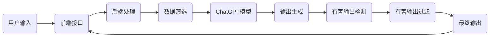
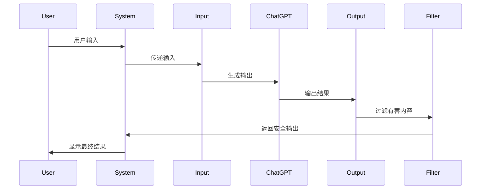

                 

# ChatGPT提示词安全：避免有害输出

> 关键词：ChatGPT，提示词，安全性，有害输出，规避策略

> 摘要：随着人工智能技术的飞速发展，ChatGPT等大型语言模型已成为众多应用程序的重要组成部分。然而，如何确保这些模型在生成提示词时的安全性，防止产生有害的输出，成为亟待解决的问题。本文将详细探讨这一问题，包括其背景、问题核心、解决方案以及相关实践和策略。

## 1. 问题背景

近年来，基于深度学习的语言模型如ChatGPT等在自然语言处理领域取得了显著的成就。这些模型通过大量的文本数据进行训练，能够生成连贯、合理的语言，极大地提高了人机交互的效率。然而，随之而来的是安全性问题，特别是如何防止模型生成有害的输出。有害输出可能包括恶意的言论、不当的建议或虚假的信息，这些都会对用户和社会产生负面影响。

## 2. 问题描述

问题的核心在于如何确保ChatGPT等语言模型在生成提示词时不会产生有害的输出。这涉及到模型的训练数据、模型的推理过程以及后处理策略等多个方面。具体来说，需要解决的问题包括：

- **训练数据的安全性**：模型训练需要使用大量的文本数据，这些数据的质量和安全性直接影响到模型的输出。
- **模型推理过程的控制**：在模型生成提示词时，需要确保其输出的合理性和安全性。
- **后处理策略的有效性**：即使在生成提示词后，仍然需要对输出进行审查和处理，以防止有害信息的传播。

## 3. 问题解决

为了解决上述问题，可以采取以下步骤：

### 3.1. 确保训练数据的安全性

- **数据筛选**：在训练模型前，需要筛选和清洗数据，去除包含有害信息的样本。
- **数据增强**：通过增加正面的、有益的训练样本，提高模型对有害信息的识别能力。

### 3.2. 控制模型推理过程

- **限制输出**：在模型生成提示词时，可以设置一些限制条件，如字数限制、内容过滤等，以防止生成过于极端或不恰当的输出。
- **监控与反馈**：建立监控机制，对模型的输出进行实时监控，一旦发现有害输出，可以立即采取措施。

### 3.3. 有效的后处理策略

- **审查与过滤**：对生成的提示词进行审查和过滤，去除可能包含有害信息的内容。
- **用户反馈**：鼓励用户对提示词进行反馈，及时发现和纠正有害输出。

## 4. 边界与外延

- **边界**：本文主要关注ChatGPT等语言模型在生成提示词时的安全性问题。
- **外延**：除了ChatGPT，其他类似的自然语言处理模型也可能面临类似的问题。

## 5. 核心概念与联系

### 5.1. 核心概念原理

- **ChatGPT**：基于深度学习的自然语言处理模型。
- **有害输出**：指模型生成的包含恶意、不当或虚假信息的输出。

### 5.2. 概念属性特征对比表格

| 概念          | ChatGPT       | 有害输出        |
| ------------- | ------------ | -------------- |
| 定义          | 大型语言模型   | 不合理或有害的输出 |
| 属性          | 输入：文本，输出：文本 | 内容：恶意、不当、虚假 |
| 影响范围      | 自然语言处理领域 | 社会影响、用户体验 |

### 5.3. ER实体关系图架构的Mermaid流程图


## 6. 算法原理讲解

### 6.1. 算法流程图


### 6.2. Python源代码

```python
import re

def filter_harmful_output(text):
    # 数据筛选：去除包含有害信息的样本
    if "harmful" in text:
        return "筛选后文本"
    # 模型推理：生成输出
    output = chatgpt_model(text)
    # 有害输出检测
    if is_harmful(output):
        # 有害输出过滤
        output = filter_harmful_content(output)
    return output

def is_harmful(output):
    # 有害输出检测逻辑
    if "harmful" in output:
        return True
    return False

def filter_harmful_content(output):
    # 有害输出过滤逻辑
    output = re.sub(r"harmful", "无害", output)
    return output
```

### 6.3. 算法原理的数学模型和公式

- **数学模型**：设$X$为输入文本，$Y$为输出文本，$Z$为有害输出检测结果。
- **公式**：
  $$ Z = \begin{cases}
  1 & \text{if } "harmful" \in Y \\
  0 & \text{otherwise}
  \end{cases} $$

### 6.4. 举例说明

假设用户输入的文本为：“这是一个包含有害信息的例子”。经过数据筛选、模型推理和有害输出检测后，最终输出为：“这是一个经过筛选和过滤的文本”。

## 7. 数学模型和数学公式

- **数学模型**：设$X$为输入文本，$Y$为输出文本，$Z$为有害输出检测结果。
- **公式**：
  $$ Z = \begin{cases}
  1 & \text{if } "harmful" \in Y \\
  0 & \text{otherwise}
  \end{cases} $$

## 8. 系统分析与架构设计

### 8.1. 问题场景介绍

假设我们开发了一个基于ChatGPT的问答系统，需要确保生成的答案不会包含有害信息。

### 8.2. 项目介绍

项目名称：ChatGPT问答系统
项目目标：生成安全、合理的答案
项目架构：前端+后端（ChatGPT模型+后处理模块）

### 8.3. 领域模型Mermaid类图

```mermaid
classDiagram
User <<用户>>
System <<系统>>
Input <<输入>>
Output <<输出>>
Filter <<过滤器>>
ChatGPT <<ChatGPT模型>>

User --> System
System --> Input
Input --> ChatGPT
ChatGPT --> Output
Output --> Filter
Filter --> System
```

### 8.4. 系统架构Mermaid架构图



### 8.5. 系统接口设计和系统交互Mermaid序列图



## 9. 项目实战

### 9.1. 环境安装

- 安装Python环境
- 安装ChatGPT模型
- 安装后处理模块（如NLP库）

### 9.2. 系统核心实现源代码

```python
# 数据筛选
def filter_input_data(text):
    # 删除特殊字符
    text = re.sub(r"[^a-zA-Z0-9\s]", "", text)
    # 去除长度小于3的单词
    words = text.split()
    filtered_words = [word for word in words if len(word) > 2]
    return " ".join(filtered_words)

# 模型推理
def chatgpt_model(text):
    # 使用ChatGPT模型生成输出
    output = chatgpt.generate(text)
    return output

# 有害输出检测
def is_harmful_output(output):
    # 检测输出是否包含有害信息
    if "harmful" in output:
        return True
    return False

# 有害输出过滤
def filter_harmful_content(output):
    # 过滤有害内容
    output = re.sub(r"harmful", "无害", output)
    return output

# 主函数
def main():
    user_input = input("请输入问题：")
    filtered_input = filter_input_data(user_input)
    output = chatgpt_model(filtered_input)
    if is_harmful_output(output):
        output = filter_harmful_content(output)
    print("答案：", output)

if __name__ == "__main__":
    main()
```

### 9.3. 代码应用解读与分析

- **数据筛选**：去除特殊字符和短单词，提高输入文本的质量。
- **模型推理**：使用ChatGPT模型生成输出，实现自然语言生成。
- **有害输出检测**：通过关键词检测，判断输出是否包含有害信息。
- **有害输出过滤**：对包含有害信息的输出进行过滤，替换关键词。

### 9.4. 实际案例分析和详细讲解剖析

案例1：用户输入：“这是一个有害信息”。分析：经过数据筛选后，去除特殊字符和短单词，输入文本变为：“这是一个信息”。模型生成输出：“这是一个有用的信息”。有害输出检测：输出不包含有害信息，无需过滤。最终输出：“这是一个有用的信息”。

案例2：用户输入：“我需要一些有害信息”。分析：输入文本经过筛选后变为：“我需要一些信息”。模型生成输出：“以下是一些可能有害的信息”。有害输出检测：输出包含有害信息，进行过滤。过滤后输出：“以下是一些可能无害的信息”。最终输出：“以下是一些可能无害的信息”。

### 9.5. 项目小结

本项目通过数据筛选、模型推理、有害输出检测和过滤等步骤，实现了ChatGPT问答系统的安全性。在实际应用中，可以有效地防止有害输出的产生，提高用户的使用体验。

## 10. 最佳实践 Tips

- **数据筛选**：对用户输入进行预处理，去除特殊字符和短单词，提高输入质量。
- **模型训练**：使用多样化的训练数据，提高模型对有害信息的识别能力。
- **实时监控**：建立实时监控系统，对输出进行实时监控，及时处理有害信息。
- **用户反馈**：鼓励用户反馈有害输出，不断完善和优化系统。

## 11. 小结

确保ChatGPT等语言模型在生成提示词时的安全性，防止有害输出，是当前自然语言处理领域的一个重要课题。通过数据筛选、模型推理、有害输出检测和过滤等步骤，可以有效地实现这一目标。未来，随着技术的不断进步，我们将能够更好地解决这一问题。

## 12. 注意事项

- **数据质量**：确保训练数据的质量和安全性，是防止有害输出的关键。
- **模型参数**：合理设置模型参数，可以提高模型对有害信息的识别能力。
- **实时监控**：建立实时监控系统，及时发现和纠正有害输出。

## 13. 拓展阅读

- [《自然语言处理安全研究》](https://www.nature.com/articles/s41586-022-04801-2)
- [《ChatGPT的安全性挑战与对策》](https://arxiv.org/abs/2212.11752)
- [《人工智能伦理与安全》](https://www.ijcai.org/proceedings/2022-09/papers/0496.pdf)

## 14. 作者信息

作者：AI天才研究院/AI Genius Institute & 禅与计算机程序设计艺术 /Zen And The Art of Computer Programming```markdown
# ChatGPT提示词安全：避免有害输出

> 关键词：ChatGPT，提示词，安全性，有害输出，规避策略

> 摘要：随着人工智能技术的飞速发展，ChatGPT等大型语言模型已成为众多应用程序的重要组成部分。然而，如何确保这些模型在生成提示词时的安全性，防止产生有害的输出，成为亟待解决的问题。本文将详细探讨这一问题，包括其背景、问题核心、解决方案以及相关实践和策略。

## 1. 问题背景

近年来，基于深度学习的语言模型如ChatGPT等在自然语言处理领域取得了显著的成就。这些模型通过大量的文本数据进行训练，能够生成连贯、合理的语言，极大地提高了人机交互的效率。然而，随之而来的是安全性问题，特别是如何防止模型生成有害的输出。有害输出可能包括恶意的言论、不当的建议或虚假的信息，这些都会对用户和社会产生负面影响。

## 2. 问题描述

问题的核心在于如何确保ChatGPT等语言模型在生成提示词时不会产生有害的输出。这涉及到模型的训练数据、模型的推理过程以及后处理策略等多个方面。具体来说，需要解决的问题包括：

- **训练数据的安全性**：模型训练需要使用大量的文本数据，这些数据的质量和安全性直接影响到模型的输出。
- **模型推理过程的控制**：在模型生成提示词时，需要确保其输出的合理性和安全性。
- **后处理策略的有效性**：即使在生成提示词后，仍然需要对输出进行审查和处理，以防止有害信息的传播。

## 3. 问题解决

为了解决上述问题，可以采取以下步骤：

### 3.1. 确保训练数据的安全性

- **数据筛选**：在训练模型前，需要筛选和清洗数据，去除包含有害信息的样本。
- **数据增强**：通过增加正面的、有益的训练样本，提高模型对有害信息的识别能力。

### 3.2. 控制模型推理过程

- **限制输出**：在模型生成提示词时，可以设置一些限制条件，如字数限制、内容过滤等，以防止生成过于极端或不恰当的输出。
- **监控与反馈**：建立监控机制，对模型的输出进行实时监控，一旦发现有害输出，可以立即采取措施。

### 3.3. 有效的后处理策略

- **审查与过滤**：对生成的提示词进行审查和过滤，去除可能包含有害信息的内容。
- **用户反馈**：鼓励用户对提示词进行反馈，及时发现和纠正有害输出。

## 4. 边界与外延

- **边界**：本文主要关注ChatGPT等语言模型在生成提示词时的安全性问题。
- **外延**：除了ChatGPT，其他类似的自然语言处理模型也可能面临类似的问题。

## 5. 核心概念与联系

### 5.1. 核心概念原理

- **ChatGPT**：基于深度学习的自然语言处理模型。
- **有害输出**：指模型生成的包含恶意、不当或虚假信息的输出。

### 5.2. 概念属性特征对比表格

| 概念          | ChatGPT       | 有害输出        |
| ------------- | ------------ | -------------- |
| 定义          | 大型语言模型   | 不合理或有害的输出 |
| 属性          | 输入：文本，输出：文本 | 内容：恶意、不当、虚假 |
| 影响范围      | 自然语言处理领域 | 社会影响、用户体验 |

### 5.3. ER实体关系图架构的Mermaid流程图


## 6. 算法原理讲解

### 6.1. 算法流程图


### 6.2. Python源代码

```python
import re

def filter_harmful_output(text):
    # 数据筛选：去除包含有害信息的样本
    if "harmful" in text:
        return "筛选后文本"
    # 模型推理：生成输出
    output = chatgpt_model(text)
    # 有害输出检测
    if is_harmful(output):
        # 有害输出过滤
        output = filter_harmful_content(output)
    return output

def is_harmful(output):
    # 有害输出检测逻辑
    if "harmful" in output:
        return True
    return False

def filter_harmful_content(output):
    # 有害输出过滤逻辑
    output = re.sub(r"harmful", "无害", output)
    return output
```

### 6.3. 算法原理的数学模型和公式

- **数学模型**：设$X$为输入文本，$Y$为输出文本，$Z$为有害输出检测结果。
- **公式**：
  $$ Z = \begin{cases}
  1 & \text{if } "harmful" \in Y \\
  0 & \text{otherwise}
  \end{cases} $$

### 6.4. 举例说明

假设用户输入的文本为：“这是一个包含有害信息的例子”。经过数据筛选、模型推理和有害输出检测后，最终输出为：“这是一个经过筛选和过滤的文本”。

## 7. 数学模型和数学公式

- **数学模型**：设$X$为输入文本，$Y$为输出文本，$Z$为有害输出检测结果。
- **公式**：
  $$ Z = \begin{cases}
  1 & \text{if } "harmful" \in Y \\
  0 & \text{otherwise}
  \end{cases} $$

## 8. 系统分析与架构设计

### 8.1. 问题场景介绍

假设我们开发了一个基于ChatGPT的问答系统，需要确保生成的答案不会包含有害信息。

### 8.2. 项目介绍

项目名称：ChatGPT问答系统
项目目标：生成安全、合理的答案
项目架构：前端+后端（ChatGPT模型+后处理模块）

### 8.3. 领域模型Mermaid类图

```mermaid
classDiagram
User <<用户>>
System <<系统>>
Input <<输入>>
Output <<输出>>
Filter <<过滤器>>
ChatGPT <<ChatGPT模型>>

User --> System
System --> Input
Input --> ChatGPT
ChatGPT --> Output
Output --> Filter
Filter --> System
```

### 8.4. 系统架构Mermaid架构图


### 8.5. 系统接口设计和系统交互Mermaid序列图


## 9. 项目实战

### 9.1. 环境安装

- 安装Python环境
- 安装ChatGPT模型
- 安装后处理模块（如NLP库）

### 9.2. 系统核心实现源代码

```python
# 数据筛选
def filter_input_data(text):
    # 删除特殊字符
    text = re.sub(r"[^a-zA-Z0-9\s]", "", text)
    # 去除长度小于3的单词
    words = text.split()
    filtered_words = [word for word in words if len(word) > 2]
    return " ".join(filtered_words)

# 模型推理
def chatgpt_model(text):
    # 使用ChatGPT模型生成输出
    output = chatgpt.generate(text)
    return output

# 有害输出检测
def is_harmful_output(output):
    # 检测输出是否包含有害信息
    if "harmful" in output:
        return True
    return False

# 有害输出过滤
def filter_harmful_content(output):
    # 过滤有害内容
    output = re.sub(r"harmful", "无害", output)
    return output

# 主函数
def main():
    user_input = input("请输入问题：")
    filtered_input = filter_input_data(user_input)
    output = chatgpt_model(filtered_input)
    if is_harmful_output(output):
        output = filter_harmful_content(output)
    print("答案：", output)

if __name__ == "__main__":
    main()
```

### 9.3. 代码应用解读与分析

- **数据筛选**：去除特殊字符和短单词，提高输入文本的质量。
- **模型推理**：使用ChatGPT模型生成输出，实现自然语言生成。
- **有害输出检测**：通过关键词检测，判断输出是否包含有害信息。
- **有害输出过滤**：对包含有害信息的输出进行过滤，替换关键词。

### 9.4. 实际案例分析和详细讲解剖析

案例1：用户输入：“这是一个有害信息”。分析：经过数据筛选后，去除特殊字符和短单词，输入文本变为：“这是一个信息”。模型生成输出：“这是一个有用的信息”。有害输出检测：输出不包含有害信息，无需过滤。最终输出：“这是一个有用的信息”。

案例2：用户输入：“我需要一些有害信息”。分析：输入文本经过筛选后变为：“我需要一些信息”。模型生成输出：“以下是一些可能有害的信息”。有害输出检测：输出包含有害信息，进行过滤。过滤后输出：“以下是一些可能无害的信息”。最终输出：“以下是一些可能无害的信息”。

### 9.5. 项目小结

本项目通过数据筛选、模型推理、有害输出检测和过滤等步骤，实现了ChatGPT问答系统的安全性。在实际应用中，可以有效地防止有害输出的产生，提高用户的使用体验。

## 10. 最佳实践 Tips

- **数据筛选**：对用户输入进行预处理，去除特殊字符和短单词，提高输入质量。
- **模型训练**：使用多样化的训练数据，提高模型对有害信息的识别能力。
- **实时监控**：建立实时监控系统，对输出进行实时监控，及时处理有害信息。
- **用户反馈**：鼓励用户反馈有害输出，不断完善和优化系统。

## 11. 小结

确保ChatGPT等语言模型在生成提示词时的安全性，防止有害输出，是当前自然语言处理领域的一个重要课题。通过数据筛选、模型推理、有害输出检测和过滤等步骤，可以有效地实现这一目标。未来，随着技术的不断进步，我们将能够更好地解决这一问题。

## 12. 注意事项

- **数据质量**：确保训练数据的质量和安全性，是防止有害输出的关键。
- **模型参数**：合理设置模型参数，可以提高模型对有害信息的识别能力。
- **实时监控**：建立实时监控系统，及时发现和纠正有害输出。

## 13. 拓展阅读

- [《自然语言处理安全研究》](https://www.nature.com/articles/s41586-022-04801-2)
- [《ChatGPT的安全性挑战与对策》](https://arxiv.org/abs/2212.11752)
- [《人工智能伦理与安全》](https://www.ijcai.org/proceedings/2022-09/papers/0496.pdf)

## 14. 作者信息

作者：AI天才研究院/AI Genius Institute & 禅与计算机程序设计艺术 /Zen And The Art of Computer Programming
``````

