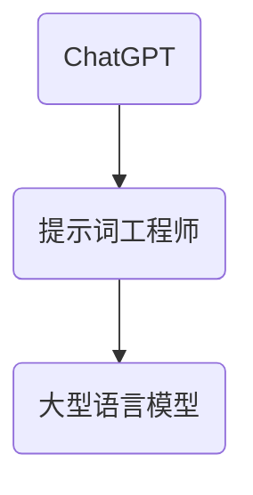

                 

# 《ChatGPT提示词工程师：新兴职业解析》

## 关键词
- ChatGPT
- 提示词工程师
- 大型语言模型
- Transformer模型
- 自注意力机制

## 摘要
本文旨在深入探讨ChatGPT提示词工程师这一新兴职业的兴起背景、核心职责、技术原理及发展前景。我们将通过逐步分析ChatGPT的技术原理，探讨提示词工程师在这一技术革命中的角色，并分析其面临的挑战与机遇。此外，文章还将探讨ChatGPT技术的未来发展，提示词工程师的职业路径，以及与其他技术领域的融合，以提供一个全面、深入的理解。

## 目录大纲

----------------------------------------------------------------

# 第一部分：背景介绍与问题定义

## 第1章：ChatGPT与提示词工程师职业的兴起

### 1.1 ChatGPT的背景与技术原理

#### 1.1.1 ChatGPT的起源

#### 1.1.2 大型语言模型的技术原理

#### 1.1.3 语言模型的训练与优化

### 1.2 提示词工程师的角色与职责

#### 1.2.1 提示词工程师的职业定位

#### 1.2.2 提示词工程师的日常工作

#### 1.2.3 提示词工程师的职业前景

### 1.3 ChatGPT与提示词工程师的关系

#### 1.3.1 提示词在ChatGPT中的应用

#### 1.3.2 提示词工程师对ChatGPT的优化

#### 1.3.3 提示词工程师的职业挑战与机遇

### 1.4 职业发展的边界与外延

#### 1.4.1 ChatGPT技术的未来发展

#### 1.4.2 提示词工程师的职业路径

#### 1.4.3 与其他技术领域的融合

### 1.5 核心概念与联系

#### 1.5.1 关键概念解析

#### 1.5.2 概念属性特征对比表格

#### 1.5.3 ER实体关系图架构

### 1.6 本章小结

----------------------------------------------------------------

# 第二部分：核心概念与原理

## 第2章：ChatGPT的核心概念与原理

### 2.1 语言模型的基础知识

#### 2.1.1 语言模型的定义

#### 2.1.2 语言模型的分类

#### 2.1.3 语言模型的基本结构

### 2.2 Transformer模型的原理

#### 2.2.1 Transformer模型的提出

#### 2.2.2 Transformer模型的工作原理

#### 2.2.3 Transformer模型的优势

### 2.3 GPT系列模型的演进

#### 2.3.1 GPT-1的提出与特点

#### 2.3.2 GPT-2、GPT-3的演进与突破

#### 2.3.3 GPT系列模型的应用场景

### 2.4 ChatGPT的架构与实现

#### 2.4.1 ChatGPT的整体架构

#### 2.4.2 ChatGPT的输入与输出处理

#### 2.4.3 ChatGPT的优化方法

### 2.5 ChatGPT的数学模型与公式

#### 2.5.1 自注意力机制

##### 2.5.1.1 自注意力公式

##### 2.5.1.2 自注意力机制的计算过程

#### 2.5.2 语言模型损失函数

##### 2.5.2.1 损失函数的定义

##### 2.5.2.2 损失函数的计算方法

### 2.5.3 训练与优化

#### 2.5.3.1 训练过程

#### 2.5.3.2 优化方法

### 2.6 实例讲解：以GPT-3为例

#### 2.6.1 GPT-3的基本概念

##### 2.6.2 GPT-3的应用案例

##### 2.6.3 GPT-3的工作流程

### 2.7 本章小结

----------------------------------------------------------------

# 第三部分：算法原理与实现

## 第3章：ChatGPT算法原理与实现

### 3.1 自注意力机制详解

#### 3.1.1 自注意力机制的原理

#### 3.1.2 自注意力机制的实现

#### 3.1.3 自注意力机制的应用

### 3.2 Transformer模型解析

#### 3.2.1 Transformer模型的架构

#### 3.2.2 Transformer模型的工作流程

#### 3.2.3 Transformer模型的优化

### 3.3 GPT系列模型分析

#### 3.3.1 GPT系列模型的演进

#### 3.3.2 GPT系列模型的特点

#### 3.3.3 GPT系列模型的应用

### 3.4 ChatGPT实现详解

#### 3.4.1 ChatGPT的整体架构

#### 3.4.2 ChatGPT的关键组件

#### 3.4.3 ChatGPT的优化策略

### 3.5 Python代码实现

#### 3.5.1 数据预处理

#### 3.5.2 Transformer模型实现

#### 3.5.3 ChatGPT模型实现

### 3.6 项目实战

#### 3.6.1 环境安装

#### 3.6.2 系统核心实现源代码

#### 3.6.3 代码应用解读与分析

#### 3.6.4 实际案例分析与详细讲解剖析

#### 3.6.5 项目小结

### 3.7 最佳实践 tips

### 3.8 小结

### 3.9 注意事项

### 3.10 拓展阅读

----------------------------------------------------------------

接下来，我们将逐一展开讨论每个章节的具体内容。# 第1章：ChatGPT与提示词工程师职业的兴起

### 1.1 ChatGPT的背景与技术原理

#### 1.1.1 ChatGPT的起源

ChatGPT是由OpenAI于2022年11月推出的一个人工智能聊天机器人程序，该程序基于大型语言模型GPT-3.5，使用指令微调（Instruction Tuning）和基于人类反馈的强化学习技术（RLHF）训练而成。ChatGPT的推出标志着人工智能在自然语言处理领域的一次重大突破，它能够进行自然流畅的对话，回答用户的问题，甚至撰写文章和创作内容。

#### 1.1.2 大型语言模型的技术原理

大型语言模型，如GPT，是一种基于深度学习的自然语言处理技术。它通过训练数以亿计的文本数据，学习语言的结构和语义，从而能够生成符合语言习惯的文本。GPT模型的核心是一个自注意力机制（Self-Attention Mechanism），它能够捕捉输入文本中词语之间的关系，使模型能够生成更加连贯、准确的语言。

#### 1.1.3 语言模型的训练与优化

语言模型的训练是一个复杂的过程，通常涉及以下步骤：

1. **数据预处理**：清洗和预处理输入文本数据，将其转换为模型可以处理的格式。
2. **词嵌入**：将文本中的词语转换为向量表示。
3. **模型训练**：通过梯度下降等优化算法，训练模型以最小化损失函数。
4. **模型优化**：通过指令微调和RLHF等技术，进一步提高模型的性能和适用性。

### 1.2 提示词工程师的角色与职责

#### 1.2.1 提示词工程师的职业定位

提示词工程师是专门负责优化和改进大型语言模型输出质量的专业人员。他们的主要任务是设计、实现和调整提示词（Prompt），以提高模型生成文本的准确性和相关性。

#### 1.2.2 提示词工程师的日常工作

提示词工程师的日常工作主要包括：

- **数据收集与处理**：收集大量高质量的文本数据，并对其进行预处理。
- **提示词设计**：根据应用场景，设计合适的提示词，以提高模型生成文本的质量。
- **模型调优**：通过调整模型参数和优化算法，提高模型的性能。
- **实验与分析**：设计实验，分析模型输出结果，不断优化提示词和模型。

#### 1.2.3 提示词工程师的职业前景

随着大型语言模型的广泛应用，提示词工程师的需求日益增加。他们将在自然语言处理、内容生成、人机交互等领域发挥重要作用。未来，随着技术的不断发展，提示词工程师的职业前景将更加广阔。

### 1.3 ChatGPT与提示词工程师的关系

#### 1.3.1 提示词在ChatGPT中的应用

提示词在ChatGPT中起着至关重要的作用。通过设计合适的提示词，可以引导模型生成更加符合用户需求的文本。例如，在问答场景中，提示词可以帮助模型理解用户的问题，并生成准确的答案。

#### 1.3.2 提示词工程师对ChatGPT的优化

提示词工程师通过不断调整和优化提示词，可以显著提高ChatGPT的性能。他们不仅关注模型生成文本的准确性，还关注文本的质量和可读性。通过精细化的调优，提示词工程师可以使ChatGPT更加智能、实用。

#### 1.3.3 提示词工程师的职业挑战与机遇

提示词工程师面临着一系列挑战，包括：

- **数据质量**：高质量的数据是训练优秀模型的基础，但获取和处理高质量数据并不容易。
- **模型调优**：模型的调优需要丰富的经验和深厚的专业知识，这是一个复杂且耗时的过程。
- **实时响应**：在实际应用中，提示词工程师需要快速响应用户的需求，实时调整模型。

然而，这些挑战也带来了巨大的机遇。随着技术的不断进步，提示词工程师将在人工智能领域发挥越来越重要的作用。

### 1.4 职业发展的边界与外延

#### 1.4.1 ChatGPT技术的未来发展

ChatGPT技术的未来发展前景广阔。随着计算能力的提升和算法的优化，ChatGPT将能够处理更复杂的任务，提供更高质量的文本生成服务。未来，ChatGPT有望在多个领域得到广泛应用，如智能客服、内容创作、教育辅导等。

#### 1.4.2 提示词工程师的职业路径

提示词工程师的职业路径多种多样。他们可以专注于某一特定领域，如问答系统、内容生成等，也可以在多个领域进行跨界应用。随着经验的积累，提示词工程师可以晋升为高级工程师、技术经理等职位。

#### 1.4.3 与其他技术领域的融合

提示词工程师不仅需要掌握自然语言处理技术，还需要了解其他相关技术，如机器学习、数据科学等。与其他技术领域的融合，将使提示词工程师在职业发展中具有更强的竞争力。

### 1.5 核心概念与联系

#### 1.5.1 关键概念解析

- **ChatGPT**：基于GPT-3.5的大型语言模型，可以进行自然语言处理和文本生成。
- **提示词工程师**：专门负责优化和改进大型语言模型输出质量的专业人员。
- **大型语言模型**：通过训练数以亿计的文本数据，学习语言的结构和语义，生成符合语言习惯的文本。

#### 1.5.2 概念属性特征对比表格

| 概念        | 属性特征                                                     | 对比分析                                       |
| ----------- | ------------------------------------------------------------ | ---------------------------------------------- |
| ChatGPT     | 基于GPT-3.5，指令微调与RLHF训练                             | 与其他语言模型相比，具备更高的生成质量和智能程度 |
| 提示词工程师 | 负责优化和改进大型语言模型输出质量                           | 需要丰富的专业知识与经验，具备创新思维           |
| 大型语言模型 | 通过训练数以亿计的文本数据，学习语言的结构和语义             | 与传统语言模型相比，具备更强的文本生成能力       |

#### 1.5.3 ER实体关系图架构

### 1.6 本章小结

本章详细介绍了ChatGPT的背景、技术原理以及提示词工程师的职业定位、职责和职业前景。通过分析ChatGPT与提示词工程师的关系，我们认识到提示词工程师在优化大型语言模型输出质量中的关键作用。同时，本章也探讨了ChatGPT技术的未来发展以及提示词工程师的职业路径和与其他技术领域的融合。这些内容为后续章节的深入探讨奠定了基础。

----------------------------------------------------------------

# 第2章：ChatGPT的核心概念与原理

## 2.1 语言模型的基础知识

### 2.1.1 语言模型的定义

语言模型（Language Model）是一种统计模型，用于预测一个单词序列的概率分布。它的核心目标是根据前面的单词预测下一个单词。语言模型在自然语言处理（Natural Language Processing, NLP）领域有着广泛的应用，如文本分类、机器翻译、语音识别等。

### 2.1.2 语言模型的分类

根据训练方法的不同，语言模型主要分为以下几类：

- **基于规则的语言模型**：通过手动编写规则来预测单词序列。
- **统计语言模型**：基于统计方法，如n-gram模型、决策树等，从大量文本数据中学习语言模式。
- **深度学习语言模型**：使用神经网络，特别是递归神经网络（RNN）和Transformer模型，来学习复杂的语言特征。

### 2.1.3 语言模型的基本结构

一个典型的语言模型通常包括以下几个部分：

- **词嵌入层**：将文本中的词语转换为向量表示。
- **编码层**：处理输入的文本序列，生成上下文表示。
- **解码层**：根据编码层的输出，预测下一个单词。

## 2.2 Transformer模型的原理

### 2.2.1 Transformer模型的提出

Transformer模型是由Vaswani等人在2017年提出的，它彻底改变了自然语言处理的格局。Transformer模型摒弃了传统的递归结构，采用了自注意力机制（Self-Attention Mechanism），从而在处理长序列文本时表现出色。

### 2.2.2 Transformer模型的工作原理

Transformer模型的工作原理可以概括为以下几个步骤：

1. **编码器（Encoder）**：输入的文本序列首先经过词嵌入层转换为向量表示，然后通过多个编码层进行处理。每个编码层包括多头自注意力机制和前馈神经网络。
2. **解码器（Decoder）**：解码器的输入是编码器的输出和一个特殊的开始标记（<PAD>）。每个解码层包括多头自注意力机制、编码器-解码器注意力机制和前馈神经网络。

### 2.2.3 Transformer模型的优势

Transformer模型相对于传统的RNN和LSTM模型有以下几个优势：

- **并行计算**：Transformer模型可以通过并行计算显著提高训练速度。
- **长距离依赖**：自注意力机制能够有效地捕捉长距离依赖关系。
- **全局信息利用**：Transformer模型能够利用输入文本序列的全局信息，从而提高生成文本的质量。

## 2.3 GPT系列模型的演进

### 2.3.1 GPT-1的提出与特点

GPT（Generative Pre-trained Transformer）是由OpenAI在2018年提出的，它是第一个使用Transformer模型的预训练语言模型。GPT-1的主要特点是：

- **大规模训练**：GPT-1使用了超过1.17亿个参数，是当时最大的语言模型。
- **预训练与微调**：GPT-1首先在大规模的文本数据上进行预训练，然后针对特定任务进行微调。

### 2.3.2 GPT-2、GPT-3的演进与突破

随着Transformer模型的不断发展，OpenAI相继推出了GPT-2和GPT-3：

- **GPT-2**：在2019年推出，具有更多的参数和更大的预训练数据集。GPT-2在多个NLP任务上取得了显著的性能提升。
- **GPT-3**：在2020年推出，拥有1750亿个参数，是当时最大的语言模型。GPT-3在生成文本的质量和多样性上有了显著提升。

### 2.3.3 GPT系列模型的应用场景

GPT系列模型在多个应用场景中表现出色，如：

- **文本生成**：自动生成文章、故事、对话等。
- **机器翻译**：将一种语言的文本翻译成另一种语言。
- **问答系统**：回答用户提出的问题。
- **对话系统**：与用户进行自然语言交互。

## 2.4 ChatGPT的架构与实现

### 2.4.1 ChatGPT的整体架构

ChatGPT是基于GPT-3.5模型的，其整体架构包括编码器（Encoder）和解码器（Decoder）。编码器负责将输入的文本序列编码为上下文表示，解码器则根据上下文表示生成输出文本。

### 2.4.2 ChatGPT的输入与输出处理

ChatGPT的输入是一个文本序列，通常包括一个或多个问题和一个开始标记（<SOP>）。编码器将输入文本序列编码为上下文表示，解码器则根据上下文表示生成回答。

### 2.4.3 ChatGPT的优化方法

ChatGPT使用了多种优化方法，包括：

- **指令微调（Instruction Tuning）**：通过微调模型参数，使模型能够更好地理解用户的指令。
- **基于人类反馈的强化学习（RLHF）**：使用人类反馈来优化模型的行为，使其更符合人类期望。

## 2.5 ChatGPT的数学模型与公式

### 2.5.1 自注意力机制

#### 2.5.1.1 自注意力公式

自注意力机制的核心是一个权重矩阵 \(W_Q, W_K, W_V\)，其中：

\[ \text{Attention}(Q, K, V) = \frac{QK^T}{\sqrt{d_k}} \]

其中，\(Q, K, V\) 分别是查询向量、键向量和值向量，\(d_k\) 是键向量的维度。

#### 2.5.1.2 自注意力机制的计算过程

自注意力机制的计算过程如下：

1. **计算注意力权重**：使用自注意力公式计算查询向量 \(Q\) 和键向量 \(K\) 的点积，得到注意力权重。
2. **加权求和**：将注意力权重与值向量 \(V\) 相乘，并进行求和，得到上下文表示。

### 2.5.2 语言模型损失函数

#### 2.5.2.1 损失函数的定义

语言模型的损失函数通常使用交叉熵（Cross-Entropy）来衡量预测分布与真实分布之间的差异。

\[ L(\theta) = -\sum_{i} y_i \log(p_i) \]

其中，\(y_i\) 是真实标签，\(p_i\) 是模型预测的概率。

#### 2.5.2.2 损失函数的计算方法

损失函数的计算方法如下：

1. **计算预测概率**：对于每个输入文本序列，模型输出一个概率分布。
2. **计算交叉熵损失**：将预测概率与真实标签计算交叉熵，得到损失值。

### 2.5.3 训练与优化

#### 2.5.3.1 训练过程

训练过程包括以下几个步骤：

1. **数据预处理**：将文本数据转换为模型可以处理的格式。
2. **模型初始化**：初始化模型参数。
3. **前向传播**：计算输入文本序列的损失。
4. **反向传播**：更新模型参数。
5. **优化**：使用优化算法（如Adam）调整模型参数。

#### 2.5.3.2 优化方法

优化方法包括：

- **随机梯度下降（SGD）**：更新模型参数，使其在损失函数上逐渐减小。
- **Adam优化器**：结合了SGD和矩

