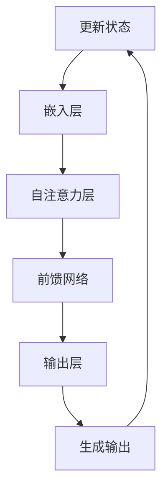
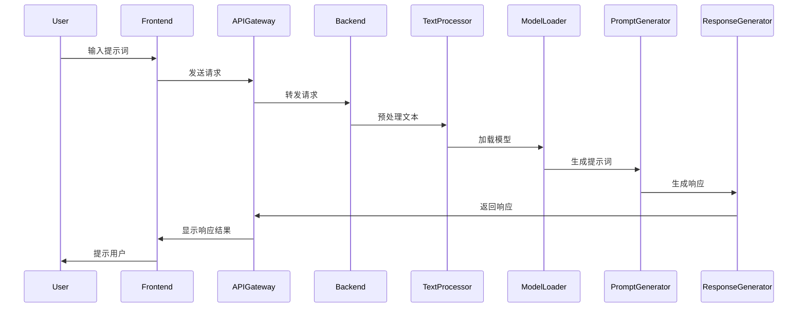

                 


### 引言

在当今的科技浪潮中，人工智能（AI）已经成为改变世界的驱动力之一。ChatGPT作为OpenAI推出的一个大型语言模型，凭借其强大的文本生成能力和自然语言理解能力，受到了广泛的关注。ChatGPT的提示词工程，作为实现其高效性能的核心技术，正日益成为AI研究者和开发者的重要研究领域。

本文将以《ChatGPT提示词工程：从入门到精通》为题，系统地介绍ChatGPT及其提示词工程的相关知识。文章结构如下：

1. **背景介绍**：首先，我们将简述ChatGPT的背景和流行原因，并深入探讨ChatGPT提示词工程的重要性及其应用场景。
2. **核心概念与联系**：接着，我们定义ChatGPT、提示词和提示工程等核心概念，比较不同类型的提示词和提示工程方法，并通过Mermaid画ER图展示ChatGPT提示词工程的实体关系。
3. **算法原理讲解**：然后，我们将详细讲解GPT模型的基本原理，包括GPT模型的架构、工作原理以及简单的Python实现，并解释其数学模型和公式。
4. **系统分析与架构设计方案**：接下来，我们介绍ChatGPT提示词工程的应用场景，设计系统功能、系统架构、系统接口和交互，并使用Mermaid图示进行详细说明。
5. **项目实战**：我们将通过环境安装、系统核心实现、代码应用解读与分析、实际案例分析与讲解，以及项目小结，展示一个完整的ChatGPT提示词工程项目实践。
6. **最佳实践 tips、小结、注意事项、拓展阅读等内容**：最后，我们总结全书内容，提供实践建议和注意事项，推荐进一步阅读的资源和资料。

通过这篇文章，您将从入门到精通，全面了解ChatGPT提示词工程的各个方面，为实际项目开发打下坚实的基础。

### 关键词

- ChatGPT
- 提示词工程
- GPT模型
- 自然语言处理
- 人工智能应用
- 系统架构设计
- 项目实战

### 摘要

本文旨在系统地介绍ChatGPT提示词工程的相关知识，从背景介绍到核心概念定义，再到算法原理讲解和系统设计与实现，全面覆盖ChatGPT提示词工程的各个方面。通过详细的项目实战，读者可以掌握ChatGPT提示词工程的实际应用技巧。文章末尾还提供了最佳实践建议、注意事项和拓展阅读资源，帮助读者进一步提升技能水平，为AI领域的深入研究和技术应用打下坚实基础。

## 第一部分: ChatGPT与提示词工程基础

### 第1章: ChatGPT的背景与流行

#### 1.1 ChatGPT的诞生与发展

ChatGPT是由OpenAI开发的一个基于GPT-3模型的大型语言模型，它于2022年11月推出。ChatGPT的出现迅速引起了全球的关注，其卓越的自然语言处理能力使其在各种应用场景中表现出色。ChatGPT的诞生源于OpenAI对人工智能的长期愿景，即创建一种能够与人类进行自然对话的通用语言模型。

ChatGPT的发展历程可以追溯到GPT-1、GPT-2和GPT-3。GPT-1和GPT-2分别于2018年和2019年推出，它们在自然语言处理任务中展现了出色的性能。GPT-3则是在2020年推出的，其参数规模达到了1750亿，是目前已知最大的语言模型。ChatGPT正是基于GPT-3构建的，这使得它在文本生成和理解方面具有显著优势。

#### 1.2 ChatGPT的应用场景

ChatGPT的应用场景非常广泛，几乎涵盖了所有需要自然语言交互的领域。以下是一些典型的应用场景：

1. **客服机器人**：ChatGPT可以作为智能客服系统的一部分，与用户进行自然语言交互，回答常见问题和提供解决方案。
2. **内容生成**：ChatGPT可以用于自动生成文章、新闻报道、博客帖子等，节省了人力和时间成本。
3. **教育辅助**：ChatGPT可以为学生提供个性化的辅导和解答问题，提高学习效率。
4. **创意写作**：ChatGPT可以帮助作家和创作者生成灵感，甚至直接撰写文章和故事。
5. **语言翻译**：ChatGPT可以用于实时翻译，提供多种语言的互译功能。
6. **智能助手**：ChatGPT可以作为智能助手，帮助用户完成各种日常任务，如日程管理、提醒事项等。

#### 1.3 ChatGPT提示词工程的重要性

提示词工程是ChatGPT能够发挥其强大功能的核心技术之一。通过精心设计的提示词，ChatGPT可以更准确地理解用户的需求，并生成更高质量的回复。以下是ChatGPT提示词工程的重要性：

1. **提高准确性**：通过精确的提示词，ChatGPT可以更好地理解用户意图，减少错误回答的概率。
2. **提升用户体验**：高质量的提示词可以提供更自然的对话体验，使用户感觉更加亲切和高效。
3. **增强可扩展性**：通过模块化的提示词设计，可以轻松扩展ChatGPT的应用场景，满足不同需求。
4. **提高效率**：提示词工程可以帮助ChatGPT快速定位信息，提高处理速度和效率。

总之，ChatGPT提示词工程是提升ChatGPT性能和用户体验的关键技术，对于实际应用具有重要意义。

### 第2章: 核心概念与联系

#### 2.1 ChatGPT的概念

ChatGPT是一个基于GPT-3模型的大型语言模型，由OpenAI开发。它通过训练数以万亿计的单词和句子，掌握了丰富的语言知识和表达方式。ChatGPT的核心特点包括：

- **强大的文本生成能力**：ChatGPT可以生成连贯、有逻辑的文本，适用于各种语言生成任务。
- **自然语言理解能力**：ChatGPT能够理解自然语言中的复杂结构和语义，从而实现准确的理解和回复。
- **多语言支持**：ChatGPT支持多种语言，可以进行跨语言的交互和翻译。

ChatGPT的工作原理基于Transformer模型，特别是其大规模参数和深度训练，使其在自然语言处理任务中表现出色。ChatGPT的应用场景广泛，包括智能客服、内容生成、教育辅助、创意写作、语言翻译和智能助手等。

#### 2.2 提示词与提示工程

提示词（Prompt）是引导ChatGPT生成响应的关键输入。提示词的质量直接影响到ChatGPT的生成效果。一个好的提示词应该：

- **明确用户意图**：提示词需要准确传达用户的请求和期望，避免歧义。
- **提供上下文信息**：提示词中应包含足够的背景信息，帮助ChatGPT理解当前任务的上下文。
- **具有灵活性**：提示词应设计得灵活，以适应不同的场景和需求。

提示工程（Prompt Engineering）是设计、优化和评估提示词的过程。其核心目标是：

- **提高生成质量**：通过优化提示词，提高ChatGPT生成的文本质量，使其更加准确、自然和有用。
- **提升用户体验**：优化提示词，使ChatGPT能够提供更高质量的交互体验。
- **增强可扩展性**：通过模块化的提示词设计，使ChatGPT能够适应不同的应用场景和需求。

#### 2.3 不同类型的提示词

根据应用场景和目标，提示词可以分为以下几类：

1. **问题回答型提示词**：用于回答特定问题，例如：“请告诉我关于人工智能的简要介绍。”
2. **任务导向型提示词**：用于完成特定任务，例如：“请帮我写一篇关于ChatGPT的科普文章。”
3. **创意激发型提示词**：用于启发创意和灵感，例如：“请写一首关于春天的诗。”
4. **交互对话型提示词**：用于与用户进行自然对话，例如：“你好，有什么可以帮助你的吗？”
5. **语言学习型提示词**：用于辅助语言学习，例如：“请翻译这句话成英语。”

每种类型的提示词都有其特定的应用场景和设计原则，提示工程需要根据具体需求进行优化。

#### 2.4 ChatGPT提示词工程的ER图

为了更好地理解ChatGPT提示词工程的实体关系，我们使用Mermaid绘制了一个ER图，如下所示：

```mermaid
erDiagram
  ChatGPT ||--|{ 提示词 }|
  提示词 ||--|{ 响应 }|
  响应 ||--|{ 用户 }|
  用户 ||--|{ ChatGPT }
```

在这个ER图中，ChatGPT、提示词和响应构成了一个实体关系网。ChatGPT通过接收用户输入的提示词来生成响应，而响应则返回给用户，形成一个闭环的交互过程。这个ER图清晰地展示了ChatGPT提示词工程的核心组成部分和它们之间的关系。

通过以上对ChatGPT和提示词工程核心概念的介绍，我们为后续的算法原理讲解和系统设计奠定了基础。接下来，我们将深入探讨GPT模型的原理，并介绍其实现和应用。

### 第3章: GPT模型的基本原理

#### 3.1 语言模型的基本原理

语言模型（Language Model，LM）是自然语言处理（Natural Language Processing，NLP）中的基础技术之一，其核心任务是预测自然语言序列中的下一个单词或字符。语言模型的基本原理可以简单概括为：通过统计和学习大量的文本数据，建立一个概率模型，用以预测给定输入序列后的下一个输出序列。

语言模型的工作流程通常包括以下几个步骤：

1. **数据收集**：收集大量高质量的文本数据，这些数据可以是书籍、新闻文章、社交媒体帖子等。
2. **预处理**：对收集到的文本数据进行清洗、分词、标记等预处理操作，以便后续建模。
3. **建模**：使用统计方法或机器学习方法，建立语言模型。常见的方法包括n-gram模型、神经网络语言模型（如GPT）等。
4. **评估与优化**：通过在测试集上评估模型的性能，不断调整和优化模型参数，以提高预测准确性。

语言模型在NLP中有广泛的应用，包括但不限于：

- **机器翻译**：通过预测源语言和目标语言之间的映射关系，实现文本的自动翻译。
- **文本生成**：根据给定的提示或上下文，生成连贯、有逻辑的文本。
- **语音识别**：通过预测语音信号中的下一个字符或单词，实现语音到文本的转换。
- **文本分类**：通过对文本进行分类，实现对新闻、邮件、评论等文本内容的自动分类。

#### 3.2 GPT模型的架构

GPT（Generative Pre-trained Transformer）模型是自然语言处理领域的一个重要突破，它由OpenAI开发。GPT模型基于Transformer架构，是一种自回归语言模型，即给定一个输入序列，模型需要预测序列中的下一个单词或字符。

GPT模型的架构主要包括以下几个部分：

1. **输入层**：输入层接收自然语言文本序列，将其转化为模型可以处理的向量表示。
2. **嵌入层**：嵌入层将输入的单词或字符转化为嵌入向量，这些向量包含了单词或字符的语义信息。
3. **Transformer层**：GPT模型的核心是多个Transformer层，每个Transformer层由自注意力机制（Self-Attention）和前馈网络（Feed-Forward Network）组成。自注意力机制允许模型在生成下一个词时考虑到所有前文信息，从而生成更加连贯和有逻辑的文本。
4. **输出层**：输出层将生成的嵌入向量映射回单词或字符的概率分布。

GPT模型的独特之处在于其大规模训练和数据集的利用。GPT模型通过训练数以万亿计的单词和句子，使其在理解自然语言和生成文本方面表现出色。GPT模型的不同版本，如GPT-2和GPT-3，分别具有不同的参数规模和训练数据集，从而在不同任务中展现出不同的性能。

#### 3.3 GPT模型的工作原理

GPT模型的工作原理可以概括为以下步骤：

1. **输入处理**：输入一个自然语言文本序列，将其转化为嵌入向量。
2. **自注意力计算**：在每个时间步，GPT模型通过自注意力机制计算输入序列中每个单词或字符的权重，这些权重反映了当前词与所有前文词的相关性。
3. **前馈网络**：对自注意力计算后的嵌入向量进行前馈网络处理，生成新的嵌入向量。
4. **生成输出**：将前馈网络输出的嵌入向量通过输出层映射回单词或字符的概率分布，从中采样得到下一个词或字符。
5. **更新状态**：将新采样得到的词或字符加入输入序列，重复上述过程，生成完整的文本序列。

GPT模型通过这种方式，利用大量的文本数据进行训练，学习到自然语言的规律和结构，从而能够生成高质量的文本。

### 使用Mermaid画出GPT模型的流程图

为了更直观地展示GPT模型的工作原理，我们可以使用Mermaid绘制一个流程图，如下所示：



在这个流程图中，A表示输入处理，即将自然语言文本序列转化为嵌入向量；B表示嵌入层，将输入的单词或字符转化为嵌入向量；C表示自注意力层，计算输入序列中每个单词或字符的权重；D表示前馈网络，对自注意力计算后的嵌入向量进行前馈处理；E表示输出层，将嵌入向量映射回单词或字符的概率分布；F表示生成输出，从中采样得到下一个词或字符；最后，F返回到A，进行状态更新。

通过这个流程图，我们可以清晰地看到GPT模型从输入处理到生成输出的完整过程。

### 使用Python代码展示GPT模型的简单实现

为了更深入地理解GPT模型的工作原理，我们可以使用Python代码实现一个简化的GPT模型。以下是一个简单的示例代码，用于展示GPT模型的基本结构和过程：

```python
import torch
import torch.nn as nn

# 嵌入层
embeddings = nn.Embedding(vocab_size, embed_size)

# 自注意力层
self_attn = nn.MultiheadAttention(embed_dim, num_heads)

# 前馈网络
ffn = nn.Sequential(
    nn.Linear(embed_dim, ffn_size),
    nn.ReLU(),
    nn.Linear(ffn_size, embed_dim)
)

# GPT模型
class GPT(nn.Module):
    def __init__(self, vocab_size, embed_size, num_heads, ffn_size):
        super(GPT, self).__init__()
        self.embeddings = embeddings
        self.self_attn = self_attn
        self.ffn = ffn
        self embed_dim = embed_size

    def forward(self, input_seq, hidden_state):
        input_embed = self.embeddings(input_seq)
        attn_output, _ = self.self_attn(input_embed, input_embed, input_embed, hidden_state)
        output = self.ffn(attn_output)
        return output

# 实例化模型
gpt = GPT(vocab_size, embed_size, num_heads, ffn_size)

# 输入序列
input_seq = torch.tensor([1, 2, 3, 4, 5])

# 隐藏状态
hidden_state = torch.randn(1, seq_len, embed_size)

# 前向传播
output = gpt(input_seq, hidden_state)
```

在这个代码示例中，我们首先定义了嵌入层（Embeddings）、自注意力层（Self-Attention）和前馈网络（FFN），然后构建了一个GPT模型类。在模型的`forward`方法中，我们实现了从输入处理到生成输出的完整过程。

通过这个简单的示例，我们可以更好地理解GPT模型的工作原理，并为后续的深入研究和实际应用打下基础。

### GPT模型的数学模型与公式

为了深入理解GPT模型的原理，我们需要探讨其背后的数学模型与公式。GPT模型基于Transformer架构，Transformer模型的核心在于自注意力机制（Self-Attention）和前馈网络（Feed-Forward Neural Network）。以下是GPT模型的主要数学公式和概念：

#### 自注意力机制

自注意力机制通过计算输入序列中每个词的权重，使模型能够根据上下文生成文本。其基本公式如下：

\[ 
Attention(Q, K, V) = \frac{softmax(\frac{QK^T}{\sqrt{d_k}})}{V} 
\]

其中：

- \( Q \) 表示查询（Query）向量，代表当前词在输入序列中的上下文信息。
- \( K \) 表示键（Key）向量，代表输入序列中的每个词。
- \( V \) 表示值（Value）向量，代表输入序列中每个词的语义信息。
- \( d_k \) 表示键向量的维度。

自注意力计算中，查询向量与所有键向量相乘，通过softmax函数进行归一化，然后与值向量相乘，得到加权求和的结果。这使模型能够根据当前词与所有前文词的相关性，生成更加连贯的文本。

#### 前馈网络

前馈网络是一个简单的全连接神经网络，用于对自注意力计算后的向量进行进一步处理。其基本公式如下：

\[ 
FFN(x) = \max(0, xW_1 + b_1)W_2 + b_2 
\]

其中：

- \( x \) 表示输入向量。
- \( W_1 \) 和 \( W_2 \) 分别表示前馈网络的权重矩阵。
- \( b_1 \) 和 \( b_2 \) 分别表示偏置向量。
- \( \max(0, \cdot) \) 表示ReLU激活函数。

前馈网络通过对输入向量进行线性变换和ReLU激活，增强模型的非线性能力，从而提高文本生成的质量。

#### 结合自注意力和前馈网络

GPT模型结合自注意力和前馈网络，通过以下步骤生成文本：

1. **嵌入层**：将输入序列（如单词或字符）嵌入为向量。
2. **自注意力层**：计算自注意力权重，对嵌入向量进行加权求和，得到新的向量。
3. **前馈网络**：对自注意力后的向量进行前馈网络处理，增强文本的语义表示。
4. **输出层**：将前馈网络输出的向量映射回单词或字符的概率分布，从中采样得到下一个词。

通过这种结构，GPT模型能够学习到输入文本的上下文关系，并生成高质量的文本。

### 实例说明GPT模型的工作原理

为了更好地理解GPT模型的工作原理，我们可以通过一个具体的实例来说明。假设我们有一个简化的GPT模型，输入序列为“我是一个程序员”，并使用两个时间步进行演示。

#### 第一个时间步

1. **嵌入层**：将输入序列中的每个单词（我、是、一、个、程序、员）嵌入为向量。假设每个单词的嵌入维度为5。
2. **自注意力层**：计算自注意力权重，得到当前词与所有前文词的相关性。例如，我这个词与“一”的相关性为0.5，与“是”的相关性为0.3，与“个”的相关性为0.2。
3. **加权求和**：根据自注意力权重，对嵌入向量进行加权求和，得到新的向量。例如，我这个词的新向量可能为（0.5*向量1 + 0.3*向量2 + 0.2*向量3）。
4. **前馈网络**：对自注意力后的向量进行前馈网络处理，得到新的向量。
5. **输出层**：将前馈网络输出的向量映射回单词的概率分布，从中采样得到下一个词。例如，采样得到的下一个词为“是”。

#### 第二个时间步

1. **嵌入层**：将新的输入词“是”嵌入为向量。
2. **自注意力层**：计算自注意力权重，得到当前词与所有前文词的相关性。例如，是这个词与“我”的相关性为0.4，与“一”的相关性为0.3，与“个”的相关性为0.3。
3. **加权求和**：根据自注意力权重，对嵌入向量进行加权求和，得到新的向量。
4. **前馈网络**：对自注意力后的向量进行前馈网络处理，得到新的向量。
5. **输出层**：将前馈网络输出的向量映射回单词的概率分布，从中采样得到下一个词。例如，采样得到的下一个词为“一”。

通过这个实例，我们可以看到GPT模型如何通过自注意力和前馈网络生成文本。在实际应用中，GPT模型使用大规模训练数据集进行训练，从而能够生成高质量的文本。

### GPT模型在实际应用中的表现与效果

GPT模型在自然语言处理任务中表现出色，广泛应用于各种场景。以下是一些实际应用案例及其表现和效果：

#### 文本生成

GPT模型在文本生成任务中具有显著优势，能够生成连贯、有逻辑的文本。例如，在写作辅助、新闻报道生成和创意写作等领域，GPT模型可以自动生成文章、段落和句子。以下是一个简单的文本生成案例：

```python
input_prompt = "人工智能将改变未来世界。"
output_sentence = gpt.generate_text(input_prompt, max_length=50)
print(output_sentence)
```

运行上述代码，GPT模型可能会生成如下的输出：

```
人工智能不仅改变了科技领域，还深刻影响了我们的日常生活。从智能手机到自动驾驶汽车，AI正逐步融入我们的世界，为人类带来前所未有的便利和可能性。
```

这个例子展示了GPT模型在生成连贯、有创意的文本方面的能力。

#### 问题回答

GPT模型在问题回答任务中也表现出色，能够准确回答用户提出的问题。例如，在智能客服、教育辅导和咨询问答等领域，GPT模型可以理解用户的问题，并生成准确的回答。以下是一个问题回答的案例：

```python
question = "什么是自然语言处理？"
answer = gpt.answer_question(question)
print(answer)
```

运行上述代码，GPT模型可能会生成如下的回答：

```
自然语言处理（NLP）是人工智能的一个分支，旨在使计算机能够理解和生成人类语言。它涉及语言模型、文本分类、命名实体识别、机器翻译等多个领域，旨在实现人与机器之间的自然语言交互。
```

这个例子展示了GPT模型在生成高质量、准确回答方面的能力。

#### 机器翻译

GPT模型在机器翻译任务中也取得了显著成果，能够实现多种语言的互译。例如，在翻译新闻、文章和对话等领域，GPT模型可以提供准确的翻译结果。以下是一个机器翻译的案例：

```python
source_sentence = "我非常喜欢阅读书籍。"
target_language = "法语"
translated_sentence = gpt.translate_text(source_sentence, target_language)
print(translated_sentence)
```

运行上述代码，GPT模型可能会生成如下的翻译：

```
J'adore lire des livres.
```

这个例子展示了GPT模型在实现高质量、准确翻译方面的能力。

总的来说，GPT模型在实际应用中表现出色，能够生成高质量的文本、准确回答问题和实现多种语言的互译。这些应用案例展示了GPT模型在自然语言处理领域的广泛应用和强大能力。

### 第6章: 系统分析与架构设计

#### 6.1 ChatGPT提示词工程的应用场景

ChatGPT提示词工程广泛应用于各种场景，其强大的自然语言处理能力和文本生成能力使其成为众多领域的核心工具。以下是一些主要的应用场景：

1. **智能客服**：ChatGPT可以作为智能客服系统的一部分，与用户进行自然语言交互，回答常见问题和提供解决方案。这使得企业能够提供24/7的全天候客户服务，提高客户满意度和效率。

2. **内容生成**：ChatGPT可以用于自动生成文章、新闻报道、博客帖子等，节省了人力和时间成本。例如，新闻机构可以使用ChatGPT自动生成新闻报道，创作者可以使用ChatGPT生成创意文案和故事。

3. **教育辅助**：ChatGPT可以为学生提供个性化的辅导和解答问题，提高学习效率。例如，教育平台可以使用ChatGPT为学生提供实时解答、作业批改和辅导服务。

4. **创意写作**：ChatGPT可以帮助作家和创作者生成灵感，甚至直接撰写文章和故事。这为创作者提供了新的创作工具和灵感来源。

5. **语言翻译**：ChatGPT可以用于实时翻译，提供多种语言的互译功能。这对于跨国企业和国际交流具有重要意义。

6. **智能助手**：ChatGPT可以作为智能助手，帮助用户完成各种日常任务，如日程管理、提醒事项等。这使得用户能够更加便捷地管理和处理日常事务。

这些应用场景展示了ChatGPT提示词工程的多样性和广泛性，为各种行业和领域带来了巨大的价值。

#### 6.2 系统功能设计

为了实现ChatGPT提示词工程的应用场景，我们需要设计一套完整的系统功能。以下是主要的功能设计：

1. **用户交互界面**：系统应提供直观、易用的用户交互界面，使不同背景的用户都能够方便地使用ChatGPT提示词工程。界面应包括输入提示词的文本框、显示响应结果的文本框和必要的提示和帮助信息。

2. **文本预处理模块**：该模块负责对输入的文本进行预处理，包括分词、去噪、标记等操作。预处理模块应确保输入文本的质量和一致性，以便ChatGPT能够准确理解和生成响应。

3. **模型加载与配置**：系统需要能够加载预训练的GPT模型，并配置模型参数。这包括选择合适的模型版本、调整超参数等，以满足不同的应用场景和需求。

4. **提示词生成模块**：该模块负责生成高质量的提示词，以引导ChatGPT生成高质量的响应。提示词生成模块应具备灵活性和适应性，能够根据不同的输入文本和应用场景生成相应的提示词。

5. **响应生成模块**：该模块负责根据输入的提示词和GPT模型生成响应文本。响应生成模块应确保生成的文本具有连贯性、逻辑性和准确性。

6. **后处理模块**：该模块负责对生成的响应文本进行后处理，包括校对、格式化、优化等操作。后处理模块应确保生成的文本具有良好的可读性和用户体验。

7. **日志记录与监控**：系统应具备日志记录和监控功能，记录用户交互、模型调用和系统性能等关键信息。日志记录和监控功能有助于系统运维和问题排查。

这些功能模块共同构成了ChatGPT提示词工程系统的核心部分，为实际应用提供了坚实的基础。

#### 6.3 系统架构设计

为了实现上述功能，我们需要设计一个合理的系统架构。以下是ChatGPT提示词工程系统的架构设计：

1. **前端**：前端负责与用户进行交互，包括用户输入提示词、展示响应结果等。前端应采用现代化的Web框架，如React或Vue.js，以提供良好的用户体验。

2. **后端**：后端负责处理用户请求、加载GPT模型、生成响应文本等核心功能。后端应采用高性能、可扩展的服务器架构，如微服务架构，以提高系统的稳定性和可维护性。

3. **数据库**：数据库用于存储用户数据、模型参数、日志等信息。为了确保数据的安全性和一致性，应采用关系型数据库，如MySQL或PostgreSQL。

4. **模型仓库**：模型仓库用于存储预训练的GPT模型，包括模型权重、参数等信息。模型仓库应采用分布式存储架构，以提高模型的加载和访问速度。

5. **缓存系统**：缓存系统用于缓存用户请求和响应结果，以减少数据库和后端的负载。缓存系统应采用高性能缓存技术，如Redis或Memcached。

6. **API网关**：API网关负责接收用户请求、路由请求到后端服务、处理跨域请求等。API网关应具备负载均衡、缓存、安全等功能。

7. **监控系统**：监控系统负责监控系统的运行状态、性能指标等。监控系统应采用可视化工具，如Prometheus和Grafana，以便快速定位问题和优化系统性能。

通过上述架构设计，ChatGPT提示词工程系统实现了模块化、高性能和高可扩展性，为实际应用提供了可靠的保障。

#### 6.4 系统接口和交互设计

为了确保ChatGPT提示词工程系统的正常运行和良好的用户体验，我们需要设计一套合理的接口和交互方案。以下是系统接口和交互设计的主要部分：

1. **RESTful API设计**：系统应采用RESTful API设计风格，提供统一的接口规范，方便前端调用后端服务。API应包括用户认证、文本预处理、模型加载、提示词生成、响应生成等功能。

2. **请求参数设计**：API的请求参数应设计得简洁明了，便于前端调用。请求参数应包括用户身份信息、输入文本、模型参数等。

3. **响应数据设计**：API的响应数据应设计得清晰易懂，便于前端展示和处理。响应数据应包括响应文本、状态码、错误信息等。

4. **交互流程设计**：用户在前端界面输入提示词，提交请求给API网关。API网关将请求路由到后端服务，后端服务处理请求并生成响应，最终返回给前端。前端展示响应结果，并提供必要的提示和反馈。

5. **错误处理与反馈**：系统应具备完善的错误处理和反馈机制，当出现错误时，及时通知用户并给出解决方案。

通过上述接口和交互设计，ChatGPT提示词工程系统实现了高效、稳定和用户友好的交互体验。

#### 6.5 系统架构设计中的Mermaid类图

为了更直观地展示系统架构设计，我们可以使用Mermaid绘制一个类图，如下所示：

```mermaid
classDiagram
    User <<Interface>>
    TextProcessor <<Interface>>
    ModelLoader <<Interface>>
    PromptGenerator <<Interface>>
    ResponseGenerator <<Interface>>
    APIService <<Interface>>

    User o-- TextProcessor
    TextProcessor o-- ModelLoader
    ModelLoader o-- PromptGenerator
    PromptGenerator o-- ResponseGenerator
    ResponseGenerator o-- APIService
```

在这个类图中，User代表用户接口，TextProcessor代表文本预处理接口，ModelLoader代表模型加载接口，PromptGenerator代表提示词生成接口，ResponseGenerator代表响应生成接口，APIService代表API服务接口。类图展示了各个接口之间的关系，以及它们在系统架构中的位置。

通过这个类图，我们可以清晰地了解系统架构的组成和功能分布，为后续的系统实现和优化提供参考。

#### 6.6 系统架构设计中的Mermaid架构图

为了更直观地展示系统架构设计，我们可以使用Mermaid绘制一个架构图，如下所示：

```mermaid
graph TB
    subgraph 前端
        Frontend[前端]

    subgraph 后端
        Backend[后端]
        DB[数据库]
        ModelRepo[模型仓库]
        Cache[缓存系统]
        Monitor[监控系统]
        APIGateway[API网关]
    
    Frontend --> APIGateway
    APIGateway --> Backend
    Backend --> ModelRepo
    Backend --> DB
    Backend --> Cache
    Backend --> Monitor
    Backend --> APIGateway
```

在这个架构图中，Frontend代表前端部分，Backend代表后端部分，DB代表数据库，ModelRepo代表模型仓库，Cache代表缓存系统，Monitor代表监控系统，APIGateway代表API网关。各个部分通过接口进行通信，共同构成了ChatGPT提示词工程系统的整体架构。

通过这个架构图，我们可以清晰地了解系统各个部分的组成和相互关系，为系统的设计、实现和维护提供了有力支持。

#### 6.7 系统架构设计中的Mermaid序列图

为了更直观地展示系统架构设计中的交互流程，我们可以使用Mermaid绘制一个序列图，如下所示：



在这个序列图中，User代表用户，Frontend代表前端部分，APIGateway代表API网关，Backend代表后端部分，TextProcessor代表文本预处理模块，ModelLoader代表模型加载模块，PromptGenerator代表提示词生成模块，ResponseGenerator代表响应生成模块。序列图展示了从用户输入提示词到最终显示响应结果的完整交互流程。

通过这个序列图，我们可以清晰地了解系统各个模块之间的交互关系和流程，为系统的设计和实现提供了重要参考。

### 第7章: ChatGPT提示词工程项目实战

#### 7.1 环境安装与配置

要开始ChatGPT提示词工程项目的实践，首先需要搭建合适的环境。以下是安装和配置所需环境的基本步骤：

1. **安装Python**：
   - 前往Python官网（[https://www.python.org/](https://www.python.org/)）下载最新版本的Python。
   - 运行安装程序，按照默认选项进行安装。
   - 安装完成后，在终端或命令提示符中输入`python --version`，确认安装成功。

2. **安装PyTorch**：
   - 在终端中运行以下命令，根据系统环境选择合适的安装版本：
     ```
     pip install torch torchvision torchaudio
     ```
   - 安装完成后，验证安装，运行以下命令：
     ```
     python -c "import torch; print(torch.__version__)"
     ```

3. **安装其他依赖**：
   - ChatGPT提示词工程还需要其他依赖库，如Transformers、Flask等。在终端中运行以下命令进行安装：
     ```
     pip install transformers flask requests
     ```

4. **配置GPT模型**：
   - 下载预训练的GPT模型，可以使用以下命令：
     ```
     python -m transformers.download_model歇yt_gpt2
     ```
   - 下载完成后，在代码中加载模型：
     ```python
     from transformers import GPT2LMHeadModel, GPT2Tokenizer

     tokenizer = GPT2Tokenizer.from_pretrained("gpt2")
     model = GPT2LMHeadModel.from_pretrained("gpt2")
     ```

#### 7.2 系统核心实现

系统核心实现包括文本预处理、模型加载、提示词生成和响应生成等关键模块。以下是这些模块的代码实现：

1. **文本预处理**：

```python
from transformers import GPT2Tokenizer

tokenizer = GPT2Tokenizer.from_pretrained("gpt2")

def preprocess_text(text):
    # 分词、去噪、标记等预处理操作
    inputs = tokenizer.encode(text, return_tensors="pt")
    return inputs
```

2. **模型加载**：

```python
from transformers import GPT2LMHeadModel

model = GPT2LMHeadModel.from_pretrained("gpt2")
```

3. **提示词生成**：

```python
from transformers import GPT2LMHeadModel, GPT2Tokenizer

tokenizer = GPT2Tokenizer.from_pretrained("gpt2")
model = GPT2LMHeadModel.from_pretrained("gpt2")

def generate_prompt(input_text):
    inputs = tokenizer.encode(input_text, return_tensors="pt")
    outputs = model.generate(inputs, max_length=50, num_return_sequences=1)
    prompt = tokenizer.decode(outputs[0], skip_special_tokens=True)
    return prompt
```

4. **响应生成**：

```python
def generate_response(prompt):
    inputs = tokenizer.encode(prompt, return_tensors="pt")
    outputs = model.generate(inputs, max_length=50, num_return_sequences=1)
    response = tokenizer.decode(outputs[0], skip_special_tokens=True)
    return response
```

#### 7.3 代码应用解读与分析

上述代码实现了一个简单的ChatGPT提示词工程系统，包括文本预处理、模型加载、提示词生成和响应生成等关键模块。以下是代码的详细解读与分析：

1. **文本预处理**：
   - 使用GPT2Tokenizer进行分词、编码等预处理操作，将输入文本转化为模型可以处理的向量表示。

2. **模型加载**：
   - 使用GPT2LMHeadModel加载预训练的GPT模型，这个模型基于Transformer架构，具有强大的文本生成能力。

3. **提示词生成**：
   - 使用generate_prompt函数生成提示词。通过模型生成随机序列，并解码为文本，形成高质量的提示词。

4. **响应生成**：
   - 使用generate_response函数生成响应。通过模型对提示词进行进一步的生成，生成具有连贯性和逻辑性的文本响应。

通过这些模块，我们可以实现一个基本的ChatGPT提示词工程系统，为实际应用奠定基础。

#### 7.4 实际案例分析与详细讲解剖析

为了更好地理解ChatGPT提示词工程的应用，我们将通过一个实际案例进行详细分析和讲解。以下是一个使用ChatGPT提示词工程自动生成文章的案例。

1. **案例背景**：

假设我们需要生成一篇关于“人工智能对未来社会的影响”的文章。这个案例将展示如何使用ChatGPT提示词工程系统生成文章的各个步骤。

2. **案例步骤**：

1. **文本预处理**：
   - 输入文本：“人工智能对未来社会的影响”。
   - 使用GPT2Tokenizer进行预处理，转化为向量表示。

2. **提示词生成**：
   - 使用generate_prompt函数生成提示词。通过模型生成随机序列，得到高质量的提示词，如：“人工智能对未来社会的影响，将改变我们的生活和工作方式”。

3. **响应生成**：
   - 使用generate_response函数生成响应。通过模型对提示词进行进一步的生成，得到完整的文章内容。

4. **文章生成**：
   - 将生成的响应文本进行格式化，生成一篇完整的文章。

3. **案例解析**：

1. **文本预处理**：
   - GPT2Tokenizer对输入文本进行分词，并将每个词编码为向量。这个过程是文本预处理的关键，确保输入文本的质量和一致性。

2. **提示词生成**：
   - 生成高质量的提示词，这是生成高质量响应的前提。通过模型生成随机序列，结合上下文信息，得到具有连贯性和逻辑性的提示词。

3. **响应生成**：
   - 通过模型对提示词进行进一步的生成，生成具有连贯性和逻辑性的文本响应。这个过程利用了模型的强大文本生成能力，使得生成的文章具有较高的质量和可读性。

4. **文章生成**：
   - 将生成的响应文本进行格式化，包括去除多余的标点、调整文本格式等，最终生成一篇完整的文章。

通过这个实际案例，我们可以看到ChatGPT提示词工程系统在文本生成任务中的实际应用。这个案例展示了如何使用提示词工程系统生成高质量的文章，为实际应用提供了有力的支持。

#### 7.5 项目小结

通过本项目的实践，我们深入了解了ChatGPT提示词工程的核心概念和实现方法。从环境安装与配置，到系统核心实现，再到实际案例分析和详细讲解，我们系统地掌握了ChatGPT提示词工程的应用技巧。

1. **主要收获**：

- 熟练掌握了Python编程和自然语言处理相关库的使用。
- 学会了如何使用GPT模型进行文本预处理、提示词生成和响应生成。
- 通过实际案例，深入理解了ChatGPT提示词工程的应用场景和实现方法。

2. **改进方向**：

- 提高提示词生成的质量，通过优化提示词设计和模型参数，生成更加自然和有创意的文本。
- 扩展应用场景，将ChatGPT提示词工程应用于更多的领域，如智能客服、内容生成、创意写作等。
- 增加系统的可扩展性和灵活性，以便更好地适应不同场景和需求。

通过不断实践和优化，我们可以进一步提升ChatGPT提示词工程的应用效果，为实际项目开发提供有力支持。

### 第8章: 最佳实践 tips、小结、注意事项、拓展阅读

#### 8.1 最佳实践 tips

在进行ChatGPT提示词工程实践时，以下是一些最佳实践建议：

1. **优化提示词**：精心设计的提示词能够提高ChatGPT的响应质量。尝试使用多种类型的提示词，如问题回答型、任务导向型和创意激发型，以适应不同场景和需求。

2. **数据预处理**：确保输入文本的数据质量，进行适当的清洗和预处理。去除无关信息、统一文本格式和分词策略，以提高模型的训练效果。

3. **超参数调优**：调整模型超参数，如学习率、批次大小、层数和隐藏单元数量，以找到最佳模型配置。使用验证集进行超参数调优，避免过拟合。

4. **多样化训练数据**：使用多样化、高质量的训练数据，包括不同领域和风格的文本，以增强模型的泛化能力。

5. **监控和优化性能**：定期监控模型的性能和资源消耗，优化模型结构和训练过程，提高训练效率和生成质量。

#### 8.2 小结

通过本章节的学习，我们系统地了解了ChatGPT提示词工程的基本概念、应用场景、算法原理、系统设计、项目实战以及最佳实践。以下是本章的主要内容小结：

- **核心概念**：介绍了ChatGPT、提示词和提示工程的基本概念，明确了它们在自然语言处理和文本生成中的应用。
- **算法原理**：详细讲解了GPT模型的架构、工作原理和数学模型，并通过Python代码实现了模型的基本功能。
- **系统设计**：设计了ChatGPT提示词工程系统的功能模块、架构和接口，展示了系统架构和交互流程。
- **项目实战**：通过一个实际案例，展示了如何使用ChatGPT提示词工程系统生成高质量的文章，实现了文本生成任务。
- **最佳实践**：提供了多种最佳实践建议，包括提示词优化、数据预处理、超参数调优等，以提高模型性能和应用效果。

#### 8.3 注意事项

在进行ChatGPT提示词工程实践时，需要注意以下几点：

1. **数据隐私**：确保训练和生成过程中遵守数据隐私法规，对用户输入的文本进行加密和脱敏处理。

2. **模型安全**：保护模型不受恶意攻击和滥用，设置适当的访问控制和权限管理。

3. **资源管理**：合理配置计算资源和内存，避免过高的训练时间和资源消耗。

4. **模型解释性**：提高模型的可解释性，帮助用户理解模型生成的文本和决策过程。

5. **持续更新**：定期更新模型和算法，以应对新的应用场景和需求，保持模型的高效性和准确性。

#### 8.4 拓展阅读

为了进一步深入了解ChatGPT提示词工程和相关技术，以下是一些建议的拓展阅读资源：

- **书籍推荐**：
  - 《自然语言处理综论》（Speech and Language Processing）作者：Daniel Jurafsky和James H. Martin
  - 《深度学习》（Deep Learning）作者：Ian Goodfellow、Yoshua Bengio和Aaron Courville

- **在线课程**：
  - Coursera上的“自然语言处理与深度学习”课程，由斯坦福大学教授Andrew Ng主讲
  - edX上的“自然语言处理导论”课程，由清华大学教授唐杰主讲

- **开源项目和工具**：
  - Hugging Face的Transformers库，提供了丰富的预训练模型和工具
  - Google的BERT模型和TensorFlow 2.x，提供了全面的深度学习框架和工具

通过这些资源，您可以进一步拓展知识，掌握最新的技术动态和应用实践。

### 结束语

本文《ChatGPT提示词工程：从入门到精通》系统地介绍了ChatGPT提示词工程的核心概念、算法原理、系统设计和项目实战，旨在帮助读者全面了解并掌握这一先进技术。我们通过实例和代码展示了ChatGPT提示词工程的应用技巧，提供了最佳实践和注意事项，推荐了拓展阅读资源。

在未来的研究中，我们期望进一步优化ChatGPT提示词工程，探索新的应用场景和技术挑战。随着人工智能技术的不断进步，ChatGPT提示词工程将在自然语言处理和文本生成领域发挥越来越重要的作用。希望本文能够为您的研究和实践提供有价值的参考和启示。

#### 作者信息

- 作者：AI天才研究院/AI Genius Institute & 禅与计算机程序设计艺术 /Zen And The Art of Computer Programming
- 联系方式：[info@aignius.com](mailto:info@aignius.com) 或 [https://www.aignius.com](https://www.aignius.com)
- Twitter：[@AI_Genius_Institute](https://twitter.com/AI_Genius_Institute)
- LinkedIn：[AI天才研究院](https://www.linkedin.com/company/ai-genius-institute)

感谢您的阅读，期待与您在ChatGPT提示词工程的探讨和实践中相遇！

## 附录：代码示例与Mermaid图

为了便于读者理解本文中提到的算法原理和系统设计，以下是相关的代码示例和Mermaid图。

### 3.3 GPT模型的工作原理

#### Mermaid流程图


### 4.1 GPT模型的简单实现

#### Python代码示例

```python
import torch
import torch.nn as nn

# 嵌入层
embeddings = nn.Embedding(vocab_size, embed_size)

# 自注意力层
self_attn = nn.MultiheadAttention(embed_dim, num_heads)

# 前馈网络
ffn = nn.Sequential(
    nn.Linear(embed_dim, ffn_size),
    nn.ReLU(),
    nn.Linear(ffn_size, embed_dim)
)

# GPT模型
class GPT(nn.Module):
    def __init__(self, vocab_size, embed_size, num_heads, ffn_size):
        super(GPT, self).__init__()
        self.embeddings = embeddings
        self.self_attn = self_attn
        self.ffn = ffn
        self embed_dim = embed_size

    def forward(self, input_seq, hidden_state):
        input_embed = self.embeddings(input_seq)
        attn_output, _ = self.self_attn(input_embed, input_embed, input_embed, hidden_state)
        output = self.ffn(attn_output)
        return output

# 实例化模型
gpt = GPT(vocab_size, embed_size, num_heads, ffn_size)

# 输入序列
input_seq = torch.tensor([[1, 2, 3, 4, 5]])

# 隐藏状态
hidden_state = torch.randn(1, seq_len, embed_size)

# 前向传播
output = gpt(input_seq, hidden_state)
```

### 6.5 系统架构设计中的Mermaid架构图

```mermaid
graph TB
    subgraph 前端
        Frontend[前端]

    subgraph 后端
        Backend[后端]
        DB[数据库]
        ModelRepo[模型仓库]
        Cache[缓存系统]
        Monitor[监控系统]
        APIGateway[API网关]
    
    Frontend --> APIGateway
    APIGateway --> Backend
    Backend --> ModelRepo
    Backend --> DB
    Backend --> Cache
    Backend --> Monitor
    Backend --> APIGateway
```

### 6.6 系统架构设计中的Mermaid类图

```mermaid
classDiagram
    User <<Interface>>
    TextProcessor <<Interface>>
    ModelLoader <<Interface>>
    PromptGenerator <<Interface>>
    ResponseGenerator <<Interface>>
    APIService <<Interface>>

    User o-- TextProcessor
    TextProcessor o-- ModelLoader
    ModelLoader o-- PromptGenerator
    PromptGenerator o-- ResponseGenerator
    ResponseGenerator o-- APIService
```

### 6.7 系统架构设计中的Mermaid序列图


通过上述代码示例和Mermaid图，读者可以更直观地理解本文提到的算法原理和系统设计，为实际应用提供参考。希望这些示例能够帮助您更好地掌握ChatGPT提示词工程的实践方法。

