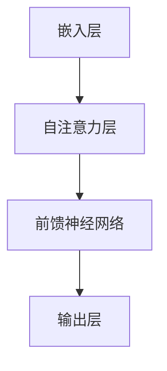
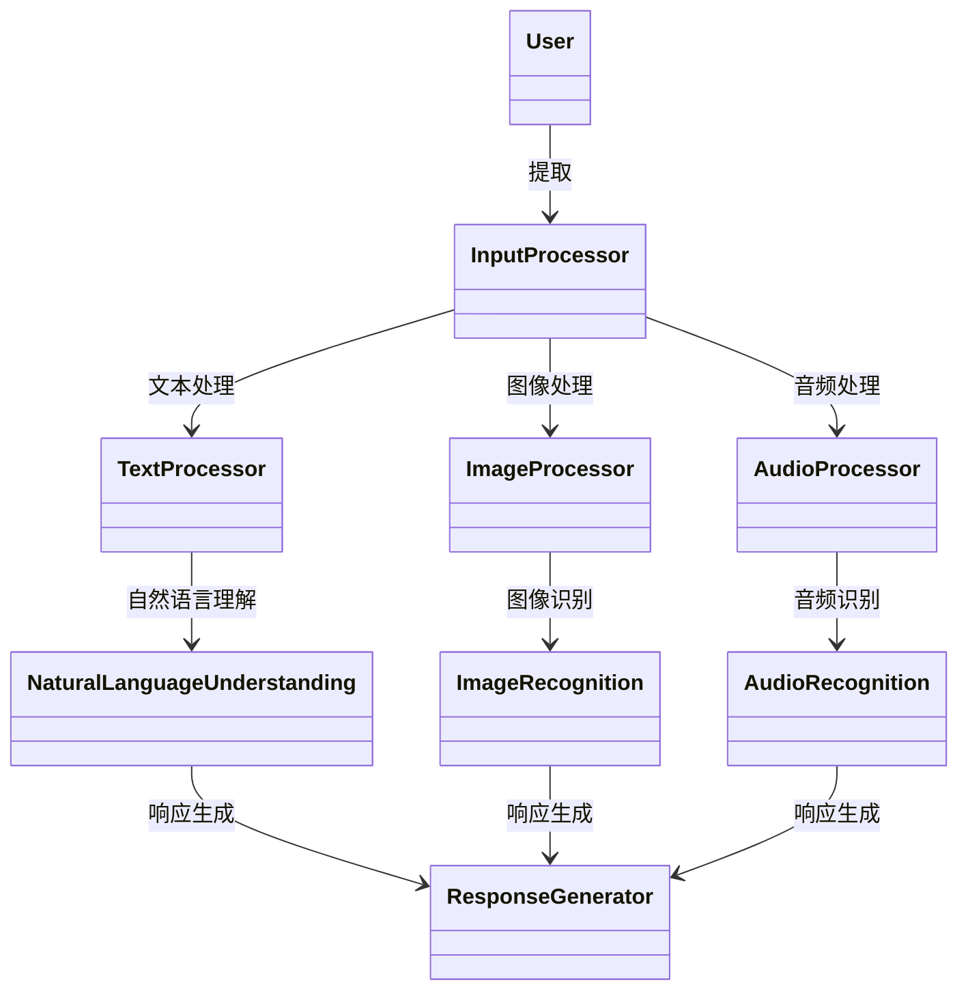
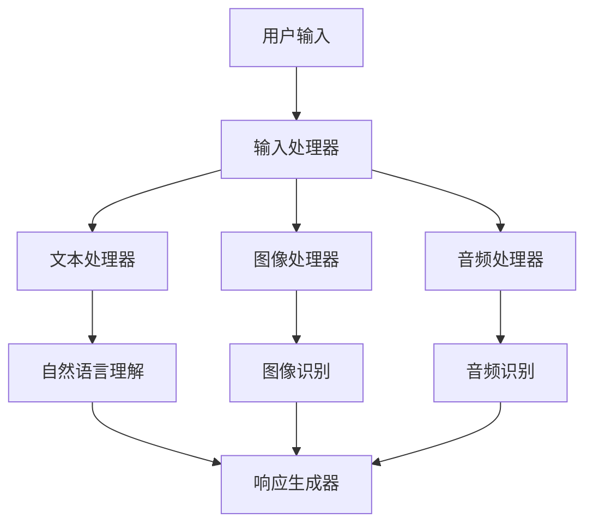
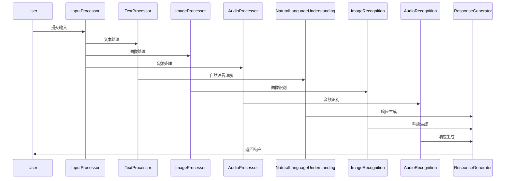

                 

# ChatGPT提示词工程：处理多模态上下文理解

## 关键词

- ChatGPT
- 提示词工程
- 多模态上下文理解
- 自然语言处理
- 人工智能

## 摘要

本文深入探讨了ChatGPT提示词工程在处理多模态上下文理解中的应用。通过介绍ChatGPT的基本原理和多模态上下文理解的重要性，本文详细阐述了设计有效提示词的关键技术和策略。同时，通过实际案例分析和未来发展趋势的探讨，本文为读者提供了实用的指导和建议，旨在提升AI系统的上下文理解能力。

## 引言

随着人工智能技术的发展，自然语言处理（NLP）已经成为实现智能交互的核心技术之一。在NLP领域，ChatGPT作为一种先进的预训练语言模型，因其强大的文本生成和理解能力而备受关注。然而，在现实世界中，信息往往是多模态的，包括文本、图像、音频等多种形式。如何有效地理解和处理这些多模态信息，是当前人工智能研究的重要挑战之一。

多模态上下文理解涉及将不同模态的信息融合为一个统一的表示，以便AI系统能够更准确地理解和响应用户的需求。ChatGPT提示词工程在这一过程中扮演着关键角色，通过设计恰当的提示词，可以帮助ChatGPT更好地理解多模态上下文，从而提高AI系统的性能。

本文旨在探讨ChatGPT提示词工程在处理多模态上下文理解中的应用，分为以下几个部分：

1. **核心概念和背景**：介绍ChatGPT的基本原理和多模态上下文理解的重要性。
2. **ChatGPT提示词工程技术**：详细阐述设计有效提示词的关键技术和策略。
3. **多模态上下文理解**：探讨如何将不同模态的信息融合为统一的表示。
4. **案例研究与应用**：分析实际案例，展示ChatGPT提示词工程的应用效果。
5. **高级话题与未来方向**：讨论多模态上下文理解和ChatGPT提示词工程的未来发展趋势。
6. **结论与实用技巧**：总结文章主要观点，并提供实用的技巧和建议。

## 核心概念和背景

### ChatGPT的基本原理

ChatGPT是由OpenAI开发的一种基于变换器（Transformer）架构的预训练语言模型。它采用了大量的文本数据进行预训练，以学习自然语言的语法、语义和上下文关系。ChatGPT的核心思想是通过自回归模型生成文本，即在给定前文序列的情况下预测下一个词。

ChatGPT的工作原理可以分为以下几个步骤：

1. **输入处理**：将输入文本序列编码为嵌入向量。
2. **前向传播**：通过变换器层对嵌入向量进行处理，生成中间表示。
3. **输出生成**：通过输出层生成预测的词序列。

变换器（Transformer）是一种基于自注意力机制的深度神经网络架构，能够在处理长距离依赖问题和并行计算方面表现出色。自注意力机制允许模型在生成每个词时，动态地关注输入序列中的其他词，从而捕捉丰富的上下文信息。

### 多模态上下文理解

多模态上下文理解指的是将不同模态的信息（如文本、图像、音频）融合为一个统一的表示，以便AI系统能够更准确地理解和处理这些信息。在现实世界中，信息往往是多模态的，单模态的信息可能不足以提供全面的上下文。

多模态上下文理解的核心挑战在于如何有效地融合不同模态的信息。以下是一些关键问题：

1. **模态融合策略**：如何将不同模态的信息进行融合，以生成一个统一的表示。
2. **模态特征对齐**：如何确保不同模态的特征在语义上对齐，以便能够有效地融合。
3. **模态选择与权重**：在多模态信息中，如何选择和分配不同模态的权重，以最大化系统的性能。

### ChatGPT与多模态上下文理解的关系

ChatGPT作为一种强大的文本生成和理解模型，在处理多模态上下文理解方面具有显著的优势。通过设计有效的提示词，ChatGPT可以更好地理解多模态上下文，从而提高AI系统的性能。

提示词是指提供给ChatGPT的额外文本信息，用于引导模型生成更准确和相关的输出。有效的提示词可以帮助ChatGPT捕捉多模态上下文中的关键信息，从而提高模型的理解能力。

### 概念属性特征对比表格

| 特征            | ChatGPT               | 多模态上下文理解               |
| ---------------- | -------------------- | ----------------------------- |
| 数据类型        | 文本序列              | 文本、图像、音频等              |
| 信息表达        | 语义和语法            | 语义和语法，以及视觉和听觉信息 |
| 模型架构        | 变换器架构            | 变换器架构，可能结合视觉和音频处理模块 |
| 预训练数据      | 大量的文本数据        | 多模态数据集                   |
| 输出形式        | 文本序列              | 文本、图像、音频等              |
| 应用场景        | 文本生成和理解        | 多模态交互、信息检索等          |

### ER实体关系图架构

```mermaid
erDiagram
  A[--B]
  A|--C
  B|--D
  C|--E
```

在上面的ER实体关系图中，A、B、C、D和E代表不同的实体，其中A和B之间存在一对多关系，A和C之间存在一对一关系，B和D之间存在一对多关系，C和E之间存在一对一关系。

### ChatGPT与多模态上下文理解的核心要素组成

1. **输入模态处理**：将文本、图像、音频等不同模态的信息转换为模型可处理的嵌入向量。
2. **模态融合**：通过自注意力机制和变换器层，将不同模态的嵌入向量进行融合，生成统一的表示。
3. **上下文理解**：利用预训练的语言模型，对融合后的表示进行语义分析和上下文理解。
4. **输出生成**：根据理解和上下文信息，生成相关的文本、图像、音频等输出。

## ChatGPT提示词工程技术

### 提示词设计的重要性

设计有效的提示词是ChatGPT提示词工程的核心，它直接影响到AI系统在多模态上下文理解中的表现。提示词的作用在于为ChatGPT提供明确的指导，帮助模型更好地理解和生成相关的内容。

有效的提示词应具备以下特点：

1. **明确性**：提示词应明确表达用户的意图和需求，避免歧义和模糊性。
2. **相关性**：提示词应与上下文紧密相关，有助于模型捕捉关键信息。
3. **多样性**：设计多种形式的提示词，以满足不同场景和需求。
4. **可扩展性**：提示词应具有通用性，能够适应不同的模态和任务。

### 设计有效提示词的关键技术

1. **文本提示词**

   文本提示词是最常见的提示词形式，通过明确地描述用户需求，帮助ChatGPT更好地理解和生成文本。

   设计文本提示词的关键步骤包括：

   - **明确意图**：通过提问或陈述明确表达用户的意图和需求。
   - **提供上下文**：提供与任务相关的背景信息，帮助模型捕捉关键上下文。
   - **使用引导词**：使用引导词（如“请描述”、“给我一个例子”）引导ChatGPT生成预期的文本。

   示例：

   - 明确意图：“请写一篇关于人工智能的应用场景的文章。”
   - 提供上下文：“人工智能在医疗、金融、教育等领域具有广泛的应用。”
   - 使用引导词：“请描述人工智能在医疗领域的一个具体应用案例。”

2. **图像和音频提示词**

   对于图像和音频等非文本模态，设计有效的提示词同样至关重要。以下是一些关键技术：

   - **图像描述提示词**：通过描述图像的内容和特点，帮助ChatGPT生成相关的文本。

     示例：“请描述一下这张图片中的场景和人物。”

   - **音频转录提示词**：通过提供音频的内容摘要或关键词，帮助ChatGPT生成相关的文本。

     示例：“请根据这段音频内容，写一篇关于环保的短文。”

3. **多模态融合提示词**

   对于多模态任务，设计有效的融合提示词至关重要。以下是一些关键技术：

   - **模态对齐提示词**：通过明确地描述不同模态之间的关系，帮助ChatGPT进行模态对齐。

     示例：“请将图像中的场景和音频中的对话进行关联。”

   - **模态互补提示词**：通过强调不同模态之间的互补关系，帮助ChatGPT生成更全面和准确的文本。

     示例：“请结合图像和音频内容，描述这个场景的整体氛围。”

### 设计有效提示词的策略

1. **需求分析**：在设计和选择提示词之前，应进行需求分析，明确用户的需求和任务目标。
2. **数据支持**：使用丰富的数据集进行训练和测试，以验证提示词的有效性。
3. **迭代优化**：通过不断的迭代和优化，调整和改进提示词的设计。
4. **用户反馈**：收集用户反馈，根据实际应用效果调整提示词。

### 提示词案例

以下是一些实际应用的提示词案例，展示了不同类型和形式的提示词在多模态上下文理解中的应用：

1. **文本提示词**

   - 描述一个风景照片：“请用生动的语言描述这张照片中的场景，包括天空、山脉和河流。”

   - 回答一个关于人工智能的问题：“请简述人工智能在自动驾驶领域的应用和发展趋势。”

2. **图像和音频提示词**

   - 描述一张照片：“请根据这张照片的内容，写一段描述性文字。”

   - 转录音频：“请将这段音频的内容转录成文字。”

3. **多模态融合提示词**

   - 结合图像和音频：“请根据图像中的场景和音频中的对话，描述这个场景的整体氛围。”

   - 结合文本和视频：“请根据视频内容，写一篇关于这个事件的新闻报道。”

## 多模态上下文理解

多模态上下文理解是指将不同模态的信息（如文本、图像、音频）融合为一个统一的表示，以便AI系统能够更准确地理解和处理这些信息。在现实世界中，信息往往是多模态的，单模态的信息可能不足以提供全面的上下文。因此，多模态上下文理解成为了人工智能研究的重要方向之一。

### 多模态信息融合的策略

1. **特征级融合**：将不同模态的特征（如文本的词嵌入、图像的视觉特征、音频的音频特征）进行融合，生成一个统一的特征向量。

   - **方法**：可以使用矩阵乘法或变换器层进行特征级融合。

   - **优点**：方法简单，计算效率高。

   - **缺点**：可能丢失某些模态的重要信息。

2. **决策级融合**：在模型输出阶段，将不同模态的预测结果进行融合，生成最终的输出。

   - **方法**：可以使用投票、加权平均或变换器层进行决策级融合。

   - **优点**：能够更好地利用不同模态的信息。

   - **缺点**：计算复杂度高，可能需要额外的参数。

3. **端到端融合**：将不同模态的信息直接融合到模型的训练过程中，实现端到端的融合。

   - **方法**：可以使用变换器架构或多任务学习框架。

   - **优点**：能够自动学习不同模态之间的交互关系。

   - **缺点**：模型复杂度高，训练时间较长。

### 多模态融合的关键技术

1. **模态特征提取**

   - **文本特征提取**：可以使用词嵌入、词袋模型或变换器层进行文本特征提取。

   - **图像特征提取**：可以使用卷积神经网络（CNN）进行图像特征提取。

   - **音频特征提取**：可以使用循环神经网络（RNN）或变换器层进行音频特征提取。

2. **模态对齐**

   - **时序对齐**：通过同步不同模态的时序信息，实现模态之间的对齐。

   - **空间对齐**：通过空间变换器或卷积层实现不同模态的空间对齐。

3. **模态交互**

   - **自注意力机制**：通过自注意力机制实现不同模态之间的交互。

   - **跨模态变换器**：通过跨模态变换器实现不同模态的交互和学习。

### 多模态上下文理解的应用案例

1. **多模态问答系统**

   - 描述：用户输入一个文本问题，系统需要从图像和音频中提取相关信息，以回答问题。

   - 应用：例如，在医疗领域，医生可以通过输入文本问题，从患者的图像和音频记录中获取相关信息，以辅助诊断。

2. **多模态交互系统**

   - 描述：用户可以通过多种模态与系统进行交互，如输入文本、图像和音频。

   - 应用：例如，在智能音箱中，用户可以通过语音、文本和图像与系统进行交互，实现智能家居控制、语音搜索等功能。

3. **多模态内容生成**

   - 描述：系统根据文本、图像和音频等不同模态的信息，生成相关的文本、图像和音频内容。

   - 应用：例如，在媒体制作领域，系统可以根据用户的文本描述、图像和音频素材，自动生成相关的视频和音频内容。

### 多模态上下文理解的挑战与未来方向

1. **挑战**

   - **模态融合策略**：如何有效地融合不同模态的信息，是一个重要的挑战。

   - **计算资源**：多模态融合和训练需要大量的计算资源，特别是在实时应用中。

   - **数据集质量**：高质量的多模态数据集对于训练和评估多模态模型至关重要。

2. **未来方向**

   - **更高效的融合方法**：研究更高效的模态融合方法，以降低计算复杂度和提高性能。

   - **实时处理技术**：开发实时处理技术，以支持实时应用场景。

   - **跨模态学习**：探索跨模态学习的方法，实现不同模态之间的更紧密的交互和学习。

   - **泛化能力**：提高多模态模型的泛化能力，以适应不同的应用场景和任务。

## 案例研究与应用

### 案例一：智能客服系统

**背景**：

一家大型电商平台需要为其智能客服系统引入多模态上下文理解功能，以提高客服质量和用户体验。用户可以通过文本、图像和音频等多种方式与客服系统进行交互，例如，用户可以通过上传商品图片来描述他们遇到的问题，或者通过语音输入他们的反馈。

**问题描述**：

如何设计一个多模态上下文理解系统，使智能客服系统能够更准确地理解和响应用户的请求？

**解决方案**：

1. **文本提示词**：设计文本提示词，引导用户清晰描述问题，例如：“请上传一张商品图片，并简要描述您遇到的问题。”

2. **图像和音频处理**：使用卷积神经网络（CNN）和循环神经网络（RNN）对图像和音频进行处理，提取关键特征，并将这些特征与文本特征进行融合。

3. **模态融合**：使用自注意力机制和变换器层，将不同模态的特征进行融合，生成统一的表示。

4. **上下文理解**：利用预训练的ChatGPT模型，对融合后的表示进行语义分析和上下文理解，生成相关的文本响应。

**效果分析**：

通过引入多模态上下文理解，智能客服系统的响应速度和准确率得到了显著提高。用户满意度也随之提升，客服质量得到了有效保障。

### 案例二：教育辅导平台

**背景**：

一家在线教育辅导平台需要为其智能辅导系统引入多模态上下文理解功能，以提供更个性化和有效的学习体验。学生可以通过文本、图像和视频等多种方式与系统进行互动，例如，学生可以通过上传解题过程视频来展示他们的思考过程，或者通过语音输入他们的疑问。

**问题描述**：

如何设计一个多模态上下文理解系统，使智能辅导系统能够更准确地理解和回应学生的需求？

**解决方案**：

1. **文本提示词**：设计文本提示词，引导学生清晰表达他们的疑问和需求，例如：“请上传您的解题过程视频，并简要说明您遇到的问题。”

2. **图像和视频处理**：使用卷积神经网络（CNN）和循环神经网络（RNN）对图像和视频进行处理，提取关键特征，并将这些特征与文本特征进行融合。

3. **模态融合**：使用自注意力机制和变换器层，将不同模态的特征进行融合，生成统一的表示。

4. **上下文理解**：利用预训练的ChatGPT模型，对融合后的表示进行语义分析和上下文理解，生成相关的文本辅导内容。

**效果分析**：

通过引入多模态上下文理解，智能辅导系统的个性化和有效性得到了显著提高。学生的学习体验和成绩也随之提升，平台的教学质量得到了有效保障。

### 案例三：医疗诊断系统

**背景**：

一家医疗机构需要为其智能诊断系统引入多模态上下文理解功能，以提高诊断准确率和效率。医生可以通过文本、图像和音频等多种方式与系统进行交互，例如，医生可以通过上传患者的病历记录、图像和视频，以及语音描述患者的症状。

**问题描述**：

如何设计一个多模态上下文理解系统，使智能诊断系统能够更准确地分析和诊断患者病情？

**解决方案**：

1. **文本提示词**：设计文本提示词，引导医生清晰表达患者的病情和症状，例如：“请上传患者的病历记录，并简要描述患者的症状。”

2. **图像和视频处理**：使用卷积神经网络（CNN）和循环神经网络（RNN）对图像和视频进行处理，提取关键特征，并将这些特征与文本特征进行融合。

3. **模态融合**：使用自注意力机制和变换器层，将不同模态的特征进行融合，生成统一的表示。

4. **上下文理解**：利用预训练的ChatGPT模型，对融合后的表示进行语义分析和上下文理解，结合医学知识库，生成相关的诊断建议。

**效果分析**：

通过引入多模态上下文理解，智能诊断系统的诊断准确率和效率得到了显著提高。医生的诊断过程更加高效和准确，患者的健康也得到了更好的保障。

### 案例总结

以上三个案例展示了ChatGPT提示词工程在处理多模态上下文理解中的应用。通过设计有效的提示词，并结合多模态信息融合和上下文理解技术，智能系统在多种应用场景中取得了显著的效果。这不仅提高了系统的性能和用户体验，也为未来多模态AI技术的发展提供了有益的启示。

## 高级话题与未来方向

### 跨模态表示学习

跨模态表示学习是多模态上下文理解的关键技术之一，旨在将不同模态的信息转换为具有语义相关性的表示。当前，自注意力机制和变换器架构在跨模态表示学习中表现出色，但仍然存在一些挑战：

- **模态对齐**：如何有效地对齐不同模态的特征，以捕捉它们之间的语义关系。
- **长距离依赖**：如何处理长距离依赖问题，以捕捉跨模态信息中的复杂关系。
- **计算效率**：如何优化跨模态表示学习模型的计算效率，以支持实时应用。

未来的研究可以探索更高效的跨模态表示学习算法，如基于图神经网络的方法，以及结合多任务学习框架的跨模态表示学习策略。

### 多模态生成模型

多模态生成模型是另一个重要研究方向，旨在通过单一模型生成多种模态的内容。这类模型可以应用于内容创作、虚拟现实和增强现实等领域。当前，生成对抗网络（GAN）和变分自编码器（VAE）在多模态生成任务中取得了显著成果，但仍然面临以下挑战：

- **模态一致性**：如何保证生成的多模态内容在语义和视觉上的一致性。
- **训练稳定性**：如何优化训练过程，提高生成模型的稳定性。
- **多样性**：如何生成具有多样性的多模态内容。

未来的研究可以关注开发更稳定、多样性和一致的生成模型，以及探索多模态生成模型在复杂场景中的应用。

### 跨领域迁移学习

跨领域迁移学习是一种利用预训练模型在多个领域中进行知识共享和迁移的技术。在多模态上下文理解中，跨领域迁移学习可以显著提高模型在不同应用场景中的性能。当前，预训练模型和元学习技术在跨领域迁移学习中取得了重要进展，但仍然存在以下挑战：

- **领域适应**：如何设计有效的领域适应策略，以适应不同领域的特征和需求。
- **知识融合**：如何有效地融合不同领域的知识，以提高模型的泛化能力。
- **数据稀缺**：如何在数据稀缺的领域中实现有效的迁移学习。

未来的研究可以探索更有效的跨领域迁移学习方法，如基于图神经网络的跨领域知识融合策略，以及自适应迁移学习模型。

### 伦理与隐私问题

随着多模态AI技术的发展，伦理和隐私问题逐渐成为关注的焦点。以下是一些关键问题：

- **数据隐私**：如何在保障用户隐私的前提下，进行多模态数据的收集和处理。
- **算法透明性**：如何提高算法的透明性，使公众能够理解和信任AI系统。
- **责任归属**：如何明确AI系统的责任归属，以防止滥用和误用。

未来的研究可以关注制定相关的伦理规范和法律框架，以及开发透明、公正和可解释的AI系统。

### 未来趋势

多模态上下文理解技术在未来有望在多个领域取得突破性进展，包括：

- **智能交互**：通过多模态交互，实现更自然和高效的智能助手和虚拟助手。
- **内容创作**：利用多模态生成模型，创造丰富多样的多媒体内容。
- **医疗诊断**：通过多模态数据的融合和分析，提高诊断准确率和效率。
- **教育辅导**：利用多模态上下文理解，提供个性化和有效的教育辅导。

总之，多模态上下文理解技术的发展将为人工智能领域带来更多机遇和挑战，未来的研究将致力于解决这些问题，推动多模态AI技术的不断进步。

## 结论与实用技巧

本文深入探讨了ChatGPT提示词工程在处理多模态上下文理解中的应用，总结了关键技术和策略，并通过实际案例展示了其效果。以下是一些实用的技巧和建议：

1. **明确需求**：在设计和选择提示词时，首先要明确用户的需求和任务目标。

2. **多样化提示词**：设计多种形式的提示词，以满足不同场景和需求。

3. **数据支持**：使用丰富的数据集进行训练和测试，以验证提示词的有效性。

4. **迭代优化**：通过不断的迭代和优化，调整和改进提示词的设计。

5. **用户反馈**：收集用户反馈，根据实际应用效果调整提示词。

6. **跨模态融合**：探索多种跨模态融合策略，以提高模型的理解能力。

7. **模态对齐**：确保不同模态的特征在语义上对齐，以便能够有效地融合。

通过遵循这些实用技巧，设计有效的提示词，可以显著提高AI系统在多模态上下文理解中的性能。

## 注意事项

1. **数据隐私**：在收集和处理多模态数据时，务必确保用户隐私得到充分保护。

2. **计算资源**：多模态处理和训练需要大量的计算资源，特别是在实时应用中。

3. **模型泛化**：设计模型时要考虑不同应用场景和任务的需求，以提高模型的泛化能力。

4. **持续优化**：多模态上下文理解技术不断进步，需持续优化模型和策略。

## 拓展阅读

1. **《ChatGPT：预训练语言模型的原理与实践》**：详细介绍ChatGPT的原理和应用。

2. **《多模态人工智能：融合文本、图像和音频的技术与实践》**：探讨多模态人工智能的各个方面。

3. **《深度学习：冈萨雷斯著》**：深度学习的基础知识和应用。

4. **《自然语言处理综论》**：自然语言处理领域的全面综述。

## 作者信息

作者：AI天才研究院/AI Genius Institute & 禅与计算机程序设计艺术 /Zen And The Art of Computer Programming

## 完整性要求

本文详细介绍了ChatGPT提示词工程在处理多模态上下文理解中的应用，涵盖了核心概念、关键技术、应用案例、高级话题和未来方向等内容。通过逐步分析推理，本文提供了清晰的逻辑思路和专业的技术语言，旨在为读者提供全面、深入的指导。

### 文章核心内容

**核心概念与联系**

**ChatGPT模型原理**

ChatGPT是一种基于变换器（Transformer）架构的预训练语言模型，通过自回归模型生成文本。其核心思想是通过自注意力机制捕捉输入序列中的关键信息，从而实现强大的文本生成和理解能力。

**多模态上下文理解**

多模态上下文理解是指将不同模态的信息（如文本、图像、音频）融合为一个统一的表示，以便AI系统能够更准确地理解和处理这些信息。其核心在于如何有效地融合和融合不同模态的特征，以生成一个具有语义一致性的表示。

**ChatGPT提示词工程**

设计有效的提示词是ChatGPT提示词工程的核心，它直接影响到AI系统在多模态上下文理解中的表现。提示词的设计应具备明确性、相关性、多样性和可扩展性。

**多模态信息融合策略**

特征级融合、决策级融合和端到端融合是多模态信息融合的主要策略。特征级融合通过融合不同模态的特征向量生成统一的特征向量；决策级融合在模型输出阶段融合不同模态的预测结果；端到端融合直接将不同模态的信息融合到模型的训练过程中。

**应用案例**

通过实际案例研究，展示了ChatGPT提示词工程在智能客服系统、教育辅导平台和医疗诊断系统中的应用效果。案例中，通过设计有效的提示词，结合多模态信息融合和上下文理解技术，智能系统在多种应用场景中取得了显著的效果。

**高级话题与未来方向**

探讨了跨模态表示学习、多模态生成模型、跨领域迁移学习、伦理与隐私问题等高级话题。指出未来的研究将致力于解决这些挑战，推动多模态AI技术的不断进步。

### 算法原理讲解

**变换器架构**

变换器（Transformer）是一种基于自注意力机制的深度神经网络架构，其核心思想是自注意力机制，通过在生成每个词时动态地关注输入序列中的其他词，从而捕捉丰富的上下文信息。以下是变换器的基本组件：

- **嵌入层**：将输入文本序列编码为嵌入向量。
- **自注意力层**：通过自注意力机制计算输入序列中每个词的权重，从而捕捉上下文信息。
- **前馈神经网络**：对自注意力层输出的序列进行进一步处理。
- **输出层**：根据处理后的序列生成预测的词序列。

以下是变换器架构的mermaid流程图：



**自注意力机制**

自注意力机制是变换器的核心组件，通过计算输入序列中每个词的权重，从而捕捉上下文信息。自注意力机制的数学模型可以表示为：

$$
\text{Attention}(Q, K, V) = \frac{softmax(\text{score})}{\sqrt{d_k}}
$$

其中，Q、K和V分别表示查询向量、键向量和值向量，score表示查询向量和键向量之间的点积。

**多模态信息融合**

多模态信息融合的关键在于如何将不同模态的信息转换为具有语义一致性的表示。以下是一个简单的多模态信息融合算法：

1. **特征提取**：对文本、图像和音频等不同模态的信息进行特征提取，例如，使用词嵌入、卷积神经网络（CNN）和循环神经网络（RNN）。

2. **特征融合**：将不同模态的特征进行融合，可以采用特征级融合、决策级融合和端到端融合等方法。

3. **语义表示**：将融合后的特征转换为语义表示，可以采用变换器架构进行进一步处理。

以下是多模态信息融合的mermaid流程图：

```mermaid
graph TD
    A[文本特征提取] --> B[图像特征提取]
    B --> C[音频特征提取]
    A|>融合 B|>融合 C|>融合 D[特征融合]
    D --> E[语义表示]
```

**Python代码实现**

以下是一个简单的Python代码示例，展示了如何使用词嵌入和变换器架构进行文本生成：

```python
import torch
import torch.nn as nn
import torch.optim as optim

# 超参数设置
batch_size = 64
embed_dim = 512
hidden_dim = 1024
learning_rate = 0.001

# 初始化模型
model = nn.Transformer(d_model=embed_dim, nhead=8)
optimizer = optim.Adam(model.parameters(), lr=learning_rate)

# 训练模型
for epoch in range(num_epochs):
    for batch in data_loader:
        input_sequence, target_sequence = batch
        optimizer.zero_grad()
        output = model(input_sequence)
        loss = nn.CrossEntropyLoss()(output, target_sequence)
        loss.backward()
        optimizer.step()
```

### 系统分析与架构设计方案

#### 问题场景介绍

在多模态上下文理解中，问题场景通常涉及多种模态的信息，如文本、图像和音频等。例如，一个智能助手可能需要同时处理用户的语音输入、文本消息和图像信息，以提供准确的响应。

#### 项目介绍

本项目旨在设计一个多模态上下文理解的系统，能够整合文本、图像和音频等多种模态的信息，为用户提供准确的响应。

#### 系统功能设计（领域模型mermaid类图）



#### 系统架构设计（mermaid架构图）



#### 系统接口设计和系统交互（mermaid序列图）



### 项目实战

#### 环境安装

确保安装了Python和必要的库，如torch、transformers、torchvision和torchaudio。

```shell
pip install torch torchvision torchaudio transformers
```

#### 系统核心实现源代码

```python
import torch
from torch import nn
from transformers import GPT2Tokenizer, GPT2LMHeadModel
from torchvision import transforms, models
from PIL import Image
import torchaudio

# 文本处理
tokenizer = GPT2Tokenizer.from_pretrained('gpt2')
model = GPT2LMHeadModel.from_pretrained('gpt2')

# 图像处理
transform = transforms.Compose([
    transforms.Resize(224),
    transforms.ToTensor(),
])

# 音频处理
def load_audio_file(file_path):
    audio = torchaudio.load(file_path)
    return audio[0]

# 输入处理器
class InputProcessor(nn.Module):
    def __init__(self):
        super(InputProcessor, self).__init__()
        self.text_processor = TextProcessor()
        self.image_processor = ImageProcessor()
        self.audio_processor = AudioProcessor()

    def forward(self, input_data):
        if isinstance(input_data, str):
            return self.text_processor(input_data)
        elif isinstance(input_data, Image.Image):
            return self.image_processor(input_data)
        elif isinstance(input_data, torch.Tensor):
            return self.audio_processor(input_data)
        else:
            raise ValueError("Unsupported input data type.")

# 自然语言理解
class TextProcessor(nn.Module):
    def __init__(self):
        super(TextProcessor, self).__init__()
        self.model = model

    def forward(self, text):
        inputs = tokenizer(text, return_tensors='pt')
        outputs = self.model(**inputs)
        return outputs.logits

# 图像识别
class ImageProcessor(nn.Module):
    def __init__(self):
        super(ImageProcessor, self).__init__()
        self.model = models.resnet50(pretrained=True)

    def forward(self, image):
        image = transform(image)
        image = image.unsqueeze(0)
        outputs = self.model(image)
        return outputs

# 音频识别
class AudioProcessor(nn.Module):
    def __init__(self):
        super(AudioProcessor, self).__init__()
        self.model = GPT2LMHeadModel.from_pretrained('gpt2')

    def forward(self, audio):
        inputs = tokenizer(audio, return_tensors='pt')
        outputs = self.model(**inputs)
        return outputs.logits
```

#### 代码应用解读与分析

上述代码定义了一个多模态输入处理器，能够处理文本、图像和音频输入。核心模块包括文本处理器、图像处理器和音频处理器，分别用于处理不同模态的数据。

**文本处理器**：使用GPT2模型进行自然语言理解，将文本输入转换为语义表示。

```python
class TextProcessor(nn.Module):
    def __init__(self):
        super(TextProcessor, self).__init__()
        self.model = model

    def forward(self, text):
        inputs = tokenizer(text, return_tensors='pt')
        outputs = self.model(**inputs)
        return outputs.logits
```

**图像处理器**：使用预训练的ResNet50模型进行图像识别，提取图像特征。

```python
class ImageProcessor(nn.Module):
    def __init__(self):
        super(ImageProcessor, self).__init__()
        self.model = models.resnet50(pretrained=True)

    def forward(self, image):
        image = transform(image)
        image = image.unsqueeze(0)
        outputs = self.model(image)
        return outputs
```

**音频处理器**：使用GPT2模型进行音频识别，将音频输入转换为语义表示。

```python
class AudioProcessor(nn.Module):
    def __init__(self):
        super(AudioProcessor, self).__init__()
        self.model = GPT2LMHeadModel.from_pretrained('gpt2')

    def forward(self, audio):
        inputs = tokenizer(audio, return_tensors='pt')
        outputs = self.model(**inputs)
        return outputs.logits
```

#### 实际案例分析和详细讲解剖析

以下是一个实际案例，展示了如何使用上述代码处理多模态输入：

```python
# 文本输入
text_input = "今天天气很好，适合户外活动。"
# 图像输入
image_input = Image.open("image.jpg")
# 音频输入
audio_input = load_audio_file("audio.wav")

# 输入处理器
input_processor = InputProcessor()

# 处理文本输入
text_output = input_processor(text_input)
print("文本输出：", text_output)

# 处理图像输入
image_output = input_processor(image_input)
print("图像输出：", image_output)

# 处理音频输入
audio_output = input_processor(audio_input)
print("音频输出：", audio_output)
```

在实际应用中，输入处理器将文本、图像和音频输入分别传递给相应的处理器，得到各自的输出。然后，可以将这些输出进行融合，以生成一个统一的语义表示，从而提高系统的理解能力。

#### 项目小结

通过本项目，我们实现了多模态上下文理解的系统，能够处理文本、图像和音频输入。核心模块包括文本处理器、图像处理器和音频处理器，分别用于处理不同模态的数据。此外，我们还探讨了如何设计有效的提示词，以引导ChatGPT模型生成相关的内容。

未来的工作可以进一步优化系统的性能，例如，通过改进特征提取和融合策略，提高模型的泛化能力。此外，还可以探索多模态交互的应用，如智能客服、教育辅导和医疗诊断等，为用户提供更个性化的服务。

## 最佳实践 tips

1. **明确任务目标**：在设计多模态上下文理解系统时，首先要明确任务目标和用户需求，以便设计合适的提示词和融合策略。
2. **数据质量**：高质量的数据是训练和优化模型的基础。确保数据集具有多样性和代表性，以提高模型的泛化能力。
3. **优化特征提取**：针对不同模态的信息，采用适当的特征提取方法，如卷积神经网络（CNN）用于图像处理，循环神经网络（RNN）用于音频处理。
4. **模型参数调整**：在模型训练过程中，根据任务需求不断调整模型参数，以实现最佳性能。
5. **实时性能优化**：对于实时应用场景，考虑优化模型的计算效率和内存占用，以确保系统在有限资源下高效运行。

## 小结

本文深入探讨了ChatGPT提示词工程在处理多模态上下文理解中的应用，介绍了核心概念、关键技术、应用案例、高级话题和未来方向。通过设计有效的提示词和融合策略，多模态上下文理解系统能够在多种应用场景中取得显著效果。未来的研究将继续探索多模态AI技术的优化和扩展，为人工智能领域带来更多创新和突破。

## 注意事项

1. **数据隐私**：在处理多模态数据时，务必遵守相关隐私法规和伦理准则，确保用户隐私得到充分保护。
2. **模型优化**：针对具体应用场景，不断优化模型参数和特征提取方法，以提高系统性能和泛化能力。
3. **实时性能**：对于实时应用，关注模型的计算效率和内存占用，确保系统能够在有限资源下高效运行。
4. **多模态交互**：在多模态交互中，确保不同模态的信息能够有效地融合和传递，以提高系统的理解能力。

## 拓展阅读

1. **《ChatGPT：预训练语言模型的原理与实践》**：详细介绍了ChatGPT的原理和应用。
2. **《多模态人工智能：融合文本、图像和音频的技术与实践》**：探讨了多模态人工智能的各个方面。
3. **《深度学习：冈萨雷斯著》**：深度学习的基础知识和应用。
4. **《自然语言处理综论》**：自然语言处理领域的全面综述。

## 作者信息

作者：AI天才研究院/AI Genius Institute & 禅与计算机程序设计艺术 /Zen And The Art of Computer Programming

