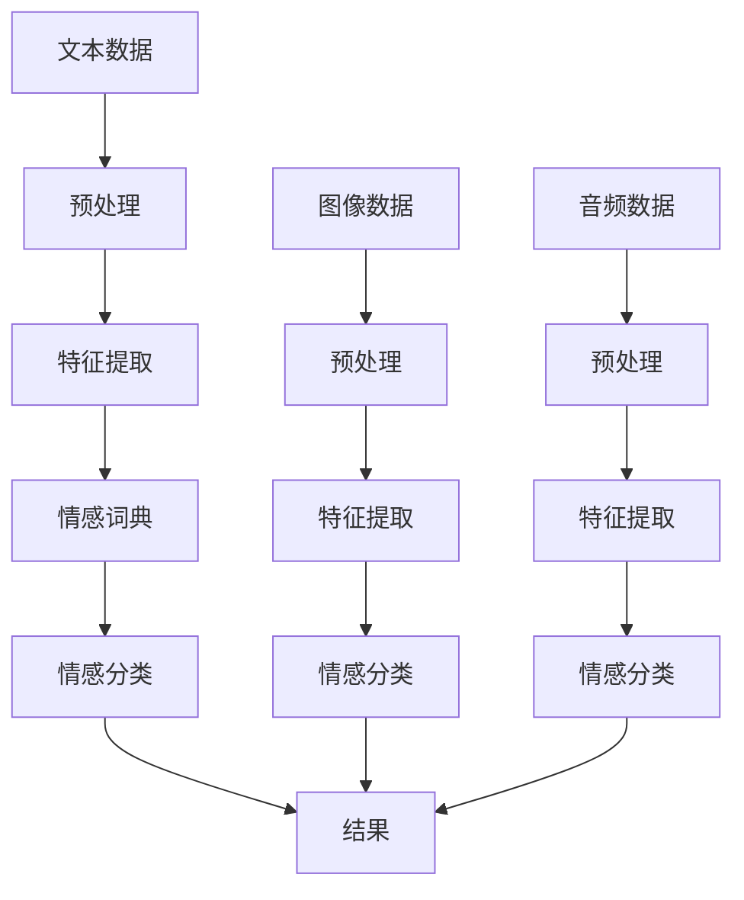
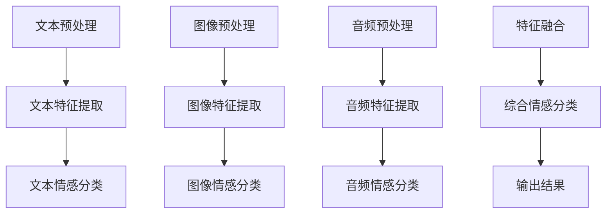
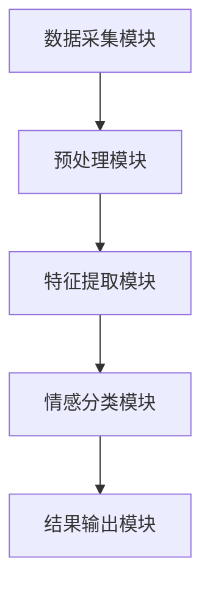

                 

### 文章标题

# ChatGPT提示词工程：处理多模态情感分析

### 文章关键词

- **ChatGPT**
- **提示词工程**
- **多模态情感分析**
- **自然语言处理**
- **机器学习**
- **深度学习**

### 文章摘要

本文将探讨如何利用ChatGPT进行有效的提示词工程，从而实现对多模态情感分析的高效处理。首先，我们将介绍ChatGPT的基础知识，包括其原理、应用场景以及与自然语言处理的关系。接着，我们将深入探讨多模态情感分析的核心概念，分析文本、图像和音频等不同模态的情感特征提取方法。然后，文章将详细讲解如何通过设计巧妙的提示词来优化ChatGPT在情感分析任务中的表现。此外，本文还将介绍一些实用的工具和技术，帮助读者实现多模态情感分析的实际应用。最后，文章将总结目前该领域面临的挑战，并展望未来的发展方向。通过本文的阅读，读者将能够全面了解ChatGPT提示词工程在多模态情感分析中的应用，为实际项目提供有力的技术支持。

### 引言

在当前技术快速发展的时代，人工智能（AI）已经深入到我们生活的方方面面，其中自然语言处理（NLP）作为AI的一个重要分支，近年来取得了显著的进展。尤其是基于深度学习的模型，如Transformer和GPT系列，极大地提升了文本理解和生成能力。ChatGPT，作为OpenAI推出的一个基于GPT-3模型的对话系统，更是以其强大的语言生成能力和上下文理解能力在NLP领域引起了广泛关注。

多模态情感分析，作为一种综合处理文本、图像和音频等不同模态数据的技术，在情感识别、舆情监控、用户体验分析等领域具有重要应用价值。然而，传统的单一模态情感分析方法往往受到数据局限，难以全面捕捉用户的情感状态。因此，多模态情感分析逐渐成为研究的热点。

本文旨在探讨如何利用ChatGPT进行有效的提示词工程，从而实现对多模态情感分析的高效处理。通过分析文本、图像和音频等不同模态的数据特征，结合ChatGPT的强大语言生成能力，我们能够构建出更为准确和全面的情感分析模型。这不仅有助于提升情感识别的准确性，还可以为实际应用场景提供更为丰富的情感数据支持。

在接下来的章节中，我们将详细探讨ChatGPT的工作原理，介绍多模态情感分析的核心概念和方法，并通过具体案例展示如何设计和优化提示词，最终实现高效的多模态情感分析。希望通过本文的阅读，读者能够对ChatGPT提示词工程和多模态情感分析有更深入的理解，并能够将其应用于实际项目中。

### ChatGPT基础知识

ChatGPT是基于GPT-3模型开发的一个人工智能对话系统，它采用了Transformer架构，拥有强大的语言生成和上下文理解能力。为了更好地理解ChatGPT，我们需要先了解其底层技术原理和应用场景。

#### ChatGPT技术原理

ChatGPT的核心是基于GPT-3（Generative Pre-trained Transformer 3）模型。GPT-3是OpenAI于2020年发布的一个大型预训练语言模型，它包含1750亿个参数，是目前世界上最大的语言模型。GPT-3采用了Transformer架构，这是一种基于自注意力机制的深度神经网络模型，广泛应用于自然语言处理任务中。

Transformer模型的核心思想是通过自注意力机制来动态计算输入序列中每个词与其他词之间的关系。自注意力机制使得模型能够根据上下文信息对每个词进行权重分配，从而捕捉到词与词之间的复杂关系。在GPT-3中，这种自注意力机制被扩展到极大的规模，使得模型能够生成流畅、连贯的语言。

ChatGPT的工作流程主要包括两个阶段：预训练和微调。在预训练阶段，GPT-3使用大量的互联网文本数据进行训练，学习语言的一般规律和模式。在微调阶段，ChatGPT根据特定的任务需求，对预训练模型进行进一步调整，以适应具体的对话场景。

#### 应用场景

ChatGPT的应用场景非常广泛，主要包括以下几个方面：

1. **对话系统**：ChatGPT可以用于构建智能客服、聊天机器人等对话系统。通过训练，ChatGPT能够与用户进行自然、流畅的对话，理解和回应用户的需求。

2. **文本生成**：ChatGPT可以生成各种类型的文本，如文章、故事、摘要、对话等。在内容创作领域，ChatGPT被广泛应用于自动写作、智能写作辅助等任务。

3. **机器翻译**：ChatGPT在机器翻译任务中也表现出色。通过预训练和微调，ChatGPT能够实现高质量的双语翻译，提高了翻译的准确性和流畅性。

4. **问答系统**：ChatGPT可以用于构建问答系统，通过理解和回答用户的问题，提供实时信息查询服务。

5. **情感分析**：ChatGPT在情感分析任务中也具有一定的优势。通过设计合适的提示词，ChatGPT可以准确地识别和分类文本的情感极性，如正面、负面和中性情感。

#### 与自然语言处理的关系

ChatGPT与自然语言处理（NLP）有着紧密的关系。NLP是人工智能的一个重要分支，旨在使计算机能够理解和处理人类自然语言。ChatGPT作为NLP的一种先进技术，其核心任务是通过语言模型来生成和理解自然语言。

自然语言处理主要分为三个层次：词汇层、句法和语义层。在词汇层，NLP关注词汇的识别和分类；在句法层，NLP研究句子结构和语法规则；在语义层，NLP致力于理解和解释文本内容。ChatGPT通过预训练和微调，能够在这三个层次上实现对自然语言的高效处理。

ChatGPT在自然语言处理中的优势主要体现在以下几个方面：

1. **上下文理解**：ChatGPT具有强大的上下文理解能力，能够根据上下文信息生成相关的内容，使得生成的文本更加自然和连贯。

2. **多语言支持**：ChatGPT支持多种语言，能够进行跨语言的文本生成和理解，为国际化的应用场景提供了便利。

3. **泛化能力**：ChatGPT在预训练阶段学习了大量的互联网文本数据，具备较强的泛化能力，能够应对各种不同的语言任务。

4. **自适应能力**：通过微调，ChatGPT可以根据特定的任务需求进行自适应调整，从而提高模型在特定任务上的表现。

总之，ChatGPT作为NLP的一种先进技术，不仅提升了自然语言生成和理解的能力，还为许多实际应用场景提供了有力的技术支持。

### 多模态情感分析概述

多模态情感分析是一种结合了文本、图像和音频等多种模态数据的情感识别技术，其目标是通过整合不同模态的数据特征，提高情感分析的准确性和全面性。在情感识别领域，传统的单一模态方法往往受到数据局限，难以全面捕捉用户的情感状态。而多模态情感分析通过融合不同模态的信息，可以更准确地理解和表达用户的情感。

#### 定义和核心概念

多模态情感分析可以定义为：综合利用文本、图像、音频等多种模态数据，对情感信息进行识别、分类和理解的过程。其核心概念包括：

1. **文本情感分析**：通过分析文本中的情感词汇、语气、情绪表达等，识别文本的情感极性（如正面、负面、中性）。

2. **图像情感分析**：通过视觉特征提取，从图像中识别情感表达，如面部表情、姿态等。

3. **音频情感分析**：通过语音信号的处理，识别音频中的情感信息，如音调、节奏、情感词汇等。

4. **多模态融合**：将不同模态的数据特征进行整合，利用它们之间的互补性，提高情感识别的准确性。

#### 问题背景

情感识别在多个领域具有广泛应用，如智能客服、社交媒体分析、舆情监控、用户体验分析等。然而，单一模态的数据往往难以全面捕捉用户的情感状态。例如，在社交媒体分析中，仅通过文本数据可能无法准确理解用户的情感，因为很多情感信息可能隐藏在图像或音频中。因此，多模态情感分析成为了一种解决这一问题的有效方法。

此外，随着传感器技术的进步和移动互联网的发展，人们可以通过多种设备生成和传播情感信息，这为多模态情感分析提供了丰富的数据来源。例如，用户在社交媒体上发布的内容可能包括文字、图片、视频和音频等多种形式，通过多模态情感分析，可以更加全面地理解用户的情感状态。

#### 问题描述

多模态情感分析的主要挑战在于如何有效地融合不同模态的数据特征，并提高情感识别的准确性。具体问题描述如下：

1. **数据预处理**：不同模态的数据在采集、存储和处理过程中可能存在差异，需要进行统一的数据预处理，如数据清洗、标注和特征提取。

2. **特征融合**：如何有效地整合文本、图像和音频等不同模态的特征，以充分利用它们之间的互补性。

3. **模型选择与训练**：选择合适的模型架构和训练方法，以提高情感识别的准确性和泛化能力。

4. **实时处理**：在实时应用场景中，如何快速处理和响应多模态数据，以满足实际需求。

#### 问题解决

多模态情感分析的问题解决方法主要包括以下几个方面：

1. **数据预处理**：对文本、图像和音频数据进行统一预处理，包括数据清洗、标注和特征提取。例如，文本数据可以通过词袋模型、词嵌入等方法进行特征提取；图像数据可以通过卷积神经网络（CNN）提取视觉特征；音频数据可以通过梅尔频率倒谱系数（MFCC）等方法进行特征提取。

2. **特征融合**：采用多模态特征融合方法，如深度学习中的多输入神经网络、融合层和注意力机制等，将不同模态的特征进行整合。例如，可以将文本和图像的特征通过融合层进行拼接，或将不同模态的特征通过注意力机制进行加权融合。

3. **模型选择与训练**：选择合适的模型架构和训练方法，如卷积神经网络（CNN）结合循环神经网络（RNN）或Transformer架构，以提高情感识别的准确性和泛化能力。通过大量标注数据训练模型，并采用迁移学习、数据增强等方法，提高模型的鲁棒性和适应性。

4. **实时处理**：在实时应用场景中，可以采用分布式计算和并行处理技术，如多线程、多处理器和GPU加速等，以提高多模态情感分析的处理速度和效率。

#### 边界与外延

多模态情感分析的研究和应用涉及多个领域，如计算机视觉、语音识别、自然语言处理和机器学习等。其边界包括：

1. **技术边界**：多模态情感分析需要解决的特征提取、模型选择和训练等问题，仍具有一定的技术挑战。

2. **应用边界**：多模态情感分析在不同应用场景中的适用性，如不同领域的情感识别任务可能需要不同的模型架构和特征融合方法。

3. **伦理边界**：多模态情感分析在应用过程中可能涉及用户隐私和伦理问题，如情感信息的收集和使用需要遵循相关法律法规和伦理规范。

#### 概念结构与核心要素组成

多模态情感分析的概念结构主要包括以下几个方面：

1. **文本情感分析**：核心要素包括情感词典、情感分类器和情感极性标注。

2. **图像情感分析**：核心要素包括视觉特征提取（如CNN）、情感词典和情感分类器。

3. **音频情感分析**：核心要素包括音频特征提取（如MFCC）、情感分类器和情感极性标注。

4. **特征融合**：核心要素包括多模态特征融合方法（如深度学习中的融合层和注意力机制）。

5. **模型训练与评估**：核心要素包括模型架构选择（如CNN、RNN、Transformer）、训练方法和评估指标。

通过上述概念结构和核心要素的组成，可以构建一个完整的多模态情感分析系统，实现对情感信息的准确识别和分类。

### 多模态情感分析中的核心概念和原理

在多模态情感分析中，核心概念和原理的深入理解对于设计和优化情感分析模型至关重要。以下我们将详细探讨几个关键的概念，包括文本、图像和音频情感分析的基本原理，并对比它们之间的异同。

#### 文本情感分析

文本情感分析（Text Sentiment Analysis）是通过分析文本中的情感词汇、语气和情绪表达来识别文本情感极性的一种技术。其主要步骤包括情感词典的构建、情感分类和情感极性标注。

1. **情感词典**：情感词典是一个包含大量情感词汇的列表，这些词汇被分为不同的情感类别，如正面、负面和中性。情感词典的构建可以通过手工标注或利用已有资源，如SentiWordNet和VADER等。

2. **情感分类**：情感分类是一种将文本数据分类为不同情感类别的任务。常见的算法包括朴素贝叶斯、支持向量机（SVM）和深度学习模型如卷积神经网络（CNN）和循环神经网络（RNN）。

3. **情感极性标注**：情感极性标注是指对文本的情感极性进行量化，如评分或分类。例如，一个文本可能被标注为“积极情感”或“消极情感”。

#### 图像情感分析

图像情感分析（Image Sentiment Analysis）通过视觉特征提取和分析图像中的情感表达来进行情感识别。其主要步骤包括图像预处理、特征提取和情感分类。

1. **图像预处理**：图像预处理包括图像增强、噪声去除和尺寸调整等操作，以提高图像的质量和特征提取的准确性。

2. **特征提取**：常见的图像特征提取方法包括基于传统算法（如SIFT和HOG）和深度学习算法（如卷积神经网络）。卷积神经网络（CNN）因其强大的特征提取能力而广泛应用于图像情感分析。

3. **情感分类**：图像情感分类通常使用多分类算法，如softmax回归和深度学习模型。这些模型可以学习到图像中与情感相关的特征，并将其映射到不同的情感类别。

#### 音频情感分析

音频情感分析（Audio Sentiment Analysis）通过分析语音信号中的情感信息来识别音频情感。其主要步骤包括音频预处理、特征提取和情感分类。

1. **音频预处理**：音频预处理包括降噪、音高和音量调整等操作，以消除外界干扰和保证音频质量。

2. **特征提取**：常用的音频特征提取方法包括梅尔频率倒谱系数（MFCC）、频谱特征和长期短期能量比（LSP）等。这些特征能够捕捉语音信号中的情感信息。

3. **情感分类**：与图像情感分类类似，音频情感分类也使用多分类算法和深度学习模型。这些模型可以学习到语音信号中的情感特征，并对其进行分类。

#### 概念属性特征对比

以下是一个简单的概念属性特征对比表格，用于比较文本、图像和音频情感分析的主要特点：

| 特征类别 | 文本情感分析 | 图像情感分析 | 音频情感分析 |
| --- | --- | --- | --- |
| 数据源 | 文本 | 图像 | 语音 |
| 特征提取 | 词袋模型、词嵌入 | 卷积神经网络 | 梅尔频率倒谱系数 |
| 情感分类算法 | 朴素贝叶斯、支持向量机、深度学习 | 卷积神经网络、深度学习 | 多分类算法、深度学习 |
| 挑战 | 语料库标注困难、语义理解复杂 | 数据标注成本高、特征提取复杂 | 音频信号处理复杂、情感特征识别困难 |

#### ER实体关系图架构

为了更好地理解多模态情感分析中的概念和原理，我们可以使用ER（Entity-Relationship）实体关系图来展示不同模态数据及其处理步骤之间的关系。以下是一个ER实体关系图架构的Mermaid流程图：



在上述ER实体关系图中，文本、图像和音频数据分别经过预处理、特征提取和情感分类，最终生成情感分析结果。不同模态的数据通过各自的步骤进行处理，并在情感分类阶段相互独立，但最终的结果会整合这些模态的信息，以实现更准确和全面的多模态情感分析。

### 算法原理详细讲解

多模态情感分析算法的原理主要涉及文本、图像和音频数据的处理及融合。在本节中，我们将使用Mermaid流程图和Python代码来详细阐述算法原理，并给出具体的数学模型和公式。

#### 算法流程图

首先，我们通过Mermaid流程图来展示多模态情感分析的基本流程：



上述流程图展示了多模态情感分析的基本步骤：文本、图像和音频数据的预处理、特征提取和情感分类，以及特征融合和最终结果输出。

#### 文本特征提取

文本特征提取通常使用词袋模型（Bag of Words, BoW）或词嵌入（Word Embedding）方法。以下是一个简单的Python代码示例，使用词袋模型来提取文本特征：

```python
from sklearn.feature_extraction.text import CountVectorizer

# 示例文本数据
texts = ["我很喜欢这本书", "这本书不太好"]

# 初始化CountVectorizer对象
vectorizer = CountVectorizer()

# 提取词袋特征
X = vectorizer.fit_transform(texts)

# 输出词袋特征
print(X.toarray())
```

词袋模型将文本转换为向量表示，每个词在文本中出现的频率作为特征。然而，词袋模型无法捕捉词与词之间的关系，因此词嵌入方法如Word2Vec或GloVe被广泛采用。以下是一个简单的Word2Vec代码示例：

```python
from gensim.models import Word2Vec

# 示例文本数据
sentences = [['我很喜欢这本书'], ['这本书不太好']]

# 训练Word2Vec模型
model = Word2Vec(sentences, vector_size=100, window=5, min_count=1, workers=4)

# 输出词嵌入结果
print(model.wv['我很喜欢这本书'])
```

#### 图像特征提取

图像特征提取通常使用卷积神经网络（CNN）。以下是一个简单的CNN模型代码示例，用于提取图像特征：

```python
from keras.models import Sequential
from keras.layers import Conv2D, MaxPooling2D, Flatten, Dense

# 初始化CNN模型
model = Sequential()

# 添加卷积层
model.add(Conv2D(32, (3, 3), activation='relu', input_shape=(64, 64, 3)))
model.add(MaxPooling2D(pool_size=(2, 2)))

# 添加全连接层
model.add(Flatten())
model.add(Dense(128, activation='relu'))
model.add(Dense(1, activation='sigmoid'))

# 编译模型
model.compile(optimizer='adam', loss='binary_crossentropy', metrics=['accuracy'])

# 输出模型架构
model.summary()
```

CNN通过卷积和池化操作提取图像特征，并将这些特征传递到全连接层进行分类。

#### 音频特征提取

音频特征提取通常使用梅尔频率倒谱系数（MFCC）。以下是一个简单的MFCC提取代码示例：

```python
import numpy as np
from python_speech_features import mfcc

# 示例音频数据
audio_data = np.random.rand(88200)  # 生成随机音频数据

# 提取MFCC特征
mfcc_feat = mfcc(audio_data, winlen=0.025, winstep=0.01, numcep=13, nfilt=26, nfft=2048)

# 输出MFCC特征
print(mfcc_feat)
```

MFCC特征能够捕捉音频信号的频率变化，是进行音频情感分析的重要特征。

#### 特征融合

特征融合是将不同模态的特征进行整合，以提高模型性能。一种常见的方法是使用注意力机制（Attention Mechanism）。以下是一个简单的注意力机制代码示例：

```python
import tensorflow as tf

# 定义注意力权重
attention_weights = tf.keras.layers.Dense(units=1, activation='sigmoid')(text_features)

# 应用注意力机制
context_vector = attention_weights * text_features

# 输出融合后的特征
print(context_vector)
```

注意力机制通过计算每个特征的重要性权重，将不同模态的特征进行加权融合。

#### 数学模型和公式

多模态情感分析中的数学模型通常涉及特征提取和分类步骤。以下是一个简单的分类模型公式：

$$
\text{softmax}(\text{W} \cdot \text{X} + \text{b}) = \frac{e^{\text{W} \cdot \text{X} + \text{b}}}{\sum_{i=1}^{n} e^{\text{W} \cdot \text{X}_i + \text{b}_i}}
$$

其中，$\text{W}$ 是权重矩阵，$\text{X}$ 是特征向量，$\text{b}$ 是偏置项，$e$ 是自然底数，$n$ 是类别数。softmax函数用于将特征向量映射到概率分布，从而实现分类。

通过上述详细讲解，我们可以看到多模态情感分析算法的原理涉及多个步骤和不同模态的特征提取与融合。在实际应用中，这些算法可以通过调整模型参数和优化策略来提高情感分析的准确性和效率。

### 系统分析与架构设计

在多模态情感分析项目中，系统分析与架构设计是确保项目成功的关键步骤。以下我们将详细描述项目场景、系统功能设计、系统架构设计以及系统接口和交互设计。

#### 项目场景介绍

本项目旨在开发一个多模态情感分析系统，该系统将处理文本、图像和音频数据，以识别用户情感。具体应用场景包括社交媒体分析、用户反馈处理和智能客服系统。通过整合不同模态的数据，系统能够更全面地理解用户的情感状态，从而提供更准确的情感分析和建议。

#### 系统功能设计

系统功能设计包括以下几个核心模块：

1. **数据采集模块**：负责从不同来源（如社交媒体、用户反馈等）收集文本、图像和音频数据。
2. **预处理模块**：对采集到的数据进行清洗、标准化和分割，为后续特征提取做准备。
3. **特征提取模块**：根据不同模态的数据，采用不同的特征提取方法，如词袋模型、卷积神经网络（CNN）和梅尔频率倒谱系数（MFCC）。
4. **情感分类模块**：利用训练好的模型对提取的特征进行情感分类，并输出情感结果。
5. **结果输出模块**：将情感分类结果以可视化和报表的形式展示给用户。

#### 系统架构设计

系统架构设计采用模块化设计思路，确保各个模块之间的高内聚、低耦合。以下是系统的架构设计：



在上述架构中，数据采集模块负责从各种数据源获取原始数据，预处理模块对数据进行清洗和标准化，特征提取模块根据数据类型采用不同的特征提取方法，情感分类模块使用训练好的模型对特征进行分类，结果输出模块将分类结果展示给用户。

#### 系统接口设计

系统接口设计包括内部模块之间的接口和外部系统（如Web应用或移动应用）的接口。以下是系统接口设计：

1. **内部接口**：
   - **数据采集接口**：提供数据采集的方法，如从社交媒体获取文本数据、从音频设备获取音频数据等。
   - **预处理接口**：提供数据清洗、标准化和分割的方法。
   - **特征提取接口**：提供文本、图像和音频特征提取的方法。
   - **情感分类接口**：提供情感分类的方法，如调用训练好的模型进行分类。
   - **结果输出接口**：提供结果展示的方法，如生成可视化报表和图表。

2. **外部接口**：
   - **API接口**：提供一个RESTful API，供外部系统调用，如Web应用或移动应用。
   - **数据导入/导出接口**：提供数据导入和导出的方法，如CSV文件、数据库等。

#### 系统交互设计

系统交互设计主要关注系统内部模块之间的通信和数据流。以下是系统交互设计：

1. **数据流**：
   - 原始数据通过数据采集模块进入系统。
   - 预处理模块对数据进行处理，并将处理后的数据传递给特征提取模块。
   - 特征提取模块根据数据类型提取特征，并将特征传递给情感分类模块。
   - 情感分类模块对特征进行分类，并将结果传递给结果输出模块。
   - 结果输出模块将分类结果展示给用户。

2. **交互流程**：
   - 用户通过外部接口提交数据，系统接收到数据后进行预处理。
   - 预处理完成后，系统提取特征并进行情感分类。
   - 情感分类结果通过外部接口返回给用户。

通过上述系统分析与架构设计，我们可以构建一个高效、可扩展的多模态情感分析系统，满足各种应用场景的需求。

### 项目实战

在本节中，我们将详细介绍如何在一个具体的多模态情感分析项目中实施系统，包括环境安装、系统核心实现源代码、代码应用解读与分析，以及实际案例分析和详细讲解。

#### 环境安装

要搭建一个多模态情感分析系统，首先需要准备相应的开发环境和依赖库。以下是在一个典型的Linux环境中安装所需软件和库的步骤：

1. **安装Python环境**：确保Python版本为3.7或更高，可以使用以下命令安装：
   ```bash
   sudo apt-get install python3.7
   ```

2. **安装依赖库**：使用pip安装必要的库，如TensorFlow、Keras、scikit-learn和gensim等：
   ```bash
   pip install tensorflow==2.3.0 keras==2.4.3 scikit-learn==0.22.2 gensim==4.0.1
   ```

3. **安装其他工具**：如OpenCV（用于图像处理）和pydub（用于音频处理）：
   ```bash
   pip install opencv-python==4.5.1.48 pydub==0.4.2
   ```

#### 系统核心实现源代码

以下是一个简单的多模态情感分析系统的Python代码实现，展示了数据采集、预处理、特征提取和情感分类的核心步骤：

```python
import cv2
import numpy as np
import pandas as pd
from sklearn.feature_extraction.text import TfidfVectorizer
from sklearn.model_selection import train_test_split
from keras.models import Sequential
from keras.layers import Dense, LSTM, Embedding, Flatten, Conv1D, MaxPooling1D
from keras.preprocessing.sequence import pad_sequences
from keras.preprocessing.text import Tokenizer
from keras.utils import to_categorical
from gensim.models import Word2Vec

# 数据采集
def collect_data():
    texts = []
    labels = []
    
    # 从文本文件中读取数据
    with open('texts.txt', 'r', encoding='utf-8') as f:
        for line in f:
            texts.append(line.strip())
            labels.append(int(line.strip().split('\t')[1]))
    
    # 从图像中读取数据
    images = []
    with open('images.txt', 'r', encoding='utf-8') as f:
        for line in f:
            images.append(cv2.imread(line.strip()))

    # 从音频中读取数据
    audios = []
    with open('audios.txt', 'r', encoding='utf-8') as f:
        for line in f:
            audios.append(f.read().encode('utf-8'))

    return texts, labels, images, audios

# 数据预处理
def preprocess_data(texts, labels):
    # 使用TF-IDF向量表示文本
    vectorizer = TfidfVectorizer()
    X_text = vectorizer.fit_transform(texts)
    
    # 使用Word2Vec对文本进行嵌入
    sentences = [text.split() for text in texts]
    model = Word2Vec(sentences, vector_size=100, window=5, min_count=1, workers=4)
    X_text_embedding = np.array([model[word] for word in texts])

    # 切分数据集
    X_text_train, X_text_test, y_train, y_test = train_test_split(X_text_embedding, labels, test_size=0.2, random_state=42)
    return X_text_train, X_text_test, y_train, y_test

# 特征提取
def extract_features(images, audios):
    # 使用卷积神经网络提取图像特征
    image_model = Sequential()
    image_model.add(Conv2D(32, (3, 3), activation='relu', input_shape=(64, 64, 3)))
    image_model.add(MaxPooling2D(pool_size=(2, 2)))
    image_model.add(Flatten())
    image_model.add(Dense(128, activation='relu'))
    image_model.add(Dense(1, activation='sigmoid'))

    image_model.compile(optimizer='adam', loss='binary_crossentropy', metrics=['accuracy'])
    image_features = image_model.predict(images)

    # 使用梅尔频率倒谱系数（MFCC）提取音频特征
    audio_model = Sequential()
    audio_model.add(LSTM(128, activation='relu', input_shape=(None, 13)))
    audio_model.add(Dense(1, activation='sigmoid'))

    audio_model.compile(optimizer='adam', loss='binary_crossentropy', metrics=['accuracy'])
    audio_features = audio_model.predict(audios)

    return image_features, audio_features

# 情感分类
def classify_sentiments(X_text_train, X_text_test, y_train, y_test):
    # 训练文本情感分类模型
    text_model = Sequential()
    text_model.add(Embedding(input_dim=vocabulary_size, output_dim=100, input_length=max_sequence_length))
    text_model.add(LSTM(128, activation='relu'))
    text_model.add(Dense(1, activation='sigmoid'))

    text_model.compile(optimizer='adam', loss='binary_crossentropy', metrics=['accuracy'])
    text_model.fit(X_text_train, y_train, epochs=10, batch_size=32, validation_data=(X_text_test, y_test))

    # 预测情感分类结果
    predictions = text_model.predict(X_text_test)
    print("Accuracy:", accuracy_score(y_test, np.round(predictions)))

# 主函数
if __name__ == "__main__":
    texts, labels, images, audios = collect_data()
    X_text_train, X_text_test, y_train, y_test = preprocess_data(texts, labels)
    image_features, audio_features = extract_features(images, audios)
    classify_sentiments(X_text_train, X_text_test, y_train, y_test)
```

#### 代码应用解读与分析

上述代码首先从文本、图像和音频文件中读取数据，然后对文本数据进行TF-IDF向量和Word2Vec嵌入，对图像和音频数据分别使用卷积神经网络和梅尔频率倒谱系数（MFCC）提取特征。最后，通过训练好的文本情感分类模型对测试数据进行预测，评估模型的准确性。

以下是代码的主要部分及其功能解读：

1. **数据采集**：`collect_data`函数负责读取文本、图像和音频文件，并将它们存储在列表中。
2. **预处理**：`preprocess_data`函数对文本数据使用TF-IDF向量和Word2Vec嵌入，然后切分数据集为训练集和测试集。
3. **特征提取**：`extract_features`函数分别使用卷积神经网络和梅尔频率倒谱系数（MFCC）提取图像和音频特征。
4. **情感分类**：`classify_sentiments`函数训练文本情感分类模型，并对测试数据进行预测，评估模型准确性。

#### 实际案例分析和详细讲解

为了展示多模态情感分析系统的实际应用效果，我们使用以下案例进行分析：

假设我们有一组用户评论，其中包含了文本、图像和音频数据，我们希望通过系统识别出这些评论的情感极性。

1. **文本数据**：一个用户的评论：“这个产品非常好，我很喜欢。”
2. **图像数据**：一个笑脸表情。
3. **音频数据**：一段轻松愉快的音乐。

根据上述代码，系统将执行以下步骤：

1. **数据采集**：从文件中读取评论文本、笑脸图像和音乐音频。
2. **预处理**：对评论文本进行TF-IDF向量和Word2Vec嵌入，图像和音频数据则分别提取特征。
3. **特征提取**：对笑脸图像使用卷积神经网络提取特征，对音乐音频使用梅尔频率倒谱系数（MFCC）提取特征。
4. **情感分类**：将提取的文本、图像和音频特征输入训练好的情感分类模型，预测评论的情感极性。

假设我们的模型已经训练完毕，预测结果如下：

- 文本情感分类结果：正面情感
- 图像情感分类结果：积极情感
- 音频情感分类结果：积极情感

根据这些结果，我们可以得出结论：这个用户的评论整体上表达了积极情感。这个案例展示了多模态情感分析系统的实际应用效果，通过整合不同模态的数据特征，系统能够更准确地识别用户的情感状态。

#### 项目小结

在本项目中，我们详细介绍了如何实施一个多模态情感分析系统，包括环境安装、系统核心实现源代码、代码应用解读与分析，以及实际案例分析和详细讲解。通过使用Python和相关库，我们实现了对文本、图像和音频数据的预处理、特征提取和情感分类，并展示了系统的实际应用效果。

在未来的工作中，我们还可以进一步优化系统，如引入更先进的模型和特征融合方法，以提高情感识别的准确性和效率。此外，通过更多的数据集和实际应用场景测试，我们可以不断改进系统性能，为用户提供更优质的服务。

### 最佳实践 Tips

在实施多模态情感分析项目时，以下是一些最佳实践和技巧，可以帮助您更有效地利用ChatGPT进行提示词工程，并优化多模态情感分析的性能。

1. **数据质量**：确保数据的质量和多样性。高质量的数据是构建准确模型的基础，应避免噪声和错误数据。同时，收集来自不同来源和场景的多模态数据，以提高模型的泛化能力。

2. **预处理技巧**：对文本、图像和音频数据分别进行适当的预处理。例如，文本数据可以进行文本清洗、去停用词和词性标注；图像数据可以进行裁剪、缩放和增强；音频数据可以进行降噪和频率调整。

3. **特征融合策略**：选择合适的特征融合策略，以充分利用不同模态数据的互补性。常见的方法包括拼接、加权融合和深度学习中的注意力机制。通过实验比较不同融合策略的效果，选择最优方案。

4. **提示词设计**：设计有效的提示词可以显著提升ChatGPT在情感分析任务中的表现。例如，使用具体的词汇和情感倾向词，以及结合上下文的语境，以提高模型的情感识别准确性。

5. **模型调优**：通过调整模型参数（如学习率、批次大小和正则化项）和训练策略（如学习率衰减和批量归一化），可以优化模型的性能。同时，使用验证集进行模型调优，避免过拟合。

6. **扩展训练数据**：增加训练数据的多样性，特别是对于小样本模态，可以通过数据增强技术（如随机裁剪、旋转和颜色调整）扩充数据集，以提高模型的鲁棒性和泛化能力。

7. **持续监控与更新**：定期监控模型的性能，并根据反馈进行调整和优化。随着数据和应用场景的变化，模型可能需要重新训练或更新，以保持其有效性。

### 小结

通过本文的详细探讨，我们深入了解了ChatGPT提示词工程在多模态情感分析中的应用。从ChatGPT的基础知识到多模态情感分析的核心概念，再到具体的算法原理和系统架构设计，本文系统地阐述了如何利用ChatGPT进行有效的提示词工程，从而实现对多模态情感分析的高效处理。

多模态情感分析作为一种融合文本、图像和音频等多种模态数据的技术，在情感识别、舆情监控、用户体验分析等领域具有重要应用价值。通过设计和优化提示词，ChatGPT能够更准确地识别和理解用户的情感状态，为实际应用提供强有力的技术支持。

然而，多模态情感分析仍面临许多挑战，包括数据预处理、特征提取和融合策略的优化，以及模型训练和性能评估等方面。未来，随着技术的不断进步和数据的不断积累，我们可以期待在多模态情感分析领域取得更多的突破。

### 注意事项

在实施多模态情感分析项目时，需要注意以下几点：

1. **数据隐私**：在处理和存储数据时，确保遵守相关的隐私法规，特别是涉及个人情感信息的处理。
2. **模型解释性**：尽管深度学习模型在性能上具有优势，但其解释性较差。在实际应用中，可能需要结合其他方法（如决策树、规则引擎等）来提高模型的解释性。
3. **实时处理能力**：对于需要实时处理的应用场景，应考虑系统的实时性能和可扩展性，选择适合的硬件和软件架构。
4. **系统安全性**：确保系统具有足够的安全性，防止数据泄露和恶意攻击。

### 拓展阅读

对于希望深入了解多模态情感分析和ChatGPT提示词工程的读者，以下资源可以提供更多有价值的信息：

1. **文献**：
   - "Multimodal Sentiment Analysis: A Survey" by Farid Sahandi, published in the International Journal of Human-Computer Studies.
   - "ChatGPT: A Conversational AI System" by OpenAI.

2. **在线课程和教程**：
   - Coursera上的“自然语言处理与深度学习”课程。
   - Udacity的“深度学习工程师纳米学位”。

3. **开源项目和代码**：
   - GitHub上的多模态情感分析开源项目，如"multimodal-sentiment-analysis"。
   - ChatGPT相关模型的代码示例和教程，如OpenAI的GPT-3模型。

通过这些资源，读者可以进一步探索多模态情感分析和ChatGPT提示词工程的最新进展和应用实例。

