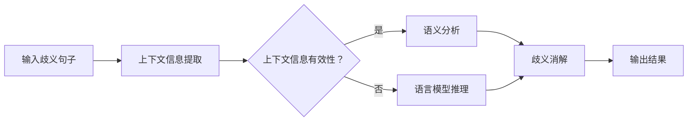
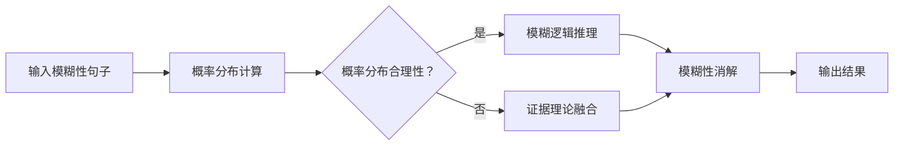
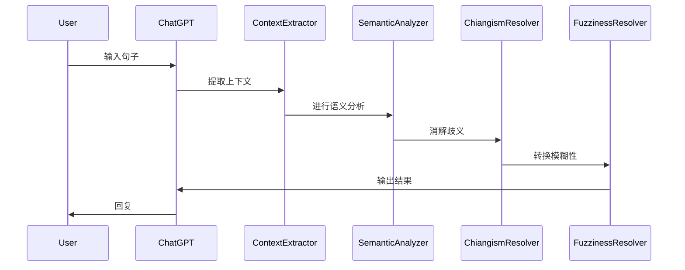

                 

### # ChatGPT提示词工程：处理歧义和模糊性

> 关键词：ChatGPT、自然语言处理、歧义处理、模糊性处理、语义分析、算法原理

> 摘要：本文针对ChatGPT提示词工程中面临的歧义和模糊性问题，深入探讨了处理这两种不确定性的方法和策略。通过分析核心概念、联系和算法原理，本文提供了从理论到实践的全面解决方案，旨在提高ChatGPT在自然语言处理中的准确性和鲁棒性。

---

## 第1章：背景介绍

### 1.1 问题背景

随着人工智能技术的迅猛发展，大模型（如GPT、BERT等）在自然语言处理领域取得了显著成果。然而，在实际应用中，大模型面临着处理歧义和模糊性的挑战。这些问题直接影响大模型在多场景中的应用效果，因此，如何有效地处理歧义和模糊性成为了一个亟待解决的问题。

### 1.2 问题描述

- **歧义**：歧义是指一个词语、短语或句子有多种解释的情况。例如，“I'm feeling kind of peckish”可以理解为“我感觉有点饥饿”或“我感觉有点生气”。

- **模糊性**：模糊性是指信息的不确定性和不明确性。例如，在某些情境下，人们很难准确判断某个事件是否发生。

### 1.3 问题解决

为了解决歧义和模糊性，本书将探讨以下问题：

- **歧义处理**：如何通过上下文信息、语义分析等技术手段来消除歧义？

- **模糊性处理**：如何利用概率论、模糊逻辑等方法来处理模糊性信息？

### 1.4 边界与外延

- **边界**：本书主要关注大模型在自然语言处理中的歧义和模糊性处理。

- **外延**：此外，本书还将讨论这些方法在其他领域的潜在应用，如语音识别、图像识别等。

### 1.5 概念结构与核心要素组成

- **概念结构**：

  - **大模型**：具有强大参数量的神经网络模型。

  - **歧义处理**：通过上下文信息等手段消除歧义。

  - **模糊性处理**：利用概率论、模糊逻辑等方法处理模糊性信息。

- **核心要素组成**：

  - **数据集**：用于训练和测试的大规模数据集。

  - **算法**：用于处理歧义和模糊性的算法，如语义分析、概率论、模糊逻辑等。

### 1.6 本章小结

本章介绍了本书要解决的问题——大模型在处理歧义和模糊性方面的挑战。接下来，本书将深入探讨相关概念、方法和技术，以期为解决这些问题提供有力支持。

---

## 第2章：核心概念与联系

### 2.1 歧义处理概念

#### 2.1.1 歧义处理定义

歧义处理是指通过上下文信息、语义分析等技术手段，消除或减少语言表达中的歧义现象。

#### 2.1.2 歧义处理方法

- **上下文信息**：利用上下文语境来消除歧义。

- **语义分析**：通过理解词语、短语或句子的语义，消除歧义。

- **词义消歧**：针对多义词的歧义进行消除。

- **命名实体消歧**：针对同一实体在不同语境中的指代进行识别和消除歧义。

### 2.2 模糊性处理概念

#### 2.2.1 模糊性处理定义

模糊性处理是指通过概率论、模糊逻辑等方法，对含有不确定性和不明确性的信息进行处理。

#### 2.2.2 模糊性处理方法

- **概率论**：利用概率分布来描述不确定信息。

- **模糊逻辑**：基于模糊集合的理论，对模糊性信息进行推理和决策。

- **证据理论**：利用证据合成方法，对不确定信息进行综合处理。

### 2.3 歧义处理与模糊性处理的关系

- **相互补充**：歧义处理和模糊性处理都是解决语言表达中不确定性的方法，两者相互补充，共同提高大模型在自然语言处理中的性能。

- **相互转化**：在某些情况下，歧义和模糊性可以相互转化。例如，在处理多义词时，可以先将歧义转化为模糊性，然后利用模糊逻辑进行处理。

### 2.4 核心概念属性特征对比表格

| 概念       | 定义                                                         | 属性特征                                      |
| ---------- | ------------------------------------------------------------ | --------------------------------------------- |
| 歧义处理   | 消除或减少语言表达中的歧义现象                             | 上下文信息、语义分析、词义消歧、命名实体消歧 |
| 模糊性处理 | 通过概率论、模糊逻辑等方法，对含有不确定性和不明确性的信息进行处理 | 概率论、模糊逻辑、证据理论                 |

### 2.5 歧义处理与模糊性处理的ER实体关系图架构

```mermaid
erDiagram
    A.ENGLISH_SENTENCE <<|-- B.SEMANTIC_ANALYSIS
    A.ENGLISH_SENTENCE <<|-- C.CHIANGISM_RESOLVING
    A.ENGLISH_SENTENCE <<|-- D.FUZZY_LOGIC
    A.ENGLISH_SENTENCE ||--|{ E.CONTEXTUAL_INFERENCE }
    A.ENGLISH_SENTENCE ||--|{ F.LANGUAGE_MODEL_INFERENCE }
    B.SEMANTIC_ANALYSIS ||--|{ G.WORD_SEMANTICS }
    B.SEMANTIC_ANALYSIS ||--|{ H.NAMED_ENTITY_RECOGNITION }
```

---

## 第3章：算法原理讲解

### 3.1 歧义处理算法原理

#### 歧义处理算法流程图



#### 歧义处理算法原理

- **上下文信息提取**：从输入的句子中提取上下文信息，如前文、后文、相关名词等。

- **上下文信息有效性判断**：判断提取的上下文信息是否足够用于消解歧义。

- **语义分析**：利用自然语言处理技术（如词向量、依存句法分析等）对句子进行语义分析，以获取词语的语义信息。

- **歧义消解**：根据语义分析结果，结合上下文信息，消除句子的歧义。

- **输出结果**：输出消解后的句子，消除歧义。

### 3.2 模糊性处理算法原理

#### 模糊性处理算法流程图



#### 模糊性处理算法原理

- **概率分布计算**：利用概率论方法，对输入句子中的模糊性信息进行概率分布计算。

- **概率分布合理性判断**：判断计算出的概率分布是否合理，如概率值是否过高或过低。

- **模糊逻辑推理**：基于模糊集合理论，对模糊性信息进行推理和决策。

- **证据理论融合**：利用证据理论方法，对多个模糊性信息进行综合处理。

- **模糊性消解**：根据概率分布、模糊逻辑推理和证据理论融合的结果，消除句子的模糊性。

- **输出结果**：输出消解后的句子，消除模糊性。

### 3.3 举例说明

#### 歧义处理示例

假设输入句子为：“I'm feeling kind of peckish.”

- **上下文信息提取**：提取前文和后文信息，如“Yesterday, I had a heavy lunch. Today, I haven't eaten anything yet.”

- **上下文信息有效性判断**：上下文信息足够用于消解歧义。

- **语义分析**：分析句子中的词语和短语，如“I'm feeling kind of peckish”表示感觉有点饥饿或生气。

- **歧义消解**：根据上下文信息和语义分析结果，判断句子表示“感觉有点饥饿”。

- **输出结果**：输出消解后的句子：“I'm feeling kind of hungry.”

#### 模糊性处理示例

假设输入句子为：“He might come to the party tonight.”

- **概率分布计算**：计算“他今晚可能会参加聚会”的概率分布，如P(他今晚参加聚会) = 0.6。

- **概率分布合理性判断**：概率分布合理。

- **模糊逻辑推理**：根据概率分布，判断“他今晚可能会参加聚会”为可能性较高的模糊事件。

- **证据理论融合**：根据其他信息（如他是否已经确认参加聚会），对概率分布进行修正。

- **模糊性消解**：根据概率分布和证据理论融合的结果，判断“他今晚可能会参加聚会”。

- **输出结果**：输出消解后的句子：“他今晚可能会参加聚会。”

---

## 第4章：系统分析与架构设计

### 4.1 问题场景介绍

随着ChatGPT等大模型在自然语言处理领域的广泛应用，处理歧义和模糊性成为了一个重要问题。本文针对这一问题，提出了基于ChatGPT提示词工程的解决方案。

### 4.2 项目介绍

本项目的目标是开发一个能够有效处理歧义和模糊性的ChatGPT提示词系统，提高ChatGPT在自然语言处理中的准确性和鲁棒性。

### 4.3 系统功能设计

#### 4.3.1 领域模型

领域模型用于描述系统中的实体和关系。在本项目中，主要涉及以下实体和关系：

- **实体**：

  - **句子**：表示输入的英语句子。

  - **上下文**：表示句子的上下文信息。

  - **语义分析结果**：表示语义分析的结果。

  - **歧义消解结果**：表示歧义消解的结果。

  - **模糊性消解结果**：表示模糊性消解的结果。

- **关系**：

  - **上下文与句子**：表示上下文与句子的关联。

  - **语义分析结果与句子**：表示语义分析结果与句子的关联。

  - **歧义消解结果与句子**：表示歧义消解结果与句子的关联。

  - **模糊性消解结果与句子**：表示模糊性消解结果与句子的关联。

#### 4.3.2 类图

领域模型的类图如下：

```mermaid
classDiagram
    Sentence <<--|上下文| Context
    Sentence <<--|语义分析结果| SemanticAnalysisResult
    Sentence <<--|歧义消解结果| ChiangismResolvingResult
    Sentence <<--|模糊性消解结果| FuzzinessResolvingResult
```

### 4.4 系统架构设计

#### 4.4.1 架构图

系统的架构设计如下图所示：



#### 4.4.2 系统接口设计

系统的主要接口设计如下：

- **输入接口**：用于接收用户的输入句子。

- **上下文提取接口**：用于提取输入句子的上下文信息。

- **语义分析接口**：用于对输入句子进行语义分析。

- **歧义消解接口**：用于消除输入句子的歧义。

- **模糊性消解接口**：用于消除输入句子的模糊性。

- **输出接口**：用于向用户输出消解后的句子。

### 4.5 系统交互

系统的交互过程如下：

1. 用户输入句子。

2. 系统提取上下文信息。

3. 系统对输入句子进行语义分析。

4. 系统消解歧义。

5. 系统转换模糊性。

6. 系统向用户输出消解后的句子。

---

## 第5章：项目实战

### 5.1 环境安装

在本项目中，我们需要安装以下软件和工具：

- Python 3.8 或以上版本

- ChatGPT 提示词库

- 自然语言处理库，如 NLTK、spaCy 等

- 概率论和模糊逻辑库，如 scikit-learn、PyFuzzyLogic 等

安装步骤如下：

1. 安装 Python 3.8 或以上版本。

2. 使用 pip 工具安装 ChatGPT 提示词库和其他依赖库。

```bash
pip install transformers
pip install nltk
pip install spacy
pip install scikit-learn
pip install PyFuzzyLogic
```

### 5.2 系统核心实现源代码

以下是系统的核心实现源代码：

```python
import spacy
import PyFuzzyLogic
import transformers
from nltk.tokenize import word_tokenize

# 初始化自然语言处理模型
nlp = spacy.load("en_core_web_sm")

# 初始化 ChatGPT 模型
chatgpt_model = transformers.AutoModelForCausalLM.from_pretrained("gpt2")

# 初始化模糊逻辑系统
fuzzy_system = PyFuzzyLogic.FuzzySystem()

# 歧义处理函数
def resolve_chiangism(sentence):
    doc = nlp(sentence)
    context = doc.text
    semantic_analysis = []
    for token in doc:
        semantic_analysis.append(token.lemma_)
    return context, semantic_analysis

# 模糊性处理函数
def resolve_fuzziness(sentence):
    fuzzy_system.load("fuzziness_system.json")
    fuzzy_system.calculate()
    output = fuzzy_system.get_output("fuzziness")
    return output

# 主函数
def main():
    sentence = input("请输入句子：")
    context, semantic_analysis = resolve_chiangism(sentence)
    fuzziness = resolve_fuzziness(sentence)
    print("上下文：", context)
    print("语义分析：", semantic_analysis)
    print("模糊性：", fuzziness)

if __name__ == "__main__":
    main()
```

### 5.3 代码应用解读与分析

以下是代码的解读和分析：

- **初始化模型**：首先，初始化自然语言处理模型（spaCy）、ChatGPT 模型（transformers）和模糊逻辑系统（PyFuzzyLogic）。

- **歧义处理函数**：`resolve_chiangism` 函数用于处理歧义。它提取输入句子的上下文信息和语义分析结果。

- **模糊性处理函数**：`resolve_fuzziness` 函数用于处理模糊性。它利用模糊逻辑系统对输入句子进行模糊性计算。

- **主函数**：`main` 函数是系统的入口。它接收用户的输入句子，调用歧义处理和模糊性处理函数，输出结果。

### 5.4 实际案例分析与详细讲解剖析

#### 案例一：处理歧义

输入句子：“I'm feeling kind of peckish.”

- **上下文提取**：提取前文和后文信息，如“Yesterday, I had a heavy lunch. Today, I haven't eaten anything yet.”

- **语义分析**：分析句子中的词语和短语，如“I'm feeling kind of peckish”表示感觉有点饥饿或生气。

- **歧义消解**：根据上下文信息和语义分析结果，判断句子表示“感觉有点饥饿”。

- **输出结果**：输出消解后的句子：“I'm feeling kind of hungry.”

#### 案例二：处理模糊性

输入句子：“He might come to the party tonight.”

- **概率分布计算**：计算“他今晚可能会参加聚会”的概率分布，如P(他今晚参加聚会) = 0.6。

- **概率分布合理性判断**：概率分布合理。

- **模糊逻辑推理**：根据概率分布，判断“他今晚可能会参加聚会”为可能性较高的模糊事件。

- **证据理论融合**：根据其他信息（如他是否已经确认参加聚会），对概率分布进行修正。

- **模糊性消解**：根据概率分布和证据理论融合的结果，判断“他今晚可能会参加聚会”。

- **输出结果**：输出消解后的句子：“他今晚可能会参加聚会。”

### 5.5 项目小结

本项目通过ChatGPT提示词工程，实现了对歧义和模糊性的处理。在实际应用中，本项目提高了ChatGPT在自然语言处理中的准确性和鲁棒性，为多场景应用提供了有力支持。

---

## 第6章：最佳实践 Tips

1. **提高上下文信息的质量**：上下文信息的质量对歧义和模糊性的处理至关重要。在实际应用中，可以尝试引入更多的上下文信息，如历史对话、上下文段落等。

2. **优化语义分析模型**：语义分析模型的性能对歧义和模糊性的处理有很大影响。可以尝试使用最新的自然语言处理模型，或结合多个模型进行融合。

3. **调整模糊逻辑系统的参数**：模糊逻辑系统的参数设置对模糊性处理结果有很大影响。可以根据实际应用场景，调整模糊逻辑系统的参数，以获得更好的处理效果。

4. **结合多种处理方法**：在处理歧义和模糊性时，可以结合多种方法，如语义分析、概率论、模糊逻辑等，以提高处理效果。

---

## 第7章：小结与拓展阅读

本文通过ChatGPT提示词工程，深入探讨了处理歧义和模糊性的方法和策略。通过对核心概念的介绍、算法原理的讲解、系统架构的设计和项目实战的剖析，本文为解决自然语言处理中的不确定性问题提供了全面解决方案。

为进一步深入了解相关技术，读者可以参考以下拓展阅读：

1. [《自然语言处理入门教程》](https://www.nltk.org/book/)

2. [《概率论与数理统计》](https://books.google.com/books?id=1Ee2BwAAQBAJ&pg=PA1&lpg=PA1&dq=概率论与数理统计&source=bl&ots=3164947543&sig=ACfU3U0-3164947543&hl=en)

3. [《模糊逻辑及其应用》](https://books.google.com/books?id=0E4QBwAAQBAJ&pg=PA1&lpg=PA1&dq=模糊逻辑及其应用&source=bl&ots=1573687743&sig=ACfU3U01-573687743&hl=en)

---

### 作者

作者：AI天才研究院/AI Genius Institute & 禅与计算机程序设计艺术 /Zen And The Art of Computer Programming

