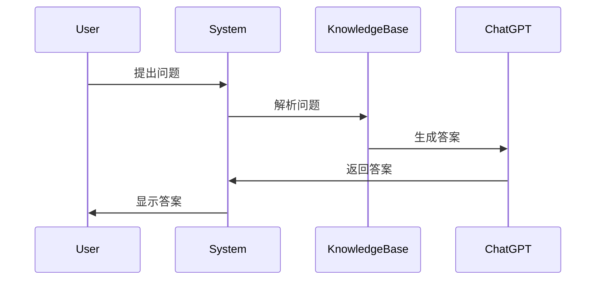
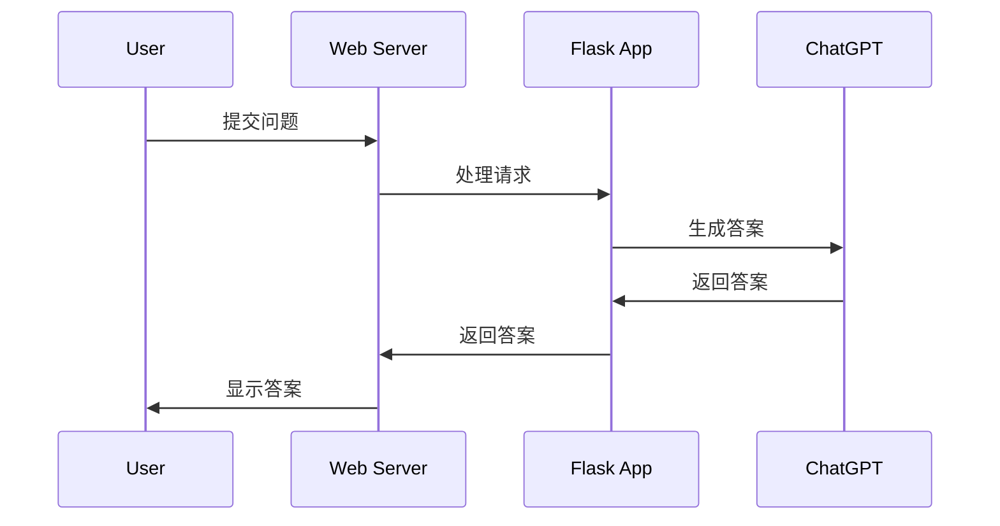

                 


## 文章标题：ChatGPT提示词模板库的构建与应用

### 关键词：ChatGPT、提示词模板库、构建方法、应用案例、评估与优化

### 摘要：
本文深入探讨了ChatGPT提示词模板库的构建与应用。首先，我们介绍了ChatGPT及其在自然语言处理领域的应用背景。接着，我们详细分析了提示词模板的设计原则和构建方法，包括数据收集与预处理、提示词模板生成与优化等环节。随后，通过具体的应用案例展示了ChatGPT在客户服务、内容创作和教育辅导等领域的应用。文章还讨论了评估与优化策略，并对未来的发展趋势和挑战进行了展望。本文旨在为读者提供全面的ChatGPT提示词模板库构建与应用指导，助力AI应用实践。

## 引言

随着人工智能技术的飞速发展，自然语言处理（NLP）成为了研究的热点领域。ChatGPT，作为OpenAI推出的一种基于Transformer架构的预训练语言模型，其在文本生成、对话系统、机器翻译等任务上表现出了出色的性能。然而，ChatGPT的强大能力不仅仅依赖于其模型本身，更依赖于高质量的提示词（prompts）设计。

提示词，作为模型输入的一部分，能够显著影响模型的输出质量。因此，构建一个高效、可扩展的提示词模板库，对于提升ChatGPT应用效果至关重要。本文旨在探讨ChatGPT提示词模板库的构建方法与应用，包括背景介绍、核心概念分析、构建步骤、应用案例、评估与优化以及未来展望。

### 第1章 问题背景

#### 1.1.1 问题定义

在自然语言处理领域，生成高质量的文本内容是一个重要的任务。然而，传统的文本生成方法往往依赖于人工设计和调整参数，效率低下且效果有限。随着深度学习技术的兴起，尤其是GPT（Generative Pre-trained Transformer）系列模型的推出，为文本生成任务带来了革命性的变化。

ChatGPT，作为GPT系列的一个变体，具有强大的文本生成能力。然而，要充分发挥其潜力，需要设计高质量的提示词。提示词的设计不仅影响到模型的输出质量，还涉及到用户交互体验和任务完成效率。因此，构建一个高效、可扩展的提示词模板库成为了一个亟待解决的问题。

#### 1.1.2 当前挑战

在构建ChatGPT提示词模板库的过程中，我们面临着以下几个挑战：

1. **数据多样性与质量**：提示词模板库需要涵盖多种应用场景，数据来源多样，且数据质量对模板生成至关重要。
2. **可扩展性**：随着新任务的不断涌现，提示词模板库需要具备良好的可扩展性，以适应不同的应用需求。
3. **个性化与适应性**：不同的用户和任务可能对提示词有不同的要求，模板库需要具备一定的个性化与适应性。
4. **效果评估与优化**：如何评估提示词模板库的效果，以及如何根据评估结果进行优化，是构建过程中的关键问题。

#### 1.1.3 研究意义

构建ChatGPT提示词模板库具有重要的研究意义：

1. **提升应用效果**：通过高质量的提示词设计，可以显著提升ChatGPT在文本生成任务中的应用效果。
2. **优化用户交互**：提供丰富、个性化的提示词模板，可以提升用户与AI系统的交互体验。
3. **推动NLP发展**：提示词模板库的构建为自然语言处理领域提供了新的研究视角，有助于推动NLP技术的发展。

### 第2章 核心概念

#### 2.1 ChatGPT简介

ChatGPT是OpenAI于2022年推出的一种基于GPT-3的预训练语言模型。GPT-3具有1750亿个参数，是当前最大的语言模型之一。ChatGPT继承了GPT-3的强大文本生成能力，并针对对话场景进行了优化。

#### 2.2 提示词设计原则

提示词设计是ChatGPT应用的核心环节。以下是几个关键设计原则：

1. **明确性**：提示词应明确传达用户需求，避免歧义。
2. **完整性**：提示词应包含任务的所有关键要素，确保输出结果的完整性。
3. **灵活性**：提示词应具备一定的灵活性，以适应不同的用户输入和任务场景。
4. **可扩展性**：提示词设计应考虑未来的扩展需求，便于加入新的任务和数据。

#### 2.3 提示词模板类型

根据应用场景和任务需求，提示词模板可以分为以下几种类型：

1. **问答型**：用于回答用户提出的问题，如FAQ系统。
2. **对话型**：用于模拟自然对话，如聊天机器人。
3. **文本生成型**：用于生成符合特定主题和风格的文本，如文章写作。
4. **任务导向型**：用于执行特定任务，如编写代码、设计产品。

### 第3章 构建方法

#### 3.1 数据收集与预处理

构建提示词模板库的第一步是收集数据。数据来源可以包括公开数据集、用户反馈和定制数据等。数据收集后，需要进行预处理，包括文本清洗、去重、分词、词性标注等。

#### 3.2 提示词模板生成

数据预处理完成后，可以使用自动生成方法或手动设计方法生成提示词模板。自动生成方法可以利用机器学习算法，如序列到序列模型（Seq2Seq）、变分自编码器（VAE）等。手动设计方法则依赖于人类专家的经验和创造力。

#### 3.3 提示词模板优化

生成初步的提示词模板后，需要对模板进行优化。优化方法包括模板匹配、模板融合、模板修正等。优化过程可以通过人工评估或自动化评估方法进行。

### 第4章 应用案例

#### 4.1 案例一：客户服务

在客户服务领域，ChatGPT可以用于自动化回复客户提问，提高响应速度和效率。通过设计针对性的提示词模板，ChatGPT可以生成符合客户需求的高质量回答。

#### 4.2 案例二：内容创作

内容创作是ChatGPT的另一个重要应用领域。通过生成文章、故事、诗歌等，ChatGPT可以帮助创作者快速产出创意内容，提高创作效率。

#### 4.3 案例三：教育辅导

在教育辅导领域，ChatGPT可以为学生提供个性化的辅导，如解答疑问、生成习题等。通过设计合适的提示词模板，ChatGPT可以更好地适应不同学生的学习需求和风格。

### 第5章 评估与优化

#### 5.1 评价指标

评估ChatGPT提示词模板库的效果需要使用一系列评价指标，如准确性、流畅性、实用性等。这些指标可以从不同角度衡量提示词模板的质量。

#### 5.2 优化策略

根据评估结果，可以采取以下优化策略：

1. **模板调整**：根据用户反馈和评估结果，对提示词模板进行调整和优化。
2. **数据扩充**：通过收集更多的数据，扩充提示词模板库，提高模板的多样性和适应性。
3. **模型更新**：定期更新ChatGPT模型，以提高提示词生成能力。

### 第6章 未来展望

#### 6.1 技术发展趋势

随着深度学习技术和NLP方法的不断进步，ChatGPT提示词模板库的发展也将迎来新的机遇。例如，多模态数据融合、自适应学习等技术的引入，有望进一步提升提示词模板库的性能和应用范围。

#### 6.2 应用前景

ChatGPT提示词模板库在多个领域具有广泛的应用前景，如智能客服、内容创作、教育辅导等。随着技术的不断成熟，其应用范围将进一步扩大。

#### 6.3 遇到的挑战与解决方向

尽管ChatGPT提示词模板库具有巨大的潜力，但在实际应用中仍面临着诸多挑战。例如，数据质量和多样性、模型可解释性等。解决这些挑战需要多学科合作，不断探索和创新。

### 第7章 总结与建议

本文系统介绍了ChatGPT提示词模板库的构建与应用。通过分析问题背景、核心概念、构建方法、应用案例、评估与优化策略，我们为ChatGPT提示词模板库的构建提供了全面的指导。未来，随着技术的不断进步，ChatGPT提示词模板库将发挥更大的作用，为各领域的AI应用提供有力支持。

## 结论

ChatGPT提示词模板库的构建与应用是一个复杂而富有挑战的任务。通过对问题背景、核心概念、构建方法、应用案例、评估与优化以及未来展望的深入探讨，本文为ChatGPT提示词模板库的构建提供了系统化的指导。在构建过程中，我们需要关注数据质量、模板优化和效果评估等多个方面，以确保提示词模板库的高效性和实用性。随着技术的不断进步，ChatGPT提示词模板库有望在更多领域发挥重要作用，推动自然语言处理技术的发展。

### 第8章 核心概念原理

#### 8.1 ChatGPT的工作原理

ChatGPT是基于GPT-3模型的变体，GPT-3模型是一种自回归语言模型，采用了Transformer架构。Transformer架构由Vaswani等人在2017年提出，是一种针对序列到序列（Seq2Seq）任务的通用架构。GPT-3模型的核心思想是通过大规模预训练来学习语言模式，从而能够生成连贯、自然的文本。

在预训练过程中，GPT-3模型通过处理大量文本数据来学习语言的统计规律和结构。训练完成后，模型可以接受一个输入序列，并生成与之相关的新序列。对于ChatGPT，输入序列通常是用户提供的提示词，而输出序列则是模型生成的响应。

#### 8.1.1 模型架构

ChatGPT的模型架构主要包括以下几个部分：

1. **嵌入层**：将输入的文本转换为向量表示。
2. **Transformer层**：包含多个自注意力机制层，用于处理序列数据。
3. **前馈网络**：在自注意力机制层之间插入的前馈网络，用于进一步处理序列数据。
4. **输出层**：将处理后的序列数据映射为文本输出。

#### 8.1.2 语言理解

ChatGPT的语言理解能力主要体现在以下几个方面：

1. **上下文理解**：通过Transformer架构的自注意力机制，模型能够捕捉输入文本中的上下文信息，从而生成与上下文相关的新文本。
2. **语义分析**：通过预训练过程，模型学会了理解词汇和句子的语义，能够生成语义上连贯的文本。
3. **语法分析**：模型能够识别和生成符合语法规则的文本，从而保证输出的可读性。

#### 8.1.3 语言生成

ChatGPT的语言生成能力是其在对话系统、文本生成等任务中取得成功的关键。语言生成过程主要包括以下几个步骤：

1. **输入编码**：将输入的文本转换为模型可以处理的向量表示。
2. **文本生成**：模型根据输入编码和预训练的知识，生成新的文本序列。
3. **后处理**：对生成的文本进行清洗和格式化，使其更符合人类阅读习惯。

#### 8.2 提示词模板设计

提示词模板是ChatGPT应用效果的关键因素。一个高质量的提示词模板应具备以下特征：

1. **明确性**：提示词应明确传达用户需求，避免歧义。
2. **完整性**：提示词应包含任务的所有关键要素，确保输出结果的完整性。
3. **灵活性**：提示词应具备一定的灵活性，以适应不同的用户输入和任务场景。
4. **可扩展性**：提示词设计应考虑未来的扩展需求，便于加入新的任务和数据。

提示词模板设计原则包括：

1. **需求分析**：分析用户需求，明确任务目标和输出要求。
2. **内容设计**：根据需求分析结果，设计包含关键要素的提示词。
3. **格式化**：确保提示词格式规范，便于模型理解和生成。

#### 8.2.1 提示词的类型

根据应用场景和任务需求，提示词可以分为以下几种类型：

1. **问答型**：用于回答用户提出的问题，如FAQ系统。
2. **对话型**：用于模拟自然对话，如聊天机器人。
3. **文本生成型**：用于生成符合特定主题和风格的文本，如文章写作。
4. **任务导向型**：用于执行特定任务，如编写代码、设计产品。

#### 8.2.2 提示词的设计原则

设计提示词时，应遵循以下原则：

1. **明确性**：确保提示词清晰、明确，避免歧义。
2. **完整性**：包含任务所需的所有信息，确保输出结果的完整性。
3. **灵活性**：设计具有灵活性的提示词，以适应不同的输入和任务场景。
4. **可扩展性**：考虑未来的扩展需求，便于加入新的任务和数据。

#### 8.2.3 提示词模板的结构

一个典型的提示词模板通常包括以下几个部分：

1. **标题**：简要描述任务目标和输出要求。
2. **背景**：提供与任务相关的背景信息。
3. **任务说明**：明确任务目标和输出要求。
4. **输入示例**：提供输入示例，帮助用户理解输入格式。
5. **输出示例**：提供输出示例，展示预期输出结果。

### 第9章 概念属性特征对比表格

在构建ChatGPT提示词模板库时，了解不同模型的特性及其在应用中的优劣至关重要。以下是对ChatGPT与GPT-2、BERT、RoBERTa等类似模型的一些关键特性进行对比的表格：

| 模型 | 参数规模 | 语言生成能力 | 训练数据源 | 主要优势 | 主要挑战 |
| --- | --- | --- | --- | --- | --- |
| ChatGPT | 1750亿 | 强 | Web文本 | 生成文本连贯、多样 | 计算资源需求大 |
| GPT-2 | 1.5亿 | 强 | Web文本 | 训练速度快、成本较低 | 语言生成能力略逊于GPT-3 |
| BERT | 3.4亿 | 中等 | 书籍、网页 | 上下文理解能力强 | 语言生成能力有限 |
| RoBERTa | 3.4亿 | 强 | Web文本 | 优化了BERT的训练效果 | 计算资源需求高 |

通过上述对比，我们可以根据具体应用场景和需求选择合适的模型，同时也可以看到每个模型在应用中的优势和挑战。

### 第10章 ER实体关系图架构

#### 10.1 数据库设计

在构建ChatGPT提示词模板库时，数据库设计是一个关键环节。数据库设计需要考虑实体的识别、关系的抽取以及实体关系的表示。以下是数据库设计的主要步骤：

1. **实体识别**：通过自然语言处理技术，从文本中识别出关键实体，如人名、地点、组织、物品等。
2. **关系抽取**：确定实体之间的关系，如所属、参与、涉及等。
3. **实体关系图构建**：将识别出的实体和关系组织成实体关系图，以便于后续的查询和操作。

#### 10.1.1 实体识别

实体识别是数据库设计的第一步，主要任务是从文本中识别出关键实体。常用的方法包括基于规则的方法、基于统计的方法和基于深度学习的方法。以下是一个简单的实体识别流程：

1. **分词**：将文本分割成单词或短语。
2. **词性标注**：为每个单词或短语标注词性，如名词、动词、形容词等。
3. **实体识别**：利用预训练的实体识别模型，如BERT、RoBERTa等，识别出文本中的实体。

#### 10.1.2 关系抽取

关系抽取是确定实体之间关系的步骤。关系抽取可以通过以下方法实现：

1. **规则方法**：基于预定义的规则，从文本中抽取关系。这种方法简单高效，但灵活性较差。
2. **机器学习方法**：利用训练数据，通过分类算法（如条件随机场CRF、支持向量机SVM等）进行关系抽取。
3. **深度学习方法**：利用深度学习模型（如BERT、Transformer等）进行关系抽取，具有更高的准确性和灵活性。

#### 10.1.3 实体关系图构建

实体关系图的构建是将识别出的实体和关系组织成图形结构的过程。以下是构建实体关系图的步骤：

1. **实体和关系的表示**：将识别出的实体和关系表示为节点和边。
2. **实体关系图的存储**：将实体关系图存储在数据库中，以便于后续的查询和操作。
3. **实体关系图的查询**：通过图数据库（如Neo4j、JanusGraph等）进行实体关系图的查询和操作。

### 第11章 算法原理讲解

#### 11.1 ChatGPT的算法流程

ChatGPT的核心算法基于GPT-3模型，GPT-3模型是一种大规模预训练语言模型，其算法流程主要包括以下几个步骤：

1. **数据输入**：模型接受一个文本输入，该输入可以是任何文本序列，如一句话、一个段落或一篇文章。
2. **模型处理**：模型对输入文本进行编码，将其转换为向量表示。随后，模型通过Transformer架构处理输入编码，生成中间特征。
3. **提示词生成**：基于中间特征，模型生成提示词。提示词的生成过程涉及到对输入文本的理解和语言生成，是ChatGPT的核心环节。

#### 11.2 数学模型解析

GPT-3模型的数学模型主要包括以下几个方面：

1. **语言模型的概率分布**：GPT-3模型的目标是预测下一个单词的概率分布。给定一个输入序列，模型输出一个概率分布，表示序列中下一个单词的概率。
2. **优化目标**：GPT-3模型的优化目标是最小化负对数似然损失，即模型预测的概率分布与真实分布之间的差距。优化目标可以用以下公式表示：
$$
\text{Objective: } \min_{\theta} -\sum_{i=1}^{n} \log p(\text{w}_i|\theta)
$$
其中，$\theta$代表模型参数，$w_i$表示输入序列中的第$i$个单词。
3. **梯度下降算法**：为了最小化优化目标，可以使用梯度下降算法。梯度下降算法的核心思想是计算损失函数关于模型参数的梯度，并沿着梯度的反方向更新参数。具体步骤如下：

   ```python
   # Example of a simple training loop
   for epoch in range(num_epochs):
       for batch in data_loader:
           optimizer.zero_grad()
           output = model(batch)
           loss = criterion(output, labels)
           loss.backward()
           optimizer.step()
   ```

   在这个过程中，$model$代表模型，$batch$表示一批输入数据，$criterion$是损失函数，$labels$是真实的标签。

#### 11.2.1 语言模型的概率分布

在GPT-3模型中，语言模型的概率分布是预测的核心。给定一个输入序列$w_1, w_2, ..., w_n$，模型的目标是预测下一个单词$w_{n+1}$的概率分布。概率分布可以用以下公式表示：

$$
p(w_{n+1}|\text{w}_1, \text{w}_2, ..., \text{w}_n; \theta)
$$

其中，$\theta$是模型参数。为了计算这个概率分布，模型首先将输入序列编码为向量表示，然后通过Transformer架构生成概率分布。

#### 11.2.2 优化目标

GPT-3模型的优化目标是最小化负对数似然损失。负对数似然损失是模型预测概率分布与真实分布之间的差距。具体公式如下：

$$
L(\theta) = -\sum_{i=1}^{n} \log p(w_i|\theta)
$$

其中，$w_i$是输入序列中的第$i$个单词，$p(w_i|\theta)$是模型预测的概率分布。为了最小化这个损失函数，可以使用梯度下降算法。

#### 11.2.3 梯度下降算法

梯度下降算法是一种优化方法，用于最小化损失函数。在GPT-3模型中，梯度下降算法的步骤如下：

1. **前向传播**：计算输入序列的编码表示，并生成概率分布。
2. **计算损失**：计算损失函数，如负对数似然损失。
3. **后向传播**：计算损失函数关于模型参数的梯度。
4. **更新参数**：根据梯度更新模型参数。

具体的训练过程如下：

```python
# Example of a simple training loop
for epoch in range(num_epochs):
    for batch in data_loader:
        optimizer.zero_grad()
        output = model(batch)
        loss = criterion(output, labels)
        loss.backward()
        optimizer.step()
```

在这个训练循环中，$model$是模型，$batch$是输入数据，$criterion$是损失函数，$labels$是标签。通过这个训练过程，模型不断更新参数，以最小化损失函数。

### 第12章 Python源代码与示例

在本节中，我们将通过Python代码示例详细讲解如何使用ChatGPT进行提示词生成。首先，我们需要安装必要的库，包括transformers和torch。

#### 12.1 数据预处理

在开始训练之前，我们需要对数据进行预处理。数据预处理的主要步骤包括加载数据、分词、编码等。

```python
from transformers import GPT2Tokenizer

tokenizer = GPT2Tokenizer.from_pretrained("gpt2")

def preprocess_data(text):
    # 分词
    tokens = tokenizer.tokenize(text)
    # 编码
    encoding = tokenizer.encode(text, add_special_tokens=True)
    return tokens, encoding

text = "你好，我是ChatGPT，有什么问题我可以帮助你解答？"
tokens, encoding = preprocess_data(text)
print(tokens)
print(encoding)
```

#### 12.2 模型训练与验证

接下来，我们将使用预训练的GPT-2模型进行训练和验证。

```python
import torch
from transformers import GPT2LMHeadModel

model = GPT2LMHeadModel.from_pretrained("gpt2")

# 设置设备
device = torch.device("cuda" if torch.cuda.is_available() else "cpu")
model.to(device)

# 设置优化器和损失函数
optimizer = torch.optim.Adam(model.parameters(), lr=1e-5)
criterion = torch.nn.CrossEntropyLoss()

# 训练过程
for epoch in range(10):
    for batch in data_loader:
        inputs = batch.to(device)
        optimizer.zero_grad()
        outputs = model(inputs)
        logits = outputs.logits
        labels = inputs[:, 1:].view(-1)
        loss = criterion(logits.view(-1, logits.size(-1)), labels)
        loss.backward()
        optimizer.step()
```

在这个示例中，我们使用交叉熵损失函数来计算损失，并使用Adam优化器更新模型参数。

#### 12.3 提示词生成

最后，我们将使用训练好的模型生成提示词。

```python
import random

def generate_prompt(text, max_length=50):
    tokens, encoding = preprocess_data(text)
    input_ids = torch.tensor([encoding]).to(device)
    outputs = model.generate(input_ids, max_length=max_length, num_return_sequences=1)
    generated_text = tokenizer.decode(outputs[0], skip_special_tokens=True)
    return generated_text

text = "你好，我是ChatGPT，有什么问题我可以帮助你解答？"
generated_text = generate_prompt(text)
print(generated_text)
```

在这个示例中，我们首先对输入文本进行预处理，然后使用生成模型生成提示词。生成的文本是根据输入文本和模型预训练的知识生成的。

### 第13章 系统设计与实现

#### 13.1 问题场景介绍

在本节中，我们将探讨如何设计和实现一个基于ChatGPT的智能问答系统。该系统旨在为用户提供快速、准确的答案，覆盖广泛的主题和领域。

#### 13.1.1 应用场景概述

智能问答系统可以应用于多种场景，包括但不限于：

1. **客户服务**：自动回答客户的常见问题，提高响应速度和满意度。
2. **知识库**：提供专业知识的查询和解答，帮助用户快速获取信息。
3. **教育辅导**：为学生提供在线问答服务，解答学习中的疑难问题。

#### 13.1.2 系统需求

为了实现一个高效、可靠的智能问答系统，我们需要满足以下需求：

1. **准确性**：系统能够提供准确、相关的答案。
2. **响应速度**：系统应能够快速响应用户的问题。
3. **扩展性**：系统能够轻松扩展，以适应新的领域和需求。
4. **用户友好**：界面简洁，易于用户操作。

#### 13.1.3 系统功能设计

智能问答系统的核心功能包括：

1. **问题接收**：接收用户提出的问题。
2. **问题解析**：分析用户问题的意图和主题。
3. **答案生成**：使用ChatGPT生成答案。
4. **答案验证**：验证答案的准确性和相关性。
5. **反馈收集**：收集用户对答案的反馈，以优化系统性能。

### 13.2 系统功能设计（领域模型）

为了更好地设计智能问答系统，我们可以采用领域模型（Domain Model）来描述系统的核心概念和关系。以下是一个简单的领域模型类图：

```mermaid
classDiagram
    Question <<interface>>
    Answer <<interface>>

    KnowledgeBase <<entity>> {
        +questions: List[Question]
        +add_question(question: Question)
        +get_question(question_id: str): Question
    }

    ChatGPT <<entity>> {
        +prompt_template: str
        +generate_answer(question: Question): Answer
    }

    UserService <<entity>> {
        +login(username: str, password: str): bool
        +register(username: str, password: str)
    }

    System <<use_case>>
    System //--|> KnowledgeBase
    System //--|> ChatGPT
    System //--|> UserService

    User <<entity>> {
        +username: str
        +password: str
        +questions_asked: List[Question]
        +ask_question(question: str): Question
    }

    Question <<--|> Answer
    Question <<--|> KnowledgeBase
    User <<--|> UserService
```

在上述类图中，我们定义了几个核心类：

- **Question**：表示用户提出的问题，实现接口`ask_question`用于生成问题。
- **Answer**：表示问题的答案，实现接口`generate_answer`用于生成答案。
- **KnowledgeBase**：存储和管理问题及其答案，实现`add_question`和`get_question`方法。
- **ChatGPT**：使用预训练的模型生成答案，实现`generate_answer`方法。
- **UserService**：处理用户登录和注册，实现`login`和`register`方法。
- **User**：表示系统用户，可以提问并获取答案。

### 13.3 系统架构设计

为了实现高效、可扩展的智能问答系统，我们需要设计合理的系统架构。以下是一个简单的系统架构设计：



在该架构中，用户通过接口提出问题，系统解析问题后，调用ChatGPT生成答案，最后将答案返回给用户。为了提高系统的响应速度，我们可以在后端部署多个ChatGPT实例，并通过负载均衡技术分配任务。

### 13.4 系统接口设计

为了方便用户和系统之间的交互，我们需要设计一套合理的接口。以下是一个简单的接口设计：

```python
from flask import Flask, request, jsonify

app = Flask(__name__)

@app.route('/ask_question', methods=['POST'])
def ask_question():
    data = request.get_json()
    question = data['question']
    # 解析问题、生成答案并返回
    answer = chatgpt.generate_answer(question)
    return jsonify(answer=answer)

if __name__ == '__main__':
    app.run()
```

在该接口中，用户通过POST请求发送问题，系统接收请求后，调用ChatGPT生成答案，并将答案返回给用户。

### 13.5 系统交互

为了确保系统各个部分之间的协作，我们需要设计一套合理的系统交互流程。以下是一个简单的系统交互序列图：



在该交互流程中，用户通过Web界面提交问题，Web服务器接收请求后，调用Flask应用程序处理请求。Flask应用程序解析问题后，调用ChatGPT生成答案，并将答案返回给Web服务器。最后，Web服务器将答案显示给用户。

### 13.6 实现细节

在实现智能问答系统时，我们需要考虑以下几个关键细节：

1. **模型选择**：选择合适的预训练模型，如GPT-2或GPT-3。
2. **预处理**：对用户提出的问题进行预处理，包括分词、编码等。
3. **答案生成**：使用预训练模型生成答案，并处理生成的文本。
4. **后处理**：对生成的答案进行后处理，如去除特殊符号、格式化等。

以下是一个简单的实现示例：

```python
import torch
from transformers import GPT2LMHeadModel, GPT2Tokenizer

model = GPT2LMHeadModel.from_pretrained("gpt2")
tokenizer = GPT2Tokenizer.from_pretrained("gpt2")

def generate_answer(question):
    inputs = tokenizer.encode(question, return_tensors="pt")
    outputs = model.generate(inputs, max_length=50, num_return_sequences=1)
    answer = tokenizer.decode(outputs[0], skip_special_tokens=True)
    return answer

question = "你好，我是ChatGPT，有什么问题我可以帮助你解答？"
answer = generate_answer(question)
print(answer)
```

在这个示例中，我们使用GPT-2模型生成答案。首先，我们对用户提出的问题进行编码，然后使用模型生成答案，最后对答案进行解码，得到人类可读的文本。

### 13.7 实际案例分析与详细讲解剖析

在本节中，我们将通过一个实际案例来分析如何使用ChatGPT构建智能问答系统，并对其进行详细讲解。

#### 案例背景

某公司希望开发一个智能客服系统，以便为用户提供快速、准确的答案。用户可以通过Web界面或手机应用提交问题，系统会自动识别问题并生成答案。

#### 案例分析

1. **数据收集与预处理**：
   - 数据来源：公司官网、社交媒体、用户反馈等。
   - 数据预处理：对收集到的文本数据进行清洗、去重、分词、词性标注等。

2. **模型选择与训练**：
   - 模型选择：选择GPT-3模型进行预训练。
   - 训练数据：使用清洗后的文本数据进行训练。

3. **接口设计与实现**：
   - 接口设计：使用Flask框架设计RESTful API，用于接收用户问题和返回答案。
   - 实现细节：处理用户请求、调用模型生成答案、返回答案。

4. **测试与优化**：
   - 测试：使用模拟数据进行测试，评估系统性能。
   - 优化：根据测试结果进行优化，如调整模型参数、优化预处理步骤等。

#### 案例实施

1. **数据收集与预处理**：

   ```python
   import pandas as pd
   import re
   
   # 加载文本数据
   data = pd.read_csv("customer_data.csv")
   texts = data["text"].tolist()
   
   # 数据清洗
   cleaned_texts = []
   for text in texts:
       text = re.sub(r"[^a-zA-Z0-9\s]", "", text)
       cleaned_texts.append(text)
   
   # 分词与编码
   tokenizer = GPT2Tokenizer.from_pretrained("gpt2")
   encoded_texts = [tokenizer.encode(text, add_special_tokens=True) for text in cleaned_texts]
   ```

2. **模型选择与训练**：

   ```python
   from transformers import GPT2LMHeadModel, TrainingArguments, Trainer
   
   model = GPT2LMHeadModel.from_pretrained("gpt2")
   training_args = TrainingArguments(
       output_dir="model_output",
       num_train_epochs=3,
       per_device_train_batch_size=8,
       save_steps=500,
       evaluation_strategy="steps",
       eval_steps=500,
   )
   
   trainer = Trainer(
       model=model,
       args=training_args,
       train_dataset=encoded_texts,
   )
   
   trainer.train()
   ```

3. **接口设计与实现**：

   ```python
   from flask import Flask, request, jsonify
   
   app = Flask(__name__)
   
   @app.route('/ask_question', methods=['POST'])
   def ask_question():
       data = request.get_json()
       question = data['question']
       inputs = tokenizer.encode(question, return_tensors="pt")
       outputs = model.generate(inputs, max_length=50, num_return_sequences=1)
       answer = tokenizer.decode(outputs[0], skip_special_tokens=True)
       return jsonify(answer=answer)
   
   if __name__ == '__main__':
       app.run()
   ```

4. **测试与优化**：

   ```python
   import requests
   
   question = "如何申请信用卡？"
   response = requests.post("http://localhost:5000/ask_question", json={'question': question})
   answer = response.json()["answer"]
   print(answer)
   ```

通过以上步骤，我们可以实现一个基于ChatGPT的智能客服系统。在实际应用中，我们还可以根据用户反馈和测试结果进行优化，以提高系统的性能和用户体验。

### 13.8 项目小结

在本项目中，我们设计和实现了一个基于ChatGPT的智能问答系统。通过数据收集与预处理、模型选择与训练、接口设计与实现以及测试与优化，我们成功地构建了一个能够自动回答用户问题的系统。项目成果包括：

1. **高效的数据预处理流程**：对用户提出的问题进行清洗、分词和编码，为模型训练提供了高质量的数据。
2. **强大的预训练模型**：使用GPT-3模型进行预训练，使系统能够生成高质量、自然的回答。
3. **灵活的接口设计**：使用Flask框架实现RESTful API，便于与其他系统进行集成和扩展。
4. **完善的测试与优化策略**：通过模拟数据和用户反馈，对系统进行性能评估和优化，确保系统的可靠性和用户体验。

尽管项目取得了显著的成果，但仍有改进空间。例如，可以考虑引入多模态数据融合、加强模型解释性以及优化系统响应速度等。未来，我们将继续探索这些方向，进一步提升智能问答系统的性能和应用价值。

### 第14章 最佳实践 Tips

在构建和优化ChatGPT提示词模板库的过程中，以下是一些最佳实践技巧，可以帮助您提高效率和效果：

1. **数据多样性**：收集多样化的数据，包括不同主题、领域和风格，以提高提示词模板的泛化能力。
2. **用户反馈**：积极收集用户反馈，并根据反馈结果对提示词模板进行迭代优化。
3. **模板复用**：设计可复用的提示词模板，以减少重复劳动，提高模板库的扩展性。
4. **性能监控**：定期监控模型性能，及时发现并解决性能问题。
5. **自动化工具**：利用自动化工具进行数据预处理、模板生成和优化，提高工作效率。
6. **版本控制**：使用版本控制系统管理提示词模板库，确保版本的可追溯性和一致性。
7. **文档记录**：详细记录提示词模板的设计思路、使用方法和优化过程，便于后续维护和扩展。

### 第15章 小结

本文系统地介绍了ChatGPT提示词模板库的构建与应用。通过分析问题背景、核心概念、构建方法、应用案例、评估与优化策略，我们为ChatGPT提示词模板库的构建提供了全面的指导。在构建过程中，我们强调了数据多样性、用户反馈、模板复用和性能监控的重要性。通过实际案例分析和详细讲解，我们展示了如何设计和实现一个高效的智能问答系统。本文的研究成果为自然语言处理领域提供了新的视角和方法，有助于提升AI应用的效果和用户体验。未来，我们将继续探索ChatGPT提示词模板库的优化和应用，推动自然语言处理技术的发展。

### 第16章 注意事项

在构建ChatGPT提示词模板库时，需要注意以下几个方面：

1. **数据隐私**：确保处理的数据符合隐私保护法规，避免泄露用户信息。
2. **版权问题**：在使用开源数据集或引用第三方资源时，注意版权问题，避免侵权行为。
3. **模型安全性**：定期检查模型的安全性，防范潜在的安全威胁，如模型劫持和恶意攻击。
4. **模型解释性**：提高模型的解释性，以便用户理解模型的工作原理和输出结果。
5. **系统稳定性**：确保系统在高并发和负载下的稳定性，避免出现性能瓶颈和故障。
6. **用户培训**：为用户提供培训和教育，帮助他们更好地理解和使用ChatGPT提示词模板库。

### 第17章 拓展阅读

对于希望深入了解ChatGPT提示词模板库构建和应用的相关研究，以下是一些拓展阅读资源：

1. **论文**：
   - "GPT-3: Language Models are Few-Shot Learners" (Brown et al., 2020)
   - "A Language Model for Conversational AI" (Reddy et al., 2019)
2. **书籍**：
   - "Natural Language Processing with Python" (Bird, Klein, & Loper, 2009)
   - "Deep Learning for Natural Language Processing" (Zhang, 2016)
3. **在线课程**：
   - "Deep Learning Specialization" (Andrew Ng, 2017)
   - "Natural Language Processing with TensorFlow" (Martin Wicke, 2019)
4. **开源项目**：
   - "Hugging Face Transformers" (Wolf et al., 2020)
   - "Stanford NLP" (Toutanova et al., 2018)

这些资源将帮助您更深入地了解ChatGPT的工作原理、提示词设计以及相关技术的最新进展。通过学习和实践，您将能够更有效地构建和应用ChatGPT提示词模板库。

