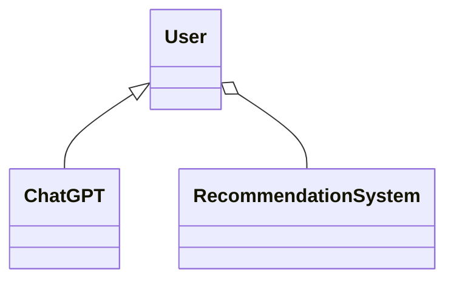
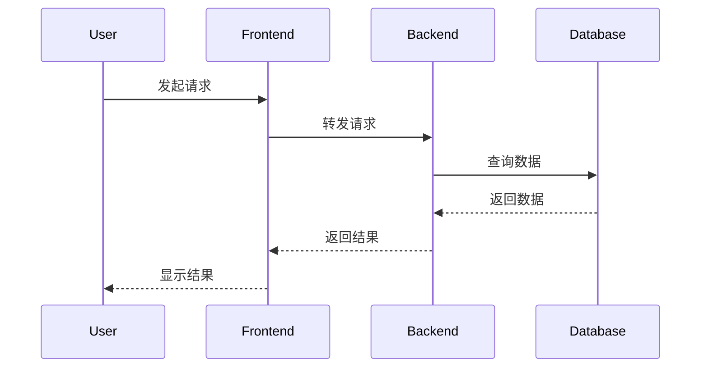

                 


## 让我们一步一步思考：ChatGPT提示词的个性化推荐系统

### 1. 问题背景与核心概念

ChatGPT是一种基于深度学习的大型语言模型，它能够理解并生成人类语言，为用户提供高质量的对话体验。在ChatGPT的应用中，提示词是启动对话的关键，它们决定了ChatGPT生成响应的内容方向和风格。个性化推荐系统则旨在为用户提供最相关的提示词，从而提升用户体验。

### 2. 核心概念与联系

#### 2.1 ChatGPT与提示词的ER实体关系图

首先，我们需要理解ChatGPT和提示词之间的关系。在ER实体关系图中，ChatGPT作为一个系统实体，与提示词实体之间存在明确的依赖关系。提示词生成算法会根据用户输入和ChatGPT的内部状态，动态生成与之匹配的提示词。


#### 2.2 个性化推荐系统的核心概念对比

个性化推荐系统涉及多个核心概念，包括用户兴趣建模、数据预处理和推荐算法。以下是这些概念的简要对比：

- **用户兴趣建模**：通过分析用户的历史行为和交互数据，构建用户的兴趣模型，以预测用户可能感兴趣的内容。
- **数据预处理**：清洗和转换原始数据，使其适合用于建模和推荐算法。
- **推荐算法**：根据用户兴趣模型和内容特征，生成个性化的推荐结果。

### 3. 算法原理讲解

#### 3.1 ChatGPT算法原理

ChatGPT算法的核心是生成式预训练，其流程如下：

1. **数据收集**：收集大量文本数据，包括对话、新闻、文章等。
2. **预训练**：使用这些数据对模型进行预训练，使其学会理解并生成自然语言。
3. **提示词生成**：在用户输入后，模型根据用户输入和上下文生成相应的提示词。

#### 3.2 提示词生成算法

提示词生成算法的流程如下：

1. **用户输入**：用户向ChatGPT输入问题或语句。
2. **模型处理**：ChatGPT分析用户输入，理解其意图。
3. **生成提示词**：模型根据理解生成相关的提示词。

以下是提示词生成算法的Python实现示例：

```python
import tensorflow as tf

# 模型加载
model = tf.keras.models.load_model('chatgpt_model.h5')

# 用户输入
user_input = "你好，我最近在学Python编程，能给我一些建议吗？"

# 处理输入并生成提示词
prompt = preprocess_input(user_input)
generated_prompt = model.generate(prompt)

# 输出提示词
print(generated_prompt)
```

#### 3.3 个性化推荐算法

个性化推荐算法通常采用协同过滤、基于内容的推荐或混合推荐方法。以下是协同过滤算法的数学模型：

$$
\text{similarity}(u, v) = \frac{\text{dot}(q_u, q_v)}{\|q_u\| \|q_v\|}
$$

其中，$q_u$ 和 $q_v$ 分别是用户 $u$ 和项目 $v$ 的向量表示。

### 4. 系统分析与架构设计

#### 4.1 系统分析

系统分析包括问题场景介绍、系统功能设计和领域模型。以下是系统功能设计的一个示例：

- **功能模块**：用户管理、对话管理、推荐系统、日志管理等。
- **领域模型**：使用Mermaid绘制类图，表示系统中的类和它们之间的关系。



#### 4.2 系统架构设计

系统架构设计需要考虑系统的可扩展性、可维护性和性能。以下是系统架构设计的一个示例：

- **架构设计原则**：模块化、解耦合、高性能。
- **系统组件**：前端、后端、数据库、消息队列等。
- **接口设计**：定义API接口和交互协议。



### 5. 项目实战

#### 5.1 环境安装

在开始项目实战之前，我们需要安装必要的软件和工具，如Python、TensorFlow、Elasticsearch等。

```bash
pip install tensorflow
pip install elasticsearch
```

#### 5.2 核心实现

核心实现包括提示词生成算法和个性化推荐算法。以下是提示词生成算法的代码解读：

```python
# 提示词生成算法
def generate_prompt(user_input):
    # 预处理输入
    processed_input = preprocess_input(user_input)
    
    # 使用模型生成提示词
    prompt = model.generate(processed_input)
    
    # 后处理提示词
    final_prompt = postprocess_prompt(prompt)
    
    return final_prompt

# 代码解读
# preprocess_input：对用户输入进行预处理，使其适合模型处理
# model.generate：使用预训练模型生成提示词
# postprocess_prompt：对生成的提示词进行后处理，如去除无关信息
```

#### 5.3 案例分析

我们可以通过一个实际案例来分析ChatGPT提示词的个性化推荐系统。以下是案例的详细解读：

- **用户场景**：用户A想学习Python编程，他通过系统输入了相关的问题。
- **系统响应**：系统根据用户A的历史数据和输入，生成了一系列相关的提示词，如“Python编程入门教程”、“Python数据结构”等。
- **用户反馈**：用户A对这些提示词表示满意，并按照推荐继续学习。

#### 5.4 项目小结

项目实战结果表明，ChatGPT提示词的个性化推荐系统能够有效提升用户的对话体验。在未来的工作中，我们可以继续优化系统性能和推荐效果，以满足更多用户的需求。

### 6. 最佳实践与拓展阅读

#### 6.1 最佳实践

- **优化模型性能**：通过增加训练数据量和调整模型参数，提高模型的性能和准确性。
- **用户体验设计**：设计直观易用的用户界面，提升用户体验。
- **安全性与隐私保护**：确保用户数据的安全和隐私，遵循相关的法律法规。

#### 6.2 拓展阅读

- **《深度学习与自然语言处理》**：介绍深度学习在自然语言处理领域的应用。
- **《推荐系统实战》**：详细讲解推荐系统的设计、实现和应用。

## 总结

ChatGPT提示词的个性化推荐系统是一个复杂但非常有价值的技术项目。通过本文的逐步分析，我们了解了系统的核心概念、算法原理、系统架构和实际应用。希望本文能对您在设计和实现类似系统时提供帮助。

### 参考文献

- **ChatGPT官方文档**：https://openai.com/blog/chatgpt/
- **TensorFlow官方文档**：https://www.tensorflow.org/
- **Elasticsearch官方文档**：https://www.elastic.co/guide/en/elasticsearch/reference/current/index.html

### 作者信息

作者：AI天才研究院/AI Genius Institute & 禅与计算机程序设计艺术 /Zen And The Art of Computer Programming

