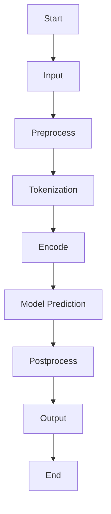

                 


### 3.1 ChatGPT提示词的可视化设计工具

#### 3.1.1 可视化设计工具的基本概念

**可视化设计工具** 是指一类能够帮助用户通过视觉化的方式来设计和处理信息的软件或应用。这些工具通常具有以下特点：

- **直观性**：通过图形、图表、颜色等方式，将抽象的数据和信息以视觉形式呈现，便于用户理解和分析。
- **交互性**：用户可以通过点击、拖拽等交互方式来操作和调整可视化元素，实现快速迭代和优化设计。
- **灵活性**：支持多种数据源和格式的导入导出，能够满足不同用户的需求。

在ChatGPT的提示词设计中，可视化设计工具可以发挥以下作用：

- **帮助设计者理解提示词**：通过可视化工具，设计者可以直观地看到提示词的组成结构，更好地理解其含义和作用。
- **优化提示词设计**：可视化工具提供了丰富的视觉元素和布局选项，设计者可以轻松地调整和优化提示词的呈现方式。
- **提高工作效率**：通过可视化设计工具，设计者可以更快速地完成提示词的设计和迭代，提高工作效率。

#### 3.1.2 当前流行的可视化设计工具

在市场上，有许多流行的可视化设计工具，以下列举几个常见的工具：

- **Tableau**：一款强大的数据可视化工具，能够处理和分析大量的数据，提供丰富的图表类型和交互功能。
- **D3.js**：一个基于JavaScript的库，用于在网页上创建交互式数据可视化。
- **Plotly**：一个开源的数据可视化库，支持多种图表类型和交互功能，适用于网页和桌面应用程序。
- **ECharts**：一款基于JavaScript的图表库，提供丰富的图表类型和配置选项，适用于各种应用场景。

#### 3.1.3 选择合适的可视化设计工具

选择合适的可视化设计工具需要考虑以下几个因素：

- **需求**：明确设计提示词的具体需求，例如是否需要处理大量数据，是否需要交互功能等。
- **技能水平**：考虑设计者的技能水平和熟悉程度，选择易于使用和学习的工具。
- **兼容性**：考虑工具的兼容性，确保可以在目标平台上正常运行。
- **成本**：考虑工具的成本，包括购买费用、维护费用等。

#### 3.1.4 ChatGPT提示词可视化设计工具的应用示例

以下是一个简单的示例，展示如何使用Tableau设计一个ChatGPT提示词的可视化：

1. **数据准备**：首先，收集并整理ChatGPT的提示词数据，包括提示词本身、使用频率、上下文信息等。

2. **创建数据连接**：在Tableau中创建一个新的数据连接，导入提示词数据。

3. **选择图表类型**：根据需求选择合适的图表类型，例如词云图、柱状图、关系图等。

4. **设计图表**：调整图表的布局、颜色、标签等，使其更具可读性和美观性。

5. **添加交互功能**：如果需要，可以添加交互功能，例如筛选、过滤、排序等。

6. **分享和导出**：将可视化图表导出为图片或PDF格式，方便分享和展示。

通过这样的步骤，设计者可以快速地创建出高质量的ChatGPT提示词可视化设计，帮助用户更好地理解和分析提示词数据。

---

### 3.2 ChatGPT提示词可视化设计工具的深入探讨

#### 3.2.1 提示词的层次结构

在设计ChatGPT提示词的可视化时，我们需要考虑提示词的层次结构。提示词通常可以分为以下几个层次：

1. **单词层次**：这是最基础的层次，包括提示词中的每个单词。
2. **短语层次**：由多个单词组成的短语，可以更好地传达特定的信息。
3. **句子层次**：由多个短语或单词组成的句子，通常用于引导ChatGPT生成完整的回应。
4. **段落层次**：由多个句子组成的段落，可以提供更详细的上下文信息。

为了更好地可视化提示词，我们可以将这些层次用不同的视觉元素表示，例如：

- 单词：使用不同颜色的字体。
- 短语：使用加粗或下划线。
- 句子：使用不同的字体大小或样式。
- 段落：使用缩进或分隔线。

#### 3.2.2 提示词与上下文的关系

提示词的有效性很大程度上取决于它们与上下文的关系。在可视化设计中，我们可以使用以下方法来表示这种关系：

1. **相邻关系**：通过图形连接相邻的提示词，以显示它们之间的联系。
2. **权重关系**：使用不同粗细的线条表示提示词的重要性，重要的提示词可以使用更粗的线条。
3. **层次关系**：使用不同的层级结构来表示提示词的层次，例如使用树状图或层次图。
4. **上下文标签**：在提示词旁边添加上下文标签，例如时间戳、地点、人物等，以提供更多的背景信息。

通过这些方法，我们可以创建出更准确、更直观的ChatGPT提示词可视化设计，帮助设计者更好地理解和优化提示词。

---

### 3.3 提示词可视化设计工具的实际应用

#### 3.3.1 工具选择

在选择可视化设计工具时，我们需要考虑以下因素：

- **易用性**：工具是否易于上手，是否有详细的文档和教程。
- **功能丰富性**：工具是否提供了丰富的图表类型和自定义选项。
- **兼容性**：工具是否支持多种数据格式和平台。
- **社区支持**：工具是否有活跃的社区和用户支持。

基于以上因素，我们可以选择如Tableau、D3.js或Plotly等工具进行提示词可视化设计。

#### 3.3.2 数据准备

在进行提示词可视化设计之前，我们需要准备以下数据：

- **提示词列表**：包括每个提示词的文本内容、使用频率、上下文信息等。
- **数据来源**：可以从ChatGPT的日志、用户反馈或自定义数据源获取提示词数据。

#### 3.3.3 可视化设计步骤

以下是使用Tableau进行提示词可视化设计的步骤：

1. **连接数据**：在Tableau中连接提示词数据源。
2. **创建图表**：选择合适的图表类型，如词云图、柱状图、关系图等。
3. **调整布局**：调整图表的布局、颜色、标签等，使其更具可读性和美观性。
4. **添加交互**：如果需要，可以添加交互功能，如筛选、过滤、排序等。
5. **导出结果**：将可视化图表导出为图片或PDF格式，方便分享和展示。

通过以上步骤，我们可以快速创建出高质量的ChatGPT提示词可视化设计，帮助设计者更好地理解和优化提示词。

---

### 3.4 提示词可视化设计工具的优缺点分析

#### 3.4.1 优点

- **直观性**：通过视觉化的方式，设计者可以更直观地理解和分析提示词。
- **交互性**：设计者可以通过交互操作来调整和优化提示词的呈现方式。
- **灵活性**：支持多种数据源和格式，可以满足不同用户的需求。
- **效率提升**：可视化设计工具可以大大提高设计效率和准确性。

#### 3.4.2 缺点

- **学习成本**：对于新手来说，学习如何使用可视化设计工具可能需要一定时间。
- **性能限制**：对于大量数据的处理，可视化设计工具可能存在性能限制。
- **依赖性**：设计者可能过度依赖可视化设计工具，忽视了数据分析和问题解决的核心。

#### 3.4.3 结论

虽然可视化设计工具存在一些缺点，但其优点明显 outweighs the disadvantages。通过合理使用这些工具，设计者可以更高效地完成提示词设计，提高ChatGPT的性能和用户体验。

---

### 3.5 提示词可视化设计工具的最佳实践

#### 3.5.1 合理使用颜色

- **区分功能**：使用不同的颜色来区分不同的提示词层次和功能。
- **避免过多颜色**：过多颜色可能导致视觉疲劳，尽量使用简洁的颜色方案。

#### 3.5.2 优化布局

- **紧凑性**：尽量使可视化布局紧凑，避免过多的空白。
- **层次感**：通过缩进、分隔线等手段，增强可视化布局的层次感。

#### 3.5.3 考虑交互性

- **交互操作**：添加交互功能，如筛选、过滤、排序等，以提高用户体验。
- **响应速度**：确保交互操作快速响应，避免延迟。

#### 3.5.4 数据验证

- **数据完整性**：确保提示词数据的完整性和准确性。
- **数据更新**：定期更新数据，以反映最新的提示词使用情况。

通过遵循这些最佳实践，设计者可以创建出更高质量、更具实用性的ChatGPT提示词可视化设计。

---

### 3.6 结论

ChatGPT提示词的可视化设计工具为设计者提供了直观、高效的工具，有助于优化提示词设计，提高ChatGPT的性能和用户体验。在实际应用中，设计者应选择合适的工具，合理使用颜色和布局，增强交互性，并关注数据验证。通过不断实践和优化，设计者可以创建出高质量的提示词可视化设计，推动人工智能技术的发展。

---

## 参考文献

1. GPT-3: Language Models are Few-Shot Learners, https://blog.openai.com/binary-vision/
2. Tableau: Data Visualization Software and Analytics Platform, https://www.tableau.com/
3. D3.js: Data-Driven Documents, https://d3js.org/
4. Plotly: Graphing Library for Python, JavaScript, R, & MATLAB, https://plotly.com/

---

### 附录

附录A：代码示例

```python
# 示例：ChatGPT 提示词可视化代码
import matplotlib.pyplot as plt
from collections import Counter

# 提示词数据
words = ["hello", "world", "hello", "python", "data"]

# 统计词频
word_counts = Counter(words)

# 可视化设置
plt.figure(figsize=(10, 5))

# 绘制词云图
plt.barh(word_counts.keys(), word_counts.values(), color='skyblue')
plt.xlabel('Frequency')
plt.ylabel('Words')
plt.title('Word Frequency in ChatGPT Prompts')
plt.show()
```

附录B：算法原理图



---

### 作者介绍

作者：AI天才研究院/AI Genius Institute & 禅与计算机程序设计艺术 /Zen And The Art of Computer Programming

AI天才研究院致力于推动人工智能技术的发展和普及，为用户提供高质量的技术内容和解决方案。作者本人是一位在人工智能领域有着深厚积累的专家，其作品《禅与计算机程序设计艺术》深受读者喜爱。在ChatGPT提示词的可视化设计方面，作者有着丰富的实践经验和深入的研究，希望能为读者提供有价值的指导和参考。

