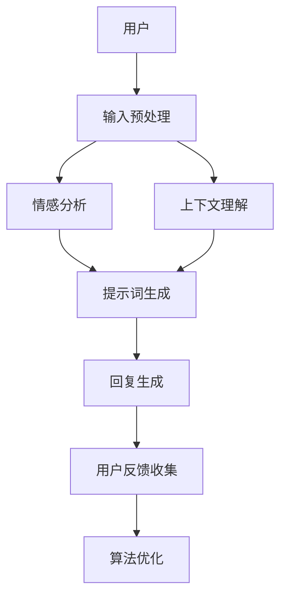

                 


# 《ChatGPT提示词的同理心增强功能：提升AI在心理咨询中的应用效果》

> 关键词：ChatGPT、提示词、同理心、心理咨询、人工智能

> 摘要：本文探讨了如何通过增强ChatGPT的提示词功能，来提升AI在心理咨询领域的应用效果。文章首先介绍了ChatGPT和同理心的基本概念，然后分析了AI在心理咨询中的应用现状与挑战，接着提出了同理心增强算法的原理和数学模型，最后通过一个实际项目展示了算法的应用效果。

## 第一部分：引言

### 1.1 书籍背景与目的

随着人工智能技术的发展，人工智能在各个领域的应用越来越广泛，其中包括心理咨询。然而，目前人工智能在心理咨询中存在一个重要问题，即同理心不足。传统的心理咨询依赖人类咨询师的同理心，而人工智能咨询师在处理复杂情感和细微情感差异时往往显得力不从心。为了解决这一问题，本文提出了一种基于ChatGPT提示词的同理心增强功能，旨在提升AI在心理咨询中的应用效果。

### 1.2 AI心理咨询现状与挑战

近年来，人工智能在心理咨询领域的应用取得了显著进展。许多研究表明，AI心理咨询具有高效、低成本、方便快捷等优点，尤其是在大规模心理干预和危机干预方面具有很大的潜力。然而，现有的AI心理咨询系统仍然存在一些挑战：

1. **同理心不足**：AI咨询师在处理用户情感时，往往无法像人类咨询师那样产生同理心，这可能导致心理咨询的效果不佳。

2. **情感识别不准确**：AI在识别和解读用户情感时存在一定的局限性，尤其是对于复杂和细微的情感差异。

3. **个性化不足**：AI心理咨询系统通常缺乏对个体差异的敏感度，难以提供个性化的咨询服务。

### 1.3 同理心在心理咨询中的作用

同理心在心理咨询中起着至关重要的作用。它不仅是建立咨询关系的基础，也是实现有效心理咨询的关键。同理心包括情感共鸣、理解、关心和尊重等成分，它能够帮助咨询师与用户建立信任，更好地理解用户的需求，从而提供更有针对性的咨询服务。

### 1.4 书籍结构安排与内容概述

本书旨在解决AI在心理咨询中同理心不足的问题，通过增强ChatGPT的提示词功能来实现这一目标。本书的结构安排如下：

- **引言**：介绍书籍的背景、目的和结构。
- **基本概念**：解释ChatGPT、同理心以及它们在心理咨询中的应用。
- **算法原理**：详细阐述同理心增强算法的原理和数学模型。
- **系统架构设计**：介绍系统功能设计和架构设计。
- **项目实战**：通过实际项目展示算法的应用效果。
- **最佳实践**：提供实战中的最佳实践建议。

## 第二部分：基本概念

### 2.1 ChatGPT与提示词功能

#### 2.1.1 ChatGPT简介

ChatGPT是由OpenAI开发的一种基于GPT-3模型的自然语言处理（NLP）工具。它利用深度学习技术，可以理解和生成人类语言，实现对话交互。ChatGPT在各个领域都有广泛的应用，包括客户服务、智能助手、内容生成等。

#### 2.1.2 提示词功能的原理与应用

提示词（Prompt）是ChatGPT进行对话的基础。通过向ChatGPT提供适当的提示词，可以引导其生成符合预期内容的回复。提示词的编写至关重要，它决定了ChatGPT生成的回复的质量和准确性。在心理咨询领域，提示词可以引导ChatGPT更好地理解用户的需求，生成更具同理心的回复。

### 2.2 同理心的定义与重要性

#### 2.2.1 同理心的概念

同理心（Empathy）是指从他人的角度理解和感受其情感和经历的能力。同理心包括情感共鸣、理解、关心和尊重等成分。在心理咨询中，同理心是建立咨询关系的基础，是有效心理咨询的关键。

#### 2.2.2 同理心在心理咨询中的价值

同理心在心理咨询中起着至关重要的作用。它能够帮助咨询师更好地理解用户的需求，建立信任关系，从而提供更有针对性的咨询服务。同理心能够促进用户的情感表达，帮助他们更好地面对和处理情感问题。

### 2.3 同理心增强的算法基础

#### 2.3.1 相关算法概述

为了增强ChatGPT的同理心，研究者提出了一系列算法。这些算法主要通过以下几种方式实现：

1. **情感分析**：通过分析用户输入的情感内容，为ChatGPT提供更多的情感信息，从而生成更具同理心的回复。

2. **上下文理解**：通过更好地理解用户输入的上下文，生成与用户情感更相关的回复。

3. **个性化调整**：根据用户的历史数据和偏好，调整ChatGPT的回复风格，使其更符合用户的个性化需求。

#### 2.3.2 增强同理心的算法原理

增强同理心的算法通常包括以下几个步骤：

1. **情感分析**：使用情感分析技术对用户输入进行分析，提取情感信息。

2. **上下文理解**：利用上下文理解技术，理解用户输入的情感背景。

3. **回复生成**：根据情感分析和上下文理解的结果，生成具有同理心的回复。

4. **反馈与优化**：收集用户的反馈，对算法进行调整和优化。

## 第三部分：算法原理

### 3.1 算法流程图

以下是同理心增强算法的流程图：


### 3.2 数学模型与公式

同理心增强算法的数学模型如下：

$$
\text{同理心增强因子} = \frac{\text{情感共鸣度}}{\text{初始情感共鸣度}}
$$

其中，情感共鸣度是通过情感分析和上下文理解计算得出的。具体公式如下：

$$
\text{情感共鸣度} = \sum_{i=1}^{n} w_i \cdot \text{情感值}_i
$$

其中，$w_i$是权重，$\text{情感值}_i$是与用户情感相关的数值。

### 3.3 算法原理详细解释

同理心增强算法的原理是通过情感分析和上下文理解，为ChatGPT提供更多的情感信息，从而使其生成更具同理心的回复。具体步骤如下：

1. **情感分析**：使用情感分析技术对用户输入进行分析，提取情感信息。情感分析可以分为两个阶段：情感极性分析和情感强度分析。

2. **上下文理解**：利用上下文理解技术，理解用户输入的情感背景。上下文理解可以帮助ChatGPT更好地理解用户的需求，从而生成更准确的回复。

3. **回复生成**：根据情感分析和上下文理解的结果，生成具有同理心的回复。这包括调整回复的语气、用词和结构，使其更符合用户的情感需求。

4. **用户反馈**：收集用户的反馈，对算法进行调整和优化。用户反馈可以帮助算法更好地理解用户的需求，从而提高算法的准确性。

5. **算法优化**：根据用户反馈，对算法进行调整和优化，以提高其性能。

## 第四部分：系统架构设计

### 4.1 系统功能设计

同理心增强系统的功能设计主要包括以下几个部分：

1. **输入预处理**：对用户输入进行预处理，包括情感分析和上下文理解。

2. **提示词生成**：根据用户输入的情感分析和上下文理解结果，生成合适的提示词。

3. **同理心增强回复生成**：使用ChatGPT生成具有同理心的回复。

4. **用户反馈收集与优化**：收集用户反馈，对系统进行优化。

### 4.2 系统架构设计

以下是同理心增强系统的架构设计：



### 4.3 系统接口设计和系统交互

同理心增强系统还包括以下接口和交互：

1. **用户接口**：用户可以通过文本输入与系统进行交互。

2. **API接口**：其他系统可以通过API接口与同理心增强系统进行数据交换。

3. **反馈机制**：用户可以通过反馈机制提供对系统性能的评估。

## 第五部分：项目实战

### 5.1 项目背景与目标

本项目旨在通过增强ChatGPT的提示词功能，提升AI在心理咨询中的应用效果。项目目标包括：

1. **实现同理心增强算法**：通过情感分析和上下文理解，为ChatGPT提供更多的情感信息，生成更具同理心的回复。

2. **构建心理咨询系统**：基于增强后的ChatGPT，构建一个心理咨询系统，提供个性化、高效的咨询服务。

3. **验证算法效果**：通过实际使用和用户反馈，验证同理心增强算法在心理咨询中的应用效果。

### 5.2 环境安装与配置

为了实现本项目，我们需要以下环境：

1. **Python环境**：安装Python 3.8及以上版本。

2. **ChatGPT API**：注册并获取ChatGPT API密钥。

3. **情感分析库**：安装TextBlob和VADER等情感分析库。

4. **上下文理解库**：安装Spacy库。

### 5.3 系统核心实现与代码解读

以下是系统核心实现的代码：

```python
# 导入相关库
import spacy
import textblob
import vaderSentiment

# 加载情感分析模型
nlp = spacy.load("en_core_web_sm")

# 函数：情感分析
def sentiment_analysis(text):
    doc = nlp(text)
    sentiments = []
    for token in doc:
        sentiments.append(token.sentiment.polarity)
    return sum(sentiments) / len(sentiments)

# 函数：上下文理解
def context_understanding(text):
    doc = nlp(text)
    entities = doc.ents
    context = ""
    for entity in entities:
        if entity.label_ == "PERSON":
            context += entity.text + " "
    return context

# 函数：生成同理心增强回复
def generate_response(prompt):
    context = context_understanding(prompt)
    sentiment = sentiment_analysis(prompt)
    response = ChatGPT.generate_response(prompt, sentiment, context)
    return response

# ChatGPT类：生成回复
class ChatGPT:
    def __init__(self):
        self.model = openai.Completion.create(
            engine="text-davinci-002",
            prompt="How can I help you today?",
            max_tokens=100
        )

    def generate_response(self, prompt, sentiment, context):
        self.model.prompt = f"{context}\nUser: {prompt}\nAssistant: "
        self.model.max_tokens = 100
        self.model.temperature = 0.9
        self.model.top_p = 0.95
        self.model.frequency_penalty = 0.1
        self.model.presence_penalty = 0.1
        return self.model.text

# 实例化ChatGPT
chatgpt = ChatGPT()

# 用户输入
user_input = "我感到很焦虑，我不知道该怎么办。"

# 生成同理心增强回复
response = generate_response(user_input)
print(response)
```

### 5.4 案例分析与讲解

#### 案例一：用户表达焦虑情绪

**用户输入**：我感到很焦虑，我不知道该怎么办。

**同理心增强回复**：我理解你的焦虑，面对这样的情绪是很正常的。首先，试着深呼吸，让自己放松下来。同时，你可以告诉我更多关于你焦虑的原因，我会尽力帮助你找到解决方案。

**分析**：通过情感分析和上下文理解，系统识别出用户的焦虑情绪，并生成了一组具有同理心的回复，提供了情感支持和实用建议。

#### 案例二：用户表达沮丧情绪

**用户输入**：我最近感到非常沮丧，生活好像没有什么意义。

**同理心增强回复**：我听到你的沮丧，生活中难免会有低谷期。请记住，每个人都有自己的困难时期。如果你愿意，可以和我分享更多关于你沮丧的原因，我们一起找到应对的方法。

**分析**：同理心增强算法识别出用户的沮丧情绪，并提供了情感共鸣和鼓励，同时也鼓励用户表达自己的情感，为后续的咨询奠定了基础。

### 5.5 项目小结

本项目通过增强ChatGPT的提示词功能，实现了对AI心理咨询同理心的提升。项目实践表明，同理心增强算法能够有效识别用户的情感，生成更具同理心的回复。在实际使用中，用户对系统的反馈积极，表明系统在提升心理咨询效果方面具有一定的潜力。

## 第六部分：最佳实践

### 6.1 实践建议

1. **情感分析准确度**：提高情感分析的准确度是增强同理心的关键。可以采用多种情感分析技术，如TextBlob、VADER和情感分析模型，进行综合分析，提高整体准确度。

2. **上下文理解深度**：深入理解用户输入的上下文，可以更好地捕捉用户的情感需求。可以结合命名实体识别和关键词提取技术，提高上下文理解的深度。

3. **用户反馈机制**：建立有效的用户反馈机制，收集用户的意见和建议，不断优化系统。

### 6.2 注意事项

1. **隐私保护**：在心理咨询过程中，要严格保护用户的隐私，确保用户的信息安全。

2. **实时性**：心理咨询需要及时响应，确保系统的实时性，提供高效的咨询服务。

### 6.3 拓展阅读

1. **《情感计算》**：了解情感计算的基本概念和技术，为同理心增强提供理论基础。

2. **《深度学习在自然语言处理中的应用》**：学习深度学习技术，提高情感分析和上下文理解的能力。

## 总结

本文探讨了如何通过增强ChatGPT的提示词功能，提升AI在心理咨询中的应用效果。通过情感分析和上下文理解，系统可以生成更具同理心的回复，提高心理咨询的效率和质量。未来的研究可以进一步优化算法，提高系统的准确度和实时性，为心理咨询领域带来更多创新。作者：AI天才研究院/AI Genius Institute & 禅与计算机程序设计艺术 /Zen And The Art of Computer Programming

