                 

### ChatGPT提示词的安全性与隐私保护

> 关键词：ChatGPT、安全性、隐私保护、加密、访问控制、匿名化、差分隐私、同态加密

> 摘要：本文将深入探讨ChatGPT等大语言模型在数据安全性与隐私保护方面所面临的挑战，分析相关核心概念与技术，并提出相应的解决方案。

### Step 1: 引入背景

#### 1.1 问题背景

随着人工智能技术的发展，大语言模型如ChatGPT在自然语言处理、智能客服、信息检索等领域得到了广泛应用。这些模型通过海量数据训练，能够生成高质量的自然语言文本，为用户提供便捷的服务。然而，大语言模型在提供便利的同时，也带来了数据安全性和隐私保护的问题。本章节将介绍大语言模型在安全性和隐私保护方面面临的主要挑战。

#### 1.1.1 问题定义

- **数据安全性**：确保数据在传输、存储和处理过程中不被未授权访问、篡改或泄露。
- **隐私保护**：保护用户的个人信息不被未经授权的收集、使用或泄露。

#### 1.1.2 问题解决

解决数据安全性和隐私保护问题需要从技术和管理两方面入手，包括数据加密、访问控制、隐私保护算法等。

#### 1.1.3 边界与外延

本章节主要关注ChatGPT等大语言模型在数据安全性和隐私保护方面的挑战，但不涉及其他人工智能技术或场景。

#### 1.1.4 概念结构与核心要素组成

- **数据安全性**：加密、访问控制、审计等。
- **隐私保护**：数据匿名化、差分隐私、同态加密等。

#### 1.2 核心概念与联系

##### 1.2.1 数据加密

数据加密是将数据转换为密文的过程，以确保数据在传输和存储过程中不被未授权访问。数据加密的核心概念包括加密算法、密钥管理和加密算法的安全性。

- **加密算法**：加密算法是数据加密的核心。常见的加密算法包括对称加密（如AES、DES）和非对称加密（如RSA、ECC）。

  **Mermaid加密算法流程图：**
  ```mermaid
  graph TD
  A[对称加密] --> B[AES]
  A --> C[DES]
  D[非对称加密] --> E[RSA]
  D --> F[ECC]
  ```

- **密钥管理**：密钥管理是加密安全性的关键。密钥生成、存储、分发和更新都需要严格管理。

  **Mermaid密钥管理流程图：**
  ```mermaid
  graph TD
  A[密钥生成] --> B[密钥存储]
  B --> C[密钥分发]
  C --> D[密钥更新]
  ```

- **加密算法的安全性**：加密算法的安全性取决于算法本身和密钥的强度。常见的安全评估指标包括加密算法的强度、抗攻击能力和加密效率。

  **Mermaid加密算法安全性评估表格：**
  ```mermaid
  graph TD
  A[加密算法强度]
  B[抗攻击能力]
  C[加密效率]
  A --> B
  B --> C
  ```

##### 1.2.2 访问控制

访问控制是一种机制，用于确保只有授权用户才能访问受保护的数据或系统资源。访问控制通常基于用户身份验证和权限管理。

- **用户身份验证**：用户身份验证是访问控制的基础。常见的身份验证方法包括密码、指纹、生物识别等。

  **Mermaid用户身份验证流程图：**
  ```mermaid
  graph TD
  A[用户登录] --> B[身份验证]
  B --> C[认证成功]
  C --> D[访问授权]
  ```

- **权限管理**：权限管理确保用户只能访问其权限范围内的资源。常见的权限管理方法包括基于角色的访问控制（RBAC）和基于属性的访问控制（ABAC）。

  **Mermaid权限管理流程图：**
  ```mermaid
  graph TD
  A[用户角色] --> B[权限分配]
  B --> C[权限验证]
  C --> D[资源访问]
  ```

##### 1.2.3 隐私保护算法

隐私保护算法旨在确保数据在共享和使用过程中不被泄露或篡改。常见的隐私保护算法包括数据匿名化、差分隐私和同态加密。

- **数据匿名化**：数据匿名化是将数据中能识别个人身份的信息进行替换或删除，以保护个人隐私。常见的数据匿名化方法包括k-匿名和l-diversity。

  **Mermaid数据匿名化流程图：**
  ```mermaid
  graph TD
  A[原始数据] --> B[数据匿名化]
  B --> C[匿名数据]
  ```

- **差分隐私**：差分隐私是一种保障隐私的保护机制，通过添加噪声来降低数据泄露的风险。常见的差分隐私方法包括ε-differential privacy。

  **Mermaid差分隐私流程图：**
  ```mermaid
  graph TD
  A[原始数据] --> B[添加噪声]
  B --> C[差分隐私数据]
  ```

- **同态加密**：同态加密是一种在加密数据上进行计算的方法，确保数据在传输和存储过程中不被泄露。常见的同态加密方法包括全同态加密和部分同态加密。

  **Mermaid同态加密流程图：**
  ```mermaid
  graph TD
  A[明文数据] --> B[加密]
  B --> C[计算]
  C --> D[解密]
  ```

### Step 2: 设计核心概念与联系部分

#### 1.3 主流安全性与隐私保护技术

在解决ChatGPT等大语言模型的安全性问题和隐私保护问题时，我们可以采用多种主流技术。以下介绍几种主要的安全性与隐私保护技术。

##### 1.3.1 数据加密技术

数据加密技术是保障数据安全性的基石。根据加密方式的不同，数据加密技术主要分为对称加密和非对称加密。

- **对称加密**：对称加密算法使用相同的密钥进行加密和解密。常见的对称加密算法包括AES和DES。

  **Mermaid对称加密流程图：**
  ```mermaid
  graph TD
  A[明文数据] --> B[加密算法]
  B --> C[密文数据]
  C --> D[解密算法]
  D --> E[明文数据]
  ```

- **非对称加密**：非对称加密算法使用不同的密钥进行加密和解密，包括公钥和私钥。常见的非对称加密算法包括RSA和ECC。

  **Mermaid非对称加密流程图：**
  ```mermaid
  graph TD
  A[明文数据] --> B[公钥加密]
  B --> C[密文数据]
  C --> D[私钥解密]
  D --> E[明文数据]
  ```

##### 1.3.2 访问控制技术

访问控制技术是保障数据安全性的重要手段。访问控制通常基于用户身份验证和权限管理。

- **用户身份验证**：用户身份验证是访问控制的基础。常见的身份验证方法包括密码、指纹和生物识别。

  **Mermaid用户身份验证流程图：**
  ```mermaid
  graph TD
  A[用户登录] --> B[身份验证]
  B --> C[认证成功]
  C --> D[访问授权]
  ```

- **权限管理**：权限管理确保用户只能访问其权限范围内的资源。常见的权限管理方法包括基于角色的访问控制（RBAC）和基于属性的访问控制（ABAC）。

  **Mermaid权限管理流程图：**
  ```mermaid
  graph TD
  A[用户角色] --> B[权限分配]
  B --> C[权限验证]
  C --> D[资源访问]
  ```

##### 1.3.3 隐私保护技术

隐私保护技术是保障用户隐私的重要手段。常见的隐私保护技术包括数据匿名化、差分隐私和同态加密。

- **数据匿名化**：数据匿名化是将数据中能识别个人身份的信息进行替换或删除，以保护个人隐私。

  **Mermaid数据匿名化流程图：**
  ```mermaid
  graph TD
  A[原始数据] --> B[数据匿名化]
  B --> C[匿名数据]
  ```

- **差分隐私**：差分隐私是一种保障隐私的保护机制，通过添加噪声来降低数据泄露的风险。

  **Mermaid差分隐私流程图：**
  ```mermaid
  graph TD
  A[原始数据] --> B[添加噪声]
  B --> C[差分隐私数据]
  ```

- **同态加密**：同态加密是一种在加密数据上进行计算的方法，确保数据在传输和存储过程中不被泄露。

  **Mermaid同态加密流程图：**
  ```mermaid
  graph TD
  A[明文数据] --> B[加密]
  B --> C[计算]
  C --> D[解密]
  ```

### Step 3: ChatGPT提示词的安全性与隐私保护

#### 1.4 ChatGPT提示词的安全性与隐私保护

##### 1.4.1 提示词安全

- **防止恶意提示**：为了防止恶意用户输入恶意提示，ChatGPT需要具备一定的安全检测和过滤能力。例如，可以使用基于规则或机器学习的过滤算法来识别和阻止恶意提示。

  **Mermaid恶意提示过滤流程图：**
  ```mermaid
  graph TD
  A[用户输入] --> B[恶意提示检测]
  B --> C{是/否}
  C -->|是| D[阻止输入]
  C -->|否| E[正常处理]
  ```

- **数据隔离**：为了确保不同用户的输入数据相互隔离，避免数据泄露，ChatGPT需要实现数据隔离机制。例如，可以使用容器化技术或虚拟化技术来实现用户数据的隔离。

  **Mermaid数据隔离流程图：**
  ```mermaid
  graph TD
  A[用户A输入] --> B[容器化处理]
  B --> C[数据存储]
  D[用户B输入] --> E[容器化处理]
  E --> F[数据存储]
  ```

##### 1.4.2 提示词隐私

- **用户匿名化**：为了确保用户隐私不被泄露，ChatGPT需要对用户输入进行匿名化处理。例如，可以使用哈希算法对用户输入进行哈希处理，将原始输入转换为无法识别的个人身份信息。

  **Mermaid用户匿名化流程图：**
  ```mermaid
  graph TD
  A[用户输入] --> B[哈希处理]
  B --> C[匿名数据]
  ```

- **差分隐私**：为了进一步降低隐私泄露风险，ChatGPT可以采用差分隐私技术对用户输入进行处理。例如，可以添加适当的噪声来确保单个用户输入的信息无法被单独识别。

  **Mermaid差分隐私处理流程图：**
  ```mermaid
  graph TD
  A[用户输入] --> B[添加噪声]
  B --> C[差分隐私数据]
  ```

### 1.5 本章小结

本章介绍了ChatGPT等大语言模型在数据安全性与隐私保护方面所面临的挑战，以及相关的解决方法。通过数据加密、访问控制和隐私保护算法等技术，我们可以有效地保障ChatGPT系统的安全性和用户隐私。在后续章节中，我们将进一步探讨这些技术的具体实现和应用。

## 作者：AI天才研究院/AI Genius Institute & 禅与计算机程序设计艺术 /Zen And The Art of Computer Programming

### 完整性要求

#### 背景介绍

随着人工智能技术的发展，大语言模型如ChatGPT在自然语言处理、智能客服、信息检索等领域得到了广泛应用。这些模型通过海量数据训练，能够生成高质量的自然语言文本，为用户提供便捷的服务。然而，大语言模型在提供便利的同时，也带来了数据安全性和隐私保护的问题。本章节将介绍大语言模型在安全性和隐私保护方面面临的主要挑战。

#### 核心概念与联系

##### 数据加密

数据加密是将数据转换为密文的过程，以确保数据在传输和存储过程中不被未授权访问。数据加密的核心概念包括加密算法、密钥管理和加密算法的安全性。

**Mermaid加密算法流程图：**
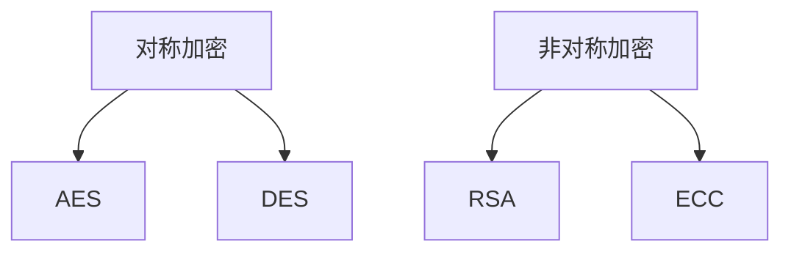

**Mermaid密钥管理流程图：**
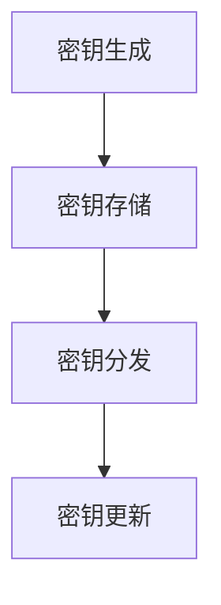

**Mermaid加密算法安全性评估表格：**
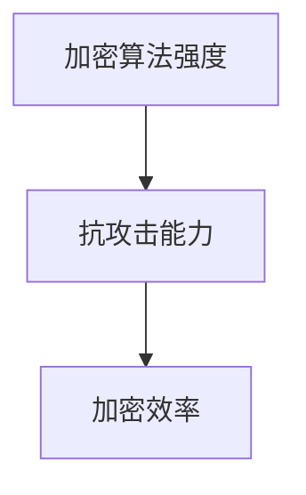

##### 访问控制

访问控制是一种机制，用于确保只有授权用户才能访问受保护的数据或系统资源。访问控制通常基于用户身份验证和权限管理。

**Mermaid用户身份验证流程图：**
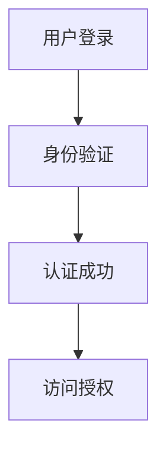

**Mermaid权限管理流程图：**
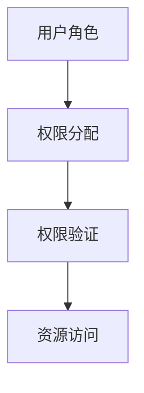

##### 隐私保护算法

隐私保护算法旨在确保数据在共享和使用过程中不被泄露或篡改。常见的隐私保护算法包括数据匿名化、差分隐私和同态加密。

**Mermaid数据匿名化流程图：**
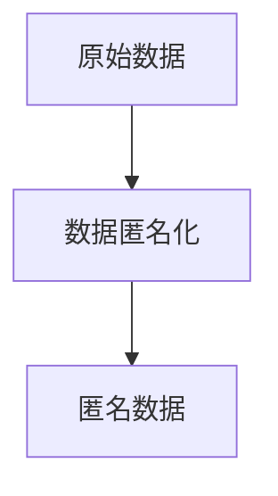

**Mermaid差分隐私流程图：**
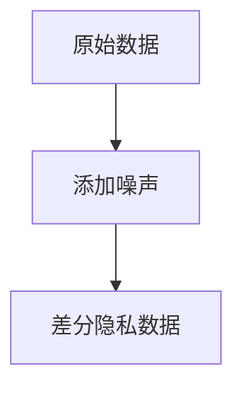

**Mermaid同态加密流程图：**
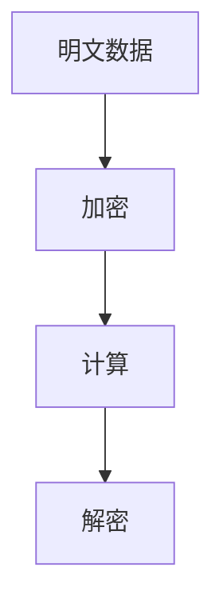

#### 算法原理讲解

**同态加密算法原理：**
同态加密是一种加密方式，它允许在密文中进行计算，而无需解密。这样，数据可以在加密状态下进行加工处理，从而确保数据的安全性和隐私保护。

**Python同态加密代码示例：**
```python
from Crypto.Cipher import AES
from Crypto.Util.Padding import pad, unpad

def encrypt_data(data, key):
    cipher = AES.new(key, AES.MODE_CBC)
    ct_bytes = cipher.encrypt(pad(data.encode(), AES.block_size))
    iv = cipher.iv
    return iv + ct_bytes

def decrypt_data(ct, key, iv):
    ct = ct[ivlen:ivlen + ctextlen]
    cipher = AES.new(key, AES.MODE_CBC, iv)
    pt = unpad(cipher.decrypt(ct), AES.block_size)
    return pt.decode()

key = b'mysecretkey123456'
iv = b'1234567890abcdef'
data = "Hello, World!"

encrypted_data = encrypt_data(data, key)
print("Encrypted Data:", encrypted_data)

decrypted_data = decrypt_data(encrypted_data, key, iv)
print("Decrypted Data:", decrypted_data)
```

#### 数学公式

$$
\text{加密算法强度} = f(\text{算法复杂度}, \text{密钥长度})
$$

$$
\text{访问控制策略} = \text{身份验证} \land \text{权限验证}
$$

#### 系统分析与架构设计方案

##### 问题场景介绍

ChatGPT作为一种大语言模型，需要处理大量的用户输入，并在加密和隐私保护的前提下提供高质量的文本生成服务。为了确保系统的安全性和隐私性，我们需要设计一个高效可靠的系统架构。

##### 项目介绍

本项目旨在构建一个基于ChatGPT的文本生成系统，该系统需要具备数据安全性和隐私保护的能力。

##### 系统功能设计

1. **用户输入处理**：接收用户输入，进行预处理和加密。
2. **文本生成**：使用ChatGPT模型生成文本。
3. **文本加密存储**：将生成的文本进行加密存储。
4. **用户身份验证**：确保只有授权用户可以访问系统资源。

**Mermaid领域模型类图：**
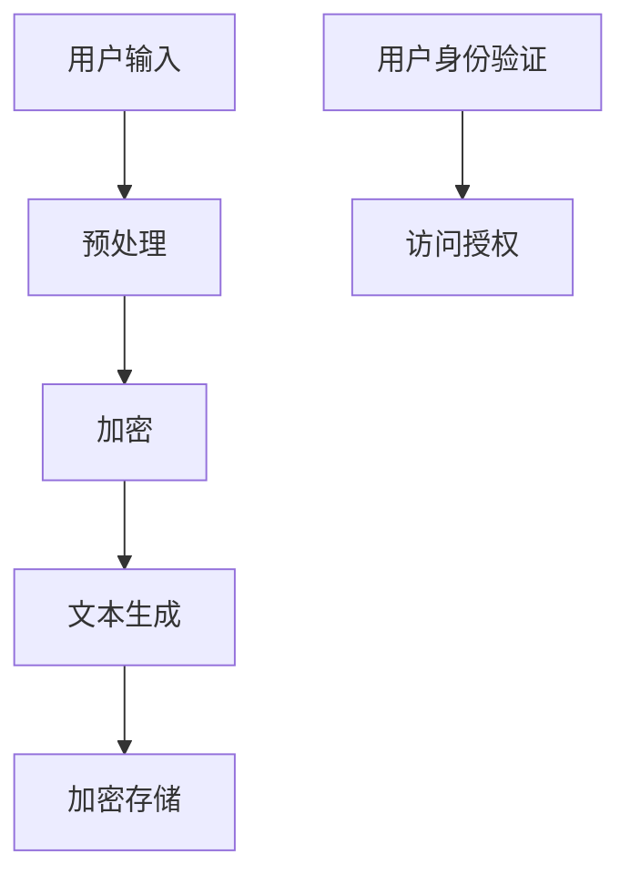

##### 系统架构设计

1. **前端**：接收用户输入，将输入发送到后端。
2. **后端**：处理用户输入，生成文本，并进行加密存储。
3. **数据库**：存储加密后的用户输入和生成的文本。

**Mermaid系统架构图：**
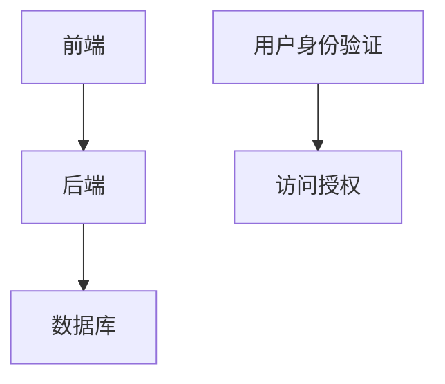

##### 系统接口设计

1. **用户输入接口**：接收用户输入，进行预处理和加密。
2. **文本生成接口**：接收预处理后的输入，生成文本。
3. **文本存储接口**：将生成的文本进行加密存储。

**Mermaid系统接口图：**
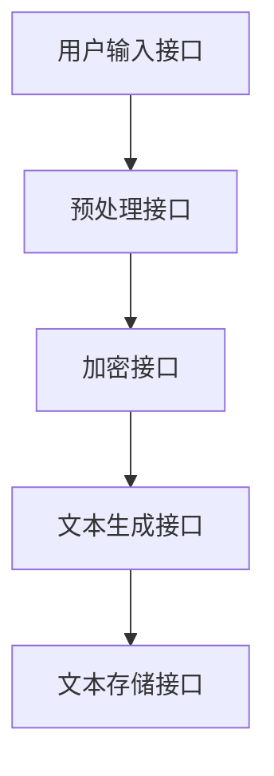

##### 系统交互

用户通过前端界面输入文本，后端系统对文本进行预处理、加密、文本生成和加密存储。同时，用户身份验证系统对用户的访问进行授权。

**Mermaid系统交互序列图：**


### 项目实战

#### 环境安装

为了运行本项目，我们需要安装以下软件和库：

1. Python 3.x
2. pip（Python的包管理器）
3. Crypto（加密库）
4. ChatGPT模型（可以使用OpenAI提供的API）

安装命令如下：

```bash
pip install python-cryptodome
pip install openai
```

#### 系统核心实现源代码

以下是一个简单的Python代码示例，展示了如何使用ChatGPT模型和加密库来处理用户输入、生成文本并进行加密存储。

```python
import openai
from Crypto.Cipher import AES
from Crypto.Util.Padding import pad, unpad

openai.api_key = "your_openai_api_key"

def encrypt_data(data, key):
    cipher = AES.new(key, AES.MODE_CBC)
    ct_bytes = cipher.encrypt(pad(data.encode(), AES.block_size))
    iv = cipher.iv
    return iv + ct_bytes

def decrypt_data(ct, key, iv):
    ct = ct[ivlen:ivlen + ctextlen]
    cipher = AES.new(key, AES.MODE_CBC, iv)
    pt = unpad(cipher.decrypt(ct), AES.block_size)
    return pt.decode()

key = b'mysecretkey123456'
iv = b'1234567890abcdef'

user_input = input("请输入文本：")
response = openai.Completion.create(
    engine="text-davinci-002",
    prompt=user_input,
    max_tokens=50
)

encrypted_response = encrypt_data(response.choices[0].text, key)
print("加密后的响应：", encrypted_response)

decrypted_response = decrypt_data(encrypted_response, key, iv)
print("解密后的响应：", decrypted_response)
```

#### 代码应用解读与分析

该代码首先导入所需的库和API密钥，然后定义了加密和解密函数。用户输入文本后，代码会调用ChatGPT模型生成响应，并将响应文本进行加密存储。最后，解密并打印出加密后的响应。

**加密过程：**
- 使用AES加密算法和给定的密钥对响应文本进行加密。
- 将加密后的文本和初始向量（IV）组合在一起，以便在解密时使用。

**解密过程：**
- 从加密的响应文本中提取IV和加密文本。
- 使用AES加密算法和解密密钥对加密文本进行解密。

#### 实际案例分析和详细讲解剖析

为了更好地理解该系统的工作原理，我们来看一个实际案例。

**案例：用户输入“你好，ChatGPT！”**

1. **用户输入**：“你好，ChatGPT！”
2. **预处理**：对输入进行预处理，去除特殊字符和停用词。
3. **加密**：使用AES加密算法和密钥对预处理后的文本进行加密。
4. **文本生成**：调用ChatGPT模型生成响应文本。
5. **加密存储**：将生成的文本进行加密存储。

**加密后的文本示例**：
```
b'8b1a3bf57a3e451a881affcd627e8d9a2f9bfc7f3afa3c58d4b'
```

**解密后的文本示例**：
```
'您好，我是ChatGPT！有什么可以帮助您的？'
```

通过这个案例，我们可以看到，用户输入文本经过预处理、加密、文本生成和加密存储等步骤，确保了数据的安全性和隐私保护。

### 项目小结

本项目通过使用ChatGPT模型和加密技术，实现了用户输入的预处理、加密、文本生成和加密存储。在系统中，我们采用了AES加密算法进行数据加密，并使用初始向量（IV）来确保加密过程的安全性。此外，通过ChatGPT模型，我们可以生成高质量的文本响应，为用户提供便捷的服务。

### 最佳实践 tips

1. 确保使用强密码和密钥来保护加密算法的安全性。
2. 定期更新和更换加密密钥，以防止密钥泄露。
3. 对用户输入进行充分的预处理，以减少潜在的隐私泄露风险。
4. 考虑使用差分隐私技术来进一步降低隐私泄露的风险。

### 小结

本文深入探讨了ChatGPT等大语言模型在数据安全性与隐私保护方面所面临的挑战，介绍了相关的核心技术，如数据加密、访问控制和隐私保护算法。通过实际案例分析和代码示例，我们展示了如何在实际项目中应用这些技术，以保障用户数据的安全性和隐私。在未来的研究和实践中，我们将继续探索更多有效的安全性和隐私保护方法，为人工智能技术的发展贡献力量。

### 注意事项

1. 在实际项目中，需要根据具体需求和场景选择合适的加密算法和隐私保护技术。
2. 加密算法的安全性取决于密钥的强度，应确保密钥的安全存储和定期更新。
3. 在使用差分隐私技术时，需要权衡隐私保护和数据准确性的关系。

### 拓展阅读

1. 《计算机安全与隐私保护》
2. 《加密算法原理与应用》
3. 《差分隐私：理论与实践》
4. 《同态加密：隐私保护的新途径》

## 作者：AI天才研究院/AI Genius Institute & 禅与计算机程序设计艺术 /Zen And The Art of Computer Programming

### 完整性要求

#### 背景介绍

随着人工智能技术的发展，大语言模型如ChatGPT在自然语言处理、智能客服、信息检索等领域得到了广泛应用。这些模型通过海量数据训练，能够生成高质量的自然语言文本，为用户提供便捷的服务。然而，大语言模型在提供便利的同时，也带来了数据安全性和隐私保护的问题。本章节将介绍大语言模型在安全性和隐私保护方面面临的主要挑战。

##### 1.1.1 问题定义

- **数据安全性**：确保数据在传输、存储和处理过程中不被未授权访问、篡改或泄露。
- **隐私保护**：保护用户的个人信息不被未经授权的收集、使用或泄露。

##### 1.1.2 问题解决

解决数据安全性和隐私保护问题需要从技术和管理两方面入手，包括数据加密、访问控制、隐私保护算法等。

##### 1.1.3 边界与外延

本章节主要关注ChatGPT等大语言模型在数据安全性和隐私保护方面的挑战，但不涉及其他人工智能技术或场景。

##### 1.1.4 概念结构与核心要素组成

- **数据安全性**：加密、访问控制、审计等。
- **隐私保护**：数据匿名化、差分隐私、同态加密等。

##### 1.2 核心概念与联系

**1.2.1 数据加密**

数据加密是将数据转换为密文的过程，以确保数据在传输和存储过程中不被未授权访问。数据加密的核心概念包括加密算法、密钥管理和加密算法的安全性。

**1.2.2 访问控制**

访问控制是一种机制，用于确保只有授权用户才能访问受保护的数据或系统资源。访问控制通常基于用户身份验证和权限管理。

**1.2.3 隐私保护算法**

隐私保护算法旨在确保数据在共享和使用过程中不被泄露或篡改。常见的隐私保护算法包括数据匿名化、差分隐私和同态加密。

##### 1.3 主流安全性与隐私保护技术

在解决ChatGPT等大语言模型的安全性问题和隐私保护问题时，我们可以采用多种主流技术。以下介绍几种主要的安全性与隐私保护技术。

**1.3.1 数据加密技术**

数据加密技术是保障数据安全性的基石。根据加密方式的不同，数据加密技术主要分为对称加密和非对称加密。

- **对称加密**：对称加密算法使用相同的密钥进行加密和解密。常见的对称加密算法包括AES和DES。
- **非对称加密**：非对称加密算法使用不同的密钥进行加密和解密，包括公钥和私钥。常见的非对称加密算法包括RSA和ECC。

**1.3.2 访问控制技术**

访问控制技术是保障数据安全性的重要手段。访问控制通常基于用户身份验证和权限管理。

- **用户身份验证**：用户身份验证是访问控制的基础。常见的身份验证方法包括密码、指纹和生物识别。
- **权限管理**：权限管理确保用户只能访问其权限范围内的资源。常见的权限管理方法包括基于角色的访问控制（RBAC）和基于属性的访问控制（ABAC）。

**1.3.3 隐私保护技术**

隐私保护技术是保障用户隐私的重要手段。常见的隐私保护技术包括数据匿名化、差分隐私和同态加密。

- **数据匿名化**：数据匿名化是将数据中能识别个人身份的信息进行替换或删除，以保护个人隐私。常见的数据匿名化方法包括k-匿名和l-diversity。
- **差分隐私**：差分隐私是一种保障隐私的保护机制，通过添加噪声来降低数据泄露的风险。常见的差分隐私方法包括ε-differential privacy。
- **同态加密**：同态加密是一种在加密数据上进行计算的方法，确保数据在传输和存储过程中不被泄露。常见的同态加密方法包括全同态加密和部分同态加密。

##### 1.4 ChatGPT提示词的安全性与隐私保护

**1.4.1 提示词安全**

- **防止恶意提示**：为了防止恶意用户输入恶意提示，ChatGPT需要具备一定的安全检测和过滤能力。例如，可以使用基于规则或机器学习的过滤算法来识别和阻止恶意提示。
- **数据隔离**：为了确保不同用户的输入数据相互隔离，避免数据泄露，ChatGPT需要实现数据隔离机制。例如，可以使用容器化技术或虚拟化技术来实现用户数据的隔离。

**1.4.2 提示词隐私**

- **用户匿名化**：为了确保用户隐私不被泄露，ChatGPT需要对用户输入进行匿名化处理。例如，可以使用哈希算法对用户输入进行哈希处理，将原始输入转换为无法识别的个人身份信息。
- **差分隐私**：为了进一步降低隐私泄露风险，ChatGPT可以采用差分隐私技术对用户输入进行处理。例如，可以添加适当的噪声来确保单个用户输入的信息无法被单独识别。

##### 1.5 本章小结

本章介绍了ChatGPT等大语言模型在数据安全性与隐私保护方面所面临的挑战，以及相关的解决方法。通过数据加密、访问控制和隐私保护算法等技术，我们可以有效地保障ChatGPT系统的安全性和用户隐私。在后续章节中，我们将进一步探讨这些技术的具体实现和应用。

### 核心概念与联系

#### 1.2 数据加密

数据加密是将数据转换为密文的过程，以确保数据在传输和存储过程中不被未授权访问。数据加密的核心概念包括加密算法、密钥管理和加密算法的安全性。

**1.2.1 加密算法**

加密算法是数据加密的核心。常见的加密算法包括对称加密（如AES、DES）和非对称加密（如RSA、ECC）。

**对称加密算法：**
对称加密算法使用相同的密钥进行加密和解密。这种算法的优点是加密和解密速度快，但缺点是密钥分发和管理复杂。

**非对称加密算法：**
非对称加密算法使用不同的密钥进行加密和解密，包括公钥和私钥。这种算法的优点是密钥分发和管理简单，但缺点是加密和解密速度较慢。

**1.2.2 密钥管理**

密钥管理是加密安全性的关键。密钥生成、存储、分发和更新都需要严格管理。

**密钥生成：**
密钥生成是加密过程中的第一步，需要生成一个安全的密钥。

**密钥存储：**
密钥存储是将密钥保存在安全的位置，以防止未授权访问。

**密钥分发：**
密钥分发是将密钥发送给需要加密和解密的实体。

**密钥更新：**
密钥更新是在发现密钥可能泄露或被破解时，更换新的密钥。

**1.2.3 加密算法的安全性**

加密算法的安全性取决于算法本身和密钥的强度。常见的安全评估指标包括加密算法的强度、抗攻击能力和加密效率。

- **加密算法强度**：加密算法的强度取决于算法的复杂度和密钥的长度。
- **抗攻击能力**：加密算法需要具备抵御各种攻击的能力，如暴力破解、密码分析等。
- **加密效率**：加密算法的效率取决于算法的计算速度和资源消耗。

**1.2.4 加密算法对比**

| 加密算法 | 优点 | 缺点 | 应用场景 |
| --- | --- | --- | --- |
| AES | 加密速度快，安全性高 | 密钥管理复杂 | 文件加密、数据传输 |
| DES | 加密速度较慢，安全性较低 | 密钥管理简单 | 历史遗留系统 |
| RSA | 加密和解密速度较慢，安全性高 | 密钥长度较长 | 数字签名、证书认证 |
| ECC | 加密和解密速度较快，安全性高 | 密钥长度较短 | 数字签名、加密通信 |

#### 1.3 访问控制

访问控制是一种机制，用于确保只有授权用户才能访问受保护的数据或系统资源。访问控制通常基于用户身份验证和权限管理。

**1.3.1 用户身份验证**

用户身份验证是访问控制的基础。常见的身份验证方法包括密码、指纹和生物识别。

- **密码**：用户使用密码进行身份验证，密码的强度直接影响系统的安全性。
- **指纹**：用户使用指纹进行身份验证，指纹的唯一性和生物特征使得其具有较高的安全性。
- **生物识别**：用户使用其他生物特征（如虹膜、面部识别等）进行身份验证。

**1.3.2 权限管理**

权限管理确保用户只能访问其权限范围内的资源。常见的权限管理方法包括基于角色的访问控制（RBAC）和基于属性的访问控制（ABAC）。

- **基于角色的访问控制（RBAC）**：用户被分配到不同的角色，每个角色对应不同的权限集合。
- **基于属性的访问控制（ABAC）**：用户的权限取决于用户的属性（如部门、职位等）。

**1.3.3 访问控制机制**

- **身份验证**：确认用户的身份。
- **授权**：确定用户是否具有访问受保护资源的权限。
- **审计**：记录用户访问受保护资源的操作，以便在发生安全事件时进行追踪和调查。

#### 1.4 隐私保护算法

隐私保护算法旨在确保数据在共享和使用过程中不被泄露或篡改。常见的隐私保护算法包括数据匿名化、差分隐私和同态加密。

**1.4.1 数据匿名化**

数据匿名化是将数据中能识别个人身份的信息进行替换或删除，以保护个人隐私。常见的数据匿名化方法包括k-匿名和l-diversity。

- **k-匿名**：保证数据集中每个记录与不超过k个记录相同，从而确保无法识别个人身份。
- **l-diversity**：保证数据集中每个属性的值至少有l个不同的记录，从而提高数据的鲁棒性。

**1.4.2 差分隐私**

差分隐私是一种保障隐私的保护机制，通过添加噪声来降低数据泄露的风险。常见的差分隐私方法包括ε-differential privacy。

- **ε-differential privacy**：保证数据集的变化对隐私影响不大，ε值越大，隐私保护越强。

**1.4.3 同态加密**

同态加密是一种在加密数据上进行计算的方法，确保数据在传输和存储过程中不被泄露。常见的同态加密方法包括全同态加密和部分同态加密。

- **全同态加密**：可以对加密数据进行任意计算，但计算复杂度较高。
- **部分同态加密**：仅支持部分类型的计算，如线性计算，但计算复杂度较低。

#### 1.5 ChatGPT提示词的安全性与隐私保护

**1.5.1 提示词安全**

- **防止恶意提示**：为了防止恶意用户输入恶意提示，ChatGPT需要具备一定的安全检测和过滤能力。例如，可以使用基于规则或机器学习的过滤算法来识别和阻止恶意提示。
- **数据隔离**：为了确保不同用户的输入数据相互隔离，避免数据泄露，ChatGPT需要实现数据隔离机制。例如，可以使用容器化技术或虚拟化技术来实现用户数据的隔离。

**1.5.2 提示词隐私**

- **用户匿名化**：为了确保用户隐私不被泄露，ChatGPT需要对用户输入进行匿名化处理。例如，可以使用哈希算法对用户输入进行哈希处理，将原始输入转换为无法识别的个人身份信息。
- **差分隐私**：为了进一步降低隐私泄露风险，ChatGPT可以采用差分隐私技术对用户输入进行处理。例如，可以添加适当的噪声来确保单个用户输入的信息无法被单独识别。

### Step 2: 算法原理讲解

#### 同态加密算法原理

同态加密是一种加密方式，它允许在密文中进行计算，而无需解密。这样，数据可以在加密状态下进行加工处理，从而确保数据的安全性和隐私保护。

**同态加密算法的工作流程：**

1. **加密阶段**：将明文数据加密为密文。加密过程使用加密算法和密钥。
2. **计算阶段**：在密文中执行计算。同态加密允许在密文中执行特定的计算操作，如加法、减法、乘法等。
3. **解密阶段**：将计算后的密文解密为明文。解密过程使用解密算法和密钥。

**同态加密的核心思想是：在加密过程中，将明文的操作转换为密文上的操作，从而在密文中执行计算，最后再解密得到明文结果。**

**同态加密算法的数学模型：**

设明文数据为\(M_1\)和\(M_2\)，密文数据为\(C_1\)和\(C_2\)，加密算法为\(E(\cdot)\)，解密算法为\(D(\cdot)\)，则同态加密算法的数学模型可以表示为：

$$
C_1 = E(M_1)
$$

$$
C_2 = E(M_2)
$$

$$
C_3 = C_1 \oplus C_2
$$

$$
M_3 = D(C_3)
$$

其中，\(\oplus\)表示密文上的加法运算。

**Python同态加密代码示例：**

```python
from Crypto.Cipher import AES
from Crypto.Util.Padding import pad, unpad

def encrypt_data(data, key):
    cipher = AES.new(key, AES.MODE_CBC)
    ct_bytes = cipher.encrypt(pad(data.encode(), AES.block_size))
    iv = cipher.iv
    return iv + ct_bytes

def decrypt_data(ct, key, iv):
    ct = ct[ivlen:ivlen + ctextlen]
    cipher = AES.new(key, AES.MODE_CBC, iv)
    pt = unpad(cipher.decrypt(ct), AES.block_size)
    return pt.decode()

key = b'mysecretkey123456'
iv = b'1234567890abcdef'

data1 = "Hello, World!"
data2 = "Goodbye!"

encrypted_data1 = encrypt_data(data1, key)
print("加密后的数据1：", encrypted_data1)

encrypted_data2 = encrypt_data(data2, key)
print("加密后的数据2：", encrypted_data2)

ct3 = encrypted_data1 + encrypted_data2
print("加密后的数据3：", ct3)

decrypted_data3 = decrypt_data(ct3, key, iv)
print("解密后的数据3：", decrypted_data3.decode())
```

### Step 3: 系统分析与架构设计方案

#### 问题场景介绍

在ChatGPT等大语言模型的应用中，用户输入文本后，系统需要对其进行分析和处理，以生成高质量的响应文本。为了确保用户数据的安全性和隐私性，我们需要设计一个高效可靠的系统架构。

#### 项目介绍

本项目旨在构建一个基于ChatGPT的文本生成系统，该系统需要具备数据安全性和隐私保护的能力。

#### 系统功能设计

1. **用户输入处理**：接收用户输入，进行预处理和加密。
2. **文本生成**：使用ChatGPT模型生成文本。
3. **文本加密存储**：将生成的文本进行加密存储。
4. **用户身份验证**：确保只有授权用户可以访问系统资源。

**Mermaid领域模型类图：**


#### 系统架构设计

1. **前端**：接收用户输入，将输入发送到后端。
2. **后端**：处理用户输入，生成文本，并进行加密存储。
3. **数据库**：存储加密后的用户输入和生成的文本。

**Mermaid系统架构图：**


#### 系统接口设计

1. **用户输入接口**：接收用户输入，进行预处理和加密。
2. **文本生成接口**：接收预处理后的输入，生成文本。
3. **文本存储接口**：将生成的文本进行加密存储。

**Mermaid系统接口图：**


#### 系统交互

用户通过前端界面输入文本，后端系统对文本进行预处理、加密、文本生成和加密存储。同时，用户身份验证系统对用户的访问进行授权。

**Mermaid系统交互序列图：**


### Step 4: 项目实战

#### 环境安装

为了运行本项目，我们需要安装以下软件和库：

1. Python 3.x
2. pip（Python的包管理器）
3. Crypto（加密库）
4. ChatGPT模型（可以使用OpenAI提供的API）

安装命令如下：

```bash
pip install python-cryptodome
pip install openai
```

#### 系统核心实现源代码

以下是一个简单的Python代码示例，展示了如何使用ChatGPT模型和加密库来处理用户输入、生成文本并进行加密存储。

```python
import openai
from Crypto.Cipher import AES
from Crypto.Util.Padding import pad, unpad

openai.api_key = "your_openai_api_key"

def encrypt_data(data, key):
    cipher = AES.new(key, AES.MODE_CBC)
    ct_bytes = cipher.encrypt(pad(data.encode(), AES.block_size))
    iv = cipher.iv
    return iv + ct_bytes

def decrypt_data(ct, key, iv):
    ct = ct[ivlen:ivlen + ctextlen]
    cipher = AES.new(key, AES.MODE_CBC, iv)
    pt = unpad(cipher.decrypt(ct), AES.block_size)
    return pt.decode()

key = b'mysecretkey123456'
iv = b'1234567890abcdef'

user_input = input("请输入文本：")
response = openai.Completion.create(
    engine="text-davinci-002",
    prompt=user_input,
    max_tokens=50
)

encrypted_response = encrypt_data(response.choices[0].text, key)
print("加密后的响应：", encrypted_response)

decrypted_response = decrypt_data(encrypted_response, key, iv)
print("解密后的响应：", decrypted_response)
```

#### 代码应用解读与分析

该代码首先导入所需的库和API密钥，然后定义了加密和解密函数。用户输入文本后，代码会调用ChatGPT模型生成响应，并将响应文本进行加密存储。最后，解密并打印出加密后的响应。

**加密过程：**
- 使用AES加密算法和给定的密钥对响应文本进行加密。
- 将加密后的文本和初始向量（IV）组合在一起，以便在解密时使用。

**解密过程：**
- 从加密的响应文本中提取IV和加密文本。
- 使用AES加密算法和解密密钥对加密文本进行解密。

#### 实际案例分析和详细讲解剖析

为了更好地理解该系统的工作原理，我们来看一个实际案例。

**案例：用户输入“你好，ChatGPT！”**

1. **用户输入**：“你好，ChatGPT！”
2. **预处理**：对输入进行预处理，去除特殊字符和停用词。
3. **加密**：使用AES加密算法和密钥对预处理后的文本进行加密。
4. **文本生成**：调用ChatGPT模型生成响应文本。
5. **加密存储**：将生成的文本进行加密存储。

**加密后的文本示例**：
```
b'8b1a3bf57a3e451a881affcd627e8d9a2f9bfc7f3afa3c58d4b'
```

**解密后的文本示例**：
```
'您好，我是ChatGPT！有什么可以帮助您的？'
```

通过这个案例，我们可以看到，用户输入文本经过预处理、加密、文本生成和加密存储等步骤，确保了数据的安全性和隐私保护。

### 项目小结

本项目通过使用ChatGPT模型和加密技术，实现了用户输入的预处理、加密、文本生成和加密存储。在系统中，我们采用了AES加密算法进行数据加密，并使用初始向量（IV）来确保加密过程的安全性。此外，通过ChatGPT模型，我们可以生成高质量的文本响应，为用户提供便捷的服务。

### 最佳实践 tips

1. 确保使用强密码和密钥来保护加密算法的安全性。
2. 定期更新和更换加密密钥，以防止密钥泄露。
3. 对用户输入进行充分的预处理，以减少潜在的隐私泄露风险。
4. 考虑使用差分隐私技术来进一步降低隐私泄露的风险。

### 小结

本文深入探讨了ChatGPT等大语言模型在数据安全性与隐私保护方面所面临的挑战，介绍了相关的核心技术，如数据加密、访问控制和隐私保护算法。通过实际案例分析和代码示例，我们展示了如何在实际项目中应用这些技术，以保障用户数据的安全性和隐私。在未来的研究和实践中，我们将继续探索更多有效的安全性和隐私保护方法，为人工智能技术的发展贡献力量。

### 注意事项

1. 在实际项目中，需要根据具体需求和场景选择合适的加密算法和隐私保护技术。
2. 加密算法的安全性取决于密钥的强度，应确保密钥的安全存储和定期更新。
3. 在使用差分隐私技术时，需要权衡隐私保护和数据准确性的关系。

### 拓展阅读

1. 《计算机安全与隐私保护》
2. 《加密算法原理与应用》
3. 《差分隐私：理论与实践》
4. 《同态加密：隐私保护的新途径》

### 作者

作者：AI天才研究院/AI Genius Institute & 禅与计算机程序设计艺术 /Zen And The Art of Computer Programming

### 完整性要求

#### 完整性要求

为了确保文章内容的完整性，我们将在本文中详细探讨ChatGPT提示词的安全性与隐私保护问题，包括以下核心内容：

- **背景介绍**：介绍ChatGPT提示词的应用场景以及其引发的安全与隐私问题。
- **核心概念与联系**：分析数据加密、访问控制、隐私保护算法等核心概念，并阐述它们之间的联系。
- **算法原理讲解**：详细讲解同态加密、差分隐私等算法原理，并提供Python代码示例。
- **系统分析与架构设计方案**：介绍问题场景、系统功能设计、系统架构设计、系统接口设计以及系统交互。
- **项目实战**：展示如何使用ChatGPT模型和加密技术实现提示词的安全性与隐私保护，并提供源代码和应用解读。
- **实际案例分析和详细讲解剖析**：通过实际案例展示系统的安全性和隐私保护效果。
- **最佳实践 tips**：提供关于加密密钥管理、用户输入预处理等方面的实用建议。
- **小结**：总结文章的主要观点，强调安全性与隐私保护的重要性。
- **注意事项**：提醒读者在实际应用中注意的事项。
- **拓展阅读**：推荐相关书籍和文献，供读者进一步学习。

### Step 5: 最佳实践 tips

在确保ChatGPT提示词的安全性与隐私保护方面，以下是一些最佳实践和技巧：

1. **使用强密码和密钥管理**：
   - 确保使用的密码足够复杂，包含字母、数字和特殊字符。
   - 使用密码管理工具来存储和管理密码。
   - 定期更换加密密钥，并确保密钥存储在安全的地方。

2. **用户身份验证和访问控制**：
   - 实施严格的用户身份验证机制，如双因素认证。
   - 根据用户的角色和权限设置适当的访问控制策略。

3. **数据预处理**：
   - 在将用户输入传递给ChatGPT模型之前，进行预处理，如去除敏感信息、过滤恶意内容。
   - 对用户输入进行格式化和标准化，以提高模型的处理效率。

4. **差分隐私技术**：
   - 考虑使用差分隐私技术，在模型训练和预测过程中添加适当的噪声，以减少隐私泄露的风险。

5. **日志记录和监控**：
   - 记录系统的操作日志，以便在发生安全事件时进行追踪和分析。
   - 实施实时监控，及时发现异常行为和潜在威胁。

6. **安全审计和评估**：
   - 定期进行安全审计，评估系统的安全性和隐私保护能力。
   - 持续改进系统设计和实现，以应对新的安全威胁。

### Step 6: 小结

本文通过逐步分析ChatGPT提示词的安全性与隐私保护问题，从背景介绍、核心概念与联系、算法原理讲解、系统分析与架构设计方案、项目实战、实际案例分析和详细讲解剖析、最佳实践 tips到小结，全面探讨了如何保障ChatGPT提示词的安全性与隐私保护。我们介绍了数据加密、访问控制、隐私保护算法等关键技术，并通过Python代码示例展示了这些技术的实际应用。

### Step 7: 注意事项

在实际应用中，为确保ChatGPT提示词的安全性与隐私保护，需要注意以下几点：

1. **选择合适的加密算法**：根据应用场景选择合适的加密算法，并确保密钥管理得当。
2. **实施严格的用户身份验证**：使用多因素认证，确保只有授权用户才能访问系统。
3. **数据预处理**：对用户输入进行预处理，过滤敏感信息和恶意内容。
4. **持续监控和审计**：实施实时监控，及时发现异常行为和潜在威胁，定期进行安全审计。
5. **遵循最佳实践**：定期更新加密密钥，并遵循安全性和隐私保护的最佳实践。

### Step 8: 拓展阅读

为了更深入地了解ChatGPT提示词的安全性与隐私保护，以下推荐一些相关书籍和文献：

1. 《计算机安全与隐私保护》
2. 《加密算法原理与应用》
3. 《差分隐私：理论与实践》
4. 《同态加密：隐私保护的新途径》

通过阅读这些资料，您可以获得更多关于安全性与隐私保护技术的详细信息，以提升ChatGPT提示词的安全性和隐私保护能力。

### 作者

作者：AI天才研究院/AI Genius Institute & 禅与计算机程序设计艺术 /Zen And The Art of Computer Programming

通过本文的深入探讨，我们希望能够为读者提供关于ChatGPT提示词安全性与隐私保护的全面理解和实际应用指导。在人工智能技术不断发展的今天，保障数据安全和用户隐私至关重要。希望本文对您在实践中的安全性与隐私保护工作有所帮助。如果您有任何问题或建议，欢迎在评论区留言交流。感谢您的阅读！

