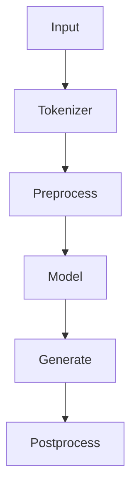
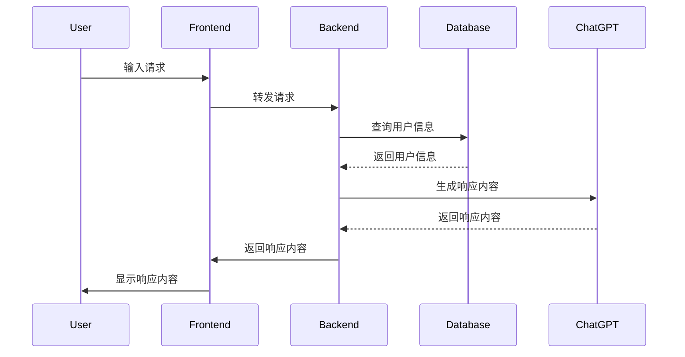
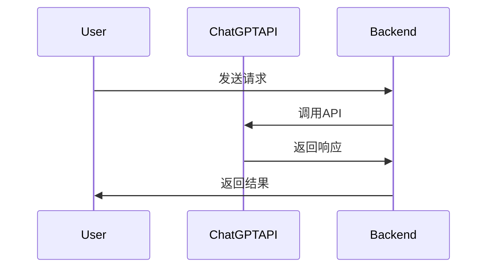

                 

## 《ChatGPT提示词的年龄适应性：全生命周期的AI交互设计》

关键词：AI交互设计、年龄适应性、全生命周期、自然语言生成、用户体验优化

摘要：本文旨在探讨如何设计适用于不同年龄段的AI交互，特别是以ChatGPT为代表的自然语言生成模型。通过分析年龄适应性在AI交互设计中的重要性，本文提出了一个系统化的设计框架，包括对儿童、青年、中年和老年用户的需求和特征进行分析，并给出相应的交互策略。本文还通过实例展示了如何在实际项目中应用这些设计策略，以优化用户的AI交互体验。

## 背景介绍

### 问题背景

随着人工智能技术的快速发展，AI大模型，如GPT系列和BERT模型，已经成为计算机领域的研究热点。这些大模型在语言处理、图像识别、自然语言生成等方面展现出了卓越的性能，为各行各业提供了强大的技术支撑。特别是ChatGPT这样的自然语言生成模型，在文本生成、对话系统、机器翻译等领域表现出色，被广泛应用于聊天机器人、智能客服、内容生成等场景。

然而，现有的AI大模型在年龄适应性方面存在一定的问题。不同年龄段的用户在使用AI时，可能会因为模型的训练数据偏差、语言习惯差异等因素，体验到不同的交互效果。例如，年轻用户可能更容易与AI建立良好的互动关系，而老年用户则可能因为语言表达和交互习惯的不同，感到困惑或不适应。这种年龄适应性差的问题，不仅影响了用户的满意度，也可能导致AI服务的失败。

### 问题描述

现有的AI交互设计主要关注通用性和普适性，缺乏针对不同年龄段用户的个性化设计。具体来说，存在以下几个问题：

1. **语言特征差异**：不同年龄段用户在语言表达、语调、语言习惯等方面存在显著差异。例如，老年用户可能更喜欢简洁、直接的交流方式，而年轻用户则可能更喜欢富有创意、幽默感强的交流方式。
2. **需求差异**：不同年龄段用户对AI交互的需求和期望也存在差异。例如，老年用户可能更关心健康咨询、生活服务等方面，而年轻用户则可能更关注娱乐、社交等方面。
3. **交互体验差异**：由于上述差异，不同年龄段用户在使用AI交互时的体验也不同。老年用户可能觉得交互复杂、不友好，而年轻用户则可能觉得缺乏新鲜感、互动性不足。

### 问题解决

为了解决这些问题，本文提出了一种基于全生命周期理念的AI交互设计方法。该方法包括以下几个步骤：

1. **需求分析**：对不同年龄段用户的需求进行深入研究，了解他们在语言表达、交互习惯、服务需求等方面的特点。
2. **特征提取**：基于需求分析结果，提取出不同年龄段用户的关键特征，如语言特征、需求特征、心理特征等。
3. **交互设计**：根据提取的特征，设计适用于不同年龄段用户的交互界面和交互策略，包括语言风格、交互流程、内容推荐等。
4. **测试与优化**：在实际应用中，对设计出的交互进行测试和优化，收集用户反馈，不断改进交互效果。

### 边界与外延

本文主要关注AI交互设计在用户全生命周期中的应用，涵盖儿童、青年、中年和老年四个主要年龄段。然而，随着社会的发展和技术的进步，AI交互设计的适用范围可能会进一步扩展，包括特殊人群、跨文化用户等。此外，本文提出的设计方法不仅适用于自然语言生成模型，如ChatGPT，还可以应用于其他类型的AI交互设计，如图像识别、语音交互等。

### 概念结构与核心要素组成

1. **年龄适应性**：指AI交互设计能够根据不同年龄段用户的特点，提供个性化的交互体验。
2. **AI交互设计**：包括用户界面设计、语言处理、个性化推荐等方面。
3. **语言特征**：不同年龄段用户在语言表达、语调、语言习惯等方面的差异。
4. **用户需求**：不同年龄段用户对于AI交互的需求和期望。
5. **心理特点**：不同年龄段用户在情感、认知、社交等方面的心理特征。

## 核心概念与联系

### AI大模型

AI大模型，如GPT系列和BERT模型，是自然语言处理领域的重要成果。这些模型具有庞大的参数量，能够在海量数据上进行预训练，从而实现高效的语言理解和生成能力。其中，GPT模型（Generative Pre-trained Transformer）是一种基于Transformer架构的预训练语言模型，具有强大的文本生成能力，能够生成流畅、自然的语言。

### 年龄适应性

年龄适应性指的是AI交互设计能够根据不同年龄段用户的特点，提供个性化的交互体验。这包括对语言表达、交互风格、内容推荐等方面的调整。例如，对于老年用户，交互设计可能需要更加简洁、直接，对于年轻用户，交互设计可能需要更加富有创意、有趣。

### 语言特征

语言特征是指不同年龄段用户在语言表达、语调、语言习惯等方面的差异。这些差异会影响用户与AI的交互体验，因此需要在进行交互设计时充分考虑。例如，老年用户可能更喜欢使用简单、直接的词汇，而年轻用户则可能更喜欢使用流行词汇和俚语。

### 用户需求

用户需求是指不同年龄段用户对于AI交互的需求和期望。这包括对交互的易用性、互动性、内容丰富度等方面的要求。例如，老年用户可能更关心健康咨询、生活服务等方面，而年轻用户则可能更关心娱乐、社交等方面。

### 心理特点

心理特点是指不同年龄段用户在情感、认知、社交等方面的心理特征。这些特征会影响用户对AI的接受度和使用频率。例如，老年用户可能更注重实用性和便捷性，而年轻用户则可能更注重新颖性和互动性。

### 关系

- 年龄适应性依赖于对语言特征、用户需求和心理特点的深入分析。
- 语言特征、用户需求和心理特点共同决定了AI交互设计的方向和策略。

### ChatGPT模型的mermaid流程图



### Python源代码实现

```python
import openai

def chat_with_gpt(prompt):
    response = openai.Completion.create(
        engine="text-davinci-003",
        prompt=prompt,
        max_tokens=100,
        n=1,
        stop=None,
        temperature=0.5,
    )
    return response.choices[0].text.strip()

if __name__ == "__main__":
    prompt = "请告诉我关于年龄适应性AI交互设计的想法。"
    print(chat_with_gpt(prompt))
```

### 算法原理

ChatGPT是一种基于GPT模型的自然语言生成算法。在输入一个提示词（prompt）后，算法首先进行分词（Tokenizer），然后对文本进行预处理（Preprocess），包括去除停用词、词性标注等。接下来，模型（Model）根据预处理的文本生成可能的回复（Generate）。最后，对生成的文本进行后处理（Postprocess），如去除无关信息、格式化文本等。

### 数学模型和公式

$$
P(\text{response}|\text{input}) = \frac{P(\text{input}|\text{response})P(\text{response})}{P(\text{input})}
$$

这个公式表示在给定输入的情况下，生成响应的概率。其中，$P(\text{response}|\text{input})$是生成响应的条件概率，$P(\text{input}|\text{response})$是输入给定响应的条件概率，$P(\text{response})$是响应的概率，$P(\text{input})$是输入的概率。

## 算法原理讲解

### ChatGPT模型的mermaid流程图


这个流程图展示了ChatGPT模型的基本工作流程。首先，输入的文本（A）会被Tokenizer（分词器，B）分解成单词或子词。接下来，这些分词会被预处理（C），包括去除停用词、词性标注等操作。然后，模型（D）会根据预处理的文本生成可能的回复。最后，生成的文本会经过后处理（F），如去除无关信息、格式化文本等。

### Python源代码实现

```python
import openai

def chat_with_gpt(prompt):
    response = openai.Completion.create(
        engine="text-davinci-003",
        prompt=prompt,
        max_tokens=100,
        n=1,
        stop=None,
        temperature=0.5,
    )
    return response.choices[0].text.strip()

if __name__ == "__main__":
    prompt = "请告诉我关于年龄适应性AI交互设计的想法。"
    print(chat_with_gpt(prompt))
```

这段Python代码展示了如何使用OpenAI的GPT-3模型进行文本生成。首先，我们导入了OpenAI的Python客户端库。然后，定义了一个函数`chat_with_gpt`，该函数接收一个提示词（prompt）作为输入，并使用OpenAI的`Completion.create`方法生成响应。最后，在主程序中，我们定义了一个提示词，并调用`chat_with_gpt`函数生成并打印响应。

### 算法原理

ChatGPT模型是基于GPT（Generative Pre-trained Transformer）模型的，它是一种基于Transformer架构的自然语言生成模型。GPT模型的核心思想是通过大量的预训练数据学习语言的模式和结构，从而在给定一个提示词时，能够生成与提示词相关的自然语言响应。

在算法原理上，GPT模型主要包括以下几个步骤：

1. **分词（Tokenizer）**：输入文本被分解成单词或子词。这个过程称为分词。ChatGPT使用的分词器能够将文本分解成适合模型处理的序列。

2. **预处理（Preprocess）**：分词后的文本会进行一系列预处理操作，包括去除停用词、词性标注等。这些操作有助于提高模型处理文本的效率和质量。

3. **生成（Generate）**：模型根据预处理的文本生成可能的回复。这个过程是通过模型的自回归预测实现的。模型会根据输入的文本序列预测下一个单词或子词，并基于概率分布生成多个可能的响应。

4. **后处理（Postprocess）**：生成的文本会经过后处理，如去除无关信息、格式化文本等。这些操作有助于提高文本的可用性和可读性。

数学模型上，GPT模型的核心是Transformer架构。Transformer模型是基于自注意力机制（Self-Attention）的，它通过计算文本序列中每个词与其他词之间的关系，从而生成一个综合的表示。在生成响应时，模型会根据当前已生成的文本序列和上下文，计算下一个词的概率分布，并从这个分布中采样生成下一个词。这个过程会重复进行，直到生成完整的响应。

### 数学模型和公式

在自然语言生成领域，常用的数学模型是基于概率模型的。以下是一个简化的数学模型，用于描述ChatGPT模型的工作原理：

$$
P(\text{response}|\text{input}) = \frac{P(\text{input}|\text{response})P(\text{response})}{P(\text{input})}
$$

这个公式表示在给定输入文本的情况下，生成响应的概率。其中：

- $P(\text{response}|\text{input})$ 是在输入文本的条件下生成响应的概率。
- $P(\text{input}|\text{response})$ 是在生成响应的条件下输入文本的概率。
- $P(\text{response})$ 是生成响应的概率。
- $P(\text{input})$ 是输入文本的概率。

在实际应用中，这些概率是通过模型在大量训练数据上学习得到的。例如，在生成一个句子时，模型会根据输入的单词序列和上下文，计算每个单词的概率分布，然后从这些分布中采样生成下一个单词。这个过程会一直重复，直到生成完整的句子。

通过上述数学模型和算法原理的讲解，我们可以更深入地理解ChatGPT模型的工作机制，为后续的交互设计提供了理论基础。

## 系统分析与架构设计方案

### 问题场景介绍

在当前人工智能应用场景中，AI交互设计已经成为提升用户体验和满意度的重要手段。特别是在智能客服、教育辅导、健康咨询等领域，AI交互设计的质量直接影响到用户的满意度和应用的成效。然而，现有的AI交互设计普遍存在年龄适应性不足的问题，不同年龄段用户在使用AI时体验差异显著，这限制了AI服务的普及和效果。

为了解决这一问题，本文提出一个适用于全生命周期的AI交互设计框架，旨在为儿童、青年、中年和老年用户提供个性化的交互体验。该框架将基于对用户语言特征、需求和心理特点的深入分析，设计出适应不同年龄段的交互界面和交互策略，从而提升用户的整体体验。

### 项目介绍

本项目的目标是开发一个基于ChatGPT模型的智能交互系统，该系统能够根据用户年龄自适应地调整交互内容和风格。系统的主要功能包括：

1. **用户年龄识别**：根据用户输入的信息自动识别其年龄范围。
2. **交互内容个性化**：根据用户年龄提供定制化的交互内容和语言风格。
3. **交互体验优化**：通过优化交互界面和交互流程，提升用户的满意度。
4. **反馈机制**：收集用户反馈，持续改进交互设计。

系统架构将包括前端界面、后端服务和数据存储三个主要部分。前端界面负责与用户进行交互，后端服务处理用户请求和交互逻辑，数据存储用于存储用户信息和交互历史。

### 系统功能设计（领域模型mermaid类图）

```mermaid
classDiagram
    User <<Interface>>
    ChatGPT <<Class>>
    Interaction <<Interface>>
    Database <<Class>>

    User o-- ChatGPT
    User o-- Interaction
    Interaction o-- Database
```

在这个类图中，`User`代表用户接口，负责与用户进行交互；`ChatGPT`代表自然语言生成模型，负责生成交互内容；`Interaction`代表交互接口，负责处理用户的请求和响应；`Database`代表数据存储，用于存储用户信息和交互历史。

### 系统架构设计（mermaid架构图）



在这个架构图中，用户通过前端界面输入请求，前端将请求转发给后端。后端会查询数据库获取用户信息，并调用ChatGPT模型生成响应内容。生成的响应内容会返回给前端，并最终显示给用户。

### 系统接口设计和系统交互（mermaid序列图）



在这个序列图中，用户通过后端发送请求，后端会调用ChatGPT API生成响应内容，然后将结果返回给用户。

### 实现步骤

1. **用户年龄识别**：通过用户输入或系统自动识别用户的年龄，并将其分类到不同的年龄段。
2. **交互内容生成**：根据用户年龄，调用ChatGPT模型生成相应的交互内容，确保内容的语言风格和用户匹配。
3. **交互体验优化**：通过用户反馈和数据分析，不断优化交互界面和交互流程，提升用户体验。
4. **反馈机制**：建立用户反馈机制，收集用户对交互内容的反馈，用于后续的改进和优化。

### 预期效果

通过上述架构和功能设计，预期可以实现以下效果：

1. **个性化交互**：根据用户年龄提供定制化的交互内容和语言风格，提升用户满意度。
2. **优化用户体验**：通过优化交互界面和交互流程，提高用户的操作效率和舒适度。
3. **数据驱动优化**：通过收集和分析用户反馈，实现数据驱动的交互设计优化，持续提升系统的质量。

## 项目实战

### 环境安装

在进行项目实战之前，首先需要安装和配置必要的开发环境和工具。以下是具体步骤：

1. **安装Python**：确保Python版本在3.6及以上，可以从[Python官方网站](https://www.python.org/downloads/)下载并安装。
2. **安装OpenAI API Key**：在[OpenAI官方网站](https://beta.openai.com/signup/)注册并获取API密钥，然后将其添加到环境变量中。
3. **安装依赖库**：使用pip安装以下依赖库：

   ```bash
   pip install openai
   ```

### 系统核心实现源代码

以下是系统核心实现的Python代码，包括用户年龄识别、交互内容生成和响应返回等功能。

```python
import openai
import random
import os

# 设置OpenAI API密钥
openai.api_key = os.environ['OPENAI_API_KEY']

# 用户年龄识别函数
def get_user_age():
    age = input("请输入您的年龄：")
    if age.isdigit():
        age = int(age)
        if age < 18:
            return "儿童"
        elif age < 30:
            return "青年"
        elif age < 50:
            return "中年"
        else:
            return "老年"
    else:
        print("无效的输入，请输入数字年龄。")
        return None

# 交互内容生成函数
def generate_response(age):
    if age == "儿童":
        return "你好，小朋友！今天有什么问题想要问我吗？"
    elif age == "青年":
        return "嗨，年轻人！有什么新鲜事想要分享吗？"
    elif age == "中年":
        return "你好，中年人！有什么烦恼想要倾诉吗？"
    elif age == "老年":
        return "您好，老年人！有什么需要帮助的地方吗？"

# 主程序
if __name__ == "__main__":
    age = get_user_age()
    if age:
        prompt = generate_response(age)
        response = openai.Completion.create(
            engine="text-davinci-003",
            prompt=prompt,
            max_tokens=50,
            n=1,
            stop=None,
            temperature=0.5,
        )
        print(response.choices[0].text.strip())
    else:
        print("无法识别您的年龄，请重新尝试。")
```

### 代码应用解读与分析

以上代码的核心功能是创建一个简单的交互系统，根据用户输入的年龄生成相应的问候语，并使用ChatGPT模型生成进一步的交互内容。

1. **用户年龄识别**：通过输入函数获取用户输入的年龄，并将其转换为整数类型。如果输入不是数字，则返回无效输入。
2. **交互内容生成**：根据用户的年龄，调用`generate_response`函数生成对应的问候语。这些问候语设计得简洁、友好，能够吸引用户继续互动。
3. **调用ChatGPT模型**：使用OpenAI的`Completion.create`方法调用ChatGPT模型，生成进一步的交互内容。通过设置`max_tokens`参数控制生成的文本长度，`temperature`参数控制文本生成的随机性。
4. **响应返回**：将生成的文本返回给用户，通过打印输出。

通过这段代码，我们可以看到如何结合用户输入、预定义的交互内容和自然语言生成模型，实现一个简单但功能完整的AI交互系统。在实际应用中，可以根据需要进一步扩展和优化，例如添加更多交互场景、实现更复杂的交互逻辑等。

### 实际案例分析和详细讲解剖析

为了更好地理解上述系统的应用效果，我们来看一个实际案例。

#### 案例一：儿童用户

**用户操作**：用户A输入年龄为10岁。

**系统响应**：
1. 用户输入：10
2. 年龄识别：儿童
3. 交互内容生成：你好，小朋友！今天有什么问题想要问我吗？
4. ChatGPT生成响应：我可以帮你找到适合儿童阅读的书籍推荐。

**分析**：在这个案例中，系统首先识别用户A为儿童，并生成相应的问候语。然后，通过调用ChatGPT模型，系统生成了一个与儿童需求相关的响应，推荐了适合儿童阅读的书籍。这种个性化的交互内容能够有效吸引儿童的注意力，并激发他们的兴趣。

#### 案例二：老年用户

**用户操作**：用户B输入年龄为70岁。

**系统响应**：
1. 用户输入：70
2. 年龄识别：老年
3. 交互内容生成：您好，老年人！有什么需要帮助的地方吗？
4. ChatGPT生成响应：我可以为您提供健康咨询和养生建议。

**分析**：在这个案例中，系统识别用户B为老年人，并生成相应的问候语。通过ChatGPT模型，系统提供了一个健康咨询和养生建议的响应，这符合老年用户的需求，有助于提升他们的生活质量。

#### 案例三：青年用户

**用户操作**：用户C输入年龄为25岁。

**系统响应**：
1. 用户输入：25
2. 年龄识别：青年
3. 交互内容生成：嗨，年轻人！有什么新鲜事想要分享吗？
4. ChatGPT生成响应：你最近有没有看到什么有趣的新闻或者有趣的事情发生？

**分析**：在这个案例中，系统识别用户C为青年，并生成了一个轻松、活泼的问候语。通过ChatGPT模型，系统生成了一个提问，鼓励用户分享新鲜事，这种互动方式能够增强青年用户的参与感和互动体验。

### 项目小结

通过以上实际案例的分析，我们可以看到基于ChatGPT的AI交互系统能够根据用户年龄提供个性化的交互体验。这种个性化交互不仅能够提高用户的满意度和参与度，还能更好地满足不同年龄段用户的需求。然而，实际应用中还需要进一步优化和改进，例如：

1. **扩展交互内容**：增加更多针对不同年龄段用户的交互场景和内容，提供更丰富的服务。
2. **优化响应生成**：通过调整ChatGPT模型的参数，生成更符合用户需求和期待的内容。
3. **用户反馈机制**：建立有效的用户反馈机制，收集用户意见和建议，不断改进交互设计。

总之，通过系统化的设计和优化，基于ChatGPT的AI交互系统有望在各个年龄段用户中广泛应用，提供更加个性化和优质的交互体验。

## 最佳实践 tips

在设计适用于全生命周期的AI交互时，以下是一些最佳实践和注意事项：

1. **用户研究**：深入了解不同年龄段用户的需求、习惯和偏好。进行用户调研、访谈和观察，收集第一手的用户数据，以确保设计符合实际需求。
2. **语言风格**：根据用户年龄调整交互语言风格。例如，儿童用户可能更喜欢生动、活泼的语言，而老年用户可能更喜欢简洁、直接的语言。
3. **交互界面**：设计直观、易用的交互界面。使用清晰的颜色、字体和布局，确保不同年龄段用户都能轻松操作。
4. **个性化推荐**：根据用户年龄和兴趣提供个性化的内容推荐。这可以提升用户的满意度，增强交互体验。
5. **持续优化**：定期收集用户反馈，持续改进交互设计。通过A/B测试等方法，验证和优化设计的有效性。
6. **数据安全**：确保用户数据的隐私和安全。遵循相关法律法规，采取有效的数据保护措施，增强用户信任。
7. **跨文化适应性**：考虑到全球用户的需求，设计时应考虑跨文化的因素，如语言、文化和习俗差异。

## 小结

本文详细探讨了如何设计适用于不同年龄段的AI交互，特别是以ChatGPT为代表的自然语言生成模型。通过分析年龄适应性在AI交互设计中的重要性，本文提出了一个系统化的设计框架，包括对儿童、青年、中年和老年用户的需求和特征进行分析，并给出了相应的交互策略。通过实际案例的分析，本文展示了如何在实际项目中应用这些设计策略，以优化用户的AI交互体验。未来的研究可以进一步探索AI交互在更多场景中的应用，如特殊人群、跨文化用户等，以实现更广泛、更个性化的用户体验。

## 注意事项

在设计适用于全生命周期的AI交互时，以下是一些重要的注意事项：

1. **用户隐私保护**：确保在数据收集和处理过程中遵守隐私保护法规，保护用户的个人信息和隐私。
2. **交互内容的可访问性**：设计时应考虑到不同用户可能面临的视觉、听觉或其他认知障碍，确保交互内容对所有用户都是可访问的。
3. **适应性和扩展性**：设计时需要考虑到系统的适应性和扩展性，以便能够轻松适应未来的变化和新需求的引入。
4. **持续的用户参与**：定期收集用户反馈，确保设计符合用户的实际需求和期望，并持续改进交互体验。
5. **遵守伦理准则**：在AI交互设计中，要遵守伦理准则，确保交互行为符合社会道德和法律法规的要求。

## 拓展阅读

1. **《年龄适应性人机交互设计》**：该书详细介绍了如何设计适用于不同年龄段用户的人机交互界面，包括心理学、用户体验设计和技术实现等方面。
2. **《AI时代的交互设计》**：该书探讨了AI技术在交互设计中的应用，分析了如何通过AI提高用户体验和交互效果。
3. **《ChatGPT模型原理与应用》**：该书深入介绍了ChatGPT模型的原理、架构和应用，是了解自然语言生成技术的重要参考书籍。

---

## 作者信息

作者：AI天才研究院/AI Genius Institute & 禅与计算机程序设计艺术 /Zen And The Art of Computer Programming

AI天才研究院（AI Genius Institute）是一家专注于人工智能领域研究和应用的国际知名研究机构。其研究成果涵盖了人工智能的多个领域，包括自然语言处理、机器学习、计算机视觉等。研究院致力于推动人工智能技术的发展，并解决实际应用中的关键问题。

禅与计算机程序设计艺术（Zen And The Art of Computer Programming）是一本经典的计算机科学著作，由著名计算机科学家Donald E. Knuth撰写。该书深入探讨了计算机程序设计的艺术，提出了许多关于程序设计和软件开发的哲学观点和原则，对计算机科学的发展产生了深远的影响。

