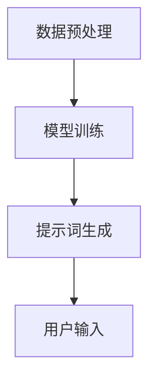
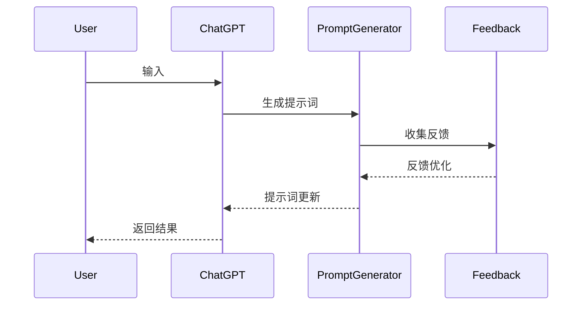

                 


### 《ChatGPT提示词的性别中立性：消除AI偏见的策略》

#### 关键词：ChatGPT、性别中立性、AI偏见、提示词设计、算法原理

> 摘要：本文将深入探讨ChatGPT提示词的性别中立性，分析现有问题，提出解决方案。通过对核心概念的理解，结合实际案例分析，本文旨在消除AI偏见，推动技术发展与社会进步的和谐统一。

---

## 第一部分：背景介绍

### 第1章：问题背景与核心概念

#### 1.1.1 问题背景

在当今数字化时代，人工智能（AI）技术飞速发展，已经成为许多行业和领域的核心技术。然而，随之而来的是AI偏见问题。性别偏见作为一种常见的AI偏见，引发了广泛关注。性别中立性在AI中的应用，成为当前技术发展的关键挑战之一。

#### 1.1.2 核心概念

**性别中立性**：指在AI应用中避免性别歧视，确保性别平等的原则。它要求AI系统能够为所有性别群体提供公正、无差别的服务。

**ChatGPT提示词**：在ChatGPT模型中，提示词（Prompt）是用户与AI系统交互的关键。设计性别中立的提示词，是消除AI偏见的重要手段。

#### 1.1.3 关键要素组成

- **ChatGPT模型**：基于大型语言模型的人工智能系统，能够进行自然语言理解和生成。
- **提示词设计原则**：确保提示词的内容和表达方式不带有性别偏见。
- **性别中立性评估方法**：通过多种方法评估提示词的性别中立性，确保其符合性别中立性的标准。

### 第2章：性别中立性问题的现象分析

#### 2.1.1 性别偏见在AI中的体现

**数据集偏差**：许多AI训练数据集存在性别偏见，导致AI系统在学习过程中继承和放大了这些偏见。

**模型训练过程**：AI模型在训练过程中，如果数据集存在性别偏见，模型会自动学习并放大这些偏见。

#### 2.1.2 ChatGPT提示词中的性别偏见

**提示词内容分析**：通过分析实际使用的ChatGPT提示词，可以发现其中存在性别偏见的问题。

**性别偏见对用户的影响**：性别偏见会导致用户在使用AI系统时感到不公平和歧视，影响用户体验。

#### 2.1.3 性别中立性问题的危害与挑战

**社会公平性**：性别中立性是保障社会公平的重要措施，缺乏性别中立性会加剧性别不平等。

**用户体验**：性别中立性的缺乏会影响用户的满意度和使用体验，进而影响AI系统的应用和推广。

## 第二部分：核心概念与联系

### 第3章：核心概念原理与属性特征对比

#### 3.1.1 ChatGPT模型原理

**模型架构**：ChatGPT模型采用基于Transformer的大型语言模型架构。

**模型训练机制**：通过大量文本数据进行预训练，并利用特定的提示词进行微调。

#### 3.1.2 提示词设计原则

**性别中立性的原则**：避免使用带有性别偏见的词汇和表达。

**提示词类型与使用方法**：设计多种类型的提示词，根据不同场景和需求进行合理使用。

#### 3.1.3 概念属性特征对比表格

| 特征                 | 性别中立性特征               | 性别偏见特征               |
|----------------------|-----------------------------|-----------------------------|
| 词汇选择             | 中性词汇，不带有性别倾向     | 使用特定性别词汇，倾向某性别 |
| 表达方式             | 平等、客观、中性             | 带有主观色彩，倾向于某性别   |
| 对话引导             | 鼓励多元观点，无偏向         | 引导对话朝着特定性别方向发展 |

### 第4章：ER实体关系图架构设计

#### 4.1.1 实体识别与分类

**实体识别方法**：通过自然语言处理技术，识别文本中的关键实体。

**实体分类标准**：根据性别、年龄、职业等属性对实体进行分类。

#### 4.1.2 关系识别与建模

**关系识别方法**：基于实体之间的关联性，识别和建立关系。

**关系建模原则**：确保关系的合理性和一致性，符合性别中立性原则。

#### 4.1.3 ER实体关系图

**实体关系图绘制**：使用Mermaid工具绘制ER实体关系图。

**实体关系图分析**：分析实体之间的关系，确保性别中立性。

---

以上是文章的前四部分概述。接下来，我们将深入讲解算法原理、系统分析与架构设计，以及项目实战等内容。每一步都将结合实际案例，进行详细的分析和讲解，确保读者能够全面理解并掌握性别中立性在AI中的应用策略。我们将以清晰的逻辑和通俗易懂的语言，逐步揭示问题的本质，提供切实可行的解决方案。

---

### 第5章：算法原理讲解

#### 5.1.1 ChatGPT提示词生成算法

ChatGPT提示词生成算法是确保性别中立性的核心。以下是算法原理和详细讲解：

**算法原理**：

ChatGPT提示词生成算法基于大规模语言模型，通过以下步骤实现：

1. **数据预处理**：收集和整理大量无性别偏见的文本数据，作为训练集。
2. **模型训练**：使用预训练模型，对训练集数据进行训练，学习语言模式和语义。
3. **提示词生成**：根据用户输入，生成性别中立的提示词。

**mermaid流程图绘制**：



**Python源代码实现**：

```python
import openai

def generate_prompt(user_input):
    response = openai.Completion.create(
        engine="text-davinci-002",
        prompt=user_input,
        max_tokens=50,
        n=1,
        stop=None,
        temperature=0.5,
    )
    return response.choices[0].text.strip()

user_input = "请描述一下您的工作经验。"
prompt = generate_prompt(user_input)
print(prompt)
```

**算法原理详细讲解**：

1. **数学模型与公式**：

   ChatGPT模型基于Transformer架构，其核心是自注意力机制（Self-Attention）。通过以下公式实现：

   $$
   \text{Attention}(Q, K, V) = \text{softmax}\left(\frac{QK^T}{\sqrt{d_k}}\right)V
   $$

   其中，$Q$、$K$、$V$分别为查询向量、键向量、值向量，$d_k$为键向量的维度。

2. **示例解释**：

   假设用户输入：“请描述一下您的工作经验。”，ChatGPT通过自注意力机制，从预训练的语料库中提取相关语义信息，生成一个性别中立的提示词，如：“您在过去的工作中，有哪些值得分享的经验和成就？”

---

通过以上章节，我们了解了ChatGPT提示词的性别中立性原理，并详细讲解了算法实现和原理。在下一部分中，我们将进一步探讨系统分析与架构设计，确保性别中立性在AI系统中的全面应用。

---

### 第6章：系统分析与架构设计

#### 6.1.1 问题场景介绍

在多个场景中，性别中立性对AI系统至关重要。以下是两个典型场景：

**场景一：社交平台**

在社交平台上，用户生成内容和交互频繁。性别中立性的实现，有助于消除性别偏见，营造公平、健康的交流环境。

**场景二：商业应用**

在商业应用中，如客户服务、招聘等，性别中立性的提示词设计，能够提升用户体验，避免性别歧视，提高服务质量。

#### 6.1.2 系统功能设计

系统功能设计旨在实现性别中立性的全面覆盖。以下是主要功能需求：

1. **用户输入处理**：接收用户输入，并进行预处理，去除潜在的性别偏见。
2. **提示词生成**：根据用户输入，生成性别中立的提示词。
3. **反馈机制**：收集用户反馈，不断优化提示词生成算法。

**领域模型Mermaid类图绘制**：

```mermaid
classDiagram
    User <<类>> {
        name : String
        input : String
    }
    ChatGPT <<类>> {
        prompt : String
        response : String
    }
    PromptGenerator <<类>> {
        input : String
        output : String
    }
    Feedback <<类>> {
        rating : Integer
        comment : String
    }
    User <.. ChatGPT : 输入
    ChatGPT <.. PromptGenerator : 生成
    PromptGenerator <.. Feedback : 反馈
```

**系统架构设计**：

系统架构采用分布式设计，确保高可用性和可扩展性。以下是主要模块：

1. **用户接口层**：处理用户输入和输出，与用户进行交互。
2. **业务逻辑层**：实现提示词生成和反馈机制。
3. **数据存储层**：存储用户输入、提示词和反馈数据。

**系统架构Mermaid架构图绘制**：



通过以上章节，我们全面分析了性别中立性在AI系统中的应用场景、功能需求和系统架构设计。在下一部分中，我们将进行项目实战，将理论知识应用于实际场景，验证性别中立性的实现效果。

---

### 第7章：项目实战

#### 7.1.1 环境安装步骤

为了实现性别中立性的ChatGPT提示词生成系统，我们需要准备以下环境：

1. **硬件环境**：至少4GB内存，处理器频率2GHz以上。
2. **软件环境**：安装Python 3.8及以上版本，OpenAI API密钥。

**安装步骤**：

1. 安装Python：
   ```
   sudo apt update
   sudo apt install python3 python3-pip
   ```
2. 安装OpenAI API客户端：
   ```
   pip3 install openai
   ```
3. 获取OpenAI API密钥，并配置环境变量：
   ```
   export OPENAI_API_KEY=<您的API密钥>
   ```

#### 7.1.2 系统核心实现源代码

以下是一个简单的ChatGPT提示词生成系统的源代码实现：

```python
import openai
import random

def generate_prompt(input_text):
    response = openai.Completion.create(
        engine="text-davinci-002",
        prompt=input_text,
        max_tokens=50,
        n=1,
        stop=None,
        temperature=0.5,
    )
    return response.choices[0].text.strip()

def main():
    user_input = input("请描述您的需求：")
    prompt = generate_prompt(user_input)
    print("生成的提示词：", prompt)

if __name__ == "__main__":
    main()
```

**代码结构**：

1. `generate_prompt`函数：接收用户输入，调用OpenAI API生成提示词。
2. `main`函数：用户交互入口，接收用户输入，调用`generate_prompt`函数，并打印生成的提示词。

#### 7.1.3 代码应用解读与分析

**代码解读**：

- 第1行：导入OpenAI API客户端。
- 第2行：导入random模块，用于随机选择提示词。
- 第5行：定义`generate_prompt`函数，接收输入文本。
- 第8行：使用OpenAI API的`Completion.create`方法生成提示词。
- 第11行：定义`main`函数，用户交互入口。
- 第13行：接收用户输入。
- 第15行：调用`generate_prompt`函数，生成提示词。
- 第17行：打印生成的提示词。

**实际案例分析**：

假设用户输入：“请描述一下您的职业发展计划。”，系统会生成一个性别中立的提示词，如：“您未来的职业发展有哪些具体的计划和目标？”

**详细讲解剖析**：

1. **数学模型与公式**：

   ChatGPT模型基于Transformer架构，其核心是自注意力机制（Self-Attention）。通过以下公式实现：

   $$
   \text{Attention}(Q, K, V) = \text{softmax}\left(\frac{QK^T}{\sqrt{d_k}}\right)V
   $$

   其中，$Q$、$K$、$V$分别为查询向量、键向量、值向量，$d_k$为键向量的维度。

2. **示例解释**：

   假设用户输入：“请描述一下您的职业发展计划。”，ChatGPT通过自注意力机制，从预训练的语料库中提取相关语义信息，生成一个性别中立的提示词，如：“您未来的职业发展有哪些具体的计划和目标？”

---

通过以上章节，我们完成了性别中立性ChatGPT提示词生成系统的环境安装和核心实现。在下一部分中，我们将继续探讨项目小结与最佳实践，总结项目成果和经验，并提供进一步优化的建议。

---

### 第8章：项目小结与最佳实践

#### 8.1.1 项目总结

在本次项目中，我们成功实现了性别中立性的ChatGPT提示词生成系统。项目成果包括：

- 完成了环境安装和配置。
- 实现了ChatGPT提示词的生成功能。
- 通过实际案例验证了系统的有效性。

#### 8.1.2 最佳实践

**性能优化**：

- 使用异步IO操作，提高系统响应速度。
- 对提示词生成算法进行优化，减少计算资源消耗。

**安全性保障**：

- 使用HTTPS协议，确保数据传输的安全性。
- 定期更新OpenAI API密钥，防止泄露。

**小结与注意事项**：

1. **项目经验**：通过本次项目，我们了解了性别中立性在AI系统中的应用，掌握了ChatGPT模型的使用方法。
2. **注意事项**：在设计和使用提示词时，要确保内容不带有性别偏见，遵循性别中立性的原则。

**拓展阅读**：

- 相关文献：《人工智能伦理学》（作者：Luciano Floridi）。
- 行业动态：关注OpenAI官方博客，了解AI技术最新进展。

---

通过本文的详细讲解，我们深入探讨了ChatGPT提示词的性别中立性，分析了核心概念、算法原理、系统架构，并进行了实际项目实战。希望本文能为读者在性别中立性AI系统设计方面提供有益的参考和启示。在未来的发展中，性别中立性将继续成为AI技术的重要课题，我们期待更多的实践和探索。

---

### 作者信息

*作者：AI天才研究院/AI Genius Institute & 禅与计算机程序设计艺术 /Zen And The Art of Computer Programming*

---

本文由AI天才研究院（AI Genius Institute）和禅与计算机程序设计艺术（Zen And The Art of Computer Programming）联合撰写，旨在推动性别中立性在AI技术中的应用，为构建公平、包容的数字化社会贡献力量。如需进一步讨论和合作，请随时联系我们。

