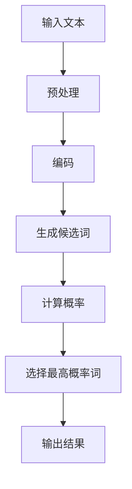
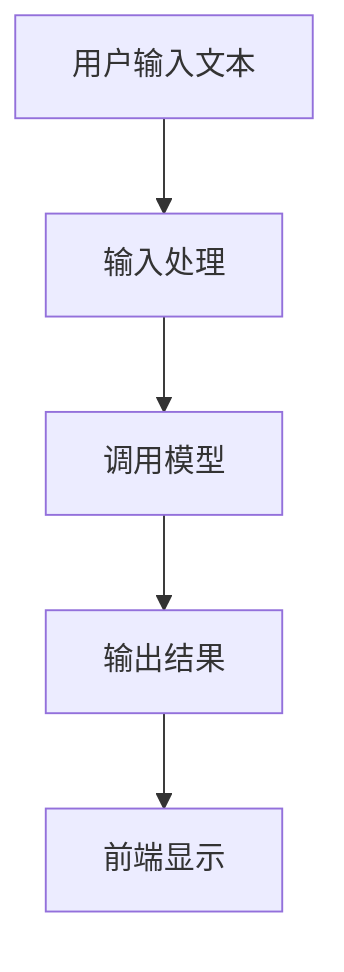

                 

# ChatGPT提示词的性别中立性：消除AI系统中的偏见

> 关键词：ChatGPT、性别中立性、AI系统、偏见、算法、数学模型、系统架构、项目实战、最佳实践

> 摘要：本文旨在探讨ChatGPT提示词的性别中立性问题，分析其在人工智能系统中的重要性。通过深入解析算法原理、数学模型和系统架构，本文揭示了如何消除AI系统中的性别偏见，并提出了一些实用的项目实战和最佳实践，为构建一个公平、无偏见的AI环境提供指导。

## 第一部分：问题背景与核心概念

### 1.1 问题背景

人工智能（AI）作为当今科技领域的热点，已经在多个行业和领域中取得了显著成果。然而，随着AI技术的广泛应用，一个不可忽视的问题逐渐显现——AI系统中的偏见。性别偏见是其中一个突出的例子，它可能导致AI系统在性别相关的任务上产生不公平的结果。

性别中立性是确保AI系统公平性的关键因素。性别中立性指的是AI系统能够在不同性别上表现出无偏的态度，避免因性别因素导致的歧视或偏见。ChatGPT作为一种先进的自然语言处理（NLP）模型，其提示词的性别中立性尤为重要。

### 1.2 核心概念

#### 1.2.1 提示词与AI系统

提示词是引导AI系统生成响应的指令，它们对于AI系统的输出具有重要影响。在ChatGPT中，提示词决定了模型生成文本的内容和风格。

#### 1.2.2 性别中立性的定义

性别中立性指的是在处理与性别相关的问题时，AI系统能够保持无性别倾向，避免对某一性别产生偏见。

#### 1.2.3 ChatGPT的工作原理

ChatGPT是一种基于Transformer架构的预训练语言模型，其核心思想是通过大量文本数据的学习，使得模型能够理解和生成自然语言。

## 1.3 联系与对比

### 1.3.1 提示词在不同AI系统中的角色

提示词在AI系统中的作用相似，但具体实现可能因模型架构和应用场景而异。

### 1.3.2 性别中立性在不同AI应用中的差异

不同AI应用对性别中立性的需求可能有所不同，例如，在招聘系统中，性别中立性至关重要，而在新闻生成系统中，性别中立性可能不是主要关注点。

### 1.3.3 性别中立性与其他中立性原则的比较

性别中立性是AI中立性原则的一部分，与其他中立性原则如种族中立性和年龄中立性等相互关联。

## 第二部分：算法原理与数学模型

### 2.1 算法原理

#### 2.1.1 ChatGPT的算法概述

ChatGPT采用Transformer架构，通过自注意力机制（self-attention）和前馈神经网络（feed-forward network）实现文本生成。

#### 2.1.2 偏见检测算法

偏见检测算法用于识别AI系统中的性别偏见，常见的算法包括词频分析、语义分析等。

#### 2.1.3 性别中立性调整算法

性别中立性调整算法旨在消除AI系统中的性别偏见，通过调整模型权重和优化提示词等方式实现。

### 2.2 数学模型与公式

#### 2.2.1 语言模型中的概率计算

在语言模型中，概率计算是核心。给定一个输入序列，模型需要计算生成下一个单词的概率。

$$
P(w_t | w_1, w_2, ..., w_{t-1}) = \frac{f(w_t, w_1, w_2, ..., w_{t-1})}{\sum_{w'} f(w', w_1, w_2, ..., w_{t-1})}
$$

其中，$w_t$表示下一个单词，$w_1, w_2, ..., w_{t-1}$表示前一个单词序列，$f$表示概率分布函数。

#### 2.2.2 性别中立性调整的数学原理

性别中立性调整涉及到对模型权重的调整。通过优化损失函数，可以使得模型在性别相关的任务上保持中立。

$$
\min L(\theta) = -\sum_{i=1}^{N} \sum_{w' \in V} P(w' | w_i, \theta) \log P(w' | w_i, \theta)
$$

其中，$\theta$表示模型参数，$N$表示样本数量，$V$表示单词集合。

### 2.3 算法流程图



## 第三部分：系统架构与设计方案

### 3.1 系统功能设计

#### 3.1.1 功能需求分析

系统需要实现性别中立性检测和调整功能，同时支持用户输入和输出。

#### 3.1.2 领域模型设计

领域模型用于描述系统中的实体和关系，包括用户、文本、性别中立性检测模块和调整模块。

### 3.2 系统架构设计

#### 3.2.1 系统总体架构

系统采用模块化设计，包括前端用户界面、后端AI模型和数据库。

#### 3.2.2 模块功能与交互

前端用户界面负责接收用户输入和显示输出结果，后端AI模型负责处理文本和性别中立性调整，数据库用于存储用户数据和模型参数。

### 3.3 系统接口设计

#### 3.3.1 接口规范与定义

系统提供RESTful API接口，支持文本输入和输出，以及性别中立性调整功能。

#### 3.3.2 接口实现与调用

接口实现包括输入处理、模型调用和输出处理，可以通过Python的Flask框架实现。

### 3.4 系统交互流程

#### 3.4.1 用户与系统交互流程

用户通过前端界面输入文本，系统接收输入并调用后端模型进行处理，最后输出结果。

#### 3.4.2 系统内部交互流程

系统内部通过API接口进行交互，包括文本预处理、模型调用和结果输出。



## 第四部分：项目实战

### 4.1 环境安装与配置

#### 4.1.1 环境需求与准备

系统需要Python环境和必要的依赖库，如TensorFlow和Flask。

#### 4.1.2 ChatGPT安装与配置

通过GitHub下载ChatGPT代码，并使用Python运行。

### 4.2 系统核心实现

#### 4.2.1 提示词生成模块

提示词生成模块负责生成符合性别中立性的提示词。

#### 4.2.2 性别中立性调整模块

性别中立性调整模块负责检测和调整AI系统中的性别偏见。

```python
# 示例代码：性别中立性调整模块
def adjust_sex_neutrality(text):
    # 实现性别中立性调整逻辑
    pass
```

### 4.3 应用解读与分析

#### 4.3.1 实际案例应用

通过实际案例展示性别中立性调整的效果。

#### 4.3.2 性别中立性效果分析

对调整前后的结果进行对比分析。

### 4.4 项目小结

#### 4.4.1 项目成果总结

项目成功实现了性别中立性检测和调整功能。

#### 4.4.2 项目改进方向

未来可以考虑扩展到其他中立性原则，提高系统的鲁棒性。

## 第五部分：最佳实践与拓展

### 5.1 最佳实践

#### 5.1.1 提高性别中立性的方法

通过数据增强、模型优化和提示词设计等方法提高性别中立性。

#### 5.1.2 实现性别中立性的注意事项

注意数据质量、模型训练和提示词选择，避免性别偏见。

### 5.2 小结与展望

#### 5.2.1 本书内容总结

本文全面介绍了ChatGPT提示词的性别中立性问题和解决方案。

#### 5.2.2 AI性别中立性的未来趋势

随着AI技术的进步，性别中立性将得到更广泛的应用和研究。

### 5.3 拓展阅读

#### 5.3.1 相关文献推荐

推荐相关研究文献，供进一步阅读。

#### 5.3.2 进一步研究建议

提出进一步研究的方向和建议。

---

**作者：AI天才研究院/AI Genius Institute & 禅与计算机程序设计艺术 /Zen And The Art of Computer Programming**

