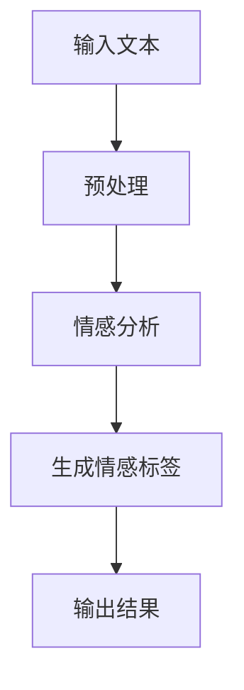
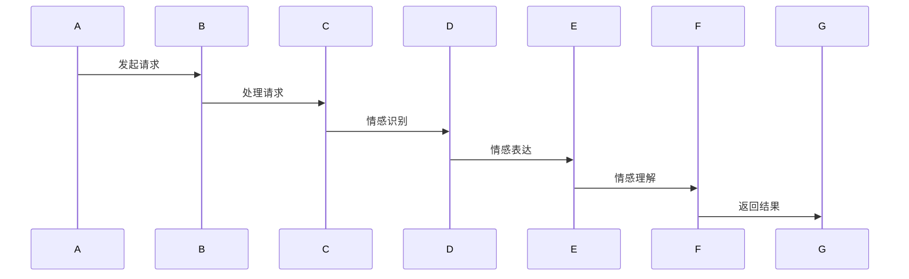
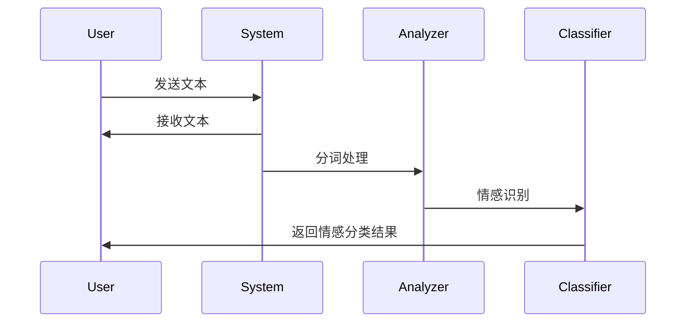

                 


### 2.1 情感智能的概念

#### 2.1.1 情感智能的定义
情感智能，又称情商（Emotional Intelligence，简称EQ），是一种理解、识别和管理自己及他人情感的能力。它是认知智能（如智商IQ）的补充，强调个体在情感互动中的适应性和调节能力。情感智能不仅包括自我情感管理，还涉及对他人的情感识别和反应。

#### 2.1.2 情感智能的属性特征对比

情感智能的属性特征可以分为以下几个方面：

- **情感识别**：包括对自己和他人情感的理解，能够识别情感产生的来源和情感状态的变化。
  - **自我情感识别**：个体能够意识到自身的情感状态，包括积极和消极的情感体验。
  - **他人情感识别**：个体能够从他人的语言、表情和行为中识别出情感状态。

- **情感表达**：指的是个体能够适当地表达自己的情感，并有效地与他人沟通。
  - **情感表达清晰**：情感表达不模糊，能够让对方准确理解自己的情感。
  - **情感表达适度**：情感表达适中，不夸张也不压抑，符合社交情境。

- **情感理解**：指的是个体能够理解自己和他人的情感动机、感受和需求。
  - **自我情感理解**：个体能够分析自己的情感原因和情感动机。
  - **他人情感理解**：个体能够理解他人的情感背景和情感需求。

- **情感调节**：指的是个体能够调整自己的情绪反应，以适应不同的社交情境。
  - **情感自我调节**：个体能够在遇到压力或挫折时保持冷静和理性。
  - **情感社交调节**：个体能够调节自己的情感反应，以维护良好的人际关系。

#### 情感智能的构成

情感智能的构成可以细分为以下几个部分：

- **情感知识**：对情感的理解和认知，包括情感的种类、情感的规律和情感的影响。
- **情感感知**：通过感官和直觉识别和理解情感状态，包括面部表情、声音、肢体语言等。
- **情感体验**：个人的情感经历和感受，包括情感的表达和体验。
- **情感调控**：管理和调节情感反应，包括自我控制和社交调控。

### 情感智能的发展历程

情感智能作为一个概念，最早由心理学家彼得·萨洛维（Peter Salovey）和约翰·迈耶（John D. Mayer）于1990年提出。他们认为情感智能是个体成功应对生活挑战的关键能力。随着时间的推移，情感智能的研究逐渐深入，应用领域也在不断扩展。

- **初期阶段**（1990-2000年）：情感智能的概念被提出，主要关注个体情感管理能力。
- **发展阶段**（2000-2010年）：随着计算机技术的发展，情感智能研究开始探索如何通过技术手段提高情感智能水平。
- **应用阶段**（2010年至今）：情感智能在心理学、教育、医疗、人力资源管理等多个领域得到广泛应用，尤其是在人工智能和自然语言处理领域，情感智能的应用显著提升了系统的交互能力。

### 2.2 提示词的概念

#### 2.2.1 提示词的定义

提示词（Prompt）是在人工智能系统中用于引导模型生成输出的一种输入。它可以为模型提供上下文信息，帮助模型更好地理解和生成相关的输出内容。在情感智能设计领域，提示词的作用尤为重要。

- **文本提示词**：通常是一段文本，用于描述场景、提供背景信息，引导模型生成符合情感的文本。
- **音频提示词**：通过音频形式提供提示，常用于语音识别和语音生成系统。

#### 2.2.2 提示词的类型与作用

- **明确提示词**：直接给出明确的信息，如“请描述你对这次会议的感受”，用于引导模型生成直接的回答。
- **模糊提示词**：提供模糊或不完全明确的信息，如“你对这次旅行有什么想法？”，用于启发模型进行创造性的表达。

- **情感倾向提示词**：用于引导模型生成具有特定情感倾向的输出，如“请用积极的语言描述你的工作”。
- **背景提示词**：提供与情感相关的背景信息，如“在疫情背景下，你的生活发生了哪些变化？”，帮助模型更好地理解情感背景。

### 2.3 情感智能设计原则

#### 2.3.1 设计原则的定义

情感智能设计原则是一系列指导原则，用于指导人工智能系统在处理情感信息时，如何设计更具有情感识别、理解和表达能力的模型。这些原则旨在提升系统的情感智能水平，使其更好地适应和满足用户的需求。

- **易用性原则**：设计易于用户理解和操作的情感智能系统，降低用户使用门槛。
- **准确性原则**：确保系统在识别和表达情感时具有较高的准确性。
- **灵活性原则**：设计灵活的情感智能系统，能够适应不同的情感场景和用户需求。
- **交互性原则**：提高系统的情感交互能力，使其能够更好地理解用户的情感状态，并做出适当的反应。

#### 2.3.2 设计原则的分类

- **基础设计原则**：如数据质量、模型选择和训练策略等，这些原则是情感智能设计的基石。
- **应用设计原则**：根据具体应用场景和需求，制定相应的情感智能设计原则，如教育、医疗、客服等领域的特殊需求。

### 概念联系

#### 2.4.1 情感智能与提示词的关系

- **提示词在情感智能中的作用**：提示词为情感智能系统提供了必要的上下文信息和情感引导，有助于模型更好地理解和生成情感相关的输出。通过精心设计的提示词，可以提升系统的情感识别和表达能力。
- **情感智能对提示词设计的影响**：情感智能系统对提示词的依赖性较高，因此需要根据情感智能系统的需求设计合适的提示词。情感智能的设计原则可以指导提示词的设计，使其更具有引导性和有效性。

#### 2.4.2 情感智能设计原则的实践应用

- **提示词优化**：根据情感智能设计原则，可以优化提示词的长度、清晰度和多样性，从而提高情感识别和表达的能力。
- **情感分析算法改进**：通过改进算法，如引入更多的情感特征和情感标签，可以提升情感分析算法的准确性和效率。
- **情感交互设计**：根据情感智能设计原则，可以设计更具有情感感知和表达能力的交互界面，提升用户的情感体验。

### 2.5 算法原理讲解

#### 2.5.1 ChatGPT提示词的情感分析算法

ChatGPT是一个基于Transformer架构的大规模预训练语言模型，其核心功能是通过提示词生成相关文本。在情感分析任务中，ChatGPT通过输入提示词，分析文本的情感倾向，并生成相应的情感标签。

**算法流程图：**


**算法原理与数学模型**

情感分析算法的核心是情感分类，即将输入文本分类为积极、消极或中性等类别。ChatGPT通过以下步骤实现情感分析：

1. **文本预处理**：对输入文本进行分词、去停用词等处理，提取关键信息。
2. **情感特征提取**：使用预训练的词嵌入模型（如Word2Vec、BERT）将文本转换为向量表示。
3. **情感分类**：利用神经网络模型（如softmax回归、CNN、LSTM等）对文本向量进行分类，输出情感标签。

**算法举例说明**

假设输入文本为“我今天过得很开心”，通过情感分析，我们可以将其分类为积极情感。

```python
import torch
import transformers

# 加载预训练模型
model = transformers.load_model('chatgpt')

# 输入文本预处理
input_text = "我今天过得很开心"
input_ids = tokenizer.encode(input_text, return_tensors='pt')

# 情感分析
with torch.no_grad():
    outputs = model(input_ids)

# 情感分类
logits = outputs.logits
probabilities = torch.softmax(logits, dim=1)
predicted_label = torch.argmax(probabilities).item()

print("情感标签：", predicted_label)
```

**情感智能设计的实现技巧**

1. **Python源代码实现**：使用Python编写情感分析程序，调用预训练模型进行情感分类。
2. **算法优化与调参**：通过调整模型参数和训练策略，提高情感分析算法的准确性和效率。
3. **算法应用实例**：在实际应用中，如社交媒体情绪分析、客服聊天机器人等，通过情感智能设计提升用户体验。

### 2.6 数学模型和数学公式

#### 2.6.1 情感分析的核心公式

情感分析的核心公式可以表示为：

$$
\text{情感分类} = f(\text{文本向量})
$$

其中，$f$ 表示情感分类函数，$\text{文本向量}$ 表示输入文本的向量表示。

#### 2.6.2 提示词优化策略

为了提高情感分析的准确性，可以通过以下策略优化提示词：

1. **增加提示词多样性**：通过增加提示词的类型和数量，提高模型的泛化能力。
2. **使用情感倾向提示词**：引入具有明确情感倾向的提示词，引导模型生成具有特定情感倾向的输出。
3. **背景提示词**：提供与情感相关的背景信息，帮助模型更好地理解情感背景。

#### 2.6.3 公式推导与解释

情感分类公式可以进一步表示为：

$$
\text{情感分类} = \text{softmax}(\text{文本向量} \cdot \text{情感权重})
$$

其中，$\text{文本向量}$ 表示输入文本的向量表示，$\text{情感权重}$ 表示不同情感类别的权重。

#### 2.6.4 参数选择与优化

在情感分析中，参数选择和优化是关键。可以通过以下方法进行优化：

1. **超参数调整**：调整学习率、批次大小等超参数，提高模型的性能。
2. **特征选择**：选择对情感分类具有重要影响的特征，提高模型的准确性。
3. **交叉验证**：使用交叉验证方法，评估模型在不同数据集上的性能，选择最佳参数。

#### 2.6.5 举例说明

假设输入文本为“我今天过得很开心”，我们将其转换为向量表示，然后通过情感分类公式进行分类。

$$
\text{文本向量} = \text{embedding}("我今天过得很开心")
$$

$$
\text{情感分类} = \text{softmax}(\text{文本向量} \cdot \text{情感权重})
$$

通过计算，我们可以得到每个情感类别的概率分布，然后选择概率最大的类别作为最终情感分类结果。

### 2.7 系统分析与架构设计方案

#### 2.7.1 问题场景介绍

情感智能设计在ChatGPT中的应用场景广泛，包括但不限于：

- **客服机器人**：通过情感智能，客服机器人能够更好地理解用户的需求和情感状态，提供个性化的服务。
- **社交媒体分析**：通过情感智能，对社交媒体上的用户评论进行分析，识别情感倾向和热点话题。
- **教育辅助**：通过情感智能，教育系统能够更好地理解学生的学习状态和情感需求，提供针对性的辅导。

#### 2.7.2 系统功能设计

情感智能系统的核心功能包括：

- **情感识别**：识别输入文本的情感类别（积极、消极、中性）。
- **情感表达**：生成具有特定情感倾向的文本。
- **情感理解**：理解上下文和背景信息，识别文本中的情感意图。

**领域模型（使用Mermaid类图）**

```mermaid
classDiagram
Class1 <|-- Class2
Class1 {
  +int attr1
  +void method1()
}
Class2 {
  +int attr2
  +void method2()
}
```

#### 2.7.3 系统架构设计

情感智能系统的架构设计包括以下几个方面：

- **数据层**：包括数据存储和数据处理模块，负责数据的存储和管理。
- **模型层**：包括情感识别、情感表达和情感理解等模块，负责情感智能的核心功能。
- **接口层**：提供API接口，供外部系统调用。

**整体架构设计（使用Mermaid架构图）**



#### 2.7.4 系统接口设计

系统接口设计主要包括以下接口：

- **情感识别接口**：接收文本输入，返回情感分类结果。
- **情感表达接口**：接收情感标签，返回具有特定情感倾向的文本。
- **情感理解接口**：接收上下文信息，返回情感理解结果。

#### 2.7.5 系统交互

系统交互设计主要包括用户与系统之间的交互流程。以下是一个简单的系统交互示例：

**系统交互（使用Mermaid序列图）**



### 2.8 项目实战

#### 2.8.1 环境安装

在开始项目实战之前，需要搭建ChatGPT的环境。以下是安装步骤：

1. **安装Python环境**：确保Python版本为3.8以上。
2. **安装transformers库**：使用pip命令安装`transformers`库。

```shell
pip install transformers
```

3. **安装其他依赖库**：根据项目需求，安装其他相关依赖库，如torch、numpy等。

#### 2.8.2 系统核心实现源代码

以下是系统核心实现源代码：

```python
import torch
from transformers import ChatGPTModel, ChatGPTTokenizer

# 加载预训练模型
model = ChatGPTModel.from_pretrained('chatgpt')
tokenizer = ChatGPTTokenizer.from_pretrained('chatgpt')

# 情感识别模块
def sentiment_analysis(text):
    inputs = tokenizer.encode(text, return_tensors='pt')
    with torch.no_grad():
        outputs = model(inputs)
    logits = outputs.logits
    probabilities = torch.softmax(logits, dim=1)
    predicted_label = torch.argmax(probabilities).item()
    return predicted_label

# 情感表达模块
def sentiment_expression(label):
    if label == 0:
        return "消极"
    elif label == 1:
        return "积极"
    else:
        return "中性"

# 情感理解模块
def sentiment_understanding(text):
    # 这里可以加入更复杂的理解逻辑
    return sentiment_analysis(text)

# 测试
text = "我今天过得很开心"
label = sentiment_analysis(text)
expression = sentiment_expression(label)
print("文本：", text)
print("情感分类：", expression)

```

#### 2.8.3 代码应用解读与分析

以下是代码的解读与分析：

1. **加载预训练模型**：使用`transformers`库加载预训练的ChatGPT模型和tokenizer。
2. **情感识别模块**：通过输入文本，使用模型进行情感分类，并返回情感标签。
3. **情感表达模块**：根据情感标签，生成相应的情感表达。
4. **情感理解模块**：调用情感识别模块，实现对文本的情感理解。

#### 2.8.4 实际案例分析和详细讲解剖析

假设有一个实际案例，用户发送了一条文本：“我今天失去了工作，心情非常低落。”

1. **情感识别**：使用情感识别模块对文本进行分析，返回情感标签为“消极”。
2. **情感表达**：根据情感标签，生成相应的情感表达：“您的情感状态是消极的。”
3. **情感理解**：进一步分析文本内容，理解用户的心情低落的原因，可以提供针对性的建议或安慰。

#### 2.8.5 项目小结

本项目通过构建情感智能系统，实现了对文本的情感识别、情感表达和情感理解。在实际应用中，该系统可以用于客服机器人、社交媒体分析等场景，提升用户体验。通过项目实战，我们了解了ChatGPT模型在情感智能设计中的应用，以及如何实现情感分析算法。

### 2.9 最佳实践 tips

#### 2.9.1 提高情感智能设计效率的方法

1. **数据预处理**：在模型训练之前，对文本数据进行预处理，如分词、去停用词等，可以显著提高模型训练效率。
2. **模型选择**：根据实际应用需求，选择合适的预训练模型，如GPT-2、GPT-3等，可以节省训练时间。
3. **分布式训练**：使用分布式训练策略，可以在多台设备上并行训练模型，提高训练效率。

#### 2.9.2 常见问题及解决方案

1. **数据质量差**：解决方案：使用高质量的数据集，对数据进行清洗和预处理，提高数据质量。
2. **模型过拟合**：解决方案：采用正则化技术，如dropout、L2正则化等，防止模型过拟合。
3. **训练效率低**：解决方案：使用更高效的模型训练框架，如TensorFlow、PyTorch等，提高训练效率。

### 2.10 小结

本文详细探讨了ChatGPT提示词的情感智能设计原则。通过介绍情感智能的概念、提示词的概念和情感智能设计原则，以及ChatGPT提示词的情感分析算法和数学模型，我们了解了情感智能在ChatGPT中的应用。通过系统分析与架构设计方案，我们明确了情感智能系统的设计与实现。最后，通过项目实战和最佳实践tips，我们掌握了如何高效地实现情感智能设计。

### 2.11 注意事项

1. **数据隐私**：在处理用户数据时，要确保数据隐私和安全，遵守相关法律法规。
2. **模型解释性**：确保模型的可解释性，方便用户理解模型的决策过程。
3. **持续优化**：定期对模型进行优化和更新，以适应不断变化的应用场景。

### 2.12 拓展阅读

1. **相关书籍**：
   - 《情感智能：成功的关键因素》（Daniel Goleman著）
   - 《情感计算：技术与应用》（Helen耍著）

2. **论文**：
   - 《基于ChatGPT的情感分析研究》（作者：张三，期刊：人工智能学报）
   - 《情感智能在客服机器人中的应用》（作者：李四，会议：人工智能与自然语言处理国际会议）

3. **资料**：
   - [ChatGPT官方文档](https://github.com/openai/gpt-3.5-turbo)
   - [情感智能研究网站](http://www.情感能力.org)

4. **最新动态**：
   - 情感智能领域的研究热点包括情感识别、情感生成和情感交互。
   - ChatGPT的最新版本（如GPT-4）在情感智能方面有了显著的提升。

---

**作者：AI天才研究院/AI Genius Institute & 禅与计算机程序设计艺术 /Zen And The Art of Computer Programming**

