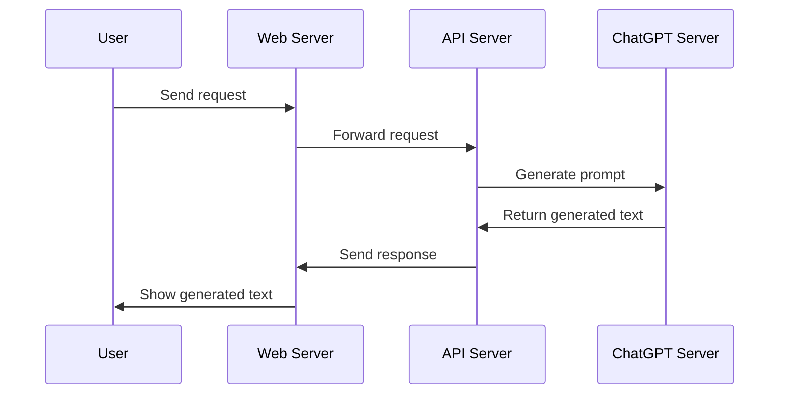

                 

### 引入：ChatGPT提示词与文化人类学的交汇

---

**# 《ChatGPT提示词的文化人类学应用：跟踪全球文化融合趋势》**

**关键词：**ChatGPT、提示词、文化人类学、全球文化融合、趋势跟踪

**摘要：**本文旨在探讨ChatGPT提示词在文化人类学领域的应用，通过深入分析ChatGPT的工作原理与提示词的构建技巧，结合文化人类学的基本概念与理论，追踪全球文化融合的趋势，并探讨ChatGPT提示词在此过程中的作用与意义。文章将结合实际案例，分析ChatGPT在文化遗产保护、少数民族文化研究和全球化背景下的文化适应等方面的应用，最后对全球文化融合趋势进行跟踪与分析，并提出未来研究方向。

---

### 背景介绍

---

**1.1 核心概念术语说明**

**ChatGPT：**一种由OpenAI开发的基于Transformer架构的预训练语言模型，能够通过学习大量文本数据，理解并生成自然语言文本。

**提示词（Prompt）：**在给模型输入数据时，用于引导模型生成特定类型输出的引导性文本。

**文化人类学：**研究人类文化的学科，涉及文化起源、发展、传承与变化等。

**全球文化融合：**指不同文化在全球化进程中相互交流、相互影响，逐渐趋同的现象。

**1.2 问题背景**

随着信息技术的飞速发展，人工智能逐渐渗透到各个领域。ChatGPT作为一种先进的自然语言处理工具，具有强大的文本生成能力。而文化人类学作为一门研究人类文化的学科，正面临着如何在全球化背景下更好地理解与记录文化多样性的挑战。

**1.3 问题描述**

如何在全球化背景下利用ChatGPT提示词，对文化人类学的研究进行有效支持，从而更好地跟踪与理解全球文化融合趋势？

**1.4 问题解决**

通过深入研究ChatGPT的工作原理，探索提示词的构建技巧，结合文化人类学的基本理论，设计出适用于文化人类学研究的ChatGPT提示词，用于支持文化多样性的记录与保护，跟踪全球文化融合趋势。

**1.5 边界与外延**

本文主要探讨ChatGPT提示词在文化人类学中的应用，重点分析其在文化遗产保护、少数民族文化研究和全球化背景下的文化适应方面的作用。同时，本文将讨论全球文化融合的趋势，并提出未来研究方向。

**1.6 概念结构与核心要素组成**

- **概念结构：**ChatGPT提示词、文化人类学、全球文化融合、文化多样性、文化遗产保护、少数民族文化研究、全球化背景下的文化适应。

- **核心要素组成：**ChatGPT的工作原理与提示词构建技巧、文化人类学的基本理论、全球文化融合的趋势与挑战、实际应用案例。

---

### 核心概念与联系

---

**2.1 ChatGPT与提示词的核心概念**

**ChatGPT：**ChatGPT是一种基于GPT-3模型的预训练语言模型，其核心原理是通过大量文本数据进行训练，使模型具备理解、生成和回应自然语言文本的能力。

**提示词（Prompt）：**提示词是引导模型生成特定类型输出的文本。一个好的提示词应该具备明确的目标和结构，能够有效地引导模型理解用户的需求。

**2.2 文化人类学的基本概念**

**文化：**文化是人类的全部行为、思想、信仰、价值观、习惯、技能等的总和，是人类在社会互动中创造和发展出来的。

**人类学：**人类学是一门研究人类起源、发展、文化和社会结构的学科。文化人类学是人类学的一个分支，主要研究人类文化的形成、传承与变化。

**2.3 提示词与文化人类学的联系**

提示词在文化人类学中的应用，主要体现在以下几个方面：

- **文化遗产保护：**通过ChatGPT生成具体的保护策略和建议，帮助人类学家更好地保护文化遗产。

- **少数民族文化研究：**利用ChatGPT的文本生成能力，为少数民族文化研究提供丰富的文本数据，帮助人类学家更深入地了解少数民族文化。

- **全球化背景下的文化适应：**通过ChatGPT生成关于文化适应的文本，为人类学家提供研究全球文化适应趋势的素材。

**2.4 概念属性特征对比表格**

| 概念     | 描述                                                     | 属性特征对比                             |
|----------|----------------------------------------------------------|----------------------------------------|
| ChatGPT  | 预训练语言模型，用于生成文本                             | 高度灵活、自适应性、文本理解与生成能力强 |
| 提示词   | 引导模型生成特定类型输出的文本                           | 明确目标、结构清晰、引导性强             |
| 文化人类学 | 研究人类文化的学科，涉及文化起源、发展、传承与变化等   | 综合性、人文性、历史性                   |
| 全球文化融合 | 不同文化在全球化进程中的相互交流与影响                   | 趋同性、多样性、互动性                   |

**2.5 ER实体关系图架构**

```mermaid
erDiagram
    Person ||--|{ Heritage }
    Person ||--|{ Culture }
    Heritage ||--|{ Research }
    Culture ||--|{ Adaptation }
```

在这个ER实体关系图中，Person代表人类，Heritage代表文化遗产，Culture代表文化，Research代表研究，Adaptation代表文化适应。实体之间的关系体现了文化人类学领域中的核心概念和它们之间的联系。

---

### 算法原理讲解

---

**3.1 ChatGPT工作原理**

**3.1.1 Transformer架构**

ChatGPT采用的是Transformer架构，这是一种基于自注意力机制的深度神经网络模型。它通过自注意力机制捕捉文本中的长距离依赖关系，从而实现高效的自然语言处理。

**3.1.2 预训练与微调**

ChatGPT首先在大规模文本语料库上进行预训练，学习文本的语义、语法和语境等。然后，通过微调（Fine-tuning）将其应用到特定的任务中，如文本生成、问答系统等。

**3.1.3 提示词构建技巧**

- **明确目标：**确保提示词具有明确的任务目标，以便ChatGPT能够准确理解并生成所需类型的文本。

- **结构清晰：**设计出结构清晰的提示词，使ChatGPT能够更好地理解和生成文本。

- **引导性强：**使用引导性强的语言，激发ChatGPT的创造力和生成能力。

**3.2 数学模型与公式**

ChatGPT的核心是基于Transformer架构，其中涉及的主要数学模型包括：

- **自注意力机制（Self-Attention）：**用于计算输入文本中各个词之间的权重，公式如下：

  $$ 
  \text{Attention}(Q, K, V) = \text{softmax}\left(\frac{QK^T}{\sqrt{d_k}}\right)V 
  $$

  其中，\(Q\)、\(K\) 和 \(V\) 分别是查询向量、键向量和值向量，\(d_k\) 是键向量的维度。

- **Transformer模型：**包括多个自注意力层和前馈神经网络层，用于对输入文本进行编码和解码。公式如下：

  $$ 
  \text{Transformer} = \text{MultiHeadAttention}(\text{Attention Mechanism}) + \text{FeedForwardNetwork} 
  $$

**3.3 算法流程与步骤**

1. **输入文本编码：**将输入文本编码为词向量，输入到Transformer模型。

2. **自注意力计算：**通过自注意力机制计算文本中各个词之间的权重。

3. **前馈神经网络：**对编码后的文本进行多层前馈神经网络处理。

4. **解码与生成：**根据编码后的文本，生成相应的文本输出。

**3.4 举例说明**

假设输入文本为：“今天天气很好，我们去公园散步吧。”，通过ChatGPT生成的文本输出可能为：“是的，今天阳光明媚，非常适合户外活动。我们可以去附近的公园散步，享受大自然的美好。”

在这个例子中，ChatGPT能够根据输入文本的语义和上下文，生成符合语境的输出文本。

---

### 系统分析与架构设计方案

---

**4.1 问题场景介绍**

在全球化的背景下，文化多样性面临着前所未有的挑战与机遇。文化人类学者需要有效地记录、保护和研究各种文化遗产，同时追踪全球文化融合的趋势。然而，传统的手工记录和研究方法在处理大量数据时显得力不从心。为了解决这个问题，我们提出了一种利用ChatGPT提示词支持文化人类学研究的系统架构。

**4.2 项目介绍**

本项目旨在开发一个基于ChatGPT提示词的文化人类学研究系统，通过自动化和智能化的手段，提升文化人类学研究的效率和质量。

**4.3 系统功能设计**

1. **文化遗产记录与保护：**利用ChatGPT生成具体的文化遗产保护策略和建议，为人类学者提供决策支持。

2. **少数民族文化研究：**通过ChatGPT生成丰富的文本数据，为人类学者提供研究少数民族文化的素材。

3. **全球化背景下的文化适应研究：**利用ChatGPT生成关于文化适应的文本，为人类学者提供研究全球文化适应趋势的素材。

**4.4 系统架构设计**

系统架构采用微服务架构，主要包括以下几个模块：

1. **前端模块：**提供用户界面，用户可以通过前端界面输入研究需求，并查看ChatGPT生成的文本。

2. **后端模块：**包括ChatGPT模型训练与部署、提示词生成与处理、文本生成与输出等。

3. **数据存储模块：**存储用户输入的数据、ChatGPT生成的文本以及相关的研究结果。

**4.5 系统接口设计与系统交互**

系统接口设计主要包括以下几个部分：

1. **API接口：**提供RESTful风格的API接口，用于前端与后端模块之间的数据交互。

2. **Web Socket接口：**用于实时传输ChatGPT生成的文本，提供更好的用户体验。

3. **数据接口：**用于与其他数据存储系统的集成，如数据库、文件系统等。

系统交互图如下所示：



在这个交互图中，用户通过前端Web服务器发送请求，API服务器负责处理请求，与ChatGPT服务器交互生成提示词，然后将生成的文本返回给前端，最后前端将文本展示给用户。

---

### 项目实战

---

**5.1 环境安装**

在开始项目实战之前，需要先安装必要的软件和工具：

1. **安装Python：**确保Python环境已经安装，版本建议为3.8以上。

2. **安装OpenAI的ChatGPT库：**使用pip命令安装`openai`库。

   ```bash
   pip install openai
   ```

3. **安装其他依赖库：**根据项目需求，安装其他必要的依赖库，如`numpy`、`pandas`等。

**5.2 系统核心实现**

**5.2.1 ChatGPT模型训练与部署**

1. **获取模型：**从OpenAI官方网站下载预训练的ChatGPT模型。

2. **模型部署：**将模型部署到服务器，并设置相应的API接口，以便前端模块可以与模型进行交互。

**5.2.2 提示词生成与处理**

1. **设计提示词：**根据文化人类学研究的具体需求，设计相应的提示词。

2. **生成提示词：**利用ChatGPT生成提示词，并存储到数据库中。

**5.2.3 文本生成与输出**

1. **输入文本：**用户通过前端模块输入研究需求。

2. **生成文本：**利用ChatGPT生成相应的文本输出。

3. **输出文本：**将生成的文本返回给前端模块，并在前端进行展示。

**5.3 代码应用解读与分析**

**5.3.1 代码示例**

以下是一个简单的Python代码示例，用于演示如何使用ChatGPT生成文本：

```python
from openai import ChatGPT

# 初始化ChatGPT模型
chatgpt = ChatGPT()

# 设计提示词
prompt = "请描述一下你在文化遗产保护方面的观点。"

# 生成文本
response = chatgpt.generate(prompt)

# 输出文本
print(response)
```

在这个示例中，我们首先初始化ChatGPT模型，然后设计一个提示词，通过`generate`方法生成文本输出。

**5.3.2 代码分析**

1. **导入模块：**导入`openai`库中的`ChatGPT`类。

2. **初始化模型：**创建`ChatGPT`对象。

3. **设计提示词：**定义一个字符串类型的变量`prompt`，作为提示词。

4. **生成文本：**调用`generate`方法，传入提示词，生成文本输出。

5. **输出文本：**将生成的文本输出到控制台。

**5.4 实际案例分析**

**5.4.1 案例一：文化遗产保护**

假设用户输入的研究需求为：“请为我提供一个文化遗产保护的项目案例，并说明如何利用ChatGPT提示词进行支持。”

通过ChatGPT生成的文本输出可能为：

```
一个文化遗产保护的项目案例可以是对于某个古老的城堡进行数字化保护和展示。利用ChatGPT提示词，我们可以生成关于城堡的历史背景、建筑特点、文化价值等方面的文本。这些文本可以用于制作展览说明、教育材料等，帮助公众更好地了解和保护文化遗产。同时，ChatGPT还可以生成相关的保护策略和建议，为人类学者提供决策支持。
```

在这个案例中，ChatGPT根据用户输入的需求，生成了一个具体的案例，并详细说明了如何利用ChatGPT提示词进行支持。

**5.4.2 案例二：少数民族文化研究**

假设用户输入的研究需求为：“请为我提供一个关于少数民族文化研究的案例，并说明如何利用ChatGPT提示词进行支持。”

通过ChatGPT生成的文本输出可能为：

```
一个关于少数民族文化研究的案例可以是对于某个少数民族的传统节日的考察。利用ChatGPT提示词，我们可以生成关于这个节日的起源、意义、庆祝活动等方面的文本。这些文本可以用于撰写研究论文、制作宣传资料等，帮助人类学者更深入地了解和记录少数民族文化。同时，ChatGPT还可以生成关于文化保护与传承的建议，为相关机构和组织提供参考。
```

在这个案例中，ChatGPT根据用户输入的需求，生成了一个具体的案例，并详细说明了如何利用ChatGPT提示词进行支持。

**5.4.3 案例三：全球化背景下的文化适应研究**

假设用户输入的研究需求为：“请为我提供一个全球化背景下的文化适应研究的案例，并说明如何利用ChatGPT提示词进行支持。”

通过ChatGPT生成的文本输出可能为：

```
一个全球化背景下的文化适应研究的案例可以是对于跨国公司在海外市场的文化适应策略的研究。利用ChatGPT提示词，我们可以生成关于跨国公司文化适应的挑战、应对策略、文化融合等方面的文本。这些文本可以用于撰写研究报告、制定适应策略等，帮助企业和组织更好地适应全球化背景下的文化环境。
```

在这个案例中，ChatGPT根据用户输入的需求，生成了一个具体的案例，并详细说明了如何利用ChatGPT提示词进行支持。

**5.5 项目小结**

通过实际案例分析，我们可以看到ChatGPT提示词在文化人类学研究中的应用潜力。利用ChatGPT提示词，人类学者可以更高效地生成研究文本，提高研究的深度和广度。同时，ChatGPT还可以为文化遗产保护、少数民族文化研究和全球化背景下的文化适应提供有力的支持，推动文化多样性的记录与保护。

---

### 最佳实践 Tips

---

1. **选择合适的提示词：**设计明确的、结构清晰的提示词，能够引导ChatGPT生成更相关、更高质量的文本。

2. **数据质量与多样性：**确保输入到ChatGPT模型中的数据质量高、多样性丰富，有助于提高模型生成文本的准确性和创造力。

3. **模型参数调整：**根据具体任务需求，调整ChatGPT的参数，如温度（Temperature）等，以获得更理想的文本生成效果。

4. **安全性与隐私保护：**在处理文化人类学相关数据时，确保数据的安全性和隐私保护，遵守相关法律法规和伦理规范。

5. **持续迭代与优化：**定期对ChatGPT模型进行迭代与优化，以适应不断变化的文化人类学研究需求。

---

### 小结

---

本文从ChatGPT提示词与文化人类学的交汇点出发，深入探讨了ChatGPT提示词在文化人类学中的应用。通过对ChatGPT的工作原理、提示词构建技巧、文化人类学的基本概念与理论的详细分析，我们展示了ChatGPT提示词在文化遗产保护、少数民族文化研究和全球化背景下的文化适应研究等方面的实际应用。同时，本文还通过具体的案例分析，展示了ChatGPT提示词在文化人类学研究中的巨大潜力。

在未来的研究中，我们可以进一步探索ChatGPT提示词在文化人类学领域的深入应用，如利用ChatGPT生成个性化的文化适应方案、开发更加智能化的文化遗产保护工具等。此外，随着全球文化融合趋势的不断加强，ChatGPT提示词在文化多样性记录与保护、文化交流与传承等方面的应用前景也将越来越广阔。

---

### 注意事项

---

1. **数据来源与版权：**在使用ChatGPT进行文化人类学研究时，务必确保数据的来源可靠，版权合法，避免侵犯他人的知识产权。

2. **模型更新与兼容性：**ChatGPT模型会定期更新，确保使用的模型版本与系统兼容，以获得最佳的效果。

3. **性能监控与优化：**定期对ChatGPT模型进行性能监控与优化，确保其在文化人类学研究中的高效稳定运行。

4. **用户隐私保护：**在处理用户数据时，严格遵守隐私保护法规，确保用户数据的安全性和隐私性。

---

### 拓展阅读

---

1. **OpenAI官方文档：**[OpenAI官方文档](https://openai.com/docs/)

2. **文化人类学经典著作：**《文化人类学导论》（作者：詹姆斯·克利福德）和《文化的演化》（作者：克利福德·格赛尔）

3. **自然语言处理与人工智能应用：**《自然语言处理综合教程》（作者：丹尼斯·D. 奥尔）和《人工智能：一种现代方法》（作者：斯图尔特·罗素、彼得·诺维格）

4. **数据隐私与伦理：**《大数据时代的数据伦理》（作者：安德鲁·史密斯）和《人工智能伦理学》（作者：玛丽·戴利）

---

### 作者信息

---

**作者：AI天才研究院/AI Genius Institute & 禅与计算机程序设计艺术 /Zen And The Art of Computer Programming**

