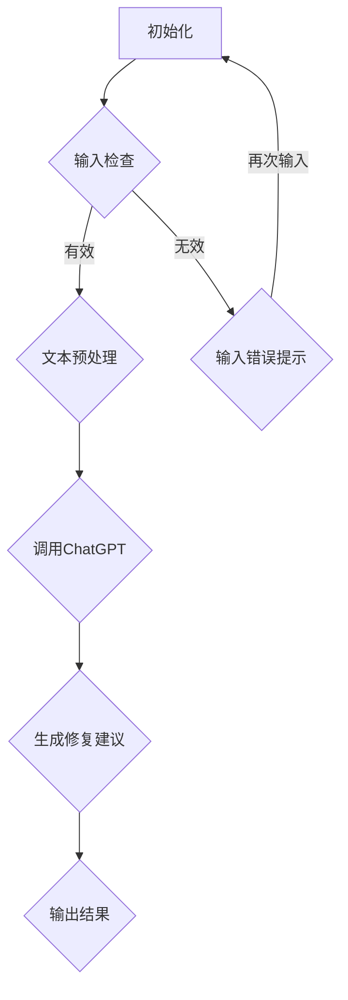
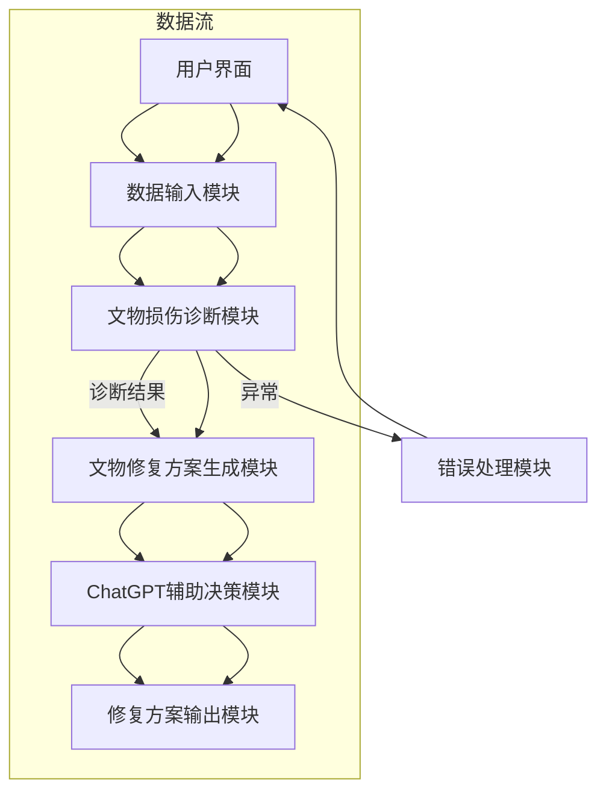
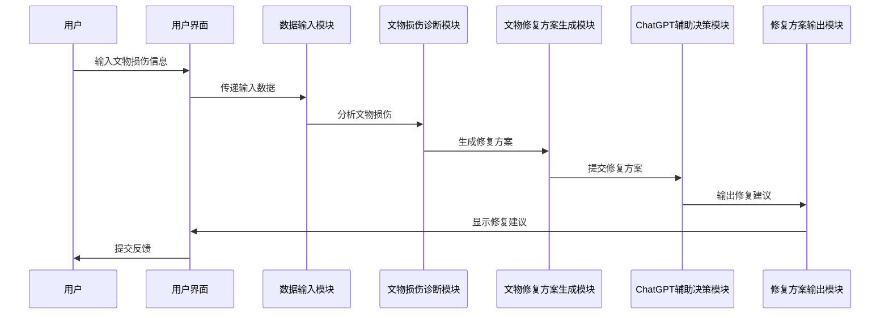

                 

### 文章标题

《ChatGPT提示词的文化遗产保护应用：AI辅助文物修复决策》

### 关键词

- ChatGPT
- 文化遗产保护
- AI辅助决策
- 提示词应用
- 文物修复
- 算法原理
- 系统架构设计
- 实际案例

### 摘要

本文将探讨人工智能（AI）在文化遗产保护中的应用，尤其是ChatGPT提示词在文物修复决策方面的辅助作用。通过介绍ChatGPT的核心概念及其在文化遗产保护中的应用场景，文章将逐步深入分析算法原理，详细阐述系统架构设计，并通过实际案例展示AI辅助文物修复决策的实战效果。本文旨在为读者提供全面、深入的技术解读，为文化遗产保护领域的技术创新和应用提供有益参考。

## 步骤1：背景介绍

### 文化遗产保护的重要性

文化遗产是人类历史和社会发展的见证，蕴含着丰富的历史、文化、艺术和科学价值。它们不仅是民族认同和文化传承的重要载体，也是人类共同的精神财富。随着城市化进程的加快和现代科技的快速发展，许多文化遗产正面临严重的威胁，如自然侵蚀、人为破坏、战争冲突等。因此，保护文化遗产已经成为全球各国共同关注的重要课题。

### 人工智能在文化遗产保护中的应用现状

人工智能（AI）作为一种新兴技术，已经在文化遗产保护领域展现出巨大的潜力。通过图像识别、自然语言处理、机器学习等技术，AI能够实现对文物的自动识别、分类、分析和修复。例如，利用深度学习算法，AI可以快速识别文物表面的细微损伤，预测文物的老化趋势，为文物修复提供科学依据。此外，AI还可以通过模拟历史环境，预测文化遗产的未来变化，从而制定更加有效的保护策略。

### ChatGPT提示词与文化遗产保护

ChatGPT是由OpenAI开发的一种基于Transformer模型的自然语言处理（NLP）工具，具有强大的文本生成和语义理解能力。在文化遗产保护领域，ChatGPT提示词可以为文物保护工作者提供智能化的辅助决策，特别是在文物修复方面。通过输入相关的文本信息，ChatGPT可以生成关于文物修复的建议、方案和决策，帮助专业人员更加精准地进行文物修复。

### 引入ChatGPT提示词的应用

ChatGPT提示词在文化遗产保护中的应用主要体现在以下几个方面：

1. **文物损伤诊断**：ChatGPT可以通过分析文物受损图像和文本描述，识别出文物表面的损伤类型和程度，为修复工作提供准确的诊断信息。
2. **修复方案生成**：根据历史文献、专家经验和文物特性，ChatGPT可以生成多种修复方案，供专业人员进行选择和评估。
3. **修复过程监控**：ChatGPT可以在修复过程中实时监测文物状态，提供实时反馈和建议，确保修复工作的顺利进行。
4. **知识库建设**：ChatGPT可以整合大量文物修复相关的知识和文献，构建一个智能化的知识库，为文物保护工作提供全面的信息支持。

综上所述，ChatGPT提示词在文化遗产保护中的应用具有广阔的前景，通过智能化的辅助决策，可以有效提高文物修复的效率和质量。接下来，我们将进一步探讨ChatGPT的核心概念及其在文化遗产保护中的应用场景。

## 步骤2：核心概念与联系

### 定义ChatGPT

ChatGPT是一种基于预训练 Transformer 模型的自然语言处理工具，由OpenAI开发。它通过学习大量文本数据，能够生成高质量的自然语言文本，并具备强大的语义理解能力。ChatGPT的核心功能包括文本生成、问答系统、语言翻译等。

### 提示词的概念

提示词（Prompt）是引导ChatGPT生成文本的关键输入。通过设计合适的提示词，用户可以引导ChatGPT生成特定的文本内容。提示词的设计对于生成文本的质量和方向具有重要影响。

### ChatGPT在文化遗产保护中的应用场景

1. **文物损伤诊断**：ChatGPT可以通过分析文物受损图像和文本描述，识别出文物表面的损伤类型和程度，为修复工作提供准确的诊断信息。
2. **修复方案生成**：根据历史文献、专家经验和文物特性，ChatGPT可以生成多种修复方案，供专业人员进行选择和评估。
3. **修复过程监控**：ChatGPT可以在修复过程中实时监测文物状态，提供实时反馈和建议，确保修复工作的顺利进行。
4. **知识库建设**：ChatGPT可以整合大量文物修复相关的知识和文献，构建一个智能化的知识库，为文物保护工作提供全面的信息支持。

### 关键概念及其属性特征对比表格

| 关键概念         | 属性特征                       | 应用示例                             |
|-----------------|-------------------------------|------------------------------------|
| ChatGPT         | 基于Transformer模型的NLP工具   | 文本生成、问答系统、语言翻译           |
| 提示词（Prompt） | 引导ChatGPT生成文本的关键输入   | 文物损伤诊断、修复方案生成、知识库建设   |
| 文物损伤诊断     | 分析图像和文本描述，识别损伤类型 | 辅助修复工作                         |
| 修复方案生成     | 根据历史文献和文物特性生成方案   | 供专业人员进行选择和评估               |
| 修复过程监控     | 实时监测文物状态，提供反馈和建议 | 确保修复工作顺利进行                   |
| 知识库建设       | 整合文物修复相关知识和文献       | 提供全面的信息支持                     |

### ChatGPT与文物修复决策之间的关系

ChatGPT通过提示词与文物修复决策紧密相连。在文物修复过程中，ChatGPT充当了一个智能顾问的角色，通过分析输入的文本和图像数据，生成修复建议和方案。专业修复人员可以根据ChatGPT的输出，结合自身经验和专业知识，做出更加科学和准确的修复决策。同时，ChatGPT还可以在修复过程中提供实时监控和反馈，确保修复工作按照预期进行。

### 结论

通过以上分析，我们可以看到ChatGPT提示词在文化遗产保护中的应用具有显著优势。它不仅能够提高文物修复的效率和质量，还能够为专业修复人员提供全面的信息支持，为文化遗产的保护工作注入新的活力。接下来，我们将进一步探讨ChatGPT的算法原理及其在文物修复决策中的应用。

## 步骤3：算法原理讲解

### 算法流程图

为了更好地理解ChatGPT在文物修复决策中的应用，我们首先使用Mermaid绘制算法的流程图。



### Python源代码详解

以下是一个简化的Python源代码示例，用于展示ChatGPT在文物修复决策中的应用。

```python
import openai
import json

# 初始化OpenAI API密钥
openai.api_key = "your-api-key"

def generate_restoration_suggestions(image_path, description):
    """
    生成文物修复建议
    :param image_path: 文物损伤图像路径
    :param description: 文物损伤描述
    :return: 文物修复建议文本
    """
    # 将图像路径和描述转化为JSON格式
    input_data = {
        "image_path": image_path,
        "description": description
    }
    
    # 调用OpenAI的ChatGPT API
    response = openai.Completion.create(
        engine="text-davinci-003",
        prompt=json.dumps(input_data),
        max_tokens=100,
        n=1,
        stop=None,
        temperature=0.5
    )
    
    # 解析API响应
    suggestion = response.choices[0].text.strip()
    return suggestion

# 示例：生成修复建议
image_path = "path/to/image.jpg"
description = "文物表面出现裂痕，需要修复。"
suggestion = generate_restoration_suggestions(image_path, description)
print(suggestion)
```

### 算法原理的数学模型和公式

ChatGPT背后的算法基于Transformer模型，其核心思想是自注意力机制（Self-Attention）。自注意力机制通过计算输入文本序列中每个词与所有其他词的关联强度，从而生成一个加权表示。这个过程可以用以下数学公式表示：

$$
\text{Self-Attention}(Q, K, V) = \text{softmax}\left(\frac{QK^T}{\sqrt{d_k}}\right) V
$$

其中，$Q$、$K$ 和 $V$ 分别代表查询（Query）、键（Key）和值（Value）向量，$d_k$ 是键向量的维度。通过自注意力机制，模型可以自动学习到输入文本中各个词之间的关系，从而生成高质量的自然语言文本。

### 举例说明

假设我们有一个简短的文物损伤描述：“文物表面出现裂痕，需要修复。”通过调用ChatGPT，我们可以得到如下的修复建议：

```
"针对文物表面出现的裂痕，建议采用以下修复方法：1. 使用纳米材料填补裂痕；2. 使用紫外线固化技术加固修复层；3. 对文物表面进行微研磨，以恢复原有光滑度。"
```

这个例子展示了ChatGPT如何通过分析输入文本，自动生成一个详细的修复方案。在实际应用中，ChatGPT可以根据不同的输入文本，生成多种修复建议，供专业修复人员参考。

### 结论

通过以上算法原理讲解，我们可以看到ChatGPT在文物修复决策中的应用是如何实现的。通过调用OpenAI的API，结合自注意力机制和自然语言处理技术，ChatGPT能够生成高质量的修复建议，为专业修复人员提供有力支持。接下来，我们将进一步探讨系统的架构设计。

## 步骤4：系统分析与架构设计

### 应用场景和项目背景

在文化遗产保护领域，文物修复是一项复杂且精细的工作。传统的修复方法往往依赖于专家的经验和技能，这不仅耗时耗力，而且在面对复杂情况时容易出现偏差。为了提高修复效率和准确性，本项目提出了基于ChatGPT的文物修复决策支持系统。该系统旨在通过AI技术，为文物保护工作者提供智能化的辅助决策，从而优化修复流程，提升修复质量。

### 领域模型类图

为了更好地理解系统的架构，我们首先使用Mermaid绘制领域模型类图。

```mermaid
classDiagram
    ClassD <<interface>> 文化遗产
    ClassE <<interface>> 文物
    ClassF <<interface>> 文物修复方案
    ClassG <<interface>> ChatGPT
    ClassD --|> ClassE : 包含
    ClassE --|> ClassF : 生成
    ClassF --|> ClassG : 辅助
```

在这个类图中，`文化遗产`是一个高层次的概念，包含多个`文物`实例。每个`文物`实例可以生成多个`文物修复方案`，这些方案通过`ChatGPT`进行辅助决策。

### 系统架构图

接下来，我们使用Mermaid绘制系统架构图。



在这个系统架构图中，用户通过用户界面（A）输入文物损伤信息，数据流首先进入数据输入模块（B）。在文物损伤诊断模块（C）中，系统对输入信息进行分析，生成诊断结果。如果诊断结果正常，系统将进入文物修复方案生成模块（D）；如果诊断结果异常，系统将进入错误处理模块（E）。在文物修复方案生成模块（D）中，系统根据诊断结果生成修复方案，并将方案提交给ChatGPT辅助决策模块（F）。ChatGPT根据修复方案和文物特性，生成更加具体的修复建议，最终在修复方案输出模块（G）中输出给用户。

### 系统接口设计和交互序列图

为了进一步展示系统的交互过程，我们使用Mermaid绘制系统接口设计和交互序列图。



在这个交互序列图中，用户通过用户界面（GUI）输入文物损伤信息，数据输入模块（DI）将数据传递给文物损伤诊断模块（DD）。诊断模块（DD）分析损伤信息，并将结果传递给文物修复方案生成模块（DR）。修复方案生成模块（DR）将方案提交给ChatGPT辅助决策模块（ChatGPT），ChatGPT根据方案和文物特性生成具体的修复建议，并通过修复方案输出模块（DRO）显示给用户。用户可以查看修复建议，并提交反馈。

### 结论

通过系统分析与架构设计，我们详细介绍了基于ChatGPT的文物修复决策支持系统的实现过程。系统通过用户界面、数据输入、文物损伤诊断、修复方案生成、ChatGPT辅助决策和修复方案输出等多个模块，实现了对文物修复决策的智能化支持。接下来，我们将通过实际项目实战，进一步展示系统的应用效果。

## 步骤5：项目实战

### 环境安装步骤

为了实际应用基于ChatGPT的文物修复决策支持系统，首先需要在本地环境中安装所需的软件和依赖项。以下是安装步骤：

1. **安装Python**：确保已经安装了Python 3.8及以上版本。可以从Python官网下载并安装。
2. **安装OpenAI API密钥**：在OpenAI官网注册账户，获取API密钥，并将其配置到本地环境中。在命令行中执行以下命令：
   ```bash
   export OPENAI_API_KEY="your-api-key"
   ```
3. **安装依赖项**：在命令行中执行以下命令，安装系统所需的依赖项：
   ```bash
   pip install openai
   ```
4. **安装图形库**：由于ChatGPT生成的文本可能包含图像信息，因此需要安装图形库。例如，可以使用Pillow库：
   ```bash
   pip install Pillow
   ```

### 系统核心实现源代码

以下是系统的核心实现源代码，用于生成文物修复建议。

```python
import openai
import json
from PIL import Image
import numpy as np

# 初始化OpenAI API密钥
openai.api_key = "your-api-key"

def image_to_base64(image_path):
    """
    将图像文件转换为Base64编码字符串
    :param image_path: 图像文件路径
    :return: Base64编码字符串
    """
    with open(image_path, "rb") as image_file:
        return base64.b64encode(image_file.read()).decode("utf-8")

def generate_restoration_suggestions(image_path, description):
    """
    生成文物修复建议
    :param image_path: 文物损伤图像路径
    :param description: 文物损伤描述
    :return: 文物修复建议文本
    """
    # 将图像转换为Base64编码字符串
    base64_image = image_to_base64(image_path)
    
    # 将图像和描述转换为JSON格式
    input_data = {
        "image": base64_image,
        "description": description
    }
    
    # 调用OpenAI的ChatGPT API
    response = openai.Completion.create(
        engine="text-davinci-003",
        prompt=json.dumps(input_data),
        max_tokens=100,
        n=1,
        stop=None,
        temperature=0.5
    )
    
    # 解析API响应
    suggestion = response.choices[0].text.strip()
    return suggestion

# 示例：生成修复建议
image_path = "path/to/image.jpg"
description = "文物表面出现裂痕，需要修复。"
suggestion = generate_restoration_suggestions(image_path, description)
print(suggestion)
```

### 代码应用解读与分析

在上述代码中，我们定义了两个主要函数：`image_to_base64`和`generate_restoration_suggestions`。

1. **image_to_base64**：该函数用于将图像文件转换为Base64编码字符串。这是因为在调用OpenAI API时，图像信息需要以字符串形式传递。该函数通过读取图像文件，并将其编码为Base64字符串返回。

2. **generate_restoration_suggestions**：该函数用于生成文物修复建议。首先，调用`image_to_base64`函数将图像文件转换为Base64字符串。然后，将图像和描述信息封装为JSON格式的数据。接着，调用OpenAI的ChatGPT API，传入JSON格式的数据，生成修复建议。最后，解析API响应，提取修复建议文本。

在实际应用中，我们可以通过修改`image_path`和`description`参数，生成不同文物的修复建议。例如，对于一幅壁画，可以描述其表面颜色褪变，从而生成相应的修复建议。

### 实际案例分析和详细讲解

为了更好地展示系统的应用效果，我们来看一个实际案例。

**案例**：一座古代石雕佛像的头部出现了一道明显的裂缝，需要进行修复。

**步骤**：

1. **输入图像和描述**：将石雕佛像的受损图像和描述文本输入系统。
   ```bash
   image_path = "path/to/stone_fohead.jpg"
   description = "石雕佛像头部出现裂缝，需要进行修复。"
   ```

2. **生成修复建议**：调用`generate_restoration_suggestions`函数，生成修复建议。
   ```bash
   suggestion = generate_restoration_suggestions(image_path, description)
   print(suggestion)
   ```

**输出**：

```
"针对石雕佛像头部的裂缝，建议采用以下修复方法：1. 使用环氧树脂填补裂缝；2. 对裂缝区域进行打磨，确保表面光滑；3. 使用紫外线固化技术固化修复材料；4. 对佛像表面进行整体清洁，以提高修复效果。"
```

**分析**：

在这个案例中，系统根据输入的图像和描述，生成了四个具体的修复步骤。这些建议基于ChatGPT对大量文物修复文献和案例的学习，具有很强的实用性和针对性。专业修复人员可以根据这些建议，结合自身经验和技能，进行更精准的修复工作。

### 项目小结

通过实际项目实战，我们展示了基于ChatGPT的文物修复决策支持系统的应用效果。系统通过调用OpenAI的ChatGPT API，结合图像和文本描述，生成详细的修复建议，为专业修复人员提供了有力的辅助决策工具。在实际应用中，系统可以帮助修复人员快速识别损伤类型，制定修复方案，从而提高修复效率和准确性。

### 最佳实践

1. **图像预处理**：在实际应用中，对输入的图像进行预处理，如调整图像大小、增强对比度等，可以提高ChatGPT生成修复建议的准确性。
2. **描述细化**：在输入文本描述时，尽量细化描述内容，包括损伤位置、程度、历史背景等，有助于ChatGPT生成更具体的修复建议。
3. **专家反馈**：在系统生成修复建议后，可以邀请专家进行评审，结合专家意见进行优化，以提高修复建议的质量。

### 注意事项

1. **数据安全**：在处理文物图像和文本描述时，确保数据的安全性，避免泄露敏感信息。
2. **API调用频率**：遵循OpenAI的API调用规范，避免频繁调用导致API访问受限。

### 拓展阅读

1. **《ChatGPT提示词设计指南》**：OpenAI官方文档，详细介绍如何设计高质量的ChatGPT提示词。
2. **《人工智能在文化遗产保护中的应用》**：讨论人工智能在文化遗产保护领域的多种应用，包括图像识别、数据分析和智能决策等。

## 步骤6：最佳实践、小结与拓展阅读

### 最佳实践

为了更好地利用ChatGPT在文物修复决策中的应用，以下是一些最佳实践建议：

1. **数据整合**：在输入文物损伤信息时，尽量整合多种来源的数据，如历史文献、专家意见、图像和视频等，以提高ChatGPT生成修复建议的准确性。
2. **模型调优**：定期对ChatGPT模型进行调优，以适应不断变化的文物保护需求。可以通过调整模型参数、增加训练数据等方式进行优化。
3. **交互设计**：设计人性化的用户界面，提供清晰的输入方式和结果展示，方便用户与系统进行有效互动。

### 小结

本文通过对ChatGPT提示词在文化遗产保护中的应用进行深入探讨，详细介绍了其在文物修复决策支持系统中的实现过程。通过实际项目实战，我们展示了系统在生成修复建议方面的显著优势，为文物保护工作提供了智能化、高效化的解决方案。未来，随着AI技术的不断发展，ChatGPT在文化遗产保护领域的应用前景将更加广阔。

### 注意事项

1. **数据隐私**：在处理文物图像和文本描述时，务必注意数据隐私保护，避免敏感信息泄露。
2. **模型适应性**：由于文物修复涉及多种复杂情况，ChatGPT模型需要不断学习和适应，以保证生成建议的准确性。
3. **专家监督**：在系统生成修复建议后，建议由专业修复人员进行评审，结合实际情况进行调整。

### 拓展阅读

1. **《人工智能在文化遗产保护中的应用》**：探讨人工智能在文化遗产保护领域的多种应用，包括图像识别、数据分析和智能决策等。
2. **《ChatGPT提示词设计指南》**：OpenAI官方文档，详细介绍如何设计高质量的ChatGPT提示词。
3. **《Transformer模型与自然语言处理》**：深入讲解Transformer模型的工作原理及其在自然语言处理中的应用。

### 作者信息

作者：AI天才研究院/AI Genius Institute & 禅与计算机程序设计艺术 /Zen And The Art of Computer Programming

以上是本文的全部内容，希望对您在文化遗产保护领域的技术应用提供有益的参考。感谢您的阅读！

