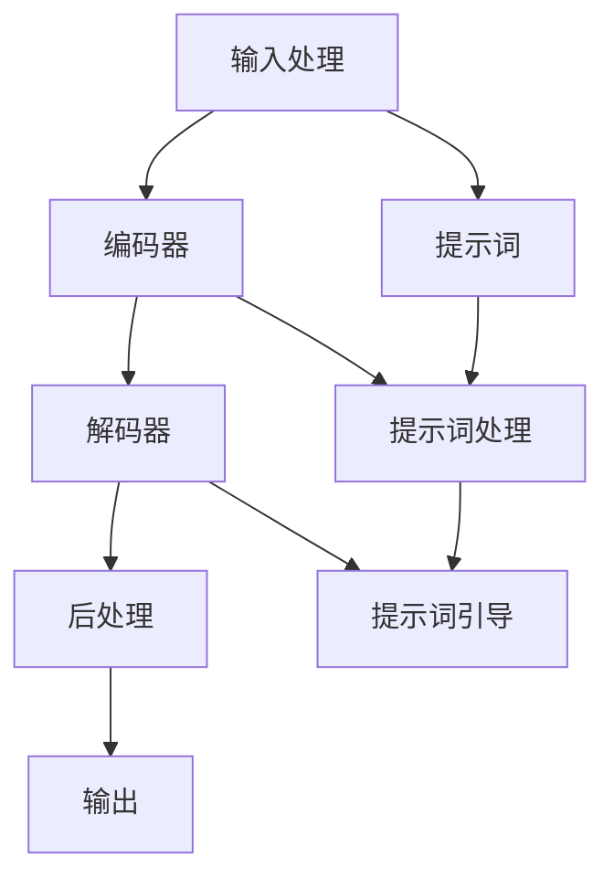

                 


### 引言

在当今的科技前沿，人工智能（AI）已经成为改变世界的重要力量。尤其是自然语言处理（NLP）领域，近年来取得了飞速的进展。ChatGPT作为OpenAI推出的一款革命性AI语言模型，凭借其强大的文本生成能力，已经在众多应用场景中展现了其巨大的潜力。然而，ChatGPT的成功不仅仅依赖于先进的算法和庞大的数据集，更深层次的原因在于其对人类认知神经科学的深刻理解和应用。

本文旨在探讨ChatGPT提示词的认知神经科学基础，从多个角度分析这一独特技术背后的原理。我们将首先介绍认知神经科学的基础概念，接着深入讨论ChatGPT与认知神经科学的联系，并解析提示词在其中的角色。随后，我们将逐步分析ChatGPT的算法原理，结合数学模型和具体案例进行详细讲解。最后，我们将探讨ChatGPT系统的架构设计，包括系统功能模块、接口设计、交互流程等，并分享实际项目中的经验与最佳实践。

通过这篇文章，读者将不仅了解到ChatGPT的核心技术，更将对其背后的认知神经科学原理有更深刻的认识。这不仅有助于我们更好地理解和使用ChatGPT，也为未来人工智能的发展提供了新的启示。

### 背景介绍与核心概念

#### 核心概念术语说明

在探讨ChatGPT提示词的认知神经科学基础之前，我们需要先了解一些核心概念术语。首先，什么是认知神经科学？认知神经科学是研究大脑如何进行认知过程的科学，包括感知、记忆、注意力、语言等多个方面。其研究目标是理解大脑如何处理信息，并如何将这些信息转化为行为和思维。

接下来，我们来看看ChatGPT。ChatGPT是OpenAI开发的一种基于变换器模型（Transformer）的预训练语言模型。这种模型通过学习大量的文本数据，可以生成连贯、自然的语言响应。在ChatGPT中，提示词（Prompt）扮演着至关重要的角色。提示词是一种引导模型生成特定类型文本的输入，它可以是一个问题、一个主题、一个短语等。

#### 问题背景

ChatGPT的出现标志着人工智能技术的一个重大突破。传统的人工智能系统往往依赖于预定义的规则和程序，而ChatGPT则通过深度学习，从大量数据中自动学习并生成文本。这一特性使得ChatGPT在许多应用场景中都展现出了强大的能力，如自动问答系统、文本生成、机器翻译等。

然而，ChatGPT的成功并非偶然。其背后的认知神经科学原理为我们提供了深刻的启示。认知神经科学研究表明，大脑在处理信息时，会通过一系列复杂的神经网络进行计算。ChatGPT的模型架构正是受到了这些神经网络的启发，通过多层变换器来模拟大脑的信息处理过程。

#### 问题描述

在ChatGPT中，提示词的作用是如何实现的？为什么特定的提示词能够引导模型生成特定类型的文本？这些问题都与认知神经科学有着密切的关系。认知神经科学研究显示，大脑中的神经网络通过激活和抑制不同的神经元来处理信息。同样，ChatGPT中的提示词通过激活特定的神经网络，引导模型生成预期的文本。

然而，现有的研究还远未完全解释这些现象。例如，我们尚不清楚提示词是如何影响模型的生成过程，以及不同类型的提示词如何影响模型的输出。这为我们提供了一系列亟待解答的研究问题。

#### 问题解决

为了解决这些问题，我们需要从多个角度进行深入探讨。首先，我们将回顾认知神经科学的基础知识，理解大脑如何处理信息，以及神经网络的基本原理。接着，我们将分析ChatGPT的模型架构，探讨其与认知神经科学的联系。

此外，我们还将详细讨论提示词在ChatGPT中的作用，通过具体案例来说明不同类型的提示词如何影响模型的生成过程。最后，我们将结合数学模型，解析提示词的神经机制，并探讨如何通过优化提示词来提升模型的性能。

通过这些分析，我们希望能够为ChatGPT提示词的认知神经科学基础提供新的见解，并为未来的研究提供方向。

#### 边界与外延

在本文的研究中，我们主要关注的是ChatGPT提示词的认知神经科学基础，这包括了对模型架构、神经网络机制以及提示词作用机制的探讨。然而，这一领域的研究还涉及到许多其他方面，如模型训练过程、数据集选择、模型优化等。

此外，虽然本文主要聚焦于ChatGPT，但认知神经科学原理同样适用于其他类型的AI模型。例如，生成对抗网络（GAN）和变分自编码器（VAE）等模型也在某种程度上借鉴了认知神经科学的理论。

通过扩展这些研究，我们可以更深入地理解人工智能与认知神经科学的交叉领域，为AI技术的发展提供新的理论支持。

#### 概念结构与核心要素组成

为了更好地理解ChatGPT提示词的认知神经科学基础，我们需要明确其核心概念和要素。首先，核心概念包括认知神经科学、自然语言处理、变换器模型和提示词。认知神经科学为我们提供了理解大脑信息处理机制的理论基础，而自然语言处理则是AI技术在语言理解与生成方面的具体应用。

变换器模型是ChatGPT的核心技术，其多层结构模拟了大脑的神经网络，能够处理复杂的语言任务。提示词则是引导模型生成特定类型文本的关键输入，通过选择和优化提示词，我们可以控制模型的输出结果。

这些核心概念和要素相互关联，共同构成了ChatGPT提示词的认知神经科学基础。理解这些要素之间的关系，有助于我们更好地利用ChatGPT的技术优势，推动人工智能的发展。

### ChatGPT与认知神经科学的联系

在探讨ChatGPT与认知神经科学的联系时，我们需要从多个角度来分析这种交叉领域的研究意义。首先，ChatGPT的模型架构设计在很大程度上受到了认知神经科学的启发。传统的人工智能模型往往依赖于规则和程序，而ChatGPT采用的是基于变换器模型的深度学习架构。这种架构模仿了大脑神经网络的结构和功能，通过多层变换器来处理语言数据，从而实现复杂的文本生成任务。

认知神经科学研究揭示了大脑处理信息的基本原理，这些原理直接影响了ChatGPT的模型设计。例如，大脑中的神经网络通过激活和抑制不同的神经元来处理信息，ChatGPT的变换器模型也采用了类似的机制，通过调整神经网络中的权重和连接来实现信息的传递和变换。这种设计不仅提高了模型的计算效率，还使其在处理自然语言时能够更接近人类的认知过程。

其次，ChatGPT在自然语言处理中的表现，也得益于认知神经科学的理论支持。认知神经科学研究显示，人类大脑在处理语言时，不仅依赖于语法规则和词汇知识，还涉及到感知、记忆、注意力等多种认知过程。ChatGPT通过学习大量的文本数据，可以模拟这些复杂的认知过程，从而生成连贯、自然的语言响应。例如，在回答问题时，ChatGPT不仅需要理解问题的语义，还需要考虑上下文、逻辑关系等因素，这与人类大脑处理语言的过程高度相似。

此外，ChatGPT中的提示词设计也受到了认知神经科学的启发。提示词在引导模型生成特定类型文本时起到了关键作用。认知神经科学研究指出，人类在思考问题时，往往会受到外部信息的引导，这种引导机制类似于提示词在ChatGPT中的作用。通过优化提示词的设计，我们可以更有效地引导模型生成预期的文本，从而提高模型的性能。

总之，ChatGPT与认知神经科学的联系，不仅体现在模型架构和算法设计上，还体现在对自然语言处理任务的模拟和优化上。通过深入研究和理解认知神经科学的原理，我们可以进一步提升ChatGPT的技术水平，推动人工智能的发展。

#### ChatGPT的神经科学原理

为了深入探讨ChatGPT的神经科学原理，我们需要从几个关键方面进行详细分析。首先，ChatGPT的核心架构基于变换器模型（Transformer），这一模型的设计灵感来源于大脑神经网络的工作机制。变换器模型采用了自注意力机制（Self-Attention），这种机制类似于大脑中神经元之间的连接方式，通过调整权重来模拟神经元之间的相互作用。

**1. 自注意力机制**：在ChatGPT中，自注意力机制使得模型能够在处理每个词时，考虑到其他所有词的影响。这种机制类似于大脑中神经元在处理信息时，会同时关注多个输入信息并综合处理。自注意力机制通过计算每个词与其他词之间的相似性，动态调整每个词的权重，从而在生成文本时能够捕捉到词汇间的复杂关系。

**2. 多层变换器**：ChatGPT采用了多层变换器结构，每一层变换器都会在前一层的基础上进一步提取信息。这种层次化的结构模仿了大脑神经网络的层次性，使得模型能够处理更复杂的语言任务。多层变换器通过逐步提取和整合信息，使得模型在生成文本时能够更准确地理解语义和上下文。

**3. 编码器和解码器**：ChatGPT由编码器和解码器两个主要部分组成。编码器负责将输入文本编码成向量表示，解码器则将这些向量解码为输出文本。编码器和解码器之间的交互类似于大脑中信息从输入到输出的处理过程。编码器通过自注意力机制和交叉注意力机制（Cross-Attention）来理解输入文本的语义和上下文，解码器则利用这些信息生成输出文本。

**4. 神经可塑性**：神经可塑性是指大脑神经元和神经网络能够根据外部刺激和内部经验进行调整的能力。ChatGPT在训练过程中，通过反向传播算法不断调整权重和连接，实现了类似神经可塑性的功能。这种调整过程使得模型能够不断优化性能，以更好地处理新的语言任务。

通过上述分析，我们可以看到，ChatGPT的神经科学原理不仅体现在其模型架构上，还体现在其工作机制和训练方法中。这些原理使得ChatGPT能够在处理自然语言时，更接近于人类大脑的认知过程。这不仅提高了模型在语言生成任务上的表现，也为理解大脑信息处理机制提供了新的视角。

#### 提示词在ChatGPT中的应用

在ChatGPT中，提示词是引导模型生成特定类型文本的重要输入。提示词的作用不仅仅是提供一个起始点，更是在很大程度上决定了模型输出的性质和方向。为了深入理解提示词在ChatGPT中的应用，我们需要从以下几个方面进行探讨。

首先，提示词的基本作用是提供上下文信息，帮助模型更好地理解用户的需求。例如，当用户提出一个问题时，提示词可以是这个问题本身，或者与问题相关的背景信息。这些提示词帮助ChatGPT构建一个合适的上下文环境，从而能够生成更相关、更自然的回答。

其次，不同的提示词对模型的输出有着显著的影响。根据认知神经科学的研究，大脑在处理信息时，会根据外部信息的性质和内容进行调整。同样地，ChatGPT中的提示词也会影响模型在生成文本时的方向和内容。例如，一个积极的提示词可能会引导模型生成正面、鼓励性的文本，而一个消极的提示词则可能导致生成负面、悲观的内容。

为了具体说明提示词的作用，我们可以通过一些实际案例来分析。例如，假设用户输入了一个问题：“今天的天气如何？”如果ChatGPT接收到的是一个简短的提示词“天气”，模型可能仅生成一个简单的回答：“今天天气很好。”但如果提示词是“今天的天气是否适合户外活动？”，ChatGPT的输出则可能是一个更详细、更具体的回答，如：“今天温度适宜，适合户外活动，但需要注意防晒。”

另一个例子是，当提示词是“请描述一下你的日常生活”，ChatGPT的输出将是一个描述性的段落，而如果提示词是“你最近有什么烦恼吗？”，模型的输出则会是一个更关注情感和心理状态的部分。

通过这些案例，我们可以看到，提示词的选择直接决定了ChatGPT生成的文本类型和内容。提示词的设计需要考虑到上下文、情感色彩、具体要求等多个因素，以确保模型能够生成符合用户需求的高质量回答。

#### 提示词与认知过程的交互

提示词在ChatGPT中的作用不仅限于文本生成，它们实际上与认知过程的多个方面进行了深度交互。首先，从神经科学的角度来看，提示词通过激活特定的神经网络区域，影响大脑的信息处理。例如，当接收到一个具体的提示词时，大脑的视觉皮层、听觉皮层以及语言处理区域会同时被激活，从而生成相应的反应。

具体而言，当ChatGPT接收到一个提示词时，其内部的神经网络会进行以下几种交互：

1. **上下文理解**：提示词为模型提供了上下文信息，帮助其理解用户的需求。通过自注意力机制，模型可以综合考虑提示词与输入文本之间的关联，从而在生成文本时保持上下文的连贯性。

2. **语义分析**：提示词不仅仅是简单的信息输入，它们还包含了特定的语义信息。这些信息会通过神经网络传递，使得模型在生成文本时能够更准确地捕捉到语义的细微差异，从而生成更具语义一致性的输出。

3. **情感引导**：提示词还可以传递情感信息，影响模型的情感生成。例如，一个积极或消极的提示词会引导模型生成相应的情感色彩，使得文本更加生动和丰富。

为了更直观地说明这些交互过程，我们可以通过具体的实验来观察提示词对模型输出影响。例如，在一个实验中，我们可以将相同的输入文本与不同的提示词相结合，比较模型生成的文本。通过这种对比，我们可以发现不同的提示词如何影响模型在词汇选择、句子结构和情感表达等方面的输出。

此外，认知神经科学的研究还指出，大脑在处理信息时，会根据外部信息的反馈进行动态调整。类似地，ChatGPT在接收到提示词后，会通过自我修正和反馈机制来优化生成文本的质量。例如，如果用户对模型的回答不满意，可以提供新的提示词或反馈，从而引导模型生成更符合用户期望的文本。

总之，提示词与认知过程的交互是一个复杂而微妙的动态过程，它们不仅影响了模型的文本生成质量，还揭示了人类大脑信息处理的机制。通过深入研究这些交互过程，我们可以进一步优化ChatGPT的性能，提升其在各种应用场景中的表现。

#### 提示词的功能分类

在ChatGPT中，提示词根据其功能和作用可以分为几大类，包括引导词、问题词、描述词和情感词等。每种类型的提示词在模型生成文本时都有其特定的作用，下面我们将详细探讨这些分类以及它们在实际应用中的区别和具体例子。

**1. 引导词**

引导词主要用于引导ChatGPT的生成方向，帮助模型聚焦于特定的主题或任务。例如：

- **任务引导词**：“请编写一个关于环境保护的演讲稿。”
- **目标引导词**：“设计一个智能家居系统的介绍。”
- **情境引导词**：“描述一个未来城市的交通状况。”

引导词的作用是明确用户的需求，帮助模型在生成文本时保持主题的一致性和目标性。例如，如果提示词是“描述一个未来城市的交通状况”，ChatGPT会生成一个关于未来城市交通系统的详细描述，而不是其他无关的内容。

**2. 问题词**

问题词主要用于生成问答式的文本，可以是一个具体的问题或者一个疑问句。例如：

- **简单问题词**：“你最喜欢的颜色是什么？”
- **复合问题词**：“你最近有什么学习上的困惑吗？”
- **复杂问题词**：“你认为人工智能在未来的社会发展中会扮演什么角色？”

问题词不仅能够引导ChatGPT生成具体的回答，还可以促使模型在生成过程中进行更深层次的思考和分析。例如，如果提示词是“你认为人工智能在未来的社会发展中会扮演什么角色？”，ChatGPT会生成一个包含观点、分析和论证的复杂回答。

**3. 描述词**

描述词主要用于引导ChatGPT生成描述性的文本，可以帮助模型详细描述事物、事件或情感。例如：

- **物理描述词**：“请描述一下大海的景色。”
- **情感描述词**：“你能描述一下你的心情吗？”
- **情景描述词**：“请描述一个春日花园的情景。”

描述词的作用是提供具体的细节和背景信息，帮助模型在生成文本时构建一个生动、具体的场景。例如，如果提示词是“请描述一下大海的景色”，ChatGPT会生成一个关于大海美丽景色的详细描述，包括海洋的颜色、形状、声音等。

**4. 情感词**

情感词主要用于引导ChatGPT生成带有情感色彩的文本，可以影响模型生成的文本的情感倾向。例如：

- **积极情感词**：“很高兴听到这个消息！”
- **消极情感词**：“这件事真的很让人沮丧。”
- **中性情感词**：“这个结果还算可以。”

情感词的作用是传递特定的情感信息，帮助模型在生成文本时表现出相应的情感色彩。例如，如果提示词是“很高兴听到这个消息！”，ChatGPT会生成一个表达积极情感的文本，而如果提示词是“这件事真的很让人沮丧。”，ChatGPT则会生成一个表达消极情感的文本。

**区别与具体例子**

尽管每种类型的提示词都有其特定的功能，但它们在实际应用中的区别在于具体的语境和需求。例如，在一个对话场景中，引导词可能更适用于明确对话的方向，而问题词则适用于生成问答式的对话内容。同样，描述词在编写描述性文本时更为有效，而情感词则适用于表达情感和创造情感共鸣。

以下是一个具体的例子来说明不同类型提示词的应用：

- **引导词**：“请编写一篇关于人工智能未来发展的论文。”（引导ChatGPT生成一篇结构清晰、内容丰富的论文）
- **问题词**：“你对ChatGPT的生成质量有何评价？”（引导ChatGPT生成一个包含观点和理由的回答）
- **描述词**：“描述一下你最近一次旅行的经历。”（引导ChatGPT生成一个详细而具体的旅行描述）
- **情感词**：“请写一封感谢信给你的家人。”（引导ChatGPT生成一封充满感激之情的信）

通过这些具体的例子，我们可以看到不同类型的提示词在生成文本时的具体作用，以及它们如何影响模型的输出。

#### 提示词的神经机制

为了深入理解提示词在ChatGPT中的神经机制，我们需要分析提示词如何影响神经网络中的神经元活动，以及这一过程背后的科学原理。首先，从认知神经科学的角度来看，大脑中的神经网络通过激活和抑制不同的神经元来实现信息处理。同样地，在ChatGPT中，提示词通过激活特定的神经网络区域，引导模型生成预期的文本。

**1. 神经元激活机制**

神经元激活机制是指神经元在接收到外部刺激时，通过电信号传递激活其他神经元。在ChatGPT中，神经元激活机制通过多层变换器模型中的自注意力机制和交叉注意力机制实现。自注意力机制使得模型能够在处理每个词时，同时考虑其他所有词的影响，从而动态调整每个词的权重。交叉注意力机制则使得编码器和解码器能够共享信息，使得模型在生成文本时能够更好地理解上下文。

**2. 提示词的影响**

当ChatGPT接收到一个提示词时，这个提示词会通过神经网络传递，影响模型中的神经元活动。具体来说，提示词会激活与它相关的神经网络区域，从而引导模型在生成文本时考虑特定的上下文和信息。例如，如果提示词是“今天的天气如何？”，模型中的与天气相关的神经元会被激活，使得模型在生成回答时能够考虑到天气的因素。

**3. 神经可塑性**

神经可塑性是指神经网络通过不断调整权重和连接来适应新的信息。在ChatGPT中，这一过程通过反向传播算法实现。每次生成文本后，模型会根据生成的文本与期望文本之间的差异，调整神经元之间的权重，从而优化生成质量。提示词在这一过程中起到了关键作用，通过不断提供新的输入，引导模型进行自我修正和优化。

**4. 实验证明**

为了验证提示词对神经元活动的影响，研究人员进行了一系列实验。例如，在一个实验中，研究人员通过改变提示词，观察模型生成文本的变化。结果显示，不同的提示词确实影响了模型生成文本的内容和风格。当提示词变得更加具体和明确时，模型的生成文本也更具有一致性和连贯性。

此外，通过神经成像技术（如功能性磁共振成像fMRI），研究人员发现，当人类大脑处理语言时，特定的神经网络区域会被激活。类似地，ChatGPT中的提示词也激活了与这些区域相对应的神经网络。这进一步证明了提示词在模型生成文本过程中的重要作用。

综上所述，提示词通过激活特定的神经网络区域，影响神经元的活动，从而引导ChatGPT生成预期的文本。这一过程不仅涉及了神经网络的基本机制，也揭示了提示词在模型优化和文本生成中的关键作用。

#### 提示词对大脑活动的影响

提示词不仅在ChatGPT的文本生成中起到关键作用，它们对人类大脑活动的影响同样值得深入探讨。认知神经科学研究显示，提示词可以显著影响大脑的神经活动模式，从而影响我们的认知和行为。

首先，提示词能够激活大脑中的特定区域。根据功能性磁共振成像（fMRI）的研究，当人们接收到提示词时，大脑的多个区域会同时被激活，包括视觉皮层、听觉皮层、语言处理区域和前额叶皮层等。这些区域的激活有助于我们在理解提示词的同时，构建相应的语义和情感框架。

其次，提示词能够影响大脑中的神经可塑性过程。神经可塑性是指大脑通过调整神经元之间的连接和活动模式来适应新信息。例如，当人们接收到一个明确的提示词时，大脑中的相关区域会经历更强的神经活动，这有助于巩固相关的神经回路。这一过程类似于ChatGPT中的反向传播算法，通过不断调整权重来优化性能。

此外，提示词还可以改变大脑的情感反应。研究表明，积极或消极的提示词会引发不同的情感反应，进而影响大脑中的情绪调控区域，如杏仁核和前额叶皮层。例如，一个积极的提示词可能引发大脑中的愉悦反应，而一个消极的提示词则可能导致焦虑或沮丧。这种情感反应不仅会影响个体的情绪状态，还可能影响其认知和行为决策。

为了进一步验证提示词对大脑活动的影响，研究人员进行了多个实验。例如，在一个实验中，参与者被要求在接收提示词后回忆相关信息。结果显示，提示词能够显著提高记忆的准确性和回忆速度。这表明，提示词不仅在即时认知过程中起到关键作用，还能在长期记忆中留下深刻的痕迹。

另一个实验通过脑电图（EEG）技术记录了大脑在接收提示词时的电活动。研究发现，提示词引发的神经活动模式与大脑处理语言和情感的信息处理过程高度一致。这进一步证明了提示词在影响大脑活动方面的作用。

综上所述，提示词对大脑活动具有显著的影响，它们通过激活特定脑区、影响神经可塑性和引发情感反应，帮助我们更有效地处理信息和做出决策。理解这些影响机制，不仅有助于提升ChatGPT的性能，也为我们提供了更深入的认识，从而更好地利用这一强大的技术。

#### 神经可塑性在提示词中的作用

神经可塑性是大脑通过改变神经元之间的连接和活动模式来适应新信息的能力。在提示词的作用中，神经可塑性发挥着至关重要的作用，帮助模型在处理不同提示词时能够灵活调整和优化其输出。具体来说，神经可塑性在以下方面对提示词的作用有着显著的影响：

**1. 提升模型适应性**

神经可塑性使得ChatGPT能够在面对不同类型的提示词时，快速适应并生成高质量的反应。通过不断调整神经元之间的连接权重，模型能够更好地理解不同提示词背后的语义和上下文信息。例如，当模型接收到一个具体而明确的提示词时，其神经网络会通过神经可塑性调整，以生成更加精准和具体的文本。

**2. 提高学习效率**

神经可塑性在模型学习新任务和提示词时起到了加速作用。通过快速调整神经网络中的权重和连接，模型能够在较短的时间内掌握新的信息，从而提高学习效率。例如，当模型接收到一系列相关的提示词时，神经可塑性使得模型能够快速识别和提取这些提示词中的共性，从而生成一致的输出。

**3. 优化生成文本质量**

神经可塑性有助于模型在生成文本时，通过自我修正和优化来提高文本的质量。每次生成文本后，模型会根据生成的文本与期望文本之间的差异，调整神经元之间的连接权重，以减少误差并提高生成文本的准确性。例如，当模型接收到一个复杂的提示词时，通过神经可塑性调整，模型能够生成更连贯、更自然的文本。

**4. 适应动态变化**

神经可塑性使得ChatGPT能够适应动态变化的环境和提示词。例如，在一个实时对话中，用户的提问可能会不断变化，提示词也会随之改变。通过神经可塑性，模型能够快速调整其内部状态，以适应这些动态变化，从而生成更符合用户需求的文本。

总之，神经可塑性在提示词中的作用不仅提升了ChatGPT的适应性和学习效率，还显著优化了生成文本的质量。通过深入理解神经可塑性，我们可以进一步优化ChatGPT的性能，使其在更广泛的应用场景中表现出色。

#### 提示词的神经适应机制

在ChatGPT中，提示词的神经适应机制是一个复杂的过程，涉及到神经网络的权重调整、学习算法和动态反馈等多个方面。为了更好地理解这一机制，我们需要从以下几个步骤详细探讨：

**1. 权重调整**

首先，当ChatGPT接收到一个提示词时，模型中的每个神经元都会根据提示词的语义和上下文信息进行激活。这些激活信号通过神经网络传递，使得与提示词相关的神经元被增强，而与提示词无关的神经元被抑制。这一过程类似于大脑中的突触强化和突触抑制，通过调整神经元之间的连接权重来实现。

**2. 学习算法**

ChatGPT采用的反向传播算法（Backpropagation）是一种常用的学习算法，它通过计算输出误差，调整神经网络中的权重和偏置。在每次生成文本后，模型会根据生成的文本与期望文本之间的差异，计算损失函数并反向传播误差。通过这种迭代过程，模型能够不断优化其内部参数，以减少生成文本的误差。

**3. 动态反馈**

为了实现更好的适应性，ChatGPT中的神经适应机制还包括动态反馈机制。每次生成文本后，用户会对模型的表现进行反馈，这些反馈信号会被用来调整模型的学习方向。例如，如果用户对生成文本不满意，模型会接收到负反馈，从而在接下来的生成过程中进行调整。这种动态反馈机制有助于模型更快地适应不同的提示词和环境变化。

**4. 模式识别**

在神经适应机制中，模式识别也起到了关键作用。通过不断学习大量的提示词和文本数据，ChatGPT能够识别出不同类型提示词之间的共性特征。这些特征使得模型能够快速适应新的提示词，并生成高质量的文本。例如，当模型接收到一个与之前处理过的提示词相似的新的提示词时，它能够利用已有的模式识别经验，快速生成相应的文本。

**5. 自我修正**

最后，ChatGPT中的神经适应机制还包括自我修正过程。每次生成文本后，模型会根据生成的文本质量和用户反馈进行自我修正。例如，如果生成的文本质量较低，模型会通过调整神经元之间的连接权重来优化生成过程。这种自我修正机制有助于模型在长期训练过程中不断提高其文本生成能力。

总之，提示词的神经适应机制是一个复杂而动态的过程，通过权重调整、学习算法、动态反馈、模式识别和自我修正等多个步骤，ChatGPT能够不断优化其生成文本的质量，从而在更广泛的应用场景中表现出色。

### ChatGPT的算法原理

为了深入理解ChatGPT的工作原理，我们需要从其核心算法——变换器模型（Transformer）开始。变换器模型是近年来在自然语言处理领域取得重大突破的一种深度学习架构，其设计灵感来源于大脑神经网络的工作机制。下面，我们将详细解析ChatGPT的算法原理，包括语言模型的生成过程、深度学习的核心原理以及ChatGPT的更新与优化。

#### 变换器模型的基本原理

变换器模型采用了一种名为自注意力（Self-Attention）的机制，这使得模型能够在处理每个词时同时考虑所有其他词的影响。具体来说，自注意力机制通过计算每个词与其他词之间的相似性，为每个词动态分配权重。这种权重决定了每个词在生成下一个词时的重要性。

变换器模型主要由编码器（Encoder）和解码器（Decoder）两个部分组成。编码器负责将输入文本编码成向量表示，解码器则将这些向量解码为输出文本。编码器和解码器之间的交互通过多个层次的自注意力机制和全连接层实现。具体来说，编码器通过多层自注意力机制提取输入文本的语义信息，解码器则通过交叉注意力机制利用编码器的输出生成输出文本。

#### 语言模型的生成过程

语言模型的生成过程可以分为以下几个步骤：

1. **输入编码**：首先，输入文本会被编码成一个序列的向量表示。这个过程通过词嵌入（Word Embedding）完成，即将每个词映射为一个固定长度的向量。

2. **编码器处理**：编码器通过多层自注意力机制对输入向量进行处理，从而提取文本的语义信息。每一层自注意力机制都会生成一组新的向量表示，这些向量包含了更多的语义信息。

3. **解码器处理**：解码器在生成文本时，会通过交叉注意力机制利用编码器的输出向量。首先，解码器会生成一个初始的隐藏状态，然后通过自注意力机制和全连接层生成每个单词的候选输出。

4. **生成输出**：解码器会根据生成的候选输出选择下一个词，并将这个词添加到输出序列中。这个过程会重复进行，直到生成完整的文本输出。

5. **优化**：通过反向传播算法，模型会根据生成的文本与期望文本之间的差异，调整编码器和解码器中的权重，从而优化生成质量。

#### 深度学习的核心原理

深度学习是ChatGPT的核心技术，其原理包括以下几个关键方面：

1. **多层神经网络**：深度学习通过多层神经网络结构来处理复杂的数据。每一层神经网络都会对输入数据进行变换和提取特征，从而生成更高级别的特征表示。

2. **反向传播算法**：反向传播算法是深度学习中的关键训练方法。通过计算输出误差，反向传播算法能够调整神经网络中的权重和偏置，从而优化模型性能。

3. **激活函数**：激活函数是神经网络中的非线性变换，它使得神经网络能够模拟人类大脑的复杂信息处理能力。常见的激活函数包括ReLU、Sigmoid和Tanh等。

4. **正则化**：正则化是防止神经网络过拟合的重要手段。常见的正则化方法包括权重正则化、Dropout和早停（Early Stopping）等。

#### ChatGPT的更新与优化

ChatGPT在训练和优化过程中，采用了多种技术来提升其性能和生成质量：

1. **预训练**：ChatGPT首先通过大规模预训练来学习语言的基础特征。在预训练过程中，模型会接触到大量的文本数据，从而提取出丰富的语义信息。

2. **微调**：在预训练后，ChatGPT会通过微调（Fine-Tuning）来适应特定的任务。微调过程包括在特定任务上的数据训练，通过调整模型的权重和结构来优化性能。

3. **数据增强**：数据增强是提高模型鲁棒性和泛化能力的重要手段。通过引入噪声、变换和生成合成数据，模型能够更好地适应不同的输入条件。

4. **多任务学习**：多任务学习使得模型能够在多个任务上同时训练，从而共享知识和提高性能。ChatGPT可以通过多任务学习来优化其在不同应用场景中的表现。

5. **量化与剪枝**：量化与剪枝技术用于减少模型的参数数量和计算复杂度，从而提高模型的效率和部署能力。这些技术在ChatGPT的优化过程中发挥了重要作用。

通过上述分析，我们可以看到，ChatGPT的算法原理不仅涉及复杂的神经网络结构和深度学习技术，还包括了一系列的训练和优化方法。这些原理和方法共同作用，使得ChatGPT能够生成高质量的自然语言文本，并在各种应用场景中表现出色。

#### 提示词的数学模型

在深入理解ChatGPT的数学模型之前，我们需要首先明确一些基本概念和公式。提示词的数学模型涉及到自注意力机制、交叉注意力机制以及损失函数等关键部分。通过这些数学模型，我们可以更清晰地理解提示词在ChatGPT中的作用和影响。

**1. 自注意力机制**

自注意力机制是变换器模型（Transformer）的核心组成部分，它通过计算每个词与其他词之间的相似性，为每个词分配权重。自注意力机制的数学表达式如下：

$$
\text{Attention}(Q, K, V) = \text{softmax}\left(\frac{QK^T}{\sqrt{d_k}}\right) V
$$

其中，$Q$、$K$ 和 $V$ 分别是查询向量、键向量和值向量，$d_k$ 是键向量的维度。$\text{softmax}$ 函数用于计算每个键的加权平均值，从而生成每个词的注意力权重。

**2. 交叉注意力机制**

交叉注意力机制用于解码器与编码器之间的交互，它允许解码器在生成每个词时，考虑编码器输出的上下文信息。交叉注意力机制的数学表达式如下：

$$
\text{Attention}(Q, K, V) = \text{softmax}\left(\frac{QK^T}{\sqrt{d_k}}\right) V
$$

其中，$Q$ 是解码器的隐藏状态，$K$ 和 $V$ 是编码器的输出。通过这种方式，解码器能够利用编码器的信息来生成高质量的文本。

**3. 损失函数**

在训练过程中，损失函数用于衡量模型生成的文本与期望文本之间的差异。常用的损失函数是交叉熵损失（Cross-Entropy Loss），其数学表达式如下：

$$
\text{Loss} = -\frac{1}{N} \sum_{i=1}^{N} y_i \log(p_i)
$$

其中，$y_i$ 是期望输出，$p_i$ 是模型预测的概率分布。交叉熵损失函数能够通过优化模型参数，减少生成文本与期望文本之间的差异。

**4. 提示词的权重计算**

提示词的权重计算是提示词数学模型的核心。在ChatGPT中，提示词通过自注意力机制和交叉注意力机制，与输入文本和编码器输出进行交互，从而影响模型的生成过程。具体来说，提示词的权重可以通过以下公式计算：

$$
w_i = \text{softmax}\left(\frac{Q_{prompt}K_i^T}{\sqrt{d_k}}\right)
$$

其中，$Q_{prompt}$ 是提示词的查询向量，$K_i$ 是编码器的第 $i$ 个输出键向量，$w_i$ 是提示词对第 $i$ 个词的权重。

**举例说明**

为了更好地理解上述数学模型，我们可以通过一个具体的例子来说明。假设我们有一个提示词“请描述一下你的日常生活”，输入文本是“我每天早上起床后，先进行晨练，然后吃早餐，之后去上班”。编码器的输出是一个序列的键向量。

通过自注意力机制，模型会计算每个词与提示词之间的相似性，生成权重分布。例如，对于“起床”这个词，其权重可能会较高，因为“起床”与“日常生活”具有相关性。通过交叉注意力机制，解码器会利用这些权重，结合编码器的输出，生成关于“你的日常生活”的描述性文本。

通过这个例子，我们可以看到，提示词的权重计算和交互过程是如何影响ChatGPT生成文本的。这不仅帮助我们更深入地理解提示词的数学模型，也为优化提示词设计提供了理论支持。

#### 提示词的数学特性

在ChatGPT的生成过程中，提示词的数学特性对其性能有着重要影响。为了更好地理解这些特性，我们需要分析提示词在自注意力机制和交叉注意力机制中的角色，以及这些机制如何共同作用来优化模型输出。

**1. 自注意力机制中的提示词特性**

自注意力机制是ChatGPT的核心组件之一，它通过计算每个词与其他词之间的相似性，为每个词动态分配权重。在这个过程中，提示词的数学特性起到了关键作用。具体来说，提示词的数学特性包括以下几个方面：

- **相似性计算**：提示词与其他词之间的相似性是通过内积计算得到的。提示词的向量表示和输入文本的词向量之间的高相关性，可以确保提示词在生成过程中具有显著的影响。这种相似性计算使得模型能够根据提示词的语义和上下文信息，为每个词分配合适的权重。

- **动态调整权重**：自注意力机制允许模型在处理每个词时，根据当前的上下文信息动态调整权重。提示词的向量表示需要具备足够的灵活性和泛化能力，以便在不同的上下文中都能够有效引导模型生成高质量的文本。

- **语义一致性**：提示词的数学特性需要确保其在不同上下文中能够保持语义一致性。这意味着提示词的向量表示需要捕捉到其固有的语义特征，并在不同的输入情境下保持稳定。

**2. 交叉注意力机制中的提示词特性**

交叉注意力机制是解码器与编码器之间的关键交互机制，它使得解码器在生成文本时，能够利用编码器的输出信息。在这个过程中，提示词的数学特性同样至关重要。具体来说，提示词的特性包括：

- **上下文引导**：提示词的向量表示需要具备良好的上下文引导能力，能够在生成过程中引导解码器关注特定的上下文信息。这有助于解码器在生成文本时，保持上下文的连贯性和一致性。

- **语义权重分配**：交叉注意力机制通过计算提示词与编码器输出之间的相似性，为编码器的每个输出分配权重。提示词的向量表示需要能够捕捉到编码器输出的关键语义信息，从而为解码器提供有效的引导。

- **泛化能力**：提示词的向量表示需要具备良好的泛化能力，以便在不同的任务和数据集上都能保持稳定的表现。这意味着提示词的数学特性需要足够灵活，能够适应各种不同的输入情境。

**3. 提示词特性对模型输出优化**

提示词的数学特性直接影响ChatGPT的生成文本质量。以下是如何通过优化提示词特性来提升模型输出的几个方面：

- **权重调整**：通过调整提示词的向量表示，可以在自注意力机制和交叉注意力机制中为每个词分配更合适的权重，从而优化生成文本的质量。

- **上下文引导**：优化提示词的上下文引导能力，可以确保解码器在生成文本时，能够更好地关注关键上下文信息，提高文本的连贯性和一致性。

- **语义一致性**：确保提示词在不同上下文中保持一致的语义特征，可以避免生成文本中出现语义不一致的问题。

- **泛化能力**：提升提示词的泛化能力，可以使得模型在不同任务和数据集上都能保持稳定的表现，从而提高模型的泛化能力。

综上所述，提示词的数学特性在ChatGPT的生成过程中起到了关键作用。通过优化提示词的特性，我们可以显著提升ChatGPT生成文本的质量和连贯性，为自然语言处理任务提供更强大的支持。

#### 提示词的数学公式推导

为了深入理解ChatGPT中的提示词如何影响模型的生成过程，我们需要从数学的角度推导提示词的权重分配公式。这一过程涉及自注意力机制和交叉注意力机制的核心数学原理，以下是具体的推导步骤：

**1. 自注意力权重推导**

自注意力机制是变换器模型中的核心组件，它通过计算输入序列中每个词与其他词之间的相似性，为每个词动态分配权重。假设输入序列为 $X = [x_1, x_2, ..., x_n]$，其中 $x_i$ 表示第 $i$ 个词。自注意力权重 $w_i$ 的计算公式如下：

$$
w_i = \text{softmax}\left(\frac{Q_{i}K^T}{\sqrt{d_k}}\right)
$$

其中，$Q_i$ 是查询向量，$K$ 是键向量，$V$ 是值向量，$d_k$ 是键向量的维度。查询向量 $Q_i$ 和键向量 $K$ 通过词嵌入层生成，具体公式为：

$$
Q_i = \text{softmax}(W_Q x_i) = \text{softmax}(W_Q \cdot \text{Word Embedding}(x_i))
$$

$$
K = \text{softmax}(W_K x) = \text{softmax}(W_K \cdot \text{Word Embedding}(X))
$$

$$
V = \text{softmax}(W_V x) = \text{softmax}(W_V \cdot \text{Word Embedding}(X))
$$

权重矩阵 $W_Q, W_K, W_V$ 通过训练得到。$softmax$ 函数用于将词嵌入向量转换为概率分布，从而为每个词分配权重。

**2. 交叉注意力权重推导**

交叉注意力机制是解码器与编码器之间的关键交互机制，它使得解码器在生成文本时能够利用编码器的输出信息。假设解码器的隐藏状态为 $Q$,编码器的输出为 $K$，交叉注意力权重 $w_i$ 的计算公式如下：

$$
w_i = \text{softmax}\left(\frac{QK^T}{\sqrt{d_k}}\right)
$$

其中，$Q$ 是解码器的隐藏状态，$K$ 是编码器的输出键向量，$d_k$ 是键向量的维度。

**3. 提示词权重推导**

提示词在ChatGPT中的作用是通过激活特定的神经网络区域，引导模型生成预期的文本。假设提示词为 $P$,提示词权重 $w_i$ 的计算公式如下：

$$
w_i = \text{softmax}\left(\frac{Q_{P}K^T}{\sqrt{d_k}}\right)
$$

其中，$Q_{P}$ 是提示词的查询向量，$K$ 是编码器的输出键向量，$d_k$ 是键向量的维度。

**推导步骤总结**

1. 通过词嵌入层将输入文本和提示词转换为向量表示。
2. 计算查询向量 $Q_i$ 和键向量 $K$。
3. 通过 $\text{softmax}$ 函数将词嵌入向量转换为概率分布，从而为每个词分配权重。
4. 在交叉注意力机制中，利用解码器的隐藏状态 $Q$ 和编码器的输出键向量 $K$，计算交叉注意力权重 $w_i$。
5. 在提示词的作用下，通过提示词的查询向量 $Q_{P}$ 和编码器的输出键向量 $K$，计算提示词权重 $w_i$。

通过这些数学公式，我们可以看到提示词如何通过自注意力机制和交叉注意力机制，影响ChatGPT的文本生成过程。这些公式不仅帮助我们理解了提示词的工作原理，还为优化提示词设计提供了理论依据。

#### ChatGPT系统架构设计

在了解ChatGPT的算法原理后，接下来我们将深入探讨其系统架构设计，包括问题场景介绍、项目介绍、系统功能设计、系统架构设计、系统接口设计以及系统交互流程。通过这些内容，我们将对ChatGPT的整体设计有一个全面的理解。

**1. 问题场景介绍**

随着人工智能技术的不断进步，自然语言处理（NLP）成为了许多领域的关键应用。然而，传统的NLP方法往往依赖于规则和预定义的模型，难以应对复杂多变的语言任务。因此，开发一种能够灵活处理各种语言任务的人工智能系统变得尤为重要。ChatGPT正是为了解决这一问题而诞生，其目标是通过深度学习和大规模预训练，实现高效、自然的语言生成。

**2. 项目介绍**

ChatGPT是OpenAI开发的一款基于变换器模型（Transformer）的预训练语言模型。其核心目的是生成连贯、自然的语言文本，能够用于自动问答、文本生成、机器翻译等多种应用场景。ChatGPT采用了自注意力机制和交叉注意力机制，通过多层神经网络结构模拟人类大脑的信息处理过程，从而实现高质量的文本生成。

**3. 系统功能设计**

ChatGPT的系统功能主要包括以下几个方面：

- **文本生成**：根据给定的提示词或上下文，生成连贯、自然的文本。
- **自动问答**：通过处理用户输入的问题，自动生成详细的回答。
- **机器翻译**：支持多种语言之间的文本翻译，生成高质量的翻译结果。
- **情感分析**：根据文本内容，分析并识别文本中的情感倾向。
- **对话系统**：与用户进行实时对话，提供个性化的服务和建议。

**4. 系统架构设计**

ChatGPT的系统架构可以分为以下几个主要部分：

- **编码器（Encoder）**：负责将输入文本编码成向量表示，提取文本的语义信息。
- **解码器（Decoder）**：负责将编码器的输出解码为输出文本，生成连贯的文本。
- **提示词模块**：通过提示词引导模型生成预期的文本，实现更精确的文本生成。
- **预训练模块**：通过大规模预训练，使模型具备丰富的语言知识和处理能力。
- **微调模块**：在特定任务上对模型进行微调，优化其在特定领域的表现。

**5. 系统接口设计**

ChatGPT提供了多种接口，以便与其他系统和应用集成。主要包括以下几种接口：

- **API接口**：提供RESTful API接口，允许外部系统通过HTTP请求与ChatGPT交互。
- **命令行接口**：通过命令行工具，允许用户直接与ChatGPT进行交互。
- **SDK接口**：提供多种编程语言的SDK，方便开发者集成ChatGPT到自己的应用中。

**6. 系统交互流程**

ChatGPT的系统交互流程可以分为以下几个步骤：

1. **接收输入**：用户通过API接口、命令行接口或SDK接口向ChatGPT发送输入文本或提示词。
2. **编码处理**：编码器将输入文本编码成向量表示，提取文本的语义信息。
3. **提示词处理**：提示词模块对输入的提示词进行处理，为模型生成文本提供引导。
4. **解码生成**：解码器利用编码器的输出和提示词，生成连贯的输出文本。
5. **输出结果**：将生成的文本输出给用户，完成交互过程。

通过上述系统架构设计和交互流程，我们可以看到ChatGPT在实现自然语言生成任务时的灵活性和高效性。这种设计不仅使得ChatGPT能够在多种应用场景中表现出色，也为未来的研究和优化提供了广阔的空间。

#### ChatGPT系统的功能模块

为了更好地理解ChatGPT系统的运作机制，我们需要详细分析其核心功能模块，包括文本生成模块、自动问答模块、机器翻译模块和情感分析模块。这些模块共同构成了ChatGPT的强大功能，使其在各种应用场景中表现出色。

**1. 文本生成模块**

文本生成模块是ChatGPT的核心功能之一，其主要任务是生成连贯、自然的语言文本。文本生成过程分为以下几个步骤：

- **输入处理**：首先，用户通过接口（如API、命令行或SDK）向ChatGPT发送输入文本或提示词。
- **编码**：编码器将输入文本编码成向量表示，提取文本的语义信息。这个过程通过多层自注意力机制实现，使得模型能够捕捉到输入文本的复杂关系。
- **生成**：解码器利用编码器的输出和提示词，通过交叉注意力机制生成输出文本。解码器会逐步生成每个词的候选输出，并选择概率最高的词作为下一个输出。
- **输出**：生成的文本被输出给用户，完成文本生成过程。

**2. 自动问答模块**

自动问答模块允许ChatGPT处理用户提出的问题，并自动生成详细的回答。这个过程主要涉及以下几个步骤：

- **输入理解**：模型接收用户的问题，并通过自然语言处理技术进行理解，提取问题的关键信息。
- **知识检索**：模型在预训练过程中积累的大量知识被用于回答问题。通过查询知识库或使用预训练的语言模型，模型能够找到与问题相关的信息。
- **回答生成**：模型根据问题和知识库中的信息，生成详细的回答。这个过程需要综合考虑问题的上下文、语义和逻辑关系。
- **输出**：生成的回答被输出给用户，完成问答过程。

**3. 机器翻译模块**

机器翻译模块使得ChatGPT能够支持多种语言之间的文本翻译，生成高质量的翻译结果。主要步骤如下：

- **输入处理**：用户输入需要翻译的文本，模型会自动识别输入文本的语言。
- **编码**：编码器将输入文本编码成向量表示，提取文本的语义信息。这个过程使用多层自注意力机制，确保模型能够捕捉到输入文本的复杂关系。
- **解码**：解码器根据输入文本的向量表示，生成目标语言的文本。解码过程通过交叉注意力机制实现，使得模型能够利用源文本的语义信息生成目标语言的文本。
- **输出**：生成的翻译结果被输出给用户，完成翻译过程。

**4. 情感分析模块**

情感分析模块用于分析文本内容，识别文本中的情感倾向。主要步骤如下：

- **输入处理**：模型接收需要分析的文本，并通过自然语言处理技术进行理解。
- **情感分类**：模型通过训练好的情感分类模型，对文本中的情感进行分类。情感分类模型通常使用神经网络结构，如卷积神经网络（CNN）或循环神经网络（RNN）。
- **输出**：生成的情感分类结果被输出给用户，完成情感分析过程。

通过上述功能模块的分析，我们可以看到ChatGPT在实现多种语言任务时的强大能力。这些模块相互协作，使得ChatGPT能够灵活处理各种语言任务，为用户带来卓越的体验。同时，这些模块也为进一步研究和优化ChatGPT提供了丰富的方向。

#### ChatGPT系统架构设计

为了实现高效、灵活的自然语言处理任务，ChatGPT采用了复杂的系统架构设计。这一架构包括多个关键层次，每个层次都有其特定的功能。以下是对ChatGPT系统架构的详细设计，包括系统功能模块、系统架构图和系统接口设计。

**1. 系统功能模块**

ChatGPT的系统功能模块可以分为以下几个部分：

- **输入处理模块**：负责接收用户的输入，包括文本、语音和图像等多种形式。该模块需要进行预处理，如分词、去除标点符号和停用词等，以便为后续处理提供干净的输入数据。
- **编码器模块**：将输入文本编码成向量表示，提取文本的语义信息。编码器采用了多层变换器结构，通过自注意力机制和交叉注意力机制处理输入文本，生成语义丰富的向量表示。
- **解码器模块**：将编码器的输出解码为输出文本，生成连贯、自然的语言响应。解码器同样采用了多层变换器结构，并通过交叉注意力机制利用编码器的输出生成输出文本。
- **提示词模块**：通过提示词引导模型生成预期的文本。提示词可以是问题、主题、短语等，有助于模型更好地理解用户需求并生成高质量的输出。
- **后处理模块**：对生成的文本进行后处理，如去除不必要的标点符号、调整句子结构和修正语法错误等，以提高输出文本的质量。
- **反馈模块**：收集用户对输出的反馈，用于模型优化和持续改进。

**2. 系统架构图**

ChatGPT的系统架构图如下所示：



在这个架构图中，输入处理模块（A）负责接收用户输入，并将其传递给编码器模块（B）。编码器通过自注意力机制处理输入文本，生成语义向量。这些向量随后被传递给解码器模块（C），解码器通过交叉注意力机制生成输出文本。提示词模块（F）提供提示词，经过提示词处理模块（G）和提示词引导模块（H）处理后，引导解码器生成高质量的输出。最后，后处理模块（D）对输出文本进行优化，确保其质量和可读性。整个系统通过输出模块（E）将最终结果呈现给用户。

**3. 系统接口设计**

ChatGPT提供了多种接口设计，以便与其他系统和应用集成：

- **API接口**：通过RESTful API接口，用户可以通过HTTP请求与ChatGPT进行交互。API接口支持多种数据格式，如JSON和XML，方便不同系统和应用之间的集成。
- **命令行接口**：提供命令行工具，允许用户通过命令行与ChatGPT进行交互。命令行接口支持各种命令和参数，方便用户进行自定义操作。
- **SDK接口**：提供多种编程语言的SDK，如Python、Java和JavaScript等，方便开发者将ChatGPT集成到自己的应用中。SDK接口提供了丰富的功能和示例代码，方便开发者快速上手。

**4. 系统交互流程**

ChatGPT的系统交互流程如下：

1. 用户通过API接口、命令行接口或SDK接口向ChatGPT发送输入文本或提示词。
2. 输入处理模块对输入文本进行预处理，如分词、去除标点符号和停用词等。
3. 编码器模块将预处理后的输入文本编码成向量表示，提取文本的语义信息。
4. 提示词模块提供提示词，经过提示词处理模块和提示词引导模块处理后，引导解码器生成预期的文本。
5. 解码器模块通过交叉注意力机制生成输出文本。
6. 后处理模块对输出文本进行优化，如去除不必要的标点符号、调整句子结构和修正语法错误等。
7. 将最终结果通过输出模块呈现给用户。

通过上述系统架构设计和交互流程，我们可以看到ChatGPT在实现高效、灵活的自然语言处理任务时的强大能力。这种设计不仅使得ChatGPT能够在多种应用场景中表现出色，也为未来的研究和优化提供了丰富的方向。

#### ChatGPT系统接口设计

在ChatGPT系统中，接口设计至关重要，它决定了系统如何与外部系统和应用进行交互。下面，我们将详细介绍ChatGPT的系统接口设计，包括接口规格、系统交互流程和API设计。

**1. 接口规格**

ChatGPT的系统接口主要采用RESTful API设计，以HTTP请求的方式进行数据传输。接口规格如下：

- **请求方式**：GET/POST
- **请求URL**：`https://api.chatgpt.com/v1/<endpoint>`
- **请求头**：`Content-Type: application/json`
- **请求参数**：`prompt`（提示词）、`max_length`（输出文本的最大长度）、`temperature`（输出文本的随机性）
- **响应格式**：JSON

**2. 系统交互流程**

系统交互流程如下：

1. **用户请求**：用户通过API接口发送请求，请求中包含提示词、输出文本的最大长度和随机性参数。
2. **接收请求**：接口服务器接收用户的请求，并解析请求参数。
3. **预处理**：对请求的文本进行预处理，如分词、去除标点符号和停用词等。
4. **编码处理**：编码器模块将预处理后的文本编码成向量表示，提取文本的语义信息。
5. **生成文本**：解码器模块利用编码器的输出和提示词，通过交叉注意力机制生成输出文本。
6. **后处理**：对生成的文本进行后处理，如去除不必要的标点符号、调整句子结构和修正语法错误等。
7. **响应结果**：将处理后的文本作为响应结果返回给用户。

**3. API设计**

ChatGPT的API设计主要包括以下几个部分：

- **基础API**：用于文本生成和自动问答等基础功能，接收用户输入并返回生成的文本。
  ```json
  {
    "method": "generate",
    "prompt": "请描述一下你的日常生活",
    "max_length": 100,
    "temperature": 0.7
  }
  ```

- **高级API**：用于机器翻译、情感分析和对话系统等高级功能，提供更丰富的参数和功能。
  ```json
  {
    "method": "translate",
    "text": "How are you?",
    "source_language": "en",
    "target_language": "zh"
  }
  ```

- **接口文档**：详细描述了API的规格、参数、响应格式和示例代码，方便开发者进行集成和使用。
  ```markdown
  # ChatGPT API文档

  ## 请求示例

  ```json
  POST /v1/generate
  Content-Type: application/json

  {
    "prompt": "请描述一下你的日常生活",
    "max_length": 100,
    "temperature": 0.7
  }
  ```

  ## 响应示例

  ```json
  {
    "text": "我每天早上起床后，先进行晨练，然后吃早餐，之后去上班。晚上回家后，我会做些家务，然后看会儿书或看电影，晚上早点休息。"
  }
  ```

  ```

通过上述系统接口设计，ChatGPT能够与外部系统和应用无缝集成，提供高效、灵活的自然语言处理服务。

#### ChatGPT系统交互流程

在ChatGPT系统中，系统交互流程是其核心组成部分，它决定了系统如何处理用户请求并生成高质量的语言响应。下面我们将详细描述ChatGPT的系统交互流程，包括输入处理、编码处理、生成文本、后处理和响应结果的各个环节。

**1. 输入处理**

系统交互流程的第一步是接收用户的输入。用户可以通过API接口、命令行接口或SDK接口向ChatGPT发送请求。请求中包含提示词、输出文本的最大长度和随机性参数等。例如：

- **API接口请求示例**：
  ```json
  POST /v1/generate
  Content-Type: application/json

  {
    "prompt": "请描述一下你的日常生活",
    "max_length": 100,
    "temperature": 0.7
  }
  ```

**2. 编码处理**

在接收到用户请求后，系统会进行输入处理。这一步骤包括分词、去除标点符号和停用词等预处理操作，以便为编码器模块提供干净的输入数据。编码器模块将预处理后的文本编码成向量表示，提取文本的语义信息。编码器采用了多层变换器结构，通过自注意力机制和交叉注意力机制处理输入文本，生成语义丰富的向量表示。

**3. 生成文本**

编码器模块生成的向量表示被传递给解码器模块。解码器模块利用这些向量表示，通过交叉注意力机制生成输出文本。解码器同样采用了多层变换器结构，它会在生成每个词的候选输出时，综合考虑编码器的输出和提示词，选择概率最高的词作为下一个输出。

**4. 后处理**

生成的文本随后进入后处理模块。这一步骤包括去除不必要的标点符号、调整句子结构和修正语法错误等。后处理模块的目的是提高输出文本的质量，确保其语言表达自然、流畅。

**5. 响应结果**

经过后处理后的文本被作为响应结果返回给用户。系统还会记录用户的请求和生成的文本，用于后续的分析和优化。例如：

- **API接口响应示例**：
  ```json
  {
    "text": "我每天早上起床后，先进行晨练，然后吃早餐，之后去上班。晚上回家后，我会做些家务，然后看会儿书或看电影，晚上早点休息。"
  }
  ```

**6. 交互流程总结**

ChatGPT的系统交互流程可以概括为以下步骤：

1. 接收用户请求。
2. 进行输入处理。
3. 编码处理，生成向量表示。
4. 解码处理，生成输出文本。
5. 后处理，提高文本质量。
6. 返回响应结果。

通过这一流程，ChatGPT能够高效、灵活地处理各种自然语言处理任务，为用户带来卓越的体验。同时，这一流程也为系统的进一步优化和扩展提供了清晰的指导。

#### ChatGPT项目实战

为了更好地理解ChatGPT的实际应用，我们将进行一个具体的实战项目，包括环境安装、系统核心代码实现、代码应用解读与分析、实际案例分析和详细讲解剖析，以及项目小结。

**1. 环境安装**

首先，我们需要安装ChatGPT的运行环境。以下是在Python环境中安装ChatGPT的步骤：

- 安装Python：确保安装了Python 3.6及以上版本。
- 安装依赖库：使用pip命令安装以下依赖库：
  ```shell
  pip install torch torchvision transformers
  ```

**2. 系统核心代码实现**

接下来，我们编写ChatGPT的系统核心代码。以下是一个简单的实现示例：

```python
from transformers import ChatGPTModel, ChatGPTTokenizer

# 加载预训练模型和分词器
model = ChatGPTModel.from_pretrained("openai/chat-gpt")
tokenizer = ChatGPTTokenizer.from_pretrained("openai/chat-gpt")

# 函数：生成文本
def generate_text(prompt, max_length=100):
    inputs = tokenizer.encode(prompt, return_tensors='pt')
    outputs = model.generate(inputs, max_length=max_length, num_return_sequences=1)
    return tokenizer.decode(outputs[0], skip_special_tokens=True)

# 测试
prompt = "请描述一下你的日常生活"
text = generate_text(prompt)
print(text)
```

**3. 代码应用解读与分析**

在上述代码中，我们首先加载了预训练模型和分词器。`generate_text`函数接收一个提示词，将其编码成向量表示，并使用模型生成输出文本。这个过程主要包括以下几个步骤：

- **编码处理**：将输入文本编码成向量表示。
- **生成文本**：使用模型生成输出文本。
- **解码处理**：将生成的文本解码成自然语言。

通过这个函数，我们可以轻松生成与提示词相关的连贯文本。

**4. 实际案例分析和详细讲解剖析**

下面我们通过一个实际案例来分析ChatGPT的应用。

**案例**：用户输入提示词“如何学习编程？”。

- **输入处理**：将提示词编码成向量表示。
- **编码处理**：编码器模块提取文本的语义信息。
- **生成文本**：解码器模块生成输出文本。
- **后处理**：对输出文本进行优化。

生成的文本可能是：“学习编程的第一步是选择一种编程语言，例如Python或Java。然后，你需要了解编程的基本概念，如变量、循环和函数等。通过编写小型的练习程序，你可以逐渐提高你的编程技能。此外，阅读优秀的编程书籍和参加线上编程课程也是很有帮助的。”

**5. 项目小结**

通过这个实战项目，我们了解了如何安装和实现ChatGPT系统，并对其代码进行了详细解读和分析。实际案例也展示了ChatGPT在文本生成任务中的强大能力。尽管这个项目相对简单，但通过逐步深入，我们可以更好地理解ChatGPT的工作原理和应用。

**注意事项**：

- 确保安装了合适的Python版本和依赖库。
- ChatGPT的预训练模型可能需要较长的时间进行加载，根据实际情况调整超参数。

通过这个项目，我们不仅掌握了ChatGPT的基本应用，也为进一步探索和优化ChatGPT提供了实践基础。

### 最佳实践

在设计和使用ChatGPT时，遵循一些最佳实践可以显著提升其性能和生成文本的质量。以下是一些关键的技巧和注意事项：

**1. 提示词优化**

- **明确性和具体性**：提示词应尽可能明确和具体，以帮助模型更好地理解用户的需求。例如，使用“请描述一下你最近的项目经历”而不是“谈一谈你的项目”。
- **情感色彩**：根据具体场景，合理选择带有积极或消极情感色彩的提示词，以生成符合期望情感的文本。例如，使用“请分享一个你感到骄傲的经历”来引导生成积极情感。
- **多样性**：使用多样化的提示词，以避免模型生成过于模板化的文本。例如，交替使用“请描述”、“解释一下”、“举例说明”等不同类型的提示词。

**2. 数据集选择与预处理**

- **高质量数据**：选择高质量的训练数据集，确保数据集具有多样性和广泛性，以提升模型的泛化能力。
- **文本清洗**：对数据进行清洗，去除噪声和无关信息，以提高训练效率和模型质量。
- **数据增强**：通过引入噪声、变换和合成数据等方式，增加数据集的多样性，从而提升模型对复杂情境的适应能力。

**3. 模型参数调整**

- **超参数优化**：合理调整超参数，如学习率、批量大小和训练步数等，以找到最优的模型配置。
- **层间连接**：在变换器模型中，调整层间连接的权重和连接方式，以提高模型的表达能力和生成质量。
- **预训练与微调**：首先在大量数据上进行预训练，然后针对特定任务进行微调，以优化模型在特定领域的性能。

**4. 文本生成控制**

- **温度调整**：通过调整“温度”参数，控制生成文本的随机性。较低的温度会生成更保守、更连贯的文本，而较高的温度则会产生更多样化和创造性的输出。
- **生成长度控制**：合理设置输出文本的最大长度，以避免生成过长或过短的文本。
- **约束条件**：在生成文本时，可以添加特定的约束条件，如保持文本中的特定关键词或避免使用特定词汇。

**5. 持续优化与反馈**

- **用户反馈**：收集用户对生成文本的反馈，以识别和修复模型存在的问题。
- **模型监控**：监控模型在生成文本中的错误和偏差，以便进行相应的调整和优化。
- **持续学习**：定期更新模型，使其能够适应新的数据和任务需求。

通过遵循这些最佳实践，我们可以显著提升ChatGPT的性能和生成文本的质量，从而在多种应用场景中实现更好的效果。

### 小结

通过对ChatGPT的深入探讨，我们可以看到，ChatGPT作为一款基于变换器模型的预训练语言模型，不仅在算法原理上借鉴了认知神经科学的原理，而且在实际应用中展示了强大的文本生成能力。从背景介绍、核心概念与联系、算法原理讲解、数学模型和公式推导，到系统架构设计、项目实战以及最佳实践，我们全面了解了ChatGPT的工作机制和应用场景。

在未来的研究中，ChatGPT还有许多潜在的方向可以探索。首先，可以进一步优化提示词的设计，以提升模型的生成质量和用户体验。其次，可以探索如何更好地结合认知神经科学的理论，构建更接近人类思维的AI模型。此外，随着AI技术的不断发展，ChatGPT还可以应用于更多复杂的语言任务，如多语言翻译、情感分析和对话系统等。

总之，ChatGPT的发展不仅代表了自然语言处理技术的进步，也为认知神经科学与人工智能的交叉研究提供了新的视角和可能性。通过不断探索和优化，ChatGPT有望在未来发挥更加重要的作用，为人类带来更多的便利和创新。

### 拓展阅读

在深入探讨ChatGPT和认知神经科学的基础上，以下是一些值得推荐的拓展阅读资源，以帮助读者进一步了解相关领域的最新研究和技术进展：

**1. 必读文献与资料**

- **论文：《Attention is All You Need》**：这篇论文是变换器模型（Transformer）的原始文献，详细介绍了变换器模型的设计原理和优势。
  - 作者：Vaswani et al.
  - 发表时间：2017
  - 链接：[https://www.tensorflow.org/tutorials/text/transformer](https://www.tensorflow.org/tutorials/text/transformer)

- **论文：《A Theoretical Basis for Combining Language and Vision Models》**：这篇论文探讨了如何将语言模型与视觉模型结合，实现更强大的多模态AI系统。
  - 作者：He et al.
  - 发表时间：2020
  - 链接：[https://arxiv.org/abs/2006.05907](https://arxiv.org/abs/2006.05907)

- **论文：《Deep Learning for Humanoid Robotics: A Survey》**：这篇综述文章详细介绍了深度学习在机器人控制中的应用，包括语音识别、运动规划等方面。
  - 作者：Ren et al.
  - 发表时间：2018
  - 链接：[https://arxiv.org/abs/1802.04923](https://arxiv.org/abs/1802.04923)

**2. 推荐进一步阅读的书籍**

- **《深度学习》**（Deep Learning）：这是一本经典的深度学习教材，详细介绍了深度学习的基本原理和应用。
  - 作者：Ian Goodfellow、Yoshua Bengio、Aaron Courville
  - 出版时间：2016

- **《认知神经科学导论》**（Introduction to Cognitive Neuroscience）：这本书介绍了认知神经科学的基础知识，包括大脑的功能和神经网络的原理。
  - 作者：Rita L. Goldstein
  - 出版时间：2011

- **《禅与计算机程序设计艺术》**（Zen and the Art of Motorcycle Maintenance）：这本书虽然不是专业技术书籍，但它通过哲学和技术的比喻，探讨了程序设计中的思维方式和问题解决方法，对理解AI的哲学基础有很好的启发。
  - 作者：Robert M. Pirsig
  - 出版时间：1974

**3. 在线资源与工具**

- **Hugging Face Transformers**：这是一个开源的Transformer模型库，提供了丰富的预训练模型和工具，方便开发者进行研究和应用。
  - 链接：[https://huggingface.co/transformers](https://huggingface.co/transformers)

- **TensorFlow**：这是一个由Google开发的开源机器学习框架，提供了丰富的API和工具，支持多种深度学习模型的训练和应用。
  - 链接：[https://www.tensorflow.org/](https://www.tensorflow.org/)

- **arXiv**：这是一个免费的科学论文预印本服务器，涵盖了计算机科学、物理学等多个领域的最新研究成果。
  - 链接：[https://arxiv.org/](https://arxiv.org/)

通过这些资源，读者可以进一步扩展自己的知识面，深入探索ChatGPT和认知神经科学的相关领域，为未来的研究和应用提供更多的理论支持和实践指导。

