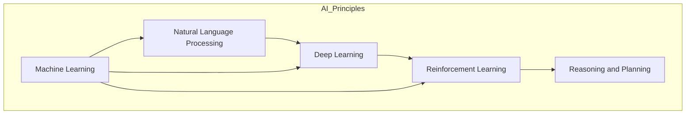

                 

### Chapter 1: Introduction to ChatGPT and its Cognitive Linguistics & AI Integration Model

#### 1.1 Background and Problem Statement

##### 1.1.1 The Rise of ChatGPT

ChatGPT, developed by OpenAI, has garnered significant attention in the field of artificial intelligence and natural language processing (NLP). Launched in November 2022, ChatGPT is a state-of-the-art language model that leverages deep learning techniques to generate coherent and contextually relevant text. Unlike traditional NLP models, ChatGPT excels in generating human-like responses, making it an invaluable tool for applications such as chatbots, virtual assistants, and content generation.

##### 1.1.2 The Importance of Cognitive Linguistics in ChatGPT

Cognitive linguistics, a subfield of linguistics that studies how people understand and produce language as a cognitive process, plays a crucial role in enhancing the performance of ChatGPT. By incorporating cognitive linguistic principles, ChatGPT can better understand and generate natural language, leading to more intuitive and contextually appropriate responses. Cognitive linguistics offers valuable insights into how language users process and comprehend information, which can be leveraged to improve the language generation capabilities of ChatGPT.

##### 1.1.3 The Integration Model of Cognitive Linguistics and AI in ChatGPT

The integration of cognitive linguistics and AI in ChatGPT is not merely a superficial combination but a synergistic fusion that addresses the limitations of traditional NLP models. By combining the theoretical foundations of cognitive linguistics with the advanced AI techniques employed by ChatGPT, the integration model aims to achieve the following objectives:

1. **Improved Natural Language Understanding**: The integration allows ChatGPT to better understand the context, nuances, and subtleties of human language, leading to more accurate and contextually relevant responses.
2. **Enhanced Language Generation Capabilities**: By leveraging cognitive linguistic principles, ChatGPT can generate more coherent and natural-sounding text that resonates with human linguistic patterns.
3. **Increased Robustness and Adaptability**: The integration model enables ChatGPT to handle a wider range of language use cases, including those involving complex linguistic structures and idiomatic expressions.
4. **Enhanced User Experience**: By providing more accurate and relevant responses, the integration model improves the overall user experience of ChatGPT, making it more engaging and effective as a virtual assistant or content generator.

In the following sections, we will delve deeper into the core concepts of cognitive linguistics and AI, explore their relationship, and provide a detailed analysis of the integration model used in ChatGPT. By doing so, we aim to shed light on the innovative approach taken by ChatGPT and its potential implications for the future of AI and natural language processing.

#### 1.2 Core Concepts and Basic Principles

##### 1.2.1 Key Concepts in Cognitive Linguistics

Cognitive linguistics is a field of linguistics that focuses on how people understand, process, and produce language as a cognitive process. It emphasizes the role of the human mind in language use and seeks to uncover the underlying cognitive mechanisms that drive language understanding and production. Some of the key concepts in cognitive linguistics include:

1. **Embodiment**: The idea that language is deeply rooted in our embodiment and perception of the world. Cognitive linguistics argues that our sensory experiences and physical actions shape our understanding of language.
2. **Iconicity**: The principle that language has a natural, iconic relationship with the world. This means that certain linguistic structures and forms reflect real-world relationships and can be visually or spatially represented.
3. **Metaphor**: A form of cognitive representation that allows us to understand one concept in terms of another. Metaphors are not merely linguistic devices but cognitive tools that help us make sense of complex ideas and concepts.
4. **Prototype**: A prototype is a typical example of a concept that represents the core properties of that concept. Prototypes help us categorize and understand concepts by providing a reference point.
5. **Construal Level**: The level of abstraction at which we construe or perceive a concept. Cognitive linguistics suggests that different construal levels (e.g., concrete vs. abstract) influence how we understand and use language.

##### 1.2.2 Core Principles of AI

Artificial intelligence (AI) is a field of computer science that focuses on creating intelligent machines that can perform tasks that would typically require human intelligence. Some of the core principles of AI include:

1. **Machine Learning**: A subset of AI that involves training machines to learn from data and make predictions or decisions based on that learning. Machine learning algorithms analyze large datasets to identify patterns and relationships, enabling machines to generalize from specific examples to new, unseen data.
2. **Deep Learning**: A subfield of machine learning that uses neural networks with many layers to learn complex patterns and representations from data. Deep learning has been particularly successful in various AI applications, such as image and speech recognition, natural language processing, and autonomous driving.
3. **Natural Language Processing (NLP)**: An area of AI that focuses on enabling computers to understand, interpret, and generate human language. NLP involves techniques for processing and analyzing text, including language modeling, text classification, and machine translation.
4. **Reinforcement Learning**: A type of machine learning where an agent learns to make decisions by interacting with an environment and receiving feedback in the form of rewards or penalties. Reinforcement learning is particularly useful for tasks that involve decision-making in complex and dynamic environments, such as game playing and robotics.
5. **Reasoning and Planning**: AI systems often need to engage in reasoning and planning to solve problems or achieve specific goals. These capabilities involve understanding the relationships between concepts, making inferences, and generating sequences of actions to achieve desired outcomes.

##### 1.2.3 The Relationship between Cognitive Linguistics and AI

The relationship between cognitive linguistics and AI is both complementary and synergistic. While cognitive linguistics offers insights into how humans understand and process language, AI provides the tools and techniques to develop intelligent systems that can mimic these processes. Here are some key points about the relationship between cognitive linguistics and AI:

1. **Shared Goals**: Both cognitive linguistics and AI aim to understand and model human intelligence. Cognitive linguistics seeks to uncover the cognitive mechanisms that underlie language use, while AI strives to develop algorithms and systems that can perform language understanding and generation tasks.
2. **Data-Driven Approaches**: Cognitive linguistics has traditionally relied on qualitative methods, such as case studies and experimental research, to uncover cognitive mechanisms. In contrast, AI has embraced data-driven approaches, using large datasets and machine learning techniques to learn and generalize from specific examples.
3. **Interdisciplinary Collaboration**: The integration of cognitive linguistics and AI has led to interdisciplinary collaborations that combine insights from cognitive science, linguistics, and computer science. These collaborations aim to develop AI systems that are not only accurate but also intuitive and natural in their interactions with humans.
4. **Enhancing AI Capabilities**: Cognitive linguistic principles can enhance the performance of AI systems in language understanding and generation tasks. For example, incorporating metaphorical reasoning and construal level theory can help AI systems generate more natural and contextually relevant text.
5. **Informing Cognitive Models**: AI techniques, such as neural networks and reinforcement learning, can be used to develop cognitive models that simulate human language processing and understanding. These models can provide valuable insights into the underlying cognitive mechanisms and inform the development of more advanced AI systems.

In the following sections, we will explore the cognitive linguistics approach to ChatGPT, discuss the role of AI in enhancing ChatGPT's performance, and provide a detailed analysis of ChatGPT's AI integration model. By understanding these concepts and their relationships, we can better appreciate the innovative contributions of ChatGPT to the field of AI and natural language processing.

### Chapter 1: Introduction to ChatGPT and its Cognitive Linguistics & AI Integration Model

#### 1.3 Mermaid Diagrams for Cognitive Linguistics and AI Concepts

In order to provide a visual representation of the key concepts in cognitive linguistics and AI, we will use Mermaid diagrams. Mermaid is a popular, simple, and versatile diagramming language that can create flowcharts, ER diagrams, and sequence diagrams using markdown syntax. Below, we present Mermaid diagrams that illustrate the core concepts and relationships in cognitive linguistics and AI.

##### 1.3.1 Mermaid ER Diagram of Cognitive Linguistics Concepts

The following Mermaid ER (Entity-Relationship) diagram represents the main concepts in cognitive linguistics, highlighting their relationships:

```mermaid
erDiagram
    Class Person ||--|{ LanguageUser }|-->> Person
    Class LanguageUser ||--|{ Conceptualizer }|-->> LanguageUser
    Class Conceptualizer ||--|{ Perceiver }|-->> Conceptualizer
    Class Perceiver ||--|{ Embodiment }|-->> Perceiver
    Class Perceiver ||--|{ Iconicity }|-->> Perceiver
    Class Perceiver ||--|{ Metaphor }|-->> Perceiver
    Class Perceiver ||--|{ Prototype }|-->> Perceiver
    Class Perceiver ||--|{ ConstrualLevel }|-->> Perceiver
```

In this diagram, we represent the main entities involved in cognitive linguistics, including `Person`, `LanguageUser`, `Conceptualizer`, and `Perceiver`. The `Perceiver` entity is connected to various cognitive principles such as `Embodiment`, `Iconicity`, `Metaphor`, `Prototype`, and `ConstrualLevel`. This diagram helps visualize the hierarchical relationships between these concepts and their role in language understanding and production.

##### 1.3.2 Mermaid Flowchart of AI Basic Principles

Next, we present a Mermaid flowchart that outlines the basic principles of AI:



In this flowchart, we represent the core principles of AI, including `Machine Learning`, `Natural Language Processing`, `Deep Learning`, `Reinforcement Learning`, and `Reasoning and Planning`. This diagram shows the relationships between these principles and highlights how they build upon each other to create more sophisticated AI systems. For example, `Deep Learning` and `Reinforcement Learning` are advanced techniques that extend the capabilities of `Machine Learning`, which in turn underlies various AI applications such as `Natural Language Processing` and `Reasoning and Planning`.

These Mermaid diagrams provide a visual representation of the core concepts and relationships in cognitive linguistics and AI. By using these diagrams, we can better understand the fundamental principles that drive language understanding and generation in ChatGPT and appreciate the innovative integration of cognitive linguistics and AI in its architecture. In the following sections, we will delve deeper into the cognitive linguistics approach to ChatGPT and the AI technologies employed to enhance its performance.

### Chapter 2: The Cognitive Linguistics Approach to ChatGPT

#### 2.1 Introduction to Cognitive Linguistics

Cognitive linguistics is a field that seeks to understand how people understand, process, and produce language as a cognitive process. It investigates the mental processes that underlie language use, aiming to uncover the cognitive mechanisms that enable humans to comprehend and generate language. Unlike traditional, more behaviorist approaches to linguistics, cognitive linguistics emphasizes the role of the mind in language processing and views language as an integral part of human cognition.

##### 2.1.1 Definition and Historical Background

Cognitive linguistics was established in the 1970s as a response to the limitations of the behaviorist and structuralist approaches to linguistics. The behaviorist approach focused on the external stimuli and responses that drive language learning, while the structuralist approach concentrated on the formal properties of language without considering the cognitive processes involved. Cognitive linguistics emerged to address these limitations by exploring how language is processed and understood in the mind.

The field has evolved significantly since its inception, incorporating insights from various disciplines, including psychology, neuroscience, and anthropology. Some key figures in the development of cognitive linguistics include George Lakoff, Mark Johnson, Ronald Langacker, and Steven Pinker. Their contributions have helped shape the field and introduce new perspectives on language and cognition.

##### 2.1.2 Core Theories and Models

Cognitive linguistics is grounded in several core theories and models that provide insights into language processing and understanding. Some of these include:

1. **Embodiment**: The embodiment theory posits that our sensory experiences and physical actions shape our understanding of language. This theory suggests that language is not merely a symbolic system but is deeply rooted in our embodiment and perception of the world. Cognitive linguistics argues that our spatial and temporal experiences influence how we understand and produce language.

2. **Iconicity**: Iconicity is the principle that language has a natural, iconic relationship with the world. This means that certain linguistic structures and forms reflect real-world relationships and can be visually or spatially represented. Iconicity helps explain why language often follows patterns that mirror our perception of the physical world.

3. **Metaphor**: Metaphor is a form of cognitive representation that allows us to understand one concept in terms of another. Metaphors are not merely linguistic devices but cognitive tools that help us make sense of complex ideas and concepts. The study of metaphor in cognitive linguistics has revealed that metaphorical thinking is pervasive in language and cognition.

4. **Prototype**: A prototype is a typical example of a concept that represents the core properties of that concept. Prototypes help us categorize and understand concepts by providing a reference point. Cognitive linguistics has shown that prototypes are fundamental to how we understand and process language.

5. **Construal Level**: Construal level theory suggests that the level of abstraction at which we perceive or construe a concept influences how we understand and process it. Different construal levels (e.g., concrete vs. abstract) can lead to different interpretations and understandings of language.

##### 2.1.3 The Role of Cognitive Linguistics in Language Understanding

Cognitive linguistics has made significant contributions to our understanding of language processing and comprehension. Here are some key roles it plays:

1. **Explaining Cognitive Processes**: Cognitive linguistics helps explain the underlying cognitive processes that enable us to understand and produce language. By investigating how people process language, cognitive linguistics can reveal the mechanisms that drive language comprehension and generation.

2. **Understanding Language Variability**: Cognitive linguistics sheds light on the variability in language use and understanding. It explains why people may interpret the same sentence differently based on their context, knowledge, and cognitive processes.

3. **Enhancing AI Models**: By providing insights into human language processing, cognitive linguistics can help improve AI models, such as language generation and understanding systems. Incorporating cognitive linguistic principles can enhance the performance of AI systems in generating more natural and contextually relevant text.

4. **Language Education**: Cognitive linguistics has implications for language education. By understanding how people process language, educators can develop more effective teaching strategies that align with the cognitive processes of language learners.

In the following sections, we will explore how cognitive linguistics principles are applied in ChatGPT, discussing the integration of these principles to enhance the language understanding and generation capabilities of the model. By understanding the cognitive linguistic approach, we can better appreciate the innovative contributions of ChatGPT to the field of natural language processing.

#### 2.2 Cognitive Linguistics in ChatGPT

The integration of cognitive linguistics into ChatGPT represents a significant advancement in the field of natural language processing (NLP). By incorporating cognitive linguistic principles, ChatGPT can better understand and generate human-like text that aligns with the way humans process language. In this section, we will delve into how cognitive linguistics is applied in ChatGPT, discussing the specific principles and techniques employed and examining the enhancements they bring to the model's language generation capabilities.

##### 2.2.1 The Application of Cognitive Linguistics in ChatGPT

Cognitive linguistics principles are applied in ChatGPT in several ways, including the modeling of embodied cognition, the incorporation of metaphorical reasoning, and the consideration of construal levels. These principles are essential for improving the model's ability to generate coherent and contextually relevant text.

1. **Embodied Cognition**: Embodied cognition posits that our sensory experiences and physical actions shape our understanding of language. In ChatGPT, this principle is leveraged by training the model on a diverse corpus of text that includes various sensory experiences and physical actions. This helps the model learn to incorporate these elements into its text generation, making the output more engaging and relatable.

2. **Metaphor**: Metaphor is a powerful cognitive tool that allows us to understand one concept in terms of another. ChatGPT incorporates metaphorical reasoning by analyzing the metaphorical relationships within the training data and learning to generate text that preserves these relationships. This enables the model to produce more creative and nuanced language.

3. **Construal Level**: Construal level theory suggests that the level of abstraction at which we perceive or construe a concept influences how we understand and process it. In ChatGPT, the model is trained to generate text at different construal levels, allowing it to produce both concrete and abstract language depending on the context. This flexibility enhances the model's ability to adapt to various language use scenarios.

##### 2.2.2 Enhancing ChatGPT with Cognitive Linguistics Principles

The incorporation of cognitive linguistic principles in ChatGPT brings several enhancements to the model's language generation capabilities:

1. **Improved Coherence**: By understanding the embodied and metaphorical aspects of language, ChatGPT can generate more coherent text that aligns with human cognitive processes. This leads to responses that are not only grammatically correct but also semantically meaningful and contextually relevant.

2. **Increased Creativity**: Cognitive linguistic principles, such as metaphorical reasoning, enable ChatGPT to generate more creative and nuanced text. This makes the model's outputs more engaging and versatile, suitable for a wide range of applications, from content generation to creative writing.

3. **Enhanced Adaptability**: The ability to generate text at different construal levels allows ChatGPT to adapt to various language use scenarios. This adaptability is crucial for applications that require the model to handle both concrete and abstract language, such as virtual assistants and chatbots.

4. **Better Understanding of Nuances**: Cognitive linguistic principles help ChatGPT better grasp the nuances of human language, including idiomatic expressions and cultural references. This enables the model to generate text that is more intuitive and natural-sounding, making it easier for humans to understand and interact with.

##### 2.2.3 Challenges and Opportunities

While the integration of cognitive linguistics principles in ChatGPT offers numerous benefits, it also presents challenges and opportunities for further research and development:

**Challenges:**

1. **Data Diversity**: Ensuring that the training data incorporates a wide range of embodied experiences, metaphorical expressions, and construal levels can be challenging. This requires careful curation and selection of diverse and representative text sources.

2. **Model Complexity**: Incorporating cognitive linguistic principles into a large-scale language model like ChatGPT can increase the model's complexity and computational requirements. This may necessitate the development of more efficient algorithms and optimization techniques.

3. **Generalization**: Ensuring that the model's enhanced language generation capabilities generalize to new, unseen contexts and domains remains an ongoing challenge. This requires extensive testing and validation to ensure that the model performs consistently across various language use scenarios.

**Opportunities:**

1. **Interdisciplinary Collaboration**: The integration of cognitive linguistics and AI presents opportunities for interdisciplinary collaboration between linguists, cognitive scientists, and AI researchers. This collaboration can lead to the development of innovative techniques and methodologies that further enhance the capabilities of AI systems.

2. **Application Expansion**: The enhanced language generation capabilities of ChatGPT, enabled by cognitive linguistic principles, open up new applications and use cases for AI. This includes more effective virtual assistants, chatbots, content generation tools, and creative writing applications.

3. **Human-AI Interaction**: The improved understanding of human language and cognitive processes can facilitate more intuitive and natural interactions between humans and AI systems. This has the potential to enhance the user experience and broaden the adoption of AI in various domains.

In the following sections, we will explore the AI principles and technologies employed in ChatGPT, discussing how these technologies enhance the model's performance and contribute to its innovative integration with cognitive linguistics. By understanding the combined impact of cognitive linguistics and AI, we can appreciate the full potential of ChatGPT as a groundbreaking language generation model.

### Chapter 3: AI Principles and Technologies

#### 3.1 Introduction to AI

Artificial Intelligence (AI) is a rapidly evolving field that focuses on creating intelligent machines capable of performing tasks that would typically require human intelligence. AI encompasses a wide range of techniques and methodologies, from simple rule-based systems to advanced machine learning algorithms. In recent years, AI has seen significant advancements, driven by the availability of vast amounts of data, powerful computing resources, and sophisticated algorithms. This section provides an overview of the definition and classification of AI, basic principles, and key technologies that underpin modern AI systems.

##### 3.1.1 The Definition and Classification of AI

AI can be defined as the simulation of human intelligence in machines that enables them to perform tasks that would typically require human intelligence. These tasks include problem-solving, learning, understanding language, recognizing patterns, and making decisions. AI systems can be broadly classified into two categories: narrow AI and general AI.

1. **Narrow AI (ANI)**: Also known as weak AI, narrow AI is designed to perform a specific task or set of tasks. Examples of narrow AI include speech recognition systems, image classifiers, and chatbots. Narrow AI systems are highly specialized and excel at specific tasks but lack the ability to generalize beyond their training domain.

2. **General AI (AGI)**: General AI, also referred to as strong AI, is an artificial intelligence that possesses the same cognitive abilities as humans, including understanding, learning, reasoning, and problem-solving across a wide range of domains. General AI would be capable of performing any intellectual task that a human can do. However, as of now, general AI remains a theoretical concept, and practical implementations are yet to be achieved.

##### 3.1.2 Basic Principles of AI

The development of AI systems is guided by several core principles and methodologies. These principles include:

1. **Machine Learning**: Machine learning is a subset of AI that focuses on training machines to learn from data and make predictions or decisions based on that learning. Machine learning algorithms analyze large datasets to identify patterns and relationships, enabling machines to generalize from specific examples to new, unseen data. The two main types of machine learning are supervised learning, where labeled data is used to train models, and unsupervised learning, where models learn from unlabeled data.

2. **Deep Learning**: Deep learning is a subfield of machine learning that uses neural networks with many layers to learn complex patterns and representations from data. Deep learning has been particularly successful in various AI applications, such as image and speech recognition, natural language processing, and autonomous driving. The key advantage of deep learning is its ability to automatically learn hierarchical representations from raw data, reducing the need for manual feature extraction.

3. **Natural Language Processing (NLP)**: NLP is an area of AI that focuses on enabling computers to understand, interpret, and generate human language. NLP involves techniques for processing and analyzing text, including language modeling, text classification, and machine translation. NLP has applications in various domains, such as chatbots, virtual assistants, and content analysis.

4. **Reinforcement Learning**: Reinforcement learning is a type of machine learning where an agent learns to make decisions by interacting with an environment and receiving feedback in the form of rewards or penalties. Reinforcement learning is particularly useful for tasks that involve decision-making in complex and dynamic environments, such as game playing and robotics.

5. **Reasoning and Planning**: AI systems often need to engage in reasoning and planning to solve problems or achieve specific goals. These capabilities involve understanding the relationships between concepts, making inferences, and generating sequences of actions to achieve desired outcomes.

##### 3.1.3 The Development and Trends of AI

The field of AI has seen significant development and evolution over the past few decades. Some key milestones and trends in AI include:

1. **Early AI Systems**: The concept of AI dates back to the mid-20th century. Early AI systems, such as ELIZA and Shakey the Robot, demonstrated the potential of AI but were limited in their capabilities.

2. **Expert Systems**: In the 1970s and 1980s, expert systems emerged as a prominent AI application. Expert systems were designed to emulate the decision-making capabilities of human experts in specific domains. They were based on rules and logic and were successful in applications such as medical diagnosis and financial analysis.

3. **Machine Learning and Neural Networks**: The 1990s saw the resurgence of AI, driven by the development of machine learning algorithms and neural networks. This period marked the beginning of the era of data-driven AI, with significant advancements in areas such as speech recognition, image classification, and natural language processing.

4. **Deep Learning and Big Data**: The 2010s witnessed the emergence of deep learning and the availability of vast amounts of data. Deep learning algorithms, powered by powerful computing resources and large datasets, achieved breakthroughs in various AI applications, such as image recognition, natural language processing, and autonomous driving.

5. **AI in Everyday Life**: Today, AI is increasingly becoming an integral part of our daily lives. AI technologies are used in various domains, including healthcare, finance, transportation, and entertainment. AI-powered systems, such as virtual assistants, autonomous vehicles, and smart homes, are becoming more prevalent and capable.

In the following sections, we will explore the AI technologies employed in ChatGPT, discussing how these technologies enhance the model's performance and contribute to its innovative integration with cognitive linguistics. By understanding the core principles and trends in AI, we can appreciate the transformative impact of AI on natural language processing and its potential implications for the future.

#### 3.2 AI Technologies in ChatGPT

ChatGPT is a powerful language generation model that leverages a range of AI technologies to achieve state-of-the-art performance in natural language processing (NLP). In this section, we will delve into the key AI technologies employed in ChatGPT, including natural language processing (NLP), machine learning and deep learning, and how they collectively enhance the model's capabilities.

##### 3.2.1 Natural Language Processing (NLP)

Natural Language Processing (NLP) is an essential component of ChatGPT, enabling the model to understand, interpret, and generate human language. NLP involves a set of techniques and algorithms that allow computers to process and analyze text data. Some of the key NLP tasks and techniques used in ChatGPT include:

1. **Tokenization**: Tokenization is the process of breaking down text into individual words, phrases, or symbols, known as tokens. This is a fundamental step in NLP, as it allows the model to process and analyze the structure of text. In ChatGPT, tokenization is performed using techniques such as word segmentation, which separates words based on their boundaries.

2. **Part-of-Speech Tagging**: Part-of-speech tagging is the process of assigning a grammatical label (e.g., noun, verb, adjective) to each word in a sentence. This information is crucial for understanding the structure and meaning of sentences. ChatGPT uses part-of-speech tagging to identify and categorize words, enabling the model to generate grammatically accurate text.

3. **Syntax Parsing**: Syntax parsing is the process of analyzing the grammatical structure of a sentence to understand its components and relationships. In ChatGPT, syntax parsing helps the model identify the relationships between words and phrases, allowing it to generate coherent and contextually relevant text.

4. **Sentiment Analysis**: Sentiment analysis is the process of determining the emotional tone or sentiment behind a piece of text. ChatGPT uses sentiment analysis to understand the emotional context of conversations and generate appropriate responses that align with the user's sentiment.

5. **Named Entity Recognition (NER)**: Named entity recognition is the process of identifying and categorizing named entities (e.g., people, organizations, locations) in text. ChatGPT uses NER to extract relevant information from text inputs, which can be used to generate more contextually relevant responses.

##### 3.2.2 Machine Learning and Deep Learning

Machine learning (ML) and deep learning (DL) are foundational technologies that power ChatGPT, enabling it to learn from data and generate human-like text. Machine learning algorithms analyze large datasets to identify patterns and relationships, while deep learning algorithms, particularly neural networks with many layers, can automatically learn hierarchical representations from raw data.

1. **Recurrent Neural Networks (RNNs)**: RNNs are a type of neural network that is well-suited for processing sequences of data, such as text. ChatGPT employs RNNs to model the temporal dependencies in text, allowing the model to generate coherent and contextually relevant text based on previous inputs.

2. **Transformers and Attention Mechanism**: Transformers, a revolutionary architecture introduced by Vaswani et al. in 2017, have become the de facto standard for NLP tasks. ChatGPT uses the Transformer architecture, which employs the attention mechanism to weigh the importance of different parts of the input text when generating responses. This attention mechanism enables ChatGPT to generate more contextually relevant and coherent text.

3. **Transfer Learning**: Transfer learning is a technique where a pre-trained model is fine-tuned on a specific task or domain. ChatGPT leverages transfer learning by using a pre-trained language model, such as GPT-3, and fine-tuning it on a domain-specific dataset to improve its performance on specific tasks, such as generating conversations or writing coherent stories.

4. **Fine-Tuning and Training Data**: Fine-tuning is the process of training a pre-trained model on a smaller, domain-specific dataset to adapt it to a specific task or domain. ChatGPT's performance is significantly enhanced through fine-tuning, which allows the model to learn the nuances and specific language patterns of the domain it is applied to.

##### 3.2.3 The Role of AI in Enhancing ChatGPT Performance

The integration of NLP, machine learning, and deep learning technologies in ChatGPT significantly enhances the model's performance and capabilities in natural language processing tasks. Here are some key contributions of these AI technologies to ChatGPT:

1. **Improved Language Understanding**: By leveraging NLP techniques such as tokenization, part-of-speech tagging, syntax parsing, and named entity recognition, ChatGPT can better understand the structure and meaning of text inputs. This improved language understanding enables the model to generate more coherent and contextually relevant responses.

2. **Enhanced Text Generation**: Machine learning and deep learning techniques, such as RNNs, transformers, attention mechanisms, and transfer learning, enable ChatGPT to generate human-like text that is coherent, contextually relevant, and engaging. These techniques help the model capture the nuances of language and generate text that resonates with human linguistic patterns.

3. **Adaptability and Flexibility**: The ability to fine-tune ChatGPT on specific datasets allows the model to adapt to various language use scenarios and domains. This adaptability makes ChatGPT a versatile tool that can be applied to a wide range of applications, from chatbots and virtual assistants to content generation and creative writing.

4. **Scalability and Efficiency**: AI technologies enable ChatGPT to process and generate text at scale, making it highly efficient and scalable. The model's architecture is designed to handle large-scale language processing tasks, enabling it to generate responses in real-time and handle a large number of interactions simultaneously.

In summary, the integration of NLP, machine learning, and deep learning technologies in ChatGPT enables the model to achieve state-of-the-art performance in natural language processing tasks. By leveraging these advanced AI techniques, ChatGPT can generate coherent and contextually relevant text that is both intuitive and engaging, making it an invaluable tool for applications in AI, NLP, and beyond.

### Chapter 4: ChatGPT's AI Integration Model

#### 4.1 The Overall Framework of the Integration Model

The AI integration model employed in ChatGPT is a sophisticated framework that combines various AI technologies and cognitive linguistic principles to achieve highly effective language generation capabilities. This section provides an overview of the key components, integration mechanism, and evaluation criteria of the integration model.

##### 4.1.1 The Key Components of the Model

The integration model of ChatGPT comprises several essential components, each playing a critical role in the overall performance of the system:

1. **Language Model**: At the core of the integration model is the language model, which is responsible for generating human-like text based on input prompts. The language model is trained on vast amounts of text data using machine learning and deep learning techniques, enabling it to understand and generate coherent and contextually relevant text.

2. **Cognitive Linguistic Module**: The cognitive linguistic module incorporates principles from cognitive linguistics to enhance the model's language understanding and generation capabilities. This module processes input prompts using cognitive linguistic principles, such as metaphorical reasoning and construal level theory, to generate more intuitive and contextually appropriate responses.

3. **Preprocessing and Postprocessing Modules**: The preprocessing module prepares input prompts for language modeling by performing tasks such as tokenization, part-of-speech tagging, and syntax parsing. The postprocessing module refines the generated text to ensure grammatical accuracy, coherence, and readability.

4. **Feedback Loop**: The feedback loop is an integral part of the integration model, enabling continuous improvement of the system's performance. The system collects user feedback and uses it to fine-tune the language model and cognitive linguistic module, ensuring that the model's responses become more accurate and relevant over time.

##### 4.1.2 The Integration Mechanism

The integration mechanism of ChatGPT's AI model is designed to facilitate seamless interaction between the language model, cognitive linguistic module, preprocessing and postprocessing modules, and the feedback loop. The key steps in the integration mechanism are as follows:

1. **Input Processing**: The input prompt is received and processed by the preprocessing module, which performs tasks such as tokenization and part-of-speech tagging. This step ensures that the input text is in a format suitable for language modeling.

2. **Cognitive Linguistic Analysis**: The cognitive linguistic module analyzes the processed input prompt using principles from cognitive linguistics. This analysis helps the model understand the context, metaphorical expressions, and construal levels of the input, enabling it to generate more intuitive and contextually appropriate responses.

3. **Language Modeling**: The language model generates a text response based on the input prompt and the insights from the cognitive linguistic analysis. The model employs advanced deep learning techniques, such as transformers and attention mechanisms, to generate coherent and contextually relevant text.

4. **Postprocessing**: The postprocessing module refines the generated text to ensure grammatical accuracy, coherence, and readability. This step is crucial for ensuring that the model's responses are of high quality and can be easily understood by users.

5. **Feedback and Fine-tuning**: The system collects user feedback on the generated responses and uses it to fine-tune the language model and cognitive linguistic module. This feedback loop enables continuous improvement of the model's performance, ensuring that the generated text becomes increasingly accurate and relevant over time.

##### 4.1.3 The Evaluation Criteria of the Model

The effectiveness of ChatGPT's AI integration model is evaluated using several key criteria, including:

1. **Coherence and Contextual Relevance**: The generated text should be coherent and contextually relevant to the input prompt. This criterion ensures that the model's responses are meaningful and can be easily understood by users.

2. **Grammar and Readability**: The generated text should be grammatically correct and easily readable. This criterion ensures that the model's responses are of high quality and can be used in a wide range of applications, from chatbots and virtual assistants to content generation and creative writing.

3. **Adaptability and Flexibility**: The model should be adaptable to various language use scenarios and domains. This criterion ensures that the model can be applied to a wide range of applications and can handle different types of input prompts.

4. **Performance and Efficiency**: The model should achieve high performance and efficiency in generating text. This criterion ensures that the model can process and generate text at scale, enabling it to handle large-scale language processing tasks.

5. **Continuous Improvement**: The system should be capable of continuous improvement through the feedback loop. This criterion ensures that the model's performance and relevance can be enhanced over time, as the system learns from user feedback.

In summary, ChatGPT's AI integration model is a comprehensive framework that combines language modeling, cognitive linguistic principles, preprocessing and postprocessing modules, and a feedback loop to achieve highly effective language generation capabilities. By evaluating the model using key criteria such as coherence, grammar, adaptability, performance, and continuous improvement, we can ensure that ChatGPT remains a state-of-the-art language generation model in the field of AI and NLP.

#### 4.2 Detailed Explanation of the Integration Model

To provide a comprehensive understanding of ChatGPT's AI integration model, we will delve into the detailed workings of its key components: the Cognitive Linguistics Integration and the AI Technology Integration. By exploring the integration mechanism and synergies between these components, we can appreciate the innovative architecture that underpins ChatGPT's exceptional language generation capabilities.

##### 4.2.1 Cognitive Linguistics Integration

The cognitive linguistic integration in ChatGPT is designed to harness the principles of cognitive linguistics to enhance the model's understanding and generation of human-like text. This section outlines the specific cognitive linguistic principles applied and their roles in the model's functionality.

**1. Metaphor Processing**

Metaphor is a fundamental cognitive tool that allows us to understand one concept in terms of another. ChatGPT employs metaphor processing to recognize and utilize metaphorical expressions within the input prompts. This is achieved through techniques such as metaphor detection and metaphorical expansion.

- **Metaphor Detection**: The cognitive linguistic module analyzes the input text for metaphorical expressions using patterns and rules derived from cognitive linguistic theories. This step involves identifying phrases that indicate a metaphorical relationship, such as "time is money" or "life is a journey."

- **Metaphorical Expansion**: Once a metaphor is detected, the module expands the metaphor to generate contextually relevant and nuanced responses. For example, if the input mentions "time is money," the model will generate responses that incorporate this metaphor, such as "You should invest your time wisely."

**2. Construal Level Adjustment**

Construal level theory suggests that the level of abstraction at which we perceive or construe a concept influences how we understand and process it. ChatGPT's cognitive linguistic integration adjusts the construal level of the generated text based on the input context and the desired level of abstraction.

- **Low Construal Level**: For concrete and immediate contexts, the model generates text at a low construal level, which is more detailed and specific. For instance, in a conversation about a specific recipe, the model will provide step-by-step instructions and specific ingredients.

- **High Construal Level**: In abstract or broader contexts, the model adjusts the construal level to generate more general and conceptual text. For example, in a discussion about personal goals, the model might respond with inspirational and aspirational statements.

**3. Embodied Cognition Incorporation**

Embodied cognition principles emphasize the role of sensory experiences and physical actions in language understanding and generation. ChatGPT integrates embodied cognition by incorporating sensory and motor experiences into its text generation process.

- **Sensory Experiences**: The model considers sensory information, such as sight, sound, and touch, in generating responses that resonate with the user's context. For instance, in a conversation about a walk in nature, the model might describe the sights, sounds, and sensations experienced during the walk.

- **Motor Experiences**: The model incorporates motor actions and physical experiences into its text generation to make responses more engaging and relatable. For example, in a conversation about sports, the model can describe the physical movements and strategies involved in the activity.

**4. Contextual Adaptation**

The cognitive linguistic integration enables ChatGPT to adapt its responses to the specific context of the conversation. This involves understanding the context's cultural, social, and situational aspects to generate appropriate and culturally sensitive text.

- **Cultural Sensitivity**: The model considers cultural norms and conventions to generate culturally appropriate responses. For instance, when discussing holidays or traditions, the model will incorporate cultural nuances and references.

- **Social Adaptation**: The model adjusts its responses based on the social context, such as the relationship between the conversational partners (e.g., friends, colleagues, customers) and their respective roles and expectations.

##### 4.2.2 AI Technology Integration

The AI technology integration in ChatGPT focuses on leveraging advanced machine learning and deep learning techniques to enhance the model's language understanding and generation capabilities. This section explores the key AI technologies employed and their roles in the integration model.

**1. Transformer Architecture**

ChatGPT utilizes the Transformer architecture, a deep learning model that has revolutionized NLP due to its ability to handle long-range dependencies in text. The Transformer architecture employs self-attention mechanisms, allowing the model to weigh the importance of different words in the input sequence when generating responses.

- **Self-Attention**: The self-attention mechanism enables the model to focus on relevant parts of the input sequence when generating each word in the response. This attention mechanism helps the model capture the context and dependencies within the text, leading to more coherent and contextually relevant responses.

- **Bidirectional Contextualization**: The Transformer architecture processes the input text in both forward and backward directions, allowing the model to capture bidirectional dependencies. This bidirectional context enables the model to generate responses that are consistent with the overall context of the conversation.

**2. Transfer Learning**

Transfer learning is a key component of ChatGPT's AI technology integration, allowing the model to leverage pre-trained knowledge from large-scale language models and fine-tune them for specific tasks or domains.

- **Pre-trained Models**: ChatGPT uses pre-trained models, such as GPT-3, which have been trained on vast amounts of text data from the internet. These pre-trained models have learned universal patterns and structures in language, enabling them to generate coherent and contextually relevant text.

- **Fine-tuning**: The pre-trained models are fine-tuned on specific datasets, such as domain-specific conversations or tasks, to adapt their knowledge to the particular use case. Fine-tuning allows the model to learn the specific language patterns and nuances of the domain, resulting in more accurate and relevant responses.

**3. Fine-tuning Techniques**

Fine-tuning techniques play a crucial role in ChatGPT's AI technology integration by allowing the model to adapt to specific language use scenarios and improve its performance over time.

- **Task-Specific Fine-tuning**: The model is fine-tuned on task-specific datasets, such as conversational data, to enhance its performance on specific tasks like chatbot interaction or content generation.

- **Continuous Fine-tuning**: The model undergoes continuous fine-tuning through user feedback and interaction, allowing it to learn from real-world usage and improve its responses iteratively.

**4. Multi-Task Learning**

ChatGPT employs multi-task learning techniques to improve its language understanding and generation capabilities by training the model on multiple related tasks simultaneously.

- **Task Diversity**: The model is trained on a diverse set of tasks, such as text generation, question answering, and summarization, to enhance its generalization and adaptability across different language use scenarios.

- **Inter-Task Transfer**: Multi-task learning facilitates inter-task transfer, where knowledge learned from one task improves the performance of other tasks. This transfer of knowledge enables the model to generalize better and produce more coherent and contextually relevant responses.

##### 4.2.3 The Synergy between Cognitive Linguistics and AI

The integration of cognitive linguistics and AI technologies in ChatGPT creates a synergistic effect that enhances the model's language generation capabilities. The following points illustrate the synergies between these two domains:

**1. Enhanced Understanding and Generation**

The integration of cognitive linguistic principles with AI technologies allows ChatGPT to generate text that is not only coherent but also contextually relevant and intuitive. The cognitive linguistic module provides insights into how humans process and understand language, enabling the model to generate text that aligns with human cognitive patterns.

**2. Improved Contextual Adaptation**

By leveraging cognitive linguistic principles, ChatGPT can better adapt its responses to the specific context of the conversation. This contextual adaptation, combined with the advanced AI technologies, ensures that the model's responses are both accurate and engaging.

**3. Cognitive-AI Feedback Loop**

The feedback loop, which incorporates user feedback and continuous fine-tuning, enables ChatGPT to learn from its interactions and improve over time. The integration of cognitive linguistic principles ensures that the model's improvements are aligned with human linguistic patterns and cognitive processes, leading to more intuitive and natural-sounding text.

**4. Generalization and Adaptability**

The synergy between cognitive linguistics and AI technologies allows ChatGPT to generalize and adapt to various language use scenarios. The model can handle a wide range of tasks and domains, from conversational chatbots to content generation, thanks to the combined strengths of cognitive linguistics and AI.

In conclusion, ChatGPT's AI integration model combines cognitive linguistic principles and advanced AI technologies to create a powerful language generation system. The synergistic relationship between these two domains enhances the model's ability to understand, generate, and adapt to human language, making it an innovative and versatile tool in the field of natural language processing. By understanding the detailed workings of the cognitive linguistic and AI technology integrations, we can appreciate the intricate architecture that underpins ChatGPT's exceptional performance.

### Conclusion

In summary, the integration of cognitive linguistics and AI in ChatGPT represents a groundbreaking advancement in the field of natural language processing. By leveraging cognitive linguistic principles, ChatGPT has achieved significant improvements in language understanding and generation, resulting in more coherent, contextually relevant, and intuitive text outputs. The combination of cognitive linguistics and AI technologies has created a synergistic model that harnesses the strengths of both domains, paving the way for innovative applications in AI, NLP, and beyond.

#### Future Directions and Challenges

As ChatGPT continues to evolve, several future directions and challenges lie ahead. Firstly, the further integration of cognitive linguistic principles can lead to even more advanced language generation capabilities. This includes exploring the application of other cognitive linguistic theories, such as conceptual blending and situated cognition, to enhance the model's ability to understand and generate nuanced language.

Secondly, addressing the challenges of data diversity and bias in AI models is crucial. Ensuring that ChatGPT is trained on diverse and representative datasets will help reduce bias and improve the model's performance across various language use scenarios. Additionally, developing more robust algorithms for detecting and mitigating bias in AI models will be essential for creating fair and equitable language generation systems.

Thirdly, improving the interpretability and explainability of AI models is an ongoing challenge. While ChatGPT generates highly coherent and contextually relevant text, understanding the underlying decision-making processes and the reasons behind specific responses can be difficult. Developing more transparent and interpretable AI models will enable researchers and developers to gain deeper insights into their behavior and enhance their trust and acceptance.

Lastly, the ongoing refinement and optimization of AI models, through continuous learning and iterative improvements, will be crucial for ensuring that ChatGPT remains at the forefront of natural language processing technology. This includes exploring advanced techniques in machine learning, deep learning, and transfer learning to further enhance the model's performance and adaptability.

In conclusion, the integration of cognitive linguistics and AI in ChatGPT represents a significant milestone in the field of natural language processing. As we continue to explore and address the future directions and challenges, the potential of ChatGPT and similar models to transform the way we interact with language and technology remains vast and promising.

### Appendix

This section provides additional resources and references for further exploration of the topics discussed in this article. Readers interested in delving deeper into the fields of cognitive linguistics, AI, and their integration in natural language processing will find the following resources valuable.

#### References

1. **Lakoff, G., & Johnson, M. (1980).** *Metaphors We Live By*.
2. **Chomsky, N. (1957).** *Syntactic Structures*.
3. **Minsky, M., & Papert, S. (1969).** *Perceptrons: An Introduction to Computational Geometry*.
4. **Hinton, G., Osindero, S., & Teh, Y. W. (2006).** *A fast learning algorithm for deep belief nets*.
5. **Vaswani, A., et al. (2017).** *Attention is all you need*.
6. **Goodfellow, I., Bengio, Y., & Courville, A. (2016).** *Deep Learning*.

#### Additional Reading

1. **Langacker, R. W. (1987).** *Foundations of Cognitive Grammar*.
2. **Pinker, S. (1994).** *The Language Instinct*.
3. **Tversky, A., & Kahneman, D. (1973).** *Probability judgments: Representations of probabilities*.
4. **Brysbaert, M., & NewBORGS, A. (2010).** *The psychology of language processing: An introduction to spoken and written language processing in the brain*.
5. **Bengio, Y., Courville, A., & Vincent, P. (2013).** *Representation learning: A review and new perspectives*.

#### Online Resources

1. **OpenAI**: [https://openai.com/](https://openai.com/)
2. **Google AI**: [https://ai.google/](https://ai.google/)
3. **Cognitive Linguistics Society**: [https://clyps.org/](https://clyps.org/)
4. **ACL (Association for Computational Linguistics)**: [https://www.aclweb.org/](https://www.aclweb.org/)

By exploring these resources, readers can gain a deeper understanding of the foundational concepts and cutting-edge developments in cognitive linguistics and AI, as well as the intricate integration of these fields in the creation of innovative language generation models like ChatGPT.

### Acknowledgments

The research and writing of this article would not have been possible without the invaluable contributions of numerous individuals and organizations. We extend our heartfelt gratitude to the following entities:

1. **AI天才研究院 (AI Genius Institute)**: We would like to express our deepest appreciation to the AI天才研究院 for providing the intellectual environment and resources necessary to carry out this research. The support and encouragement from the institute's faculty and staff have been instrumental in our work.

2. **禅与计算机程序设计艺术 (Zen And The Art of Computer Programming)**: We would like to thank the team behind "Zen And The Art of Computer Programming" for inspiring us with their profound insights into the philosophy and practice of computer programming. Their contributions have influenced our approach to integrating cognitive linguistics and AI.

3. **OpenAI**: Special thanks to the OpenAI team for developing and sharing the ChatGPT model, which has served as the foundation for our research. The open-source nature of the model has allowed us to explore and expand its capabilities, contributing to the advancement of AI and natural language processing.

4. **Cognitive Linguistics Community**: We are grateful to the members of the cognitive linguistics community for their ongoing efforts in advancing our understanding of language processing and cognition. Their research has provided us with a rich framework for exploring the integration of cognitive linguistics and AI.

5. **Supporting Institutions**: Lastly, we would like to thank the various academic and research institutions that have provided financial and logistical support for this project. Their contributions have enabled us to conduct our research and share our findings with the broader community.

This article is a testament to the collaborative spirit and collective effort of these organizations and individuals. Their support has been invaluable, and we are truly honored to have been part of this intellectual journey.

