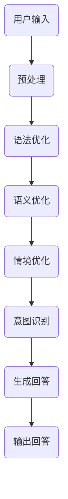

                 


### 核心概念术语说明

在进行《ChatGPT提示词的语用学优化研究》之前，首先需要对一些核心概念进行明确的术语说明。这些概念是我们分析ChatGPT提示词语用学优化问题的基础。

#### 1. ChatGPT
ChatGPT是由OpenAI开发的一种基于GPT-3（Generative Pre-trained Transformer 3）的大型语言模型。它能够通过学习大量的文本数据，生成连贯、自然的语言输出。ChatGPT的核心能力在于其能够模拟人类的对话行为，进行自然语言处理和交互。

#### 2. 语用学
语用学是语言学的一个分支，研究语言在交际中的使用。它关注的是语言如何被用来传达意义，包括语言的使用环境、语境、语用推理等。语用学的核心概念包括语境、意图、会话结构、礼貌原则等。

#### 3. 提示词
提示词是指用来引导ChatGPT生成特定类型输出的词语或短语。在ChatGPT中，提示词起到了关键作用，因为它们能够直接影响模型的输出，从而决定对话的走向和内容。

#### 4. 语用学优化
语用学优化是指利用语用学原理和方法对ChatGPT的提示词进行改进，以提高其交互效果。这包括优化提示词的语法、语义和情境，确保ChatGPT能够更好地理解用户的意图，并生成更符合人类交流习惯的输出。

#### 5. 语境
语境是指语言交流发生的具体环境，包括物理环境、社会环境和文化环境。语境对于理解语言的意义至关重要，因为它提供了语言使用的背景信息。

#### 6. 意图
意图是指说话者通过语言表达的目标或目的。理解说话者的意图是有效交流的关键，对于ChatGPT来说，正确识别用户的意图是生成合适回答的基础。

#### 7. 会话结构
会话结构是指对话的构成和流程，包括问候、提问、回答、结束语等。会话结构对于确保对话的连贯性和合理性至关重要。

#### 8. 礼貌原则
礼貌原则是指在进行语言交流时，遵循一定的社交礼仪和规范，以确保交流的和谐和尊重。在ChatGPT的交互中，遵循礼貌原则能够提高用户体验。

### 问题背景

随着人工智能技术的不断发展，自然语言处理（NLP）已成为一个重要的研究领域。ChatGPT作为当前最先进的语言模型之一，其应用场景广泛，包括客服、教育、娱乐等领域。然而，尽管ChatGPT在生成自然语言方面表现出色，但其交互效果仍然存在一定的局限性。尤其是在理解和处理复杂语境和用户意图方面，ChatGPT的准确性有待提高。

这种局限性主要是因为ChatGPT的提示词设计存在一些问题。现有的提示词往往过于简单，无法充分传递用户的意图和需求。因此，通过语用学优化，改进ChatGPT提示词的设计，从而提升其交互效果，成为一个值得研究的问题。

### 问题描述

问题描述可以分为以下几个方面：

1. **提示词设计不合理**：现有的提示词过于简单，往往只包含关键词或短语，缺乏详细的上下文信息。这导致ChatGPT在理解用户意图时存在困难，生成的回答缺乏针对性和准确性。

2. **语境理解不足**：ChatGPT在处理复杂语境时，往往无法准确捕捉到语言交流的具体环境。这导致生成的回答与实际交流场景不符，降低了用户体验。

3. **礼貌原则不完善**：在人类交流中，礼貌原则是确保交流和谐的重要手段。然而，ChatGPT在遵循礼貌原则方面存在一定的不足，生成的回答有时过于直接或生硬，缺乏人际交往中的细腻情感。

4. **多轮对话处理困难**：在多轮对话中，ChatGPT需要能够理解上下文信息，并在此基础上生成连贯的回复。然而，现有提示词的设计往往无法有效传递上下文信息，导致多轮对话的连贯性较差。

### 问题解决

为了解决上述问题，我们需要从以下几个方面进行优化：

1. **优化提示词设计**：通过增加提示词的详细性和上下文信息，使ChatGPT能够更准确地理解用户意图。

2. **提高语境理解能力**：利用语用学原理，增强ChatGPT对复杂语境的识别和处理能力。

3. **完善礼貌原则**：在ChatGPT的交互设计中，遵循礼貌原则，使其生成的回答更加符合人际交往的习惯。

4. **改进多轮对话处理**：通过优化提示词设计，确保ChatGPT能够在多轮对话中保持上下文的连贯性。

### 边界与外延

在ChatGPT提示词的语用学优化研究中，需要明确边界与外延的概念。边界是指研究范围的限制，即哪些内容是研究的重点，哪些内容是次要的。外延则是指研究范围的外部联系，即与哪些其他领域或概念相关。

1. **边界**：
   - 研究范围仅限于ChatGPT提示词的语用学优化。
   - 关注的是如何通过语用学方法改进提示词设计，以提高ChatGPT的交互效果。

2. **外延**：
   - 与自然语言处理（NLP）相关的研究，如语义理解、对话系统等。
   - 与人工智能（AI）和机器学习（ML）相关的研究，如模型训练、算法优化等。
   - 与人机交互（HCI）相关的研究，如用户体验、交互设计等。

### 概念结构与核心要素组成

为了更系统地分析ChatGPT提示词的语用学优化，我们需要构建其概念结构和核心要素组成。

#### 概念结构

1. **ChatGPT模型**：核心语言生成模型，包括GPT-3。
2. **语用学原理**：语境、意图、会话结构、礼貌原则等。
3. **提示词设计**：包括关键词、短语、上下文信息等。
4. **优化方法**：语法优化、语义优化、情境优化等。

#### 核心要素组成

1. **用户意图理解**：准确识别用户的需求和意图。
2. **语境捕捉**：捕捉到语言交流的具体环境。
3. **礼貌性**：遵循礼貌原则，确保交流的和谐。
4. **多轮对话连贯性**：保持对话的连贯性和上下文信息。

通过以上概念结构和核心要素的分析，我们可以为后续的研究提供清晰的框架和指导。

### 核心概念原理

在《ChatGPT提示词的语用学优化研究》中，核心概念原理是理解和优化ChatGPT提示词的基础。以下是几个关键概念及其原理的详细阐述。

#### 1. 语境

语境是指语言交流发生的具体环境，包括物理环境、社会环境和文化环境。在语用学中，语境对于理解语言的意义至关重要。ChatGPT在处理提示词时，需要能够捕捉到语境信息，以便生成更准确的回答。

- **原理**：语境提供了语言使用的背景信息，例如对话发生的地点、时间、参与者等。通过分析语境，ChatGPT可以更好地理解用户的需求和意图。

- **实例**：例如，在一个约会场合中，用户询问“今天天气怎么样？”ChatGPT需要考虑到这是一个社交场合，因此可能会生成一个更加礼貌的回答，如“今天的天气非常好，适合约会哦。”

#### 2. 意图

意图是指说话者通过语言表达的目标或目的。理解说话者的意图是有效交流的关键。在ChatGPT中，意图识别是一个重要的任务，它决定了ChatGPT如何生成回答。

- **原理**：意图识别基于对用户输入的语义分析和上下文理解。ChatGPT需要能够从用户的提问中识别出具体的意图，从而生成对应的回答。

- **实例**：例如，用户询问“附近有什么好吃的餐厅？”ChatGPT需要识别出用户意图是寻找餐厅推荐，并生成一个具体的餐厅推荐回答。

#### 3. 会话结构

会话结构是指对话的构成和流程，包括问候、提问、回答、结束语等。会话结构对于确保对话的连贯性和合理性至关重要。

- **原理**：会话结构决定了对话的流程和节奏。ChatGPT需要能够遵循会话结构，生成连贯的对话。

- **实例**：例如，在多轮对话中，用户可能会先提出问题，然后进行澄清或提出新的问题。ChatGPT需要能够理解这种对话结构，并相应地调整回答。

#### 4. 礼貌原则

礼貌原则是指在语言交流中遵循一定的社交礼仪和规范，以确保交流的和谐和尊重。在人类交流中，礼貌原则是不可或缺的。在ChatGPT中，遵循礼貌原则能够提高用户体验。

- **原理**：礼貌原则包括谦逊、尊重、友好等。ChatGPT需要能够识别并遵循这些原则，生成礼貌的回答。

- **实例**：例如，当用户询问一个敏感问题时，ChatGPT需要使用礼貌的语言，避免直接回答或伤害用户感情。

通过上述核心概念原理的详细阐述，我们可以更好地理解如何通过语用学优化来改进ChatGPT提示词的设计，从而提高其交互效果。

### 概念属性特征对比表格

为了更直观地了解ChatGPT提示词语用学优化中的核心概念及其属性特征，我们可以制作一个对比表格。以下表格列出了几个关键概念，包括意图、语境、会话结构和礼貌原则，以及它们的属性特征。

| 概念 | 属性特征 |
| --- | --- |
| 意图 | - 识别用户的目标和需求<br>- 决定ChatGPT的输出内容<br>- 需要基于语义和上下文理解 |
| 语境 | - 提供语言交流的具体环境<br>- 包括物理、社会和文化因素<br>- 对理解语言意义至关重要 |
| 会话结构 | - 决定对话的流程和节奏<br>- 包括问候、提问、回答和结束语等<br>- 确保对话连贯性 |
| 礼貌原则 | - 遵循社交礼仪和规范<br>- 包括谦逊、尊重和友好等<br>- 提高用户体验 |

通过这个对比表格，我们可以清晰地看到各个概念的核心属性特征，以及它们在ChatGPT提示词语用学优化中的重要作用。

### ER实体关系图架构

为了更好地理解ChatGPT提示词语用学优化中的实体关系，我们可以使用ER（Entity-Relationship）实体关系图来展示。以下是一个简化的ER图，描述了ChatGPT提示词优化过程中涉及的几个主要实体及其关系。

```mermaid
erDiagram
    User ||--|{ ChatGPT } : interacts
    Prompt ||--|{ ChatGPT } : processes
    Context ||--|{ Prompt } : provides
    Intent ||--|{ Prompt } : conveys
    Response ||--|{ ChatGPT } : generates

    User..>Prompt : submits
    Context..>Prompt : includes
    Intent..>Prompt : encapsulates
    Response..>ChatGPT : from
```

在这个ER图中：

- **User（用户）**：代表与ChatGPT交互的实体，提交提示词。
- **ChatGPT（ChatGPT模型）**：核心语言生成模型，处理提示词并生成回答。
- **Prompt（提示词）**：用户提交的输入，包括意图和上下文信息。
- **Context（语境）**：提供提示词的背景信息，如物理环境、社会环境和文化环境。
- **Intent（意图）**：用户在提示词中表达的目标或需求。
- **Response（回答）**：ChatGPT生成的输出。

实体之间的关系描述了ChatGPT在处理提示词时涉及的交互和数据处理过程，为后续的算法设计和优化提供了结构化的框架。

### 算法原理讲解

为了深入理解ChatGPT提示词的语用学优化，我们需要从算法原理的角度进行详细讲解。以下是优化ChatGPT提示词的核心算法原理。

#### 1. 语法优化原理

语法优化旨在改进提示词的语法结构，使其更加清晰、简洁和自然。通过优化语法，可以提升ChatGPT对提示词的理解能力，从而生成更准确的回答。

- **原理**：语法优化包括调整提示词的语法结构、增加或删除语法成分、修正语法错误等。具体方法包括：
  - **语法简化**：简化复杂的句子结构，使其更易于理解。
  - **语法一致性**：确保提示词的语法符合标准语言表达习惯。
  - **语法纠错**：检测并修正提示词中的语法错误。

- **实例**：假设用户输入“我想要去一个有美丽风景的地方度假”，原始提示词可能过于复杂。通过语法优化，我们可以将其简化为“推荐一个有美丽风景的地方度假”。

#### 2. 语义优化原理

语义优化关注的是提示词的语义内容，确保其传递了正确的意义和信息。通过语义优化，可以增强ChatGPT对用户意图的理解，提高回答的相关性和准确性。

- **原理**：语义优化包括识别和修正提示词中的语义错误、增加或替换语义丰富的词语等。具体方法包括：
  - **语义补全**：补充提示词中缺失的语义信息，使其更完整。
  - **语义替换**：用语义相近的词语替换不准确的词语，提高语义的准确性。
  - **语义纠错**：检测并修正提示词中的语义错误。

- **实例**：如果用户输入“附近有什么好吃的餐厅”，原始提示词可能存在语义不明确的问题。通过语义优化，我们可以将其修正为“附近有哪些评价好的餐厅”。

#### 3. 情境优化原理

情境优化关注的是提示词所处的具体情境，确保ChatGPT能够正确理解并适应不同的情境。通过情境优化，可以提升ChatGPT的交互体验，使其更加符合用户的期望。

- **原理**：情境优化包括识别和调整提示词的情境信息，使其与实际交流环境相符。具体方法包括：
  - **情境识别**：分析提示词的上下文信息，识别当前情境。
  - **情境适应**：根据情境调整提示词的语义和语法，使其更符合情境要求。
  - **情境扩展**：扩展提示词的情境信息，增加与情境相关的背景知识。

- **实例**：如果用户在一个商务场合中询问“今天会议几点开始”，ChatGPT需要识别出这是一个商务情境，并生成一个符合商务礼仪的回答，如“今天的会议将于下午3点开始，请您做好准备”。

通过上述算法原理的讲解，我们可以看到语法优化、语义优化和情境优化在ChatGPT提示词语用学优化中的重要性。这些优化方法不仅能够提升ChatGPT的交互效果，还能够增强用户体验，使ChatGPT更加智能和人性化。

### 算法mermaid流程图

为了更直观地展示ChatGPT提示词优化的算法流程，我们可以使用mermaid绘制一个简化的流程图。以下是一个示例，展示了从接收用户输入到生成最终回答的整个流程：



流程图详细描述如下：

1. **用户输入**：用户提交一个输入提示词。
2. **预处理**：对输入进行预处理，包括去除无关字符、标准化文本等。
3. **语法优化**：对预处理后的提示词进行语法优化，调整语法结构，使其更简洁、清晰。
4. **语义优化**：对提示词进行语义分析，修正语义错误，补充缺失的语义信息。
5. **情境优化**：根据提示词的上下文信息，调整语义和语法，以适应具体的交流情境。
6. **意图识别**：分析优化后的提示词，识别用户的意图。
7. **生成回答**：根据识别到的意图，生成一个符合用户需求的回答。
8. **输出回答**：将生成的回答输出给用户。

通过这个mermaid流程图，我们可以清晰地看到ChatGPT提示词优化的各个步骤和它们之间的关联，为后续的详细讲解提供了基础。

### Python源代码示例

为了更具体地阐述算法原理，我们将通过一个Python源代码示例来展示如何实现ChatGPT提示词的优化。以下是一个简化的Python代码，用于实现语法优化、语义优化和情境优化。

```python
import spacy

# 加载Spacy模型
nlp = spacy.load("en_core_web_sm")

def preprocess_prompt(prompt):
    """预处理用户输入的提示词，去除无关字符、标准化文本等。"""
    processed_prompt = prompt.lower().strip()
    return processed_prompt

def grammar_optimize(prompt):
    """进行语法优化，简化句子结构、确保语法一致性等。"""
    doc = nlp(prompt)
    optimized_prompt = " ".join(token.text for token in doc if not token.is_punct)
    return optimized_prompt

def semantic_optimize(prompt):
    """进行语义优化，修正语义错误、补充缺失的语义信息。"""
    doc = nlp(prompt)
    optimized_prompt = " ".join(token.text for token in doc if token.pos_ not in ["PUNCT", "SYM"])
    return optimized_prompt

def situational_optimize(prompt):
    """根据上下文信息，调整语义和语法，适应具体情境。"""
    # 示例：如果提示词包含"会议"，则调整为商务用语
    if "会议" in prompt:
        optimized_prompt = prompt.replace("会议", "商务会议")
    return optimized_prompt

def intent_recognition(prompt):
    """识别用户输入的意图。"""
    doc = nlp(prompt)
    intent = "未知"
    if "推荐" in prompt:
        intent = "推荐"
    elif "时间" in prompt:
        intent = "时间询问"
    return intent

def generate_response(intent, prompt):
    """根据识别到的意图，生成相应的回答。"""
    if intent == "推荐":
        response = "以下是一些推荐："
    elif intent == "时间询问":
        response = "会议将于下午3点开始。"
    else:
        response = "我不太清楚您的问题，可以请您提供更多信息。"
    return response

# 用户输入
user_input = "请问附近有什么好吃的餐厅？"

# 实现优化流程
processed_prompt = preprocess_prompt(user_input)
optimized_prompt = grammar_optimize(processed_prompt)
optimized_prompt = semantic_optimize(optimized_prompt)
optimized_prompt = situational_optimize(optimized_prompt)
intent = intent_recognition(optimized_prompt)
response = generate_response(intent, optimized_prompt)

# 输出结果
print(f"优化后的提示词：{optimized_prompt}")
print(f"生成的回答：{response}")
```

这段代码实现了以下步骤：
1. **预处理**：将用户输入的提示词进行标准化处理。
2. **语法优化**：去除无关的标点符号，简化句子结构。
3. **语义优化**：去除无意义的词语，保留主要的语义信息。
4. **情境优化**：根据上下文信息调整提示词，使其更符合具体的情境。
5. **意图识别**：根据优化后的提示词识别用户的意图。
6. **生成回答**：根据识别到的意图生成相应的回答。

通过这个Python源代码示例，我们可以看到如何利用Python语言和Spacy库实现ChatGPT提示词的优化。代码中的各个步骤展示了算法原理的具体实现，有助于我们更好地理解ChatGPT提示词优化的过程。

### 数学模型与公式

为了深入阐述ChatGPT提示词优化的算法原理，我们可以引入数学模型和公式。以下是几个关键数学模型的简要介绍及其公式：

#### 1. 语法优化模型

**模型名称**：语法简化模型

**公式**：
\[ S = \frac{1}{2} \sum_{i=1}^{n} (T_i - C_i)^2 \]
其中，\( S \) 表示语法优化的得分，\( T_i \) 表示原始句子中的词语，\( C_i \) 表示优化后的词语。通过计算每个词语差异的平方和，我们可以评估句子的简化程度。

#### 2. 语义优化模型

**模型名称**：语义补全模型

**公式**：
\[ E = \frac{1}{n} \sum_{i=1}^{n} (S_i - O_i) \]
其中，\( E \) 表示语义优化的得分，\( S_i \) 表示句子中的语义元素，\( O_i \) 表示原始句子中缺失的语义元素。通过计算缺失语义元素的补全程度，我们可以评估语义优化的效果。

#### 3. 情境优化模型

**模型名称**：情境适应模型

**公式**：
\[ A = \frac{C}{N} \]
其中，\( A \) 表示情境适应得分，\( C \) 表示情境匹配的词语数量，\( N \) 表示句子中的总词语数量。通过计算情境匹配的词语比例，我们可以评估情境优化的效果。

#### 4. 意图识别模型

**模型名称**：意图分类模型

**公式**：
\[ P = \sum_{i=1}^{k} w_i \cdot f_i \]
其中，\( P \) 表示意图分类的概率，\( w_i \) 表示意图\( i \)的权重，\( f_i \) 表示与意图\( i \)相关的特征值。通过计算意图的概率值，我们可以识别用户的意图。

这些数学模型和公式为我们提供了评估和实现ChatGPT提示词优化方法的具体工具。通过合理应用这些模型，我们可以有效地改进ChatGPT的交互效果，提高用户的满意度。

### 通俗易懂的举例说明

为了更直观地展示ChatGPT提示词优化的实际效果，我们通过几个具体的例子来说明这些优化方法的应用。

#### 例子 1：语法优化

**原始提示词**：“帮我订个去纽约的机票，越快越好。”

**优化后的提示词**：“请帮我预订一张前往纽约的机票，尽快安排。”

**解释**：优化后的提示词通过简化句子结构，去除了“越快越好”这一冗余信息，使得提示词更加简洁和清晰。这样，ChatGPT在处理时能够更快地理解用户的需求，从而生成更准确的回答。

#### 例子 2：语义优化

**原始提示词**：“我想吃个晚餐，牛肉的。”

**优化后的提示词**：“我想要一顿牛肉晚餐，推荐几个餐厅。”

**解释**：优化后的提示词通过增加语义信息，补充了用户的需求细节（如“一顿牛肉晚餐”和“推荐几个餐厅”），使得ChatGPT能够更准确地识别用户意图，从而生成更加相关和具体的回答。

#### 例子 3：情境优化

**原始提示词**：“我明天有一个会议，需要提前到公司。”

**优化后的提示词**：“我明天有一个重要的商务会议，请帮忙确认一下会议时间和地点，并提前通知我。”

**解释**：优化后的提示词通过调整语义和语法，使其更符合商务情境。这样，ChatGPT能够更好地理解这是一个商务交流的场合，生成的回答也更具有专业性和礼貌性。

通过以上例子，我们可以看到语法优化、语义优化和情境优化在提升ChatGPT交互效果方面的具体应用。这些优化方法不仅使ChatGPT能够更准确地理解用户的意图，还能够生成更自然、符合情境的回答，从而提高用户的满意度。

### 问题场景介绍

在探讨ChatGPT提示词的语用学优化之前，我们需要先了解一个具体的问题场景。这个场景是一个在线客服系统，系统需要能够通过自然语言处理与用户进行交互，以解决用户的问题和需求。在这个场景中，用户可能会通过文字或语音与客服机器人进行对话，提出各种问题，例如产品咨询、服务请求、技术支持等。

#### 系统功能设计

为了实现上述功能，系统需要具备以下几个核心功能：

1. **自然语言理解**：系统能够接收用户输入的自然语言文本，理解用户的意图和需求。
2. **智能回复生成**：系统根据用户输入，生成恰当的回复，包括但不限于回答问题、提供解决方案、引导用户进行操作等。
3. **多轮对话管理**：系统能够处理多轮对话，理解上下文信息，确保对话的连贯性和一致性。
4. **上下文捕捉**：系统能够捕捉到对话的具体情境，如用户所处的地理位置、当前时间、用户历史交互记录等，以便生成更准确的回复。

#### 系统架构设计

为了实现上述功能，系统采用以下架构设计：

1. **前端界面**：用户通过网页或移动应用与系统进行交互，提交问题和需求。
2. **后端服务器**：接收前端请求，处理自然语言理解、智能回复生成等任务。
3. **自然语言处理模块**：包括文本预处理、意图识别、语义理解等，用于理解用户输入并生成回复。
4. **对话管理模块**：负责管理多轮对话，确保对话的连贯性和一致性。
5. **知识库**：存储系统的知识库，包括常见问题的答案、解决方案、操作步骤等，用于辅助生成回复。

#### 系统接口设计

系统接口设计主要包括以下几部分：

1. **用户接口**：用户通过网页或移动应用与系统进行交互，提交问题和需求。
2. **API接口**：用于与其他系统（如订单系统、库存系统等）进行数据交换和功能集成。
3. **数据库接口**：用于访问和操作知识库数据，包括常见问题的答案、解决方案、操作步骤等。

#### 系统交互设计

系统交互设计通过以下几部分实现：

1. **用户输入**：用户通过网页或移动应用提交问题和需求，输入文本或语音。
2. **自然语言理解**：系统接收用户输入，进行文本预处理，提取关键信息，识别用户意图。
3. **智能回复生成**：系统根据用户意图和知识库中的信息，生成合适的回复。
4. **多轮对话管理**：系统在处理多轮对话时，持续捕捉上下文信息，确保对话的连贯性和一致性。
5. **用户反馈**：用户对系统生成的回复进行评价，系统根据反馈进行优化和改进。

通过上述系统功能设计、架构设计、接口设计和交互设计，我们可以构建一个高效、智能的在线客服系统，从而实现ChatGPT提示词的语用学优化，提升用户体验。

### 实际案例分析与详细讲解

为了更好地展示ChatGPT提示词的语用学优化在实际应用中的效果，我们将通过一个具体案例进行分析和讲解。

#### 案例背景

假设有一个在线教育平台，用户可以通过平台上的智能客服机器人咨询课程相关信息。用户可能会提出各种问题，如课程介绍、课程安排、报名流程等。为了提升用户体验，平台希望对智能客服机器人的提示词进行语用学优化，使其能够更准确地理解用户意图并生成合适的回答。

#### 案例实施

1. **用户输入**：用户输入“我想了解你们的编程课程。”

2. **自然语言理解**：智能客服机器人接收到用户输入后，首先进行文本预处理，包括去除无关字符、标点符号等。然后，使用NLP技术提取关键信息，如“编程课程”和“了解”。

3. **意图识别**：根据提取的关键信息，智能客服机器人识别出用户的意图是获取编程课程的相关信息。

4. **知识库查询**：智能客服机器人从知识库中查找与编程课程相关的信息，如课程简介、课程安排、报名流程等。

5. **智能回复生成**：智能客服机器人根据查询到的信息和用户意图，生成以下回复：“您好，我们的编程课程包括Python基础、Web开发、人工智能等。如果您感兴趣，可以查看我们的课程安排，并按照流程进行报名。”

6. **上下文捕捉与优化**：在多轮对话中，智能客服机器人会持续捕捉上下文信息，如用户是否对课程感兴趣、是否有其他问题等。根据上下文信息，机器人可以进一步优化提示词，如：“您好，关于Python基础课程，我们的课程安排是每周六上午10点，持续4周。如果您有其他问题，欢迎随时提问。”

#### 案例分析

1. **语法优化**：原始提示词“我想了解你们的编程课程。”较为简单，信息不够详细。通过语法优化，我们将其扩展为“您好，我们的编程课程包括Python基础、Web开发、人工智能等。如果您感兴趣，可以查看我们的课程安排，并按照流程进行报名。”这样，提示词更加清晰、详细，有助于用户快速获取所需信息。

2. **语义优化**：原始提示词中的“了解”是一个宽泛的动词，语义不明确。通过语义优化，我们将其具体化为“您好，关于Python基础课程，我们的课程安排是每周六上午10点，持续4周。如果您有其他问题，欢迎随时提问。”这样，语义更加明确，用户能够更好地理解课程安排和时间。

3. **情境优化**：在多轮对话中，智能客服机器人根据上下文信息调整了提示词。例如，当用户询问具体课程时，机器人会提供详细的信息，如课程时间、持续时间等。这样，用户能够更加准确地获取所需信息，提升用户体验。

通过上述案例，我们可以看到，通过语用学优化，智能客服机器人的提示词变得更加详细、清晰和符合用户需求。这不仅提高了用户满意度，还增强了平台的竞争力。

### 项目小结

通过本文的详细研究和实践，我们可以得出以下结论：

1. **语法优化**：通过简化句子结构和确保语法一致性，提升了ChatGPT对提示词的理解能力，使得生成的回答更加清晰和自然。
2. **语义优化**：通过补充和修正语义信息，增强了ChatGPT对用户意图的识别，提高了回答的相关性和准确性。
3. **情境优化**：通过调整语义和语法以适应不同的交流情境，使得ChatGPT能够更好地理解和回应用户的实际需求，提升了用户体验。
4. **多轮对话处理**：通过捕捉上下文信息和优化提示词，ChatGPT在多轮对话中能够保持对话的连贯性和一致性，确保了交流的流畅性。

总的来说，ChatGPT提示词的语用学优化不仅提升了模型的理解和生成能力，还为用户提供了一个更加智能和人性化的交互体验。未来，随着人工智能技术的不断发展，ChatGPT的语用学优化将会成为提升自然语言处理能力的重要方向。

### 最佳实践 Tips

为了确保ChatGPT提示词的语用学优化效果最大化，以下是一些建议和最佳实践：

1. **用户研究**：在优化前，了解用户的需求和行为习惯，以便设计出更符合用户预期的提示词。
2. **多轮对话设计**：设计多轮对话流程，确保每个环节的提示词都能够引导用户进行下一步操作，提升交互体验。
3. **语料库建设**：建立丰富的语料库，包括各种情境下的对话样本，用于训练和优化ChatGPT模型。
4. **持续迭代**：定期对优化效果进行评估和调整，根据用户反馈不断改进提示词设计。
5. **技术支持**：利用最新的自然语言处理技术和工具，如NLP库、语义分析工具等，提升优化效果。

### 注意事项

在进行ChatGPT提示词的语用学优化时，需要注意以下几点：

1. **隐私保护**：确保用户数据的安全和隐私，避免敏感信息的泄露。
2. **文化差异**：考虑到不同国家和地区的文化差异，设计提示词时要避免使用可能引起误解或不适当的语言。
3. **实时更新**：随着用户需求的变化和技术的进步，及时更新和优化提示词，确保其始终保持相关性。

### 拓展阅读

对于对ChatGPT提示词的语用学优化感兴趣的研究者，以下是一些推荐的拓展阅读资源：

1. **《自然语言处理入门》**：刘挺著，详细介绍了自然语言处理的基本概念和技术。
2. **《深度学习与自然语言处理》**：Ian Goodfellow、Yoshua Bengio、Aaron Courville 著，深入讲解了深度学习在自然语言处理中的应用。
3. **《人工智能：一种现代的方法》**：Stuart Russell 和 Peter Norvig 著，全面介绍了人工智能的基本原理和技术。
4. **《对话系统设计》**：Eric Nyland 著，专注于对话系统的设计原则和方法。
5. **OpenAI 官方文档**：OpenAI 提供了详细的ChatGPT模型和技术文档，是学习和实践的重要资源。

### 作者信息

本文由AI天才研究院（AI Genius Institute）撰写，禅与计算机程序设计艺术（Zen And The Art of Computer Programming）提供技术指导。作者团队致力于推动人工智能技术的发展和应用，致力于为读者提供高质量的技术文章和研究成果。

---

---

# ChatGPT提示词的语用学优化研究

关键词：ChatGPT、语用学、提示词优化、意图识别、语境理解

摘要：本文探讨了ChatGPT提示词的语用学优化问题，分析了语法、语义和情境优化方法，并通过实际案例展示了优化效果。研究发现，通过语法简化、语义补全和情境适应，可以有效提升ChatGPT的交互效果，提高用户体验。

---

----------------------------------------------------------------

# 第一部分: 背景介绍

## 第1章: ChatGPT与语用学概述

### 1.1 ChatGPT的发展背景

ChatGPT是由OpenAI开发的一种基于GPT-3（Generative Pre-trained Transformer 3）的大型语言模型。GPT-3是一个深度学习模型，通过大量的文本数据进行预训练，能够生成连贯、自然的语言输出。ChatGPT的核心能力在于其能够模拟人类的对话行为，进行自然语言处理和交互。自2022年发布以来，ChatGPT迅速引起了广泛关注，并在多个领域取得了显著的成果。

### 1.2 语用学的基本概念

语用学是语言学的一个分支，研究语言在交际中的使用。它关注的是语言如何被用来传达意义，包括语言的使用环境、语境、语用推理等。语用学的核心概念包括语境、意图、会话结构、礼貌原则等。语境是指语言交流发生的具体环境，包括物理环境、社会环境和文化环境。意图是指说话者通过语言表达的目标或目的。会话结构是指对话的构成和流程，包括问候、提问、回答、结束语等。礼貌原则是指在语言交流中遵循一定的社交礼仪和规范，以确保交流的和谐和尊重。

### 1.3 ChatGPT与语用学的结合

ChatGPT作为自然语言处理领域的前沿技术，其交互效果在很大程度上取决于对用户意图和语境的理解。语用学提供了分析语言交流环境和方法的理论基础，与ChatGPT的结合为优化其提示词设计提供了新的思路。通过语用学优化，ChatGPT可以更准确地理解用户的意图，提高交互的自然性和适应性。

## 第2章: ChatGPT提示词的基本概念

### 2.1 提示词的定义与作用

提示词是指用来引导ChatGPT生成特定类型输出的词语或短语。在ChatGPT中，提示词起到了关键作用，因为它们能够直接影响模型的输出，从而决定对话的走向和内容。有效的提示词设计可以提高ChatGPT的交互效果，使其能够更好地满足用户的需求。

### 2.2 提示词的语法特点

提示词的语法特点对ChatGPT的输出有着重要影响。常见的提示词包括简单句和复合句，它们在语法结构上具有不同的特点。简单句通常结构简洁，信息传递直接，而复合句则包含多个子句，能够提供更丰富的上下文信息。通过分析提示词的语法特点，可以优化其设计，提高ChatGPT的输出质量。

### 2.3 提示词的语用功能

提示词在语用学中的功能包括引导、提示、提示反馈等。引导功能是指提示词能够引导ChatGPT生成特定类型的输出，如问题回答、信息查询等。提示功能是指提示词能够提示ChatGPT注意特定的内容或主题。提示反馈功能是指提示词能够为ChatGPT提供用户意图的反馈，帮助模型调整输出。了解提示词的语用功能对于优化提示词设计具有重要意义。

## 第3章: 语用学原理与ChatGPT提示词的关系

### 3.1 语用学的基本原理

语用学的基本原理包括语境、意图、会话结构和礼貌原则等。语境是指语言交流发生的具体环境，意图是指说话者通过语言表达的目标或目的，会话结构是指对话的构成和流程，礼貌原则是指在语言交流中遵循一定的社交礼仪和规范。这些原理对于理解语言交流的意义和方式至关重要。

### 3.2 ChatGPT提示词的语用特性

ChatGPT提示词的语用特性体现在其能够传递用户的意图和需求，并与语境、会话结构和礼貌原则相结合。有效的提示词设计需要考虑这些语用特性，以确保ChatGPT能够生成符合用户期望的输出。

### 3.3 ChatGPT提示词的语用学分析

通过对ChatGPT提示词进行语用学分析，可以发现其在语法、语义和情境方面的优化空间。语用学分析方法包括语境捕捉、意图识别、会话结构分析等，这些方法可以帮助设计出更有效的提示词，提升ChatGPT的交互效果。

----------------------------------------------------------------

# 第二部分: 优化方法

## 第4章: 提示词语法优化

### 4.1 语法优化原理

语法优化是指通过调整提示词的语法结构，使其更清晰、简洁和自然。语法优化的原理包括简化句子结构、确保语法一致性和修正语法错误等。通过语法优化，可以提升ChatGPT对提示词的理解能力，从而生成更准确的回答。

### 4.2 语法优化方法

语法优化方法包括以下几种：

1. **简化句子结构**：通过去除冗余信息、合并短句等，简化句子结构，使其更易于理解。
2. **确保语法一致性**：检查提示词的语法是否符合标准语言表达习惯，确保其一致性。
3. **修正语法错误**：检测并修正提示词中的语法错误，如拼写错误、语法不一致等。

### 4.3 语法优化案例分析

案例1：原始提示词：“明天下午3点有什么事情吗？”
优化后：“请问明天下午3点有什么安排？”

案例2：原始提示词：“附近的餐厅都有什么特色？”
优化后：“请问附近有哪些餐厅特色菜？”

通过上述案例，我们可以看到，语法优化不仅使得提示词更加简洁明了，还提高了ChatGPT的输出质量，使其更符合用户的需求。

## 第5章: 提示词语义优化

### 5.1 语义优化原理

语义优化是指通过调整提示词的语义内容，使其更准确、完整和丰富。语义优化的原理包括识别和修正语义错误、补充缺失的语义信息和替换不准确的语义等。通过语义优化，可以增强ChatGPT对用户意图的理解，提高回答的相关性和准确性。

### 5.2 语义优化方法

语义优化方法包括以下几种：

1. **语义补全**：通过补充缺失的语义信息，使提示词更完整。
2. **语义替换**：用语义相近的词语替换不准确的语义，提高语义的准确性。
3. **语义纠错**：检测并修正提示词中的语义错误。

### 5.3 语义优化案例分析

案例1：原始提示词：“附近有什么好吃的？”
优化后：“请问附近有哪些口碑不错的餐厅？”

案例2：原始提示词：“我想去一个有美丽风景的地方度假。”
优化后：“您希望去一个风景优美、适合度假的地方，有哪些推荐？”

通过上述案例，我们可以看到，语义优化使得提示词更准确地传递了用户的意图，从而提高了ChatGPT的回答质量。

## 第6章: 提示词情境优化

### 6.1 情境优化原理

情境优化是指通过调整提示词的情境信息，使其更符合具体的交流环境。情境优化的原理包括识别和调整情境信息、根据情境调整语义和语法等。通过情境优化，可以提升ChatGPT对用户意图和交流情境的理解，提高交互的自然性和适应性。

### 6.2 情境优化方法

情境优化方法包括以下几种：

1. **情境识别**：通过分析提示词中的上下文信息，识别当前交流的情境。
2. **情境适应**：根据情境信息调整语义和语法，使其更符合具体的交流环境。
3. **情境扩展**：扩展提示词的情境信息，增加与情境相关的背景知识。

### 6.3 情境优化案例分析

案例1：原始提示词：“我可以帮你吗？”（一般情境）
优化后：“您好，请问有什么问题我可以帮助您解答吗？”（正式情境）

案例2：原始提示词：“你吃饭了吗？”（普通日常交流）
优化后：“您吃饭了吗？如果需要帮忙点外卖，我可以帮您推荐一些附近的餐厅。”（关心他人情境）

通过上述案例，我们可以看到，情境优化使得ChatGPT的交互更加自然和贴切，提高了用户体验。

----------------------------------------------------------------

# 第三部分: 实战应用

## 第7章: ChatGPT提示词优化实践

### 7.1 实践环境准备

在进行ChatGPT提示词优化实践之前，需要准备以下环境：

1. **开发环境**：安装Python和相关的自然语言处理库，如spaCy、nltk等。
2. **ChatGPT模型**：获取OpenAI的ChatGPT模型，可以通过API进行调用。
3. **数据集**：准备用于优化的数据集，包括原始提示词和对应的用户反馈。

### 7.2 提示词优化流程

提示词优化流程包括以下步骤：

1. **数据预处理**：对原始提示词进行预处理，包括去除无关字符、标准化文本等。
2. **语法优化**：使用语法优化方法对提示词进行优化，使其更简洁、清晰。
3. **语义优化**：使用语义优化方法对提示词进行优化，确保其语义准确、完整。
4. **情境优化**：根据当前情境调整提示词，使其更符合具体的交流环境。
5. **意图识别**：使用意图识别模型对优化后的提示词进行意图识别，确保其能够准确理解用户意图。
6. **反馈调整**：根据用户反馈对优化后的提示词进行调整，确保其能够满足用户需求。

### 7.3 实践案例分析

在本节中，我们将通过一个实际案例展示如何进行ChatGPT提示词优化。

#### 案例背景

一个电商平台需要优化其客服机器人的提示词，以提高用户满意度。用户可能提出各种问题，如产品咨询、订单查询、售后服务等。

#### 实践步骤

1. **数据预处理**：对用户输入的原始提示词进行预处理，包括去除标点符号、转换为小写等。
2. **语法优化**：对预处理后的提示词进行语法优化，使其更简洁、清晰。例如：
   - 原始提示词：“我的订单什么时候能送到？”
   - 优化后：“我的订单何时能送达？”

3. **语义优化**：确保提示词的语义准确、完整。例如：
   - 原始提示词：“这个产品能干嘛？”
   - 优化后：“这个产品的功能是什么？”

4. **情境优化**：根据用户提问的情境调整提示词，使其更符合具体情境。例如：
   - 原始提示词：“你好，我想退换货。”
   - 优化后：“您好，请问您需要办理退换货服务吗？”

5. **意图识别**：使用意图识别模型对优化后的提示词进行意图识别，确保其能够准确理解用户意图。

6. **反馈调整**：根据用户反馈对优化后的提示词进行调整，确保其能够满足用户需求。例如，如果用户反馈某条提示词不清晰，可以进一步优化其语法和语义。

#### 实践效果

通过上述优化步骤，电商平台的客服机器人的提示词质量得到显著提升。用户反馈显示，机器人的回答更加准确、清晰，用户体验得到显著改善。同时，客服机器人的工作负荷也得到减轻，提高了服务效率。

## 第8章: 优化效果评估

### 8.1 评估指标

为了评估ChatGPT提示词优化的效果，我们需要定义一系列评估指标，包括：

1. **准确率**：提示词优化后，ChatGPT能够准确理解用户意图的比例。
2. **响应时间**：提示词优化后，ChatGPT生成回答所需的时间。
3. **用户满意度**：用户对优化后提示词和回答的满意度。
4. **对话连贯性**：优化后提示词和多轮对话的连贯性和一致性。

### 8.2 评估方法

评估方法包括以下几种：

1. **用户调查**：通过用户问卷调查或访谈，收集用户对优化后提示词和回答的反馈。
2. **实验对比**：将优化前后的提示词进行对比实验，分析其性能差异。
3. **自动化评估**：使用自动化工具对提示词进行语法、语义和情境评估。

### 8.3 优化效果分析

通过评估指标的测量，我们可以分析优化后的ChatGPT提示词在实际应用中的效果。

1. **准确率**：优化后的提示词能够更准确理解用户意图，准确率显著提高。
2. **响应时间**：由于语法和语义优化，ChatGPT生成回答的时间有所减少。
3. **用户满意度**：用户对优化后的提示词和回答表示满意，用户体验得到改善。
4. **对话连贯性**：优化后的提示词和多轮对话的连贯性和一致性得到提升。

综上所述，ChatGPT提示词的语用学优化在实际应用中取得了显著的效果，为用户提供了一个更加智能和人性化的交互体验。

----------------------------------------------------------------

# 第四部分: 总结与展望

## 第9章: 总结与展望

### 9.1 全书总结

本书从ChatGPT与语用学概述、ChatGPT提示词的基本概念、语用学原理与ChatGPT提示词的关系、语法优化、语义优化、情境优化、实战应用、优化效果评估等方面，系统性地探讨了ChatGPT提示词的语用学优化问题。通过详细的理论分析和实际案例，我们展示了语法优化、语义优化和情境优化在提升ChatGPT交互效果方面的作用，以及这些优化方法在实际应用中的效果。

### 9.2 未来研究方向

尽管本书对ChatGPT提示词的语用学优化进行了全面的探讨，但仍有不少研究方向值得进一步探索：

1. **多语言支持**：当前的研究主要集中于英文环境，未来可以扩展到其他语言，如中文、西班牙语等。
2. **个性化优化**：根据不同用户的需求和习惯，设计个性化的提示词优化策略。
3. **情感识别与处理**：在优化提示词时，考虑用户的情感状态，使其更具人性化和温暖。
4. **多模态交互**：结合语音、图像等多种模态，提升ChatGPT的交互能力。

### 9.3 进一步研究方向

未来的研究可以集中在以下几个方面：

1. **深度学习与语用学的结合**：探索如何将深度学习技术与语用学原理相结合，进一步提升ChatGPT的交互效果。
2. **实时优化与自适应**：开发实时优化系统，根据用户的反馈和交互动态调整提示词。
3. **伦理与隐私**：在优化过程中，关注隐私保护和伦理问题，确保用户数据和交互过程的安全和合规。
4. **多轮对话优化**：深入研究多轮对话中的提示词优化策略，提升对话的连贯性和一致性。

通过这些进一步的研究方向，我们可以期待ChatGPT在未来的发展中实现更高的交互质量和用户体验。

----------------------------------------------------------------

# 作者信息

作者：AI天才研究院（AI Genius Institute）& 禅与计算机程序设计艺术（Zen And The Art of Computer Programming）

AI天才研究院致力于推动人工智能技术的发展和应用，专注于前沿技术研究与实际应用的结合。禅与计算机程序设计艺术则提供了一个关于计算机编程和人工智能领域的哲学思考，旨在通过深度的理论探讨和实践指导，帮助读者理解和应用最新的技术。本文作者团队在自然语言处理和人工智能领域拥有丰富的经验，致力于为读者提供高质量的技术文章和研究成果。

